# Requirement & Design Specification

**Warehouse Management System (WMS) — Công ty Phúc Anh**

**Version: 1.3**

– Hà Nội, 2026 –

# Record of Changes

| Version | Date       | A\*M, D | In charge    | Change Description                                                                                                                  |
| ------- | ---------- | ------- | ------------ | ----------------------------------------------------------------------------------------------------------------------------------- |
| V1.0    | 2026-07-14 | A       | WMS Dev Team | Khởi tạo tài liệu RDS dựa trên `.sdd/specs/001` → `010`, `CLAUDE.md`, `README.md`, `AGENTS.md`, `Kiến trúc phân tầng các Actors.md` |
| V1.1    | 2026-07-15 | M       | WMS Dev Team | Bỏ phân cấp phê duyệt theo giá trị (AUTO/<5tr, Trưởng kho/5-100tr, CEO/>100tr) cho chênh lệch kiểm kê và tiêu hủy hàng lỗi; đồng bộ về quy tắc phẳng "Trưởng kho phê duyệt trực tiếp, không phân cấp giá trị" theo quyết định team và các tài liệu gốc đã cập nhật |
| V1.2    | 2026-07-15 | M       | WMS Dev Team | Đồng bộ catalog spec 001–012; xác định 011–012 là yêu cầu chất lượng xuyên suốt, không thay đổi actor/RBAC nghiệp vụ. |
| V1.3    | 2026-07-16 | M       | WMS Dev Team | Rà soát lại theo Template2; chuẩn hóa phạm vi Spec 001–010, quy ước database access và các rule alert/schema gap. |
| V1.4    | 2026-07-19 | M       | WMS Dev Team | Bổ sung Use Case, Screen Flow, ERD phân domain và Package Diagram render được theo Template2. |
| V1.5    | 2026-07-19 | M       | WMS Dev Team | Đối chiếu PostgreSQL VPS: chuẩn hóa tổng số bảng, tên transfer vật lý, cột quarantine/price history và legacy schema fields. |
| V1.6    | 2026-07-19 | M       | WMS Dev Team | Bổ sung catalog VPS đầy đủ 56 bảng/746 cột/227 FK và Relationship Atlas 9 ERD, liên kết từ phần Database Schema. |

_A - Added M - Modified D - Deleted_

---

# I. Overview

## 1. User Requirements

### 1.1 Actors

Hệ thống WMS có **10 Actors**, chia thành 3 tầng theo mô hình **Maker-Checker**.

| #   | Actor                                 | Description                                                                                                                                                                                                                                                                            |
| --- | ------------------------------------- | -------------------------------------------------------------------------------------------------------------------------------------------------------------------------------------------------------------------------------------------------------------------------------------- |
| 1   | **CEO**                               | Checker cấp cao. Xem Dashboard chiến lược (tồn kho, công nợ, P&L, tỷ lệ lỗi QC, OTD). Phê duyệt thay đổi cấu hình hệ thống quan trọng và yêu cầu điều chuyển liên kho do Trưởng kho đề xuất. |
| 2   | **System Admin**                      | Admin. Tạo/vô hiệu hóa tài khoản người dùng, phân quyền theo Role + Chi nhánh Kho (RBAC), cấu hình tham số hệ thống (hạn mức công nợ mặc định, tồn kho tối thiểu mặc định, kỳ hạn thanh toán mặc định, ngày khóa kỳ kế toán).                                                          |
| 3   | **Trưởng kho (Warehouse Manager)**    | Checker. Phê duyệt phiếu nhập/xuất/điều chuyển kho, phê duyệt mọi chênh lệch kiểm kê và phiếu xuất hủy hàng lỗi trực tiếp (không phân cấp theo giá trị), phê duyệt biên bản xử lý hàng lỗi (RTV/tiêu hủy), xem tồn kho liên kho read-only để đề xuất điều chuyển khi kho mình thiếu hàng. |
| 4   | **Kế toán trưởng (Chief Accountant)** | Checker. Duyệt bảng giá do Kế toán viên trình, thiết lập Hạn mức tín dụng (Credit Limit) và kỳ hạn thanh toán (Net 30/60) cho Đại lý, chốt sổ kế toán hàng tháng, xem Aging Report và P&L Report.                                                                                      |
| 5   | **Planner**                           | Maker. Tiếp nhận yêu cầu nhập/xuất hàng từ Công ty mẹ, lập Lệnh nhập kho và Đơn xuất hàng (kiểm tra Credit Check + tồn kho tự động), nhập Phiếu điều chuyển kho nội bộ theo lệnh ngoài hoặc yêu cầu đã được CEO duyệt.                                                                 |
| 6   | **Dispatcher**                        | Maker. Lập Chuyến xe nội bộ Phúc Anh (Trip), gán xe/tài xế, tối ưu Stop Order, kiểm tra tải trọng/thể tích xe, đảm bảo không phát sinh chi phí 3PL.                                                                                                                                    |
| 7   | **Thủ kho kiêm QC (Storekeeper)**     | Maker. Quản lý SKU/danh mục sản phẩm, kiểm QC inbound/outbound, lập kế hoạch soạn hàng, kiểm kê, cất hàng vào Bin Location, xác nhận điều chuyển ở cả kho nguồn và kho đích.                                                                                                           |
| 8   | **Nhân viên kho (Warehouse Staff)**   | Maker. Đếm hàng thực tế khi nhận hàng (`PENDING_RECEIPT → DRAFT`), ghi nhận kết quả QC inbound/outbound, bốc xếp và di chuyển hàng hóa vào Bin/Quarantine theo chỉ dẫn của Thủ kho.                                                                                                    |
| 9   | **Kế toán viên (Accountant)**         | Maker. Quản lý hồ sơ Nhà cung cấp, theo dõi/đối chiếu hóa đơn bán hàng và công nợ Đại lý (invoice do hệ thống tự động tạo — xem mục Non-UI Functions), ghi nhận Phiếu thu, quản lý bảng giá, lập Credit Note cho hàng hoàn trả.                                                        |
| 10  | **Tài xế (Driver)**                   | Maker. Giao diện Web mobile-friendly. Nhận chuyến, xác nhận nhận hàng rời kho, upload `goodsImage`/`signDocumentImage`, nhập OTP xác nhận giao hàng, báo giao thất bại, xác nhận xe về kho.                                                                                            |

### 1.2 Use Cases

#### a. Diagram(s)

Hệ thống có 10 nhóm nghiệp vụ tương ứng spec `.sdd/specs/001` → `010`. Spec `011-backend-test-sonarqube` và `012-frontend-testing` là yêu cầu chất lượng xuyên suốt (Developer/QA/CI), không phải nhóm use case vận hành và không thay đổi mô hình 10 actor. Các sơ đồ dưới đây dùng đúng quy ước Use Case Diagram của template: actor ở ngoài boundary WMS, use case là hình elip trong boundary; mũi tên biểu diễn actor khởi tạo use case, còn nét đứt là quan hệ `<<include>>` hoặc `<<extend>>`.

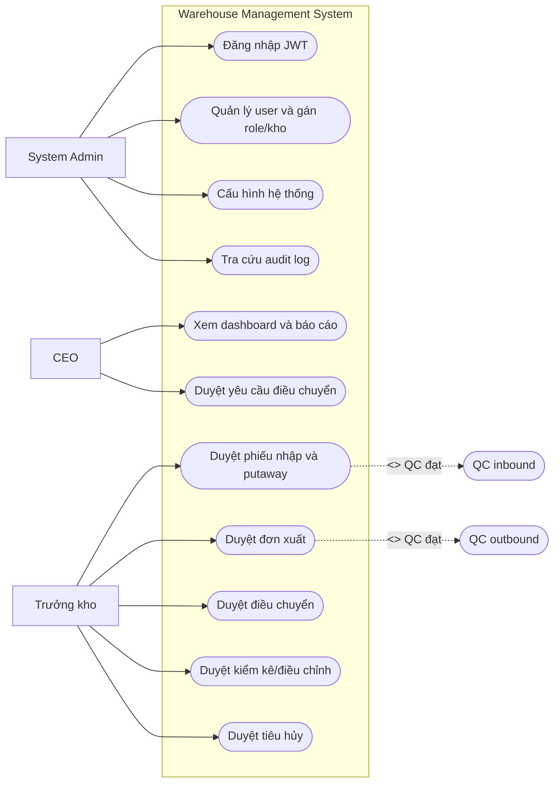

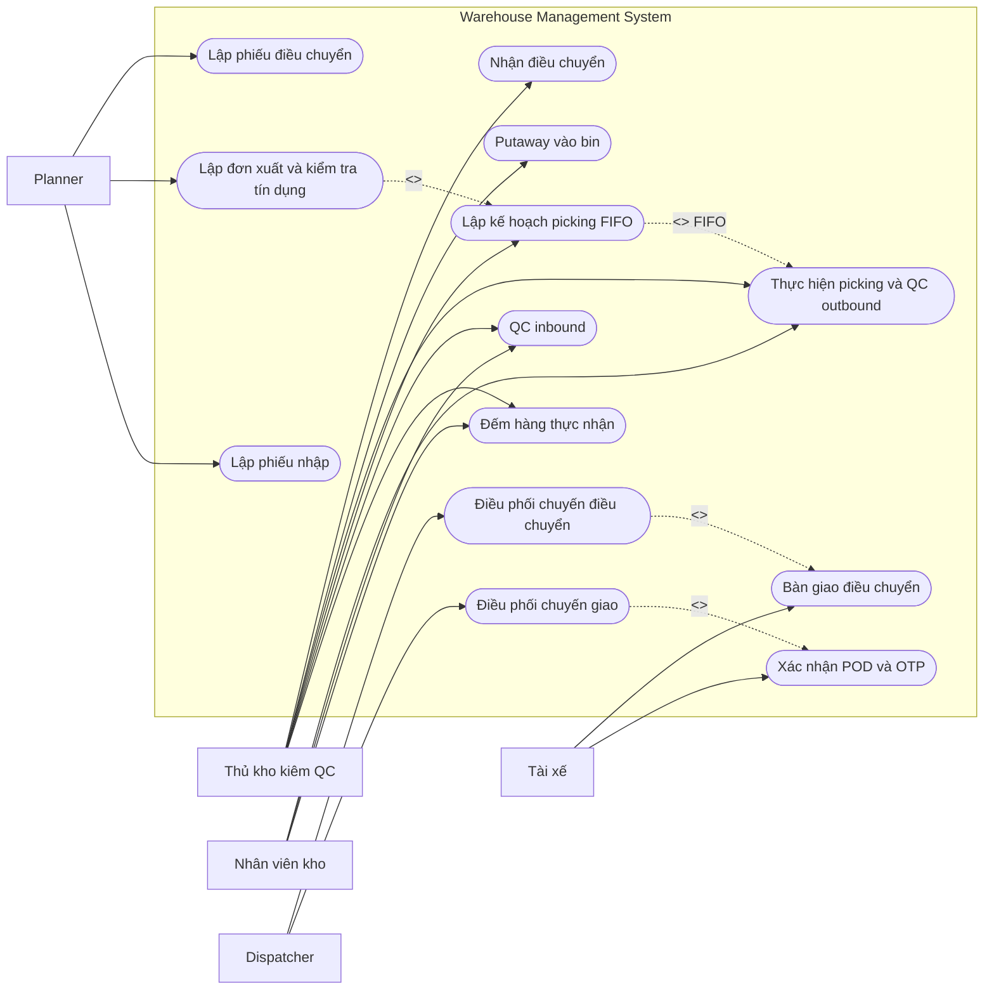

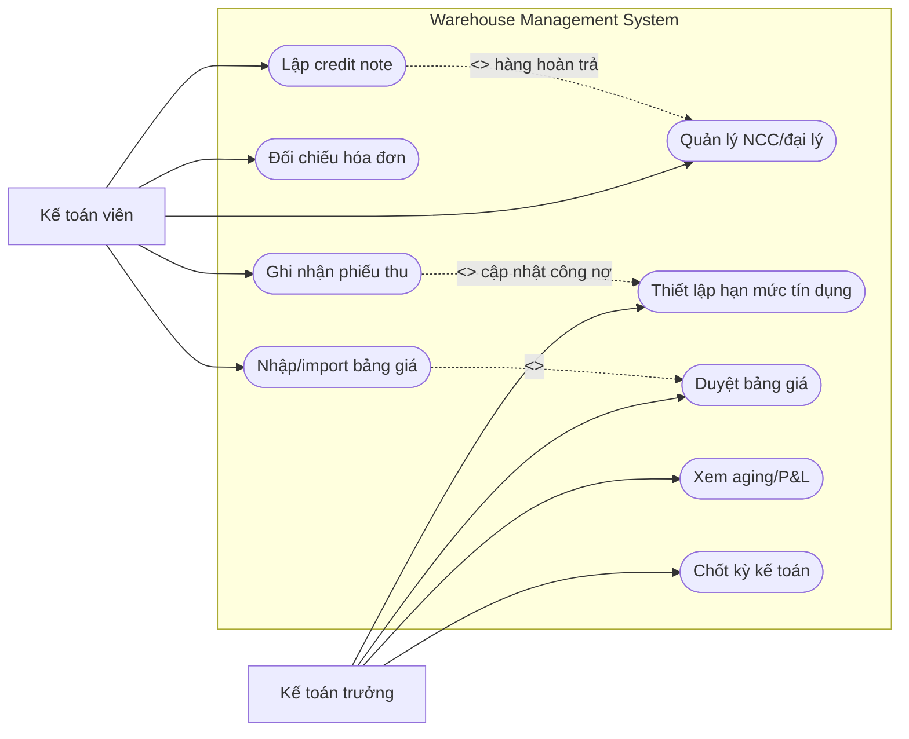

_Danh sách UC-01 đến UC-41 tại mục b là nguồn chuẩn cho từng use case; các sơ đồ trên chỉ nhóm chúng theo boundary nghiệp vụ để tránh che mất quan hệ khi đặt toàn bộ 41 UC trên một canvas._

#### b. Descriptions

| ID    | Feature                   | Use Case                                      | Use Case Description                                                                                                         |
| ----- | ------------------------- | --------------------------------------------- | ---------------------------------------------------------------------------------------------------------------------------- |
| UC-01 | 001 – System Config       | Configure System Parameters                   | System Admin cấu hình hạn mức công nợ mặc định, tồn kho tối thiểu mặc định, kỳ hạn thanh toán mặc định, ngày khóa kỳ kế toán |
| UC-02 | 001 – RBAC                | Manage Users & Role/Warehouse Assignment      | System Admin tạo/vô hiệu hóa tài khoản, gán Role + Chi nhánh Kho cho user                                                    |
| UC-03 | 001 – Auth                | Login (JWT)                                   | User đăng nhập bằng email/password, hệ thống trả JWT access/refresh token                                                    |
| UC-04 | 001 – Audit Log           | View Audit Log                                | System Admin tra cứu nhật ký hoạt động hệ thống (append-only, không cho sửa/xóa)                                             |
| UC-05 | 002 – Products            | Manage Product/SKU Catalog                    | Thủ kho kiêm QC tạo/cập nhật SKU, đơn vị tính, quy cách đóng gói                                                             |
| UC-06 | 002 – Warehouses          | Configure Warehouse Zones & Bin Locations     | Trưởng kho/Admin cấu hình Zone, Bin Location và sức chứa (capacity)                                                          |
| UC-07 | 002 – Partners            | Manage Dealer/Supplier & Credit Limit         | Kế toán viên quản lý hồ sơ NCC/Đại lý; Kế toán trưởng thiết lập Credit Limit                                                 |
| UC-08 | 002 – Fleet               | Manage Vehicles & Drivers                     | Dispatcher/Admin quản lý danh mục xe tải và tài xế nội bộ                                                                    |
| UC-09 | 003 – Receipt Drafting    | Create Purchase Receipt (Pending)             | Planner lập Lệnh nhập kho `PENDING_RECEIPT` từ thông tin Công ty mẹ gửi                                                      |
| UC-10 | 003 – Receipt Counting    | Record Physical Receive Count                 | Nhân viên kho đếm hàng thực tế, cập nhật `actual_qty`/`over_received_qty`, chuyển `DRAFT`                                    |
| UC-11 | 003 – QC Inbound          | Perform Inbound QC Inspection                 | Nhân viên kho/Thủ kho ghi nhận kết quả QC Đạt/Lỗi, chuyển `QC_COMPLETED`/`QC_FAILED`                                         |
| UC-12 | 003 – Quarantine          | Handle Quarantine & RTV                       | Trưởng kho tạo RTV "Trả NCC" cho hàng lỗi QC, Thủ kho xác nhận bàn giao NCC                                                  |
| UC-13 | 003 – Receipt Approval    | Approve/Reject Receipt & Putaway              | Trưởng kho duyệt phiếu nhập → mở khóa putaway; Thủ kho cất hàng vào Bin                                                      |
| UC-14 | 004 – Delivery Order      | Create Delivery Order (Credit Check)          | Planner lập Đơn xuất hàng, hệ thống tự Credit Check + reserve tồn kho                                                        |
| UC-15 | 004 – Picking Plan        | Create Picking Plan (FIFO)                    | Thủ kho lập kế hoạch lấy hàng từ batch/bin/zone theo FIFO                                                                    |
| UC-16 | 004 – Picking & QC        | Execute Picking & Outbound QC                 | Nhân viên kho lấy hàng theo kế hoạch, ghi QC; hàng fail vào Quarantine                                                       |
| UC-17 | 004 – Warehouse Approval  | Approve/Reject Delivery Order                 | Trưởng kho duyệt xuất kho sau khi đủ hàng QC đạt                                                                             |
| UC-18 | 004 – Trip Dispatch       | Dispatch Delivery Trip                        | Dispatcher lập Chuyến xe (`trip_type=DELIVERY`), gán xe/tài xế cùng kho                                                      |
| UC-19 | 004 – Driver Mobile POD   | Confirm Delivery (POD + OTP)                  | Tài xế upload ảnh hàng/chữ ký, nhập OTP; hệ thống chuyển DO `COMPLETED`                                                      |
| UC-20 | 004 – Auto Invoice        | Auto-create Invoice on Delivery               | Hệ thống tự tạo Invoice + cộng công nợ Đại lý khi DO giao thành công                                                         |
| UC-21 | 005 – Transfer Request    | View Cross-Warehouse Stock & Request Transfer | Trưởng kho kho thiếu xem tồn liên kho read-only, tạo yêu cầu điều chuyển gửi CEO                                             |
| UC-22 | 005 – Transfer Planning   | Create Transfer Order (TRF-\*)                | Planner lập Phiếu điều chuyển theo lệnh ngoài hoặc request đã CEO duyệt                                                      |
| UC-23 | 005 – Transfer Approval   | Approve/Reject Transfer & Reserve Stock       | Trưởng kho nguồn duyệt phiếu, giữ chỗ FIFO-eligible stock                                                                    |
| UC-24 | 005 – Transfer Ship       | Dispatch Trip & Ship Goods                    | Dispatcher lập chuyến `TTR-*`; Thủ kho nguồn QC + xuất hàng lên xe                                                           |
| UC-25 | 005 – Transfer Receive    | Receive & Confirm Transfer at Destination     | Công nhân đếm, Thủ kho kiểm/QC, Trưởng kho đích xác nhận cuối                                                                |
| UC-26 | 006 – Stocktake Count     | Create Stocktake & Record Count               | Thủ kho tạo phiếu kiểm kê, đếm thực tế, hệ thống tính Variance                                                               |
| UC-27 | 006 – Stocktake Approval  | Approve Inventory Adjustment                  | Trưởng kho duyệt hoặc từ chối điều chỉnh chênh lệch tồn kho trực tiếp, không phân cấp theo giá trị                          |
| UC-28 | 007 – Price Entry         | Create Price List (Cost + Selling)            | Kế toán viên nhập bản giá đơn lẻ theo kỳ hiệu lực                                                                            |
| UC-29 | 007 – Price Approval      | Approve Price List                            | Kế toán trưởng duyệt bảng giá trước khi có hiệu lực                                                                          |
| UC-30 | 007 – COGS Calculation    | Auto-calculate COGS                           | Hệ thống tự tính giá vốn hàng bán từ `price_history` snapshot                                                                |
| UC-31 | 008 – Customer Invoicing  | Track & Reconcile Invoice                     | Kế toán viên đối chiếu `billing_notifications` với Invoice tự động tạo                                                       |
| UC-32 | 008 – Payment Collection  | Record Payment Receipt                        | Kế toán viên ghi Phiếu thu, cấn trừ hóa đơn, hệ thống mở khóa tín dụng theo buffer 20%                                       |
| UC-33 | 008 – Aging Report        | View Credit Aging Report                      | Kế toán trưởng xem báo cáo phân kỳ công nợ                                                                                   |
| UC-34 | 008 – Period Closing      | Close Accounting Period                       | Kế toán trưởng chốt sổ kỳ, khóa cứng chứng từ                                                                                |
| UC-35 | 009 – Customer Returns    | Process Dealer Return (Credit Note)           | Thủ kho tiếp nhận hàng hoàn trả từ Đại lý, Kế toán viên lập Credit Note                                                      |
| UC-36 | 009 – Scrap Disposal      | Approve & Execute Disposal                    | Trưởng kho duyệt tiêu hủy hàng lỗi từ Quarantine                                                                             |
| UC-37 | 010 – CEO Dashboard       | View Management Dashboard                     | CEO xem KPI tồn kho, công nợ, P&L, tỷ lệ lỗi QC, OTD                                                                         |
| UC-38 | 010 – Low Stock Alert     | Trigger/Resolve Low Stock Alert               | Hệ thống tự cảnh báo khi tồn khả dụng dưới `reorder_point`                                                                   |
| UC-39 | 010 – Productivity Report | View/Export Productivity Report               | Trưởng kho xem/xuất báo cáo năng suất nhân viên kho                                                                          |
| UC-40 | 007 – Price Import        | Import Price List from Excel                  | Kế toán viên tải file Excel bảng giá, hệ thống kiểm tra định dạng/dòng dữ liệu và tạo bản giá nháp để tiếp tục duyệt         |
| UC-41 | 008 – Payment OCR         | Scan Payment Receipt with OCR                  | Kế toán viên tải ảnh chứng từ chuyển khoản, hệ thống OCR trích xuất dữ liệu để đối chiếu trước khi ghi nhận phiếu thu        |

## 2. Overall Functionalities

### 2.1 Screens Flow

Luồng màn hình chính theo từng nhóm nghiệp vụ. Đúng quy ước của template: hình chữ nhật là screen/route, hình bo tròn là popup, và cụm có dấu `[/ /]` là screen nhiều tab.

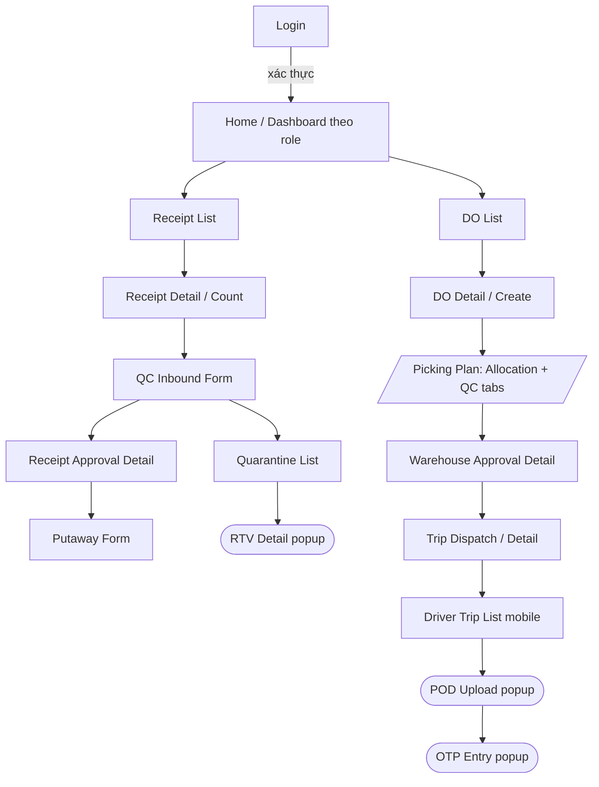

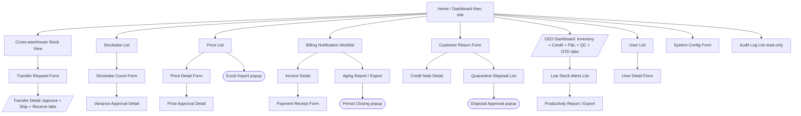

Quy ước: màn hình dạng oval/pop-up (VD: RTV Detail, OTP Entry, Excel Import, Period Closing Confirm) là các thao tác xác nhận nhanh không rời khỏi ngữ cảnh màn hình cha. Màn hình có nhiều tab (VD: Picking Plan, Transfer Detail, CEO Dashboard) chứa nhiều nhóm thông tin liên quan trên cùng một đối tượng nghiệp vụ.

### 2.2 Screen Descriptions

| #   | Feature           | Screen                        | Description                                                                    |
| --- | ----------------- | ----------------------------- | ------------------------------------------------------------------------------ |
| 1   | Inbound Receipt   | Receipt List                  | Danh sách phiếu nhập theo trạng thái, filter theo kho/Planner/khoảng thời gian |
| 2   | Inbound Receipt   | Receipt Detail (Count)        | Nhân viên kho nhập số lượng đếm thực tế cho từng dòng hàng                     |
| 3   | Inbound Receipt   | QC Inbound Form               | Ghi nhận kết quả QC Đạt/Lỗi kèm lý do chi tiết cho từng dòng                   |
| 4   | Inbound Receipt   | Quarantine/RTV Detail         | Trưởng kho tạo RTV, Thủ kho xác nhận bàn giao NCC                              |
| 5   | Inbound Receipt   | Receipt Approval Detail       | Trưởng kho duyệt/từ chối phiếu nhập; Thủ kho putaway vào Bin                   |
| 6   | Outbound Delivery | Delivery Order List           | Danh sách DO theo trạng thái, filter theo Đại lý/kho                           |
| 7   | Outbound Delivery | Delivery Order Detail         | Planner tạo DO, hệ thống hiển thị kết quả Credit Check                         |
| 8   | Outbound Delivery | Picking Plan Screen           | Thủ kho chọn batch/bin/zone theo FIFO cho từng dòng DO                         |
| 9   | Outbound Delivery | Picking & QC Execution        | Nhân viên kho ghi nhận kết quả lấy hàng/QC theo allocation                     |
| 10  | Outbound Delivery | Warehouse Approval Detail     | Trưởng kho duyệt/từ chối xuất kho                                              |
| 11  | Outbound Delivery | Trip Dispatch Screen          | Dispatcher gom DO vào chuyến, gán xe/tài xế, sắp Stop Order                    |
| 12  | Outbound Delivery | Driver Trip List (Mobile)     | Tài xế xem danh sách chuyến/DO được gán                                        |
| 13  | Outbound Delivery | POD Upload (Mobile)           | Tài xế chụp/chọn ảnh hàng + ảnh chữ ký                                         |
| 14  | Outbound Delivery | OTP Entry (Mobile)            | Tài xế nhập OTP do Đại lý đọc để xác nhận giao                                 |
| 15  | Transfer          | Cross-Warehouse Stock View    | Trưởng kho xem tồn khả dụng liên kho read-only                                 |
| 16  | Transfer          | Transfer Request Form         | Trưởng kho tạo yêu cầu điều chuyển gửi CEO duyệt                               |
| 17  | Transfer          | Transfer Detail (Approve)     | Trưởng kho nguồn duyệt/từ chối phiếu `TRF-*`                                   |
| 18  | Transfer          | Transfer Ship Screen          | Thủ kho nguồn QC + ghi nhận xuất hàng lên xe                                   |
| 19  | Transfer          | Transfer Receive Screen       | Công nhân đếm → Thủ kho kiểm/QC → Trưởng kho đích xác nhận                     |
| 20  | Stocktake         | Stocktake Count Screen        | Thủ kho nhập số lượng đếm thực tế theo Bin                                     |
| 21  | Stocktake         | Variance Approval Detail      | Trưởng kho/CEO duyệt điều chỉnh tồn kho theo hạn mức                           |
| 22  | Pricing           | Price List Screen             | Kế toán viên tạo/sửa bảng giá theo kỳ hiệu lực                                 |
| 23  | Pricing           | Price Approval Detail         | Kế toán trưởng duyệt bảng giá                                                  |
| 24  | Pricing           | Excel Import Popup            | Kế toán viên import bảng giá hàng loạt từ file mẫu                             |
| 25  | Finance           | Billing Notification Worklist | Kế toán viên xem danh sách DO đã giao chờ đối chiếu invoice                    |
| 26  | Finance           | Invoice Detail                | Xem chi tiết hóa đơn, thông tin đối chứng POD/OTP                              |
| 27  | Finance           | Payment Receipt Form          | Kế toán viên ghi nhận Phiếu thu, cấn trừ hóa đơn                               |
| 28  | Finance           | Aging Report Screen           | Kế toán trưởng xem báo cáo phân kỳ công nợ, export                             |
| 29  | Finance           | Period Closing Popup          | Kế toán trưởng xác nhận chốt sổ kỳ                                             |
| 30  | Returns/Disposal  | Customer Return Form          | Thủ kho ghi nhận hàng hoàn trả từ Đại lý                                       |
| 31  | Returns/Disposal  | Disposal Approval Detail      | Trưởng kho duyệt tiêu hủy hàng lỗi từ Quarantine                               |
| 32  | Reports           | CEO Dashboard                 | CEO xem KPI tổng hợp toàn hệ thống                                             |
| 33  | Reports           | Low Stock Alerts List         | Trưởng kho/Planner xem cảnh báo tồn kho thấp                                   |
| 34  | Reports           | Productivity Report Screen    | Trưởng kho xem/xuất báo cáo năng suất nhân viên                                |
| 35  | Admin             | User List / User Detail       | System Admin quản lý tài khoản, gán role + kho                                 |
| 36  | Admin             | System Config Screen          | System Admin cấu hình tham số hệ thống                                         |
| 37  | Admin             | Audit Log Screen              | System Admin tra cứu nhật ký hoạt động                                         |

### 2.3 Screen Authorization

| Screen Group                  | CEO         | System Admin | Trưởng kho  | Kế toán trưởng   | Planner    | Dispatcher | Thủ kho     | Nhân viên kho | Kế toán viên    | Tài xế |
| ----------------------------- | ----------- | ------------ | ----------- | ---------------- | ---------- | ---------- | ----------- | ------------- | --------------- | ------ |
| System Config / RBAC          |             | X            |             |                  |            |            |             |               |                 |        |
| Audit Log (query all)         |             | X            |             |                  |            |            |             |               |                 |        |
| Product/SKU Catalog           |             |              | X (view)    |                  |            |            | X           |               |                 |        |
| Warehouse/Bin Config          | X (approve) | X            | X           |                  |            |            |             |               |                 |        |
| Dealer/Supplier Mgmt          |             |              |             | X (Credit Limit) |            |            |             |               | X               |        |
| Vehicle/Driver Catalog        |             | X            |             |                  |            | X          |             |               |                 |        |
| Receipt Drafting              |             |              |             |                  | X          |            |             |               |                 |        |
| Receipt Counting              |             |              |             |                  |            |            | X (view)    | X             |                 |        |
| QC Inbound                    |             |              |             |                  |            |            | X           | X             |                 |        |
| Quarantine/RTV                |             |              | X           |                  |            |            | X (confirm) |               |                 |        |
| Receipt Approval/Putaway      |             |              | X           |                  |            |            | X (putaway) |               |                 |        |
| Delivery Order Create         |             |              |             |                  | X          |            |             |               |                 |        |
| Picking Plan                  |             |              |             |                  |            |            | X           |               |                 |        |
| Picking & Outbound QC         |             |              |             |                  |            |            | X (view)    | X             |                 |        |
| Warehouse Approval (DO)       |             |              | X           |                  |            |            |             |               |                 |        |
| Trip Dispatch                 |             |              |             |                  |            | X          |             |               |                 |        |
| Driver Mobile POD/OTP         |             |              |             |                  |            |            |             |               |                 | X      |
| Auto Invoice (system)         |             |              |             |                  |            |            |             |               | X (view)        |        |
| Cross-WH Stock (read-only)    | X           |              | X           |                  |            |            |             |               |                 |        |
| Transfer Request → CEO        | X (approve) |              | X (create)  |                  |            |            |             |               |                 |        |
| Transfer Planning             |             |              |             |                  | X          |            |             |               |                 |        |
| Transfer Approval             |             |              | X           |                  |            |            |             |               |                 |        |
| Transfer Ship                 |             |              |             |                  |            | X (trip)   | X (QC/ship) | X (load)      |                 |        |
| Transfer Receive              |             |              | X (final)   |                  |            |            | X (QC)      | X (count)     |                 |        |
| Stocktake Count               |             |              |             |                  |            |            | X           |               |                 |        |
| Stocktake/Adjustment Approval |             |              | X           |                  |            |            |             |               |                 |        |
| Price Entry/Import            |             |              |             |                  |            |            |             |               | X               |        |
| Price Approval                |             |              |             | X                |            |            |             |               |                 |        |
| Customer Invoicing (view)     |             |              |             |                  |            |            |             |               | X               |        |
| Payment Collection            |             |              |             |                  |            |            |             |               | X               |        |
| Aging Report / P&L            | X (view)    |              |             | X                |            |            |             |               |                 |        |
| Period Closing                |             |              |             | X                |            |            |             |               |                 |        |
| Customer Returns              |             |              |             |                  |            |            | X           |               | X (Credit Note) |        |
| Scrap Disposal Approval       |             |              | X           |                  |            |            |             |               |                 |        |
| CEO Dashboard                 | X           |              |             | X (financial)    |            |            |             |               |                 |        |
| Low Stock Alerts              |             |              | X (own WH)  |                  | X (all WH) |            |             |               |                 |        |
| Productivity Report           |             |              | X           |                  |            |            |             |               |                 |        |

_Ghi chú: mọi API/screen thuộc phạm vi kho (warehouse-scoped) phải kiểm tra CẢ role LẪN warehouse assignment của user (không chỉ role) — xem `AGENTS.md` mục WMS Domain Rules._

### 2.4 Non-UI Functions

| #   | Feature           | System Function                  | Description                                                                                                                                                                                     |
| --- | ----------------- | -------------------------------- | ----------------------------------------------------------------------------------------------------------------------------------------------------------------------------------------------- |
| 1   | Outbound Delivery | Auto-Invoice Creation            | Event-driven service (`AutoInvoiceService`), kích hoạt ngay khi Tài xế xác nhận POD + OTP hợp lệ cho full DO: tạo `invoices`, cộng `dealers.current_balance`, chuyển DO sang `COMPLETED`.       |
| 2   | Finance           | Daily Credit-Hold Job            | Cron job cuối ngày quét toàn bộ hóa đơn `UNPAID`/`PARTIALLY_PAID` quá hạn thanh toán > `CREDIT_HOLD_OVERDUE_DAYS` (mặc định 30 ngày), tự động cập nhật `dealers.credit_status = 'CREDIT_HOLD'`. |
| 3   | Reports & Alerts  | Low Stock Alert Trigger/Resolve  | Service tính lại tồn khả dụng mỗi khi có biến động (nhập/xuất/điều chuyển/điều chỉnh); tạo `stock_alerts` khi dưới `reorder_point`, tự đóng khi hồi phục.                                       |
| 4   | Outbound Delivery | Delivery OTP Email Sending       | Service gửi OTP 6 số qua email cho Đại lý khi tài xế yêu cầu xác thực giao hàng; hiệu lực 5 phút, không lưu raw OTP.                                                                            |
| 5   | Finance           | Monthly Period Closing           | Batch job hỗ trợ Kế toán trưởng khóa cứng toàn bộ chứng từ có `transaction_date` trong kỳ đã đóng.                                                                                              |
| 6   | Master Data       | COGS Auto-Calculation            | Service snapshot giá vốn/giá bán từ `price_history` khi Planner tạo Delivery Order.                                                                                                             |
| 7   | Transfer          | Trip Overdue Detection           | Service tính overdue flag cho `TTR-*` khi quá hạn dự kiến còn `IN_TRANSIT`, chặn receive tại kho đích cho tới khi có Return to Source.                                                          |
| 8   | Security          | JWT Refresh & Session Validation | Filter xác thực JWT trước mọi request (trừ `/auth/login`, `/auth/refresh`, Swagger).                                                                                                            |

## 3. System High Level Design

> **Quy ước template:** Các mục “SQL Commands” ở Phần III là mô tả truy cập dữ liệu ở mức thiết kế, không phải SQL được phép chạy từ application. Backend bắt buộc dùng Spring Data JPA/Hibernate; khi cần triển khai, repository/entity và Flyway migration là nguồn chính xác để map query. Không sao chép các câu SQL trong tài liệu vào production code.

### 3.1 Database Design

#### a. Database Schema

Schema chính chia theo 10 domain: `Security & Audit`, `Master Data`, `Inbound`, `Outbound & Delivery`, `Transfer`, `Stocktake`, `Pricing`, `Finance`, `Returns/Disposal`, `Reporting/Alerts`. Metadata xuất trực tiếp từ VPS xác nhận **55 bảng WMS + `flyway_schema_history` = 56 bảng**, thêm **3 view chỉ đọc**; tổng cộng **746 cột** và **227 FK**. Flyway VPS đang có V1–V13 thành công; **V14 chưa được áp dụng**. Toàn bộ cột, PK, FK, nullable/default, 3 view và FK matrix được giữ trong [VPS Database Schema Catalog](VPS-DATABASE-SCHEMA-CATALOG.md); [VPS Database Relationship Atlas](VPS-DATABASE-SCHEMA-ERD.md) chia 227 FK thành 9 ERD theo domain để kiểm tra trực quan mà không làm một sơ đồ khổng lồ không đọc được.


<!-- VPS_SCHEMA_ATLAS_START -->

#### Full VPS relationship atlas — 56 tables / 227 FK

> Diagram source is the same VPS constraint export as [VPS Database Schema Catalog](VPS-DATABASE-SCHEMA-CATALOG.md). The atlas deliberately uses **domain-sized ERDs**: one giant diagram for 56 tables/227 FK is unreadable. Every physical table appears as a child in exactly one section; every FK emitted under that child is an actual production constraint.

##### Reading rules

- `PARENT ||--o{ CHILD` means one parent row can be referenced by zero or many child rows. Nullable FK is detailed in the catalog; it does not turn the parent-to-child relationship into mandatory existence.
- Attributes show the table PK and FK columns only, so the diagrams remain legible. The catalog lists all 746 columns, nullability and defaults.
- `flyway_schema_history` has no FK and is intentionally separated. Views are read-only projections and do not have physical FK constraints.

##### 01 Security, configuration and master data

**Coverage:** `users`, `user_warehouse_assignments`, `warehouses`, `warehouse_locations`, `system_configs`, `document_sequences`, `audit_logs`, `notifications`, `products`, `suppliers`, `dealers`, `vehicles`, `drivers`. **FK shown:** 28.

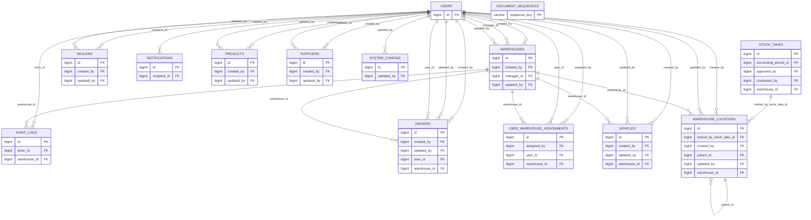

##### 02 Purchasing and inbound

**Coverage:** `purchase_orders`, `purchase_order_items`, `receipts`, `receipt_items`, `batches`, `quarantine_records`, `debit_notes`. **FK shown:** 33.

```mermaid
erDiagram
  PRODUCTS ||--o{ BATCHES : product_id
  WAREHOUSES ||--o{ BATCHES : warehouse_id
  ACCOUNTING_PERIODS ||--o{ DEBIT_NOTES : accounting_period_id
  USERS ||--o{ DEBIT_NOTES : created_by
  RECEIPTS ||--o{ DEBIT_NOTES : receipt_id
  SUPPLIERS ||--o{ DEBIT_NOTES : supplier_id
  PURCHASE_ORDERS ||--o{ PURCHASE_ORDER_ITEMS : po_id
  PRODUCTS ||--o{ PURCHASE_ORDER_ITEMS : product_id
  USERS ||--o{ PURCHASE_ORDERS : created_by
  SUPPLIERS ||--o{ PURCHASE_ORDERS : supplier_id
  WAREHOUSES ||--o{ PURCHASE_ORDERS : warehouse_id
  DELIVERY_ORDER_ITEM_ALLOCATIONS ||--o{ QUARANTINE_RECORDS : allocation_id
  BATCHES ||--o{ QUARANTINE_RECORDS : batch_id
  USERS ||--o{ QUARANTINE_RECORDS : created_by
  DELIVERY_ORDERS ||--o{ QUARANTINE_RECORDS : delivery_order_id
  DELIVERY_ORDER_ITEMS ||--o{ QUARANTINE_RECORDS : do_item_id
  WAREHOUSE_LOCATIONS ||--o{ QUARANTINE_RECORDS : location_id
  PRODUCTS ||--o{ QUARANTINE_RECORDS : product_id
  INTER_WAREHOUSE_TRANSFERS ||--o{ QUARANTINE_RECORDS : transfer_id
  INTER_WAREHOUSE_TRANSFER_ITEMS ||--o{ QUARANTINE_RECORDS : transfer_item_id
  WAREHOUSES ||--o{ QUARANTINE_RECORDS : warehouse_id
  BATCHES ||--o{ RECEIPT_ITEMS : batch_id
  WAREHOUSE_LOCATIONS ||--o{ RECEIPT_ITEMS : location_id
  PRODUCTS ||--o{ RECEIPT_ITEMS : product_id
  USERS ||--o{ RECEIPT_ITEMS : qc_by
  RECEIPTS ||--o{ RECEIPT_ITEMS : receipt_id
  ACCOUNTING_PERIODS ||--o{ RECEIPTS : accounting_period_id
  USERS ||--o{ RECEIPTS : approved_by
  USERS ||--o{ RECEIPTS : created_by
  DEALERS ||--o{ RECEIPTS : dealer_id
  DELIVERY_ORDERS ||--o{ RECEIPTS : delivery_order_id
  SUPPLIERS ||--o{ RECEIPTS : supplier_id
  WAREHOUSES ||--o{ RECEIPTS : warehouse_id
  ACCOUNTING_PERIODS {
    bigint id PK
    bigint closed_by FK
  }
  BATCHES {
    bigint id PK
    bigint product_id FK
    bigint warehouse_id FK
  }
  DEALERS {
    bigint id PK
    bigint created_by FK
    bigint updated_by FK
  }
  DEBIT_NOTES {
    bigint id PK
    bigint accounting_period_id FK
    bigint created_by FK
    bigint receipt_id FK
    bigint supplier_id FK
  }
  DELIVERY_ORDER_ITEM_ALLOCATIONS {
    bigint id PK
    bigint batch_id FK
    bigint created_by FK
    bigint do_item_id FK
    bigint inventory_id FK
    bigint location_id FK
    bigint replaced_allocation_id FK
    bigint zone_id FK
  }
  DELIVERY_ORDER_ITEMS {
    bigint id PK
    bigint batch_id FK
    bigint do_id FK
    bigint location_id FK
    bigint picked_by FK
    bigint product_id FK
    bigint zone_id FK
  }
  DELIVERY_ORDERS {
    bigint id PK
    bigint accounting_period_id FK
    bigint created_by FK
    bigint dealer_id FK
    bigint packed_by FK
    bigint qc_by FK
    bigint warehouse_id FK
  }
  INTER_WAREHOUSE_TRANSFER_ITEMS {
    bigint id PK
    bigint batch_id FK
    bigint checked_by FK
    bigint destination_location_id FK
    bigint product_id FK
    bigint source_location_id FK
    bigint transfer_id FK
  }
  INTER_WAREHOUSE_TRANSFERS {
    bigint id PK
    bigint arrival_handover_by FK
    bigint load_handover_by FK
    bigint outbound_qc_by FK
    bigint return_approved_by FK
    bigint return_arrival_handover_by FK
    bigint return_rejected_by FK
    bigint return_requested_by FK
    bigint transfer_request_id FK
    bigint accounting_period_id FK
    bigint approved_by FK
    bigint confirmed_by FK
    bigint created_by FK
    bigint destination_warehouse_id FK
    bigint rejected_by FK
    bigint source_warehouse_id FK
    bigint trip_id FK
  }
  PRODUCTS {
    bigint id PK
    bigint created_by FK
    bigint updated_by FK
  }
  PURCHASE_ORDER_ITEMS {
    bigint id PK
    bigint po_id FK
    bigint product_id FK
  }
  PURCHASE_ORDERS {
    bigint id PK
    bigint created_by FK
    bigint supplier_id FK
    bigint warehouse_id FK
  }
  QUARANTINE_RECORDS {
    bigint id PK
    bigint allocation_id FK
    bigint batch_id FK
    bigint created_by FK
    bigint delivery_order_id FK
    bigint do_item_id FK
    bigint location_id FK
    bigint product_id FK
    bigint transfer_id FK
    bigint transfer_item_id FK
    bigint warehouse_id FK
  }
  RECEIPT_ITEMS {
    bigint id PK
    bigint batch_id FK
    bigint location_id FK
    bigint product_id FK
    bigint qc_by FK
    bigint receipt_id FK
  }
  RECEIPTS {
    bigint id PK
    bigint accounting_period_id FK
    bigint approved_by FK
    bigint created_by FK
    bigint dealer_id FK
    bigint delivery_order_id FK
    bigint supplier_id FK
    bigint warehouse_id FK
  }
  SUPPLIERS {
    bigint id PK
    bigint created_by FK
    bigint updated_by FK
  }
  USERS {
    bigint id PK
  }
  WAREHOUSE_LOCATIONS {
    bigint id PK
    bigint locked_by_stock_take_id FK
    bigint created_by FK
    bigint parent_id FK
    bigint updated_by FK
    bigint warehouse_id FK
  }
  WAREHOUSES {
    bigint id PK
    bigint created_by FK
    bigint manager_id FK
    bigint updated_by FK
  }
```

##### 03 Inventory and reservation

**Coverage:** `inventories`, `warehouse_product_reservations`, `stock_alerts`, `price_history`. **FK shown:** 13.

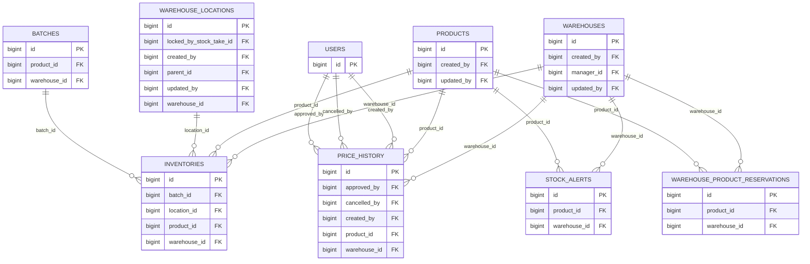

##### 04 Outbound order and allocation

**Coverage:** `delivery_orders`, `delivery_order_items`, `delivery_order_approvals`, `delivery_order_warehouse_approvals`, `delivery_order_item_allocations`, `delivery_order_item_replacements`, `delivery_order_item_return_to_bin_records`, `outbound_qc_records`. **FK shown:** 49.

```mermaid
erDiagram
  USERS ||--o{ DELIVERY_ORDER_APPROVALS : approver_id
  DELIVERY_ORDERS ||--o{ DELIVERY_ORDER_APPROVALS : do_id
  BATCHES ||--o{ DELIVERY_ORDER_ITEM_ALLOCATIONS : batch_id
  USERS ||--o{ DELIVERY_ORDER_ITEM_ALLOCATIONS : created_by
  DELIVERY_ORDER_ITEMS ||--o{ DELIVERY_ORDER_ITEM_ALLOCATIONS : do_item_id
  INVENTORIES ||--o{ DELIVERY_ORDER_ITEM_ALLOCATIONS : inventory_id
  WAREHOUSE_LOCATIONS ||--o{ DELIVERY_ORDER_ITEM_ALLOCATIONS : location_id
  DELIVERY_ORDER_ITEM_ALLOCATIONS ||--o{ DELIVERY_ORDER_ITEM_ALLOCATIONS : replaced_allocation_id
  WAREHOUSE_LOCATIONS ||--o{ DELIVERY_ORDER_ITEM_ALLOCATIONS : zone_id
  USERS ||--o{ DELIVERY_ORDER_ITEM_REPLACEMENTS : created_by
  DELIVERY_ORDER_ITEMS ||--o{ DELIVERY_ORDER_ITEM_REPLACEMENTS : do_item_id
  BATCHES ||--o{ DELIVERY_ORDER_ITEM_REPLACEMENTS : failed_batch_id
  INVENTORIES ||--o{ DELIVERY_ORDER_ITEM_REPLACEMENTS : failed_inventory_id
  WAREHOUSE_LOCATIONS ||--o{ DELIVERY_ORDER_ITEM_REPLACEMENTS : failed_location_id
  BATCHES ||--o{ DELIVERY_ORDER_ITEM_REPLACEMENTS : replacement_batch_id
  INVENTORIES ||--o{ DELIVERY_ORDER_ITEM_REPLACEMENTS : replacement_inventory_id
  WAREHOUSE_LOCATIONS ||--o{ DELIVERY_ORDER_ITEM_REPLACEMENTS : replacement_location_id
  WAREHOUSE_LOCATIONS ||--o{ DELIVERY_ORDER_ITEM_RETURN_TO_BIN_RECORDS : original_location_id
  WAREHOUSE_LOCATIONS ||--o{ DELIVERY_ORDER_ITEM_RETURN_TO_BIN_RECORDS : source_location_id
  DELIVERY_ORDER_ITEM_ALLOCATIONS ||--o{ DELIVERY_ORDER_ITEM_RETURN_TO_BIN_RECORDS : allocation_id
  BATCHES ||--o{ DELIVERY_ORDER_ITEM_RETURN_TO_BIN_RECORDS : batch_id
  USERS ||--o{ DELIVERY_ORDER_ITEM_RETURN_TO_BIN_RECORDS : created_by
  DELIVERY_ORDER_ITEMS ||--o{ DELIVERY_ORDER_ITEM_RETURN_TO_BIN_RECORDS : do_item_id
  WAREHOUSE_LOCATIONS ||--o{ DELIVERY_ORDER_ITEM_RETURN_TO_BIN_RECORDS : original_zone_id
  PRODUCTS ||--o{ DELIVERY_ORDER_ITEM_RETURN_TO_BIN_RECORDS : product_id
  BATCHES ||--o{ DELIVERY_ORDER_ITEMS : batch_id
  DELIVERY_ORDERS ||--o{ DELIVERY_ORDER_ITEMS : do_id
  WAREHOUSE_LOCATIONS ||--o{ DELIVERY_ORDER_ITEMS : location_id
  USERS ||--o{ DELIVERY_ORDER_ITEMS : picked_by
  PRODUCTS ||--o{ DELIVERY_ORDER_ITEMS : product_id
  WAREHOUSE_LOCATIONS ||--o{ DELIVERY_ORDER_ITEMS : zone_id
  USERS ||--o{ DELIVERY_ORDER_WAREHOUSE_APPROVALS : approver_id
  DELIVERY_ORDERS ||--o{ DELIVERY_ORDER_WAREHOUSE_APPROVALS : do_id
  ACCOUNTING_PERIODS ||--o{ DELIVERY_ORDERS : accounting_period_id
  USERS ||--o{ DELIVERY_ORDERS : created_by
  DEALERS ||--o{ DELIVERY_ORDERS : dealer_id
  USERS ||--o{ DELIVERY_ORDERS : packed_by
  USERS ||--o{ DELIVERY_ORDERS : qc_by
  WAREHOUSES ||--o{ DELIVERY_ORDERS : warehouse_id
  DELIVERY_ORDER_ITEM_ALLOCATIONS ||--o{ OUTBOUND_QC_RECORDS : allocation_id
  BATCHES ||--o{ OUTBOUND_QC_RECORDS : batch_id
  USERS ||--o{ OUTBOUND_QC_RECORDS : created_by
  DELIVERY_ORDERS ||--o{ OUTBOUND_QC_RECORDS : do_id
  DELIVERY_ORDER_ITEMS ||--o{ OUTBOUND_QC_RECORDS : do_item_id
  WAREHOUSE_LOCATIONS ||--o{ OUTBOUND_QC_RECORDS : location_id
  WAREHOUSE_LOCATIONS ||--o{ OUTBOUND_QC_RECORDS : quarantine_location_id
  QUARANTINE_RECORDS ||--o{ OUTBOUND_QC_RECORDS : quarantine_record_id
  WAREHOUSE_LOCATIONS ||--o{ OUTBOUND_QC_RECORDS : staging_location_id
  WAREHOUSE_LOCATIONS ||--o{ OUTBOUND_QC_RECORDS : zone_id
  ACCOUNTING_PERIODS {
    bigint id PK
    bigint closed_by FK
  }
  BATCHES {
    bigint id PK
    bigint product_id FK
    bigint warehouse_id FK
  }
  DEALERS {
    bigint id PK
    bigint created_by FK
    bigint updated_by FK
  }
  DELIVERY_ORDER_APPROVALS {
    bigint id PK
    bigint approver_id FK
    bigint do_id FK
  }
  DELIVERY_ORDER_ITEM_ALLOCATIONS {
    bigint id PK
    bigint batch_id FK
    bigint created_by FK
    bigint do_item_id FK
    bigint inventory_id FK
    bigint location_id FK
    bigint replaced_allocation_id FK
    bigint zone_id FK
  }
  DELIVERY_ORDER_ITEM_REPLACEMENTS {
    bigint id PK
    bigint created_by FK
    bigint do_item_id FK
    bigint failed_batch_id FK
    bigint failed_inventory_id FK
    bigint failed_location_id FK
    bigint replacement_batch_id FK
    bigint replacement_inventory_id FK
    bigint replacement_location_id FK
  }
  DELIVERY_ORDER_ITEM_RETURN_TO_BIN_RECORDS {
    bigint id PK
    bigint original_location_id FK
    bigint source_location_id FK
    bigint allocation_id FK
    bigint batch_id FK
    bigint created_by FK
    bigint do_item_id FK
    bigint original_zone_id FK
    bigint product_id FK
  }
  DELIVERY_ORDER_ITEMS {
    bigint id PK
    bigint batch_id FK
    bigint do_id FK
    bigint location_id FK
    bigint picked_by FK
    bigint product_id FK
    bigint zone_id FK
  }
  DELIVERY_ORDER_WAREHOUSE_APPROVALS {
    bigint id PK
    bigint approver_id FK
    bigint do_id FK
  }
  DELIVERY_ORDERS {
    bigint id PK
    bigint accounting_period_id FK
    bigint created_by FK
    bigint dealer_id FK
    bigint packed_by FK
    bigint qc_by FK
    bigint warehouse_id FK
  }
  INVENTORIES {
    bigint id PK
    bigint batch_id FK
    bigint location_id FK
    bigint product_id FK
    bigint warehouse_id FK
  }
  OUTBOUND_QC_RECORDS {
    bigint id PK
    bigint allocation_id FK
    bigint batch_id FK
    bigint created_by FK
    bigint do_id FK
    bigint do_item_id FK
    bigint location_id FK
    bigint quarantine_location_id FK
    bigint quarantine_record_id FK
    bigint staging_location_id FK
    bigint zone_id FK
  }
  PRODUCTS {
    bigint id PK
    bigint created_by FK
    bigint updated_by FK
  }
  QUARANTINE_RECORDS {
    bigint id PK
    bigint allocation_id FK
    bigint batch_id FK
    bigint created_by FK
    bigint delivery_order_id FK
    bigint do_item_id FK
    bigint location_id FK
    bigint product_id FK
    bigint transfer_id FK
    bigint transfer_item_id FK
    bigint warehouse_id FK
  }
  USERS {
    bigint id PK
  }
  WAREHOUSE_LOCATIONS {
    bigint id PK
    bigint locked_by_stock_take_id FK
    bigint created_by FK
    bigint parent_id FK
    bigint updated_by FK
    bigint warehouse_id FK
  }
  WAREHOUSES {
    bigint id PK
    bigint created_by FK
    bigint manager_id FK
    bigint updated_by FK
  }
```

##### 05 Delivery execution

**Coverage:** `trips`, `trip_delivery_orders`, `deliveries`, `delivery_otp_attempts`, `wrong_sku_reports`, `wrong_sku_report_items`. **FK shown:** 18.

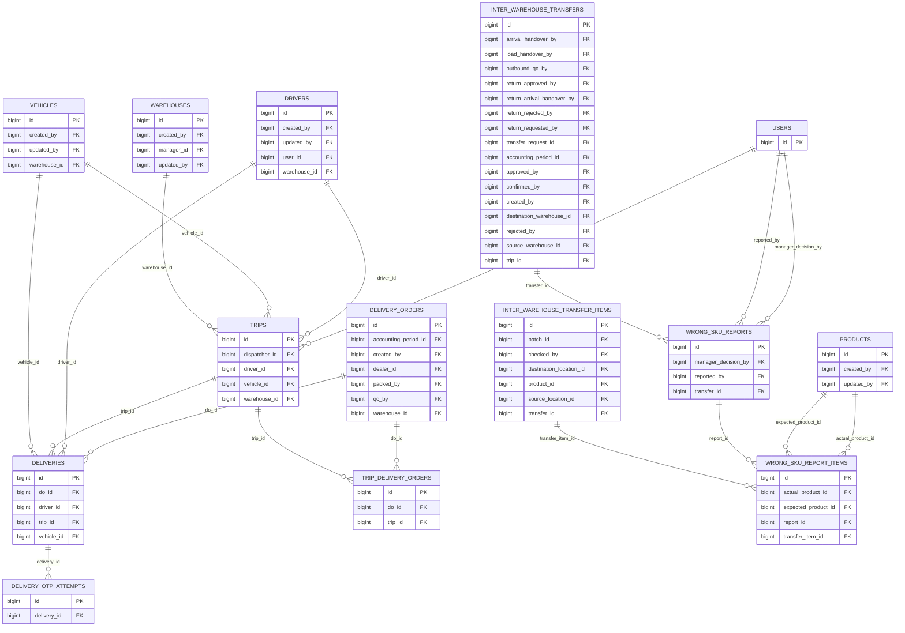

##### 06 Transfer planning and execution

**Coverage:** `transfer_requests`, `transfer_request_items`, `inter_warehouse_transfers`, `inter_warehouse_transfer_items`, `inter_warehouse_transfer_allocations`, `discrepancy_incidents`, `discrepancy_hold_entries`. **FK shown:** 42.

```mermaid
erDiagram
  BATCHES ||--o{ DISCREPANCY_HOLD_ENTRIES : batch_id
  WAREHOUSE_LOCATIONS ||--o{ DISCREPANCY_HOLD_ENTRIES : hold_location_id
  DISCREPANCY_INCIDENTS ||--o{ DISCREPANCY_HOLD_ENTRIES : incident_id
  PRODUCTS ||--o{ DISCREPANCY_HOLD_ENTRIES : product_id
  WAREHOUSES ||--o{ DISCREPANCY_HOLD_ENTRIES : warehouse_id
  PRODUCTS ||--o{ DISCREPANCY_INCIDENTS : product_id
  USERS ||--o{ DISCREPANCY_INCIDENTS : resolved_by
  INTER_WAREHOUSE_TRANSFERS ||--o{ DISCREPANCY_INCIDENTS : transfer_id
  INVENTORIES ||--o{ INTER_WAREHOUSE_TRANSFER_ALLOCATIONS : inventory_id
  INTER_WAREHOUSE_TRANSFER_ITEMS ||--o{ INTER_WAREHOUSE_TRANSFER_ALLOCATIONS : transfer_item_id
  BATCHES ||--o{ INTER_WAREHOUSE_TRANSFER_ITEMS : batch_id
  USERS ||--o{ INTER_WAREHOUSE_TRANSFER_ITEMS : checked_by
  WAREHOUSE_LOCATIONS ||--o{ INTER_WAREHOUSE_TRANSFER_ITEMS : destination_location_id
  PRODUCTS ||--o{ INTER_WAREHOUSE_TRANSFER_ITEMS : product_id
  WAREHOUSE_LOCATIONS ||--o{ INTER_WAREHOUSE_TRANSFER_ITEMS : source_location_id
  INTER_WAREHOUSE_TRANSFERS ||--o{ INTER_WAREHOUSE_TRANSFER_ITEMS : transfer_id
  USERS ||--o{ INTER_WAREHOUSE_TRANSFERS : arrival_handover_by
  USERS ||--o{ INTER_WAREHOUSE_TRANSFERS : load_handover_by
  USERS ||--o{ INTER_WAREHOUSE_TRANSFERS : outbound_qc_by
  USERS ||--o{ INTER_WAREHOUSE_TRANSFERS : return_approved_by
  USERS ||--o{ INTER_WAREHOUSE_TRANSFERS : return_arrival_handover_by
  USERS ||--o{ INTER_WAREHOUSE_TRANSFERS : return_rejected_by
  USERS ||--o{ INTER_WAREHOUSE_TRANSFERS : return_requested_by
  TRANSFER_REQUESTS ||--o{ INTER_WAREHOUSE_TRANSFERS : transfer_request_id
  ACCOUNTING_PERIODS ||--o{ INTER_WAREHOUSE_TRANSFERS : accounting_period_id
  USERS ||--o{ INTER_WAREHOUSE_TRANSFERS : approved_by
  USERS ||--o{ INTER_WAREHOUSE_TRANSFERS : confirmed_by
  USERS ||--o{ INTER_WAREHOUSE_TRANSFERS : created_by
  WAREHOUSES ||--o{ INTER_WAREHOUSE_TRANSFERS : destination_warehouse_id
  USERS ||--o{ INTER_WAREHOUSE_TRANSFERS : rejected_by
  WAREHOUSES ||--o{ INTER_WAREHOUSE_TRANSFERS : source_warehouse_id
  TRIPS ||--o{ INTER_WAREHOUSE_TRANSFERS : trip_id
  PRODUCTS ||--o{ TRANSFER_REQUEST_ITEMS : product_id
  TRANSFER_REQUESTS ||--o{ TRANSFER_REQUEST_ITEMS : transfer_request_id
  USERS ||--o{ TRANSFER_REQUESTS : approved_by
  USERS ||--o{ TRANSFER_REQUESTS : converted_by
  INTER_WAREHOUSE_TRANSFERS ||--o{ TRANSFER_REQUESTS : converted_transfer_id
  USERS ||--o{ TRANSFER_REQUESTS : created_by
  WAREHOUSES ||--o{ TRANSFER_REQUESTS : destination_warehouse_id
  USERS ||--o{ TRANSFER_REQUESTS : rejected_by
  WAREHOUSES ||--o{ TRANSFER_REQUESTS : source_warehouse_id
  USERS ||--o{ TRANSFER_REQUESTS : submitted_by
  ACCOUNTING_PERIODS {
    bigint id PK
    bigint closed_by FK
  }
  BATCHES {
    bigint id PK
    bigint product_id FK
    bigint warehouse_id FK
  }
  DISCREPANCY_HOLD_ENTRIES {
    bigint id PK
    bigint batch_id FK
    bigint hold_location_id FK
    bigint incident_id FK
    bigint product_id FK
    bigint warehouse_id FK
  }
  DISCREPANCY_INCIDENTS {
    bigint id PK
    bigint product_id FK
    bigint resolved_by FK
    bigint transfer_id FK
  }
  INTER_WAREHOUSE_TRANSFER_ALLOCATIONS {
    bigint id PK
    bigint inventory_id FK
    bigint transfer_item_id FK
  }
  INTER_WAREHOUSE_TRANSFER_ITEMS {
    bigint id PK
    bigint batch_id FK
    bigint checked_by FK
    bigint destination_location_id FK
    bigint product_id FK
    bigint source_location_id FK
    bigint transfer_id FK
  }
  INTER_WAREHOUSE_TRANSFERS {
    bigint id PK
    bigint arrival_handover_by FK
    bigint load_handover_by FK
    bigint outbound_qc_by FK
    bigint return_approved_by FK
    bigint return_arrival_handover_by FK
    bigint return_rejected_by FK
    bigint return_requested_by FK
    bigint transfer_request_id FK
    bigint accounting_period_id FK
    bigint approved_by FK
    bigint confirmed_by FK
    bigint created_by FK
    bigint destination_warehouse_id FK
    bigint rejected_by FK
    bigint source_warehouse_id FK
    bigint trip_id FK
  }
  INVENTORIES {
    bigint id PK
    bigint batch_id FK
    bigint location_id FK
    bigint product_id FK
    bigint warehouse_id FK
  }
  PRODUCTS {
    bigint id PK
    bigint created_by FK
    bigint updated_by FK
  }
  TRANSFER_REQUEST_ITEMS {
    bigint id PK
    bigint product_id FK
    bigint transfer_request_id FK
  }
  TRANSFER_REQUESTS {
    bigint id PK
    bigint approved_by FK
    bigint converted_by FK
    bigint converted_transfer_id FK
    bigint created_by FK
    bigint destination_warehouse_id FK
    bigint rejected_by FK
    bigint source_warehouse_id FK
    bigint submitted_by FK
  }
  TRIPS {
    bigint id PK
    bigint dispatcher_id FK
    bigint driver_id FK
    bigint vehicle_id FK
    bigint warehouse_id FK
  }
  USERS {
    bigint id PK
  }
  WAREHOUSE_LOCATIONS {
    bigint id PK
    bigint locked_by_stock_take_id FK
    bigint created_by FK
    bigint parent_id FK
    bigint updated_by FK
    bigint warehouse_id FK
  }
  WAREHOUSES {
    bigint id PK
    bigint created_by FK
    bigint manager_id FK
    bigint updated_by FK
  }
```

##### 07 Stocktake, adjustment and damage

**Coverage:** `stock_takes`, `stock_take_items`, `adjustments`, `damage_reports`. **FK shown:** 25.

```mermaid
erDiagram
  ACCOUNTING_PERIODS ||--o{ ADJUSTMENTS : accounting_period_id
  DELIVERY_ORDER_ITEM_ALLOCATIONS ||--o{ ADJUSTMENTS : allocation_id
  USERS ||--o{ ADJUSTMENTS : approved_by
  BATCHES ||--o{ ADJUSTMENTS : batch_id
  USERS ||--o{ ADJUSTMENTS : created_by
  DELIVERY_ORDERS ||--o{ ADJUSTMENTS : delivery_order_id
  DELIVERY_ORDER_ITEMS ||--o{ ADJUSTMENTS : do_item_id
  WAREHOUSE_LOCATIONS ||--o{ ADJUSTMENTS : location_id
  OUTBOUND_QC_RECORDS ||--o{ ADJUSTMENTS : outbound_qc_record_id
  PRODUCTS ||--o{ ADJUSTMENTS : product_id
  QUARANTINE_RECORDS ||--o{ ADJUSTMENTS : quarantine_record_id
  WAREHOUSES ||--o{ ADJUSTMENTS : warehouse_id
  BATCHES ||--o{ DAMAGE_REPORTS : batch_id
  PRODUCTS ||--o{ DAMAGE_REPORTS : product_id
  RECEIPT_ITEMS ||--o{ DAMAGE_REPORTS : receipt_item_id
  USERS ||--o{ DAMAGE_REPORTS : reported_by
  WAREHOUSES ||--o{ DAMAGE_REPORTS : warehouse_id
  BATCHES ||--o{ STOCK_TAKE_ITEMS : batch_id
  WAREHOUSE_LOCATIONS ||--o{ STOCK_TAKE_ITEMS : location_id
  PRODUCTS ||--o{ STOCK_TAKE_ITEMS : product_id
  STOCK_TAKES ||--o{ STOCK_TAKE_ITEMS : stock_take_id
  ACCOUNTING_PERIODS ||--o{ STOCK_TAKES : accounting_period_id
  USERS ||--o{ STOCK_TAKES : approved_by
  USERS ||--o{ STOCK_TAKES : conducted_by
  WAREHOUSES ||--o{ STOCK_TAKES : warehouse_id
  ACCOUNTING_PERIODS {
    bigint id PK
    bigint closed_by FK
  }
  ADJUSTMENTS {
    bigint id PK
    bigint accounting_period_id FK
    bigint allocation_id FK
    bigint approved_by FK
    bigint batch_id FK
    bigint created_by FK
    bigint delivery_order_id FK
    bigint do_item_id FK
    bigint location_id FK
    bigint outbound_qc_record_id FK
    bigint product_id FK
    bigint quarantine_record_id FK
    bigint warehouse_id FK
  }
  BATCHES {
    bigint id PK
    bigint product_id FK
    bigint warehouse_id FK
  }
  DAMAGE_REPORTS {
    bigint id PK
    bigint batch_id FK
    bigint product_id FK
    bigint receipt_item_id FK
    bigint reported_by FK
    bigint warehouse_id FK
  }
  DELIVERY_ORDER_ITEM_ALLOCATIONS {
    bigint id PK
    bigint batch_id FK
    bigint created_by FK
    bigint do_item_id FK
    bigint inventory_id FK
    bigint location_id FK
    bigint replaced_allocation_id FK
    bigint zone_id FK
  }
  DELIVERY_ORDER_ITEMS {
    bigint id PK
    bigint batch_id FK
    bigint do_id FK
    bigint location_id FK
    bigint picked_by FK
    bigint product_id FK
    bigint zone_id FK
  }
  DELIVERY_ORDERS {
    bigint id PK
    bigint accounting_period_id FK
    bigint created_by FK
    bigint dealer_id FK
    bigint packed_by FK
    bigint qc_by FK
    bigint warehouse_id FK
  }
  OUTBOUND_QC_RECORDS {
    bigint id PK
    bigint allocation_id FK
    bigint batch_id FK
    bigint created_by FK
    bigint do_id FK
    bigint do_item_id FK
    bigint location_id FK
    bigint quarantine_location_id FK
    bigint quarantine_record_id FK
    bigint staging_location_id FK
    bigint zone_id FK
  }
  PRODUCTS {
    bigint id PK
    bigint created_by FK
    bigint updated_by FK
  }
  QUARANTINE_RECORDS {
    bigint id PK
    bigint allocation_id FK
    bigint batch_id FK
    bigint created_by FK
    bigint delivery_order_id FK
    bigint do_item_id FK
    bigint location_id FK
    bigint product_id FK
    bigint transfer_id FK
    bigint transfer_item_id FK
    bigint warehouse_id FK
  }
  RECEIPT_ITEMS {
    bigint id PK
    bigint batch_id FK
    bigint location_id FK
    bigint product_id FK
    bigint qc_by FK
    bigint receipt_id FK
  }
  STOCK_TAKE_ITEMS {
    bigint id PK
    bigint batch_id FK
    bigint location_id FK
    bigint product_id FK
    bigint stock_take_id FK
  }
  STOCK_TAKES {
    bigint id PK
    bigint accounting_period_id FK
    bigint approved_by FK
    bigint conducted_by FK
    bigint warehouse_id FK
  }
  USERS {
    bigint id PK
  }
  WAREHOUSE_LOCATIONS {
    bigint id PK
    bigint locked_by_stock_take_id FK
    bigint created_by FK
    bigint parent_id FK
    bigint updated_by FK
    bigint warehouse_id FK
  }
  WAREHOUSES {
    bigint id PK
    bigint created_by FK
    bigint manager_id FK
    bigint updated_by FK
  }
```

##### 08 Finance and period close

**Coverage:** `invoices`, `invoice_lines`, `payment_receipts`, `credit_notes`, `billing_notifications`, `accounting_periods`. **FK shown:** 19.

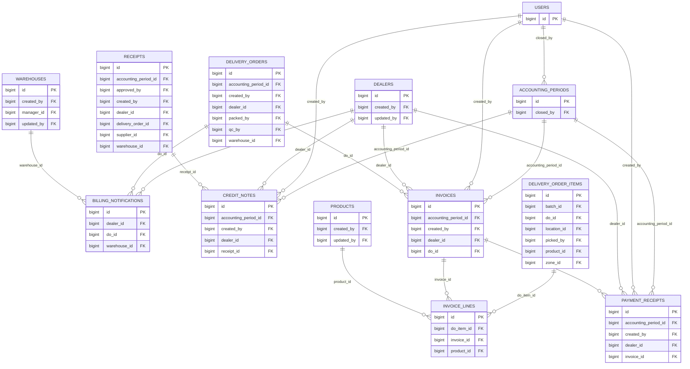

##### 09 System migration record

**Coverage:** `flyway_schema_history`. **FK shown:** 0.


##### Coverage validation

- FK constraints emitted: **227 / 227**.
- Physical tables in child groups: **56 / 56**.
- Views `v_inventory_by_batch`, `v_inventory_summary`, `v_low_stock_alerts` are listed in the catalog and intentionally excluded from FK ERDs.

<!-- VPS_SCHEMA_ATLAS_END -->

#### b. Table Descriptions

<!-- VPS_SCHEMA_CATALOG_START -->

#### Complete VPS physical table dictionary — 56 tables / 746 columns

> **Nguồn dữ liệu:** truy vấn metadata PostgreSQL trên VPS do người dùng cung cấp (txt.rtf, txt1.rtf, txt2.rtf), đối chiếu ngày 2026-07-19. Đây là catalog vật lý chuẩn cho RDS/SDS, không suy luận từ migration hoặc entity.

##### Inventory and migration status

- **56 bảng:** 55 bảng nghiệp vụ WMS + bảng kỹ thuật `flyway_schema_history`.
- **3 views chỉ đọc:** `v_inventory_by_batch`, `v_inventory_summary`, `v_low_stock_alerts`; không tính là bảng.
- **746 cột** và **227 foreign-key constraints** được xuất từ `information_schema`/`pg_constraint`.
- Flyway trên VPS có migration thành công từ V1 đến V13. **V14 chưa xuất hiện**, do đó các trường tài khoản ngân hàng dealer định nghĩa bởi V14 chưa được coi là schema production.
- Lịch sử Flyway có hai record version `22` (một SQL và một DELETE reconciliation); catalog này phản ánh đối tượng thực tế, không tự suy ra migration nào đã chạy từ version number đó.

##### Conventions

- Mỗi bảng bên dưới liệt kê **toàn bộ cột** theo đúng thứ tự ordinal trên VPS. `!` = NOT NULL; `PK` = primary key; `FK→table.column` = foreign key.
- Một cột có thể có nhiều FK/constraint; các FK được gắn theo metadata, không suy đoán từ tên cột.
- Các view không có PK/FK vật lý; cột của view được liệt kê riêng.

##### Complete table description and column dictionary

###### `accounting_periods`

Kỳ kế toán và trạng thái đóng sổ. **PK:** `id`. **Columns (9):**

| # | Column | PostgreSQL type | Null | Key / reference | Default |
|---:|---|---|:---:|---|---|
| 1 | `id` | `bigint` | ! | PK | `nextval('accounting_periods_id_seq'::regclass)` |
| 2 | `period_name` | `varchar` | ! | — | — |
| 3 | `start_date` | `date` | ! | — | — |
| 4 | `end_date` | `date` | ! | — | — |
| 5 | `status` | `varchar` | ! | — | `'OPEN'::character varying` |
| 6 | `closed_by` | `bigint` | ✓ | FK→users.id | — |
| 7 | `closed_at` | `timestamptz` | ✓ | — | — |
| 8 | `notes` | `text` | ✓ | — | — |
| 9 | `created_at` | `timestamptz` | ! | — | `now()` |

###### `adjustments`

Phiếu điều chỉnh tồn kho có phê duyệt và liên kết nghiệp vụ nguồn. **PK:** `id`. **Columns (22):**

| # | Column | PostgreSQL type | Null | Key / reference | Default |
|---:|---|---|:---:|---|---|
| 1 | `id` | `bigint` | ! | PK | `nextval('adjustments_id_seq'::regclass)` |
| 2 | `adjustment_number` | `varchar` | ! | — | — |
| 3 | `warehouse_id` | `bigint` | ! | FK→warehouses.id | — |
| 4 | `product_id` | `bigint` | ! | FK→products.id | — |
| 5 | `batch_id` | `bigint` | ✓ | FK→batches.id | — |
| 6 | `location_id` | `bigint` | ✓ | FK→warehouse_locations.id | — |
| 7 | `delivery_order_id` | `bigint` | ✓ | FK→delivery_orders.id | — |
| 8 | `do_item_id` | `bigint` | ✓ | FK→delivery_order_items.id | — |
| 9 | `quantity_adjustment` | `numeric` | ! | — | — |
| 10 | `type` | `varchar` | ! | — | — |
| 11 | `reference_id` | `bigint` | ✓ | — | — |
| 12 | `reference_type` | `varchar` | ✓ | — | — |
| 13 | `reason` | `text` | ! | — | — |
| 14 | `approved_by` | `bigint` | ✓ | FK→users.id | — |
| 15 | `approved_at` | `timestamptz` | ✓ | — | — |
| 16 | `document_date` | `date` | ! | — | — |
| 17 | `accounting_period_id` | `bigint` | ✓ | FK→accounting_periods.id | — |
| 18 | `created_by` | `bigint` | ! | FK→users.id | — |
| 19 | `created_at` | `timestamptz` | ! | — | `now()` |
| 20 | `quarantine_record_id` | `bigint` | ✓ | FK→quarantine_records.id | — |
| 21 | `outbound_qc_record_id` | `bigint` | ✓ | FK→outbound_qc_records.id | — |
| 22 | `allocation_id` | `bigint` | ✓ | FK→delivery_order_item_allocations.id | — |

###### `audit_logs`

Nhật ký audit bất biến cho thao tác hệ thống/kho. **PK:** `id`. **Columns (12):**

| # | Column | PostgreSQL type | Null | Key / reference | Default |
|---:|---|---|:---:|---|---|
| 1 | `id` | `bigint` | ! | PK | `nextval('audit_logs_id_seq'::regclass)` |
| 2 | `actor_id` | `bigint` | ! | FK→users.id | — |
| 3 | `actor_role` | `varchar` | ! | — | — |
| 4 | `action` | `varchar` | ! | — | — |
| 5 | `entity_type` | `varchar` | ! | — | — |
| 6 | `entity_id` | `bigint` | ! | — | — |
| 7 | `description` | `text` | ! | — | — |
| 8 | `warehouse_id` | `bigint` | ✓ | FK→warehouses.id | — |
| 9 | `old_value` | `jsonb` | ✓ | — | — |
| 10 | `new_value` | `jsonb` | ✓ | — | — |
| 11 | `timestamp` | `timestamptz` | ! | — | `now()` |
| 12 | `ip_address` | `varchar` | ✓ | — | — |

###### `batches`

Lô hàng theo sản phẩm và kho. **PK:** `id`. **Columns (9):**

| # | Column | PostgreSQL type | Null | Key / reference | Default |
|---:|---|---|:---:|---|---|
| 1 | `id` | `bigint` | ! | PK | `nextval('batches_id_seq'::regclass)` |
| 2 | `batch_number` | `varchar` | ! | — | — |
| 3 | `product_id` | `bigint` | ! | FK→products.id | — |
| 4 | `warehouse_id` | `bigint` | ! | FK→warehouses.id | — |
| 5 | `received_date` | `date` | ! | — | — |
| 6 | `quantity` | `numeric` | ! | — | — |
| 7 | `created_at` | `timestamptz` | ! | — | `now()` |
| 8 | `expiry_date` | `date` | ✓ | — | — |
| 9 | `grade` | `varchar` | ! | — | `'A'::character varying` |

###### `billing_notifications`

Thông báo billing/nhắc thanh toán cho dealer. **PK:** `id`. **Columns (13):**

| # | Column | PostgreSQL type | Null | Key / reference | Default |
|---:|---|---|:---:|---|---|
| 1 | `id` | `bigint` | ! | PK | `nextval('billing_notifications_id_seq'::regclass)` |
| 2 | `do_id` | `bigint` | ! | FK→delivery_orders.id | — |
| 3 | `do_number` | `varchar` | ! | — | — |
| 4 | `dealer_id` | `bigint` | ! | FK→dealers.id | — |
| 5 | `dealer_name` | `varchar` | ! | — | — |
| 6 | `warehouse_id` | `bigint` | ! | FK→warehouses.id | — |
| 7 | `delivered_at` | `timestamptz` | ! | — | — |
| 8 | `total_amount_estimate` | `numeric` | ! | — | — |
| 9 | `invoice_status` | `varchar` | ! | — | `'NOT_INVOICED'::character varying` |
| 10 | `status` | `varchar` | ! | — | `'ACTIVE'::character varying` |
| 11 | `recipient_role` | `varchar` | ! | — | `'ACCOUNTANT'::character varying` |
| 12 | `read_at` | `timestamptz` | ✓ | — | — |
| 13 | `created_at` | `timestamptz` | ! | — | `now()` |

###### `credit_notes`

Chứng từ giảm trừ/hoàn tiền cho dealer. **PK:** `id`. **Columns (10):**

| # | Column | PostgreSQL type | Null | Key / reference | Default |
|---:|---|---|:---:|---|---|
| 1 | `id` | `bigint` | ! | PK | `nextval('credit_notes_id_seq'::regclass)` |
| 2 | `credit_note_number` | `varchar` | ! | — | — |
| 3 | `dealer_id` | `bigint` | ! | FK→dealers.id | — |
| 4 | `receipt_id` | `bigint` | ✓ | FK→receipts.id | — |
| 5 | `amount` | `numeric` | ! | — | — |
| 6 | `reason` | `text` | ! | — | — |
| 7 | `created_by` | `bigint` | ! | FK→users.id | — |
| 8 | `document_date` | `date` | ! | — | — |
| 9 | `accounting_period_id` | `bigint` | ✓ | FK→accounting_periods.id | — |
| 10 | `created_at` | `timestamptz` | ! | — | `now()` |

###### `damage_reports`

Biên bản hàng hư hỏng. **PK:** `id`. **Columns (12):**

| # | Column | PostgreSQL type | Null | Key / reference | Default |
|---:|---|---|:---:|---|---|
| 1 | `id` | `bigint` | ! | PK | `nextval('damage_reports_id_seq'::regclass)` |
| 2 | `report_number` | `varchar` | ! | — | — |
| 3 | `warehouse_id` | `bigint` | ! | FK→warehouses.id | — |
| 4 | `product_id` | `bigint` | ! | FK→products.id | — |
| 5 | `batch_id` | `bigint` | ✓ | FK→batches.id | — |
| 6 | `quantity` | `numeric` | ! | — | — |
| 7 | `cause` | `text` | ! | — | — |
| 8 | `image_url` | `varchar` | ✓ | — | — |
| 9 | `reported_by` | `bigint` | ! | FK→users.id | — |
| 10 | `receipt_item_id` | `bigint` | ✓ | FK→receipt_items.id | — |
| 11 | `report_date` | `date` | ! | — | — |
| 12 | `created_at` | `timestamptz` | ! | — | `now()` |

###### `dealers`

Khách hàng/đại lý mua hàng. **PK:** `id`. **Columns (16):**

| # | Column | PostgreSQL type | Null | Key / reference | Default |
|---:|---|---|:---:|---|---|
| 1 | `id` | `bigint` | ! | PK | `nextval('dealers_id_seq'::regclass)` |
| 2 | `code` | `varchar` | ! | — | — |
| 3 | `name` | `varchar` | ! | — | — |
| 4 | `phone` | `varchar` | ✓ | — | — |
| 5 | `default_delivery_address` | `text` | ✓ | — | — |
| 6 | `region` | `varchar` | ✓ | — | — |
| 7 | `email` | `varchar` | ✓ | — | — |
| 8 | `payment_term_days` | `integer` | ! | — | `30` |
| 9 | `credit_limit` | `numeric` | ! | — | `0` |
| 10 | `current_balance` | `numeric` | ! | — | `0` |
| 11 | `credit_status` | `varchar` | ! | — | `'ACTIVE'::character varying` |
| 12 | `is_active` | `boolean` | ! | — | `true` |
| 13 | `created_by` | `bigint` | ✓ | FK→users.id | — |
| 14 | `updated_by` | `bigint` | ✓ | FK→users.id | — |
| 15 | `created_at` | `timestamptz` | ! | — | `now()` |
| 16 | `updated_at` | `timestamptz` | ! | — | `now()` |

###### `debit_notes`

Chứng từ công nợ liên quan inbound/nhà cung cấp. **PK:** `id`. **Columns (11):**

| # | Column | PostgreSQL type | Null | Key / reference | Default |
|---:|---|---|:---:|---|---|
| 1 | `id` | `bigint` | ! | PK | `nextval('debit_notes_id_seq'::regclass)` |
| 2 | `debit_note_number` | `varchar` | ! | — | — |
| 3 | `supplier_id` | `bigint` | ! | FK→suppliers.id | — |
| 4 | `receipt_id` | `bigint` | ✓ | FK→receipts.id | — |
| 5 | `failed_qty` | `numeric` | ! | — | — |
| 6 | `amount` | `numeric` | ! | — | — |
| 7 | `reason` | `text` | ! | — | — |
| 8 | `created_by` | `bigint` | ! | FK→users.id | — |
| 9 | `document_date` | `date` | ! | — | — |
| 10 | `accounting_period_id` | `bigint` | ✓ | FK→accounting_periods.id | — |
| 11 | `created_at` | `timestamptz` | ! | — | `now()` |

###### `deliveries`

Lần giao hàng/POD cho delivery order. **PK:** `id`. **Columns (17):**

| # | Column | PostgreSQL type | Null | Key / reference | Default |
|---:|---|---|:---:|---|---|
| 1 | `id` | `bigint` | ! | PK | `nextval('deliveries_id_seq'::regclass)` |
| 2 | `delivery_number` | `varchar` | ! | — | — |
| 3 | `do_id` | `bigint` | ! | FK→delivery_orders.id | — |
| 4 | `trip_id` | `bigint` | ✓ | FK→trips.id | — |
| 5 | `vehicle_id` | `bigint` | ! | FK→vehicles.id | — |
| 6 | `driver_id` | `bigint` | ! | FK→drivers.id | — |
| 7 | `status` | `varchar` | ! | — | `'PENDING'::character varying` |
| 8 | `pod_image_url` | `varchar` | ✓ | — | — |
| 9 | `pod_signature_url` | `varchar` | ✓ | — | — |
| 10 | `pod_timestamp` | `timestamptz` | ✓ | — | — |
| 11 | `otp_verified_at` | `timestamptz` | ✓ | — | — |
| 12 | `failure_reason` | `text` | ✓ | — | — |
| 13 | `attempt_number` | `integer` | ! | — | `1` |
| 14 | `dispatched_at` | `timestamptz` | ✓ | — | — |
| 15 | `delivered_at` | `timestamptz` | ✓ | — | — |
| 16 | `created_at` | `timestamptz` | ! | — | `now()` |
| 17 | `updated_at` | `timestamptz` | ! | — | `now()` |

###### `delivery_order_approvals`

Lịch sử phê duyệt delivery order. **PK:** `id`. **Columns (7):**

| # | Column | PostgreSQL type | Null | Key / reference | Default |
|---:|---|---|:---:|---|---|
| 1 | `id` | `bigint` | ! | PK | `nextval('delivery_order_approvals_id_seq'::regclass)` |
| 2 | `do_id` | `bigint` | ! | FK→delivery_orders.id | — |
| 3 | `approver_id` | `bigint` | ! | FK→users.id | — |
| 4 | `result` | `varchar` | ! | — | — |
| 5 | `contract_image_url` | `varchar` | ✓ | — | — |
| 6 | `rejection_reason` | `text` | ✓ | — | — |
| 7 | `approved_at` | `timestamptz` | ! | — | `now()` |

###### `delivery_order_item_allocations`

Phân bổ batch/bin cho dòng xuất. **PK:** `id`. **Columns (15):**

| # | Column | PostgreSQL type | Null | Key / reference | Default |
|---:|---|---|:---:|---|---|
| 1 | `id` | `bigint` | ! | PK | `nextval('delivery_order_item_allocations_id_seq'::regclass)` |
| 2 | `do_item_id` | `bigint` | ! | FK→delivery_order_items.id | — |
| 3 | `inventory_id` | `bigint` | ! | FK→inventories.id | — |
| 4 | `batch_id` | `bigint` | ! | FK→batches.id | — |
| 5 | `location_id` | `bigint` | ! | FK→warehouse_locations.id | — |
| 6 | `zone_id` | `bigint` | ! | FK→warehouse_locations.id | — |
| 7 | `planned_qty` | `numeric` | ! | — | — |
| 8 | `picked_qty` | `numeric` | ! | — | `0` |
| 9 | `is_replacement` | `boolean` | ! | — | `false` |
| 10 | `replaced_allocation_id` | `bigint` | ✓ | FK→delivery_order_item_allocations.id | — |
| 11 | `created_by` | `bigint` | ! | FK→users.id | — |
| 12 | `created_at` | `timestamptz` | ! | — | `now()` |
| 13 | `updated_at` | `timestamptz` | ! | — | `now()` |
| 14 | `status` | `varchar` | ! | — | `'ACTIVE'::character varying` |
| 15 | `version` | `integer` | ! | — | `0` |

###### `delivery_order_item_replacements`

Thay thế dòng xuất khi outbound QC. **PK:** `id`. **Columns (12):**

| # | Column | PostgreSQL type | Null | Key / reference | Default |
|---:|---|---|:---:|---|---|
| 1 | `id` | `bigint` | ! | PK | `nextval('delivery_order_item_replacements_id_seq'::regclass)` |
| 2 | `do_item_id` | `bigint` | ! | FK→delivery_order_items.id | — |
| 3 | `failed_inventory_id` | `bigint` | ! | FK→inventories.id | — |
| 4 | `replacement_inventory_id` | `bigint` | ! | FK→inventories.id | — |
| 5 | `failed_batch_id` | `bigint` | ! | FK→batches.id | — |
| 6 | `failed_location_id` | `bigint` | ! | FK→warehouse_locations.id | — |
| 7 | `replacement_batch_id` | `bigint` | ! | FK→batches.id | — |
| 8 | `replacement_location_id` | `bigint` | ! | FK→warehouse_locations.id | — |
| 9 | `quantity` | `numeric` | ! | — | — |
| 10 | `reason` | `text` | ! | — | — |
| 11 | `created_by` | `bigint` | ! | FK→users.id | — |
| 12 | `created_at` | `timestamptz` | ! | — | `now()` |

###### `delivery_order_item_return_to_bin_records`

Trả hàng đã pick về bin. **PK:** `id`. **Columns (12):**

| # | Column | PostgreSQL type | Null | Key / reference | Default |
|---:|---|---|:---:|---|---|
| 1 | `id` | `bigint` | ! | PK | `nextval('delivery_order_item_return_to_bin_records_id_seq'::regclass)` |
| 2 | `do_item_id` | `bigint` | ! | FK→delivery_order_items.id | — |
| 3 | `allocation_id` | `bigint` | ! | FK→delivery_order_item_allocations.id | — |
| 4 | `product_id` | `bigint` | ! | FK→products.id | — |
| 5 | `batch_id` | `bigint` | ! | FK→batches.id | — |
| 6 | `original_location_id` | `bigint` | ! | FK→warehouse_locations.id | — |
| 7 | `original_zone_id` | `bigint` | ! | FK→warehouse_locations.id | — |
| 8 | `source_location_id` | `bigint` | ✓ | FK→warehouse_locations.id | — |
| 9 | `returned_qty` | `numeric` | ! | — | — |
| 10 | `reason` | `text` | ✓ | — | — |
| 11 | `created_by` | `bigint` | ! | FK→users.id | — |
| 12 | `created_at` | `timestamptz` | ! | — | `now()` |

###### `delivery_order_items`

Dòng hàng của delivery order. **PK:** `id`. **Columns (17):**

| # | Column | PostgreSQL type | Null | Key / reference | Default |
|---:|---|---|:---:|---|---|
| 1 | `id` | `bigint` | ! | PK | `nextval('delivery_order_items_id_seq'::regclass)` |
| 2 | `do_id` | `bigint` | ! | FK→delivery_orders.id | — |
| 3 | `product_id` | `bigint` | ! | FK→products.id | — |
| 4 | `batch_id` | `bigint` | ✓ | FK→batches.id | — |
| 5 | `location_id` | `bigint` | ✓ | FK→warehouse_locations.id | — |
| 6 | `zone_id` | `bigint` | ✓ | FK→warehouse_locations.id | — |
| 7 | `requested_qty` | `numeric` | ! | — | — |
| 8 | `planned_qty` | `numeric` | ! | — | `0` |
| 9 | `picked_qty` | `numeric` | ! | — | `0` |
| 10 | `qc_pass_qty` | `numeric` | ! | — | `0` |
| 11 | `qc_fail_qty` | `numeric` | ! | — | `0` |
| 12 | `reserved_qty` | `numeric` | ! | — | `0` |
| 13 | `issued_qty` | `numeric` | ! | — | `0` |
| 14 | `unit_price` | `numeric` | ✓ | — | — |
| 15 | `unit_cost` | `numeric` | ✓ | — | — |
| 16 | `serial_number` | `varchar` | ✓ | — | — |
| 17 | `picked_by` | `bigint` | ✓ | FK→users.id | — |

###### `delivery_order_warehouse_approvals`

Phê duyệt theo phạm vi kho của delivery order. **PK:** `id`. **Columns (6):**

| # | Column | PostgreSQL type | Null | Key / reference | Default |
|---:|---|---|:---:|---|---|
| 1 | `id` | `bigint` | ! | PK | `nextval('delivery_order_warehouse_approvals_id_seq'::regclass)` |
| 2 | `do_id` | `bigint` | ! | FK→delivery_orders.id | — |
| 3 | `approver_id` | `bigint` | ! | FK→users.id | — |
| 4 | `result` | `varchar` | ! | — | — |
| 5 | `notes` | `text` | ✓ | — | — |
| 6 | `approved_at` | `timestamptz` | ! | — | `now()` |

###### `delivery_orders`

Lệnh xuất/giao hàng. **PK:** `id`. **Columns (18):**

| # | Column | PostgreSQL type | Null | Key / reference | Default |
|---:|---|---|:---:|---|---|
| 1 | `id` | `bigint` | ! | PK | `nextval('delivery_orders_id_seq'::regclass)` |
| 2 | `do_number` | `varchar` | ! | — | — |
| 3 | `dealer_id` | `bigint` | ! | FK→dealers.id | — |
| 4 | `warehouse_id` | `bigint` | ! | FK→warehouses.id | — |
| 5 | `type` | `varchar` | ! | — | — |
| 6 | `expected_delivery_date` | `date` | ✓ | — | — |
| 7 | `status` | `varchar` | ! | — | `'NEW'::character varying` |
| 8 | `created_by` | `bigint` | ! | FK→users.id | — |
| 9 | `cancel_reason` | `text` | ✓ | — | — |
| 10 | `rejection_reason` | `text` | ✓ | — | — |
| 11 | `document_date` | `date` | ! | — | — |
| 12 | `accounting_period_id` | `bigint` | ✓ | FK→accounting_periods.id | — |
| 13 | `notes` | `text` | ✓ | — | — |
| 14 | `packed_by` | `bigint` | ✓ | FK→users.id | — |
| 15 | `qc_by` | `bigint` | ✓ | FK→users.id | — |
| 16 | `created_at` | `timestamptz` | ! | — | `now()` |
| 17 | `updated_at` | `timestamptz` | ! | — | `now()` |
| 18 | `version` | `integer` | ! | — | `0` |

###### `delivery_otp_attempts`

Lịch sử xác thực OTP khi giao. **PK:** `id`. **Columns (9):**

| # | Column | PostgreSQL type | Null | Key / reference | Default |
|---:|---|---|:---:|---|---|
| 1 | `id` | `bigint` | ! | PK | `nextval('delivery_otp_attempts_id_seq'::regclass)` |
| 2 | `delivery_id` | `bigint` | ! | FK→deliveries.id | — |
| 3 | `otp_hash` | `varchar` | ! | — | — |
| 4 | `recipient_email` | `varchar` | ! | — | — |
| 5 | `expires_at` | `timestamptz` | ! | — | — |
| 6 | `consumed_at` | `timestamptz` | ✓ | — | — |
| 7 | `attempt_count` | `integer` | ! | — | `0` |
| 8 | `created_at` | `timestamptz` | ! | — | `now()` |
| 9 | `status` | `varchar` | ! | — | `'ACTIVE'::character varying` |

###### `discrepancy_hold_entries`

Dòng giữ hàng do chênh lệch transfer. **PK:** `id`. **Columns (8):**

| # | Column | PostgreSQL type | Null | Key / reference | Default |
|---:|---|---|:---:|---|---|
| 1 | `id` | `bigint` | ! | PK | `nextval('discrepancy_hold_entries_id_seq'::regclass)` |
| 2 | `incident_id` | `bigint` | ! | FK→discrepancy_incidents.id | — |
| 3 | `warehouse_id` | `bigint` | ! | FK→warehouses.id | — |
| 4 | `product_id` | `bigint` | ! | FK→products.id | — |
| 5 | `batch_id` | `bigint` | ✓ | FK→batches.id | — |
| 6 | `hold_qty` | `numeric` | ! | — | — |
| 7 | `hold_location_id` | `bigint` | ✓ | FK→warehouse_locations.id | — |
| 8 | `created_at` | `timestamptz` | ! | — | `now()` |

###### `discrepancy_incidents`

Sự cố chênh lệch điều chuyển. **PK:** `id`. **Columns (11):**

| # | Column | PostgreSQL type | Null | Key / reference | Default |
|---:|---|---|:---:|---|---|
| 1 | `id` | `bigint` | ! | PK | `nextval('discrepancy_incidents_id_seq'::regclass)` |
| 2 | `transfer_id` | `bigint` | ! | FK→inter_warehouse_transfers.id | — |
| 3 | `product_id` | `bigint` | ! | FK→products.id | — |
| 4 | `incident_type` | `varchar` | ! | — | — |
| 5 | `quantity` | `numeric` | ! | — | — |
| 6 | `status` | `varchar` | ! | — | `'OPEN'::character varying` |
| 7 | `resolution_note` | `text` | ✓ | — | — |
| 8 | `resolved_by` | `bigint` | ✓ | FK→users.id | — |
| 9 | `resolved_at` | `timestamptz` | ✓ | — | — |
| 10 | `created_at` | `timestamptz` | ! | — | `now()` |
| 11 | `updated_at` | `timestamptz` | ! | — | `now()` |

###### `document_sequences`

Bộ đếm sinh số chứng từ. **PK:** `sequence_key`. **Columns (3):**

| # | Column | PostgreSQL type | Null | Key / reference | Default |
|---:|---|---|:---:|---|---|
| 1 | `sequence_key` | `varchar` | ! | PK | — |
| 2 | `next_value` | `bigint` | ! | — | — |
| 3 | `updated_at` | `timestamptz` | ! | — | `now()` |

###### `drivers`

Tài xế. **PK:** `id`. **Columns (13):**

| # | Column | PostgreSQL type | Null | Key / reference | Default |
|---:|---|---|:---:|---|---|
| 1 | `id` | `bigint` | ! | PK | `nextval('drivers_id_seq'::regclass)` |
| 2 | `user_id` | `bigint` | ! | FK→users.id | — |
| 3 | `full_name` | `varchar` | ! | — | — |
| 4 | `phone` | `varchar` | ✓ | — | — |
| 5 | `license_number` | `varchar` | ! | — | — |
| 6 | `license_expiry` | `date` | ! | — | — |
| 7 | `warehouse_id` | `bigint` | ✓ | FK→warehouses.id | — |
| 8 | `status` | `varchar` | ! | — | `'AVAILABLE'::character varying` |
| 9 | `is_active` | `boolean` | ! | — | `true` |
| 10 | `created_by` | `bigint` | ✓ | FK→users.id | — |
| 11 | `updated_by` | `bigint` | ✓ | FK→users.id | — |
| 12 | `created_at` | `timestamptz` | ! | — | `now()` |
| 13 | `updated_at` | `timestamptz` | ! | — | `now()` |

###### `flyway_schema_history`

Lịch sử migration Flyway của hệ thống. **PK:** `installed_rank`. **Columns (10):**

| # | Column | PostgreSQL type | Null | Key / reference | Default |
|---:|---|---|:---:|---|---|
| 1 | `installed_rank` | `integer` | ! | PK | — |
| 2 | `version` | `varchar` | ✓ | — | — |
| 3 | `description` | `varchar` | ! | — | — |
| 4 | `type` | `varchar` | ! | — | — |
| 5 | `script` | `varchar` | ! | — | — |
| 6 | `checksum` | `integer` | ✓ | — | — |
| 7 | `installed_by` | `varchar` | ! | — | — |
| 8 | `installed_on` | `timestamp` | ! | — | `now()` |
| 9 | `execution_time` | `integer` | ! | — | — |
| 10 | `success` | `boolean` | ! | — | — |

###### `inter_warehouse_transfer_allocations`

Phân bổ tồn cho dòng điều chuyển. **PK:** `id`. **Columns (4):**

| # | Column | PostgreSQL type | Null | Key / reference | Default |
|---:|---|---|:---:|---|---|
| 1 | `id` | `bigint` | ! | PK | `nextval('inter_warehouse_transfer_allocations_id_seq'::regclass)` |
| 2 | `transfer_item_id` | `bigint` | ! | FK→inter_warehouse_transfer_items.id | — |
| 3 | `inventory_id` | `bigint` | ! | FK→inventories.id | — |
| 4 | `allocated_qty` | `numeric` | ! | — | — |

###### `inter_warehouse_transfer_items`

Dòng hàng điều chuyển. **PK:** `id`. **Columns (20):**

| # | Column | PostgreSQL type | Null | Key / reference | Default |
|---:|---|---|:---:|---|---|
| 1 | `id` | `bigint` | ! | PK | `nextval('transfer_items_id_seq'::regclass)` |
| 2 | `transfer_id` | `bigint` | ! | FK→inter_warehouse_transfers.id | — |
| 3 | `product_id` | `bigint` | ! | FK→products.id | — |
| 4 | `batch_id` | `bigint` | ✓ | FK→batches.id | — |
| 5 | `source_location_id` | `bigint` | ✓ | FK→warehouse_locations.id | — |
| 6 | `destination_location_id` | `bigint` | ✓ | FK→warehouse_locations.id | — |
| 7 | `planned_qty` | `numeric` | ! | — | — |
| 8 | `sent_qty` | `numeric` | ✓ | — | — |
| 9 | `received_qty` | `numeric` | ✓ | — | — |
| 10 | `variance_qty` | `numeric` | ✓ | — | — |
| 11 | `worker_received_qty` | `numeric` | ✓ | — | — |
| 12 | `qc_passed_qty` | `numeric` | ✓ | — | — |
| 13 | `qc_failed_qty` | `numeric` | ✓ | — | — |
| 14 | `qc_result` | `varchar` | ✓ | — | — |
| 15 | `qc_failure_reason` | `text` | ✓ | — | — |
| 16 | `issue_reason` | `text` | ✓ | — | — |
| 17 | `checker_note` | `text` | ✓ | — | — |
| 18 | `checked_by` | `bigint` | ✓ | FK→users.id | — |
| 19 | `checked_at` | `timestamptz` | ✓ | — | — |
| 20 | `version` | `bigint` | ! | — | `0` |

###### `inter_warehouse_transfers`

Phiếu điều chuyển liên kho. **PK:** `id`. **Columns (52):**

| # | Column | PostgreSQL type | Null | Key / reference | Default |
|---:|---|---|:---:|---|---|
| 1 | `id` | `bigint` | ! | PK | `nextval('transfers_id_seq'::regclass)` |
| 2 | `transfer_number` | `varchar` | ! | — | — |
| 3 | `external_instruction_code` | `varchar` | ! | — | `''::character varying` |
| 4 | `source_warehouse_id` | `bigint` | ! | FK→warehouses.id | — |
| 5 | `destination_warehouse_id` | `bigint` | ! | FK→warehouses.id | — |
| 6 | `trip_id` | `bigint` | ✓ | FK→trips.id | — |
| 7 | `status` | `varchar` | ! | — | `'NEW'::character varying` |
| 8 | `created_by` | `bigint` | ! | FK→users.id | — |
| 9 | `approved_by` | `bigint` | ✓ | FK→users.id | — |
| 10 | `approved_at` | `timestamptz` | ✓ | — | — |
| 11 | `confirmed_by` | `bigint` | ✓ | FK→users.id | — |
| 12 | `confirmed_at` | `timestamptz` | ✓ | — | — |
| 13 | `rejected_by` | `bigint` | ✓ | FK→users.id | — |
| 14 | `rejected_at` | `timestamptz` | ✓ | — | — |
| 15 | `rejection_reason` | `text` | ✓ | — | — |
| 16 | `planned_date` | `date` | ✓ | — | — |
| 17 | `actual_received_date` | `date` | ✓ | — | — |
| 18 | `discrepancy_reason` | `text` | ✓ | — | — |
| 19 | `is_returned` | `boolean` | ! | — | `false` |
| 20 | `notes` | `text` | ✓ | — | — |
| 21 | `document_date` | `date` | ! | — | — |
| 22 | `accounting_period_id` | `bigint` | ✓ | FK→accounting_periods.id | — |
| 23 | `created_at` | `timestamptz` | ! | — | `now()` |
| 24 | `updated_at` | `timestamptz` | ! | — | `now()` |
| 25 | `return_requested` | `boolean` | ! | — | `false` |
| 26 | `return_reason` | `text` | ✓ | — | — |
| 27 | `return_requested_by` | `bigint` | ✓ | FK→users.id | — |
| 28 | `return_requested_at` | `timestamptz` | ✓ | — | — |
| 29 | `return_approved_by` | `bigint` | ✓ | FK→users.id | — |
| 30 | `return_approved_at` | `timestamptz` | ✓ | — | — |
| 31 | `return_rejected_by` | `bigint` | ✓ | FK→users.id | — |
| 32 | `return_rejected_at` | `timestamptz` | ✓ | — | — |
| 33 | `return_rejection_reason` | `text` | ✓ | — | — |
| 34 | `transfer_request_id` | `bigint` | ✓ | FK→transfer_requests.id | — |
| 35 | `version` | `bigint` | ! | — | `0` |
| 36 | `outbound_qc_passed` | `boolean` | ✓ | — | — |
| 37 | `outbound_qc_note` | `text` | ✓ | — | — |
| 38 | `outbound_qc_photo_ref` | `text` | ✓ | — | — |
| 39 | `outbound_qc_by` | `bigint` | ✓ | FK→users.id | — |
| 40 | `outbound_qc_at` | `timestamptz` | ✓ | — | — |
| 41 | `load_handover_photo_ref` | `text` | ✓ | — | — |
| 42 | `load_handover_by` | `bigint` | ✓ | FK→users.id | — |
| 43 | `load_handover_at` | `timestamptz` | ✓ | — | — |
| 44 | `driver_arrived_at` | `timestamptz` | ✓ | — | — |
| 45 | `arrival_handover_at` | `timestamptz` | ✓ | — | — |
| 46 | `arrival_handover_by` | `bigint` | ✓ | FK→users.id | — |
| 47 | `return_departed_at` | `timestamptz` | ✓ | — | — |
| 48 | `return_arrived_at` | `timestamptz` | ✓ | — | — |
| 49 | `return_arrival_handover_at` | `timestamptz` | ✓ | — | — |
| 50 | `return_arrival_handover_by` | `bigint` | ✓ | FK→users.id | — |
| 51 | `return_photo_ref` | `text` | ✓ | — | — |
| 52 | `arrival_handover_photo_ref` | `text` | ✓ | — | — |

###### `inventories`

Tồn theo kho/sản phẩm/batch/vị trí. **PK:** `id`. **Columns (10):**

| # | Column | PostgreSQL type | Null | Key / reference | Default |
|---:|---|---|:---:|---|---|
| 1 | `id` | `bigint` | ! | PK | `nextval('inventories_id_seq'::regclass)` |
| 2 | `warehouse_id` | `bigint` | ! | FK→warehouses.id | — |
| 3 | `product_id` | `bigint` | ! | FK→products.id | — |
| 4 | `batch_id` | `bigint` | ! | FK→batches.id | — |
| 5 | `location_id` | `bigint` | ! | FK→warehouse_locations.id | — |
| 6 | `total_qty` | `numeric` | ! | — | `0` |
| 7 | `reserved_qty` | `numeric` | ! | — | `0` |
| 8 | `cost_price` | `numeric` | ! | — | — |
| 9 | `version` | `integer` | ! | — | `0` |
| 10 | `updated_at` | `timestamptz` | ! | — | `now()` |

###### `invoice_lines`

Dòng hóa đơn. **PK:** `id`. **Columns (7):**

| # | Column | PostgreSQL type | Null | Key / reference | Default |
|---:|---|---|:---:|---|---|
| 1 | `id` | `bigint` | ! | PK | `nextval('invoice_lines_id_seq'::regclass)` |
| 2 | `invoice_id` | `bigint` | ! | FK→invoices.id | — |
| 3 | `do_item_id` | `bigint` | ! | FK→delivery_order_items.id | — |
| 4 | `product_id` | `bigint` | ! | FK→products.id | — |
| 5 | `quantity` | `numeric` | ! | — | — |
| 6 | `unit_price` | `numeric` | ! | — | — |
| 7 | `line_amount` | `numeric` | ! | — | — |

###### `invoices`

Hóa đơn của delivery order. **PK:** `id`. **Columns (13):**

| # | Column | PostgreSQL type | Null | Key / reference | Default |
|---:|---|---|:---:|---|---|
| 1 | `id` | `bigint` | ! | PK | `nextval('invoices_id_seq'::regclass)` |
| 2 | `invoice_number` | `varchar` | ! | — | — |
| 3 | `do_id` | `bigint` | ! | FK→delivery_orders.id | — |
| 4 | `dealer_id` | `bigint` | ! | FK→dealers.id | — |
| 5 | `total_amount` | `numeric` | ! | — | — |
| 6 | `issue_date` | `date` | ! | — | — |
| 7 | `due_date` | `date` | ! | — | — |
| 8 | `status` | `varchar` | ! | — | `'UNPAID'::character varying` |
| 9 | `created_by` | `bigint` | ! | FK→users.id | — |
| 10 | `document_date` | `date` | ! | — | — |
| 11 | `accounting_period_id` | `bigint` | ✓ | FK→accounting_periods.id | — |
| 12 | `created_at` | `timestamptz` | ! | — | `now()` |
| 13 | `updated_at` | `timestamptz` | ! | — | `now()` |

###### `notifications`

Thông báo trong hệ thống. **PK:** `id`. **Columns (8):**

| # | Column | PostgreSQL type | Null | Key / reference | Default |
|---:|---|---|:---:|---|---|
| 1 | `id` | `bigint` | ! | PK | `nextval('notifications_id_seq'::regclass)` |
| 2 | `recipient_id` | `bigint` | ! | FK→users.id | — |
| 3 | `type` | `varchar` | ! | — | — |
| 4 | `reference_type` | `varchar` | ✓ | — | — |
| 5 | `reference_id` | `bigint` | ✓ | — | — |
| 6 | `message` | `text` | ✓ | — | — |
| 7 | `is_read` | `boolean` | ! | — | `false` |
| 8 | `created_at` | `timestamptz` | ! | — | `now()` |

###### `outbound_qc_records`

Kết quả QC xuất kho. **PK:** `id`. **Columns (19):**

| # | Column | PostgreSQL type | Null | Key / reference | Default |
|---:|---|---|:---:|---|---|
| 1 | `id` | `bigint` | ! | PK | `nextval('outbound_qc_records_id_seq'::regclass)` |
| 2 | `do_id` | `bigint` | ! | FK→delivery_orders.id | — |
| 3 | `do_item_id` | `bigint` | ! | FK→delivery_order_items.id | — |
| 4 | `allocation_id` | `bigint` | ! | FK→delivery_order_item_allocations.id | — |
| 5 | `batch_id` | `bigint` | ! | FK→batches.id | — |
| 6 | `location_id` | `bigint` | ! | FK→warehouse_locations.id | — |
| 7 | `zone_id` | `bigint` | ! | FK→warehouse_locations.id | — |
| 8 | `staging_location_id` | `bigint` | ✓ | FK→warehouse_locations.id | — |
| 9 | `quarantine_location_id` | `bigint` | ✓ | FK→warehouse_locations.id | — |
| 10 | `quarantine_record_id` | `bigint` | ✓ | FK→quarantine_records.id | — |
| 11 | `picked_qty` | `numeric` | ! | — | — |
| 12 | `qc_pass_qty` | `numeric` | ! | — | — |
| 13 | `qc_fail_qty` | `numeric` | ! | — | — |
| 14 | `qc_fail_reason` | `text` | ✓ | — | — |
| 15 | `idempotency_key` | `varchar` | ✓ | — | — |
| 16 | `request_hash` | `varchar` | ✓ | — | — |
| 17 | `notes` | `text` | ✓ | — | — |
| 18 | `created_by` | `bigint` | ! | FK→users.id | — |
| 19 | `created_at` | `timestamptz` | ! | — | `now()` |

###### `payment_receipts`

Chứng từ thu tiền. **PK:** `id`. **Columns (12):**

| # | Column | PostgreSQL type | Null | Key / reference | Default |
|---:|---|---|:---:|---|---|
| 1 | `id` | `bigint` | ! | PK | `nextval('payment_receipts_id_seq'::regclass)` |
| 2 | `payment_number` | `varchar` | ! | — | — |
| 3 | `dealer_id` | `bigint` | ! | FK→dealers.id | — |
| 4 | `invoice_id` | `bigint` | ! | FK→invoices.id | — |
| 5 | `amount` | `numeric` | ! | — | — |
| 6 | `payment_date` | `date` | ! | — | — |
| 7 | `payment_method` | `varchar` | ! | — | — |
| 8 | `created_by` | `bigint` | ! | FK→users.id | — |
| 9 | `document_date` | `date` | ! | — | — |
| 10 | `accounting_period_id` | `bigint` | ✓ | FK→accounting_periods.id | — |
| 11 | `notes` | `text` | ✓ | — | — |
| 12 | `created_at` | `timestamptz` | ! | — | `now()` |

###### `price_history`

Lịch sử giá/cost theo sản phẩm. **PK:** `id`. **Columns (15):**

| # | Column | PostgreSQL type | Null | Key / reference | Default |
|---:|---|---|:---:|---|---|
| 1 | `id` | `bigint` | ! | PK | `nextval('price_history_id_seq'::regclass)` |
| 2 | `product_id` | `bigint` | ! | FK→products.id | — |
| 3 | `warehouse_id` | `bigint` | ! | FK→warehouses.id | — |
| 4 | `effective_date` | `date` | ! | — | — |
| 6 | `cost_price` | `numeric` | ! | — | — |
| 7 | `selling_price` | `numeric` | ! | — | — |
| 8 | `status` | `varchar` | ! | — | `'PENDING'::character varying` |
| 9 | `notes` | `text` | ✓ | — | — |
| 10 | `created_by` | `bigint` | ! | FK→users.id | — |
| 11 | `approved_by` | `bigint` | ✓ | FK→users.id | — |
| 12 | `approved_at` | `timestamptz` | ✓ | — | — |
| 13 | `cancelled_by` | `bigint` | ✓ | FK→users.id | — |
| 14 | `cancelled_at` | `timestamptz` | ✓ | — | — |
| 15 | `created_at` | `timestamptz` | ! | — | `now()` |
| 16 | `updated_at` | `timestamptz` | ✓ | — | — |

###### `products`

Danh mục SKU. **PK:** `id`. **Columns (18):**

| # | Column | PostgreSQL type | Null | Key / reference | Default |
|---:|---|---|:---:|---|---|
| 1 | `id` | `bigint` | ! | PK | `nextval('products_id_seq'::regclass)` |
| 2 | `sku` | `varchar` | ! | — | — |
| 3 | `name` | `varchar` | ! | — | — |
| 4 | `unit` | `varchar` | ! | — | — |
| 5 | `unit_per_pack` | `integer` | ✓ | — | — |
| 6 | `description` | `text` | ✓ | — | — |
| 7 | `image_url` | `varchar` | ✓ | — | — |
| 8 | `weight_kg` | `numeric` | ✓ | — | — |
| 9 | `volume_m3` | `numeric` | ✓ | — | — |
| 10 | `has_expiry` | `boolean` | ! | — | `false` |
| 11 | `shelf_life_days` | `integer` | ✓ | — | — |
| 12 | `has_serial` | `boolean` | ! | — | `false` |
| 13 | `reorder_point` | `numeric` | ✓ | — | — |
| 14 | `is_active` | `boolean` | ! | — | `true` |
| 15 | `created_by` | `bigint` | ✓ | FK→users.id | — |
| 16 | `updated_by` | `bigint` | ✓ | FK→users.id | — |
| 17 | `created_at` | `timestamptz` | ! | — | `now()` |
| 18 | `updated_at` | `timestamptz` | ! | — | `now()` |

###### `purchase_order_items`

Dòng purchase order. **PK:** `id`. **Columns (5):**

| # | Column | PostgreSQL type | Null | Key / reference | Default |
|---:|---|---|:---:|---|---|
| 1 | `id` | `bigint` | ! | PK | `nextval('purchase_order_items_id_seq'::regclass)` |
| 2 | `po_id` | `bigint` | ! | FK→purchase_orders.id | — |
| 3 | `product_id` | `bigint` | ! | FK→products.id | — |
| 4 | `expected_qty` | `numeric` | ! | — | — |
| 5 | `unit_price` | `numeric` | ✓ | — | — |

###### `purchase_orders`

Đơn mua từ nhà cung cấp. **PK:** `id`. **Columns (10):**

| # | Column | PostgreSQL type | Null | Key / reference | Default |
|---:|---|---|:---:|---|---|
| 1 | `id` | `bigint` | ! | PK | `nextval('purchase_orders_id_seq'::regclass)` |
| 2 | `po_number` | `varchar` | ! | — | — |
| 3 | `supplier_id` | `bigint` | ! | FK→suppliers.id | — |
| 4 | `warehouse_id` | `bigint` | ! | FK→warehouses.id | — |
| 5 | `expected_receipt_date` | `date` | ✓ | — | — |
| 6 | `status` | `varchar` | ! | — | — |
| 7 | `created_by` | `bigint` | ! | FK→users.id | — |
| 8 | `notes` | `text` | ✓ | — | — |
| 9 | `created_at` | `timestamptz` | ! | — | `now()` |
| 10 | `updated_at` | `timestamptz` | ! | — | `now()` |

###### `quarantine_records`

Hàng cách ly do QC/sự cố. **PK:** `id`. **Columns (17):**

| # | Column | PostgreSQL type | Null | Key / reference | Default |
|---:|---|---|:---:|---|---|
| 1 | `id` | `bigint` | ! | PK | `nextval('quarantine_records_id_seq'::regclass)` |
| 2 | `warehouse_id` | `bigint` | ! | FK→warehouses.id | — |
| 3 | `product_id` | `bigint` | ! | FK→products.id | — |
| 4 | `batch_id` | `bigint` | ! | FK→batches.id | — |
| 5 | `location_id` | `bigint` | ! | FK→warehouse_locations.id | — |
| 6 | `delivery_order_id` | `bigint` | ✓ | FK→delivery_orders.id | — |
| 7 | `do_item_id` | `bigint` | ✓ | FK→delivery_order_items.id | — |
| 8 | `allocation_id` | `bigint` | ✓ | FK→delivery_order_item_allocations.id | — |
| 9 | `outbound_qc_record_id` | `bigint` | ✓ | — | — |
| 10 | `quantity` | `numeric` | ! | — | — |
| 11 | `reason` | `text` | ! | — | — |
| 12 | `created_by` | `bigint` | ! | FK→users.id | — |
| 13 | `created_at` | `timestamptz` | ! | — | `now()` |
| 14 | `transfer_id` | `bigint` | ✓ | FK→inter_warehouse_transfers.id | — |
| 15 | `transfer_item_id` | `bigint` | ✓ | FK→inter_warehouse_transfer_items.id | — |
| 16 | `origin_type` | `varchar` | ! | — | `'OUTBOUND_QC'::character varying` |
| 17 | `remaining_quantity` | `numeric` | ! | — | — |

###### `receipt_items`

Dòng nhận hàng. **PK:** `id`. **Columns (20):**

| # | Column | PostgreSQL type | Null | Key / reference | Default |
|---:|---|---|:---:|---|---|
| 1 | `id` | `bigint` | ! | PK | `nextval('receipt_items_id_seq'::regclass)` |
| 2 | `receipt_id` | `bigint` | ! | FK→receipts.id | — |
| 3 | `product_id` | `bigint` | ! | FK→products.id | — |
| 4 | `batch_id` | `bigint` | ✓ | FK→batches.id | — |
| 5 | `location_id` | `bigint` | ✓ | FK→warehouse_locations.id | — |
| 6 | `expected_qty` | `integer` | ! | — | — |
| 7 | `actual_qty` | `integer` | ✓ | — | — |
| 8 | `qc_passed_qty` | `integer` | ✓ | — | — |
| 9 | `qc_failed_qty` | `integer` | ✓ | — | — |
| 10 | `qc_result` | `varchar` | ✓ | — | — |
| 11 | `qc_failure_reason` | `text` | ✓ | — | — |
| 12 | `grade` | `varchar` | ✓ | — | — |
| 13 | `unit_cost` | `numeric` | ✓ | — | — |
| 14 | `serial_number` | `varchar` | ✓ | — | — |
| 15 | `sample_qty` | `integer` | ✓ | — | — |
| 16 | `sample_passed_qty` | `integer` | ✓ | — | — |
| 17 | `sample_failed_qty` | `integer` | ✓ | — | — |
| 18 | `over_received_qty` | `integer` | ✓ | — | — |
| 19 | `qc_sampling_method` | `varchar` | ✓ | — | — |
| 20 | `qc_by` | `bigint` | ✓ | FK→users.id | — |

###### `receipts`

Phiếu nhận hàng. **PK:** `id`. **Columns (21):**

| # | Column | PostgreSQL type | Null | Key / reference | Default |
|---:|---|---|:---:|---|---|
| 1 | `id` | `bigint` | ! | PK | `nextval('receipts_id_seq'::regclass)` |
| 2 | `receipt_number` | `varchar` | ! | — | — |
| 3 | `source_order_code` | `varchar` | ✓ | — | — |
| 4 | `type` | `varchar` | ! | — | — |
| 5 | `warehouse_id` | `bigint` | ! | FK→warehouses.id | — |
| 6 | `supplier_id` | `bigint` | ✓ | FK→suppliers.id | — |
| 7 | `dealer_id` | `bigint` | ✓ | FK→dealers.id | — |
| 8 | `contact_person` | `varchar` | ✓ | — | — |
| 9 | `source_channel` | `varchar` | ✓ | — | — |
| 10 | `status` | `varchar` | ! | — | `'PENDING_RECEIPT'::character varying` |
| 11 | `approved_by` | `bigint` | ✓ | FK→users.id | — |
| 12 | `approved_at` | `timestamptz` | ✓ | — | — |
| 13 | `rejection_reason` | `text` | ✓ | — | — |
| 14 | `document_date` | `date` | ! | — | — |
| 15 | `accounting_period_id` | `bigint` | ✓ | FK→accounting_periods.id | — |
| 16 | `created_by` | `bigint` | ! | FK→users.id | — |
| 17 | `notes` | `text` | ✓ | — | — |
| 18 | `created_at` | `timestamptz` | ! | — | `now()` |
| 19 | `updated_at` | `timestamptz` | ! | — | `now()` |
| 20 | `version` | `integer` | ! | — | `0` |
| 21 | `delivery_order_id` | `bigint` | ✓ | FK→delivery_orders.id | — |

###### `stock_alerts`

Cảnh báo tồn kho. **PK:** `id`. **Columns (9):**

| # | Column | PostgreSQL type | Null | Key / reference | Default |
|---:|---|---|:---:|---|---|
| 1 | `id` | `bigint` | ! | PK | `nextval('stock_alerts_id_seq'::regclass)` |
| 2 | `warehouse_id` | `bigint` | ! | FK→warehouses.id | — |
| 3 | `product_id` | `bigint` | ! | FK→products.id | — |
| 4 | `current_qty` | `numeric` | ! | — | — |
| 5 | `reorder_point` | `numeric` | ! | — | — |
| 6 | `alert_type` | `varchar` | ! | — | `'LOW_STOCK'::character varying` |
| 7 | `is_resolved` | `boolean` | ! | — | `false` |
| 8 | `resolved_at` | `timestamptz` | ✓ | — | — |
| 9 | `created_at` | `timestamptz` | ! | — | `now()` |

###### `stock_take_items`

Dòng kiểm kê. **PK:** `id`. **Columns (10):**

| # | Column | PostgreSQL type | Null | Key / reference | Default |
|---:|---|---|:---:|---|---|
| 1 | `id` | `bigint` | ! | PK | `nextval('stock_take_items_id_seq'::regclass)` |
| 2 | `stock_take_id` | `bigint` | ! | FK→stock_takes.id | — |
| 3 | `product_id` | `bigint` | ! | FK→products.id | — |
| 4 | `batch_id` | `bigint` | ! | FK→batches.id | — |
| 5 | `location_id` | `bigint` | ! | FK→warehouse_locations.id | — |
| 6 | `system_qty` | `numeric` | ! | — | — |
| 7 | `actual_qty` | `numeric` | ✓ | — | — |
| 8 | `variance_qty` | `numeric` | ! | — | — |
| 9 | `variance_value` | `numeric` | ! | — | — |
| 10 | `notes` | `text` | ✓ | — | — |

###### `stock_takes`

Phiếu kiểm kê. **PK:** `id`. **Columns (16):**

| # | Column | PostgreSQL type | Null | Key / reference | Default |
|---:|---|---|:---:|---|---|
| 1 | `id` | `bigint` | ! | PK | `nextval('stock_takes_id_seq'::regclass)` |
| 2 | `stock_take_number` | `varchar` | ! | — | — |
| 3 | `warehouse_id` | `bigint` | ! | FK→warehouses.id | — |
| 4 | `conducted_by` | `bigint` | ! | FK→users.id | — |
| 5 | `approved_by` | `bigint` | ✓ | FK→users.id | — |
| 6 | `approved_at` | `timestamptz` | ✓ | — | — |
| 7 | `status` | `varchar` | ! | — | `'DRAFT'::character varying` |
| 8 | `total_variance_value` | `numeric` | ✓ | — | `0` |
| 9 | `is_employee_fault` | `boolean` | ! | — | `false` |
| 10 | `approval_level` | `varchar` | ✓ | — | — |
| 11 | `rejection_reason` | `text` | ✓ | — | — |
| 12 | `stock_take_date` | `date` | ! | — | — |
| 13 | `document_date` | `date` | ! | — | — |
| 14 | `accounting_period_id` | `bigint` | ✓ | FK→accounting_periods.id | — |
| 15 | `created_at` | `timestamptz` | ! | — | `now()` |
| 16 | `updated_at` | `timestamptz` | ! | — | `now()` |

###### `suppliers`

Nhà cung cấp. **PK:** `id`. **Columns (12):**

| # | Column | PostgreSQL type | Null | Key / reference | Default |
|---:|---|---|:---:|---|---|
| 1 | `id` | `bigint` | ! | PK | `nextval('suppliers_id_seq'::regclass)` |
| 2 | `code` | `varchar` | ! | — | — |
| 3 | `company_name` | `varchar` | ! | — | — |
| 4 | `tax_code` | `varchar` | ✓ | — | — |
| 5 | `phone` | `varchar` | ✓ | — | — |
| 6 | `contact_person` | `varchar` | ✓ | — | — |
| 7 | `address` | `text` | ✓ | — | — |
| 8 | `is_active` | `boolean` | ! | — | `true` |
| 9 | `created_by` | `bigint` | ✓ | FK→users.id | — |
| 10 | `updated_by` | `bigint` | ✓ | FK→users.id | — |
| 11 | `created_at` | `timestamptz` | ! | — | `now()` |
| 12 | `updated_at` | `timestamptz` | ! | — | `now()` |

###### `system_configs`

Cấu hình hệ thống. **PK:** `id`. **Columns (6):**

| # | Column | PostgreSQL type | Null | Key / reference | Default |
|---:|---|---|:---:|---|---|
| 1 | `id` | `bigint` | ! | PK | `nextval('system_configs_id_seq'::regclass)` |
| 2 | `config_key` | `varchar` | ! | — | — |
| 3 | `config_value` | `text` | ! | — | — |
| 4 | `description` | `text` | ✓ | — | — |
| 5 | `updated_by` | `bigint` | ✓ | FK→users.id | — |
| 6 | `updated_at` | `timestamptz` | ! | — | `now()` |

###### `transfer_request_items`

Dòng yêu cầu điều chuyển. **PK:** `id`. **Columns (4):**

| # | Column | PostgreSQL type | Null | Key / reference | Default |
|---:|---|---|:---:|---|---|
| 1 | `id` | `bigint` | ! | PK | `nextval('transfer_request_items_id_seq'::regclass)` |
| 2 | `transfer_request_id` | `bigint` | ! | FK→transfer_requests.id | — |
| 3 | `product_id` | `bigint` | ! | FK→products.id | — |
| 4 | `requested_qty` | `numeric` | ! | — | — |

###### `transfer_requests`

Yêu cầu điều chuyển trước khi tạo phiếu. **PK:** `id`. **Columns (22):**

| # | Column | PostgreSQL type | Null | Key / reference | Default |
|---:|---|---|:---:|---|---|
| 1 | `id` | `bigint` | ! | PK | `nextval('transfer_requests_id_seq'::regclass)` |
| 2 | `request_number` | `varchar` | ! | — | — |
| 3 | `source_warehouse_id` | `bigint` | ! | FK→warehouses.id | — |
| 4 | `destination_warehouse_id` | `bigint` | ! | FK→warehouses.id | — |
| 5 | `status` | `varchar` | ! | — | `'DRAFT'::character varying` |
| 6 | `created_by` | `bigint` | ! | FK→users.id | — |
| 7 | `created_at` | `timestamptz` | ! | — | `now()` |
| 8 | `updated_at` | `timestamptz` | ! | — | `now()` |
| 9 | `submitted_by` | `bigint` | ✓ | FK→users.id | — |
| 10 | `submitted_at` | `timestamptz` | ✓ | — | — |
| 11 | `approved_by` | `bigint` | ✓ | FK→users.id | — |
| 12 | `approved_at` | `timestamptz` | ✓ | — | — |
| 13 | `rejected_by` | `bigint` | ✓ | FK→users.id | — |
| 14 | `rejected_at` | `timestamptz` | ✓ | — | — |
| 15 | `rejection_reason` | `text` | ✓ | — | — |
| 16 | `notes` | `text` | ✓ | — | — |
| 17 | `needed_by_date` | `date` | ✓ | — | — |
| 18 | `business_reason` | `text` | ✓ | — | — |
| 19 | `converted_transfer_id` | `bigint` | ✓ | FK→inter_warehouse_transfers.id | — |
| 20 | `converted_by` | `bigint` | ✓ | FK→users.id | — |
| 21 | `converted_at` | `timestamptz` | ✓ | — | — |
| 22 | `version` | `bigint` | ! | — | `0` |

###### `trip_delivery_orders`

Bảng nối chuyến giao và delivery order. **PK:** `id`. **Columns (5):**

| # | Column | PostgreSQL type | Null | Key / reference | Default |
|---:|---|---|:---:|---|---|
| 1 | `id` | `bigint` | ! | PK | `nextval('trip_delivery_orders_id_seq'::regclass)` |
| 2 | `trip_id` | `bigint` | ! | FK→trips.id | — |
| 3 | `do_id` | `bigint` | ! | FK→delivery_orders.id | — |
| 4 | `stop_order` | `integer` | ! | — | — |
| 5 | `is_active` | `boolean` | ! | — | `true` |

###### `trips`

Chuyến giao hàng. **PK:** `id`. **Columns (21):**

| # | Column | PostgreSQL type | Null | Key / reference | Default |
|---:|---|---|:---:|---|---|
| 1 | `id` | `bigint` | ! | PK | `nextval('trips_id_seq'::regclass)` |
| 2 | `trip_number` | `varchar` | ! | — | — |
| 3 | `vehicle_id` | `bigint` | ! | FK→vehicles.id | — |
| 4 | `driver_id` | `bigint` | ! | FK→drivers.id | — |
| 5 | `dispatcher_id` | `bigint` | ! | FK→users.id | — |
| 6 | `warehouse_id` | `bigint` | ✓ | FK→warehouses.id | — |
| 7 | `planned_date` | `date` | ! | — | — |
| 8 | `planned_start_at` | `timestamp` | ! | — | — |
| 9 | `planned_end_at` | `timestamp` | ! | — | — |
| 10 | `departed_at` | `timestamptz` | ✓ | — | — |
| 11 | `completed_at` | `timestamptz` | ✓ | — | — |
| 12 | `trip_type` | `varchar` | ! | — | `'DELIVERY'::character varying` |
| 13 | `status` | `varchar` | ! | — | `'PLANNED'::character varying` |
| 14 | `total_weight_kg` | `numeric` | ✓ | — | `0` |
| 15 | `total_volume_m3` | `numeric` | ✓ | — | `0` |
| 16 | `cancel_reason` | `text` | ✓ | — | — |
| 17 | `notes` | `text` | ✓ | — | — |
| 18 | `created_at` | `timestamptz` | ! | — | `now()` |
| 19 | `updated_at` | `timestamptz` | ! | — | `now()` |
| 20 | `calculated_weight_kg` | `numeric` | ✓ | — | — |
| 21 | `calculated_volume_m3` | `numeric` | ✓ | — | — |

###### `user_warehouse_assignments`

Phân quyền/phạm vi kho của user. **PK:** `id`. **Columns (5):**

| # | Column | PostgreSQL type | Null | Key / reference | Default |
|---:|---|---|:---:|---|---|
| 1 | `id` | `bigint` | ! | PK | `nextval('user_warehouse_assignments_id_seq'::regclass)` |
| 2 | `user_id` | `bigint` | ! | FK→users.id | — |
| 3 | `warehouse_id` | `bigint` | ! | FK→warehouses.id | — |
| 4 | `assigned_by` | `bigint` | ! | FK→users.id | — |
| 5 | `assigned_at` | `timestamptz` | ! | — | `now()` |

###### `users`

Tài khoản người dùng. **PK:** `id`. **Columns (17):**

| # | Column | PostgreSQL type | Null | Key / reference | Default |
|---:|---|---|:---:|---|---|
| 1 | `id` | `bigint` | ! | PK | `nextval('users_id_seq'::regclass)` |
| 2 | `code` | `varchar` | ! | — | — |
| 3 | `full_name` | `varchar` | ! | — | — |
| 4 | `email` | `varchar` | ! | — | — |
| 5 | `phone` | `varchar` | ✓ | — | — |
| 6 | `password_hash` | `varchar` | ! | — | — |
| 7 | `role` | `varchar` | ! | — | — |
| 8 | `job_title` | `varchar` | ✓ | — | — |
| 9 | `shift` | `varchar` | ✓ | — | — |
| 10 | `region` | `varchar` | ✓ | — | — |
| 11 | `otp_hash` | `varchar` | ✓ | — | — |
| 12 | `otp_expires_at` | `timestamptz` | ✓ | — | — |
| 13 | `refresh_token_hash` | `varchar` | ✓ | — | — |
| 14 | `refresh_token_expires_at` | `timestamptz` | ✓ | — | — |
| 15 | `is_active` | `boolean` | ! | — | `true` |
| 16 | `created_at` | `timestamptz` | ! | — | `now()` |
| 17 | `updated_at` | `timestamptz` | ! | — | `now()` |

###### `vehicles`

Phương tiện vận tải. **PK:** `id`. **Columns (12):**

| # | Column | PostgreSQL type | Null | Key / reference | Default |
|---:|---|---|:---:|---|---|
| 1 | `id` | `bigint` | ! | PK | `nextval('vehicles_id_seq'::regclass)` |
| 2 | `plate_number` | `varchar` | ! | — | — |
| 3 | `vehicle_type` | `varchar` | ! | — | — |
| 4 | `max_weight_kg` | `numeric` | ! | — | — |
| 5 | `max_volume_m3` | `numeric` | ✓ | — | — |
| 6 | `warehouse_id` | `bigint` | ! | FK→warehouses.id | — |
| 7 | `status` | `varchar` | ! | — | `'AVAILABLE'::character varying` |
| 8 | `is_active` | `boolean` | ! | — | `true` |
| 9 | `created_by` | `bigint` | ✓ | FK→users.id | — |
| 10 | `updated_by` | `bigint` | ✓ | FK→users.id | — |
| 11 | `created_at` | `timestamptz` | ! | — | `now()` |
| 12 | `updated_at` | `timestamptz` | ! | — | `now()` |

###### `warehouse_locations`

Vị trí/bin trong kho. **PK:** `id`. **Columns (17):**

| # | Column | PostgreSQL type | Null | Key / reference | Default |
|---:|---|---|:---:|---|---|
| 1 | `id` | `bigint` | ! | PK | `nextval('warehouse_locations_id_seq'::regclass)` |
| 2 | `warehouse_id` | `bigint` | ! | FK→warehouses.id | — |
| 3 | `code` | `varchar` | ! | — | — |
| 4 | `type` | `varchar` | ! | — | — |
| 5 | `parent_id` | `bigint` | ✓ | FK→warehouse_locations.id | — |
| 6 | `capacity_m3` | `numeric` | ✓ | — | — |
| 7 | `capacity_kg` | `numeric` | ✓ | — | — |
| 8 | `current_volume_m3` | `numeric` | ! | — | `0` |
| 9 | `current_weight_kg` | `numeric` | ! | — | `0` |
| 10 | `is_quarantine` | `boolean` | ! | — | `false` |
| 11 | `is_locked` | `boolean` | ! | — | `false` |
| 12 | `locked_by_stock_take_id` | `bigint` | ✓ | FK→stock_takes.id | — |
| 13 | `is_active` | `boolean` | ! | — | `true` |
| 14 | `created_by` | `bigint` | ✓ | FK→users.id | — |
| 15 | `updated_by` | `bigint` | ✓ | FK→users.id | — |
| 16 | `created_at` | `timestamptz` | ! | — | `now()` |
| 17 | `updated_at` | `timestamptz` | ! | — | `now()` |

###### `warehouse_product_reservations`

Lượng tồn được giữ chỗ. **PK:** `id`. **Columns (7):**

| # | Column | PostgreSQL type | Null | Key / reference | Default |
|---:|---|---|:---:|---|---|
| 1 | `id` | `bigint` | ! | PK | `nextval('warehouse_product_reservations_id_seq'::regclass)` |
| 2 | `warehouse_id` | `bigint` | ! | FK→warehouses.id | — |
| 3 | `product_id` | `bigint` | ! | FK→products.id | — |
| 4 | `reserved_qty` | `numeric` | ! | — | `0` |
| 5 | `version` | `integer` | ! | — | `0` |
| 6 | `created_at` | `timestamptz` | ! | — | `now()` |
| 7 | `updated_at` | `timestamptz` | ! | — | `now()` |

###### `warehouses`

Kho vật lý hoặc kho in-transit. **PK:** `id`. **Columns (12):**

| # | Column | PostgreSQL type | Null | Key / reference | Default |
|---:|---|---|:---:|---|---|
| 1 | `id` | `bigint` | ! | PK | `nextval('warehouses_id_seq'::regclass)` |
| 2 | `code` | `varchar` | ! | — | — |
| 3 | `name` | `varchar` | ! | — | — |
| 4 | `address` | `text` | ✓ | — | — |
| 5 | `phone` | `varchar` | ✓ | — | — |
| 6 | `manager_id` | `bigint` | ✓ | FK→users.id | — |
| 7 | `type` | `varchar` | ! | — | — |
| 8 | `is_active` | `boolean` | ! | — | `true` |
| 9 | `created_by` | `bigint` | ✓ | FK→users.id | — |
| 10 | `updated_by` | `bigint` | ✓ | FK→users.id | — |
| 11 | `created_at` | `timestamptz` | ! | — | `now()` |
| 12 | `updated_at` | `timestamptz` | ! | — | `now()` |

###### `wrong_sku_report_items`

Dòng báo cáo sai SKU. **PK:** `id`. **Columns (9):**

| # | Column | PostgreSQL type | Null | Key / reference | Default |
|---:|---|---|:---:|---|---|
| 1 | `id` | `bigint` | ! | PK | `nextval('wrong_sku_report_items_id_seq'::regclass)` |
| 2 | `report_id` | `bigint` | ! | FK→wrong_sku_reports.id | — |
| 3 | `transfer_item_id` | `bigint` | ✓ | FK→inter_warehouse_transfer_items.id | — |
| 4 | `expected_product_id` | `bigint` | ! | FK→products.id | — |
| 5 | `actual_product_id` | `bigint` | ! | FK→products.id | — |
| 6 | `affected_qty` | `numeric` | ! | — | — |
| 7 | `reason` | `text` | ! | — | — |
| 8 | `photo_ref` | `text` | ✓ | — | — |
| 9 | `created_at` | `timestamptz` | ! | — | `now()` |

###### `wrong_sku_reports`

Báo cáo sai SKU khi outbound. **PK:** `id`. **Columns (10):**

| # | Column | PostgreSQL type | Null | Key / reference | Default |
|---:|---|---|:---:|---|---|
| 1 | `id` | `bigint` | ! | PK | `nextval('wrong_sku_reports_id_seq'::regclass)` |
| 2 | `transfer_id` | `bigint` | ! | FK→inter_warehouse_transfers.id | — |
| 3 | `status` | `varchar` | ! | — | `'PENDING'::character varying` |
| 4 | `reported_by` | `bigint` | ! | FK→users.id | — |
| 5 | `reported_at` | `timestamptz` | ! | — | `now()` |
| 6 | `manager_decision_by` | `bigint` | ✓ | FK→users.id | — |
| 7 | `manager_decision_at` | `timestamptz` | ✓ | — | — |
| 8 | `manager_note` | `text` | ✓ | — | — |
| 9 | `created_at` | `timestamptz` | ! | — | `now()` |
| 10 | `updated_at` | `timestamptz` | ! | — | `now()` |

##### Read-only views

###### `v_inventory_by_batch` (11 columns)

| # | Column | PostgreSQL type | Null |
|---:|---|---|:---:|
| 1 | `warehouse_code` | `varchar` | ✓ |
| 2 | `sku` | `varchar` | ✓ |
| 3 | `product_name` | `varchar` | ✓ |
| 4 | `batch_number` | `varchar` | ✓ |
| 5 | `received_date` | `date` | ✓ |
| 6 | `location_code` | `varchar` | ✓ |
| 7 | `total_qty` | `numeric` | ✓ |
| 8 | `reserved_qty` | `numeric` | ✓ |
| 9 | `available_qty` | `numeric` | ✓ |
| 10 | `cost_price` | `numeric` | ✓ |
| 11 | `line_value` | `numeric` | ✓ |

###### `v_inventory_summary` (10 columns)

| # | Column | PostgreSQL type | Null |
|---:|---|---|:---:|
| 1 | `warehouse_code` | `varchar` | ✓ |
| 2 | `warehouse_name` | `varchar` | ✓ |
| 3 | `sku` | `varchar` | ✓ |
| 4 | `product_name` | `varchar` | ✓ |
| 5 | `unit` | `varchar` | ✓ |
| 6 | `total_qty` | `numeric` | ✓ |
| 7 | `reserved_qty` | `numeric` | ✓ |
| 8 | `available_qty` | `numeric` | ✓ |
| 9 | `reorder_point` | `numeric` | ✓ |
| 10 | `inventory_value` | `numeric` | ✓ |

###### `v_low_stock_alerts` (8 columns)

| # | Column | PostgreSQL type | Null |
|---:|---|---|:---:|
| 1 | `alert_type` | `varchar` | ✓ |
| 2 | `warehouse_code` | `varchar` | ✓ |
| 3 | `warehouse_name` | `varchar` | ✓ |
| 4 | `sku` | `varchar` | ✓ |
| 5 | `product_name` | `varchar` | ✓ |
| 6 | `current_qty` | `numeric` | ✓ |
| 7 | `reorder_point` | `numeric` | ✓ |
| 8 | `alerted_at` | `timestamptz` | ✓ |

##### Foreign-key relationship matrix

| # | Child table.column | Parent table.column | Constraint |
|---:|---|---|---|
| 1 | `accounting_periods.closed_by` | `users.id` | `accounting_periods_closed_by_fkey` |
| 2 | `adjustments.accounting_period_id` | `accounting_periods.id` | `adjustments_accounting_period_id_fkey` |
| 3 | `adjustments.allocation_id` | `delivery_order_item_allocations.id` | `adjustments_allocation_id_fkey` |
| 4 | `adjustments.approved_by` | `users.id` | `adjustments_approved_by_fkey` |
| 5 | `adjustments.batch_id` | `batches.id` | `adjustments_batch_id_fkey` |
| 6 | `adjustments.created_by` | `users.id` | `adjustments_created_by_fkey` |
| 7 | `adjustments.delivery_order_id` | `delivery_orders.id` | `adjustments_delivery_order_id_fkey` |
| 8 | `adjustments.do_item_id` | `delivery_order_items.id` | `adjustments_do_item_id_fkey` |
| 9 | `adjustments.location_id` | `warehouse_locations.id` | `adjustments_location_id_fkey` |
| 10 | `adjustments.outbound_qc_record_id` | `outbound_qc_records.id` | `adjustments_outbound_qc_record_id_fkey` |
| 11 | `adjustments.product_id` | `products.id` | `adjustments_product_id_fkey` |
| 12 | `adjustments.quarantine_record_id` | `quarantine_records.id` | `adjustments_quarantine_record_id_fkey` |
| 13 | `adjustments.warehouse_id` | `warehouses.id` | `adjustments_warehouse_id_fkey` |
| 14 | `audit_logs.actor_id` | `users.id` | `audit_logs_actor_id_fkey` |
| 15 | `audit_logs.warehouse_id` | `warehouses.id` | `audit_logs_warehouse_id_fkey` |
| 16 | `batches.product_id` | `products.id` | `batches_product_id_fkey` |
| 17 | `batches.warehouse_id` | `warehouses.id` | `batches_warehouse_id_fkey` |
| 18 | `billing_notifications.dealer_id` | `dealers.id` | `billing_notifications_dealer_id_fkey` |
| 19 | `billing_notifications.do_id` | `delivery_orders.id` | `billing_notifications_do_id_fkey` |
| 20 | `billing_notifications.warehouse_id` | `warehouses.id` | `billing_notifications_warehouse_id_fkey` |
| 21 | `credit_notes.accounting_period_id` | `accounting_periods.id` | `credit_notes_accounting_period_id_fkey` |
| 22 | `credit_notes.created_by` | `users.id` | `credit_notes_created_by_fkey` |
| 23 | `credit_notes.dealer_id` | `dealers.id` | `credit_notes_dealer_id_fkey` |
| 24 | `credit_notes.receipt_id` | `receipts.id` | `credit_notes_receipt_id_fkey` |
| 25 | `damage_reports.batch_id` | `batches.id` | `damage_reports_batch_id_fkey` |
| 26 | `damage_reports.product_id` | `products.id` | `damage_reports_product_id_fkey` |
| 27 | `damage_reports.receipt_item_id` | `receipt_items.id` | `damage_reports_receipt_item_id_fkey` |
| 28 | `damage_reports.reported_by` | `users.id` | `damage_reports_reported_by_fkey` |
| 29 | `damage_reports.warehouse_id` | `warehouses.id` | `damage_reports_warehouse_id_fkey` |
| 30 | `dealers.created_by` | `users.id` | `dealers_created_by_fkey` |
| 31 | `dealers.updated_by` | `users.id` | `dealers_updated_by_fkey` |
| 32 | `debit_notes.accounting_period_id` | `accounting_periods.id` | `debit_notes_accounting_period_id_fkey` |
| 33 | `debit_notes.created_by` | `users.id` | `debit_notes_created_by_fkey` |
| 34 | `debit_notes.receipt_id` | `receipts.id` | `debit_notes_receipt_id_fkey` |
| 35 | `debit_notes.supplier_id` | `suppliers.id` | `debit_notes_supplier_id_fkey` |
| 36 | `deliveries.do_id` | `delivery_orders.id` | `deliveries_do_id_fkey` |
| 37 | `deliveries.driver_id` | `drivers.id` | `deliveries_driver_id_fkey` |
| 38 | `deliveries.trip_id` | `trips.id` | `deliveries_trip_id_fkey` |
| 39 | `deliveries.vehicle_id` | `vehicles.id` | `deliveries_vehicle_id_fkey` |
| 40 | `delivery_order_approvals.approver_id` | `users.id` | `delivery_order_approvals_approver_id_fkey` |
| 41 | `delivery_order_approvals.do_id` | `delivery_orders.id` | `delivery_order_approvals_do_id_fkey` |
| 42 | `delivery_order_item_allocations.batch_id` | `batches.id` | `delivery_order_item_allocations_batch_id_fkey` |
| 43 | `delivery_order_item_allocations.created_by` | `users.id` | `delivery_order_item_allocations_created_by_fkey` |
| 44 | `delivery_order_item_allocations.do_item_id` | `delivery_order_items.id` | `delivery_order_item_allocations_do_item_id_fkey` |
| 45 | `delivery_order_item_allocations.inventory_id` | `inventories.id` | `delivery_order_item_allocations_inventory_id_fkey` |
| 46 | `delivery_order_item_allocations.location_id` | `warehouse_locations.id` | `delivery_order_item_allocations_location_id_fkey` |
| 47 | `delivery_order_item_allocations.replaced_allocation_id` | `delivery_order_item_allocations.id` | `delivery_order_item_allocations_replaced_allocation_id_fkey` |
| 48 | `delivery_order_item_allocations.zone_id` | `warehouse_locations.id` | `delivery_order_item_allocations_zone_id_fkey` |
| 49 | `delivery_order_item_replacements.created_by` | `users.id` | `delivery_order_item_replacements_created_by_fkey` |
| 50 | `delivery_order_item_replacements.do_item_id` | `delivery_order_items.id` | `delivery_order_item_replacements_do_item_id_fkey` |
| 51 | `delivery_order_item_replacements.failed_batch_id` | `batches.id` | `delivery_order_item_replacements_failed_batch_id_fkey` |
| 52 | `delivery_order_item_replacements.failed_inventory_id` | `inventories.id` | `delivery_order_item_replacements_failed_inventory_id_fkey` |
| 53 | `delivery_order_item_replacements.failed_location_id` | `warehouse_locations.id` | `delivery_order_item_replacements_failed_location_id_fkey` |
| 54 | `delivery_order_item_replacements.replacement_batch_id` | `batches.id` | `delivery_order_item_replacements_replacement_batch_id_fkey` |
| 55 | `delivery_order_item_replacements.replacement_inventory_id` | `inventories.id` | `delivery_order_item_replacements_replacement_inventory_id_fkey` |
| 56 | `delivery_order_item_replacements.replacement_location_id` | `warehouse_locations.id` | `delivery_order_item_replacements_replacement_location_id_fkey` |
| 57 | `delivery_order_item_return_to_bin_records.original_location_id` | `warehouse_locations.id` | `delivery_order_item_return_to_bin_rec_original_location_id_fkey` |
| 58 | `delivery_order_item_return_to_bin_records.source_location_id` | `warehouse_locations.id` | `delivery_order_item_return_to_bin_recor_source_location_id_fkey` |
| 59 | `delivery_order_item_return_to_bin_records.allocation_id` | `delivery_order_item_allocations.id` | `delivery_order_item_return_to_bin_records_allocation_id_fkey` |
| 60 | `delivery_order_item_return_to_bin_records.batch_id` | `batches.id` | `delivery_order_item_return_to_bin_records_batch_id_fkey` |
| 61 | `delivery_order_item_return_to_bin_records.created_by` | `users.id` | `delivery_order_item_return_to_bin_records_created_by_fkey` |
| 62 | `delivery_order_item_return_to_bin_records.do_item_id` | `delivery_order_items.id` | `delivery_order_item_return_to_bin_records_do_item_id_fkey` |
| 63 | `delivery_order_item_return_to_bin_records.original_zone_id` | `warehouse_locations.id` | `delivery_order_item_return_to_bin_records_original_zone_id_fkey` |
| 64 | `delivery_order_item_return_to_bin_records.product_id` | `products.id` | `delivery_order_item_return_to_bin_records_product_id_fkey` |
| 65 | `delivery_order_items.batch_id` | `batches.id` | `delivery_order_items_batch_id_fkey` |
| 66 | `delivery_order_items.do_id` | `delivery_orders.id` | `delivery_order_items_do_id_fkey` |
| 67 | `delivery_order_items.location_id` | `warehouse_locations.id` | `delivery_order_items_location_id_fkey` |
| 68 | `delivery_order_items.picked_by` | `users.id` | `delivery_order_items_picked_by_fkey` |
| 69 | `delivery_order_items.product_id` | `products.id` | `delivery_order_items_product_id_fkey` |
| 70 | `delivery_order_items.zone_id` | `warehouse_locations.id` | `delivery_order_items_zone_id_fkey` |
| 71 | `delivery_order_warehouse_approvals.approver_id` | `users.id` | `delivery_order_warehouse_approvals_approver_id_fkey` |
| 72 | `delivery_order_warehouse_approvals.do_id` | `delivery_orders.id` | `delivery_order_warehouse_approvals_do_id_fkey` |
| 73 | `delivery_orders.accounting_period_id` | `accounting_periods.id` | `delivery_orders_accounting_period_id_fkey` |
| 74 | `delivery_orders.created_by` | `users.id` | `delivery_orders_created_by_fkey` |
| 75 | `delivery_orders.dealer_id` | `dealers.id` | `delivery_orders_dealer_id_fkey` |
| 76 | `delivery_orders.packed_by` | `users.id` | `delivery_orders_packed_by_fkey` |
| 77 | `delivery_orders.qc_by` | `users.id` | `delivery_orders_qc_by_fkey` |
| 78 | `delivery_orders.warehouse_id` | `warehouses.id` | `delivery_orders_warehouse_id_fkey` |
| 79 | `delivery_otp_attempts.delivery_id` | `deliveries.id` | `delivery_otp_attempts_delivery_id_fkey` |
| 80 | `discrepancy_hold_entries.batch_id` | `batches.id` | `discrepancy_hold_entries_batch_id_fkey` |
| 81 | `discrepancy_hold_entries.hold_location_id` | `warehouse_locations.id` | `discrepancy_hold_entries_hold_location_id_fkey` |
| 82 | `discrepancy_hold_entries.incident_id` | `discrepancy_incidents.id` | `discrepancy_hold_entries_incident_id_fkey` |
| 83 | `discrepancy_hold_entries.product_id` | `products.id` | `discrepancy_hold_entries_product_id_fkey` |
| 84 | `discrepancy_hold_entries.warehouse_id` | `warehouses.id` | `discrepancy_hold_entries_warehouse_id_fkey` |
| 85 | `discrepancy_incidents.product_id` | `products.id` | `discrepancy_incidents_product_id_fkey` |
| 86 | `discrepancy_incidents.resolved_by` | `users.id` | `discrepancy_incidents_resolved_by_fkey` |
| 87 | `discrepancy_incidents.transfer_id` | `inter_warehouse_transfers.id` | `discrepancy_incidents_transfer_id_fkey` |
| 88 | `drivers.created_by` | `users.id` | `drivers_created_by_fkey` |
| 89 | `drivers.updated_by` | `users.id` | `drivers_updated_by_fkey` |
| 90 | `drivers.user_id` | `users.id` | `drivers_user_id_fkey` |
| 91 | `drivers.warehouse_id` | `warehouses.id` | `drivers_warehouse_id_fkey` |
| 92 | `inter_warehouse_transfer_allocations.inventory_id` | `inventories.id` | `inter_warehouse_transfer_allocations_inventory_id_fkey` |
| 93 | `inter_warehouse_transfer_allocations.transfer_item_id` | `inter_warehouse_transfer_items.id` | `inter_warehouse_transfer_allocations_transfer_item_id_fkey` |
| 94 | `inter_warehouse_transfer_items.batch_id` | `batches.id` | `transfer_items_batch_id_fkey` |
| 95 | `inter_warehouse_transfer_items.checked_by` | `users.id` | `transfer_items_checked_by_fkey` |
| 96 | `inter_warehouse_transfer_items.destination_location_id` | `warehouse_locations.id` | `transfer_items_destination_location_id_fkey` |
| 97 | `inter_warehouse_transfer_items.product_id` | `products.id` | `transfer_items_product_id_fkey` |
| 98 | `inter_warehouse_transfer_items.source_location_id` | `warehouse_locations.id` | `transfer_items_source_location_id_fkey` |
| 99 | `inter_warehouse_transfer_items.transfer_id` | `inter_warehouse_transfers.id` | `transfer_items_transfer_id_fkey` |
| 100 | `inter_warehouse_transfers.arrival_handover_by` | `users.id` | `inter_warehouse_transfers_arrival_handover_by_fkey` |
| 101 | `inter_warehouse_transfers.load_handover_by` | `users.id` | `inter_warehouse_transfers_load_handover_by_fkey` |
| 102 | `inter_warehouse_transfers.outbound_qc_by` | `users.id` | `inter_warehouse_transfers_outbound_qc_by_fkey` |
| 103 | `inter_warehouse_transfers.return_approved_by` | `users.id` | `inter_warehouse_transfers_return_approved_by_fkey` |
| 104 | `inter_warehouse_transfers.return_arrival_handover_by` | `users.id` | `inter_warehouse_transfers_return_arrival_handover_by_fkey` |
| 105 | `inter_warehouse_transfers.return_rejected_by` | `users.id` | `inter_warehouse_transfers_return_rejected_by_fkey` |
| 106 | `inter_warehouse_transfers.return_requested_by` | `users.id` | `inter_warehouse_transfers_return_requested_by_fkey` |
| 107 | `inter_warehouse_transfers.transfer_request_id` | `transfer_requests.id` | `inter_warehouse_transfers_transfer_request_id_fkey` |
| 108 | `inter_warehouse_transfers.accounting_period_id` | `accounting_periods.id` | `transfers_accounting_period_id_fkey` |
| 109 | `inter_warehouse_transfers.approved_by` | `users.id` | `transfers_approved_by_fkey` |
| 110 | `inter_warehouse_transfers.confirmed_by` | `users.id` | `transfers_confirmed_by_fkey` |
| 111 | `inter_warehouse_transfers.created_by` | `users.id` | `transfers_created_by_fkey` |
| 112 | `inter_warehouse_transfers.destination_warehouse_id` | `warehouses.id` | `transfers_destination_warehouse_id_fkey` |
| 113 | `inter_warehouse_transfers.rejected_by` | `users.id` | `transfers_rejected_by_fkey` |
| 114 | `inter_warehouse_transfers.source_warehouse_id` | `warehouses.id` | `transfers_source_warehouse_id_fkey` |
| 115 | `inter_warehouse_transfers.trip_id` | `trips.id` | `transfers_trip_id_fkey` |
| 116 | `inventories.batch_id` | `batches.id` | `inventories_batch_id_fkey` |
| 117 | `inventories.location_id` | `warehouse_locations.id` | `inventories_location_id_fkey` |
| 118 | `inventories.product_id` | `products.id` | `inventories_product_id_fkey` |
| 119 | `inventories.warehouse_id` | `warehouses.id` | `inventories_warehouse_id_fkey` |
| 120 | `invoice_lines.do_item_id` | `delivery_order_items.id` | `invoice_lines_do_item_id_fkey` |
| 121 | `invoice_lines.invoice_id` | `invoices.id` | `invoice_lines_invoice_id_fkey` |
| 122 | `invoice_lines.product_id` | `products.id` | `invoice_lines_product_id_fkey` |
| 123 | `invoices.accounting_period_id` | `accounting_periods.id` | `invoices_accounting_period_id_fkey` |
| 124 | `invoices.created_by` | `users.id` | `invoices_created_by_fkey` |
| 125 | `invoices.dealer_id` | `dealers.id` | `invoices_dealer_id_fkey` |
| 126 | `invoices.do_id` | `delivery_orders.id` | `invoices_do_id_fkey` |
| 127 | `notifications.recipient_id` | `users.id` | `notifications_recipient_id_fkey` |
| 128 | `outbound_qc_records.allocation_id` | `delivery_order_item_allocations.id` | `outbound_qc_records_allocation_id_fkey` |
| 129 | `outbound_qc_records.batch_id` | `batches.id` | `outbound_qc_records_batch_id_fkey` |
| 130 | `outbound_qc_records.created_by` | `users.id` | `outbound_qc_records_created_by_fkey` |
| 131 | `outbound_qc_records.do_id` | `delivery_orders.id` | `outbound_qc_records_do_id_fkey` |
| 132 | `outbound_qc_records.do_item_id` | `delivery_order_items.id` | `outbound_qc_records_do_item_id_fkey` |
| 133 | `outbound_qc_records.location_id` | `warehouse_locations.id` | `outbound_qc_records_location_id_fkey` |
| 134 | `outbound_qc_records.quarantine_location_id` | `warehouse_locations.id` | `outbound_qc_records_quarantine_location_id_fkey` |
| 135 | `outbound_qc_records.quarantine_record_id` | `quarantine_records.id` | `outbound_qc_records_quarantine_record_id_fkey` |
| 136 | `outbound_qc_records.staging_location_id` | `warehouse_locations.id` | `outbound_qc_records_staging_location_id_fkey` |
| 137 | `outbound_qc_records.zone_id` | `warehouse_locations.id` | `outbound_qc_records_zone_id_fkey` |
| 138 | `payment_receipts.accounting_period_id` | `accounting_periods.id` | `payment_receipts_accounting_period_id_fkey` |
| 139 | `payment_receipts.created_by` | `users.id` | `payment_receipts_created_by_fkey` |
| 140 | `payment_receipts.dealer_id` | `dealers.id` | `payment_receipts_dealer_id_fkey` |
| 141 | `payment_receipts.invoice_id` | `invoices.id` | `payment_receipts_invoice_id_fkey` |
| 142 | `price_history.approved_by` | `users.id` | `price_history_approved_by_fkey` |
| 143 | `price_history.cancelled_by` | `users.id` | `price_history_cancelled_by_fkey` |
| 144 | `price_history.created_by` | `users.id` | `price_history_created_by_fkey` |
| 145 | `price_history.product_id` | `products.id` | `price_history_product_id_fkey` |
| 146 | `price_history.warehouse_id` | `warehouses.id` | `price_history_warehouse_id_fkey` |
| 147 | `products.created_by` | `users.id` | `products_created_by_fkey` |
| 148 | `products.updated_by` | `users.id` | `products_updated_by_fkey` |
| 149 | `purchase_order_items.po_id` | `purchase_orders.id` | `purchase_order_items_po_id_fkey` |
| 150 | `purchase_order_items.product_id` | `products.id` | `purchase_order_items_product_id_fkey` |
| 151 | `purchase_orders.created_by` | `users.id` | `purchase_orders_created_by_fkey` |
| 152 | `purchase_orders.supplier_id` | `suppliers.id` | `purchase_orders_supplier_id_fkey` |
| 153 | `purchase_orders.warehouse_id` | `warehouses.id` | `purchase_orders_warehouse_id_fkey` |
| 154 | `quarantine_records.allocation_id` | `delivery_order_item_allocations.id` | `quarantine_records_allocation_id_fkey` |
| 155 | `quarantine_records.batch_id` | `batches.id` | `quarantine_records_batch_id_fkey` |
| 156 | `quarantine_records.created_by` | `users.id` | `quarantine_records_created_by_fkey` |
| 157 | `quarantine_records.delivery_order_id` | `delivery_orders.id` | `quarantine_records_delivery_order_id_fkey` |
| 158 | `quarantine_records.do_item_id` | `delivery_order_items.id` | `quarantine_records_do_item_id_fkey` |
| 159 | `quarantine_records.location_id` | `warehouse_locations.id` | `quarantine_records_location_id_fkey` |
| 160 | `quarantine_records.product_id` | `products.id` | `quarantine_records_product_id_fkey` |
| 161 | `quarantine_records.transfer_id` | `inter_warehouse_transfers.id` | `quarantine_records_transfer_id_fkey` |
| 162 | `quarantine_records.transfer_item_id` | `inter_warehouse_transfer_items.id` | `quarantine_records_transfer_item_id_fkey` |
| 163 | `quarantine_records.warehouse_id` | `warehouses.id` | `quarantine_records_warehouse_id_fkey` |
| 164 | `receipt_items.batch_id` | `batches.id` | `receipt_items_batch_id_fkey` |
| 165 | `receipt_items.location_id` | `warehouse_locations.id` | `receipt_items_location_id_fkey` |
| 166 | `receipt_items.product_id` | `products.id` | `receipt_items_product_id_fkey` |
| 167 | `receipt_items.qc_by` | `users.id` | `receipt_items_qc_by_fkey` |
| 168 | `receipt_items.receipt_id` | `receipts.id` | `receipt_items_receipt_id_fkey` |
| 169 | `receipts.accounting_period_id` | `accounting_periods.id` | `receipts_accounting_period_id_fkey` |
| 170 | `receipts.approved_by` | `users.id` | `receipts_approved_by_fkey` |
| 171 | `receipts.created_by` | `users.id` | `receipts_created_by_fkey` |
| 172 | `receipts.dealer_id` | `dealers.id` | `receipts_dealer_id_fkey` |
| 173 | `receipts.delivery_order_id` | `delivery_orders.id` | `receipts_delivery_order_id_fkey` |
| 174 | `receipts.supplier_id` | `suppliers.id` | `receipts_supplier_id_fkey` |
| 175 | `receipts.warehouse_id` | `warehouses.id` | `receipts_warehouse_id_fkey` |
| 176 | `stock_alerts.product_id` | `products.id` | `stock_alerts_product_id_fkey` |
| 177 | `stock_alerts.warehouse_id` | `warehouses.id` | `stock_alerts_warehouse_id_fkey` |
| 178 | `stock_take_items.batch_id` | `batches.id` | `stock_take_items_batch_id_fkey` |
| 179 | `stock_take_items.location_id` | `warehouse_locations.id` | `stock_take_items_location_id_fkey` |
| 180 | `stock_take_items.product_id` | `products.id` | `stock_take_items_product_id_fkey` |
| 181 | `stock_take_items.stock_take_id` | `stock_takes.id` | `stock_take_items_stock_take_id_fkey` |
| 182 | `stock_takes.accounting_period_id` | `accounting_periods.id` | `stock_takes_accounting_period_id_fkey` |
| 183 | `stock_takes.approved_by` | `users.id` | `stock_takes_approved_by_fkey` |
| 184 | `stock_takes.conducted_by` | `users.id` | `stock_takes_conducted_by_fkey` |
| 185 | `stock_takes.warehouse_id` | `warehouses.id` | `stock_takes_warehouse_id_fkey` |
| 186 | `suppliers.created_by` | `users.id` | `suppliers_created_by_fkey` |
| 187 | `suppliers.updated_by` | `users.id` | `suppliers_updated_by_fkey` |
| 188 | `system_configs.updated_by` | `users.id` | `system_configs_updated_by_fkey` |
| 189 | `transfer_request_items.product_id` | `products.id` | `transfer_request_items_product_id_fkey` |
| 190 | `transfer_request_items.transfer_request_id` | `transfer_requests.id` | `transfer_request_items_transfer_request_id_fkey` |
| 191 | `transfer_requests.approved_by` | `users.id` | `transfer_requests_approved_by_fkey` |
| 192 | `transfer_requests.converted_by` | `users.id` | `transfer_requests_converted_by_fkey` |
| 193 | `transfer_requests.converted_transfer_id` | `inter_warehouse_transfers.id` | `transfer_requests_converted_transfer_id_fkey` |
| 194 | `transfer_requests.created_by` | `users.id` | `transfer_requests_created_by_fkey` |
| 195 | `transfer_requests.destination_warehouse_id` | `warehouses.id` | `transfer_requests_destination_warehouse_id_fkey` |
| 196 | `transfer_requests.rejected_by` | `users.id` | `transfer_requests_rejected_by_fkey` |
| 197 | `transfer_requests.source_warehouse_id` | `warehouses.id` | `transfer_requests_source_warehouse_id_fkey` |
| 198 | `transfer_requests.submitted_by` | `users.id` | `transfer_requests_submitted_by_fkey` |
| 199 | `trip_delivery_orders.do_id` | `delivery_orders.id` | `trip_delivery_orders_do_id_fkey` |
| 200 | `trip_delivery_orders.trip_id` | `trips.id` | `trip_delivery_orders_trip_id_fkey` |
| 201 | `trips.dispatcher_id` | `users.id` | `trips_dispatcher_id_fkey` |
| 202 | `trips.driver_id` | `drivers.id` | `trips_driver_id_fkey` |
| 203 | `trips.vehicle_id` | `vehicles.id` | `trips_vehicle_id_fkey` |
| 204 | `trips.warehouse_id` | `warehouses.id` | `trips_warehouse_id_fkey` |
| 205 | `user_warehouse_assignments.assigned_by` | `users.id` | `user_warehouse_assignments_assigned_by_fkey` |
| 206 | `user_warehouse_assignments.user_id` | `users.id` | `user_warehouse_assignments_user_id_fkey` |
| 207 | `user_warehouse_assignments.warehouse_id` | `warehouses.id` | `user_warehouse_assignments_warehouse_id_fkey` |
| 208 | `vehicles.created_by` | `users.id` | `vehicles_created_by_fkey` |
| 209 | `vehicles.updated_by` | `users.id` | `vehicles_updated_by_fkey` |
| 210 | `vehicles.warehouse_id` | `warehouses.id` | `vehicles_warehouse_id_fkey` |
| 211 | `warehouse_locations.locked_by_stock_take_id` | `stock_takes.id` | `fk_wl_stock_take` |
| 212 | `warehouse_locations.created_by` | `users.id` | `warehouse_locations_created_by_fkey` |
| 213 | `warehouse_locations.parent_id` | `warehouse_locations.id` | `warehouse_locations_parent_id_fkey` |
| 214 | `warehouse_locations.updated_by` | `users.id` | `warehouse_locations_updated_by_fkey` |
| 215 | `warehouse_locations.warehouse_id` | `warehouses.id` | `warehouse_locations_warehouse_id_fkey` |
| 216 | `warehouse_product_reservations.product_id` | `products.id` | `warehouse_product_reservations_product_id_fkey` |
| 217 | `warehouse_product_reservations.warehouse_id` | `warehouses.id` | `warehouse_product_reservations_warehouse_id_fkey` |
| 218 | `warehouses.created_by` | `users.id` | `warehouses_created_by_fkey` |
| 219 | `warehouses.manager_id` | `users.id` | `warehouses_manager_id_fkey` |
| 220 | `warehouses.updated_by` | `users.id` | `warehouses_updated_by_fkey` |
| 221 | `wrong_sku_report_items.actual_product_id` | `products.id` | `wrong_sku_report_items_actual_product_id_fkey` |
| 222 | `wrong_sku_report_items.expected_product_id` | `products.id` | `wrong_sku_report_items_expected_product_id_fkey` |
| 223 | `wrong_sku_report_items.report_id` | `wrong_sku_reports.id` | `wrong_sku_report_items_report_id_fkey` |
| 224 | `wrong_sku_report_items.transfer_item_id` | `inter_warehouse_transfer_items.id` | `wrong_sku_report_items_transfer_item_id_fkey` |
| 225 | `wrong_sku_reports.manager_decision_by` | `users.id` | `wrong_sku_reports_manager_decision_by_fkey` |
| 226 | `wrong_sku_reports.reported_by` | `users.id` | `wrong_sku_reports_reported_by_fkey` |
| 227 | `wrong_sku_reports.transfer_id` | `inter_warehouse_transfers.id` | `wrong_sku_reports_transfer_id_fkey` |

##### Validation notes

- Legacy physical fields such as product expiry/serial flags are present in the database export. They do **not** change the current household-goods domain policy unless a future approved migration/spec activates them.
- `inter_warehouse_transfers` and `inter_warehouse_transfer_items` are the production physical names; old `transfers` names must not be used in SQL or diagrams.

<!-- VPS_SCHEMA_CATALOG_END -->

> **Ghi chú:** Bảng tóm tắt kế tiếp chỉ giải thích nghiệp vụ. Catalog vật lý đầy đủ đã được nhúng ngay phía trên, gồm 56 bảng, 746 cột và 227 FK của VPS.

| No | Table                             | Description                                                                                                                                                                                  |
| -- | --------------------------------- |----------------------------------------------------------------------------------------------------------------------------------------------------------------------------------------------|
| 01 | `users`                           | Tài khoản người dùng.<br>- Primary keys: `id`<br>- Foreign keys: none                                                                                                                        |
| 02 | `user_warehouse_assignments`      | Gán user vào 1+ kho vật lý cho RBAC warehouse-scope.<br>- PK: `id`<br>- FK: `user_id`, `warehouse_id`                                                                                        |
| 03 | `warehouses`                      | 3 kho vật lý (Hải Phòng/Hà Nội/HCM) + kho ảo `IN_TRANSIT`.<br>- PK: `id`<br>- FK: `manager_id` (Trưởng kho)                                                                                  |
| 04 | `warehouse_locations`             | Zone + Bin Location, có `is_quarantine`, `capacity`.<br>- PK: `id`<br>- FK: `warehouse_id`                                                                                                   |
| 05 | `products`                        | Danh mục SKU (đồ gia dụng — không serial, không hạn dùng, không grade).<br>- PK: `id`<br>- FK: none                                                                                          |
| 06 | `price_history`                   | Giá vốn/giá bán theo kỳ hiệu lực.<br>- PK: `id`<br>- FK: `product_id`                                                                                                                        |
| 07 | `batches`                         | Lô hàng theo sản phẩm + kho + ngày nhận (FIFO key). `expiry_date`/`grade` là legacy fields, không dùng trong Sprint 1.<br>- PK: `id`<br>- FK: `product_id`, `warehouse_id`                   |
| 08 | `inventories`                     | Tồn kho theo warehouse + product + batch + location; invariant `total_qty >= 0`, `reserved_qty >= 0`.<br>- PK: `id`<br>- FK: `warehouse_id`, `product_id`, `batch_id`, `location_id`         |
| 09 | `receipts`                        | Phiếu nhập kho (`PURCHASE`) và hoàn trả Đại lý (`RETURN`).<br>- PK: `id`<br>- FK: `warehouse_id`, `dealer_id`                                                                                |
|10  | `receipt_items`                   | Dòng hàng phiếu nhập, gồm `expected_qty`/`actual_qty`/`over_received_qty`.<br>- PK: `id`<br>- FK: `receipt_id`, `product_id`                                                                 |
| 11 | `adjustments`                     | Điều chỉnh tồn kho (DISPOSAL, RETURN_TO_VENDOR, TRANSFER_DISCREPANCY, STOCKTAKE...).<br>- PK: `id`<br>- FK: `warehouse_id`, `product_id`, tùy loại: `receipt_id`/`transfer_id`/`stocktake_id` |
| 12 | `debit_notes`                     | Chứng từ đòi bồi hoàn NCC khi RTV.<br>- PK: `id`<br>- FK: `receipt_id`, `supplier_id`                                                                                                        |
| 13 | `delivery_orders`                 | Đơn xuất hàng (DO), trạng thái `NEW → ... → COMPLETED/CLOSED`.<br>- PK: `id`<br>- FK: `warehouse_id`, `dealer_id`, `created_by`                                                              |
| 14 | `delivery_order_items`            | Dòng hàng của DO, chứa `unit_price` snapshot.<br>- PK: `id`<br>- FK: `do_id`, `product_id`                                                                                                   |
| 15 | `delivery_order_item_allocations` | Kế hoạch lấy hàng theo batch/bin/zone (FIFO).<br>- PK: `id`<br>- FK: `do_item_id`, `batch_id`, `location_id`                                                                                 |
| 16 | `trips`                           | Chuyến xe nội bộ (`DELIVERY` hoặc `TRANSFER`).<br>- PK: `id`<br>- FK: `vehicle_id`, `driver_id`, `warehouse_id`                                                                              |
| 17 | `deliveries`                      | Lần giao vật lý (attempt) của 1 DO.<br>- PK: `id`<br>- FK: `do_id`, `trip_id`, `driver_id`                                                                                                   |
| 18 | `delivery_otp_attempts`           | OTP xác thực giao hàng, chỉ lưu hash/verifier.<br>- PK: `id`<br>- FK: `delivery_id`                                                                                                          |
| 19 | `inter_warehouse_transfers`       | Phiếu điều chuyển kho nội bộ (`TRF-*`), gồm hardening QC/handover/return.<br>- PK: `id`<br>- FK: `source_warehouse_id`, `destination_warehouse_id`                                           |
| 20 | `inter_warehouse_transfer_items`  | Dòng hàng phiếu điều chuyển.<br>- PK: `id`<br>- FK: `transfer_id`, `product_id`, `batch_id`                                                                                                  |
| 21 | `stocktakes`                      | Phiếu kiểm kê định kỳ.<br>- PK: `id`<br>- FK: `warehouse_id`, `created_by`                                                                                                                   |
| 22 | `stocktake_items`                 | Dòng đếm thực tế, tính Variance.<br>- PK: `id`<br>- FK: `stocktake_id`, `product_id`                                                                                                         |
| 23 | `dealers`                         | Đại lý — công nợ, Credit Limit, kỳ hạn thanh toán.<br>- PK: `id`<br>- FK: none                                                                                                               |
| 24 | `suppliers`                       | Nhà cung cấp — phục vụ Receipt/RTV/Debit Note.<br>- PK: `id`<br>- FK: none                                                                                                                   |
| 25 | `vehicles`                        | Xe tải nội bộ Phúc Anh — tải trọng, thể tích.<br>- PK: `id`<br>- FK: none                                                                                                                    |
| 26 | `drivers`                         | Tài xế nội bộ — phạm vi kho hoạt động.<br>- PK: `id`<br>- FK: `user_id`, `warehouse_id`                                                                                                      |
| 27 | `invoices`                        | Hóa đơn bán hàng, tạo tự động khi DO `COMPLETED`.<br>- PK: `id`<br>- FK: `do_id`, `dealer_id`                                                                                                |
| 28 | `invoice_lines`                   | Chi tiết dòng hóa đơn.<br>- PK: `id`<br>- FK: `invoice_id`, `product_id`                                                                                                                     |
| 29 | `payment_receipts`                | Phiếu thu tiền từ Đại lý.<br>- PK: `id`<br>- FK: `dealer_id`                                                                                                                                 |
| 30 | `credit_notes`                    | Ghi giảm công nợ khi hàng hoàn trả.<br>- PK: `id`<br>- FK: `dealer_id`, `receipt_id`                                                                                                         |
| 31 | `billing_notifications`           | Worklist theo dõi DO đã giao chờ đối chiếu invoice (đối chiếu thủ công, không phải bước tạo invoice bắt buộc).<br>- PK: `id`<br>- FK: `do_id`                                                |
| 32 | `accounting_periods`              | Kỳ kế toán tháng, trạng thái `OPEN`/`CLOSED`.<br>- PK: `id`<br>- FK: none                                                                                                                    |
| 33 | `damage_reports`                  | Biên bản hư hỏng phục vụ tiêu hủy.<br>- PK: `id`<br>- FK: `adjustment_id`                                                                                                                    |
| 34 | `stock_alerts`                    | Cảnh báo tồn kho thấp tự động; chỉ resolve khi tồn khả dụng phục hồi đạt ngưỡng.<br>- PK: `id`<br>- FK: `warehouse_id`, `product_id`                                                         |
| 35 | `system_configs`                  | Tham số hệ thống (key-value có kiểm soát).<br>- PK: `id`<br>- FK: none                                                                                                                       |
| 36 | `audit_logs`                      | Nhật ký hoạt động, append-only.<br>- PK: `id`<br>- FK: `actor_id` (NOT NULL; system action dùng system actor đã provision)                                                                   |

> **Tên vật lý đã xác nhận trên VPS:** dùng `inter_warehouse_transfers` và `inter_warehouse_transfer_items`; `transfers`/`transfer_items` là tên trước migration V2, không dùng trong SQL triển khai. `quarantine_records` dùng `origin_type`, `delivery_order_id` và các FK batch/location bắt buộc; không dùng `origin`/`do_id`. `price_history.end_date` không tồn tại từ V6.

### 3.2 Code Packages

Backend theo layered architecture **Controller → Service → Repository → Entity**, main package `com.wms`.

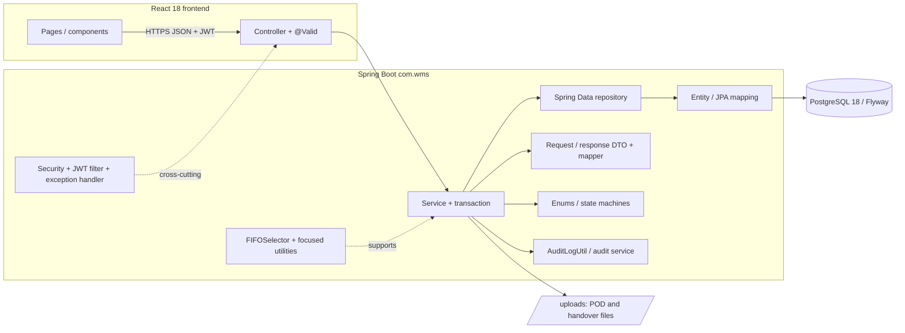

**_Package descriptions_**

| No  | Package                                                             | Description                                                                                          |
| --- | ------------------------------------------------------------------- | ---------------------------------------------------------------------------------------------------- |
| 01  | `com.wms.controller`                                                | REST controllers, validation boundary, Swagger annotations, không chứa business logic                |
| 02  | `com.wms.service` / `com.wms.service.impl`                          | Business logic, transaction management, authorization, audit logging, invariant enforcement          |
| 03  | `com.wms.repository`                                                | Spring Data JPA repositories, không dùng raw SQL                                                     |
| 04  | `com.wms.entity`                                                    | JPA entity mapping database tables và relationships                                                  |
| 05  | `com.wms.dto.request` / `com.wms.dto.response` / `com.wms.dto.auth` | DTO cho request (Jakarta Validation) và response                                                     |
| 06  | `com.wms.enums`                                                     | Domain constants và state machines (VD: `ReceiptStatus`, `UserRole`, `InterWarehouseTransferStatus`) |
| 07  | `com.wms.config`                                                    | Security, JWT filter, Flyway, mail, JPA config, `UploadResourceConfig`                               |
| 08  | `com.wms.exception`                                                 | Typed exceptions và `GlobalExceptionHandler`                                                         |
| 09  | `com.wms.mapper`                                                    | DTO/entity mapping helpers                                                                           |
| 10  | `com.wms.util`                                                      | Focused utilities (VD: `FIFOSelector`), không có hidden business mutation                            |
| 11  | `com.wms.aop`                                                       | Cross-cutting concerns (khi có)                                                                      |

Frontend theo cấu trúc React 18 + Tailwind: `components/` (PascalCase), `pages/`, `hooks/` (camelCase), `services/` (API calls), `stores/` (Zustand), `utils/`.

---

# II. Requirement Specifications

> **Phạm vi phần này:** tài liệu viết đầy đủ chi tiết (Functional Description + Business Rules) theo đúng mẫu template cho **toàn bộ 10 nhóm nghiệp vụ (Spec 001–010)**, đồng bộ với danh sách Use Case tại mục I.1.2. Spec 011–012 là quality/testing cross-cutting, không có UI/DB use case nghiệp vụ riêng.

## 1. Security, Authentication & RBAC (Spec 001)

### 1.1 UC-01_Configure System Parameters

#### a. Functionalities

| UC ID and Name:    | UC-01_Configure System Parameters                                                                                                                                                                                                                          |                   |            |
| ------------------ | ---------------------------------------------------------------------------------------------------------------------------------------------------------------------------------------------------------------------------------------------------------- | ----------------- | ---------- |
| Created By:        | WMS Dev Team                                                                                                                                                                                                                                               | Date Created:     | 2026-07-14 |
| Primary Actor:     | System Admin                                                                                                                                                                                                                                               | Secondary Actors: | None       |
| Trigger:           | System Admin cần cấu hình các tham số hệ thống mặc định (hạn mức công nợ, tồn kho tối thiểu, kỳ hạn thanh toán, ngày khóa kỳ kế toán)                                                                                                                    |                   |            |
| Description:       | System Admin truy cập giao diện cấu hình hệ thống để cập nhật các tham số global, áp dụng cho toàn bộ hệ thống hoặc từng dealer                                                                                                                         |                   |            |
| Preconditions:     | PRE-1: User đã đăng nhập với role `ADMIN`.                                                                                                                                                                                                                 |                   |            |
| Postconditions:    | POST-1: `system_configs` được cập nhật với các giá trị mới.<br>POST-2: Ghi audit log `SYSTEM_CONFIG_UPDATED`.                                                                                                                                            |                   |            |
| Normal Flow:       | 1.0 Configure System Parameters<br>1. System Admin truy cập màn hình System Config<br>2. System Admin nhập/cập nhật các tham số (default credit limit, min stock level, payment term days, period close day)<br>3. System Admin xác nhận lưu<br>4. Hệ thống validate và lưu `system_configs`<br>5. Ghi audit log `SYSTEM_CONFIG_UPDATED` |                   |            |
| Alternative Flows: | None                                                                                                                                                                                                                                                       |                   |            |
| Exceptions:        | 1.0.E1 Giá trị không hợp lệ (âm, quá lớn)<br>1. Hệ thống trả lỗi `INVALID_CONFIG_VALUE` (400)<br>1.0.E2 Không có quyền<br>1. Hệ thống trả `FORBIDDEN` (403)                                                                                                |                   |            |
| Priority:          | Must Have                                                                                                                                                                                                                                                  |                   |            |
| Frequency of Use:  | Hiếm — chỉ khi cần thay đổi chính sách                                                                                                                                                                                                                    |                   |            |
| Business Rules:    | BR-SEC-01                                                                                                                                                                                                                                                  |                   |            |
| Other Information: | Các tham số này dùng làm mặc định cho hạn mức công nợ Đại lý mới, kỳ hạn thanh toán mặc định, tồn kho tối thiểu cảnh báo.                                                                                                                                 |                   |            |
| Assumptions:       | System Admin hiểu rõ ý nghĩa của từng tham số.                                                                                                                                                                                                              |                   |            |

#### b. Business Rules

| ID        | Business Rule             | Business Rule Description                           |
| --------- | ------------------------- | --------------------------------------------------- |
| BR-SEC-01 | Role-based Access Control | Chỉ ADMIN được cấu hình hệ thống, không ai khác    |

### 1.2 UC-02_Manage Users & Role/Warehouse Assignment

#### a. Functionalities

| UC ID and Name:    | UC-02_Manage Users & Role/Warehouse Assignment                                                                                                                                                                         |                   |            |
| ------------------ | ---------------------------------------------------------------------------------------------------------------------------------------------------------------------------------------------------------------------- | ----------------- | ---------- |
| Created By:        | WMS Dev Team                                                                                                                                                                                                           | Date Created:     | 2026-07-14 |
| Primary Actor:     | System Admin                                                                                                                                                                                                           | Secondary Actors: | None       |
| Trigger:           | System Admin cần tạo/vô hiệu hóa tài khoản hoặc gán role + kho cho user                                                                                                                                                |                   |            |
| Description:       | System Admin quản lý vòng đời tài khoản người dùng, phân quyền theo role (10 roles), và gán chi nhánh kho cho từng user (1+ kho)                                                                                      |                   |            |
| Preconditions:     | PRE-1: User đã đăng nhập với role `ADMIN`.                                                                                                                                                                            |                   |            |
| Postconditions:    | POST-1: `users` record được tạo/cập nhật với `is_active` flag.<br>POST-2: `user_warehouse_assignments` được cập nhật theo danh sách kho gán.<br>POST-3: Ghi audit log `USER_CREATED`/`USER_UPDATED`/`USER_DEACTIVATED`. |                   |            |
| Normal Flow:       | 2.0 Manage Users<br>1. System Admin truy cập User List<br>2. System Admin chọn "Tạo User" hoặc chỉnh sửa user hiện tại<br>3. System Admin nhập email, full name, phone, job_title, role, danh sách kho<br>4. System Admin xác nhận<br>5. Hệ thống validate email unique + role valid<br>6. Lưu `users` + `user_warehouse_assignments`<br>7. Ghi audit log |                   |            |
| Alternative Flows: | 2.1 Deactivate User<br>1. System Admin chọn user, bấm "Vô hiệu hóa"<br>2. Hệ thống đặt `users.is_active = false`<br>3. User đó không thể đăng nhập nữa, nhưng lịch sử vẫn giữ                                        |                   |            |
| Exceptions:        | 2.0.E1 Email đã tồn tại<br>1. Hệ thống trả `DUPLICATE_EMAIL` (409)<br>2.0.E2 Role không hợp lệ<br>1. Hệ thống trả `INVALID_ROLE` (400)                                                                                |                   |            |
| Priority:          | Must Have                                                                                                                                                                                                              |                   |            |
| Frequency of Use:  | Định kỳ khi có nhân viên mới hoặc thay đổi quyền                                                                                                                                                                      |                   |            |
| Business Rules:    | BR-SEC-01, BR-SEC-02                                                                                                                                                                                                  |                   |            |
| Other Information: | Mỗi user có thể được gán vào 1+ kho; khi thao tác warehouse-scoped, user chỉ thấy dữ liệu của kho được gán.                                                                                                          |                   |            |
| Assumptions:       | Email là định danh duy nhất của người dùng.                                                                                                                                                                            |                   |            |

#### b. Business Rules

| ID        | Business Rule                  | Business Rule Description                                                                       |
| --------- | ------------------------------ | ----------------------------------------------------------------------------------------------- |
| BR-SEC-02 | Warehouse-scoped RBAC          | Mọi warehouse operation phải kiểm tra CẢ role LẪN warehouse assignment; không chỉ role          |

### 1.3 UC-03_Login (JWT)

#### a. Functionalities

| UC ID and Name:    | UC-03_Login (JWT)                                                                                                                                                                                                                                                            |                   |            |
| ------------------ | ---------------------------------------------------------------------------------------------------------------------------------------------------------------------------------------------------------------------------------------------------------------------------- | ----------------- | ---------- |
| Created By:        | WMS Dev Team                                                                                                                                                                                                                                                                | Date Created:     | 2026-07-14 |
| Primary Actor:     | Người dùng (bất kỳ role)                                                                                                                                                                                                                                                    | Secondary Actors: | None       |
| Trigger:           | User nhập email/password trên giao diện login                                                                                                                                                                                                                               |                   |            |
| Description:       | Hệ thống xác thực email/password, sinh JWT access token (15 phút) + refresh token (7 ngày), trả lại cho client                                                                                                                                                            |                   |            |
| Preconditions:     | PRE-1: User tài khoản đã tồn tại và `is_active = true`.<br>PRE-2: Password đã được hash bằng bcrypt (cost ≥ 12).                                                                                                                                                          |                   |            |
| Postconditions:    | POST-1: `users.refresh_token_hash` được cập nhật, `refresh_token_expires_at` được set.<br>POST-2: Trả access token + refresh token cho client.<br>POST-3: Ghi audit log `USER_LOGIN`.                                                                                      |                   |            |
| Normal Flow:       | 3.0 Login<br>1. User nhập email + password<br>2. Hệ thống tìm user theo email<br>3. Hệ thống verify password bằng bcrypt.compare (xem 3.0.E1)<br>4. Hệ thống sinh JWT access token (15m) + refresh token (7d)<br>5. Hash refresh token lưu vào `users.refresh_token_hash`<br>6. Trả access + refresh token<br>7. Ghi audit log `USER_LOGIN` |                   |            |
| Alternative Flows: | 3.1 Token Refresh<br>1. Client gửi `/auth/refresh` với refresh token<br>2. Hệ thống verify hash khớp + chưa hết hạn<br>3. Sinh access token mới<br>4. Return new access token                                                                                              |                   |            |
| Exceptions:        | 3.0.E1 Email không tồn tại hoặc `is_active = false`<br>1. Hệ thống trả `UNAUTHORIZED` (401)<br>3.0.E2 Password sai<br>1. Hệ thống trả `UNAUTHORIZED` (401)<br>3.0.E3 Refresh token không hợp lệ hoặc hết hạn<br>1. Hệ thống trả `UNAUTHORIZED` (401)             |                   |            |
| Priority:          | Must Have                                                                                                                                                                                                                                                                    |                   |            |
| Frequency of Use:  | Mỗi user session                                                                                                                                                                                                                                                            |                   |            |
| Business Rules:    | BR-AUTH-01, BR-AUTH-02                                                                                                                                                                                                                                                     |                   |            |
| Other Information: | JWT không lưu session; stateless. Client phải gửi access token ở header `Authorization: Bearer <token>` cho mọi request.                                                                                                                                                    |                   |            |
| Assumptions:       | Client tin tưởng gửi password qua HTTPS. Refresh token được lưu trữ an toàn ở client.                                                                                                                                                                                     |                   |            |

#### b. Business Rules

| ID         | Business Rule                  | Business Rule Description                                                                                      |
| ---------- | ------------------------------ | -------------------------------------------------------------------------------------------------------------- |
| BR-AUTH-01 | Bcrypt Password Hashing        | Password phải hash bằng bcrypt (cost ≥ 12) trước lưu DB; never plain text                                     |
| BR-AUTH-02 | JWT Token Expiry               | Access token: 15 phút; Refresh token: 7 ngày; refresh token phải hash trước lưu                               |

### 1.4 UC-04_View Audit Log

#### a. Functionalities

| UC ID and Name:    | UC-04_View Audit Log                                                                                                                                                                                                          |                   |            |
| ------------------ | ----------------------------------------------------------------------------------------------------------------------------------------------------------------------------------------------------------------------------- | ----------------- | ---------- |
| Created By:        | WMS Dev Team                                                                                                                                                                                                                  | Date Created:     | 2026-07-14 |
| Primary Actor:     | System Admin                                                                                                                                                                                                                  | Secondary Actors: | None       |
| Trigger:           | System Admin cần tra cứu nhật ký hoạt động hệ thống (ai làm gì, khi nào)                                                                                                                                                    |                   |            |
| Description:       | System Admin xem danh sách audit log (append-only, không cho sửa/xóa), filter theo actor/entity/time/warehouse                                                                                                                |                   |            |
| Preconditions:     | PRE-1: User đã đăng nhập với role `ADMIN`.                                                                                                                                                                                   |                   |            |
| Postconditions:    | POST-1: Trả danh sách audit log theo filter (read-only, không mutate dữ liệu).                                                                                                                                                |                   |            |
| Normal Flow:       | 4.0 Query Audit Log<br>1. System Admin truy cập Audit Log screen<br>2. System Admin nhập filter (actor email, action, entity_type, date range, warehouse)<br>3. Hệ thống query `audit_logs` theo filter và page/size<br>4. Hiển thị kết quả từ backend cùng `totalItems`/`totalPages`; khi đổi trang, UI gọi backend cho trang mới thay vì chỉ cắt dữ liệu trang đầu |                   |            |
| Alternative Flows: | None                                                                                                                                                                                                                          |                   |            |
| Exceptions:        | None (read-only, không có mutation error)                                                                                                                                                                                    |                   |            |
| Priority:          | Must Have                                                                                                                                                                                                                     |                   |            |
| Frequency of Use:  | Hiếm — khi cần debug hoặc compliance check                                                                                                                                                                                    |                   |            |
| Business Rules:    | BR-SEC-01, BR-AUD-01                                                                                                                                                                                                          |                   |            |
| Other Information: | Audit log là append-only; không bao giờ cho update/delete. Nó lưu actor, action, entity_type, entity_id, old_value (JSON), new_value (JSON), timestamp.                                                                     |                   |            |
| Assumptions:       | None                                                                                                                                                                                                                          |                   |            |

#### b. Business Rules

| ID        | Business Rule      | Business Rule Description                                                                 |
| --------- | ------------------ | ----------------------------------------------------------------------------------------- |
| BR-AUD-01 | Audit Log Immutable | Audit log là append-only; không cho update/delete; chỉ ADMIN có quyền query               |

---

## 2. Master Data Management (Spec 002)

### 2.1 UC-05_Manage Product/SKU Catalog

#### a. Functionalities

| UC ID and Name:    | UC-05_Manage Product/SKU Catalog                                                                                                                                                                                                                           |                   |            |
| ------------------ | ---------------------------------------------------------------------------------------------------------------------------------------------------------------------------------------------------------------------------------------------------------- | ----------------- | ---------- |
| Created By:        | WMS Dev Team                                                                                                                                                                                                                                               | Date Created:     | 2026-07-14 |
| Primary Actor:     | Thủ kho kiêm QC (STOREKEEPER)                                                                                                                                                                                                                              | Secondary Actors: | Admin      |
| Trigger:           | Cần tạo/cập nhật sản phẩm mới vào danh mục                                                                                                                                                                                                               |                   |            |
| Description:       | Thủ kho nhập thông tin SKU (mã, tên, đơn vị, quy cách), hệ thống validate SKU unique, lưu và cho phép tái sử dụng trong receipt/issue/transfer                                                                                                           |                   |            |
| Preconditions:     | PRE-1: User có role `STOREKEEPER` hoặc `ADMIN`.                                                                                                                                                                                                            |                   |            |
| Postconditions:    | POST-1: `products` record được tạo/cập nhật với `is_active` flag.<br>POST-2: Ghi audit log `PRODUCT_CREATED`/`PRODUCT_UPDATED`.                                                                                                                         |                   |            |
| Normal Flow:       | 5.0 Manage Product<br>1. Thủ kho truy cập Product/SKU List<br>2. Thủ kho chọn "Tạo SKU" hoặc chỉnh sửa SKU hiện tại<br>3. Thủ kho nhập SKU (bắt buộc, unique), tên, đơn vị tính, quy cách, trọng lượng, thể tích, reorder_point<br>4. Xác nhận<br>5. Hệ thống validate + lưu `products`<br>6. Ghi audit log |                   |            |
| Alternative Flows: | 5.1 Deactivate Product<br>1. Thủ kho chọn product, bấm "Vô hiệu hóa"<br>2. Hệ thống đặt `products.is_active = false`<br>3. Product đó không thể dùng trong receipt/issue/transfer mới                                                                      |                   |            |
| Exceptions:        | 5.0.E1 SKU đã tồn tại<br>1. Hệ thống trả `DUPLICATE_SKU` (409)<br>5.0.E2 SKU không được phép sửa sau tạo<br>1. Nếu là update: chỉ cho sửa tên/đơn vị/trọng lượng/thể tích, không cho sửa SKU                                                                |                   |            |
| Priority:          | Must Have                                                                                                                                                                                                                                                  |                   |            |
| Frequency of Use:  | Khi có sản phẩm mới, thường hiếm                                                                                                                                                                                                                         |                   |            |
| Business Rules:    | BR-PROD-01                                                                                                                                                                                                                                                 |                   |            |
| Other Information: | Domain hàng gia dụng: không có serial, không có hạn sử dụng, không có grade. Mỗi SKU chỉ là danh mục đơn giản.                                                                                                                                          |                   |            |
| Assumptions:       | SKU là định danh vĩnh viễn; không được thay đổi sau tạo.                                                                                                                                                                                                  |                   |            |

#### b. Business Rules

| ID        | Business Rule     | Business Rule Description                                                   |
| --------- | ----------------- | --------------------------------------------------------------------------- |
| BR-PROD-01 | Unique SKU & Immutable | SKU phải unique và không được sửa sau khi tạo; chỉ tên/unit/specs được sửa |

### 2.2 UC-06_Configure Warehouse Zones & Bin Locations

#### a. Functionalities

| UC ID and Name:    | UC-06_Configure Warehouse Zones & Bin Locations                                                                                                                                                                                                                                |                   |            |
| ------------------ | ------------------------------------------------------------------------------------------------------------------------------------------------------------------------------------------------------------------------------------------------------------------------------- | ----------------- | ---------- |
| Created By:        | WMS Dev Team                                                                                                                                                                                                                                                                    | Date Created:     | 2026-07-14 |
| Primary Actor:     | Trưởng kho / System Admin                                                                                                                                                                                                                                                       | Secondary Actors: | None       |
| Trigger:           | Cần cấu hình zone (VD: receiving, storage, picking, shipping) và bin location (VD: HP.A.01, HP.A.02) cho kho                                                                                                                                                                 |                   |            |
| Description:       | Trưởng kho/Admin tạo zone, bin, cấu hình sức chứa (volume/weight), đánh dấu quarantine zone, set is_locked khi stocktake                                                                                                                                                      |                   |            |
| Preconditions:     | PRE-1: User có role `WAREHOUSE_MANAGER` hoặc `ADMIN`.<br>PRE-2: Warehouse đã tồn tại.                                                                                                                                                                                          |                   |            |
| Postconditions:    | POST-1: `warehouse_locations` được tạo/cập nhật với phân cấp zone → bin.<br>POST-2: Ghi audit log `LOCATION_CREATED`/`LOCATION_UPDATED`.                                                                                                                                      |                   |            |
| Normal Flow:       | 6.0 Configure Zones & Bins<br>1. Trưởng kho truy cập Warehouse Config > Zones/Bins<br>2. Trưởng kho tạo Zone (VD: receiving, storage, quarantine)<br>3. Trưởng kho tạo Bins dưới mỗi Zone (VD: A.01, A.02) + cấu hình capacity (m³/kg)<br>4. Xác nhận<br>5. Hệ thống validate + lưu hierarchy<br>6. Ghi audit log |                   |            |
| Alternative Flows: | 6.1 Mark Quarantine Zone<br>1. Trưởng kho chọn zone, đánh dấu `is_quarantine = true`<br>2. Hàng fail QC sẽ được đưa vào zone này tự động<br>6.2 Lock Locations for Stocktake<br>1. Khi stocktake `IN_PROGRESS`, system tự động `is_locked = true` cho mọi bins (không phải quarantine)<br>2. Khi stocktake `CLOSED`, tự động unlock |                   |            |
| Exceptions:        | 6.0.E1 Location code đã tồn tại trong warehouse<br>1. Hệ thống trả `DUPLICATE_LOCATION_CODE` (409)<br>6.0.E2 Phân cấp không hợp lệ (VD tạo bin dưới bin)<br>1. Hệ thống trả `INVALID_LOCATION_HIERARCHY` (422)                                                                  |                   |            |
| Priority:          | Must Have                                                                                                                                                                                                                                                                        |                   |            |
| Frequency of Use:  | Định kỳ khi cần điều chỉnh kho (hiếm)                                                                                                                                                                                                                                          |                   |            |
| Business Rules:    | BR-LOC-01, BR-LOC-02                                                                                                                                                                                                                                                             |                   |            |
| Other Information: | Phân cấp: Warehouse → Zone → Bin. Quarantine zone không được dùng putaway hàng bình thường, chỉ cho hàng fail QC/disposal.                                                                                                                                                    |                   |            |
| Assumptions:       | None                                                                                                                                                                                                                                                                             |                   |            |

#### b. Business Rules

| ID        | Business Rule          | Business Rule Description                                                                  |
| --------- | ---------------------- | ------------------------------------------------------------------------------------------ |
| BR-LOC-01 | Location Hierarchy     | Zone → Bin hierarchy cấm không được vi phạm; không dùng bin làm parent của bin khác       |
| BR-LOC-02 | Quarantine Zone Strict | Quarantine zone không được putaway hàng bình thường; chỉ nhập/xuất hàng lỗi QC và disposal |

### 2.3 UC-07_Manage Dealer/Supplier & Credit Limit

#### a. Functionalities

| UC ID and Name:    | UC-07_Manage Dealer/Supplier & Credit Limit                                                                                                                                                                                                                    |                   |            |
| ------------------ | -------------------------------------------------------------------------------------------------------------------------------------------------------------------------------------------------------------------------------------------------------------- | ----------------- | ---------- |
| Created By:        | WMS Dev Team                                                                                                                                                                                                                                                   | Date Created:     | 2026-07-14 |
| Primary Actor:     | Kế toán viên (ACCOUNTANT) tạo hồ sơ; Kế toán trưởng (ACCOUNTANT_MANAGER) duyệt Credit Limit                                                                                                                                                                   | Secondary Actors: | None       |
| Trigger:           | Có Đại lý mới cần lập hồ sơ hoặc cần cập nhật Credit Limit                                                                                                                                                                                                     |                   |            |
| Description:       | Kế toán viên nhập thông tin Đại lý (tên, địa chỉ, phone, email, điều khoản thanh toán); Kế toán trưởng thiết lập Credit Limit và kỳ hạn thanh toán (Net 30/60)                                                                                              |                   |            |
| Preconditions:     | PRE-1: User có role `ACCOUNTANT` (tạo hồ sơ) hoặc `ACCOUNTANT_MANAGER` (duyệt Credit Limit).                                                                                                                                                                  |                   |            |
| Postconditions:    | POST-1: `dealers` hoặc `suppliers` record được tạo/cập nhật.<br>POST-2: Ghi audit log `DEALER_CREATED`/`CREDIT_LIMIT_UPDATED`.                                                                                                                               |                   |            |
| Normal Flow:       | 7.0 Manage Dealers/Suppliers<br>1. Kế toán viên truy cập Dealer/Supplier List<br>2. Kế toán viên tạo dealer: tên, địa chỉ, phone, email, bank account (tùy chọn)<br>3. Kế toán viên xác nhận<br>4. Hệ thống lưu `dealers` (hoặc `suppliers` nếu NCC)<br>5. Kế toán trưởng duyệt: set `credit_limit`, `payment_term_days`, `credit_status = ACTIVE`<br>6. Ghi audit log |                   |            |
| Alternative Flows: | 7.1 Update Credit Limit<br>1. Kế toán trưởng chọn dealer, bấm "Cập nhật Credit Limit"<br>2. Nhập limit mới + ngày hiệu lực<br>3. Hệ thống cập nhật `dealers.credit_limit`<br>4. Ghi audit log `CREDIT_LIMIT_UPDATED` + snapshot old/new                                |                   |            |
| Exceptions:        | 7.0.E1 Email đã tồn tại<br>1. Hệ thống trả `DUPLICATE_EMAIL` (409)<br>7.0.E2 Credit Limit âm hoặc quá lớn<br>1. Hệ thống trả `INVALID_CREDIT_LIMIT` (400)                                                                                                    |                   |            |
| Priority:          | Must Have                                                                                                                                                                                                                                                      |                   |            |
| Frequency of Use:  | Khi có đại lý mới hoặc audit credit định kỳ                                                                                                                                                                                                                    |                   |            |
| Business Rules:    | BR-DEAL-01, BR-DEAL-02                                                                                                                                                                                                                                         |                   |            |
| Other Information: | Credit Limit = hạn mức nợ tối đa; khi balance + new DO > limit → hệ thống chặn (CREDIT_HOLD).                                                                                                                                                              |                   |            |
| Assumptions:       | Kế toán trưởng hiểu rõ credit risk từng đại lý.                                                                                                                                                                                                               |                   |            |

#### b. Business Rules

| ID        | Business Rule       | Business Rule Description                                                                          |
| --------- | ------------------- | -------------------------------------------------------------------------------------------------- |
| BR-DEAL-01 | RBAC Dealer Mgmt    | Chỉ ACCOUNTANT tạo, ACCOUNTANT_MANAGER duyệt Credit Limit                                         |
| BR-DEAL-02 | Credit Check Gate   | Khi tạo DO, kiểm tra IF current_balance + DO_value > credit_limit OR >30d overdue → CREDIT_HOLD  |

### 2.4 UC-08_Manage Vehicles & Drivers

#### a. Functionalities

| UC ID and Name:    | UC-08_Manage Vehicles & Drivers                                                                                                                                                                                                                                  |                   |            |
| ------------------ | ---------------------------------------------------------------------------------------------------------------------------------------------------------------------------------------------------------------------------------------------------------------- | ----------------- | ---------- |
| Created By:        | WMS Dev Team                                                                                                                                                                                                                                                     | Date Created:     | 2026-07-14 |
| Primary Actor:     | Dispatcher (DISPATCHER) / System Admin                                                                                                                                                                                                                          | Secondary Actors: | None       |
| Trigger:           | Cần thêm xe tải mới hoặc tài xế mới vào danh mục nội bộ Phúc Anh                                                                                                                                                                                                |                   |            |
| Description:       | Dispatcher/Admin quản lý danh mục xe tải (biển số, tải trọng, thể tích) và tài xế (tên, phạm vi kho hoạt động)                                                                                                                                               |                   |            |
| Preconditions:     | PRE-1: User có role `DISPATCHER` hoặc `ADMIN`.                                                                                                                                                                                                                   |                   |            |
| Postconditions:    | POST-1: `vehicles` hoặc `drivers` record được tạo/cập nhật.<br>POST-2: Ghi audit log `VEHICLE_CREATED`/`DRIVER_CREATED`.                                                                                                                                      |                   |            |
| Normal Flow:       | 8.0 Manage Vehicles & Drivers<br>1. Dispatcher truy cập Vehicle/Driver List<br>2. Dispatcher tạo vehicle: biển số, tải trọng (kg), thể tích (m³), tình trạng<br>3. Dispatcher tạo driver: tên, phone, user_id, warehouse(s) phạm vi hoạt động<br>4. Xác nhận<br>5. Hệ thống lưu `vehicles` + `drivers`<br>6. Ghi audit log |                   |            |
| Alternative Flows: | 8.1 Deactivate Vehicle/Driver<br>1. Dispatcher chọn vehicle/driver, bấm "Vô hiệu hóa"<br>2. Hệ thống đặt `is_active = false`<br>3. Xe/tài xế không thể gán cho trip mới                                                                                      |                   |            |
| Exceptions:        | 8.0.E1 Biển số xe đã tồn tại<br>1. Hệ thống trả `DUPLICATE_PLATE_NUMBER` (409)<br>8.0.E2 Tải trọng/thể tích không hợp lệ<br>1. Hệ thống trả `INVALID_VEHICLE_SPECS` (400)                                                                                   |                   |            |
| Priority:          | Must Have                                                                                                                                                                                                                                                        |                   |            |
| Frequency of Use:  | Định kỳ khi có xe/tài xế mới hoặc thay đổi (hiếm)                                                                                                                                                                                                               |                   |            |
| Business Rules:    | BR-FLEET-01                                                                                                                                                                                                                                                      |                   |            |
| Other Information: | Tài xế gán với 1+ warehouse để giới hạn phạm vi hoạt động. Khi dispatcher lập trip, phải chọn xe/tài xế trong phạm vi kho.                                                                                                                                   |                   |            |
| Assumptions:       | Phúc Anh chỉ dùng xe nội bộ, không dùng 3PL.                                                                                                                                                                                                                    |                   |            |

#### b. Business Rules

| ID        | Business Rule       | Business Rule Description                                                          |
| --------- | ------------------- | ----------------------------------------------------------------------------------- |
| BR-FLEET-01 | Internal Fleet Only | Tất cả xe phải nội bộ Phúc Anh, gán warehouse scope; không 3PL, không outsource   |

---

## 3. Inbound Receipt & QC (Spec 003)

### 3.1 UC-09_Create Purchase Receipt

#### a. Functionalities

**Functional Description Template**

| UC ID and Name:    | UC-09_Create Purchase Receipt                                                                                                                                                                                                                                                                                                                                                                                                                                |                   |            |
| ------------------ | ------------------------------------------------------------------------------------------------------------------------------------------------------------------------------------------------------------------------------------------------------------------------------------------------------------------------------------------------------------------------------------------------------------------------------------------------------------ | ----------------- | ---------- |
| Created By:        | WMS Dev Team                                                                                                                                                                                                                                                                                                                                                                                                                                                 | Date Created:     | 2026-07-14 |
| Primary Actor:     | Planner                                                                                                                                                                                                                                                                                                                                                                                                                                                      | Secondary Actors: | None       |
| Trigger:           | Planner nhận thông tin hàng về từ Công ty mẹ qua Zalo/Email                                                                                                                                                                                                                                                                                                                                                                                                  |                   |            |
| Description:       | Planner nhập thông tin lệnh nhập kho lên hệ thống ở trạng thái chờ tiếp nhận, làm cơ sở để Nhân viên kho đếm hàng thực tế khi hàng đến                                                                                                                                                                                                                                                                                                                       |                   |            |
| Preconditions:     | PRE-1: Planner đã đăng nhập với role `PLANNER`.<br>PRE-2: SKU trong lệnh nhập đã tồn tại trong danh mục sản phẩm.                                                                                                                                                                                                                                                                                                                                            |                   |            |
| Postconditions:    | POST-1: Bản ghi `receipts` được tạo với `status = 'PENDING_RECEIPT'`.<br>POST-2: Các `receipt_items` tương ứng được tạo với `expected_qty` theo lệnh nhập.                                                                                                                                                                                                                                                                                                   |                   |            |
| Normal Flow:       | 9.0 Create Purchase Receipt<br>1. Planner truy cập màn hình Receipt List, chọn "Tạo Lệnh nhập"<br>2. Planner nhập kho nhận hàng, mã lệnh/nguồn gốc (`source_order_code`), danh sách SKU + số lượng dự kiến<br>3. Planner xác nhận tạo<br>4. Hệ thống validate dữ liệu đầu vào (xem 9.0.E1)<br>5. Hệ thống tạo `receipts` (`PENDING_RECEIPT`) và `receipt_items`<br>6. Hệ thống ghi audit log `RECEIPT_CREATE`<br>7. Hệ thống hiển thị Receipt Detail vừa tạo |                   |            |
| Alternative Flows: | None                                                                                                                                                                                                                                                                                                                                                                                                                                                         |                   |            |
| Exceptions:        | 9.0.E1 Dữ liệu đầu vào không hợp lệ (SKU không tồn tại, số lượng ≤ 0)<br>1. Hệ thống trả lỗi `VALIDATION_ERROR` (400)<br>2. Không tạo bản ghi nào                                                                                                                                                                                                                                                                                                            |                   |            |
| Priority:          | Must Have                                                                                                                                                                                                                                                                                                                                                                                                                                                    |                   |            |
| Frequency of Use:  | ~30–50 lệnh nhập/tháng/kho (ước tính theo scale 1000+ giao dịch/tháng toàn hệ thống)                                                                                                                                                                                                                                                                                                                                                                         |                   |            |
| Business Rules:    | BR-INV-01, BR-INV-04                                                                                                                                                                                                                                                                                                                                                                                                                                         |                   |            |
| Other Information: | Không kiểm QC ở bước này.                                                                                                                                                                                                                                                                                                                                                                                                                                    |                   |            |
| Assumptions:       | Planner nhận thông tin chính xác từ Công ty mẹ; hệ thống không xác thực chéo với hệ thống Công ty mẹ trong Sprint 1.                                                                                                                                                                                                                                                                                                                                         |                   |            |

#### b. Business Rules

| ID        | Business Rule              | Business Rule Description                                                                    |
| --------- | -------------------------- | -------------------------------------------------------------------------------------------- |
| BR-INV-01 | Non-negative inventory     | `inventories.total_qty >= 0`, `reserved_qty >= 0`, `total_qty - reserved_qty >= 0` luôn đúng |
| BR-INV-04 | No direct inventory update | Điều chỉnh tồn kho chỉ được đi qua receipt/issue/transfer/adjustment/stocktake flow          |

### 3.2 UC-10_Record Physical Receive Count

#### a. Functionalities

| UC ID and Name:    | UC-10_Record Physical Receive Count                                                                                                                                                                                                                                                                                                                                                                                                                                                            |                   |            |
| ------------------ | ---------------------------------------------------------------------------------------------------------------------------------------------------------------------------------------------------------------------------------------------------------------------------------------------------------------------------------------------------------------------------------------------------------------------------------------------------------------------------------------------- | ----------------- | ---------- |
| Created By:        | WMS Dev Team                                                                                                                                                                                                                                                                                                                                                                                                                                                                                   | Date Created:     | 2026-07-14 |
| Primary Actor:     | Nhân viên kho (WAREHOUSE_STAFF)                                                                                                                                                                                                                                                                                                                                                                                                                                                                | Secondary Actors: | None       |
| Trigger:           | Hàng hóa thực tế được giao đến kho                                                                                                                                                                                                                                                                                                                                                                                                                                                             |                   |            |
| Description:       | Nhân viên kho đếm số lượng nhận được cho từng dòng hàng và nhập vào phiếu nhận hàng; feature này chỉ đếm số lượng, không QC                                                                                                                                                                                                                                                                                                                                                                    |                   |            |
| Preconditions:     | PRE-1: Receipt đang ở trạng thái `PENDING_RECEIPT`, `DRAFT`, `QC_COMPLETED`, hoặc `QC_FAILED`.<br>PRE-2: User có role `WAREHOUSE_STAFF` và được gán vào kho của Receipt.                                                                                                                                                                                                                                                                                                                       |                   |            |
| Postconditions:    | POST-1: `actual_qty`/`over_received_qty` được tính và lưu cho mọi dòng hàng.<br>POST-2: Receipt chuyển `DRAFT` (nếu từ `PENDING_RECEIPT`) hoặc quay lại `DRAFT` (nếu sửa sau khi đã có QC).                                                                                                                                                                                                                                                                                                    |                   |            |
| Normal Flow:       | 10.0 Record Complete Count<br>1. Nhân viên kho mở Receipt Detail đang `PENDING_RECEIPT`<br>2. Nhân viên kho nhập `counted_qty` cho TẤT CẢ dòng hàng (bắt buộc đủ, không được thiếu dòng)<br>3. Nhân viên kho xác nhận gửi<br>4. Hệ thống validate (xem 10.0.E1, 10.0.E2)<br>5. Hệ thống tính `actual_qty = min(counted_qty, expected_qty)`, `over_received_qty = max(counted_qty - expected_qty, 0)`<br>6. Hệ thống cập nhật `status = 'DRAFT'`<br>7. Hệ thống ghi audit log `RECEIPT_RECEIVE` |                   |            |
| Alternative Flows: | 10.1 Correct Count Before Manager Decision<br>1. Nhân viên kho sửa `counted_qty` khi Receipt chưa `APPROVED`/`RETURN_TO_SUPPLIER_PENDING`<br>2. Nếu Receipt đã có dữ liệu QC, hệ thống xóa `qc_result`/`sample_*`/`qc_failure_reason` và đưa Receipt về `DRAFT`<br>3. Return to step 5 of normal flow                                                                                                                                                                                          |                   |            |
| Exceptions:        | 10.0.E1 Thiếu dòng hàng trong request<br>1. Hệ thống trả `RECEIPT_COUNT_INCOMPLETE` (422), không lưu thay đổi<br>10.0.E2 `counted_qty` không hợp lệ (≤0 hoặc không nguyên)<br>1. Hệ thống trả `INVALID_RECEIPT_COUNT` (422), không lưu thay đổi<br>10.1.E1 Receipt đã `APPROVED`/`RETURN_TO_SUPPLIER_PENDING`<br>1. Hệ thống trả `RECEIPT_ALREADY_FINALIZED` (409)                                                                                                                             |                   |            |
| Priority:          | Must Have                                                                                                                                                                                                                                                                                                                                                                                                                                                                                      |                   |            |
| Frequency of Use:  | Mỗi lần nhận hàng thực tế, tương ứng số lượng lệnh nhập/tháng                                                                                                                                                                                                                                                                                                                                                                                                                                  |                   |            |
| Business Rules:    | BR-INV-01                                                                                                                                                                                                                                                                                                                                                                                                                                                                                      |                   |            |
| Other Information: | Feature này KHÔNG tạo batch, KHÔNG tăng tồn kho, KHÔNG đưa hàng vào quarantine, KHÔNG putaway.                                                                                                                                                                                                                                                                                                                                                                                                 |                   |            |
| Assumptions:       | Thiết bị quét mã vạch chưa sẵn có; nhập liệu thủ công là chính (LESSON-004).                                                                                                                                                                                                                                                                                                                                                                                                                   |                   |            |

#### b. Business Rules

None ngoài BR-INV-01 đã liệt kê ở trên.

### 3.3 UC-11_Perform Inbound QC Inspection

#### a. Functionalities

| UC ID and Name:    | UC-11_Perform Inbound QC Inspection                                                                                                                                                                                                                                                                    |                   |                       |
| ------------------ | ------------------------------------------------------------------------------------------------------------------------------------------------------------------------------------------------------------------------------------------------------------------------------------------------------ | ----------------- | --------------------- |
| Created By:        | WMS Dev Team                                                                                                                                                                                                                                                                                           | Date Created:     | 2026-07-14            |
| Primary Actor:     | Nhân viên kho (WAREHOUSE_STAFF)                                                                                                                                                                                                                                                                        | Secondary Actors: | Thủ kho (STOREKEEPER) |
| Trigger:           | Receipt ở trạng thái `DRAFT` sau khi đã đếm hàng xong                                                                                                                                                                                                                                                  |                   |                       |
| Description:       | Nhân viên kho hoặc Thủ kho kiểm tra ngoại quan/chất lượng mẫu và ghi nhận kết quả Đạt/Lỗi cho từng dòng hàng                                                                                                                                                                                           |                   |                       |
| Preconditions:     | PRE-1: Receipt đang `DRAFT` với `actual_qty` đã được ghi nhận đầy đủ.                                                                                                                                                                                                                                  |                   |                       |
| Postconditions:    | POST-1: Receipt chuyển `QC_COMPLETED` (có dòng đạt) hoặc `QC_FAILED` (toàn bộ lỗi), theo kết quả kiểm tra.<br>POST-2: KHÔNG tăng tồn kho thường hoặc tồn kho Quarantine ở bước này (chờ Trưởng kho quyết định).                                                                                        |                   |                       |
| Normal Flow:       | 11.0 Record QC Result<br>1. Nhân viên kho/Thủ kho mở QC Inbound Form của Receipt `DRAFT`<br>2. Nhập kết quả Đạt/Lỗi + lý do chi tiết cho từng dòng hàng<br>3. Xác nhận gửi<br>4. Hệ thống validate và cập nhật `qc_result`, chuyển trạng thái Receipt<br>5. Hệ thống ghi audit log `RECEIPT_QC_RECORD` |                   |                       |
| Alternative Flows: | None                                                                                                                                                                                                                                                                                                   |                   |                       |
| Exceptions:        | 11.0.E1 Receipt không ở trạng thái `DRAFT`<br>1. Hệ thống trả `INVALID_RECEIPT_STATUS` (409)                                                                                                                                                                                                           |                   |                       |
| Priority:          | Must Have                                                                                                                                                                                                                                                                                              |                   |                       |
| Frequency of Use:  | Mỗi Receipt sau khi đếm hàng                                                                                                                                                                                                                                                                           |                   |                       |
| Business Rules:    | BR-QC-01, BR-QC-02                                                                                                                                                                                                                                                                                     |                   |                       |
| Other Information: | Domain hàng gia dụng: không lấy mẫu theo hạn sử dụng/FEFO.                                                                                                                                                                                                                                             |                   |                       |
| Assumptions:       | None                                                                                                                                                                                                                                                                                                   |                   |                       |

#### b. Business Rules

| ID       | Business Rule        | Business Rule Description                                                                          |
| -------- | -------------------- | -------------------------------------------------------------------------------------------------- |
| BR-QC-01 | QC Gate              | Hàng nhập kho phải qua QC trước khi được tính vào available inventory                              |
| BR-QC-02 | Quarantine Exclusion | Hàng fail QC không được tính vào available inventory cho tới khi được xử lý theo flow RTV/disposal |

### 3.4 UC-12_Handle Quarantine & RTV

#### a. Functionalities

| UC ID and Name:    | UC-12_Handle Quarantine & RTV                                                                                                                                                                                                                                                                                     |                   |            |
| ------------------ | ----------------------------------------------------------------------------------------------------------------------------------------------------------------------------------------------------------------------------------------------------------------------------------------------------------------- | ----------------- | ---------- |
| Created By:        | WMS Dev Team                                                                                                                                                                                                                                                                                                      | Date Created:     | 2026-07-14 |
| Primary Actor:     | Trưởng kho                                                                                                                                                                                                                                                                                                        | Secondary Actors: | Thủ kho    |
| Trigger:           | Receipt có dòng hàng `QC_FAILED`                                                                                                                                                                                                                                                                                  |                   |            |
| Description:       | Trưởng kho quyết định trả hàng lỗi cho NCC (RTV); Thủ kho xác nhận đã bàn giao đủ hàng cho xe NCC                                                                                                                                                                                                                 |                   |            |
| Preconditions:     | PRE-1: Receipt có tồn Quarantine liên quan đến dòng `QC_FAILED`.                                                                                                                                                                                                                                                  |                   |            |
| Postconditions:    | POST-1: `debit_notes` được tạo cho NCC.<br>POST-2: `adjustments` loại `RETURN_TO_VENDOR` được tạo, ở trạng thái pending cho tới khi Thủ kho xác nhận.<br>POST-3: Sau xác nhận, tồn Quarantine bị trừ đúng bằng số lượng RTV.                                                                                      |                   |            |
| Normal Flow:       | 12.0 Create & Confirm RTV<br>1. Trưởng kho mở Quarantine/RTV Detail, chọn "Trả NCC"<br>2. Hệ thống tạo `debit_notes` + `adjustments (RETURN_TO_VENDOR)` pending<br>3. Thủ kho xác nhận đã bàn giao ĐỦ số lượng cho xe NCC (xem 12.0.E1)<br>4. Hệ thống trừ tồn Quarantine, ghi audit log `QUARANTINE_RTV_CONFIRM` |                   |            |
| Alternative Flows: | None                                                                                                                                                                                                                                                                                                              |                   |            |
| Exceptions:        | 12.0.E1 Xác nhận bàn giao thiếu/thừa số lượng<br>1. Hệ thống trả lỗi 422, không cho xác nhận một phần                                                                                                                                                                                                             |                   |            |
| Priority:          | Must Have                                                                                                                                                                                                                                                                                                         |                   |            |
| Frequency of Use:  | Theo tỷ lệ hàng lỗi QC thực tế (thường thấp)                                                                                                                                                                                                                                                                      |                   |            |
| Business Rules:    | BR-QC-02, BR-INV-04                                                                                                                                                                                                                                                                                               |                   |            |
| Other Information: | Feature 003 CHỈ xử lý RTV; luồng tiêu hủy hàng lỗi thuộc Spec 009.                                                                                                                                                                                                                                                |                   |            |
| Assumptions:       | None                                                                                                                                                                                                                                                                                                              |                   |            |

#### b. Business Rules

Đã liệt kê ở trên (BR-QC-02, BR-INV-04).

### 3.5 UC-13_Approve/Reject Receipt & Putaway

#### a. Functionalities

| UC ID and Name:    | UC-13_Approve/Reject Receipt & Putaway                                                                                                                                                                                                                                                                                                                                                                      |                   |            |
| ------------------ | ----------------------------------------------------------------------------------------------------------------------------------------------------------------------------------------------------------------------------------------------------------------------------------------------------------------------------------------------------------------------------------------------------------- | ----------------- | ---------- |
| Created By:        | WMS Dev Team                                                                                                                                                                                                                                                                                                                                                                                                | Date Created:     | 2026-07-14 |
| Primary Actor:     | Trưởng kho                                                                                                                                                                                                                                                                                                                                                                                                  | Secondary Actors: | Thủ kho    |
| Trigger:           | Receipt ở trạng thái `QC_COMPLETED`                                                                                                                                                                                                                                                                                                                                                                         |                   |            |
| Description:       | Trưởng kho phê duyệt hoặc từ chối phiếu nhập; sau khi duyệt, Thủ kho cất hàng vào Bin để hoàn tất nhập kho                                                                                                                                                                                                                                                                                                  |                   |            |
| Preconditions:     | PRE-1: Receipt đang `QC_COMPLETED`.                                                                                                                                                                                                                                                                                                                                                                         |                   |            |
| Postconditions:    | POST-1 (Approve): Receipt chuyển `APPROVED`, mở khóa putaway (chưa cộng tồn).<br>POST-2 (Putaway): Sau khi Thủ kho cất Bin, `inventories.total_qty` tăng tương ứng.<br>POST-3 (Reject): Receipt chuyển `RETURN_TO_SUPPLIER_PENDING`, lưu lý do; không tạo inventory/batch/RTV/Debit Note.                                                                                                                   |                   |            |
| Normal Flow:       | 13.0 Approve & Putaway<br>1. Trưởng kho mở Receipt Approval Detail, xem kết quả QC<br>2. Trưởng kho bấm "Duyệt nhập"<br>3. Hệ thống cập nhật Receipt `APPROVED`, ghi audit `RECEIPT_APPROVE`<br>4. Thủ kho mở Putaway Form, chọn Bin cho từng dòng hàng đạt (kiểm tra bin capacity — xem 13.0.E1)<br>5. Hệ thống tạo/cập nhật `batches`, tăng `inventories.total_qty`, ghi audit `RECEIPT_PUTAWAY_COMPLETE` |                   |            |
| Alternative Flows: | 13.1 Reject Receipt<br>1. Trưởng kho bấm "Từ chối", nhập lý do bắt buộc<br>2. Hệ thống chuyển Receipt `RETURN_TO_SUPPLIER_PENDING`, ghi audit `RECEIPT_REJECT`<br>3. Thủ kho xác nhận đã bàn giao xe NCC → Receipt chuyển `RETURNED_TO_SUPPLIER` (audit `RECEIPT_RETURN_CONFIRM`)                                                                                                                           |                   |            |
| Exceptions:        | 13.0.E1 Bin không đủ sức chứa<br>1. Hệ thống trả lỗi 422, không cho chọn Bin đó                                                                                                                                                                                                                                                                                                                             |                   |            |
| Priority:          | Must Have                                                                                                                                                                                                                                                                                                                                                                                                   |                   |            |
| Frequency of Use:  | Mỗi Receipt sau QC                                                                                                                                                                                                                                                                                                                                                                                          |                   |            |
| Business Rules:    | BR-BAT-02, BR-INV-01, BR-INV-04                                                                                                                                                                                                                                                                                                                                                                             |                   |            |
| Other Information: | Đây là bước duy nhất tăng available inventory trong luồng inbound.                                                                                                                                                                                                                                                                                                                                          |                   |            |
| Assumptions:       | None                                                                                                                                                                                                                                                                                                                                                                                                        |                   |            |

#### b. Business Rules

| ID        | Business Rule      | Business Rule Description                                                                |
| --------- | ------------------ | ---------------------------------------------------------------------------------------- |
| BR-BAT-02 | Bin Capacity Check | Putaway phải kiểm tra `bin_capacity` trước khi đặt hàng vào Bin, không cho vượt sức chứa |

---

## 4. Outbound Delivery & POD (Spec 004)

### 4.1 UC-14_Create Delivery Order (Credit Check)

#### a. Functionalities

| UC ID and Name:    | UC-14_Create Delivery Order (Credit Check)                                                                                                                                                                                                      |                   |            |
| ------------------ | ------------------------------------------------------------------------------------------------------------------------------------------------------------------------------------------------------------------------------------------------- | ----------------- | ---------- |
| Created By:        | WMS Dev Team                                                                                                                                                                                                                                    | Date Created:     | 2026-07-14 |
| Primary Actor:     | Planner (PLANNER)                                                                                                                                                                                                                               | Secondary Actors: | None       |
| Trigger:           | Planner nhận yêu cầu xuất hàng từ Công ty mẹ hoặc Đại lý                                                                                                                                                                                       |                   |            |
| Description:       | Planner tạo Đơn Xuất Hàng (DO), hệ thống kiểm tra Credit Check + tồn kho khả dụng + phạm vi kho, sau đó tự động reserve tồn kho                                                                                                             |                   |            |
| Preconditions:     | PRE-1: User có role `PLANNER`.<br>PRE-2: Đại lý tồn tại và `credit_status = ACTIVE` (hoặc chưa CREDIT_HOLD).                                                                                                                                 |                   |            |
| Postconditions:    | POST-1: `delivery_orders` được tạo với `status = NEW`.<br>POST-2: `delivery_order_items` được tạo kèm `unit_price` snapshot từ `price_history`.<br>POST-3: `warehouse_product_reservations` được cộng (warehouse-level reserve).<br>POST-4: Ghi audit log `DO_CREATED`. |                   |            |
| Normal Flow:       | 4.0 Create DO<br>1. Planner truy cập Delivery Order List, chọn "Tạo Đơn Xuất"<br>2. Planner chọn kho, Đại lý, ngày yêu cầu giao<br>3. Planner nhập danh sách SKU + số lượng<br>4. Planner xác nhận tạo<br>5. Hệ thống kiểm tra Credit Check: nếu `current_balance + DO_value > credit_limit` hoặc `>30d overdue` → BLOCK với `CREDIT_HOLD` (xem 4.0.E1)<br>6. Hệ thống kiểm tra tồn kho khả dụng (xem 4.0.E2)<br>7. Hệ thống snapshot giá vốn/giá bán từ `price_history` hiệu lực<br>8. Lưu `delivery_orders` + `delivery_order_items` + reserve tồn<br>9. Ghi audit log `DO_CREATED` |                   |            |
| Alternative Flows: | None                                                                                                                                                                                                                                              |                   |            |
| Exceptions:        | 4.0.E1 Vượt hạn mức công nợ hoặc quá hạn<br>1. Hệ thống trả `CREDIT_HOLD` (422), không tạo DO<br>4.0.E2 Không đủ tồn kho khả dụng<br>1. Hệ thống trả `INSUFFICIENT_STOCK` (422), không tạo DO                                                    |                   |            |
| Priority:          | Must Have                                                                                                                                                                                                                                         |                   |            |
| Frequency of Use:  | 30-50 đơn/tháng/kho ước tính                                                                                                                                                                                                                   |                   |            |
| Business Rules:    | BR-CREDIT-01, BR-INV-01, BR-INV-04                                                                                                                                                                                                              |                   |            |
| Other Information: | DO không được tạo nếu Credit Check fail; hệ thống phải kiểm tra BOTH balance + overdue.                                                                                                                                                         |                   |            |
| Assumptions:       | Planner nhập dữ liệu chính xác từ yêu cầu.                                                                                                                                                                                                     |                   |            |

#### b. Business Rules

| ID           | Business Rule       | Business Rule Description                                                                          |
| ------------ | ------------------- | -------------------------------------------------------------------------------------------------- |
| BR-CREDIT-01 | Credit Check Gate   | Khi tạo DO, kiểm tra IF current_balance + DO_value > credit_limit OR >30d overdue → CREDIT_HOLD  |

### 4.2 UC-15_Create Picking Plan (FIFO)

#### a. Functionalities

| UC ID and Name:    | UC-15_Create Picking Plan (FIFO)                                                                                                                                                                                                    |                   |            |
| ------------------ | ----------------------------------------------------------------------------------------------------------------------------------------------------------------------------------------------------------------------------------- | ----------------- | ---------- |
| Created By:        | WMS Dev Team                                                                                                                                                                                                                        | Date Created:     | 2026-07-14 |
| Primary Actor:     | Thủ kho (STOREKEEPER)                                                                                                                                                                                                               | Secondary Actors: | None       |
| Trigger:           | DO ở trạng thái `NEW`, Thủ kho lập kế hoạch lấy hàng                                                                                                                                                                                |                   |            |
| Description:       | Thủ kho chọn batch/bin/zone theo FIFO (ngày nhận sớm nhất) cho từng dòng DO, hệ thống tạo `delivery_order_item_allocations` chi tiết theo batch/location/zone                                                                       |                   |            |
| Preconditions:     | PRE-1: DO ở `status = NEW`.<br>PRE-2: Tồn kho khả dụng đã được reserve (cấp warehouse).                                                                                                                                           |                   |            |
| Postconditions:    | POST-1: `delivery_order_item_allocations` được tạo với chi tiết batch/location/zone/planned_qty.<br>POST-2: DO chuyển `status = WAITING_PICKING`.<br>POST-3: Ghi audit log `PICKING_PLAN_CREATED`.                                  |                   |            |
| Normal Flow:       | 5.0 Create Picking Plan<br>1. Thủ kho mở DO Detail ở `status = NEW`<br>2. Thủ kho bấm "Lập Picking Plan"<br>3. Hệ thống hiển thị danh sách batch có sẵn theo FIFO (order by `batch.received_date ASC`)<br>4. Thủ kho chọn batch/location cho từng dòng DO (nếu cần gom từ nhiều batch)<br>5. Xác nhận<br>6. Hệ thống validate tổng allocation = DO item qty (xem 5.0.E1)<br>7. Lưu allocations<br>8. Chuyển DO `WAITING_PICKING`<br>9. Ghi audit log |                   |            |
| Alternative Flows: | None                                                                                                                                                                                                                                |                   |            |
| Exceptions:        | 5.0.E1 Tổng allocation < DO item qty<br>1. Hệ thống trả `ALLOCATION_INCOMPLETE` (422), không lưu                                                                                                                                  |                   |            |
| Priority:          | Must Have                                                                                                                                                                                                                           |                   |            |
| Frequency of Use:  | Mỗi DO sau `NEW`                                                                                                                                                                                                                   |                   |            |
| Business Rules:    | BR-FIFO-01                                                                                                                                                                                                                          |                   |            |
| Other Information: | FIFO = nguyên tắc mặc định; chọn batch có `received_date` sớm nhất trước.                                                                                                                                                         |                   |            |
| Assumptions:       | Thủ kho hiểu quy tắc FIFO và bin layout.                                                                                                                                                                                          |                   |            |

#### b. Business Rules

| ID         | Business Rule | Business Rule Description                                                      |
| ---------- | ------------- | ------------------------------------------------------------------------------ |
| BR-FIFO-01 | FIFO Mandate  | Chọn batch theo `received_date ASC` (sớm nhất trước); không cho custom order   |

### 4.3 UC-16_Execute Picking & Outbound QC

#### a. Functionalities

| UC ID and Name:    | UC-16_Execute Picking & Outbound QC                                                                                                                                                                                                  |                   |            |
| ------------------ | ------------------------------------------------------------------------------------------------ | ------------------------------------- | ---------- |
| Created By:        | WMS Dev Team                                                                                   | Date Created:     | 2026-07-14 |
| Primary Actor:     | Nhân viên kho (WAREHOUSE_STAFF)                                                                | Secondary Actors: | Thủ kho (QC review) |
| Trigger:           | DO ở `WAITING_PICKING`, Nhân viên kho lấy hàng theo allocation                               |                   |            |
| Description:       | Nhân viên kho lấy hàng theo picking plan, ghi nhận kết quả QC (Đạt/Lỗi), hàng Đạt vào outbound staging, hàng Lỗi vào Quarantine |                   |            |
| Preconditions:     | PRE-1: DO ở `WAITING_PICKING`.<br>PRE-2: Allocations đã được tạo đầy đủ.                  |                   |            |
| Postconditions:    | POST-1: `delivery_order_item_allocations` được cập nhật với `picked_qty`/`qc_pass_qty`/`qc_fail_qty`.<br>POST-2: DO chuyển `QC_PENDING_APPROVAL` khi còn hàng Đạt.<br>POST-3: Hàng Lỗi tạo quarantine record + adjustment.<br>POST-4: Ghi audit log `PICKING_QC_EXECUTED`. |                   |            |
| Normal Flow:       | 6.0 Execute Picking<br>1. Nhân viên kho lấy hàng theo picking plan (allocation)<br>2. Ghi nhận QC: Đạt/Lỗi + lý do khi Lỗi<br>3. Hàng Đạt: lưu vào outbound staging<br>4. Hàng Lỗi: chuyển Quarantine + tạo adjustment<br>5. Xác nhận hoàn tất picking+QC<br>6. Hệ thống cập nhật allocation + tính trạng thái DO<br>7. Ghi audit log |                   |            |
| Alternative Flows: | None                                                                                                                                                                                                                                 |                   |            |
| Exceptions:        | 6.0.E1 Picked qty > allocation qty<br>1. Hệ thống trả `OVER_PICKED` (422)                       |                   |            |
| Priority:          | Must Have                                                                                     |                   |            |
| Frequency of Use:  | Mỗi DO sau `WAITING_PICKING`                                                                 |                   |            |
| Business Rules:    | BR-QC-01, BR-QC-02, BR-INV-04                                                                 |                   |            |
| Other Information: | Hàng fail QC không được tính vào DO giao; chỉ QC-pass tính.                                   |                   |            |
| Assumptions:       | Nhân viên kho kiểm tra chất lượng trực tiếp khi lấy hàng.                                    |                   |            |

#### b. Business Rules

(Refer BR-QC-01, BR-QC-02 từ Spec 003)

### 4.4 UC-17_Warehouse Approval (DO)

#### a. Functionalities

| UC ID and Name:    | UC-17_Warehouse Approval (DO)                                                                                                                                                                                  |                   |            |
| ------------------ | --------------------------------------------------------------------------- | ------------------------------------- | ---------- |
| Created By:        | WMS Dev Team                                                                | Date Created:     | 2026-07-14 |
| Primary Actor:     | Trưởng kho (WAREHOUSE_MANAGER)                                            | Secondary Actors: | None       |
| Trigger:           | DO ở `QC_PENDING_APPROVAL` hoặc `QC_COMPLETED`                           |                   |            |
| Description:       | Trưởng kho duyệt/từ chối DO xuất kho. Nếu duyệt, mở khóa cho Dispatcher lập trip. Nếu từ chối, trả hàng QC-pass về bin gốc |                   |            |
| Preconditions:     | PRE-1: DO ở `QC_PENDING_APPROVAL` hoặc `QC_COMPLETED`.                   |                   |            |
| Postconditions:    | POST-1 (Approve): DO chuyển `WAREHOUSE_APPROVED`, mở khóa trip dispatch.<br>POST-2 (Reject): DO chuyển `REJECTED`, trả hàng về, giải phóng allocation.<br>POST-3: Ghi audit log `DO_APPROVED`/`DO_REJECTED`. |                   |            |
| Normal Flow:       | 7.0 Warehouse Approval<br>1. Trưởng kho xem DO Detail ở `QC_COMPLETED`<br>2. Trưởng kho duyệt hoặc từ chối<br>3. Nếu duyệt: hệ thống chuyển `WAREHOUSE_APPROVED`, ghi log<br>4. Nếu từ chối: nhập lý do, hệ thống trả hàng + release allocation, chuyển `REJECTED` |                   |            |
| Alternative Flows: | None                                                                       |                   |            |
| Exceptions:        | 7.0.E1 DO không ở trạng thái có thể duyệt<br>1. Hệ thống trả `INVALID_STATUS` (409)       |                   |            |
| Priority:          | Must Have                                                                  |                   |            |
| Frequency of Use:  | Mỗi DO sau QC xong                                                         |                   |            |
| Business Rules:    | BR-AUTH-MANAGER                                                            |                   |            |
| Other Information: | Reject phải giải phóng allocation + trả hàng QC-pass về bin gốc.           |                   |            |
| Assumptions:       | None                                                                       |                   |            |

#### b. Business Rules

| ID | Business Rule | Description |
| --- | --- | --- |
| BR-AUTH-MANAGER | Manager-only Approval | Chỉ WAREHOUSE_MANAGER được duyệt/từ chối DO |

### 4.5 UC-18_Dispatch Delivery Trip

#### a. Functionalities

| UC ID and Name:    | UC-18_Dispatch Delivery Trip                                                                                                                                                                                         |                   |            |
| ------------------ | -------- | ------------------------------------- | ---------- |
| Created By:        | WMS Dev Team | Date Created:     | 2026-07-14 |
| Primary Actor:     | Dispatcher (DISPATCHER)                                                 | Secondary Actors: | None       |
| Trigger:           | Có DO `WAREHOUSE_APPROVED`, Dispatcher lập chuyến giao hàng        |                   |            |
| Description:       | Dispatcher gom 1+ DO cùng kho vào một trip, gán xe/tài xế, kiểm tra tải trọng/thể tích |                   |            |
| Preconditions:     | PRE-1: DO ở `WAREHOUSE_APPROVED`.<br>PRE-2: Xe + tài xế đã được tạo và `is_active = true`.<br>PRE-3: Tài xế gán cho warehouse của DO. |                   |            |
| Postconditions:    | POST-1: `trips` được tạo với `status = PLANNED`, `trip_type = DELIVERY`.<br>POST-2: Trip linked với DO[] + vehicle + driver.<br>POST-3: Ghi audit log `TRIP_CREATED`. |                   |            |
| Normal Flow:       | 8.0 Dispatch Trip<br>1. Dispatcher truy cập Trip Dispatch screen<br>2. Dispatcher chọn 1+ DO `WAREHOUSE_APPROVED` cùng kho<br>3. Dispatcher chọn vehicle + driver (phải ở warehouse của DO)<br>4. Hệ thống tính tải trọng (sum all DO items * product weight)<br>5. Hệ thống kiểm tra vehicle.tải_trọng_max >= tổng_tải (xem 8.0.E1)<br>6. Nếu vehicle có max_volume_m3, kiểm tra tương tự (xem 8.0.E2)<br>7. Dispatcher xác nhận<br>8. Hệ thống lưu trip, chuyển DO `IN_TRANSIT`<br>9. Ghi audit log |                   |            |
| Alternative Flows: | None                                                               |                   |            |
| Exceptions:        | 8.0.E1 Vượt tải trọng<br>1. Hệ thống trả `OVER_WEIGHT` (422)<br>8.0.E2 Vượt thể tích<br>1. Hệ thống trả `OVER_VOLUME` (422)<br>8.0.E3 Tài xế không thuộc warehouse<br>1. Hệ thống trả `DRIVER_OUT_OF_SCOPE` (403) |                   |            |
| Priority:          | Must Have                                                          |                   |            |
| Frequency of Use:  | 1-2 trip/kho/ngày ước tính                                        |                   |            |
| Business Rules:    | BR-TRIP-01, BR-TRIP-02                                             |                   |            |
| Other Information: | Sprint 1 không tối ưu lộ trình (routing); chỉ gom DO theo thứ tự định sẵn. Kiểm tra tải trọng/thể tích bắt buộc. |                   |            |
| Assumptions:       | Dispatcher nhập dữ liệu xe/tài xế chính xác.                      |                   |            |

#### b. Business Rules

| ID | Business Rule | Description |
| --- | --- | --- |
| BR-TRIP-01 | Weight Check | Không cho dispatch nếu tổng tải > vehicle.max_weight |
| BR-TRIP-02 | Volume Check | Nếu vehicle có max_volume, không cho dispatch nếu tổng thể tích > max |

### 4.6 UC-19_Driver Mobile POD + OTP

#### a. Functionalities

| UC ID and Name:    | UC-19_Driver Mobile POD + OTP                                                                                                                                                                                          |                   |            |
| ------------------ | -------- | ------------------------------------- | ---------- |
| Created By:        | WMS Dev Team | Date Created:     | 2026-07-14 |
| Primary Actor:     | Tài xế (DRIVER)                                                     | Secondary Actors: | Đại lý (OTP confirm) |
| Trigger:           | Tài xế đã giao hàng cho Đại lý, cần xác nhận POD + OTP           |                   |            |
| Description:       | Tài xế upload ảnh hàng + ảnh chữ ký, yêu cầu OTP gửi email Đại lý, Đại lý xác thực OTP, tài xế nhập OTP, hệ thống xác nhận giao thành công |                   |            |
| Preconditions:     | PRE-1: Trip ở `IN_TRANSIT`.<br>PRE-2: Tài xế đã đến điểm giao.   |                   |            |
| Postconditions:    | POST-1: `deliveries` được tạo với `status = DELIVERED` (sau OTP verify).<br>POST-2: DO chuyển `COMPLETED`.<br>POST-3: Hệ thống tự động tạo invoice + cộng công nợ Đại lý.<br>POST-4: Ghi audit log `DELIVERY_COMPLETED`. |                   |            |
| Normal Flow:       | 9.0 POD + OTP<br>1. Tài xế mở Delivery app, xem DO cần giao<br>2. Tài xế chụp ảnh hàng (goodsImage) + ảnh chữ ký Đại lý (signDocumentImage)<br>3. Tài xế bấm "Yêu cầu OTP"<br>4. Hệ thống gửi OTP 6 số qua email Đại lý (TTL 5 phút)<br>5. Đại lý đọc OTP, bảo tài xế nhập<br>6. Tài xế nhập OTP<br>7. Hệ thống verify OTP (xem 9.0.E1, 9.0.E2)<br>8. Nếu đúng: `delivery.status = DELIVERED`, do.status = `COMPLETED`, auto-invoice<br>9. Ghi audit log |                   |            |
| Alternative Flows: | 9.1 Giao Thất Bại<br>1. Tài xế ghi lý do (vắng, từ chối, sai địa chỉ)<br>2. `delivery.status = FAILED`<br>3. DO quay lại `RETURNED`, hàng ở `IN_TRANSIT` |                   |            |
| Exceptions:        | 9.0.E1 OTP sai 3 lần<br>1. Hệ thống khóa OTP, yêu cầu ADMIN reset<br>9.0.E2 OTP quá hạn<br>1. Tài xế yêu cầu OTP mới, hệ thống sinh mã mới |                   |            |
| Priority:          | Must Have                                                          |                   |            |
| Frequency of Use:  | Mỗi lần giao hàng                                                  |                   |            |
| Business Rules:    | BR-OTP-01, BR-INVOICE-01                                           |                   |            |
| Other Information: | OTP không được lưu plain text, chỉ lưu hash. Ảnh bắt buộc trước khi bấm giao. Auto-invoice xảy ra ngay khi DELIVERED. |                   |            |
| Assumptions:       | Email Đại lý chính xác. Đại lý có access email.                 |                   |            |

#### b. Business Rules

| ID | Business Rule | Description |
| --- | --- | --- |
| BR-OTP-01 | OTP Security | OTP 6 chữ số, TTL 5 phút, max 3 fail rồi lock, chỉ lưu hash |
| BR-INVOICE-01 | Auto Invoice on Delivery | Khi delivery `DELIVERED`, hệ thống tự động tạo invoice + cộng receivable |

### 4.7 UC-20_Auto-create Invoice

#### a. Functionalities

| UC ID and Name:    | UC-20_Auto-create Invoice                                                                                                                                                                                              |                   |            |
| ------------------ | -------- | ------------------------------------- | ---------- |
| Created By:        | WMS Dev Team | Date Created:     | 2026-07-14 |
| Primary Actor:     | System (AutoInvoiceService)                                         | Secondary Actors: | None       |
| Trigger:           | Delivery attempt chuyển `DELIVERED` (OTP verify thành công)       |                   |            |
| Description:       | Hệ thống tự động tạo hóa đơn bán hàng từ DO, cộng công nợ Đại lý, ghi audit log |                   |            |
| Preconditions:     | PRE-1: Delivery `status = DELIVERED`.<br>PRE-2: DO + DO items + unit_price snapshot sẵn có. |                   |            |
| Postconditions:    | POST-1: `invoices` được tạo với `status = UNPAID`, `issue_date = TODAY`, `due_date = TODAY + 30`.<br>POST-2: `dealers.current_balance` được cộng tổng invoice value.<br>POST-3: Ghi audit log `INVOICE_CREATED`. |                   |            |
| Normal Flow:       | 10.0 Auto Invoice<br>1. Delivery attempt chuyển `DELIVERED` (event trigger)<br>2. AutoInvoiceService.createInvoice(delivery)<br>3. Tính total_amount = sum(do_item.qc_pass_qty * do_item.unit_price)<br>4. Tạo invoices record<br>5. Cộng dealers.current_balance += total_amount<br>6. Ghi audit log |                   |            |
| Alternative Flows: | None                                                               |                   |            |
| Exceptions:        | 10.0.E1 Invoice creation fail<br>1. Rollback delivery + log error, ghi alert cho ACCOUNTANT_MANAGER |                   |            |
| Priority:          | Must Have                                                          |                   |            |
| Frequency of Use:  | Tự động, mỗi lần DO giao thành công                               |                   |            |
| Business Rules:    | BR-INVOICE-01, BR-INVOICE-02                                       |                   |            |
| Other Information: | Non-UI function; event-driven. Điều kiện idempotent: nếu invoice đã tạo, không tạo lại (check by DO id). |                   |            |
| Assumptions:       | DO + items + unit_price snapshot đã sẵn có đầy đủ.               |                   |            |

#### b. Business Rules

| ID | Business Rule | Description |
| --- | --- | --- |
| BR-INVOICE-02 | Invoice Idempotent | Chỉ tạo invoice 1 lần per DO; nếu đã tạo, không tạo lại |

---

## 5. Inter-Warehouse Transfer (Spec 005)

### 5.1 UC-21_View Cross-Warehouse Stock & Request Transfer

#### a. Functionalities

| UC ID and Name:    | UC-21_View Cross-Warehouse Stock & Request Transfer                                                                                                                                                                    |                   |            |
| ------------------ | -------- | ------------------------------------- | ---------- |
| Created By:        | WMS Dev Team | Date Created:     | 2026-07-14 |
| Primary Actor:     | Trưởng kho (WAREHOUSE_MANAGER) của kho thiếu hàng           | Secondary Actors: | CEO (duyệt yêu cầu) |
| Trigger:           | Trưởng kho kho thiếu hàng muốn xem tồn liên kho để yêu cầu điều chuyển |                   |            |
| Description:       | Trưởng kho xem tồn kho khả dụng (read-only) của 3 kho vật lý, tạo yêu cầu điều chuyển gửi CEO duyệt |                   |            |
| Preconditions:     | PRE-1: User có role `WAREHOUSE_MANAGER` được gán 1+ kho.       |                   |            |
| Postconditions:    | POST-1: `transfer_requests` được tạo với `status = DRAFT`.<br>POST-2: Ghi audit log `TRANSFER_REQUEST_CREATED`. |                   |            |
| Normal Flow:       | 11.0 Cross-Warehouse Stock View & Transfer Request<br>1. Trưởng kho truy cập "Cross-Warehouse Stock" (read-only, liên kho)<br>2. Trưởng kho xem tồn khả dụng mỗi kho<br>3. Trưởng kho chọn "Yêu cầu Điều Chuyển"<br>4. Trưởng kho chọn kho nguồn, kho đích, danh sách SKU + số lượng<br>5. Xác nhận gửi CEO<br>6. Hệ thống lưu `transfer_requests` (`DRAFT`)<br>7. Ghi audit log |                   |            |
| Alternative Flows: | 11.1 Edit/Delete Draft Request<br>1. Trưởng kho sửa hoặc xóa request còn `DRAFT`<br>2. Hệ thống cập nhật hoặc xóa mềm (status = `CANCELLED`) |                   |            |
| Exceptions:        | 11.0.E1 Kho đích = kho hiện tại<br>1. Hệ thống trả `SAME_WAREHOUSE` (422)       |                   |            |
| Priority:          | Must Have                                                          |                   |            |
| Frequency of Use:  | Khi cần điều chuyển, 1-2 lần/kho/tháng ước tính                 |                   |            |
| Business Rules:    | BR-TRANSFER-01                                                     |                   |            |
| Other Information: | Cross-warehouse stock view không giữ chỗ tồn, không sinh biến động inventory. Chỉ read-only. |                   |            |
| Assumptions:       | Trưởng kho hiểu nhu cầu hàng của kho mình.                       |                   |            |

#### b. Business Rules

| ID | Business Rule | Description |
| --- | --- | --- |
| BR-TRANSFER-01 | No Reservation on View | Cross-warehouse view không giữ chỗ; chỉ đề xuất có xác nhận CEO mới reserve |

### 5.2 UC-22_Create Transfer Order (TRF-*)

#### a. Functionalities

| UC ID and Name:    | UC-22_Create Transfer Order (TRF-*)                                                                                                                                                                                      |                   |            |
| ------------------ | -------- | ------------------------------------- | ---------- |
| Created By:        | WMS Dev Team | Date Created:     | 2026-07-14 |
| Primary Actor:     | Planner (PLANNER) kho nguồn hoặc trung tâm       | Secondary Actors: | None       |
| Trigger:           | CEO đã duyệt transfer request, hoặc Planner nhận lệnh điều chuyển từ Công ty mẹ |                   |            |
| Description:       | Planner tạo Phiếu Điều Chuyển (TRF-*), liên kết kho nguồn/đích, danh sách hàng |                   |            |
| Preconditions:     | PRE-1: User có role `PLANNER`.<br>PRE-2: Transfer request đã CEO duyệt (nếu từ request) hoặc lệnh từ ngoài.<br>PRE-3: SKU trong phiếu tồn tại. |                   |            |
| Postconditions:    | POST-1: `transfers` được tạo với `status = NEW`.<br>POST-2: `transfer_items` được tạo kèm `sent_qty = 0` (chưa giao).<br>POST-3: Ghi audit log `TRANSFER_CREATED`. |                   |            |
| Normal Flow:       | 12.0 Create Transfer<br>1. Planner truy cập Transfer List, chọn "Tạo Phiếu Điều Chuyển"<br>2. Planner nhập kho nguồn, kho đích, danh sách SKU + số lượng dự kiến gửi<br>3. Planner xác nhận tạo<br>4. Hệ thống validate (kho khác, SKU tồn tại)<br>5. Lưu `transfers` (`NEW`) + `transfer_items`<br>6. Ghi audit log |                   |            |
| Alternative Flows: | 12.1 Edit/Delete Draft<br>1. Khi transfer `NEW`, Planner có thể sửa/xóa<br>2. Hệ thống cập nhật/xóa mềm |                   |            |
| Exceptions:        | 12.0.E1 Kho nguồn = kho đích<br>1. Hệ thống trả `SAME_WAREHOUSE` (422)<br>12.0.E2 SKU không tồn tại<br>1. Hệ thống trả `PRODUCT_NOT_FOUND` (404) |                   |            |
| Priority:          | Must Have                                                          |                   |            |
| Frequency of Use:  | 1-5 phiếu/tháng ước tính                                          |                   |            |
| Business Rules:    | BR-TRANSFER-02                                                     |                   |            |
| Other Information: | Phiếu lúc tạo chỉ có `sent_qty = 0`, chưa reserve. Reserve xảy ra khi Trưởng kho nguồn duyệt. |                   |            |
| Assumptions:       | Planner nhập dữ liệu chính xác từ lệnh.                          |                   |            |

#### b. Business Rules

| ID | Business Rule | Description |
| --- | --- | --- |
| BR-TRANSFER-02 | No Reserve on Create | Phiếu lúc tạo chỉ `NEW`, chưa reserve; reserve xảy ra khi duyệt |

### 5.3 UC-23_Approve/Reject Transfer & Reserve Stock

#### a. Functionalities

| UC ID and Name:    | UC-23_Approve/Reject Transfer & Reserve Stock                                                                                                                                                                           |                   |            |
| ------------------ | -------- | ------------------------------------- | ---------- |
| Created By:        | WMS Dev Team | Date Created:     | 2026-07-14 |
| Primary Actor:     | Trưởng kho (WAREHOUSE_MANAGER) kho nguồn       | Secondary Actors: | None       |
| Trigger:           | Transfer ở `NEW`, Trưởng kho nguồn duyệt/từ chối             |                   |            |
| Description:       | Trưởng kho duyệt phiếu, hệ thống reserve tồn FIFO-eligible. Nếu từ chối, phiếu bị hủy. |                   |            |
| Preconditions:     | PRE-1: Transfer ở `NEW`.<br>PRE-2: Trưởng kho belongs to kho nguồn của transfer. |                   |            |
| Postconditions:    | POST-1 (Approve): Transfer chuyển `APPROVED`, tồn được reserve (warehouse-level + batch-level).<br>POST-2 (Reject): Transfer chuyển `REJECTED`, không reserve, lưu lý do từ chối.<br>POST-3: Ghi audit log. |                   |            |
| Normal Flow:       | 13.0 Approve Transfer<br>1. Trưởng kho xem Transfer Detail ở `NEW`<br>2. Trưởng kho duyệt<br>3. Hệ thống kiểm tra tồn FIFO-eligible đủ cho tất cả items (xem 13.0.E1)<br>4. Nếu đủ: reserve + chuyển `APPROVED`<br>5. Ghi audit log<br>6. Nếu không duyệt: nhập lý do, chuyển `REJECTED`, ghi log |                   |            |
| Alternative Flows: | 13.1 Reject Transfer<br>1. Trưởng kho bấm "Từ chối", nhập lý do<br>2. Hệ thống chuyển transfer `REJECTED`, không tạo reservation |                   |            |
| Exceptions:        | 13.0.E1 Không đủ tồn FIFO-eligible<br>1. Hệ thống trả `INSUFFICIENT_STOCK` (422), không cho duyệt |                   |            |
| Priority:          | Must Have                                                          |                   |            |
| Frequency of Use:  | Mỗi phiếu mới                                                    |                   |            |
| Business Rules:    | BR-TRANSFER-03, BR-FIFO-01                                        |                   |            |
| Other Information: | Reserve xảy ra tại bước này, không ở create. FIFO-eligible = không Quarantine. |                   |            |
| Assumptions:       | Trưởng kho hiểu rõ tồn kho khả dụng của kho.                   |                   |            |

#### b. Business Rules

| ID | Business Rule | Description |
| --- | --- | --- |
| BR-TRANSFER-03 | Reserve on Approval | Chỉ khi duyệt mới reserve FIFO-eligible stock |

### 5.4 UC-24_Dispatch Transfer Trip & Ship Goods

#### a. Functionalities

| UC ID and Name:    | UC-24_Dispatch Transfer Trip & Ship Goods                                                                                                                                                                                |                   |            |
| ------------------ | -------- | ------------------------------------- | ---------- |
| Created By:        | WMS Dev Team | Date Created:     | 2026-07-14 |
| Primary Actor:     | Dispatcher (DISPATCHER) kho nguồn       | Secondary Actors: | Thủ kho, Nhân viên kho |
| Trigger:           | Transfer ở `APPROVED`, Dispatcher lập chuyến (`TTR-*`)         |                   |            |
| Description:       | Dispatcher lập chuyến xe, Thủ kho pick + QC + handover cho tài xế. Tài xế confirm rời kho → chuyển `IN_TRANSIT`. |                   |            |
| Preconditions:     | PRE-1: Transfer ở `APPROVED` với reserved stock.<br>PRE-2: Xe + tài xế đã được tạo.      |                   |            |
| Postconditions:    | POST-1: `trips` được tạo với `trip_type = TRANSFER`.<br>POST-2: Tồn kho nguồn được trừ, tồn kho `IN_TRANSIT` được cộng.<br>POST-3: Transfer chuyển `IN_TRANSIT`.<br>POST-4: Ghi audit log `TRANSFER_SHIPPED`. |                   |            |
| Normal Flow:       | 14.0 Ship Transfer<br>1. Dispatcher lập chuyến TTR-*<br>2. Dispatcher chọn vehicle + driver (phạm vi nguồn)<br>3. Dispatcher confirm<br>4. Thủ kho pick + QC outbound (bắt buộc chụp ảnh)<br>5. Thủ kho handover cho tài xế (chụp ảnh)<br>6. Tài xế confirm rời kho<br>7. Hệ thống trừ kho nguồn, cộng `IN_TRANSIT`, chuyển transfer `IN_TRANSIT`<br>8. Ghi audit log |                   |            |
| Alternative Flows: | None                                                           |                   |            |
| Exceptions:        | 14.0.E1 Tài xế không rời kho đúng giờ<br>1. Dispatcher có thể update trip hoặc cancel trước depart |                   |            |
| Priority:          | Must Have                                                          |                   |            |
| Frequency of Use:  | Mỗi transfer `APPROVED`                                         |                   |            |
| Business Rules:    | BR-TRIP-01, BR-TRIP-02                                           |                   |            |
| Other Information: | Pick + QC + handover bắt buộc chụp ảnh. Không dùng barcode, nhập liệu thủ công. |                   |            |
| Assumptions:       | Thủ kho kiểm tra chất lượng trước ship. Tài xế xác nhận handover. |                   |            |

#### b. Business Rules

(Refer BR-TRIP-01, BR-TRIP-02 từ Spec 004)

### 5.5 UC-25_Receive Transfer at Destination

#### a. Functionalities

| UC ID and Name:    | UC-25_Receive Transfer at Destination                                                                                                                                                                                    |                   |            |
| ------------------ | -------- | ------------------------------------- | ---------- |
| Created By:        | WMS Dev Team | Date Created:     | 2026-07-14 |
| Primary Actor:     | Công nhân (WAREHOUSE_STAFF) / Thủ kho (STOREKEEPER) / Trưởng kho (WAREHOUSE_MANAGER) kho đích |                   |            |
| Trigger:           | Transfer ở `IN_TRANSIT`, tài xế đến kho đích                    |                   |            |
| Description:       | Công nhân đếm → Thủ kho kiểm/QC → Trưởng kho xác nhận cuối. Nếu khớp: trừ `IN_TRANSIT`, cộng kho đích. Nếu chênh: tạo adjustment + incident. |                   |            |
| Preconditions:     | PRE-1: Transfer ở `IN_TRANSIT`.<br>PRE-2: Tài xế đã giao hàng tại kho đích. |                   |            |
| Postconditions:    | POST-1 (Khớp): Transfer chuyển `COMPLETED`, tồn kho nguồn/IN_TRANSIT trừ, tồn kho đích cộng.<br>POST-2 (Chênh): chuyển `COMPLETED_WITH_DISCREPANCY`, tạo adjustment + incident.<br>POST-3: Ghi audit log. |                   |            |
| Normal Flow:       | 15.0 Receive Transfer<br>1. Công nhân đếm số lượng nhận (blind count)<br>2. Ghi nhận received_qty<br>3. Thủ kho kiểm tra: nếu QC OK → chọn bin putaway; nếu QC fail → Quarantine<br>4. Thủ kho confirm QC xong<br>5. Trưởng kho xác nhận cuối<br>6. Hệ thống so sánh received vs sent: nếu khớp `COMPLETED`, nếu chênh `COMPLETED_WITH_DISCREPANCY` + tạo adjustment<br>7. Cộng tồn kho đích<br>8. Ghi audit log |                   |            |
| Alternative Flows: | 15.1 Discrepancy Handling<br>1. Nếu received < sent: tạo adjustment giảm<br>2. Nếu received > sent: chặn và ghi incident<br>3. Nếu QC fail: hàng vào Quarantine với origin `INTERNAL_TRANSFER` |                   |            |
| Exceptions:        | 15.0.E1 Received > Sent<br>1. Hệ thống chặn receive confirm, yêu cầu nhập lý do |                   |            |
| Priority:          | Must Have                                                          |                   |            |
| Frequency of Use:  | Mỗi transfer `IN_TRANSIT`                                        |                   |            |
| Business Rules:    | BR-TRANSFER-04, BR-LOC-02                                        |                   |            |
| Other Information: | Blind count bắt buộc. Nếu chênh >5% hoặc lỗi QC → không tính vào available inventory. |                   |            |
| Assumptions:       | Công nhân đếm chính xác. Thủ kho kiểm tra kỹ trước putaway.    |                   |            |

#### b. Business Rules

| ID | Business Rule | Description |
| --- | --- | --- |
| BR-TRANSFER-04 | Discrepancy Tolerance | Chênh lệch tạo adjustment, không đóng cứng trạng thái transfer |

---

## 6. Stocktake & Adjustment (Spec 006)

### 6.1 UC-26_Create Stocktake & Record Count

#### a. Functionalities

| UC ID and Name:    | UC-26_Create Stocktake & Record Count                                                                                                                                                                                  |                   |            |
| ------------------ | -------- | ------------------------------------- | ---------- |
| Created By:        | WMS Dev Team | Date Created:     | 2026-07-14 |
| Primary Actor:     | Thủ kho (STOREKEEPER)                                            | Secondary Actors: | Nhân viên kho |
| Trigger:           | Định kỳ kiểm kê tồn kho (hàng tháng hoặc theo yêu cầu)          |                   |            |
| Description:       | Thủ kho tạo phiếu kiểm kê, kho bị khóa (không nhập/xuất), đếm thực tế, nhập kết quả |                   |            |
| Preconditions:     | PRE-1: User có role `STOREKEEPER`.<br>PRE-2: Kho không trong stocktake `IN_PROGRESS`. |                   |            |
| Postconditions:    | POST-1: `stocktakes` được tạo với `status = IN_PROGRESS`.<br>POST-2: Kho được khóa (warehouse_locations.is_locked = true).<br>POST-3: Nhân viên kho nhập received_count cho mỗi product/location.<br>POST-4: Hệ thống tính variance (system_qty - received_qty).<br>POST-5: Ghi audit log `STOCKTAKE_CREATED`. |                   |            |
| Normal Flow:       | 16.0 Stocktake<br>1. Thủ kho tạo phiếu kiểm kê<br>2. Hệ thống lock kho (không cho nhập/xuất)<br>3. Nhân viên kho đi đếm, nhập received_count cho từng product/location<br>4. Thủ kho confirm xong đếm<br>5. Hệ thống tính variance = system_qty (theo inventory table) - received_qty<br>6. Ghi audit log |                   |            |
| Alternative Flows: | None                                                           |                   |            |
| Exceptions:        | 16.0.E1 Kho đang lock<br>1. Hệ thống trả `WAREHOUSE_LOCKED` (409), không tạo stocktake mới |                   |            |
| Priority:          | Must Have                                                          |                   |            |
| Frequency of Use:  | 1x/tháng/kho                                                     |                   |            |
| Business Rules:    | BR-STOCKTAKE-01, BR-LOC-01                                       |                   |            |
| Other Information: | Trong stocktake `IN_PROGRESS`, kho bị khóa. Kho nhân viên không được phép lấy/nhập/điều chuyển. |                   |            |
| Assumptions:       | Nhân viên đếm chính xác. Thủ kho giám sát.                       |                   |            |

#### b. Business Rules

| ID | Business Rule | Description |
| --- | --- | --- |
| BR-STOCKTAKE-01 | Lock on Stocktake | Khi stocktake `IN_PROGRESS`, warehouse bị lock; không cho nhập/xuất |

### 6.2 UC-27_Approve Inventory Adjustment

#### a. Functionalities

| UC ID and Name:    | UC-27_Approve Inventory Adjustment                                                                                                                                                                                        |                   |            |
| ------------------ | -------- | ------------------------------------- | ---------- |
| Created By:        | WMS Dev Team | Date Created:     | 2026-07-14 |
| Primary Actor:     | Trưởng kho (WAREHOUSE_MANAGER)                                 | Secondary Actors: | None       |
| Trigger:           | Stocktake xong đếm, variance tính toán, chờ Trưởng kho duyệt   |                   |            |
| Description:       | Trưởng kho xem variance từng product, duyệt hoặc từ chối adjustment. Nếu duyệt: inventory cập nhật theo received_qty. |                   |            |
| Preconditions:     | PRE-1: Stocktake ở trạng thái đã hoàn tất đếm (chưa duyệt).     |                   |            |
| Postconditions:    | POST-1 (Approve): Inventory được cập nhật; `stocktakes.status = CLOSED`; kho unlock.<br>POST-2 (Reject): Chưa cập nhật inventory; kho quay lại `IN_PROGRESS` để đếm lại.<br>POST-3: Ghi audit log. |                   |            |
| Normal Flow:       | 17.0 Approve Adjustment<br>1. Trưởng kho xem Stocktake Variance Report<br>2. Trưởng kho duyệt<br>3. Hệ thống cập nhật `inventories.total_qty = received_qty` cho từng product/location (xem 17.0.E1)<br>4. Tạo `adjustments` record (`type = STOCKTAKE`, `quantity_adjustment = variance_qty`)<br>5. Kho unlock<br>6. Chuyển stocktake `CLOSED`<br>7. Ghi audit log |                   |            |
| Alternative Flows: | 17.1 Reject Adjustment<br>1. Trưởng kho từ chối (nghi ngờ đếm sai)<br>2. Hệ thống quay stocktake về `IN_PROGRESS`, yêu cầu đếm lại<br>3. Kho vẫn lock cho tới khi duyệt lại |                   |            |
| Exceptions:        | 17.0.E1 Bin capacity conflict<br>1. Nếu cập nhật total_qty gây vượt capacity, hệ thống cảnh báo nhưng vẫn cho cập nhật (inventory truth of record) |                   |            |
| Priority:          | Must Have                                                          |                   |            |
| Frequency of Use:  | 1x/tháng/kho                                                     |                   |            |
| Business Rules:    | BR-STOCKTAKE-01, BR-INV-01                                       |                   |            |
| Other Information: | Flat approval: không phân cấp theo giá trị chênh. Trưởng kho duyệt toàn bộ stocktake. |                   |            |
| Assumptions:       | Trưởng kho hiểu variance và nguyên nhân.                       |                   |            |

#### b. Business Rules

(Refer BR-STOCKTAKE-01, BR-INV-01)

---

## 7. Pricing & COGS Management (Spec 007)

### 7.1 UC-28_Create Price List

#### a. Functionalities

| UC ID and Name:    | UC-28_Create Price List                                                                                                                                                                                                 |                   |            |
| ------------------ | -------- | ------------------------------------- | ---------- |
| Created By:        | WMS Dev Team | Date Created:     | 2026-07-14 |
| Primary Actor:     | Kế toán viên (ACCOUNTANT)                                      | Secondary Actors: | None       |
| Trigger:           | Cần cập nhật giá vốn/giá bán theo kỳ (tháng/quý)               |                   |            |
| Description:       | Kế toán viên nhập bảng giá cho từng product: cost_price, selling_price, effective_date, end_date (tùy chọn) |                   |            |
| Preconditions:     | PRE-1: User có role `ACCOUNTANT`.                               |                   |            |
| Postconditions:    | POST-1: `price_history` được tạo với `status = DRAFT`.<br>POST-2: Ghi audit log `PRICE_LIST_CREATED`. |                   |            |
| Normal Flow:       | 18.0 Create Price List<br>1. Kế toán viên truy cập Price List screen<br>2. Kế toán viên chọn effective_date<br>3. Kế toán viên nhập product + cost_price + selling_price<br>4. Có thể import Excel (CSV/XLSX) với template<br>5. Xác nhận<br>6. Hệ thống lưu `price_history` (`DRAFT`)<br>7. Ghi audit log |                   |            |
| Alternative Flows: | 18.1 Excel Import<br>1. Kế toán viên upload file Excel<br>2. Hệ thống validate format + data<br>3. Lưu hàng loạt |                   |            |
| Exceptions:        | 18.0.E1 Giá âm hoặc quá lớn<br>1. Hệ thống trả `INVALID_PRICE` (400)<br>18.0.E2 Product không tồn tại<br>1. Hệ thống trả `PRODUCT_NOT_FOUND` (404) |                   |            |
| Priority:          | Must Have                                                          |                   |            |
| Frequency of Use:  | 1-2 lần/tháng                                                   |                   |            |
| Business Rules:    | BR-PRICE-01                                                      |                   |            |
| Other Information: | `price_history.end_date = NULL` nghĩa là effective cho tới khi có giá mới. Bảng giá hiện tại = `effective_date <= TODAY AND (end_date IS NULL OR end_date > TODAY)`. |                   |            |
| Assumptions:       | Kế toán viên nhập giá chính xác từ Công ty mẹ hoặc nội bộ.    |                   |            |

#### b. Business Rules

| ID | Business Rule | Description |
| --- | --- | --- |
| BR-PRICE-01 | Price History Timeline | `effective_date` và trạng thái `ACTIVE` định nghĩa giá hiệu lực; không có `end_date` từ migration V6. Không có hai giá `ACTIVE` cùng ngày hiệu lực cho cùng product/warehouse. |

### 7.2 UC-29_Approve Price List

#### a. Functionalities

| UC ID and Name:    | UC-29_Approve Price List                                                                                                                                                                                                |                   |            |
| ------------------ | -------- | ------------------------------------- | ---------- |
| Created By:        | WMS Dev Team | Date Created:     | 2026-07-14 |
| Primary Actor:     | Kế toán trưởng (ACCOUNTANT_MANAGER)                           | Secondary Actors: | None       |
| Trigger:           | Bảng giá `DRAFT`, chờ Kế toán trưởng duyệt                   |                   |            |
| Description:       | Kế toán trưởng xem bảng giá, duyệt để có hiệu lực            |                   |            |
| Preconditions:     | PRE-1: Price list ở `status = DRAFT`.                          |                   |            |
| Postconditions:    | POST-1 (Approve): `status = ACTIVE`, bảng giá có hiệu lực từ `effective_date`.<br>POST-2 (Reject): `status = REJECTED`, không có hiệu lực.<br>POST-3: Ghi audit log. |                   |            |
| Normal Flow:       | 19.0 Approve Price<br>1. Kế toán trưởng xem Price List Detail<br>2. Kế toán trưởng duyệt hoặc từ chối<br>3. Hệ thống chuyển trạng thái + ghi log |                   |            |
| Alternative Flows: | None                                                           |                   |            |
| Exceptions:        | 19.0.E1 Không có quyền<br>1. Hệ thống trả `FORBIDDEN` (403)    |                   |            |
| Priority:          | Must Have                                                          |                   |            |
| Frequency of Use:  | 1-2 lần/tháng                                                   |                   |            |
| Business Rules:    | BR-PRICE-01                                                     |                   |            |
| Other Information: | Flat approval; không phân cấp theo mức giá.                   |                   |            |
| Assumptions:       | Kế toán trưởng kiểm tra cẩn thận giá trước duyệt.             |                   |            |

#### b. Business Rules

(Refer BR-PRICE-01)

### 7.3 UC-30_Auto-calculate COGS

#### a. Functionalities

| UC ID and Name:    | UC-30_Auto-calculate COGS                                                                                                                                                                                               |                   |            |
| ------------------ | -------- | ------------------------------------- | ---------- |
| Created By:        | WMS Dev Team | Date Created:     | 2026-07-14 |
| Primary Actor:     | System (service layer)                                         | Secondary Actors: | None       |
| Trigger:           | Khi Planner tạo DO (UC-14), hệ thống snapshot giá từ `price_history` |                   |            |
| Description:       | Hệ thống lookup giá vốn/giá bán hiệu lực tại thời điểm tạo DO, lưu vào `delivery_order_items.unit_price` |                   |            |
| Preconditions:     | PRE-1: DO đang được tạo.<br>PRE-2: `price_history` đã được Kế toán trưởng duyệt (`ACTIVE`). |                   |            |
| Postconditions:    | POST-1: `delivery_order_items.unit_price` được snapshot từ `price_history`.<br>POST-2: Khi auto-invoice, dùng snapshot này để tính total_amount. |                   |            |
| Normal Flow:       | 20.0 Snapshot COGS<br>1. Planner tạo DO<br>2. Hệ thống query `price_history` với điều kiện: `product_id = ?, effective_date <= DATE_DO, (end_date IS NULL OR end_date > DATE_DO)`<br>3. Lấy `cost_price` + `selling_price`<br>4. Lưu vào `delivery_order_items.unit_price`<br>5. Hệ thống dùng unit_price này khi auto-invoice |                   |            |
| Alternative Flows: | None                                                           |                   |            |
| Exceptions:        | 20.0.E1 Không có giá hiệu lực<br>1. Hệ thống trả `NO_ACTIVE_PRICE` (422), block DO create |                   |            |
| Priority:          | Must Have                                                          |                   |            |
| Frequency of Use:  | Tự động, mỗi lần tạo DO                                       |                   |            |
| Business Rules:    | BR-PRICE-02, BR-INVOICE-02                                     |                   |            |
| Other Information: | Non-UI function; automatic khi tạo DO. Snapshot cố định, không thay đổi khi giá lên/xuống sau. |                   |            |
| Assumptions:       | `price_history` đã được setup đầy đủ trước khi tạo DO.       |                   |            |

#### b. Business Rules

| ID | Business Rule | Description |
| --- | --- | --- |
| BR-PRICE-02 | COGS Snapshot Immutable | Unit_price snapshot tại tạo DO, không thay đổi khi giá cập nhật sau |

---

## 8. Finance & Billing & Closing (Spec 008)

### 8.1 UC-31_Track & Reconcile Invoice

#### a. Functionalities

| UC ID and Name:    | UC-31_Track & Reconcile Invoice                                                                                                                                                                                         |                   |            |
| ------------------ | -------- | ------------------------------------- | ---------- |
| Created By:        | WMS Dev Team | Date Created:     | 2026-07-14 |
| Primary Actor:     | Kế toán viên (ACCOUNTANT)                                      | Secondary Actors: | None       |
| Trigger:           | DO giao thành công, invoice được tạo, kế toán cần đối chiếu   |                   |            |
| Description:       | Kế toán viên xem `billing_notifications` worklist (DO đã giao chờ đối chiếu), confirm invoice tương ứng |                   |            |
| Preconditions:     | PRE-1: DO ở `COMPLETED` (sau delivery `DELIVERED`).<br>PRE-2: Invoice đã được auto-create. |                   |            |
| Postconditions:    | POST-1: `billing_notifications` được mark as confirmed.<br>POST-2: Ghi audit log `INVOICE_RECONCILED`. |                   |            |
| Normal Flow:       | 21.0 Reconcile Invoice<br>1. Kế toán viên xem Billing Notifications Worklist<br>2. Kế toán viên xem chi tiết DO → Invoice tương ứng<br>3. Confirm match giữa DO + Invoice (số lượng, giá, total)<br>4. Nếu match: confirm, worklist item cleared<br>5. Ghi audit log |                   |            |
| Alternative Flows: | 21.1 Invoice Mismatch<br>1. Nếu không match: ghi note, escalate cho ACCOUNTANT_MANAGER<br>2. Chưa clear worklist item |                   |            |
| Exceptions:        | 21.0.E1 Không có invoice tương ứng<br>1. Ghi alert cho hệ thống, escalate |                   |            |
| Priority:          | Must Have                                                          |                   |            |
| Frequency of Use:  | Hàng ngày, mỗi khi có DO giao                                  |                   |            |
| Business Rules:    | BR-INVOICE-03                                                   |                   |            |
| Other Information: | `billing_notifications` là worklist để đối chiếu; không bắt buộc phải confirm, nhưng giúp audit trail. |                   |            |
| Assumptions:       | Kế toán viên compare DO + Invoice kỹ lưỡng trước confirm.     |                   |            |

#### b. Business Rules

| ID | Business Rule | Description |
| --- | --- | --- |
| BR-INVOICE-03 | Reconciliation Workflow | Worklist để đối chiếu; confirm khi match giữa DO + Invoice |

### 8.2 UC-32_Record Payment Receipt

#### a. Functionalities

| UC ID and Name:    | UC-32_Record Payment Receipt                                                                                                                                                                                            |                   |            |
| ------------------ | -------- | ------------------------------------- | ---------- |
| Created By:        | WMS Dev Team | Date Created:     | 2026-07-14 |
| Primary Actor:     | Kế toán viên (ACCOUNTANT)                                      | Secondary Actors: | None       |
| Trigger:           | Đại lý thanh toán hóa đơn, ghi Phiếu Thu                      |                   |            |
| Description:       | Kế toán viên ghi nhận Phiếu Thu, cấn trừ hóa đơn, cập nhật công nợ. Nếu balance < credit_limit*0.8, mở khóa tín dụng. |                   |            |
| Preconditions:     | PRE-1: User có role `ACCOUNTANT`.<br>PRE-2: Invoice tồn tại và chưa fully paid. |                   |            |
| Postconditions:    | POST-1: `payment_receipts` được tạo.<br>POST-2: `invoices.status` cập nhật (`PAID` nếu full, `PARTIALLY_PAID` nếu partial).<br>POST-3: `dealers.current_balance` trừ amount thanh toán.<br>POST-4: Nếu balance < limit*0.8 và không overdue → `credit_status = ACTIVE`.<br>POST-5: Ghi audit log `PAYMENT_RECEIVED`. |                   |            |
| Normal Flow:       | 22.0 Payment Receipt<br>1. Kế toán viên truy cập Payment Receipt screen<br>2. Kế toán viên chọn Đại lý, ngày thanh toán, amount<br>3. Hệ thống hiển thị danh sách hóa đơn chờ thanh toán<br>4. Kế toán viên chọn hóa đơn để cấn trừ<br>5. Xác nhận<br>6. Hệ thống tính tổng payment, trừ balance, cập nhật invoice status<br>7. Kiểm tra credit (xem 22.0.E1)<br>8. Ghi audit log |                   |            |
| Alternative Flows: | 22.1 Partial Payment<br>1. Nếu payment < invoice total: update `PARTIALLY_PAID`<br>2. Tiếp tục tính credit_status |                   |            |
| Exceptions:        | 22.0.E1 Amount < 0 hoặc > total invoice<br>1. Hệ thống trả `INVALID_AMOUNT` (400)<br>22.0.E2 Dealer không tồn tại<br>1. Hệ thống trả `DEALER_NOT_FOUND` (404) |                   |            |
| Priority:          | Must Have                                                          |                   |            |
| Frequency of Use:  | Định kỳ khi nhận thanh toán                                   |                   |            |
| Business Rules:    | BR-CREDIT-02, BR-INVOICE-04                                    |                   |            |
| Other Information: | Thanh toán idempotent: nếu đã record, không record lại (check by receipt id). |                   |            |
| Assumptions:       | Kế toán viên receive payment info chính xác từ tài chính/ngân hàng. |                   |            |

#### b. Business Rules

| ID | Business Rule | Description |
| --- | --- | --- |
| BR-CREDIT-02 | Credit Unlock | Khi balance < credit_limit * 0.8, mở khóa từ CREDIT_HOLD sang ACTIVE |
| BR-INVOICE-04 | Payment Idempotent | Chỉ record 1 lần per payment; không record lại nếu đã tồn tại |

### 8.3 UC-33_View Aging Report

#### a. Functionalities

| UC ID and Name:    | UC-33_View Aging Report                                                                                                                                                                                                 |                   |            |
| ------------------ | -------- | ------------------------------------- | ---------- |
| Created By:        | WMS Dev Team | Date Created:     | 2026-07-14 |
| Primary Actor:     | Kế toán trưởng (ACCOUNTANT_MANAGER)                           | Secondary Actors: | None       |
| Trigger:           | Cần xem báo cáo phân kỳ công nợ (định kỳ hàng tháng)           |                   |            |
| Description:       | System generate aging report phân loại hóa đơn chưa trả thành: 1-30 ngày, 31-60 ngày, >60 ngày (qua hạn) |                   |            |
| Preconditions:     | PRE-1: User có role `ACCOUNTANT_MANAGER` hoặc `CEO`.           |                   |            |
| Postconditions:    | POST-1: Aging report được hiển thị / export (read-only).<br>POST-2: Ghi audit log `AGING_REPORT_VIEWED`. |                   |            |
| Normal Flow:       | 23.0 Aging Report<br>1. Kế toán trưởng truy cập Aging Report<br>2. Hệ thống query invoices theo `due_date`<br>3. Phân loại:<br>   - Not due: due_date >= TODAY<br>   - 1-30 days: due_date < TODAY, NOW - due_date ≤ 30<br>   - 31-60 days: 31 ≤ NOW - due_date ≤ 60<br>   - >60 days: NOW - due_date > 60<br>4. Hiển thị tổng hợp amount + dealer count per bucket<br>5. Cho export Excel / PDF |                   |            |
| Alternative Flows: | 23.1 Drill Down<br>1. Kế toán trưởng click bucket để xem chi tiết hóa đơn |                   |            |
| Exceptions:        | None (read-only)                                               |                   |            |
| Priority:          | Must Have                                                          |                   |            |
| Frequency of Use:  | Hàng tháng (định kỳ)                                           |                   |            |
| Business Rules:    | None (read-only reporting)                                     |                   |            |
| Other Information: | Report tính toán qua hạn từ `due_date`, không phải `issue_date`. |                   |            |
| Assumptions:       | Invoice `issue_date` + 30 = `due_date` (Net 30 mặc định).    |                   |            |

#### b. Business Rules

None (read-only reporting)

### 8.4 UC-34_Close Accounting Period

#### a. Functionalities

| UC ID and Name:    | UC-34_Close Accounting Period                                                                                                                                                                                           |                   |            |
| ------------------ | -------- | ------------------------------------- | ---------- |
| Created By:        | WMS Dev Team | Date Created:     | 2026-07-14 |
| Primary Actor:     | Kế toán trưởng (ACCOUNTANT_MANAGER)                           | Secondary Actors: | None       |
| Trigger:           | Kỳ kế toán kết thúc (cuối tháng), cần chốt sổ                |                   |            |
| Description:       | Kế toán trưởng khóa cứng kỳ tháng, chỉ cho phép Adjustment Vouchers trong kỳ mở; chứng từ kỳ đóng không cho sửa/xóa |                   |            |
| Preconditions:     | PRE-1: User có role `ACCOUNTANT_MANAGER`.<br>PRE-2: Kỳ tồn tại (created bởi system hoặc manual). |                   |            |
| Postconditions:    | POST-1: `accounting_periods.status = CLOSED`.<br>POST-2: Chứng từ trong kỳ này không cho sửa/xóa (read-only).<br>POST-3: Ghi audit log `PERIOD_CLOSED`. |                   |            |
| Normal Flow:       | 24.0 Close Period<br>1. Kế toán trưởng xem Accounting Periods (OPEN/CLOSED)<br>2. Kế toán trưởng chọn kỳ cuối cùng OPEN<br>3. Bấm "Chốt Sổ"<br>4. Hệ thống confirm (bất khả đảo)<br>5. Chuyển status → `CLOSED`<br>6. Ghi audit log |                   |            |
| Alternative Flows: | None                                                           |                   |            |
| Exceptions:        | 24.0.E1 Kỳ còn OPEN trước đó<br>1. Hệ thống yêu cầu đóng kỳ trước trước (không cho skip kỳ) |                   |            |
| Priority:          | Must Have                                                          |                   |            |
| Frequency of Use:  | 1x/tháng (cuối tháng)                                         |                   |            |
| Business Rules:    | BR-CLOSE-01                                                     |                   |            |
| Other Information: | Sau kỳ CLOSED, chỉ cho Correction/Adjustment Vouchers ở kỳ mở; chứng từ kỳ CLOSED read-only. |                   |            |
| Assumptions:       | Kế toán trưởng chắc chắn trước khi chốt (không reversible).  |                   |            |

#### b. Business Rules

| ID | Business Rule | Description |
| --- | --- | --- |
| BR-CLOSE-01 | Sequential Period Closing | Phải đóng kỳ theo thứ tự (không skip); kỳ mở chỉ có corrections |

---

## 9. Returns, Scrap & Disposal (Spec 009)

### 9.1 UC-35_Process Dealer Return (Credit Note)

#### a. Functionalities

| UC ID and Name:    | UC-35_Process Dealer Return (Credit Note)                                                                                                                                                                               |                   |            |
| ------------------ | -------- | ------------------------------------- | ---------- |
| Created By:        | WMS Dev Team | Date Created:     | 2026-07-14 |
| Primary Actor:     | Thủ kho (STOREKEEPER) tiếp nhận; Kế toán viên (ACCOUNTANT) lập Credit Note | Secondary Actors: | None |
| Trigger:           | Đại lý hoàn hàng (lỗi, không phù hợp, v.v.)                  |                   |            |
| Description:       | Thủ kho tiếp nhận hàng hoàn, kiểm tra chất lượng. Nếu OK: cộng tồn kho. Kế toán viên lập Credit Note giảm công nợ. |                   |            |
| Preconditions:     | PRE-1: Hàng từ Đại lý, có DO tương ứng.                       |                   |            |
| Postconditions:    | POST-1: Hàng hoàn được cộng lại tồn kho (nếu QC OK).<br>POST-2: `credit_notes` được tạo, giảm balance Đại lý.<br>POST-3: Ghi audit log `RETURN_RECEIVED`/`CREDIT_NOTE_CREATED`. |                   |            |
| Normal Flow:       | 25.0 Process Return<br>1. Thủ kho nhận hàng hoàn từ Đại lý<br>2. Kiểm tra chất lượng<br>3. Nếu OK: cộng tồn kho vào bin<br>4. Kế toán viên lập Credit Note: dealer, amount (= return_qty * unit_price from original DO)<br>5. Hệ thống trừ dealers.current_balance<br>6. Ghi audit log |                   |            |
| Alternative Flows: | None                                                           |                   |            |
| Exceptions:        | 25.0.E1 QC return fail (hàng bị hư)<br>1. Hàng vào Quarantine, không cộng tồn thường<br>2. Kế toán viên không lập Credit Note, ghi disposition |                   |            |
| Priority:          | Should Have                                                    |                   |            |
| Frequency of Use:  | Hiếm, khi có hoàn hàng                                       |                   |            |
| Business Rules:    | BR-RETURN-01                                                   |                   |            |
| Other Information: | Return từ Đại lý khác với RTV từ NCC; không dùng Debit Note.  |                   |            |
| Assumptions:       | Thủ kho kiểm tra chất lượng hoàn trước cộng tồn.             |                   |            |

#### b. Business Rules

| ID | Business Rule | Description |
| --- | --- | --- |
| BR-RETURN-01 | Customer Return vs Supplier RTV | Return từ Đại lý → Credit Note; RTV từ NCC → Debit Note |

### 9.2 UC-36_Approve & Execute Disposal

#### a. Functionalities

| UC ID and Name:    | UC-36_Approve & Execute Disposal                                                                                                                                                                                       |                   |            |
| ------------------ | -------- | ------------------------------------- | ---------- |
| Created By:        | WMS Dev Team | Date Created:     | 2026-07-14 |
| Primary Actor:     | Trưởng kho (WAREHOUSE_MANAGER)                                 | Secondary Actors: | Thủ kho |
| Trigger:           | Hàng lỗi QC trong Quarantine, cần tiêu hủy                   |                   |            |
| Description:       | Thủ kho/Trưởng kho submit biên bản hư hỏng + lý do tiêu hủy, Trưởng kho duyệt, Thủ kho xác nhận tiêu hủy |                   |            |
| Preconditions:     | PRE-1: Quarantine records tồn tại.<br>PRE-2: Hàng không thể bán lại (QC fail, lỗi sản xuất). |                   |            |
| Postconditions:    | POST-1: `damage_reports` được tạo.<br>POST-2: `adjustments` loại `DISPOSAL` được tạo.<br>POST-3: Tồn Quarantine bị trừ (hàng tiêu hủy).<br>POST-4: Ghi audit log `DISPOSAL_APPROVED`/`DISPOSAL_EXECUTED`. |                   |            |
| Normal Flow:       | 26.0 Disposal<br>1. Thủ kho lập biên bản hư hỏng: product, qty, origin (QC fail/...), lý do tiêu hủy<br>2. Trưởng kho xem + duyệt<br>3. Thủ kho xác nhận tiêu hủy (chụp ảnh nếu cần)<br>4. Hệ thống trừ Quarantine inventory<br>5. Tạo `adjustments` (`type = DISPOSAL`)<br>6. Ghi audit log |                   |            |
| Alternative Flows: | 26.1 Reject Disposal<br>1. Trưởng kho từ chối (nghi ngờ còn dùng được)<br>2. Hàng quay lại Quarantine, chờ xử lý khác |                   |            |
| Exceptions:        | 26.0.E1 Không có quyền<br>1. Hệ thống trả `FORBIDDEN` (403)    |                   |            |
| Priority:          | Should Have                                                    |                   |            |
| Frequency of Use:  | Theo tỷ lệ QC fail (thường thấp)                              |                   |            |
| Business Rules:    | BR-DISPOSE-01                                                  |                   |            |
| Other Information: | Flat approval: Trưởng kho duyệt không phân cấp giá trị.      |                   |            |
| Assumptions:       | Thủ kho lập biên bản chính xác.                               |                   |            |

#### b. Business Rules

| ID | Business Rule | Description |
| --- | --- | --- |
| BR-DISPOSE-01 | Flat Disposal Approval | Trưởng kho duyệt tiêu hủy; không phân cấp theo giá trị |

---

## 10. Reports, Dashboards & Alerts (Spec 010)

### 10.1 UC-37_View CEO Dashboard

#### a. Functionalities

| UC ID and Name:    | UC-37_View CEO Dashboard                                                                                                                                                                                                |                   |            |
| ------------------ | -------- | ------------------------------------- | ---------- |
| Created By:        | WMS Dev Team | Date Created:     | 2026-07-14 |
| Primary Actor:     | CEO                                                            | Secondary Actors: | ACCOUNTANT_MANAGER |
| Trigger:           | CEO truy cập Dashboard để xem KPI toàn hệ thống               |                   |            |
| Description:       | Dashboard tổng hợp KPI: tồn kho, công nợ, P&L, tỷ lệ lỗi QC, On-Time Delivery (OTD) |                   |            |
| Preconditions:     | PRE-1: User có role `CEO`.                                    |                   |            |
| Postconditions:    | POST-1: Dashboard hiển thị (read-only).<br>POST-2: Ghi audit log `DASHBOARD_VIEWED` (nếu config audit). |                   |            |
| Normal Flow:       | 27.0 CEO Dashboard<br>1. CEO truy cập Home / Dashboard<br>2. Hệ thống hiển thị multi-tab:<br>   - Inventory KPI: total value, low stock count, movement ratio<br>   - Credit KPI: total A/R, aging buckets, CREDIT_HOLD count<br>   - P&L: revenue (YTD), COGS, gross margin%<br>   - QC KPI: accept rate%, defect rate%<br>   - OTD: on-time %, late delivery count<br>3. CEO click tab để xem chi tiết |                   |            |
| Alternative Flows: | None                                                           |                   |            |
| Exceptions:        | None (read-only)                                               |                   |            |
| Priority:          | Should Have                                                    |                   |            |
| Frequency of Use:  | Hàng ngày (CEO check)                                         |                   |            |
| Business Rules:    | None (read-only reporting)                                     |                   |            |
| Other Information: | Non-UI function: KPI calculated nightly or on-demand.        |                   |            |
| Assumptions:       | Data từ các operation tables (inventory, invoices, deliveries) đã valid. |                   |            |

#### b. Business Rules

None (read-only reporting)

### 10.2 UC-38_Trigger/Resolve Low Stock Alert

#### a. Functionalities

| UC ID and Name:    | UC-38_Trigger/Resolve Low Stock Alert                                                                                                                                                                                  |                   |            |
| ------------------ | -------- | ------------------------------------- | ---------- |
| Created By:        | WMS Dev Team | Date Created:     | 2026-07-14 |
| Primary Actor:     | System (StockAlertService)                                    | Secondary Actors: | Planner (viewer) |
| Trigger:           | Tự động khi tồn khả dụng < `reorder_point`                   |                   |            |
| Description:       | Hệ thống tạo cảnh báo low stock; Planner theo dõi và lập kế hoạch replenishment theo flow phù hợp. |                   |            |
| Preconditions:     | PRE-1: Product có `reorder_point` được set.                   |                   |            |
| Postconditions:    | POST-1: `stock_alerts` được tạo (`is_resolved = false`) khi tồn khả dụng dưới ngưỡng.<br>POST-2: Hệ thống tự resolve alert khi tồn khả dụng phục hồi đạt/ngang ngưỡng.<br>POST-3: Ghi audit log phù hợp. |                   |            |
| Normal Flow:       | 28.0 Low Stock Alert<br>1. System service chạy sau biến động inventory hợp lệ.<br>2. Tính `available_qty = total_qty - reserved_qty` trên tập tồn kho bán được, loại trừ location quarantine.<br>3. Nếu dưới `reorder_point`: tạo/giữ một alert active.<br>4. Alert xuất hiện trong Planner worklist.<br>5. Khi tồn khả dụng phục hồi đạt ngưỡng, system resolve alert.<br>6. Ghi audit log. |                   |            |
| Alternative Flows: | 28.1 Replenishment Planned<br>1. Planner xem alert và tạo kế hoạch nhập/điều chuyển theo flow riêng.<br>2. Alert vẫn active cho đến khi tồn khả dụng thực tế phục hồi. |                   |            |
| Exceptions:        | None (auto-generated)                                          |                   |            |
| Priority:          | Should Have                                                    |                   |            |
| Frequency of Use:  | Real-time khi tồn thay đổi                                   |                   |            |
| Business Rules:    | BR-ALERT-01                                                    |                   |            |
| Other Information: | Non-UI function: auto-calculated. Worklist cho Planner theo dõi. |                   |            |
| Assumptions:       | `reorder_point` được set chính xác cho từng product.         |                   |            |

#### b. Business Rules

| ID | Business Rule | Description |
| --- | --- | --- |
| BR-ALERT-01 | Low Stock Alert Trigger | Alert kích hoạt khi available_qty < reorder_point |

### 10.3 UC-39_View/Export Productivity Report

#### a. Functionalities

| UC ID and Name:    | UC-39_View/Export Productivity Report                                                                                                                                                                                  |                   |            |
| ------------------ | -------- | ------------------------------------- | ---------- |
| Created By:        | WMS Dev Team | Date Created:     | 2026-07-14 |
| Primary Actor:     | Trưởng kho (WAREHOUSE_MANAGER)                                 | Secondary Actors: | None       |
| Trigger:           | Trưởng kho cần xem báo cáo năng suất nhân viên kho (định kỳ) |                   |            |
| Description:       | System generate productivity report: nhân viên, số phiếu xử lý, số item picked/packed, efficiency score (item/giờ) |                   |            |
| Preconditions:     | PRE-1: User có role `WAREHOUSE_MANAGER`.                       |                   |            |
| Postconditions:    | POST-1: Report hiển thị / export Excel (read-only).<br>POST-2: Ghi audit log `PRODUCTIVITY_REPORT_VIEWED`. |                   |            |
| Normal Flow:       | 29.0 Productivity Report<br>1. Trưởng kho truy cập Productivity Report<br>2. Chọn khoảng thời gian (tháng/quý)<br>3. Hệ thống query audit_logs + delivery_order_items để tính:<br>   - Số phiếu xử lý (DO / transfers)<br>   - Số item picked<br>   - Tổng giờ làm (estimate từ workflow state changes)<br>   - Efficiency = items / hours<br>4. Hiển thị bảng + biểu đồ<br>5. Export Excel nếu cần |                   |            |
| Alternative Flows: | None                                                           |                   |            |
| Exceptions:        | None (read-only)                                               |                   |            |
| Priority:          | Should Have                                                    |                   |            |
| Frequency of Use:  | Định kỳ (tháng/quý)                                           |                   |            |
| Business Rules:    | None (read-only reporting)                                     |                   |            |
| Other Information: | Non-UI function: Report tính từ audit_logs + delivery tables. Efficiency là proxy; không audit lọc giờ từng staff. |                   |            |
| Assumptions:       | Audit_logs đầy đủ từ mọi workflow state changes.             |                   |            |

#### b. Business Rules

None (read-only reporting)

---

# III. Design Specifications

> **Phạm vi phần này:** thiết kế UI Design / Database Access / SQL Commands cho các màn hình chính của **toàn bộ 10 nhóm nghiệp vụ (Spec 001–010)**, theo đúng mẫu template, đồng bộ với danh sách màn hình tại mục I.2.2.

## 1. Security, Authentication & RBAC (Spec 001)

### 1.1 System Configuration

#### a. System Config Screen

Man hinh cho System Admin cau hinh tham so mac dinh cua he thong; lien quan UC-01.

Related use cases:

- UC-01_Configure System Parameters

UI Design

| Field Name              | Field Type          | Description                                              |
| ------------------------ | -------------------- | --------------------------------------------------------- |
| Default Credit Limit     | Text Box, Number (>0) | Han muc cong no mac dinh cho Dai ly moi                  |
| Default Min Stock Level  | Text Box, Number (>=0) | Nguong canh bao ton kho thap mac dinh                    |
| Default Payment Term Days| Combo Box (30/60)     | Ky han thanh toan mac dinh                               |
| Period Close Day         | Text Box, Number (1-28)| Ngay trong thang tu dong nhac chot so ke toan             |
| Save                      | Button                | Xac nhan luu toan bo tham so da sua                       |

Database Access

| Table            | CRUD | Description                                       |
| ----------------- | ---- | -------------------------------------------------- |
| `system_configs`  | RU   | Doc gia tri hien tai, cap nhat gia tri moi theo key |
| `audit_logs`      | C    | Ghi log `SYSTEM_CONFIG_UPDATED` voi before/after    |

**_SQL Commands_**

```sql
SELECT config_key, config_value, updated_at FROM system_configs ORDER BY config_key;

UPDATE system_configs SET config_value = ?, updated_at = NOW() WHERE config_key = ?;
```

### 1.2 User & RBAC Management

#### a. User List Screen

Related use cases:

- UC-02_Manage Users & Role/Warehouse Assignment

UI Design

| Field Name     | Field Type       | Description                                  |
| --------------- | ----------------- | ---------------------------------------------- |
| Filter by Role  | Combo Box         | Loc theo 1 trong 10 role                       |
| Filter by WH    | Combo Box         | Loc theo kho duoc gan                          |
| User Table      | Table             | Hien thi email, ho ten, role, danh sach kho, trang thai active |
| Tao User        | Button            | Mo User Detail Form o che do tao moi            |

Database Access

| Table                        | CRUD | Description                          |
| ----------------------------- | ---- | -------------------------------------- |
| `users`                       | R    | Doc danh sach user theo filter        |
| `user_warehouse_assignments`  | R    | Join lay danh sach kho cua tung user  |

**_SQL Commands_**

```sql
SELECT u.id, u.email, u.full_name, u.role, u.is_active,
       array_agg(w.code) AS warehouses
FROM users u
LEFT JOIN user_warehouse_assignments uwa ON uwa.user_id = u.id
LEFT JOIN warehouses w ON w.id = uwa.warehouse_id
WHERE (? IS NULL OR u.role = ?)
GROUP BY u.id
ORDER BY u.created_at DESC;
```

#### b. User Detail Form

UI Design

| Field Name      | Field Type                  | Description                                       |
| ----------------- | ----------------------------- | ---------------------------------------------------- |
| Email\*           | Text Box (email format)       | Dinh danh dang nhap, unique                         |
| Employee Code\*   | Text Box                      | Mã nhân viên `users.code`, unique                    |
| Password\*        | Password Box (chi khi tao moi)| >=8 ky tu, hash bcrypt cost>=12                     |
| Full Name\*       | Text Box                      | Ho ten day du                                       |
| Phone              | Text Box                      | So dien thoai lien he                               |
| Job Title          | Text Box                      | Chuc danh cong viec                                 |
| Role\*             | Combo Box (10 role)            | Vai tro he thong                                    |
| Warehouses\*       | Multi-Select                  | 1+ kho duoc gan cho user (bat buoc voi role warehouse-scoped) |
| Active             | Toggle                        | Bat/tat truy cap                                    |
| Save               | Button                        | Luu user + gan kho                                  |
| Deactivate         | Button (chi khi sua)          | Vo hieu hoa tai khoan, khong xoa vinh vien          |

Database Access

| Table                        | CRUD | Description                                    |
| ----------------------------- | ---- | ------------------------------------------------- |
| `users`                       | CRU  | Tao/sua thong tin user, hash password             |
| `user_warehouse_assignments`  | CRUD | Them/xoa gan kho theo danh sach moi               |
| `audit_logs`                   | C    | Ghi log `USER_CREATED`/`USER_UPDATED`/`USER_DEACTIVATED` |

**_SQL Commands_**

```sql
SELECT EXISTS (SELECT 1 FROM users WHERE email = ?);

INSERT INTO users (code, email, password_hash, full_name, phone, job_title, role, is_active, created_at)
VALUES (?, ?, ?, ?, ?, ?, ?, true, NOW()) RETURNING id;

INSERT INTO user_warehouse_assignments (user_id, warehouse_id, created_at) VALUES (?, ?, NOW());

UPDATE users SET is_active = false, updated_at = NOW() WHERE id = ?;
```

### 1.3 Audit Log

#### a. Audit Log Screen

Man hinh read-only cho System Admin tra cuu nhat ky hoat dong.

Related use cases:

- UC-04_View Audit Log

UI Design

| Field Name    | Field Type       | Description                                  |
| -------------- | ----------------- | ----------------------------------------------- |
| Actor Filter   | Text Box (email)  | Loc theo nguoi thuc hien                        |
| Action Filter  | Combo Box         | Loc theo loai hanh dong                         |
| Entity Filter  | Combo Box         | Loc theo doi tuong (USER/RECEIPT/DO/...)        |
| Warehouse Filter| Combo Box        | Loc theo kho                                    |
| Date Range     | Date Picker (from/to) | Loc theo khoang thoi gian                    |
| Log Table      | Table (read-only)| actor, action, entity, timestamp, before/after (expand JSON); phân trang theo metadata backend `totalItems`/`totalPages` |

Database Access

| Table         | CRUD | Description                          |
| -------------- | ---- | --------------------------------------- |
| `audit_logs`   | R    | Doc theo filter dong, sap xep moi nhat truoc |

**_SQL Commands_**

```sql
SELECT al.id, al.actor_id, al.actor_role, al.action, al.entity_type, al.entity_id,
       al.warehouse_id, al.old_value, al.new_value, al.created_at
FROM audit_logs al
WHERE (? IS NULL OR al.actor_id = ?)
  AND (? IS NULL OR al.action = ?)
  AND (? IS NULL OR al.entity_type = ?)
  AND (? IS NULL OR al.warehouse_id = ?)
  AND (? IS NULL OR al.created_at >= ?)
  AND (? IS NULL OR al.created_at <= ?)
ORDER BY al.created_at DESC
LIMIT ? OFFSET ?;
```

---

## 2. Master Data Management (Spec 002)

### 2.1 Product/SKU Catalog

#### a. Product/SKU List & Detail Screen

Related use cases:

- UC-05_Manage Product/SKU Catalog

UI Design

| Field Name       | Field Type                     | Description                                |
| ----------------- | ------------------------------- | --------------------------------------------- |
| Search            | Text Box                        | Tim theo SKU hoac ten san pham               |
| SKU\*             | Text Box (chi sua khi tao moi)  | Ma dinh danh, unique, khong doi sau tao      |
| Name\*            | Text Box                        | Ten san pham                                 |
| Unit\*            | Text Box                        | Don vi tinh (cai, thung...)                  |
| Weight (kg)       | Number                          | Trong luong don vi                           |
| Volume (m3)       | Number                          | The tich don vi                              |
| Unit per Pack     | Number                          | He so quy doi (VD 1 thung = 12 cai)          |
| Reorder Point     | Number                          | Nguong canh bao ton kho thap                 |
| Active            | Toggle                          | Bat/tat su dung SKU                          |
| Save              | Button                          | Luu san pham                                 |

Database Access

| Table       | CRUD | Description                                       |
| ------------ | ---- | ---------------------------------------------------- |
| `products`   | CRU  | Tao/sua/doc san pham, kiem tra SKU unique             |
| `audit_logs` | C    | Ghi log `PRODUCT_CREATED`/`PRODUCT_UPDATED`           |

**_SQL Commands_**

```sql
SELECT p.id, p.sku, p.name, p.unit, p.weight_kg, p.volume_m3, p.reorder_point
FROM products p
WHERE p.is_active = true AND (p.sku ILIKE ? OR p.name ILIKE ?)
ORDER BY p.created_at DESC;

SELECT EXISTS (SELECT 1 FROM products WHERE sku = ?);

INSERT INTO products (sku, name, unit, weight_kg, volume_m3, unit_per_pack, reorder_point, is_active, created_at)
VALUES (?, ?, ?, ?, ?, ?, ?, true, NOW()) RETURNING id;
```

### 2.2 Warehouse & Bin Location Configuration

#### a. Warehouse/Bin Config Screen

Related use cases:

- UC-06_Configure Warehouse Zones & Bin Locations

UI Design

| Field Name     | Field Type                | Description                                        |
| --------------- | --------------------------- | ----------------------------------------------------- |
| Warehouse Tree  | Tree View (read-only)      | Hien thi Warehouse -> Zone -> Bin                     |
| Code\*          | Text Box                   | Ma zone/bin, unique trong kho                         |
| Type\*          | Radio (Zone / Bin)         | Loai vi tri                                           |
| Parent Zone     | Combo Box (chi khi Type=Bin)| Zone cha cua bin                                      |
| Capacity (m3)   | Number                     | Suc chua theo the tich                                |
| Capacity (kg)   | Number                     | Suc chua theo trong luong                             |
| Is Quarantine   | Checkbox                   | Danh dau zone cach ly hang loi                        |
| Save            | Button                     | Luu zone/bin moi                                      |

Database Access

| Table                  | CRUD | Description                                            |
| ----------------------- | ---- | --------------------------------------------------------- |
| `warehouse_locations`   | CR   | Tao zone/bin, kiem tra code unique va phan cap hop le    |
| `warehouses`            | R    | Doc danh sach kho de hien thi tree                        |
| `audit_logs`            | C    | Ghi log `LOCATION_CREATED`/`LOCATION_UPDATED`             |

**_SQL Commands_**

```sql
SELECT EXISTS (SELECT 1 FROM warehouse_locations WHERE warehouse_id = ? AND code = ?);

INSERT INTO warehouse_locations (warehouse_id, code, name, type, parent_id, capacity_m3, capacity_kg, is_quarantine, is_active, created_at)
VALUES (?, ?, ?, ?, ?, ?, ?, ?, true, NOW()) RETURNING id;
```

### 2.3 Dealer/Supplier & Credit Limit

#### a. Dealer/Supplier Detail Screen

Related use cases:

- UC-07_Manage Dealer/Supplier & Credit Limit

UI Design

| Field Name         | Field Type              | Description                                     |
| -------------------- | -------------------------- | -------------------------------------------------- |
| Name\*               | Text Box                   | Ten Dai ly/Nha cung cap                            |
| Address              | Text Area                  | Dia chi                                            |
| Phone                | Text Box                   | So dien thoai                                      |
| Email\*              | Text Box (email format)    | Email lien he, unique                              |
| Credit Limit         | Number (chi Dai ly, ACCOUNTANT_MANAGER moi sua)| Han muc cong no                     |
| Payment Term Days    | Combo Box (30/60)          | Ky han thanh toan                                  |
| Credit Status        | Label (read-only)          | `ACTIVE`/`CREDIT_HOLD`                             |
| Save                 | Button                     | Luu ho so                                          |
| Update Credit Limit  | Button (rieng, role ACCOUNTANT_MANAGER)| Cap nhat han muc + ky han          |

Database Access

| Table       | CRUD | Description                                          |
| ------------ | ---- | -------------------------------------------------------- |
| `dealers`    | CRU  | Tao/sua ho so, cap nhat credit_limit/payment_term_days   |
| `suppliers`  | CRU  | Tao/sua ho so NCC                                        |
| `audit_logs` | C    | Ghi log `DEALER_CREATED`/`CREDIT_LIMIT_UPDATED`          |

**_SQL Commands_**

```sql
INSERT INTO dealers (name, address, phone, email, credit_limit, credit_status, payment_term_days, current_balance, created_at)
VALUES (?, ?, ?, ?, 0, 'ACTIVE', 30, 0, NOW()) RETURNING id;

UPDATE dealers SET credit_limit = ?, payment_term_days = ?, updated_at = NOW() WHERE id = ?;
```

### 2.4 Vehicle & Driver Catalog

#### a. Vehicle/Driver List & Detail Screen

Related use cases:

- UC-08_Manage Vehicles & Drivers

UI Design

| Field Name       | Field Type            | Description                                  |
| ------------------ | ------------------------ | ------------------------------------------------ |
| Plate Number\*     | Text Box                | Bien so xe, unique                              |
| Max Weight (kg)\*  | Number                  | Tai trong toi da                                |
| Max Volume (m3)    | Number                  | The tich toi da (khong bat buoc)                |
| Driver User\*      | Combo Box (role DRIVER) | Lien ket tai khoan tai xe                       |
| Warehouse\*        | Single Select            | Kho vật lý duy nhất của tài xế (`drivers.warehouse_id`) |
| Active             | Toggle                  | Bat/tat su dung                                 |
| Save               | Button                  | Luu xe/tai xe                                   |

Database Access

| Table                        | CRUD | Description                              |
| ----------------------------- | ---- | ------------------------------------------- |
| `vehicles`                    | CR   | Tao xe, kiem tra bien so unique            |
| `drivers`                      | CR   | Tao tai xe, lien ket user_id               |
| `audit_logs`                   | C    | Ghi log `VEHICLE_CREATED`/`DRIVER_CREATED` |

**_SQL Commands_**

```sql
SELECT EXISTS (SELECT 1 FROM vehicles WHERE plate_number = ?);

INSERT INTO vehicles (plate_number, max_weight_kg, max_volume_m3, is_active, created_at)
VALUES (?, ?, ?, true, NOW()) RETURNING id;

INSERT INTO drivers (warehouse_id, user_id, full_name, license_number, license_expiry, is_active, created_at)
VALUES (?, ?, ?, ?, ?, true, NOW()) RETURNING id;
```

---

## 3. Inbound Receipt & QC (Spec 003)

### 3.1 Receipt Management

#### a. Receipt Detail (Count) Screen

Màn hình cho Nhân viên kho đếm số lượng hàng thực tế; liên quan UC-09, UC-10.

Related use cases:

- UC-10_Record Physical Receive Count

UI Design

| Field Name        | Field Type                    | Description                                                  |
| ----------------- | ------------------------------ | ------------------------------------------------------------ |
| Receipt Number    | Text (read-only)              | Mã phiếu nhập, tự sinh khi tạo Receipt                       |
| Warehouse         | Text (read-only)              | Kho nhận hàng                                                |
| Status Badge      | Label                         | Hiển thị trạng thái hiện tại (`PENDING_RECEIPT`/`DRAFT`/...) |
| Item Table        |                                |                                                               |
| SKU               | Text (read-only)              | Mã sản phẩm                                                  |
| Expected Qty      | Integer (read-only)           | Số lượng dự kiến theo lệnh nhập                              |
| Counted Qty\*     | Text Box, Integer (>0)        | Số lượng đếm thực tế Nhân viên kho nhập                      |
| Over-received Qty | Integer (read-only, computed) | = max(Counted Qty − Expected Qty, 0)                         |
| Submit Count      | Button                        | Gửi toàn bộ số lượng đã đếm cho tất cả dòng hàng             |

Database Access

| Table           | CRUD | Description                                                   |
| --------------- | ---- | ------------------------------------------------------------- |
| `receipts`      | RU   | Đọc thông tin phiếu, cập nhật `status` sau khi đếm xong       |
| `receipt_items` | RU   | Đọc `expected_qty`, cập nhật `actual_qty`/`over_received_qty` |
| `audit_logs`    | C    | Ghi log `RECEIPT_RECEIVE` với before/after                    |

**_SQL Commands_**

1/ Đọc phiếu nhập và các dòng hàng

```sql
SELECT r.id, r.receipt_number, r.status, r.warehouse_id
FROM receipts r WHERE r.id = ?

SELECT ri.id, ri.product_id, ri.expected_qty, ri.actual_qty, ri.over_received_qty
FROM receipt_items ri WHERE ri.receipt_id = ?
```

2/ Cập nhật số lượng đếm và trạng thái phiếu

```sql
UPDATE receipt_items
SET actual_qty = ?, over_received_qty = ?
WHERE id = ? AND receipt_id = ?

UPDATE receipts
SET status = 'DRAFT', updated_at = NOW()
WHERE id = ? AND status IN ('PENDING_RECEIPT', 'DRAFT', 'QC_COMPLETED', 'QC_FAILED')
```

#### b. QC Inbound Form

UI Design

| Field Name     | Field Type          | Description                            |
| -------------- | -------------------- | --------------------------------------- |
| Item Table     |                      |                                          |
| SKU            | Text (read-only)    | Mã sản phẩm                            |
| Actual Qty     | Integer (read-only) | Số lượng đã đếm                        |
| QC Result\*    | Radio (Đạt / Lỗi)   | Kết quả kiểm tra ngoại quan/chất lượng |
| Failure Reason | Text Area           | Bắt buộc khi QC Result = Lỗi           |
| Submit QC      | Button              | Gửi kết quả QC cho toàn bộ dòng hàng   |

Database Access

| Table           | CRUD | Description                                                 |
| --------------- | ---- | ----------------------------------------------------------- |
| `receipt_items` | RU   | Đọc `actual_qty`, cập nhật `qc_result`, `qc_failure_reason` |
| `receipts`      | RU   | Cập nhật `status` sang `QC_COMPLETED`/`QC_FAILED`           |
| `audit_logs`    | C    | Ghi log `RECEIPT_QC_RECORD`                                 |

**_SQL Commands_**

```sql
UPDATE receipt_items
SET qc_result = ?, qc_failure_reason = ?
WHERE id = ? AND receipt_id = ?

UPDATE receipts
SET status = ?, updated_at = NOW()
WHERE id = ? AND status = 'DRAFT'
```

#### c. Receipt Approval Detail

UI Design

| Field Name    | Field Type              | Description                                           |
| ------------- | ------------------------ | ------------------------------------------------------ |
| QC Summary    | Table (read-only)       | Tổng hợp số lượng Đạt/Lỗi theo từng SKU               |
| Decision\*    | Radio (Duyệt / Từ chối) | Quyết định của Trưởng kho                             |
| Reject Reason | Text Area               | Bắt buộc khi Decision = Từ chối                       |
| Approve       | Button                  | Xác nhận duyệt, mở khóa putaway                       |
| Reject        | Button                  | Xác nhận từ chối, chuyển `RETURN_TO_SUPPLIER_PENDING` |

Database Access

| Table        | CRUD | Description                                                    |
| ------------ | ---- | --------------------------------------------------------------- |
| `receipts`   | RU   | Cập nhật `status` sang `APPROVED`/`RETURN_TO_SUPPLIER_PENDING` |
| `audit_logs` | C    | Ghi log `RECEIPT_APPROVE`/`RECEIPT_REJECT`                     |

**_SQL Commands_**

```sql
UPDATE receipts
SET status = 'APPROVED', approved_by = ?, approved_at = NOW()
WHERE id = ? AND status = 'QC_COMPLETED'

UPDATE receipts
SET status = 'RETURN_TO_SUPPLIER_PENDING', reject_reason = ?
WHERE id = ? AND status = 'QC_COMPLETED'
```

#### d. Putaway Form

UI Design

| Field Name      | Field Type                | Description                                                  |
| --------------- | -------------------------- | ------------------------------------------------------------ |
| Item Table      |                            |                                                                |
| SKU             | Text (read-only)          | Mã sản phẩm cần cất                                          |
| Qty to Putaway  | Integer (read-only)       | Số lượng đạt QC cần cất Bin                                  |
| Bin Location\*  | Combo Box (Single-Choice) | Danh sách Bin còn đủ sức chứa trong kho, loại Quarantine bin |
| Confirm Putaway | Button                    | Xác nhận cất hàng, cộng tồn kho                              |

Database Access

| Table                 | CRUD | Description                                                 |
| --------------------- | ---- | ------------------------------------------------------------- |
| `warehouse_locations` | R    | Kiểm tra `capacity_m3`/`capacity_kg` còn trống của Bin      |
| `batches`             | CR   | Tạo/tìm batch theo product + receipt + received_date        |
| `inventories`         | CU   | Cộng `total_qty` cho warehouse + product + batch + location |
| `audit_logs`          | C    | Ghi log `RECEIPT_PUTAWAY_COMPLETE`                          |

**_SQL Commands_**

1/ Kiểm tra sức chứa Bin

```sql
SELECT wl.id, wl.capacity_m3, wl.capacity_kg, wl.current_volume_m3, wl.current_weight_kg, wl.is_quarantine,
       COALESCE(SUM(i.total_qty), 0) AS current_qty
FROM warehouse_locations wl
LEFT JOIN inventories i ON i.location_id = wl.id
WHERE wl.id = ? AND wl.is_quarantine = false
GROUP BY wl.id, wl.capacity_m3, wl.capacity_kg, wl.current_volume_m3, wl.current_weight_kg, wl.is_quarantine
```

2/ Cộng tồn kho sau putaway (optimistic locking qua `version`)

```sql
UPDATE inventories
SET total_qty = total_qty + ?, version = version + 1
WHERE warehouse_id = ? AND product_id = ? AND batch_id = ? AND location_id = ? AND version = ?
```

---

## 4. Outbound Delivery & POD (Spec 004)

### 4.1 Delivery Order Management

#### a. Delivery Order List

Related use cases:

- UC-14_Create Delivery Order (Credit Check)

UI Design

| Field Name     | Field Type   | Description                                        |
| --------------- | ------------- | ----------------------------------------------------- |
| Filter Warehouse| Combo Box    | Loc theo kho                                          |
| Filter Dealer   | Combo Box    | Loc theo Dai ly                                       |
| Filter Status   | Combo Box    | Loc theo trang thai DO                                |
| DO Table        | Table        | Ma DO, Dai ly, kho, trang thai, ngay tao              |
| Tao Don xuat    | Button       | Mo Delivery Order Detail o che do tao moi             |

Database Access

| Table              | CRUD | Description                              |
| -------------------- | ---- | ------------------------------------------- |
| `delivery_orders`     | R    | Doc danh sach DO theo filter                |

**_SQL Commands_**

```sql
SELECT do.id, do.status, do.created_at, d.name AS dealer_name, w.code AS warehouse_code
FROM delivery_orders do
JOIN dealers d ON d.id = do.dealer_id
JOIN warehouses w ON w.id = do.warehouse_id
WHERE (? IS NULL OR do.warehouse_id = ?) AND (? IS NULL OR do.status = ?)
ORDER BY do.created_at DESC;
```

#### b. Delivery Order Detail (Create)

UI Design

| Field Name       | Field Type            | Description                                       |
| ------------------ | ------------------------ | ------------------------------------------------------ |
| Warehouse\*        | Combo Box               | Kho xuat hang                                         |
| Dealer\*           | Combo Box               | Dai ly nhan hang                                      |
| Credit Check Badge | Label (read-only)      | Hien thi ket qua Credit Check (`ACTIVE`/`CREDIT_HOLD`)|
| Item Table         |                          |                                                        |
| SKU\*              | Combo Box (search)      | San pham                                              |
| Requested Qty\*    | Number (>0)             | So luong yeu cau                                      |
| Unit Price         | Number (read-only)      | Gia snapshot tu bang gia hieu luc                      |
| Submit DO          | Button                  | Tao DO, kich hoat Credit Check + reserve               |

Database Access

| Table                              | CRUD | Description                                       |
| ------------------------------------ | ---- | ----------------------------------------------------- |
| `delivery_orders`                     | C    | Tao DO moi, `status=NEW`                              |
| `delivery_order_items`                | C    | Tao dong hang + snapshot `unit_price`                 |
| `dealers`                             | R    | Kiem tra Credit Check                                 |
| `warehouse_product_reservations`      | CU   | Reserve cap warehouse                                 |
| `audit_logs`                           | C    | Ghi log `DO_CREATED`                                  |

**_SQL Commands_**

```sql
SELECT d.current_balance, d.credit_limit, d.credit_status FROM dealers d WHERE d.id = ?;

INSERT INTO delivery_orders (warehouse_id, dealer_id, status, created_by, created_at)
VALUES (?, ?, 'NEW', ?, NOW()) RETURNING id;

INSERT INTO delivery_order_items (do_id, product_id, requested_qty, unit_price) VALUES (?, ?, ?, ?);

UPDATE warehouse_product_reservations SET reserved_qty = reserved_qty + ?, version = version + 1
WHERE warehouse_id = ? AND product_id = ? AND version = ?;
```

### 4.2 Picking Plan

#### a. Picking Plan Screen

Related use cases:

- UC-15_Create Picking Plan (FIFO)

UI Design

| Field Name         | Field Type             | Description                                       |
| -------------------- | ------------------------ | ------------------------------------------------------ |
| DO Item Table        |                          |                                                        |
| SKU                  | Text (read-only)        | San pham can lay                                      |
| FIFO Suggestion      | Table (read-only)       | Danh sach batch/bin/zone goi y theo `received_date ASC`|
| Planned Qty\*        | Number (multi-allocation)| So luong lay tu tung batch/bin                         |
| Submit Plan          | Button                  | Luu allocation, chuyen DO `WAITING_PICKING`            |

Database Access

| Table                              | CRUD | Description                                     |
| ------------------------------------ | ---- | --------------------------------------------------- |
| `delivery_order_item_allocations`     | CR   | Tao allocation theo FIFO                           |
| `inventories`                         | R    | Doc ton kho kha dung theo batch/bin                |
| `audit_logs`                           | C    | Ghi log `PICKING_PLAN_CREATED`                     |

**_SQL Commands_**

```sql
SELECT i.batch_id, i.location_id, wl.zone_id, b.received_date, (i.total_qty - i.reserved_qty) AS available_qty
FROM inventories i
JOIN batches b ON b.id = i.batch_id
JOIN warehouse_locations wl ON wl.id = i.location_id
WHERE i.warehouse_id = ? AND i.product_id = ? AND wl.is_quarantine = false
ORDER BY b.received_date ASC;

INSERT INTO delivery_order_item_allocations (do_item_id, batch_id, location_id, zone_id, planned_qty, status)
VALUES (?, ?, ?, ?, ?, 'PLANNED');
```

### 4.3 Picking & Outbound QC Execution

#### a. Picking & QC Execution Screen

Related use cases:

- UC-16_Execute Picking & Outbound QC

UI Design

| Field Name     | Field Type          | Description                                     |
| --------------- | --------------------- | --------------------------------------------------- |
| Allocation Table|                       |                                                      |
| SKU/Batch/Bin   | Text (read-only)     | Theo allocation da lap                              |
| Picked Qty\*    | Number                | So luong da lay thuc te                             |
| QC Result\*     | Radio (Pass/Fail)     | Ket qua QC outbound                                |
| Fail Reason     | Text Area             | Bat buoc khi Fail                                   |
| Submit          | Button                | Ghi nhan pick+QC cho toan bo dong                   |

Database Access

| Table                              | CRUD | Description                                    |
| ------------------------------------ | ---- | -------------------------------------------------- |
| `delivery_order_item_allocations`     | RU   | Cap nhat `picked_qty`/`qc_pass_qty`/`qc_fail_qty`  |
| `quarantine_records`                  | C    | Tao ban ghi cho hang fail                          |
| `audit_logs`                           | C    | Ghi log `PICKING_QC_EXECUTED`                      |

**_SQL Commands_**

```sql
UPDATE delivery_order_item_allocations
SET picked_qty = ?, qc_pass_qty = ?, qc_fail_qty = ?, status = 'PICKED'
WHERE id = ? AND do_item_id = ?;

INSERT INTO quarantine_records (warehouse_id, product_id, quantity, origin, do_id, created_at)
VALUES (?, ?, ?, 'OUTBOUND_QC_FAIL', ?, NOW());
```

### 4.4 Warehouse Approval

#### a. Warehouse Approval Detail

Related use cases:

- UC-17_Approve/Reject Delivery Order

UI Design

| Field Name    | Field Type              | Description                                       |
| ------------- | ------------------------- | ------------------------------------------------------ |
| QC Summary    | Table (read-only)        | Tong hop so luong Pass/Fail theo tung SKU               |
| Decision\*    | Radio (Duyet / Tu choi)  | Quyet dinh cua Truong kho                             |
| Reject Reason | Text Area                | Bat buoc khi tu choi                                   |
| Approve       | Button                    | Chuyen `WAREHOUSE_APPROVED`                            |
| Reject        | Button                    | Tra hang pass ve bin goc, chuyen `REJECTED`             |

Database Access

| Table                              | CRUD | Description                              |
| ------------------------------------ | ---- | --------------------------------------------- |
| `delivery_orders`                     | RU   | Cap nhat status                               |
| `inventories`                          | U    | Cong lai ton kho khi reject                   |
| `audit_logs`                           | C    | Ghi log `DO_APPROVED`/`DO_REJECTED`           |

**_SQL Commands_**

```sql
UPDATE delivery_orders SET status = 'WAREHOUSE_APPROVED', approved_by = ?, approved_at = NOW()
WHERE id = ? AND status = 'QC_COMPLETED';

UPDATE inventories SET total_qty = total_qty + ?, version = version + 1
WHERE warehouse_id = ? AND product_id = ? AND batch_id = ? AND location_id = ?;
```

### 4.5 Trip Dispatch

#### a. Trip Dispatch Screen

Related use cases:

- UC-18_Dispatch Delivery Trip

UI Design

| Field Name      | Field Type            | Description                                    |
| ----------------- | ------------------------ | -------------------------------------------------- |
| DO Selection\*    | Multi-Select            | Danh sach DO `WAREHOUSE_APPROVED` cung kho          |
| Vehicle\*         | Combo Box                | Xe con hoat dong, kiem tra tai trong               |
| Driver\*          | Combo Box                | Tai xe thuoc pham vi kho                            |
| Total Weight      | Label (read-only, computed)| Tong tai trong cac DO da chon                    |
| Create Trip       | Button                    | Tao trip `DELIVERY`                                 |

Database Access

| Table    | CRUD | Description                              |
| --------- | ---- | -------------------------------------------- |
| `trips`   | C    | Tao trip moi                                |
| `delivery_orders` | U | Gan `trip_id`                          |
| `audit_logs` | C | Ghi log `TRIP_CREATED`                      |

**_SQL Commands_**

```sql
SELECT SUM(doi.requested_qty * p.weight_kg) AS total_weight
FROM delivery_order_items doi JOIN products p ON p.id = doi.product_id
WHERE doi.do_id = ANY(?);

INSERT INTO trips (trip_type, warehouse_id, vehicle_id, driver_id, status, created_at)
VALUES ('DELIVERY', ?, ?, ?, 'PLANNED', NOW()) RETURNING id;
```

### 4.6 Driver Mobile POD/OTP

#### a. Driver Trip List (Mobile)

UI Design

| Field Name  | Field Type       | Description                             |
| ------------ | ------------------ | ------------------------------------------ |
| Trip Table   | Table (mobile)    | Danh sach chuyen/DO duoc gan cho tai xe    |

Database Access

| Table    | CRUD | Description                              |
| --------- | ---- | -------------------------------------------- |
| `trips`   | R    | Doc theo `driver_id` hien tai               |

**_SQL Commands_**

```sql
SELECT t.id, t.status, do.id AS do_id, d.name AS dealer_name
FROM trips t
JOIN delivery_orders do ON do.trip_id = t.id
JOIN dealers d ON d.id = do.dealer_id
WHERE t.driver_id = ?;
```

#### b. POD Upload (Mobile)

UI Design

| Field Name          | Field Type              | Description                                      |
| --------------------- | -------------------------- | ------------------------------------------------------ |
| Chon/Chup anh hang    | Camera/File Picker button | `goodsImage`, nen truoc khi upload multipart          |
| Chon/Chup chu ky      | Camera/File Picker button | `signDocumentImage`                                   |
| Upload                | Button                    | Upload multipart, tra ve `photoRef`                    |

Database Access

| Table       | CRUD | Description                              |
| ------------ | ---- | -------------------------------------------- |
| `deliveries` | U    | Luu `goods_image_ref`/`sign_document_image_ref` |

**_SQL Commands_**

```sql
UPDATE deliveries SET goods_image_ref = ?, sign_document_image_ref = ? WHERE id = ?;
```

#### c. OTP Entry (Mobile)

UI Design

| Field Name    | Field Type       | Description                                  |
| -------------- | ------------------ | ----------------------------------------------- |
| Yeu cau OTP    | Button            | Chi bat sau khi da upload du 2 anh               |
| Nhap OTP\*     | Text Box (6 digit)| Ma Dai ly doc cho tai xe                        |
| Xac nhan       | Button            | Verify OTP, hoan tat giao hang                  |

Database Access

| Table                     | CRUD | Description                                  |
| --------------------------- | ---- | ------------------------------------------------- |
| `delivery_otp_attempts`      | CRU  | Sinh/verify OTP, max 3 lan sai                    |
| `deliveries`                  | U    | Chuyen `status=DELIVERED`                         |

**_SQL Commands_**

```sql
INSERT INTO delivery_otp_attempts (delivery_id, recipient_email, otp_hash, expires_at, attempt_count, status)
VALUES (?, ?, ?, NOW() + INTERVAL '5 minutes', 0, 'PENDING');

UPDATE delivery_otp_attempts SET status = 'VERIFIED', consumed_at = NOW() WHERE id = ?;
UPDATE deliveries SET status = 'DELIVERED', otp_verified_at = NOW() WHERE id = ?;
```

---

## 5. Inter-Warehouse Transfer (Spec 005)

### 5.1 Cross-Warehouse Stock View & Transfer Request

#### a. Cross-Warehouse Stock View

Related use cases:

- UC-21_View Cross-Warehouse Stock & Request Transfer

UI Design

| Field Name    | Field Type          | Description                                    |
| -------------- | ---------------------- | ------------------------------------------------- |
| Product Filter | Combo Box (search)    | Loc theo SKU                                      |
| Stock Table    | Table (read-only)     | Ton kha dung theo tung kho vat ly (loai Quarantine/In-Transit) |
| Tao Yeu cau    | Button                | Mo Transfer Request Form                          |

Database Access

| Table                  | CRUD | Description                            |
| ------------------------ | ---- | ------------------------------------------ |
| `inventories`             | R    | Doc ton kha dung lien kho                 |

**_SQL Commands_**

```sql
SELECT w.id AS warehouse_id, w.code, i.product_id, SUM(i.total_qty - i.reserved_qty) AS available_qty
FROM inventories i
JOIN warehouses w ON w.id = i.warehouse_id
JOIN warehouse_locations wl ON wl.id = i.location_id
WHERE w.type = 'PHYSICAL' AND wl.is_quarantine = false
GROUP BY w.id, w.code, i.product_id;
```

#### b. Transfer Request Form

UI Design

| Field Name           | Field Type   | Description                                |
| ---------------------- | -------------- | ----------------------------------------------- |
| Source Warehouse       | Text (read-only)| Kho dang thieu hang (kho cua Truong kho hien tai) |
| Dest Warehouse\*       | Combo Box     | Kho nguon co the lay hang                       |
| Item Table\*           |               |                                                  |
| Submit                 | Button        | Gui yeu cau cho CEO duyet                       |

Database Access

| Table                 | CRUD | Description                              |
| ------------------------ | ---- | --------------------------------------------- |
| `transfer_requests`       | C    | Tao request `status=DRAFT` -> `SUBMITTED`     |
| `audit_logs`               | C    | Ghi log `TRANSFER_REQUEST_CREATED`            |

**_SQL Commands_**

```sql
INSERT INTO transfer_requests (source_warehouse_id, dest_warehouse_id, status, created_by, created_at)
VALUES (?, ?, 'DRAFT', ?, NOW()) RETURNING id;
```

### 5.2 Transfer Detail (Approve)

#### a. Transfer Detail - Approve Tab

Related use cases:

- UC-22_Create Transfer Order (TRF-*)
- UC-23_Approve/Reject Transfer & Reserve Stock

UI Design

| Field Name    | Field Type              | Description                                 |
| -------------- | -------------------------- | ------------------------------------------------ |
| Transfer Code  | Text (read-only)          | Ma `TRF-*`                                      |
| Item Table     | Table (read-only)         | SKU, so luong ke hoach                          |
| Decision\*     | Radio (Duyet/Tu choi)      | Quyet dinh cua Truong kho nguon                 |
| Reject Reason  | Text Area                  | Bat buoc khi tu choi                            |
| Approve        | Button                     | Reserve FIFO, chuyen `APPROVED`                 |
| Reject         | Button                     | Chuyen `REJECTED`                               |

Database Access

| Table                              | CRUD | Description                              |
| ------------------------------------ | ---- | --------------------------------------------- |
| `transfers`                           | RU   | Cap nhat status                               |
| `warehouse_product_reservations`      | U    | Reserve theo FIFO khi duyet                    |
| `audit_logs`                           | C    | Ghi log `TRANSFER_APPROVED`/`TRANSFER_REJECTED`|

**_SQL Commands_**

```sql
UPDATE warehouse_product_reservations SET reserved_qty = reserved_qty + ?, version = version + 1
WHERE warehouse_id = ? AND product_id = ? AND version = ?;

UPDATE transfers SET status = 'APPROVED', approved_by = ?, approved_at = NOW() WHERE id = ? AND status = 'NEW';
```

### 5.3 Transfer Ship

#### a. Transfer Ship Screen

Related use cases:

- UC-24_Dispatch Trip & Ship Goods

UI Design

| Field Name        | Field Type              | Description                                    |
| -------------------- | -------------------------- | ------------------------------------------------------ |
| Vehicle/Driver\*    | Combo Box                 | Chon xe/tai xe thuoc kho nguon                         |
| Outbound QC Table    | Table                      | Ket qua QC bang mat cho tung dong hang                 |
| Chon/Chup anh ban giao| Camera/File Picker button| Bat buoc truoc khi xac nhan handover                   |
| Xac nhan roi kho     | Button                     | Tru ton kho nguon, cong `IN_TRANSIT`                   |

Database Access

| Table          | CRUD | Description                              |
| ---------------- | ---- | --------------------------------------------- |
| `trips`           | C    | Tao trip `TRANSFER`                          |
| `inventories`      | U    | Tru kho nguon, cong `IN_TRANSIT`             |
| `audit_logs`       | C    | Ghi log `TRANSFER_SHIPPED`                    |

**_SQL Commands_**

```sql
INSERT INTO trips (trip_type, warehouse_id, vehicle_id, driver_id, status, created_at)
VALUES ('TRANSFER', ?, ?, ?, 'PLANNED', NOW()) RETURNING id;

UPDATE inventories SET total_qty = total_qty - ?, version = version + 1
WHERE warehouse_id = ? AND product_id = ? AND batch_id = ? AND version = ?;
```

### 5.4 Transfer Receive

#### a. Transfer Receive Screen

Related use cases:

- UC-25_Receive & Confirm Transfer at Destination

UI Design

| Field Name         | Field Type            | Description                                       |
| --------------------- | ------------------------ | ------------------------------------------------------ |
| Blind Count Table     | Table                    | Cong nhan nhap so luong nhan thuc te (chua thay sent_qty) |
| QC Result Table       | Table                    | Thu kho dich kiem tra + QC                              |
| Bin Location\*        | Combo Box (per item)     | Vi tri cat hang dat, loai Quarantine bin                |
| Xac nhan cuoi cung    | Button (Truong kho dich) | Khop so luong -> tru IN_TRANSIT, cong kho dich          |

Database Access

| Table                 | CRUD | Description                                       |
| ----------------------- | ---- | ------------------------------------------------------- |
| `transfer_items`         | RU   | Cap nhat `received_qty`, `qc_pass_qty`/`qc_fail_qty`    |
| `inventories`             | U    | Tru `IN_TRANSIT`, cong kho dich                          |
| `adjustments`             | C    | Tao `TRANSFER_DISCREPANCY` neu thieu                     |
| `quarantine_records`      | C    | Tao ban ghi neu QC fail                                  |
| `audit_logs`               | C    | Ghi log `TRANSFER_RECEIVED`                             |

**_SQL Commands_**

```sql
UPDATE inventories SET total_qty = total_qty - ? WHERE warehouse_id = (SELECT id FROM warehouses WHERE type='IN_TRANSIT') AND product_id = ?;
UPDATE inventories SET total_qty = total_qty + ?, version = version + 1 WHERE warehouse_id = ? AND product_id = ? AND location_id = ?;
UPDATE transfers SET status = 'COMPLETED', updated_at = NOW() WHERE id = ?;
```

---

## 6. Stocktake & Adjustment (Spec 006)

### 6.1 Stocktake Count

#### a. Stocktake Count Screen

Related use cases:

- UC-26_Create Stocktake & Record Count

UI Design

| Field Name     | Field Type        | Description                                    |
| --------------- | -------------------- | ------------------------------------------------- |
| Warehouse       | Text (read-only)    | Kho dang kiem ke                                  |
| Count Table     |                      |                                                    |
| SKU/Bin         | Text (read-only)    | Vi tri can dem                                    |
| System Qty      | Integer (read-only)  | Ton kho theo he thong tai thoi diem tao phieu     |
| Counted Qty\*   | Number                | So luong dem thuc te                             |
| Variance        | Integer (computed)   | = System Qty - Counted Qty                        |
| Submit Count    | Button                | Ghi nhan ket qua dem                              |

Database Access

| Table                 | CRUD | Description                                    |
| ----------------------- | ---- | --------------------------------------------------- |
| `stocktakes`             | CR   | Tao phieu `IN_PROGRESS`, khoa bin                    |
| `stocktake_items`         | CRU  | Snapshot `system_qty`, cap nhat `received_qty`      |
| `warehouse_locations`     | U    | `is_locked=true` khi bat dau kiem ke                 |
| `audit_logs`               | C    | Ghi log `STOCKTAKE_CREATED`                          |

**_SQL Commands_**

```sql
INSERT INTO stocktakes (warehouse_id, status, created_by, created_at) VALUES (?, 'IN_PROGRESS', ?, NOW()) RETURNING id;

INSERT INTO stocktake_items (stocktake_id, product_id, location_id, system_qty)
SELECT ?, i.product_id, i.location_id, i.total_qty FROM inventories i WHERE i.warehouse_id = ?;

UPDATE warehouse_locations SET is_locked = true WHERE warehouse_id = ? AND type = 'BIN' AND is_quarantine = false;

UPDATE stocktake_items SET received_qty = ?, variance_qty = system_qty - ? WHERE id = ?;
```

### 6.2 Variance Approval

#### a. Variance Approval Detail

Related use cases:

- UC-27_Approve Inventory Adjustment

UI Design

| Field Name    | Field Type               | Description                                    |
| -------------- | --------------------------- | ------------------------------------------------- |
| Variance Table | Table (read-only)          | SKU, System Qty, Counted Qty, Variance             |
| Decision\*     | Radio (Duyet/Tu choi)      | Truong kho quyet dinh (khong phan cap gia tri)     |
| Approve        | Button                      | Cap nhat ton kho, tao adjustment, mo khoa bin       |
| Reject         | Button                      | Yeu cau dem lai, giu bin khoa                       |

Database Access

| Table                  | CRUD | Description                                    |
| ------------------------ | ---- | --------------------------------------------------- |
| `inventories`             | U    | Cap nhat `total_qty` theo `received_qty`             |
| `adjustments`              | C    | Tao ban ghi `type=STOCKTAKE`                         |
| `warehouse_locations`      | U    | `is_locked=false` sau khi duyet                      |
| `audit_logs`                | C    | Ghi log `STOCKTAKE_APPROVED`                         |

**_SQL Commands_**

```sql
UPDATE inventories SET total_qty = ?, version = version + 1 WHERE product_id = ? AND location_id = ? AND warehouse_id = ?;

INSERT INTO adjustments (stocktake_id, product_id, type, quantity_adjustment, created_at)
VALUES (?, ?, 'STOCKTAKE', ?, NOW());

UPDATE warehouse_locations SET is_locked = false WHERE warehouse_id = ? AND is_locked = true;

UPDATE stocktakes SET status = 'CLOSED', approved_by = ?, approved_at = NOW() WHERE id = ?;
```

---

## 7. Pricing & COGS Management (Spec 007)

### 7.1 Price List Management

#### a. Price List Screen

Related use cases:

- UC-28_Create Price List (Cost + Selling)

UI Design

| Field Name       | Field Type   | Description                                  |
| ------------------ | -------------- | ------------------------------------------------ |
| Product Table\*    |               |                                                    |
| SKU                | Combo Box (search)| San pham                                      |
| Cost Price\*       | Number (>0)   | Gia von                                          |
| Selling Price\*    | Number (>0)   | Gia ban                                          |
| Effective Date\*   | Date Picker   | Ngay bat dau hieu luc                            |
| Import Excel       | Button (pop-up)| Mo Excel Import Popup                            |
| Submit             | Button        | Luu bang gia `status=DRAFT`                      |

Database Access

| Table              | CRUD | Description                            |
| --------------------- | ---- | ------------------------------------------- |
| `price_history`        | C    | Tao ban ghi gia moi `status=DRAFT`         |
| `audit_logs`            | C    | Ghi log `PRICE_LIST_CREATED`                |

**_SQL Commands_**

```sql
INSERT INTO price_history (product_id, cost_price, selling_price, effective_date, end_date, status, created_at)
VALUES (?, ?, ?, ?, NULL, 'DRAFT', NOW());
```

#### b. Excel Import Popup

UI Design

| Field Name    | Field Type   | Description                                  |
| -------------- | -------------- | ------------------------------------------------ |
| Chon file\*    | File Picker   | File Excel theo template mau                     |
| Preview Table  | Table (read-only)| Xem truoc du lieu parse duoc                  |
| Xac nhan Import| Button        | Import hang loat vao `price_history`             |

Database Access

| Table            | CRUD | Description                        |
| ------------------- | ---- | --------------------------------------- |
| `price_history`      | C    | Import hang loat dong gia               |

**_SQL Commands_**

```sql
INSERT INTO price_history (product_id, cost_price, selling_price, effective_date, status, created_at)
SELECT product_id, cost_price, selling_price, effective_date, 'DRAFT', NOW() FROM unnest(?::price_import_row[]);
```

### 7.2 Price Approval

#### a. Price Approval Detail

Related use cases:

- UC-29_Approve Price List

UI Design

| Field Name  | Field Type        | Description                                |
| ------------ | -------------------- | ------------------------------------------------ |
| Price Table  | Table (read-only)   | Danh sach dong gia cho duyet                     |
| Approve      | Button               | Chuyen `status=ACTIVE`                            |

Database Access

| Table            | CRUD | Description                        |
| ------------------- | ---- | --------------------------------------- |
| `price_history`      | U    | Cap nhat `status=ACTIVE`                |
| `audit_logs`          | C    | Ghi log `PRICE_LIST_APPROVED`           |

**_SQL Commands_**

```sql
UPDATE price_history SET status = 'ACTIVE', approved_by = ?, approved_at = NOW() WHERE id = ? AND status = 'DRAFT';
```

---

## 8. Finance & Billing & Closing (Spec 008)

### 8.1 Billing Reconciliation

#### a. Billing Notification Worklist

Related use cases:

- UC-31_Track & Reconcile Invoice

UI Design

| Field Name    | Field Type        | Description                                  |
| -------------- | -------------------- | ------------------------------------------------ |
| Worklist Table | Table (read-only)   | DO da giao chua confirm doi chieu                |
| Xem chi tiet   | Button (mo Invoice Detail)| Mo hoa don tuong ung                       |
| Confirm        | Button               | Danh dau da doi chieu xong                        |

Database Access

| Table                     | CRUD | Description                                 |
| ---------------------------- | ---- | -------------------------------------------------- |
| `billing_notifications`       | RU   | Doc + danh dau `is_confirmed`                       |
| `invoices`                     | R    | Join lay thong tin hoa don                          |
| `audit_logs`                    | C    | Ghi log `INVOICE_RECONCILED`                        |

**_SQL Commands_**

```sql
SELECT bn.id, bn.do_id, i.id AS invoice_id, i.total_amount
FROM billing_notifications bn JOIN invoices i ON i.do_id = bn.do_id
WHERE bn.is_confirmed = false;

UPDATE billing_notifications SET is_confirmed = true, confirmed_at = NOW() WHERE id = ?;
```

#### b. Invoice Detail

UI Design

| Field Name    | Field Type        | Description                            |
| -------------- | -------------------- | -------------------------------------------- |
| Invoice Info   | Read-only fields    | so hoa don, ngay phat hanh, ngay den han       |
| Line Items     | Table (read-only)   | SKU, so luong, don gia, thanh tien             |
| Payment Status | Label                | `UNPAID`/`PARTIALLY_PAID`/`PAID`               |

Database Access

| Table            | CRUD | Description                            |
| ------------------- | ---- | -------------------------------------------- |
| `invoices`            | R    | Doc thong tin hoa don                        |
| `invoice_lines`        | R    | Doc chi tiet dong hoa don                    |

**_SQL Commands_**

```sql
SELECT i.*, il.product_id, il.quantity, il.unit_price
FROM invoices i JOIN invoice_lines il ON il.invoice_id = i.id
WHERE i.id = ?;
```

### 8.2 Payment Collection

#### a. Payment Receipt Form

Related use cases:

- UC-32_Record Payment Receipt

UI Design

| Field Name       | Field Type      | Description                                    |
| ------------------ | ------------------ | ------------------------------------------------------ |
| Dealer\*           | Combo Box         | Dai ly thanh toan                                     |
| Amount\*           | Number (>0)       | So tien thu duoc                                      |
| Invoice Selection\*| Multi-Select      | Cac hoa don duoc can tru                              |
| Payment Method     | Combo Box          | Tien mat/Chuyen khoan                                  |
| Submit             | Button             | Ghi Phieu thu, can tru hoa don                          |

Database Access

| Table                | CRUD | Description                                     |
| ---------------------- | ---- | ---------------------------------------------------- |
| `payment_receipts`       | C    | Tao phieu thu                                        |
| `invoices`                | U    | Cap nhat `paid_amount`/`status`                       |
| `dealers`                  | U    | Tru `current_balance`, danh gia lai credit_status     |
| `audit_logs`                | C    | Ghi log `PAYMENT_RECEIVED`                            |

**_SQL Commands_**

```sql
INSERT INTO payment_receipts (dealer_id, amount, payment_date, created_at) VALUES (?, ?, NOW(), NOW()) RETURNING id;

UPDATE invoices SET status = CASE WHEN paid_amount + ? >= total_amount THEN 'PAID' ELSE 'PARTIALLY_PAID' END,
                    paid_amount = paid_amount + ? WHERE id = ?;

UPDATE dealers SET current_balance = current_balance - ? WHERE id = ?;
```

### 8.3 Aging Report

#### a. Aging Report Screen

Related use cases:

- UC-33_View Credit Aging Report

UI Design

| Field Name  | Field Type      | Description                                  |
| ------------ | ------------------ | ------------------------------------------------ |
| Aging Table  | Table (read-only) | Dealer, bucket (Not due/1-30/31-60/>60), balance |
| Export       | Button             | Xuat Excel                                       |

Database Access

| Table       | CRUD | Description                            |
| ------------- | ---- | -------------------------------------------- |
| `invoices`      | R    | Tinh toan aging bucket                        |

**_SQL Commands_**

```sql
SELECT dealer_id,
       CASE WHEN due_date >= CURRENT_DATE THEN 'Not due'
            WHEN CURRENT_DATE - due_date <= 30 THEN '1-30 days'
            WHEN CURRENT_DATE - due_date <= 60 THEN '31-60 days'
            ELSE '>60 days' END AS aging_bucket,
       SUM(total_amount - paid_amount) AS balance
FROM invoices WHERE status NOT IN ('CLOSED', 'PAID')
GROUP BY dealer_id, aging_bucket;
```

### 8.4 Period Closing

#### a. Period Closing Popup

Related use cases:

- UC-34_Close Accounting Period

UI Design

| Field Name   | Field Type       | Description                                |
| ------------- | ------------------- | ---------------------------------------------- |
| Period Info   | Read-only fields   | Ky ke toan sap chot                             |
| Xac nhan chot | Button              | Khoa cung chung tu trong ky                     |

Database Access

| Table                  | CRUD | Description                           |
| ------------------------ | ---- | ------------------------------------------- |
| `accounting_periods`       | RU   | Kiem tra ky truoc da `CLOSED`, cap nhat status|
| `audit_logs`                | C    | Ghi log `PERIOD_CLOSED`                       |

**_SQL Commands_**

```sql
SELECT EXISTS (SELECT 1 FROM accounting_periods WHERE period_end < (SELECT period_start FROM accounting_periods WHERE id = ?) AND status != 'CLOSED');

UPDATE accounting_periods SET status = 'CLOSED', closed_by = ?, closed_at = NOW() WHERE id = ?;
```

---

## 9. Returns, Scrap & Disposal (Spec 009)

### 9.1 Customer Returns

#### a. Customer Return Form

Related use cases:

- UC-35_Process Dealer Return (Credit Note)

UI Design

| Field Name    | Field Type       | Description                                    |
| -------------- | ------------------- | ------------------------------------------------- |
| Dealer\*       | Combo Box          | Dai ly hoan tra                                   |
| DO goc\*       | Combo Box          | Don xuat goc lien quan                             |
| Item Table\*   |                     |                                                     |
| QC Result      | Radio (Dat/Loi)     | Ket qua QC hang hoan                               |
| Submit         | Button              | Tao receipt `type=RETURN`, xu ly ton kho theo QC   |

Database Access

| Table                  | CRUD | Description                              |
| ------------------------ | ---- | --------------------------------------------- |
| `receipts`                | C    | Tao phieu `type=RETURN`                       |
| `inventories`              | U    | Cong ton neu QC dat                           |
| `quarantine_records`       | C    | Tao ban ghi neu QC fail                        |
| `audit_logs`                | C    | Ghi log audit                                  |

**_SQL Commands_**

```sql
INSERT INTO receipts (type, dealer_id, warehouse_id, status, created_by, created_at)
VALUES ('RETURN', ?, ?, 'PENDING_RECEIPT', ?, NOW()) RETURNING id;

UPDATE inventories SET total_qty = total_qty + ?, version = version + 1
WHERE warehouse_id = ? AND product_id = ? AND location_id = ?;

INSERT INTO credit_notes (dealer_id, receipt_id, amount, reason, created_at)
VALUES (?, ?, ?, 'CUSTOMER_RETURN', NOW());
```

### 9.2 Disposal Approval

#### a. Disposal Approval Detail

Related use cases:

- UC-36_Approve & Execute Disposal

UI Design

| Field Name    | Field Type      | Description                                  |
| -------------- | ------------------ | ------------------------------------------------ |
| Quarantine Item| Text (read-only)  | Hang loi can tieu huy                            |
| Reason\*       | Text Area          | Ly do tieu huy                                   |
| Approve        | Button (Truong kho)| Duyet tieu huy (khong phan cap gia tri)          |
| Execute        | Button (Thu kho)   | Xac nhan da tieu huy, tru Quarantine              |

Database Access

| Table                 | CRUD | Description                              |
| ------------------------ | ---- | --------------------------------------------- |
| `damage_reports`           | CRU  | Tao/duyet/thuc hien tieu huy                  |
| `quarantine_records`       | U    | Tru so luong sau tieu huy                     |
| `adjustments`                | C    | Tao ban ghi `type=DISPOSAL`                    |
| `audit_logs`                  | C    | Ghi log `DISPOSAL_APPROVED`/`DISPOSAL_EXECUTED`|

**_SQL Commands_**

```sql
UPDATE damage_reports SET status = 'APPROVED', approved_by = ?, approved_at = NOW() WHERE id = ?;

UPDATE quarantine_records SET quantity = quantity - ? WHERE id = ?;

INSERT INTO adjustments (product_id, type, quantity_adjustment, created_at) VALUES (?, 'DISPOSAL', ?, NOW());

UPDATE damage_reports SET status = 'EXECUTED', executed_at = NOW() WHERE id = ?;
```

---

## 10. Reports, Dashboards & Alerts (Spec 010)

### 10.1 CEO Dashboard

#### a. CEO Dashboard Screen

Related use cases:

- UC-37_View Management Dashboard

UI Design

| Field Name        | Field Type              | Description                                    |
| -------------------- | -------------------------- | ------------------------------------------------------ |
| Inventory Tab        | Panel (read-only)         | Tong gia tri ton kho, low stock count                  |
| Credit Tab           | Panel (read-only)         | Aging summary, tong cong no                             |
| P&L Tab              | Panel (read-only)         | Doanh thu YTD, COGS, bien loi nhuan                    |
| QC Tab               | Panel (read-only)         | Ty le Dat/Loi QC                                       |
| OTD Tab              | Panel (read-only)         | Ty le giao dung hen                                     |

Database Access

| Table                | CRUD | Description                              |
| ----------------------- | ---- | --------------------------------------------- |
| `inventories`             | R    | Tinh gia tri ton kho                          |
| `invoices`                 | R    | Tinh aging/P&L                                |
| `delivery_orders`           | R    | Tinh OTD rate                                 |
| `receipt_items`             | R    | Tinh ty le QC                                  |

**_SQL Commands_**

```sql
SELECT SUM(i.total_qty * ph.cost_price) AS total_value
FROM inventories i JOIN price_history ph ON ph.product_id = i.product_id AND ph.status = 'ACTIVE';

SELECT COUNT(*) FILTER (WHERE delivered_at <= requested_date)::float / COUNT(*) AS otd_rate
FROM delivery_orders WHERE status = 'COMPLETED';
```

### 10.2 Low Stock Alerts

#### a. Low Stock Alerts List

Related use cases:

- UC-38_Trigger/Resolve Low Stock Alert

UI Design

| Field Name    | Field Type        | Description                                  |
| -------------- | -------------------- | ------------------------------------------------ |
| Alert Table    | Table (read-only)   | SKU, kho, available_qty, reorder_point            |
| Status         | Badge (read-only)    | Active hoặc đã tự resolve theo biến động tồn kho    |

Database Access

| Table          | CRUD | Description                              |
| ---------------- | ---- | --------------------------------------------- |
| `stock_alerts`     | R    | Đọc alert active; system cập nhật resolve khi tồn phục hồi |

**_SQL Commands_**

```sql
SELECT sa.id, sa.warehouse_id, sa.product_id, sa.created_at
FROM stock_alerts sa WHERE sa.is_resolved = false;

-- System resolves the matching active alert only after available quantity recovers.
```

### 10.3 Productivity Report

#### a. Productivity Report Screen

Related use cases:

- UC-39_View/Export Productivity Report

UI Design

| Field Name    | Field Type      | Description                                  |
| -------------- | ------------------ | ------------------------------------------------ |
| Date Range\*   | Date Picker        | Khoang thoi gian bao cao                          |
| Staff Table    | Table (read-only) | Nhan vien, so thao tac, so item xu ly, efficiency  |
| Export         | Button              | Xuat Excel                                        |

Database Access

| Table                              | CRUD | Description                              |
| ------------------------------------ | ---- | --------------------------------------------- |
| `audit_logs`                           | R    | Dem so thao tac theo actor                    |
| `delivery_order_item_allocations`       | R    | Tong hop so luong da lay theo actor           |

**_SQL Commands_**

```sql
SELECT al.actor_id, COUNT(*) AS actions_count
FROM audit_logs al
WHERE al.warehouse_id = ? AND al.created_at BETWEEN ? AND ?
GROUP BY al.actor_id;

SELECT picked_by AS actor_id, SUM(picked_qty) AS total_picked
FROM delivery_order_item_allocations
WHERE warehouse_id = ? AND updated_at BETWEEN ? AND ?
GROUP BY picked_by;
```

---

# IV. Visual Requirement Coverage by Domain

Các sơ đồ flow/state sau bổ sung Use Case và Screen Flow tổng quan ở Phần I. Chúng dùng đúng actor, trạng thái và business rule đã mô tả trong các UC; không thay thế bảng normal/alternative/exception flow.

### Detailed Use Case Catalogue

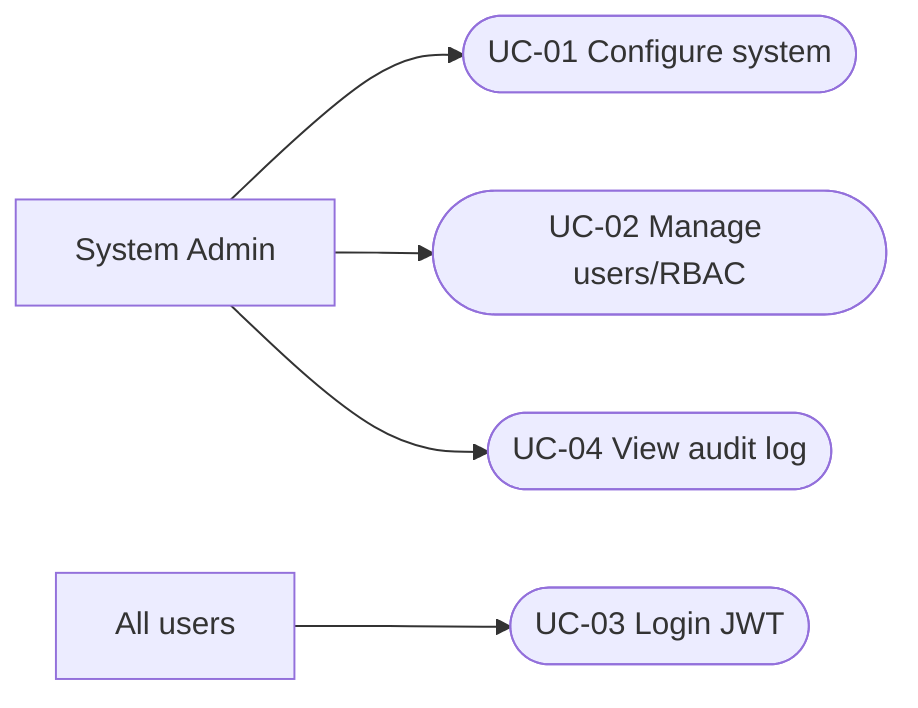

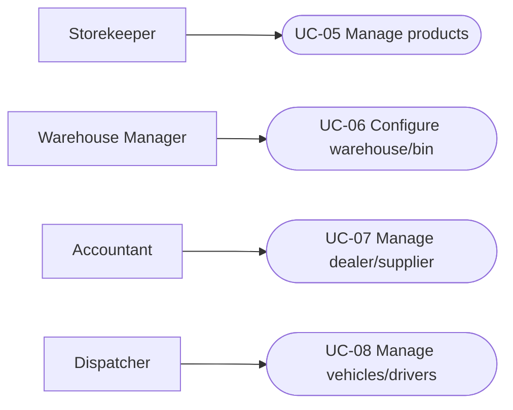

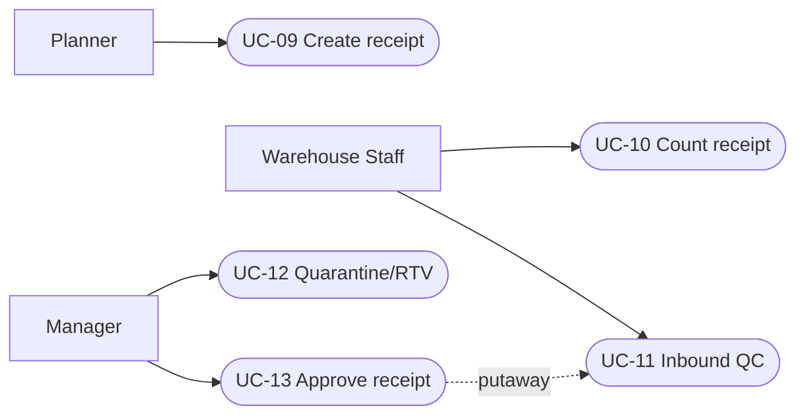

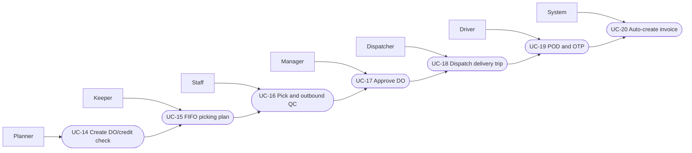

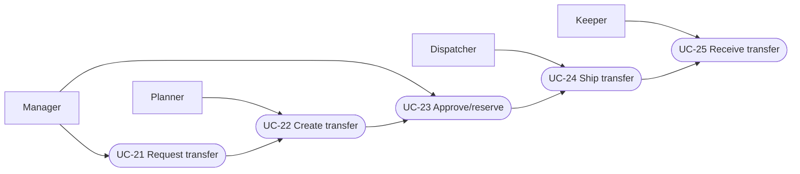

```mermaid
flowchart LR
  Keeper --> UC26([UC-26 Stocktake/count])
  Manager --> UC27([UC-27 Approve adjustment])
  UC26 --> UC27
```

```mermaid
flowchart LR
  Accountant --> UC28([UC-28 Create price list])
  AccountantManager[Chief Accountant] --> UC29([UC-29 Approve price list])
  System --> UC30([UC-30 Calculate COGS])
  Accountant --> UC40([UC-40 Import price Excel])
  UC40 --> UC28 --> UC29 --> UC30
```

```mermaid
flowchart LR
  Accountant --> UC31([UC-31 Reconcile invoice])
  Accountant --> UC32([UC-32 Record payment])
  AccountantManager --> UC33([UC-33 Aging report])
  AccountantManager --> UC34([UC-34 Close period])
  Accountant --> UC41([UC-41 Payment OCR])
  UC41 --> UC32
```

```mermaid
flowchart LR
  Keeper --> UC35([UC-35 Dealer return/credit note])
  Manager --> UC36([UC-36 Approve/execute disposal])
```

```mermaid
flowchart LR
  CEO --> UC37([UC-37 CEO dashboard])
  System --> UC38([UC-38 Low-stock alert])
  Manager --> UC39([UC-39 Productivity report])
```

## 1. Security & RBAC

```mermaid
stateDiagram-v2
  [*] --> Active: Admin creates user
  Active --> Inactive: deactivate
  Inactive --> Active: reactivate
  Active --> Authenticated: valid JWT login
  Authenticated --> Active: logout / token expiry
```

## 2. Master Data

```mermaid
flowchart LR
  Admin[Admin/manager] --> Create[Create master record]
  Create --> Validate{Valid code, role and scope?}
  Validate -- No --> Error[Show validation error]
  Validate -- Yes --> Save[Save active record + audit]
  Save --> Deactivate[Set is_active=false when retired]
```

## 3. Inbound Receipt & QC

```mermaid
stateDiagram-v2
  [*] --> PENDING_RECEIPT
  PENDING_RECEIPT --> DRAFT: physical count
  DRAFT --> QC_COMPLETED: all lines pass QC
  DRAFT --> QC_FAILED: any failed QC line
  QC_COMPLETED --> APPROVED: manager approves
  APPROVED --> PUTAWAY_COMPLETED: capacity-checked putaway
  QC_FAILED --> RETURN_TO_SUPPLIER_PENDING: create RTV
  RETURN_TO_SUPPLIER_PENDING --> RETURNED_TO_SUPPLIER: confirm handover
```

## 4. Outbound Delivery & POD

```mermaid
stateDiagram-v2
  [*] --> NEW: planner creates DO + credit check
  NEW --> WAITING_PICKING: create FIFO allocation
  WAITING_PICKING --> QC_PENDING_APPROVAL: picking/QC recorded
  QC_PENDING_APPROVAL --> WAREHOUSE_APPROVED: manager approves
  WAREHOUSE_APPROVED --> IN_TRANSIT: dispatch trip
  IN_TRANSIT --> COMPLETED: POD + OTP verified
  QC_PENDING_APPROVAL --> REJECTED: manager rejects
  NEW --> CANCELLED: cancellation
```

## 5. Inter-Warehouse Transfer

```mermaid
stateDiagram-v2
  [*] --> NEW: planner creates transfer
  NEW --> APPROVED: source manager reserves FIFO stock
  NEW --> REJECTED: source manager rejects
  APPROVED --> IN_TRANSIT: source shipment to virtual warehouse
  IN_TRANSIT --> COMPLETED: destination receives equal QC-pass quantity
  IN_TRANSIT --> COMPLETED_WITH_DISCREPANCY: shortage/overage adjustment
  IN_TRANSIT --> QUARANTINED: destination QC fails
  NEW --> CANCELLED: cancellation
```

## 6. Stocktake & Adjustment

```mermaid
flowchart LR
  Start[Create stocktake] --> Lock[Lock locations and snapshot system qty]
  Lock --> Count[Staff records physical count]
  Count --> Variance{Variance exists?}
  Variance -- No --> Close[Close stocktake + audit]
  Variance -- Yes --> Review[Manager reviews variance]
  Review --> Approve[Create adjustment, update versioned inventory, unlock]
  Review --> Reject[Return to count; keep locations locked]
```

## 7. Pricing & COGS

```mermaid
stateDiagram-v2
  [*] --> DRAFT: accountant creates/imports price
  DRAFT --> ACTIVE: accountant manager approves
  DRAFT --> CANCELLED: cancel draft
  ACTIVE --> [*]: selected by effective_date for DO price snapshot
```

## 8. Finance & Closing

```mermaid
flowchart LR
  Delivery[DO completed] --> Invoice[Auto-create invoice]
  Invoice --> Reconcile[Accountant reconciles worklist]
  Reconcile --> Payment[Record payment allocations]
  Payment --> Credit[Re-evaluate dealer credit]
  Credit --> Close[Manager closes sequential accounting period]
```

## 9. Returns & Disposal

```mermaid
flowchart LR
  Return[Receive dealer return] --> QC{Return QC pass?}
  QC -- Yes --> Putaway[Return to inventory bin]
  QC -- No --> Quarantine[Create quarantine record]
  Quarantine --> Damage[Create damage report]
  Damage --> Approve[Manager approves disposal]
  Approve --> Dispose[Decrease quarantine + create adjustment + audit]
```

## 10. Reports & Alerts

```mermaid
flowchart LR
  Change[Inventory mutation] --> Available[Calculate total_qty - reserved_qty]
  Available --> Threshold{Below reorder point?}
  Threshold -- Yes, no active alert --> Create[Create low-stock alert]
  Threshold -- No, active alert --> Resolve[Resolve alert]
  Create --> Dashboard[Dashboard/report visibility]
  Resolve --> Dashboard
```

# V. Appendix

## 1. Assumptions & Dependencies

- AS-1: Thiết bị quét mã vạch/QR chưa sẵn có trong Sprint 1; toàn bộ nhập liệu là thủ công (LESSON-004, CLAUDE.md).
- AS-2: Đội xe và tài xế nội bộ Phúc Anh đủ nguồn lực đáp ứng khối lượng ~1000+ giao dịch/tháng trên cả 3 kho.
- AS-3: Công ty mẹ gửi thông tin lệnh nhập/xuất qua Zalo/Email; hệ thống không tích hợp trực tiếp với hệ thống Công ty mẹ trong Sprint 1.
- DE-1: Hệ thống phụ thuộc PostgreSQL 18 (có thể dùng Supabase Postgres cho môi trường dev/test chia sẻ — không phải kiến trúc production, không dùng làm file storage).
- DE-2: Toàn bộ ảnh POD/QC lưu tại `/uploads` nội bộ trên server backend, không dùng object storage bên thứ ba.

## 2. Limitations & Exclusions

Theo `README.md`/`.specify/memory/constitution.md`, hệ thống **KHÔNG** bao gồm:

- Quản lý sản xuất (Manufacturing).
- HR / HRM (báo cáo năng suất chỉ export Excel, không tích hợp trực tiếp hệ thống nhân sự/lương).
- Barcode / QR Scanner (dự kiến tích hợp sau).
- Cổng B2B / B2C Portal.
- Tích hợp hệ thống bên ngoài (Công ty mẹ, hệ thống kế toán ngoài...).
- Vận tải thuê ngoài (3PL) — chỉ dùng xe nội bộ Phúc Anh, không có luồng Duyệt chi vận tải.
- Serial-level tracking, hạn sử dụng (expiry/FEFO), phân cấp chất lượng (grade A/B/C) cho hàng gia dụng.

## 3. Business Rules

| ID        | Category     | Rule Definition                                                                                                                                                                  |
| --------- | ------------ | -------------------------------------------------------------------------------------------------------------------------------------------------------------------------------- |
| BR-INV-01 | Constraints  | `inventories.total_qty >= 0`, `reserved_qty >= 0`, `total_qty - reserved_qty >= 0` luôn đúng trước/sau mọi thao tác                                                              |
| BR-INV-02 | Facts        | FIFO theo `received_date` là nguyên tắc xuất kho mặc định và duy nhất cho domain hàng gia dụng                                                                                   |
| BR-INV-03 | Constraints  | Mọi UPDATE inventory phải dùng optimistic locking (`@Version`); conflict → HTTP 409                                                                                              |
| BR-INV-04 | Constraints  | Điều chỉnh tồn kho chỉ đi qua receipt/issue/transfer/adjustment/stocktake flow, không UPDATE trực tiếp                                                                           |
| BR-QC-01  | Constraints  | Hàng nhập/xuất kho phải qua QC trước khi tính vào available inventory                                                                                                            |
| BR-QC-02  | Constraints  | Hàng fail QC vào Quarantine, loại khỏi available inventory, chỉ rời Quarantine qua RTV/disposal đã duyệt                                                                         |
| BR-BAT-01 | Facts        | Batch gom theo sản phẩm + nguồn nhập/chứng từ + ngày nhận; không tách theo serial/hạn dùng/grade                                                                                 |
| BR-BAT-02 | Constraints  | Putaway phải kiểm tra `bin_capacity` trước khi đặt hàng vào Bin                                                                                                                  |
| BR-TRF-01 | Constraints  | Điều chuyển kho phải đi qua kho ảo `IN_TRANSIT` cho tới khi kho đích xác nhận nhận hàng                                                                                          |
| BR-TRF-02 | Constraints  | Chênh lệch `quantity_sent` vs `quantity_received` phải tạo `adjustment` + audit record                                                                                           |
| BR-FIN-01 | Computations | CREDIT*HOLD khi `current_balance + giá_trị*đơn_mới > credit_limit`HOẶC`current_balance > credit_limit` sau hóa đơn (bằng hạn mức vẫn cho phép) HOẶC có hóa đơn quá hạn > 30 ngày |
| BR-FIN-02 | Computations | Mở khóa tín dụng khi `current_balance < credit_limit × 0.8` (buffer 20%)                                                                                                         |
| BR-FIN-03 | Facts        | Chốt sổ kỳ khóa cứng chứng từ có `transaction_date` trong kỳ đã đóng; sửa sai chỉ qua Adjustment Voucher ở kỳ mở                                                                 |
| BR-SEC-01 | Constraints  | Authorization phải kiểm tra CẢ role LẪN warehouse assignment cho mọi thao tác phạm vi kho                                                                                        |
| BR-SEC-02 | Constraints  | Audit log là bằng chứng bất biến — append-only, không ai (kể cả System Admin) được sửa/xóa                                                                                       |
| BR-DEL-01 | Constraints  | Master data soft-delete bằng `is_active = false`; transaction data cancel bằng `status = CANCELLED`; không xóa vật lý                                                            |
