**Warehouse Management System (WMS) — Công ty Phúc Anh**

**Software Design Specification**

**Version: 1.3**

– Hà Nội, 2026 –

# Record of Changes

| Date       | A\*M, D | In charge    | Change Description                                                                           |
| ---------- | ------- | ------------ | -------------------------------------------------------------------------------------------- |
| 2026-07-14 | A       | WMS Dev Team | Khởi tạo SDS dựa trên backend thực tế `backend/src/main/java/com/wms/`, tương ứng RDS-WMS.md |
| 2026-07-15 | M       | WMS Dev Team | Đồng bộ catalog spec 001–012; Spec 011–012 là quality/testing cross-cutting. SDS này vẫn mô tả chi tiết luồng inbound đại diện của Spec 003. |
| 2026-07-16 | M       | WMS Dev Team | Rà soát theo Template3; chuẩn hóa schema references, data-access convention và low-stock lifecycle theo Spec 010. |
| 2026-07-19 | M       | WMS Dev Team | Thay sơ đồ ASCII bằng sơ đồ Mermaid theo đúng các loại Package, ERD, Class và Sequence của Template3. |
| 2026-07-19 | M       | WMS Dev Team | Đối chiếu PostgreSQL VPS: xác nhận schema 55 bảng WMS + Flyway, tên transfer vật lý, cột quarantine và legacy schema fields. |
| 2026-07-19 | M       | WMS Dev Team | Bổ sung catalog VPS đầy đủ 56 bảng/746 cột/227 FK và Relationship Atlas 9 ERD, liên kết từ phần Database Schema. |

_A - Added M - Modified D - Deleted_

---

# I. Overview

## 1. Code Packages

> **Quy ước template:** “Database Queries” là mô tả logical query để giải thích thiết kế; production code dùng Spring Data JPA/Hibernate, không thực thi raw SQL trong application. Flyway migration quyết định tên bảng/cột thực tế.

Backend theo layered architecture bắt buộc **Controller → Service → Repository → Entity** (xem `backend/CLAUDE.md`), main package `com.wms`. Package diagram tổng quan theo UML package của Template3; dependency nét đứt là quan hệ sử dụng.

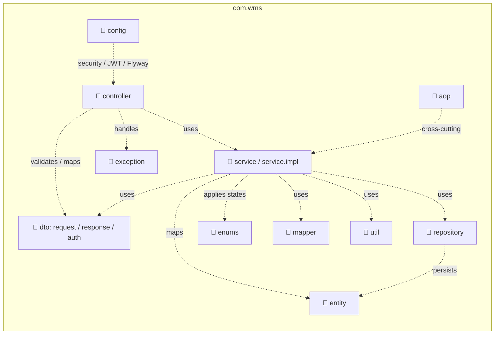

**_Package descriptions_**

| No  | Package                                                             | Description                                                                                                                                                                                                                                                                                                                                                                                                           |
| --- | ------------------------------------------------------------------- | --------------------------------------------------------------------------------------------------------------------------------------------------------------------------------------------------------------------------------------------------------------------------------------------------------------------------------------------------------------------------------------------------------------------- |
| 01  | `com.wms.controller`                                                | REST controllers dưới `/api/v1/...`. Chỉ nhận HTTP request, validate DTO (`@Valid`), trả HTTP status, không chứa business logic. Lấy actor hiện tại qua `CurrentUserService`/Spring Security context.                                                                                                                                                                                                                 |
| 02  | `com.wms.service` / `com.wms.service.impl`                          | Business logic, quản lý transaction (`@Transactional`), authorization (role + warehouse scope), state transition, audit logging, invariant tồn kho/QC/transfer/accounting. Một số service (VD `ReceiptService`, `ReceiptApprovalService`, `QuarantineRtvService`) được implement trực tiếp không tách interface/impl; một số khác (VD `PaymentReceiptService`, `AutoInvoiceService`) tách interface + `*ServiceImpl`. |
| 03  | `com.wms.repository`                                                | Spring Data JPA interface, không dùng raw SQL trong application code.                                                                                                                                                                                                                                                                                                                                                 |
| 04  | `com.wms.entity`                                                    | JPA entity mapping bảng DB và quan hệ, ưu tiên Lombok `@Getter/@Setter/@NoArgsConstructor/@AllArgsConstructor/@Builder`, không dùng `@Data` cho entity có lazy relationship.                                                                                                                                                                                                                                          |
| 05  | `com.wms.dto.request` / `com.wms.dto.response` / `com.wms.dto.auth` | DTO cho request (Jakarta Validation) và response, không trả entity trực tiếp từ controller.                                                                                                                                                                                                                                                                                                                           |
| 06  | `com.wms.enums`                                                     | State machine và constant miền (VD `ReceiptStatus`, `ReceiptType`, `UserRole`, `InterWarehouseTransferStatus`, `AuditAction`, `AuditEntityType`).                                                                                                                                                                                                                                                                     |
| 07  | `com.wms.exception`                                                 | Typed exception + `GlobalExceptionHandler` — mapping lỗi tập trung.                                                                                                                                                                                                                                                                                                                                                   |
| 08  | `com.wms.config`                                                    | Security config, JWT filter, Flyway, mail config, `UploadResourceConfig` cho `/uploads/**`.                                                                                                                                                                                                                                                                                                                           |
| 09  | `com.wms.mapper`                                                    | DTO ⇄ entity mapping helper.                                                                                                                                                                                                                                                                                                                                                                                          |
| 10  | `com.wms.util`                                                      | Utility tập trung, không tạo side-effect nghiệp vụ ẩn (VD `FIFOSelector`, `AuditLogUtil` — build diff before/after, filter sensitive field).                                                                                                                                                                                                                                                                          |
| 11  | `com.wms.aop`                                                       | Cross-cutting concern khi cần (logging, timing...).                                                                                                                                                                                                                                                                                                                                                                   |

Frontend (React 18 + Tailwind, ngoài phạm vi chi tiết của SDS backend này): `components/` (PascalCase), `pages/`, `hooks/` (camelCase), `services/` (API client Axios), `stores/` (Zustand), `utils/`.

## 2. Database Design

### a. Database Schema

PostgreSQL 18, quản lý version qua Flyway (`backend/src/main/resources/db/migration/`), naming convention `snake_case`. Metadata xuất trực tiếp từ VPS xác nhận **55 bảng WMS + `flyway_schema_history` = 56 bảng**, thêm **3 view chỉ đọc**, với **746 cột** và **227 FK**. VPS có Flyway V1–V13 thành công; **V14 chưa được áp dụng**. Catalog vật lý chung, được dùng làm nguồn chuẩn cho cả RDS và SDS, là [VPS Database Schema Catalog](VPS-DATABASE-SCHEMA-CATALOG.md); [VPS Database Relationship Atlas](VPS-DATABASE-SCHEMA-ERD.md) hiển thị đủ 227 FK bằng 9 ERD theo domain.


<!-- VPS_SCHEMA_ATLAS_START -->

#### Full VPS relationship atlas — 56 tables / 227 FK

> Diagram source is the same VPS constraint export as [VPS Database Schema Catalog](VPS-DATABASE-SCHEMA-CATALOG.md). The atlas deliberately uses **domain-sized ERDs**: one giant diagram for 56 tables/227 FK is unreadable. Every physical table appears as a child in exactly one section; every FK emitted under that child is an actual production constraint.

##### Reading rules

- `PARENT ||--o{ CHILD` means one parent row can be referenced by zero or many child rows. Nullable FK is detailed in the catalog; it does not turn the parent-to-child relationship into mandatory existence.
- Attributes show the table PK and FK columns only, so the diagrams remain legible. The catalog lists all 746 columns, nullability and defaults.
- `flyway_schema_history` has no FK and is intentionally separated. Views are read-only projections and do not have physical FK constraints.

##### 01 Security, configuration and master data

**Coverage:** `users`, `user_warehouse_assignments`, `warehouses`, `warehouse_locations`, `system_configs`, `document_sequences`, `audit_logs`, `notifications`, `products`, `suppliers`, `dealers`, `vehicles`, `drivers`. **FK shown:** 28.

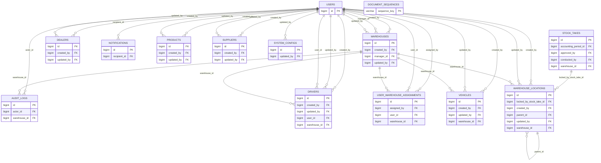

##### 02 Purchasing and inbound

**Coverage:** `purchase_orders`, `purchase_order_items`, `receipts`, `receipt_items`, `batches`, `quarantine_records`, `debit_notes`. **FK shown:** 33.

```mermaid
erDiagram
  PRODUCTS ||--o{ BATCHES : product_id
  WAREHOUSES ||--o{ BATCHES : warehouse_id
  ACCOUNTING_PERIODS ||--o{ DEBIT_NOTES : accounting_period_id
  USERS ||--o{ DEBIT_NOTES : created_by
  RECEIPTS ||--o{ DEBIT_NOTES : receipt_id
  SUPPLIERS ||--o{ DEBIT_NOTES : supplier_id
  PURCHASE_ORDERS ||--o{ PURCHASE_ORDER_ITEMS : po_id
  PRODUCTS ||--o{ PURCHASE_ORDER_ITEMS : product_id
  USERS ||--o{ PURCHASE_ORDERS : created_by
  SUPPLIERS ||--o{ PURCHASE_ORDERS : supplier_id
  WAREHOUSES ||--o{ PURCHASE_ORDERS : warehouse_id
  DELIVERY_ORDER_ITEM_ALLOCATIONS ||--o{ QUARANTINE_RECORDS : allocation_id
  BATCHES ||--o{ QUARANTINE_RECORDS : batch_id
  USERS ||--o{ QUARANTINE_RECORDS : created_by
  DELIVERY_ORDERS ||--o{ QUARANTINE_RECORDS : delivery_order_id
  DELIVERY_ORDER_ITEMS ||--o{ QUARANTINE_RECORDS : do_item_id
  WAREHOUSE_LOCATIONS ||--o{ QUARANTINE_RECORDS : location_id
  PRODUCTS ||--o{ QUARANTINE_RECORDS : product_id
  INTER_WAREHOUSE_TRANSFERS ||--o{ QUARANTINE_RECORDS : transfer_id
  INTER_WAREHOUSE_TRANSFER_ITEMS ||--o{ QUARANTINE_RECORDS : transfer_item_id
  WAREHOUSES ||--o{ QUARANTINE_RECORDS : warehouse_id
  BATCHES ||--o{ RECEIPT_ITEMS : batch_id
  WAREHOUSE_LOCATIONS ||--o{ RECEIPT_ITEMS : location_id
  PRODUCTS ||--o{ RECEIPT_ITEMS : product_id
  USERS ||--o{ RECEIPT_ITEMS : qc_by
  RECEIPTS ||--o{ RECEIPT_ITEMS : receipt_id
  ACCOUNTING_PERIODS ||--o{ RECEIPTS : accounting_period_id
  USERS ||--o{ RECEIPTS : approved_by
  USERS ||--o{ RECEIPTS : created_by
  DEALERS ||--o{ RECEIPTS : dealer_id
  DELIVERY_ORDERS ||--o{ RECEIPTS : delivery_order_id
  SUPPLIERS ||--o{ RECEIPTS : supplier_id
  WAREHOUSES ||--o{ RECEIPTS : warehouse_id
  ACCOUNTING_PERIODS {
    bigint id PK
    bigint closed_by FK
  }
  BATCHES {
    bigint id PK
    bigint product_id FK
    bigint warehouse_id FK
  }
  DEALERS {
    bigint id PK
    bigint created_by FK
    bigint updated_by FK
  }
  DEBIT_NOTES {
    bigint id PK
    bigint accounting_period_id FK
    bigint created_by FK
    bigint receipt_id FK
    bigint supplier_id FK
  }
  DELIVERY_ORDER_ITEM_ALLOCATIONS {
    bigint id PK
    bigint batch_id FK
    bigint created_by FK
    bigint do_item_id FK
    bigint inventory_id FK
    bigint location_id FK
    bigint replaced_allocation_id FK
    bigint zone_id FK
  }
  DELIVERY_ORDER_ITEMS {
    bigint id PK
    bigint batch_id FK
    bigint do_id FK
    bigint location_id FK
    bigint picked_by FK
    bigint product_id FK
    bigint zone_id FK
  }
  DELIVERY_ORDERS {
    bigint id PK
    bigint accounting_period_id FK
    bigint created_by FK
    bigint dealer_id FK
    bigint packed_by FK
    bigint qc_by FK
    bigint warehouse_id FK
  }
  INTER_WAREHOUSE_TRANSFER_ITEMS {
    bigint id PK
    bigint batch_id FK
    bigint checked_by FK
    bigint destination_location_id FK
    bigint product_id FK
    bigint source_location_id FK
    bigint transfer_id FK
  }
  INTER_WAREHOUSE_TRANSFERS {
    bigint id PK
    bigint arrival_handover_by FK
    bigint load_handover_by FK
    bigint outbound_qc_by FK
    bigint return_approved_by FK
    bigint return_arrival_handover_by FK
    bigint return_rejected_by FK
    bigint return_requested_by FK
    bigint transfer_request_id FK
    bigint accounting_period_id FK
    bigint approved_by FK
    bigint confirmed_by FK
    bigint created_by FK
    bigint destination_warehouse_id FK
    bigint rejected_by FK
    bigint source_warehouse_id FK
    bigint trip_id FK
  }
  PRODUCTS {
    bigint id PK
    bigint created_by FK
    bigint updated_by FK
  }
  PURCHASE_ORDER_ITEMS {
    bigint id PK
    bigint po_id FK
    bigint product_id FK
  }
  PURCHASE_ORDERS {
    bigint id PK
    bigint created_by FK
    bigint supplier_id FK
    bigint warehouse_id FK
  }
  QUARANTINE_RECORDS {
    bigint id PK
    bigint allocation_id FK
    bigint batch_id FK
    bigint created_by FK
    bigint delivery_order_id FK
    bigint do_item_id FK
    bigint location_id FK
    bigint product_id FK
    bigint transfer_id FK
    bigint transfer_item_id FK
    bigint warehouse_id FK
  }
  RECEIPT_ITEMS {
    bigint id PK
    bigint batch_id FK
    bigint location_id FK
    bigint product_id FK
    bigint qc_by FK
    bigint receipt_id FK
  }
  RECEIPTS {
    bigint id PK
    bigint accounting_period_id FK
    bigint approved_by FK
    bigint created_by FK
    bigint dealer_id FK
    bigint delivery_order_id FK
    bigint supplier_id FK
    bigint warehouse_id FK
  }
  SUPPLIERS {
    bigint id PK
    bigint created_by FK
    bigint updated_by FK
  }
  USERS {
    bigint id PK
  }
  WAREHOUSE_LOCATIONS {
    bigint id PK
    bigint locked_by_stock_take_id FK
    bigint created_by FK
    bigint parent_id FK
    bigint updated_by FK
    bigint warehouse_id FK
  }
  WAREHOUSES {
    bigint id PK
    bigint created_by FK
    bigint manager_id FK
    bigint updated_by FK
  }
```

##### 03 Inventory and reservation

**Coverage:** `inventories`, `warehouse_product_reservations`, `stock_alerts`, `price_history`. **FK shown:** 13.

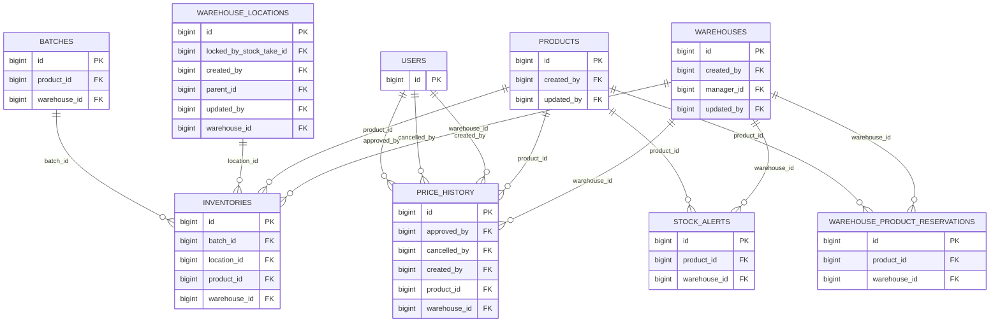

##### 04 Outbound order and allocation

**Coverage:** `delivery_orders`, `delivery_order_items`, `delivery_order_approvals`, `delivery_order_warehouse_approvals`, `delivery_order_item_allocations`, `delivery_order_item_replacements`, `delivery_order_item_return_to_bin_records`, `outbound_qc_records`. **FK shown:** 49.

```mermaid
erDiagram
  USERS ||--o{ DELIVERY_ORDER_APPROVALS : approver_id
  DELIVERY_ORDERS ||--o{ DELIVERY_ORDER_APPROVALS : do_id
  BATCHES ||--o{ DELIVERY_ORDER_ITEM_ALLOCATIONS : batch_id
  USERS ||--o{ DELIVERY_ORDER_ITEM_ALLOCATIONS : created_by
  DELIVERY_ORDER_ITEMS ||--o{ DELIVERY_ORDER_ITEM_ALLOCATIONS : do_item_id
  INVENTORIES ||--o{ DELIVERY_ORDER_ITEM_ALLOCATIONS : inventory_id
  WAREHOUSE_LOCATIONS ||--o{ DELIVERY_ORDER_ITEM_ALLOCATIONS : location_id
  DELIVERY_ORDER_ITEM_ALLOCATIONS ||--o{ DELIVERY_ORDER_ITEM_ALLOCATIONS : replaced_allocation_id
  WAREHOUSE_LOCATIONS ||--o{ DELIVERY_ORDER_ITEM_ALLOCATIONS : zone_id
  USERS ||--o{ DELIVERY_ORDER_ITEM_REPLACEMENTS : created_by
  DELIVERY_ORDER_ITEMS ||--o{ DELIVERY_ORDER_ITEM_REPLACEMENTS : do_item_id
  BATCHES ||--o{ DELIVERY_ORDER_ITEM_REPLACEMENTS : failed_batch_id
  INVENTORIES ||--o{ DELIVERY_ORDER_ITEM_REPLACEMENTS : failed_inventory_id
  WAREHOUSE_LOCATIONS ||--o{ DELIVERY_ORDER_ITEM_REPLACEMENTS : failed_location_id
  BATCHES ||--o{ DELIVERY_ORDER_ITEM_REPLACEMENTS : replacement_batch_id
  INVENTORIES ||--o{ DELIVERY_ORDER_ITEM_REPLACEMENTS : replacement_inventory_id
  WAREHOUSE_LOCATIONS ||--o{ DELIVERY_ORDER_ITEM_REPLACEMENTS : replacement_location_id
  WAREHOUSE_LOCATIONS ||--o{ DELIVERY_ORDER_ITEM_RETURN_TO_BIN_RECORDS : original_location_id
  WAREHOUSE_LOCATIONS ||--o{ DELIVERY_ORDER_ITEM_RETURN_TO_BIN_RECORDS : source_location_id
  DELIVERY_ORDER_ITEM_ALLOCATIONS ||--o{ DELIVERY_ORDER_ITEM_RETURN_TO_BIN_RECORDS : allocation_id
  BATCHES ||--o{ DELIVERY_ORDER_ITEM_RETURN_TO_BIN_RECORDS : batch_id
  USERS ||--o{ DELIVERY_ORDER_ITEM_RETURN_TO_BIN_RECORDS : created_by
  DELIVERY_ORDER_ITEMS ||--o{ DELIVERY_ORDER_ITEM_RETURN_TO_BIN_RECORDS : do_item_id
  WAREHOUSE_LOCATIONS ||--o{ DELIVERY_ORDER_ITEM_RETURN_TO_BIN_RECORDS : original_zone_id
  PRODUCTS ||--o{ DELIVERY_ORDER_ITEM_RETURN_TO_BIN_RECORDS : product_id
  BATCHES ||--o{ DELIVERY_ORDER_ITEMS : batch_id
  DELIVERY_ORDERS ||--o{ DELIVERY_ORDER_ITEMS : do_id
  WAREHOUSE_LOCATIONS ||--o{ DELIVERY_ORDER_ITEMS : location_id
  USERS ||--o{ DELIVERY_ORDER_ITEMS : picked_by
  PRODUCTS ||--o{ DELIVERY_ORDER_ITEMS : product_id
  WAREHOUSE_LOCATIONS ||--o{ DELIVERY_ORDER_ITEMS : zone_id
  USERS ||--o{ DELIVERY_ORDER_WAREHOUSE_APPROVALS : approver_id
  DELIVERY_ORDERS ||--o{ DELIVERY_ORDER_WAREHOUSE_APPROVALS : do_id
  ACCOUNTING_PERIODS ||--o{ DELIVERY_ORDERS : accounting_period_id
  USERS ||--o{ DELIVERY_ORDERS : created_by
  DEALERS ||--o{ DELIVERY_ORDERS : dealer_id
  USERS ||--o{ DELIVERY_ORDERS : packed_by
  USERS ||--o{ DELIVERY_ORDERS : qc_by
  WAREHOUSES ||--o{ DELIVERY_ORDERS : warehouse_id
  DELIVERY_ORDER_ITEM_ALLOCATIONS ||--o{ OUTBOUND_QC_RECORDS : allocation_id
  BATCHES ||--o{ OUTBOUND_QC_RECORDS : batch_id
  USERS ||--o{ OUTBOUND_QC_RECORDS : created_by
  DELIVERY_ORDERS ||--o{ OUTBOUND_QC_RECORDS : do_id
  DELIVERY_ORDER_ITEMS ||--o{ OUTBOUND_QC_RECORDS : do_item_id
  WAREHOUSE_LOCATIONS ||--o{ OUTBOUND_QC_RECORDS : location_id
  WAREHOUSE_LOCATIONS ||--o{ OUTBOUND_QC_RECORDS : quarantine_location_id
  QUARANTINE_RECORDS ||--o{ OUTBOUND_QC_RECORDS : quarantine_record_id
  WAREHOUSE_LOCATIONS ||--o{ OUTBOUND_QC_RECORDS : staging_location_id
  WAREHOUSE_LOCATIONS ||--o{ OUTBOUND_QC_RECORDS : zone_id
  ACCOUNTING_PERIODS {
    bigint id PK
    bigint closed_by FK
  }
  BATCHES {
    bigint id PK
    bigint product_id FK
    bigint warehouse_id FK
  }
  DEALERS {
    bigint id PK
    bigint created_by FK
    bigint updated_by FK
  }
  DELIVERY_ORDER_APPROVALS {
    bigint id PK
    bigint approver_id FK
    bigint do_id FK
  }
  DELIVERY_ORDER_ITEM_ALLOCATIONS {
    bigint id PK
    bigint batch_id FK
    bigint created_by FK
    bigint do_item_id FK
    bigint inventory_id FK
    bigint location_id FK
    bigint replaced_allocation_id FK
    bigint zone_id FK
  }
  DELIVERY_ORDER_ITEM_REPLACEMENTS {
    bigint id PK
    bigint created_by FK
    bigint do_item_id FK
    bigint failed_batch_id FK
    bigint failed_inventory_id FK
    bigint failed_location_id FK
    bigint replacement_batch_id FK
    bigint replacement_inventory_id FK
    bigint replacement_location_id FK
  }
  DELIVERY_ORDER_ITEM_RETURN_TO_BIN_RECORDS {
    bigint id PK
    bigint original_location_id FK
    bigint source_location_id FK
    bigint allocation_id FK
    bigint batch_id FK
    bigint created_by FK
    bigint do_item_id FK
    bigint original_zone_id FK
    bigint product_id FK
  }
  DELIVERY_ORDER_ITEMS {
    bigint id PK
    bigint batch_id FK
    bigint do_id FK
    bigint location_id FK
    bigint picked_by FK
    bigint product_id FK
    bigint zone_id FK
  }
  DELIVERY_ORDER_WAREHOUSE_APPROVALS {
    bigint id PK
    bigint approver_id FK
    bigint do_id FK
  }
  DELIVERY_ORDERS {
    bigint id PK
    bigint accounting_period_id FK
    bigint created_by FK
    bigint dealer_id FK
    bigint packed_by FK
    bigint qc_by FK
    bigint warehouse_id FK
  }
  INVENTORIES {
    bigint id PK
    bigint batch_id FK
    bigint location_id FK
    bigint product_id FK
    bigint warehouse_id FK
  }
  OUTBOUND_QC_RECORDS {
    bigint id PK
    bigint allocation_id FK
    bigint batch_id FK
    bigint created_by FK
    bigint do_id FK
    bigint do_item_id FK
    bigint location_id FK
    bigint quarantine_location_id FK
    bigint quarantine_record_id FK
    bigint staging_location_id FK
    bigint zone_id FK
  }
  PRODUCTS {
    bigint id PK
    bigint created_by FK
    bigint updated_by FK
  }
  QUARANTINE_RECORDS {
    bigint id PK
    bigint allocation_id FK
    bigint batch_id FK
    bigint created_by FK
    bigint delivery_order_id FK
    bigint do_item_id FK
    bigint location_id FK
    bigint product_id FK
    bigint transfer_id FK
    bigint transfer_item_id FK
    bigint warehouse_id FK
  }
  USERS {
    bigint id PK
  }
  WAREHOUSE_LOCATIONS {
    bigint id PK
    bigint locked_by_stock_take_id FK
    bigint created_by FK
    bigint parent_id FK
    bigint updated_by FK
    bigint warehouse_id FK
  }
  WAREHOUSES {
    bigint id PK
    bigint created_by FK
    bigint manager_id FK
    bigint updated_by FK
  }
```

##### 05 Delivery execution

**Coverage:** `trips`, `trip_delivery_orders`, `deliveries`, `delivery_otp_attempts`, `wrong_sku_reports`, `wrong_sku_report_items`. **FK shown:** 18.

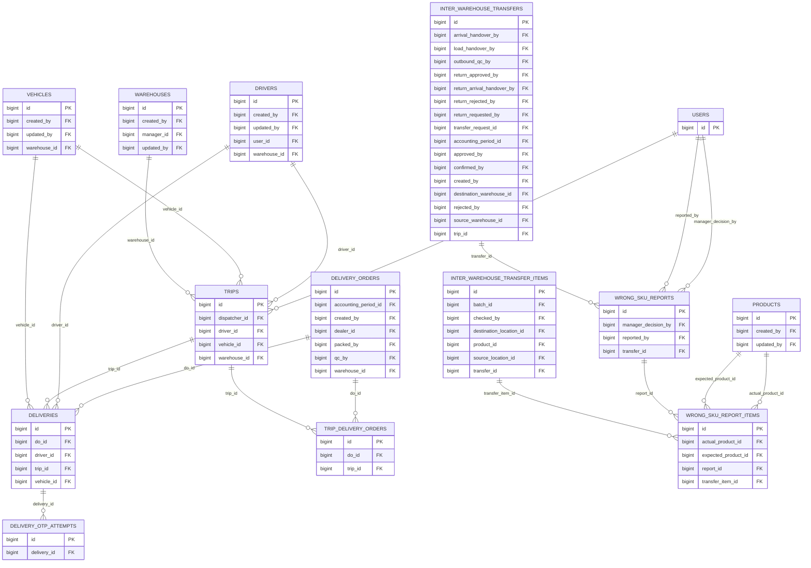

##### 06 Transfer planning and execution

**Coverage:** `transfer_requests`, `transfer_request_items`, `inter_warehouse_transfers`, `inter_warehouse_transfer_items`, `inter_warehouse_transfer_allocations`, `discrepancy_incidents`, `discrepancy_hold_entries`. **FK shown:** 42.

```mermaid
erDiagram
  BATCHES ||--o{ DISCREPANCY_HOLD_ENTRIES : batch_id
  WAREHOUSE_LOCATIONS ||--o{ DISCREPANCY_HOLD_ENTRIES : hold_location_id
  DISCREPANCY_INCIDENTS ||--o{ DISCREPANCY_HOLD_ENTRIES : incident_id
  PRODUCTS ||--o{ DISCREPANCY_HOLD_ENTRIES : product_id
  WAREHOUSES ||--o{ DISCREPANCY_HOLD_ENTRIES : warehouse_id
  PRODUCTS ||--o{ DISCREPANCY_INCIDENTS : product_id
  USERS ||--o{ DISCREPANCY_INCIDENTS : resolved_by
  INTER_WAREHOUSE_TRANSFERS ||--o{ DISCREPANCY_INCIDENTS : transfer_id
  INVENTORIES ||--o{ INTER_WAREHOUSE_TRANSFER_ALLOCATIONS : inventory_id
  INTER_WAREHOUSE_TRANSFER_ITEMS ||--o{ INTER_WAREHOUSE_TRANSFER_ALLOCATIONS : transfer_item_id
  BATCHES ||--o{ INTER_WAREHOUSE_TRANSFER_ITEMS : batch_id
  USERS ||--o{ INTER_WAREHOUSE_TRANSFER_ITEMS : checked_by
  WAREHOUSE_LOCATIONS ||--o{ INTER_WAREHOUSE_TRANSFER_ITEMS : destination_location_id
  PRODUCTS ||--o{ INTER_WAREHOUSE_TRANSFER_ITEMS : product_id
  WAREHOUSE_LOCATIONS ||--o{ INTER_WAREHOUSE_TRANSFER_ITEMS : source_location_id
  INTER_WAREHOUSE_TRANSFERS ||--o{ INTER_WAREHOUSE_TRANSFER_ITEMS : transfer_id
  USERS ||--o{ INTER_WAREHOUSE_TRANSFERS : arrival_handover_by
  USERS ||--o{ INTER_WAREHOUSE_TRANSFERS : load_handover_by
  USERS ||--o{ INTER_WAREHOUSE_TRANSFERS : outbound_qc_by
  USERS ||--o{ INTER_WAREHOUSE_TRANSFERS : return_approved_by
  USERS ||--o{ INTER_WAREHOUSE_TRANSFERS : return_arrival_handover_by
  USERS ||--o{ INTER_WAREHOUSE_TRANSFERS : return_rejected_by
  USERS ||--o{ INTER_WAREHOUSE_TRANSFERS : return_requested_by
  TRANSFER_REQUESTS ||--o{ INTER_WAREHOUSE_TRANSFERS : transfer_request_id
  ACCOUNTING_PERIODS ||--o{ INTER_WAREHOUSE_TRANSFERS : accounting_period_id
  USERS ||--o{ INTER_WAREHOUSE_TRANSFERS : approved_by
  USERS ||--o{ INTER_WAREHOUSE_TRANSFERS : confirmed_by
  USERS ||--o{ INTER_WAREHOUSE_TRANSFERS : created_by
  WAREHOUSES ||--o{ INTER_WAREHOUSE_TRANSFERS : destination_warehouse_id
  USERS ||--o{ INTER_WAREHOUSE_TRANSFERS : rejected_by
  WAREHOUSES ||--o{ INTER_WAREHOUSE_TRANSFERS : source_warehouse_id
  TRIPS ||--o{ INTER_WAREHOUSE_TRANSFERS : trip_id
  PRODUCTS ||--o{ TRANSFER_REQUEST_ITEMS : product_id
  TRANSFER_REQUESTS ||--o{ TRANSFER_REQUEST_ITEMS : transfer_request_id
  USERS ||--o{ TRANSFER_REQUESTS : approved_by
  USERS ||--o{ TRANSFER_REQUESTS : converted_by
  INTER_WAREHOUSE_TRANSFERS ||--o{ TRANSFER_REQUESTS : converted_transfer_id
  USERS ||--o{ TRANSFER_REQUESTS : created_by
  WAREHOUSES ||--o{ TRANSFER_REQUESTS : destination_warehouse_id
  USERS ||--o{ TRANSFER_REQUESTS : rejected_by
  WAREHOUSES ||--o{ TRANSFER_REQUESTS : source_warehouse_id
  USERS ||--o{ TRANSFER_REQUESTS : submitted_by
  ACCOUNTING_PERIODS {
    bigint id PK
    bigint closed_by FK
  }
  BATCHES {
    bigint id PK
    bigint product_id FK
    bigint warehouse_id FK
  }
  DISCREPANCY_HOLD_ENTRIES {
    bigint id PK
    bigint batch_id FK
    bigint hold_location_id FK
    bigint incident_id FK
    bigint product_id FK
    bigint warehouse_id FK
  }
  DISCREPANCY_INCIDENTS {
    bigint id PK
    bigint product_id FK
    bigint resolved_by FK
    bigint transfer_id FK
  }
  INTER_WAREHOUSE_TRANSFER_ALLOCATIONS {
    bigint id PK
    bigint inventory_id FK
    bigint transfer_item_id FK
  }
  INTER_WAREHOUSE_TRANSFER_ITEMS {
    bigint id PK
    bigint batch_id FK
    bigint checked_by FK
    bigint destination_location_id FK
    bigint product_id FK
    bigint source_location_id FK
    bigint transfer_id FK
  }
  INTER_WAREHOUSE_TRANSFERS {
    bigint id PK
    bigint arrival_handover_by FK
    bigint load_handover_by FK
    bigint outbound_qc_by FK
    bigint return_approved_by FK
    bigint return_arrival_handover_by FK
    bigint return_rejected_by FK
    bigint return_requested_by FK
    bigint transfer_request_id FK
    bigint accounting_period_id FK
    bigint approved_by FK
    bigint confirmed_by FK
    bigint created_by FK
    bigint destination_warehouse_id FK
    bigint rejected_by FK
    bigint source_warehouse_id FK
    bigint trip_id FK
  }
  INVENTORIES {
    bigint id PK
    bigint batch_id FK
    bigint location_id FK
    bigint product_id FK
    bigint warehouse_id FK
  }
  PRODUCTS {
    bigint id PK
    bigint created_by FK
    bigint updated_by FK
  }
  TRANSFER_REQUEST_ITEMS {
    bigint id PK
    bigint product_id FK
    bigint transfer_request_id FK
  }
  TRANSFER_REQUESTS {
    bigint id PK
    bigint approved_by FK
    bigint converted_by FK
    bigint converted_transfer_id FK
    bigint created_by FK
    bigint destination_warehouse_id FK
    bigint rejected_by FK
    bigint source_warehouse_id FK
    bigint submitted_by FK
  }
  TRIPS {
    bigint id PK
    bigint dispatcher_id FK
    bigint driver_id FK
    bigint vehicle_id FK
    bigint warehouse_id FK
  }
  USERS {
    bigint id PK
  }
  WAREHOUSE_LOCATIONS {
    bigint id PK
    bigint locked_by_stock_take_id FK
    bigint created_by FK
    bigint parent_id FK
    bigint updated_by FK
    bigint warehouse_id FK
  }
  WAREHOUSES {
    bigint id PK
    bigint created_by FK
    bigint manager_id FK
    bigint updated_by FK
  }
```

##### 07 Stocktake, adjustment and damage

**Coverage:** `stock_takes`, `stock_take_items`, `adjustments`, `damage_reports`. **FK shown:** 25.

```mermaid
erDiagram
  ACCOUNTING_PERIODS ||--o{ ADJUSTMENTS : accounting_period_id
  DELIVERY_ORDER_ITEM_ALLOCATIONS ||--o{ ADJUSTMENTS : allocation_id
  USERS ||--o{ ADJUSTMENTS : approved_by
  BATCHES ||--o{ ADJUSTMENTS : batch_id
  USERS ||--o{ ADJUSTMENTS : created_by
  DELIVERY_ORDERS ||--o{ ADJUSTMENTS : delivery_order_id
  DELIVERY_ORDER_ITEMS ||--o{ ADJUSTMENTS : do_item_id
  WAREHOUSE_LOCATIONS ||--o{ ADJUSTMENTS : location_id
  OUTBOUND_QC_RECORDS ||--o{ ADJUSTMENTS : outbound_qc_record_id
  PRODUCTS ||--o{ ADJUSTMENTS : product_id
  QUARANTINE_RECORDS ||--o{ ADJUSTMENTS : quarantine_record_id
  WAREHOUSES ||--o{ ADJUSTMENTS : warehouse_id
  BATCHES ||--o{ DAMAGE_REPORTS : batch_id
  PRODUCTS ||--o{ DAMAGE_REPORTS : product_id
  RECEIPT_ITEMS ||--o{ DAMAGE_REPORTS : receipt_item_id
  USERS ||--o{ DAMAGE_REPORTS : reported_by
  WAREHOUSES ||--o{ DAMAGE_REPORTS : warehouse_id
  BATCHES ||--o{ STOCK_TAKE_ITEMS : batch_id
  WAREHOUSE_LOCATIONS ||--o{ STOCK_TAKE_ITEMS : location_id
  PRODUCTS ||--o{ STOCK_TAKE_ITEMS : product_id
  STOCK_TAKES ||--o{ STOCK_TAKE_ITEMS : stock_take_id
  ACCOUNTING_PERIODS ||--o{ STOCK_TAKES : accounting_period_id
  USERS ||--o{ STOCK_TAKES : approved_by
  USERS ||--o{ STOCK_TAKES : conducted_by
  WAREHOUSES ||--o{ STOCK_TAKES : warehouse_id
  ACCOUNTING_PERIODS {
    bigint id PK
    bigint closed_by FK
  }
  ADJUSTMENTS {
    bigint id PK
    bigint accounting_period_id FK
    bigint allocation_id FK
    bigint approved_by FK
    bigint batch_id FK
    bigint created_by FK
    bigint delivery_order_id FK
    bigint do_item_id FK
    bigint location_id FK
    bigint outbound_qc_record_id FK
    bigint product_id FK
    bigint quarantine_record_id FK
    bigint warehouse_id FK
  }
  BATCHES {
    bigint id PK
    bigint product_id FK
    bigint warehouse_id FK
  }
  DAMAGE_REPORTS {
    bigint id PK
    bigint batch_id FK
    bigint product_id FK
    bigint receipt_item_id FK
    bigint reported_by FK
    bigint warehouse_id FK
  }
  DELIVERY_ORDER_ITEM_ALLOCATIONS {
    bigint id PK
    bigint batch_id FK
    bigint created_by FK
    bigint do_item_id FK
    bigint inventory_id FK
    bigint location_id FK
    bigint replaced_allocation_id FK
    bigint zone_id FK
  }
  DELIVERY_ORDER_ITEMS {
    bigint id PK
    bigint batch_id FK
    bigint do_id FK
    bigint location_id FK
    bigint picked_by FK
    bigint product_id FK
    bigint zone_id FK
  }
  DELIVERY_ORDERS {
    bigint id PK
    bigint accounting_period_id FK
    bigint created_by FK
    bigint dealer_id FK
    bigint packed_by FK
    bigint qc_by FK
    bigint warehouse_id FK
  }
  OUTBOUND_QC_RECORDS {
    bigint id PK
    bigint allocation_id FK
    bigint batch_id FK
    bigint created_by FK
    bigint do_id FK
    bigint do_item_id FK
    bigint location_id FK
    bigint quarantine_location_id FK
    bigint quarantine_record_id FK
    bigint staging_location_id FK
    bigint zone_id FK
  }
  PRODUCTS {
    bigint id PK
    bigint created_by FK
    bigint updated_by FK
  }
  QUARANTINE_RECORDS {
    bigint id PK
    bigint allocation_id FK
    bigint batch_id FK
    bigint created_by FK
    bigint delivery_order_id FK
    bigint do_item_id FK
    bigint location_id FK
    bigint product_id FK
    bigint transfer_id FK
    bigint transfer_item_id FK
    bigint warehouse_id FK
  }
  RECEIPT_ITEMS {
    bigint id PK
    bigint batch_id FK
    bigint location_id FK
    bigint product_id FK
    bigint qc_by FK
    bigint receipt_id FK
  }
  STOCK_TAKE_ITEMS {
    bigint id PK
    bigint batch_id FK
    bigint location_id FK
    bigint product_id FK
    bigint stock_take_id FK
  }
  STOCK_TAKES {
    bigint id PK
    bigint accounting_period_id FK
    bigint approved_by FK
    bigint conducted_by FK
    bigint warehouse_id FK
  }
  USERS {
    bigint id PK
  }
  WAREHOUSE_LOCATIONS {
    bigint id PK
    bigint locked_by_stock_take_id FK
    bigint created_by FK
    bigint parent_id FK
    bigint updated_by FK
    bigint warehouse_id FK
  }
  WAREHOUSES {
    bigint id PK
    bigint created_by FK
    bigint manager_id FK
    bigint updated_by FK
  }
```

##### 08 Finance and period close

**Coverage:** `invoices`, `invoice_lines`, `payment_receipts`, `credit_notes`, `billing_notifications`, `accounting_periods`. **FK shown:** 19.

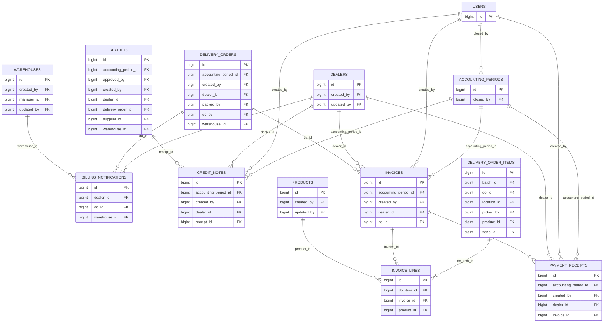

##### 09 System migration record

**Coverage:** `flyway_schema_history`. **FK shown:** 0.

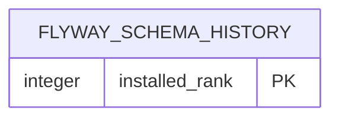

##### Coverage validation

- FK constraints emitted: **227 / 227**.
- Physical tables in child groups: **56 / 56**.
- Views `v_inventory_by_batch`, `v_inventory_summary`, `v_low_stock_alerts` are listed in the catalog and intentionally excluded from FK ERDs.

<!-- VPS_SCHEMA_ATLAS_END -->

### b. Table Description

<!-- VPS_SCHEMA_CATALOG_START -->

#### Complete VPS physical table dictionary — 56 tables / 746 columns

> **Nguồn dữ liệu:** truy vấn metadata PostgreSQL trên VPS do người dùng cung cấp (txt.rtf, txt1.rtf, txt2.rtf), đối chiếu ngày 2026-07-19. Đây là catalog vật lý chuẩn cho RDS/SDS, không suy luận từ migration hoặc entity.

##### Inventory and migration status

- **56 bảng:** 55 bảng nghiệp vụ WMS + bảng kỹ thuật `flyway_schema_history`.
- **3 views chỉ đọc:** `v_inventory_by_batch`, `v_inventory_summary`, `v_low_stock_alerts`; không tính là bảng.
- **746 cột** và **227 foreign-key constraints** được xuất từ `information_schema`/`pg_constraint`.
- Flyway trên VPS có migration thành công từ V1 đến V13. **V14 chưa xuất hiện**, do đó các trường tài khoản ngân hàng dealer định nghĩa bởi V14 chưa được coi là schema production.
- Lịch sử Flyway có hai record version `22` (một SQL và một DELETE reconciliation); catalog này phản ánh đối tượng thực tế, không tự suy ra migration nào đã chạy từ version number đó.

##### Conventions

- Mỗi bảng bên dưới liệt kê **toàn bộ cột** theo đúng thứ tự ordinal trên VPS. `!` = NOT NULL; `PK` = primary key; `FK→table.column` = foreign key.
- Một cột có thể có nhiều FK/constraint; các FK được gắn theo metadata, không suy đoán từ tên cột.
- Các view không có PK/FK vật lý; cột của view được liệt kê riêng.

##### Complete table description and column dictionary

###### `accounting_periods`

Kỳ kế toán và trạng thái đóng sổ. **PK:** `id`. **Columns (9):**

| # | Column | PostgreSQL type | Null | Key / reference | Default |
|---:|---|---|:---:|---|---|
| 1 | `id` | `bigint` | ! | PK | `nextval('accounting_periods_id_seq'::regclass)` |
| 2 | `period_name` | `varchar` | ! | — | — |
| 3 | `start_date` | `date` | ! | — | — |
| 4 | `end_date` | `date` | ! | — | — |
| 5 | `status` | `varchar` | ! | — | `'OPEN'::character varying` |
| 6 | `closed_by` | `bigint` | ✓ | FK→users.id | — |
| 7 | `closed_at` | `timestamptz` | ✓ | — | — |
| 8 | `notes` | `text` | ✓ | — | — |
| 9 | `created_at` | `timestamptz` | ! | — | `now()` |

###### `adjustments`

Phiếu điều chỉnh tồn kho có phê duyệt và liên kết nghiệp vụ nguồn. **PK:** `id`. **Columns (22):**

| # | Column | PostgreSQL type | Null | Key / reference | Default |
|---:|---|---|:---:|---|---|
| 1 | `id` | `bigint` | ! | PK | `nextval('adjustments_id_seq'::regclass)` |
| 2 | `adjustment_number` | `varchar` | ! | — | — |
| 3 | `warehouse_id` | `bigint` | ! | FK→warehouses.id | — |
| 4 | `product_id` | `bigint` | ! | FK→products.id | — |
| 5 | `batch_id` | `bigint` | ✓ | FK→batches.id | — |
| 6 | `location_id` | `bigint` | ✓ | FK→warehouse_locations.id | — |
| 7 | `delivery_order_id` | `bigint` | ✓ | FK→delivery_orders.id | — |
| 8 | `do_item_id` | `bigint` | ✓ | FK→delivery_order_items.id | — |
| 9 | `quantity_adjustment` | `numeric` | ! | — | — |
| 10 | `type` | `varchar` | ! | — | — |
| 11 | `reference_id` | `bigint` | ✓ | — | — |
| 12 | `reference_type` | `varchar` | ✓ | — | — |
| 13 | `reason` | `text` | ! | — | — |
| 14 | `approved_by` | `bigint` | ✓ | FK→users.id | — |
| 15 | `approved_at` | `timestamptz` | ✓ | — | — |
| 16 | `document_date` | `date` | ! | — | — |
| 17 | `accounting_period_id` | `bigint` | ✓ | FK→accounting_periods.id | — |
| 18 | `created_by` | `bigint` | ! | FK→users.id | — |
| 19 | `created_at` | `timestamptz` | ! | — | `now()` |
| 20 | `quarantine_record_id` | `bigint` | ✓ | FK→quarantine_records.id | — |
| 21 | `outbound_qc_record_id` | `bigint` | ✓ | FK→outbound_qc_records.id | — |
| 22 | `allocation_id` | `bigint` | ✓ | FK→delivery_order_item_allocations.id | — |

###### `audit_logs`

Nhật ký audit bất biến cho thao tác hệ thống/kho. **PK:** `id`. **Columns (12):**

| # | Column | PostgreSQL type | Null | Key / reference | Default |
|---:|---|---|:---:|---|---|
| 1 | `id` | `bigint` | ! | PK | `nextval('audit_logs_id_seq'::regclass)` |
| 2 | `actor_id` | `bigint` | ! | FK→users.id | — |
| 3 | `actor_role` | `varchar` | ! | — | — |
| 4 | `action` | `varchar` | ! | — | — |
| 5 | `entity_type` | `varchar` | ! | — | — |
| 6 | `entity_id` | `bigint` | ! | — | — |
| 7 | `description` | `text` | ! | — | — |
| 8 | `warehouse_id` | `bigint` | ✓ | FK→warehouses.id | — |
| 9 | `old_value` | `jsonb` | ✓ | — | — |
| 10 | `new_value` | `jsonb` | ✓ | — | — |
| 11 | `timestamp` | `timestamptz` | ! | — | `now()` |
| 12 | `ip_address` | `varchar` | ✓ | — | — |

###### `batches`

Lô hàng theo sản phẩm và kho. **PK:** `id`. **Columns (9):**

| # | Column | PostgreSQL type | Null | Key / reference | Default |
|---:|---|---|:---:|---|---|
| 1 | `id` | `bigint` | ! | PK | `nextval('batches_id_seq'::regclass)` |
| 2 | `batch_number` | `varchar` | ! | — | — |
| 3 | `product_id` | `bigint` | ! | FK→products.id | — |
| 4 | `warehouse_id` | `bigint` | ! | FK→warehouses.id | — |
| 5 | `received_date` | `date` | ! | — | — |
| 6 | `quantity` | `numeric` | ! | — | — |
| 7 | `created_at` | `timestamptz` | ! | — | `now()` |
| 8 | `expiry_date` | `date` | ✓ | — | — |
| 9 | `grade` | `varchar` | ! | — | `'A'::character varying` |

###### `billing_notifications`

Thông báo billing/nhắc thanh toán cho dealer. **PK:** `id`. **Columns (13):**

| # | Column | PostgreSQL type | Null | Key / reference | Default |
|---:|---|---|:---:|---|---|
| 1 | `id` | `bigint` | ! | PK | `nextval('billing_notifications_id_seq'::regclass)` |
| 2 | `do_id` | `bigint` | ! | FK→delivery_orders.id | — |
| 3 | `do_number` | `varchar` | ! | — | — |
| 4 | `dealer_id` | `bigint` | ! | FK→dealers.id | — |
| 5 | `dealer_name` | `varchar` | ! | — | — |
| 6 | `warehouse_id` | `bigint` | ! | FK→warehouses.id | — |
| 7 | `delivered_at` | `timestamptz` | ! | — | — |
| 8 | `total_amount_estimate` | `numeric` | ! | — | — |
| 9 | `invoice_status` | `varchar` | ! | — | `'NOT_INVOICED'::character varying` |
| 10 | `status` | `varchar` | ! | — | `'ACTIVE'::character varying` |
| 11 | `recipient_role` | `varchar` | ! | — | `'ACCOUNTANT'::character varying` |
| 12 | `read_at` | `timestamptz` | ✓ | — | — |
| 13 | `created_at` | `timestamptz` | ! | — | `now()` |

###### `credit_notes`

Chứng từ giảm trừ/hoàn tiền cho dealer. **PK:** `id`. **Columns (10):**

| # | Column | PostgreSQL type | Null | Key / reference | Default |
|---:|---|---|:---:|---|---|
| 1 | `id` | `bigint` | ! | PK | `nextval('credit_notes_id_seq'::regclass)` |
| 2 | `credit_note_number` | `varchar` | ! | — | — |
| 3 | `dealer_id` | `bigint` | ! | FK→dealers.id | — |
| 4 | `receipt_id` | `bigint` | ✓ | FK→receipts.id | — |
| 5 | `amount` | `numeric` | ! | — | — |
| 6 | `reason` | `text` | ! | — | — |
| 7 | `created_by` | `bigint` | ! | FK→users.id | — |
| 8 | `document_date` | `date` | ! | — | — |
| 9 | `accounting_period_id` | `bigint` | ✓ | FK→accounting_periods.id | — |
| 10 | `created_at` | `timestamptz` | ! | — | `now()` |

###### `damage_reports`

Biên bản hàng hư hỏng. **PK:** `id`. **Columns (12):**

| # | Column | PostgreSQL type | Null | Key / reference | Default |
|---:|---|---|:---:|---|---|
| 1 | `id` | `bigint` | ! | PK | `nextval('damage_reports_id_seq'::regclass)` |
| 2 | `report_number` | `varchar` | ! | — | — |
| 3 | `warehouse_id` | `bigint` | ! | FK→warehouses.id | — |
| 4 | `product_id` | `bigint` | ! | FK→products.id | — |
| 5 | `batch_id` | `bigint` | ✓ | FK→batches.id | — |
| 6 | `quantity` | `numeric` | ! | — | — |
| 7 | `cause` | `text` | ! | — | — |
| 8 | `image_url` | `varchar` | ✓ | — | — |
| 9 | `reported_by` | `bigint` | ! | FK→users.id | — |
| 10 | `receipt_item_id` | `bigint` | ✓ | FK→receipt_items.id | — |
| 11 | `report_date` | `date` | ! | — | — |
| 12 | `created_at` | `timestamptz` | ! | — | `now()` |

###### `dealers`

Khách hàng/đại lý mua hàng. **PK:** `id`. **Columns (16):**

| # | Column | PostgreSQL type | Null | Key / reference | Default |
|---:|---|---|:---:|---|---|
| 1 | `id` | `bigint` | ! | PK | `nextval('dealers_id_seq'::regclass)` |
| 2 | `code` | `varchar` | ! | — | — |
| 3 | `name` | `varchar` | ! | — | — |
| 4 | `phone` | `varchar` | ✓ | — | — |
| 5 | `default_delivery_address` | `text` | ✓ | — | — |
| 6 | `region` | `varchar` | ✓ | — | — |
| 7 | `email` | `varchar` | ✓ | — | — |
| 8 | `payment_term_days` | `integer` | ! | — | `30` |
| 9 | `credit_limit` | `numeric` | ! | — | `0` |
| 10 | `current_balance` | `numeric` | ! | — | `0` |
| 11 | `credit_status` | `varchar` | ! | — | `'ACTIVE'::character varying` |
| 12 | `is_active` | `boolean` | ! | — | `true` |
| 13 | `created_by` | `bigint` | ✓ | FK→users.id | — |
| 14 | `updated_by` | `bigint` | ✓ | FK→users.id | — |
| 15 | `created_at` | `timestamptz` | ! | — | `now()` |
| 16 | `updated_at` | `timestamptz` | ! | — | `now()` |

###### `debit_notes`

Chứng từ công nợ liên quan inbound/nhà cung cấp. **PK:** `id`. **Columns (11):**

| # | Column | PostgreSQL type | Null | Key / reference | Default |
|---:|---|---|:---:|---|---|
| 1 | `id` | `bigint` | ! | PK | `nextval('debit_notes_id_seq'::regclass)` |
| 2 | `debit_note_number` | `varchar` | ! | — | — |
| 3 | `supplier_id` | `bigint` | ! | FK→suppliers.id | — |
| 4 | `receipt_id` | `bigint` | ✓ | FK→receipts.id | — |
| 5 | `failed_qty` | `numeric` | ! | — | — |
| 6 | `amount` | `numeric` | ! | — | — |
| 7 | `reason` | `text` | ! | — | — |
| 8 | `created_by` | `bigint` | ! | FK→users.id | — |
| 9 | `document_date` | `date` | ! | — | — |
| 10 | `accounting_period_id` | `bigint` | ✓ | FK→accounting_periods.id | — |
| 11 | `created_at` | `timestamptz` | ! | — | `now()` |

###### `deliveries`

Lần giao hàng/POD cho delivery order. **PK:** `id`. **Columns (17):**

| # | Column | PostgreSQL type | Null | Key / reference | Default |
|---:|---|---|:---:|---|---|
| 1 | `id` | `bigint` | ! | PK | `nextval('deliveries_id_seq'::regclass)` |
| 2 | `delivery_number` | `varchar` | ! | — | — |
| 3 | `do_id` | `bigint` | ! | FK→delivery_orders.id | — |
| 4 | `trip_id` | `bigint` | ✓ | FK→trips.id | — |
| 5 | `vehicle_id` | `bigint` | ! | FK→vehicles.id | — |
| 6 | `driver_id` | `bigint` | ! | FK→drivers.id | — |
| 7 | `status` | `varchar` | ! | — | `'PENDING'::character varying` |
| 8 | `pod_image_url` | `varchar` | ✓ | — | — |
| 9 | `pod_signature_url` | `varchar` | ✓ | — | — |
| 10 | `pod_timestamp` | `timestamptz` | ✓ | — | — |
| 11 | `otp_verified_at` | `timestamptz` | ✓ | — | — |
| 12 | `failure_reason` | `text` | ✓ | — | — |
| 13 | `attempt_number` | `integer` | ! | — | `1` |
| 14 | `dispatched_at` | `timestamptz` | ✓ | — | — |
| 15 | `delivered_at` | `timestamptz` | ✓ | — | — |
| 16 | `created_at` | `timestamptz` | ! | — | `now()` |
| 17 | `updated_at` | `timestamptz` | ! | — | `now()` |

###### `delivery_order_approvals`

Lịch sử phê duyệt delivery order. **PK:** `id`. **Columns (7):**

| # | Column | PostgreSQL type | Null | Key / reference | Default |
|---:|---|---|:---:|---|---|
| 1 | `id` | `bigint` | ! | PK | `nextval('delivery_order_approvals_id_seq'::regclass)` |
| 2 | `do_id` | `bigint` | ! | FK→delivery_orders.id | — |
| 3 | `approver_id` | `bigint` | ! | FK→users.id | — |
| 4 | `result` | `varchar` | ! | — | — |
| 5 | `contract_image_url` | `varchar` | ✓ | — | — |
| 6 | `rejection_reason` | `text` | ✓ | — | — |
| 7 | `approved_at` | `timestamptz` | ! | — | `now()` |

###### `delivery_order_item_allocations`

Phân bổ batch/bin cho dòng xuất. **PK:** `id`. **Columns (15):**

| # | Column | PostgreSQL type | Null | Key / reference | Default |
|---:|---|---|:---:|---|---|
| 1 | `id` | `bigint` | ! | PK | `nextval('delivery_order_item_allocations_id_seq'::regclass)` |
| 2 | `do_item_id` | `bigint` | ! | FK→delivery_order_items.id | — |
| 3 | `inventory_id` | `bigint` | ! | FK→inventories.id | — |
| 4 | `batch_id` | `bigint` | ! | FK→batches.id | — |
| 5 | `location_id` | `bigint` | ! | FK→warehouse_locations.id | — |
| 6 | `zone_id` | `bigint` | ! | FK→warehouse_locations.id | — |
| 7 | `planned_qty` | `numeric` | ! | — | — |
| 8 | `picked_qty` | `numeric` | ! | — | `0` |
| 9 | `is_replacement` | `boolean` | ! | — | `false` |
| 10 | `replaced_allocation_id` | `bigint` | ✓ | FK→delivery_order_item_allocations.id | — |
| 11 | `created_by` | `bigint` | ! | FK→users.id | — |
| 12 | `created_at` | `timestamptz` | ! | — | `now()` |
| 13 | `updated_at` | `timestamptz` | ! | — | `now()` |
| 14 | `status` | `varchar` | ! | — | `'ACTIVE'::character varying` |
| 15 | `version` | `integer` | ! | — | `0` |

###### `delivery_order_item_replacements`

Thay thế dòng xuất khi outbound QC. **PK:** `id`. **Columns (12):**

| # | Column | PostgreSQL type | Null | Key / reference | Default |
|---:|---|---|:---:|---|---|
| 1 | `id` | `bigint` | ! | PK | `nextval('delivery_order_item_replacements_id_seq'::regclass)` |
| 2 | `do_item_id` | `bigint` | ! | FK→delivery_order_items.id | — |
| 3 | `failed_inventory_id` | `bigint` | ! | FK→inventories.id | — |
| 4 | `replacement_inventory_id` | `bigint` | ! | FK→inventories.id | — |
| 5 | `failed_batch_id` | `bigint` | ! | FK→batches.id | — |
| 6 | `failed_location_id` | `bigint` | ! | FK→warehouse_locations.id | — |
| 7 | `replacement_batch_id` | `bigint` | ! | FK→batches.id | — |
| 8 | `replacement_location_id` | `bigint` | ! | FK→warehouse_locations.id | — |
| 9 | `quantity` | `numeric` | ! | — | — |
| 10 | `reason` | `text` | ! | — | — |
| 11 | `created_by` | `bigint` | ! | FK→users.id | — |
| 12 | `created_at` | `timestamptz` | ! | — | `now()` |

###### `delivery_order_item_return_to_bin_records`

Trả hàng đã pick về bin. **PK:** `id`. **Columns (12):**

| # | Column | PostgreSQL type | Null | Key / reference | Default |
|---:|---|---|:---:|---|---|
| 1 | `id` | `bigint` | ! | PK | `nextval('delivery_order_item_return_to_bin_records_id_seq'::regclass)` |
| 2 | `do_item_id` | `bigint` | ! | FK→delivery_order_items.id | — |
| 3 | `allocation_id` | `bigint` | ! | FK→delivery_order_item_allocations.id | — |
| 4 | `product_id` | `bigint` | ! | FK→products.id | — |
| 5 | `batch_id` | `bigint` | ! | FK→batches.id | — |
| 6 | `original_location_id` | `bigint` | ! | FK→warehouse_locations.id | — |
| 7 | `original_zone_id` | `bigint` | ! | FK→warehouse_locations.id | — |
| 8 | `source_location_id` | `bigint` | ✓ | FK→warehouse_locations.id | — |
| 9 | `returned_qty` | `numeric` | ! | — | — |
| 10 | `reason` | `text` | ✓ | — | — |
| 11 | `created_by` | `bigint` | ! | FK→users.id | — |
| 12 | `created_at` | `timestamptz` | ! | — | `now()` |

###### `delivery_order_items`

Dòng hàng của delivery order. **PK:** `id`. **Columns (17):**

| # | Column | PostgreSQL type | Null | Key / reference | Default |
|---:|---|---|:---:|---|---|
| 1 | `id` | `bigint` | ! | PK | `nextval('delivery_order_items_id_seq'::regclass)` |
| 2 | `do_id` | `bigint` | ! | FK→delivery_orders.id | — |
| 3 | `product_id` | `bigint` | ! | FK→products.id | — |
| 4 | `batch_id` | `bigint` | ✓ | FK→batches.id | — |
| 5 | `location_id` | `bigint` | ✓ | FK→warehouse_locations.id | — |
| 6 | `zone_id` | `bigint` | ✓ | FK→warehouse_locations.id | — |
| 7 | `requested_qty` | `numeric` | ! | — | — |
| 8 | `planned_qty` | `numeric` | ! | — | `0` |
| 9 | `picked_qty` | `numeric` | ! | — | `0` |
| 10 | `qc_pass_qty` | `numeric` | ! | — | `0` |
| 11 | `qc_fail_qty` | `numeric` | ! | — | `0` |
| 12 | `reserved_qty` | `numeric` | ! | — | `0` |
| 13 | `issued_qty` | `numeric` | ! | — | `0` |
| 14 | `unit_price` | `numeric` | ✓ | — | — |
| 15 | `unit_cost` | `numeric` | ✓ | — | — |
| 16 | `serial_number` | `varchar` | ✓ | — | — |
| 17 | `picked_by` | `bigint` | ✓ | FK→users.id | — |

###### `delivery_order_warehouse_approvals`

Phê duyệt theo phạm vi kho của delivery order. **PK:** `id`. **Columns (6):**

| # | Column | PostgreSQL type | Null | Key / reference | Default |
|---:|---|---|:---:|---|---|
| 1 | `id` | `bigint` | ! | PK | `nextval('delivery_order_warehouse_approvals_id_seq'::regclass)` |
| 2 | `do_id` | `bigint` | ! | FK→delivery_orders.id | — |
| 3 | `approver_id` | `bigint` | ! | FK→users.id | — |
| 4 | `result` | `varchar` | ! | — | — |
| 5 | `notes` | `text` | ✓ | — | — |
| 6 | `approved_at` | `timestamptz` | ! | — | `now()` |

###### `delivery_orders`

Lệnh xuất/giao hàng. **PK:** `id`. **Columns (18):**

| # | Column | PostgreSQL type | Null | Key / reference | Default |
|---:|---|---|:---:|---|---|
| 1 | `id` | `bigint` | ! | PK | `nextval('delivery_orders_id_seq'::regclass)` |
| 2 | `do_number` | `varchar` | ! | — | — |
| 3 | `dealer_id` | `bigint` | ! | FK→dealers.id | — |
| 4 | `warehouse_id` | `bigint` | ! | FK→warehouses.id | — |
| 5 | `type` | `varchar` | ! | — | — |
| 6 | `expected_delivery_date` | `date` | ✓ | — | — |
| 7 | `status` | `varchar` | ! | — | `'NEW'::character varying` |
| 8 | `created_by` | `bigint` | ! | FK→users.id | — |
| 9 | `cancel_reason` | `text` | ✓ | — | — |
| 10 | `rejection_reason` | `text` | ✓ | — | — |
| 11 | `document_date` | `date` | ! | — | — |
| 12 | `accounting_period_id` | `bigint` | ✓ | FK→accounting_periods.id | — |
| 13 | `notes` | `text` | ✓ | — | — |
| 14 | `packed_by` | `bigint` | ✓ | FK→users.id | — |
| 15 | `qc_by` | `bigint` | ✓ | FK→users.id | — |
| 16 | `created_at` | `timestamptz` | ! | — | `now()` |
| 17 | `updated_at` | `timestamptz` | ! | — | `now()` |
| 18 | `version` | `integer` | ! | — | `0` |

###### `delivery_otp_attempts`

Lịch sử xác thực OTP khi giao. **PK:** `id`. **Columns (9):**

| # | Column | PostgreSQL type | Null | Key / reference | Default |
|---:|---|---|:---:|---|---|
| 1 | `id` | `bigint` | ! | PK | `nextval('delivery_otp_attempts_id_seq'::regclass)` |
| 2 | `delivery_id` | `bigint` | ! | FK→deliveries.id | — |
| 3 | `otp_hash` | `varchar` | ! | — | — |
| 4 | `recipient_email` | `varchar` | ! | — | — |
| 5 | `expires_at` | `timestamptz` | ! | — | — |
| 6 | `consumed_at` | `timestamptz` | ✓ | — | — |
| 7 | `attempt_count` | `integer` | ! | — | `0` |
| 8 | `created_at` | `timestamptz` | ! | — | `now()` |
| 9 | `status` | `varchar` | ! | — | `'ACTIVE'::character varying` |

###### `discrepancy_hold_entries`

Dòng giữ hàng do chênh lệch transfer. **PK:** `id`. **Columns (8):**

| # | Column | PostgreSQL type | Null | Key / reference | Default |
|---:|---|---|:---:|---|---|
| 1 | `id` | `bigint` | ! | PK | `nextval('discrepancy_hold_entries_id_seq'::regclass)` |
| 2 | `incident_id` | `bigint` | ! | FK→discrepancy_incidents.id | — |
| 3 | `warehouse_id` | `bigint` | ! | FK→warehouses.id | — |
| 4 | `product_id` | `bigint` | ! | FK→products.id | — |
| 5 | `batch_id` | `bigint` | ✓ | FK→batches.id | — |
| 6 | `hold_qty` | `numeric` | ! | — | — |
| 7 | `hold_location_id` | `bigint` | ✓ | FK→warehouse_locations.id | — |
| 8 | `created_at` | `timestamptz` | ! | — | `now()` |

###### `discrepancy_incidents`

Sự cố chênh lệch điều chuyển. **PK:** `id`. **Columns (11):**

| # | Column | PostgreSQL type | Null | Key / reference | Default |
|---:|---|---|:---:|---|---|
| 1 | `id` | `bigint` | ! | PK | `nextval('discrepancy_incidents_id_seq'::regclass)` |
| 2 | `transfer_id` | `bigint` | ! | FK→inter_warehouse_transfers.id | — |
| 3 | `product_id` | `bigint` | ! | FK→products.id | — |
| 4 | `incident_type` | `varchar` | ! | — | — |
| 5 | `quantity` | `numeric` | ! | — | — |
| 6 | `status` | `varchar` | ! | — | `'OPEN'::character varying` |
| 7 | `resolution_note` | `text` | ✓ | — | — |
| 8 | `resolved_by` | `bigint` | ✓ | FK→users.id | — |
| 9 | `resolved_at` | `timestamptz` | ✓ | — | — |
| 10 | `created_at` | `timestamptz` | ! | — | `now()` |
| 11 | `updated_at` | `timestamptz` | ! | — | `now()` |

###### `document_sequences`

Bộ đếm sinh số chứng từ. **PK:** `sequence_key`. **Columns (3):**

| # | Column | PostgreSQL type | Null | Key / reference | Default |
|---:|---|---|:---:|---|---|
| 1 | `sequence_key` | `varchar` | ! | PK | — |
| 2 | `next_value` | `bigint` | ! | — | — |
| 3 | `updated_at` | `timestamptz` | ! | — | `now()` |

###### `drivers`

Tài xế. **PK:** `id`. **Columns (13):**

| # | Column | PostgreSQL type | Null | Key / reference | Default |
|---:|---|---|:---:|---|---|
| 1 | `id` | `bigint` | ! | PK | `nextval('drivers_id_seq'::regclass)` |
| 2 | `user_id` | `bigint` | ! | FK→users.id | — |
| 3 | `full_name` | `varchar` | ! | — | — |
| 4 | `phone` | `varchar` | ✓ | — | — |
| 5 | `license_number` | `varchar` | ! | — | — |
| 6 | `license_expiry` | `date` | ! | — | — |
| 7 | `warehouse_id` | `bigint` | ✓ | FK→warehouses.id | — |
| 8 | `status` | `varchar` | ! | — | `'AVAILABLE'::character varying` |
| 9 | `is_active` | `boolean` | ! | — | `true` |
| 10 | `created_by` | `bigint` | ✓ | FK→users.id | — |
| 11 | `updated_by` | `bigint` | ✓ | FK→users.id | — |
| 12 | `created_at` | `timestamptz` | ! | — | `now()` |
| 13 | `updated_at` | `timestamptz` | ! | — | `now()` |

###### `flyway_schema_history`

Lịch sử migration Flyway của hệ thống. **PK:** `installed_rank`. **Columns (10):**

| # | Column | PostgreSQL type | Null | Key / reference | Default |
|---:|---|---|:---:|---|---|
| 1 | `installed_rank` | `integer` | ! | PK | — |
| 2 | `version` | `varchar` | ✓ | — | — |
| 3 | `description` | `varchar` | ! | — | — |
| 4 | `type` | `varchar` | ! | — | — |
| 5 | `script` | `varchar` | ! | — | — |
| 6 | `checksum` | `integer` | ✓ | — | — |
| 7 | `installed_by` | `varchar` | ! | — | — |
| 8 | `installed_on` | `timestamp` | ! | — | `now()` |
| 9 | `execution_time` | `integer` | ! | — | — |
| 10 | `success` | `boolean` | ! | — | — |

###### `inter_warehouse_transfer_allocations`

Phân bổ tồn cho dòng điều chuyển. **PK:** `id`. **Columns (4):**

| # | Column | PostgreSQL type | Null | Key / reference | Default |
|---:|---|---|:---:|---|---|
| 1 | `id` | `bigint` | ! | PK | `nextval('inter_warehouse_transfer_allocations_id_seq'::regclass)` |
| 2 | `transfer_item_id` | `bigint` | ! | FK→inter_warehouse_transfer_items.id | — |
| 3 | `inventory_id` | `bigint` | ! | FK→inventories.id | — |
| 4 | `allocated_qty` | `numeric` | ! | — | — |

###### `inter_warehouse_transfer_items`

Dòng hàng điều chuyển. **PK:** `id`. **Columns (20):**

| # | Column | PostgreSQL type | Null | Key / reference | Default |
|---:|---|---|:---:|---|---|
| 1 | `id` | `bigint` | ! | PK | `nextval('transfer_items_id_seq'::regclass)` |
| 2 | `transfer_id` | `bigint` | ! | FK→inter_warehouse_transfers.id | — |
| 3 | `product_id` | `bigint` | ! | FK→products.id | — |
| 4 | `batch_id` | `bigint` | ✓ | FK→batches.id | — |
| 5 | `source_location_id` | `bigint` | ✓ | FK→warehouse_locations.id | — |
| 6 | `destination_location_id` | `bigint` | ✓ | FK→warehouse_locations.id | — |
| 7 | `planned_qty` | `numeric` | ! | — | — |
| 8 | `sent_qty` | `numeric` | ✓ | — | — |
| 9 | `received_qty` | `numeric` | ✓ | — | — |
| 10 | `variance_qty` | `numeric` | ✓ | — | — |
| 11 | `worker_received_qty` | `numeric` | ✓ | — | — |
| 12 | `qc_passed_qty` | `numeric` | ✓ | — | — |
| 13 | `qc_failed_qty` | `numeric` | ✓ | — | — |
| 14 | `qc_result` | `varchar` | ✓ | — | — |
| 15 | `qc_failure_reason` | `text` | ✓ | — | — |
| 16 | `issue_reason` | `text` | ✓ | — | — |
| 17 | `checker_note` | `text` | ✓ | — | — |
| 18 | `checked_by` | `bigint` | ✓ | FK→users.id | — |
| 19 | `checked_at` | `timestamptz` | ✓ | — | — |
| 20 | `version` | `bigint` | ! | — | `0` |

###### `inter_warehouse_transfers`

Phiếu điều chuyển liên kho. **PK:** `id`. **Columns (52):**

| # | Column | PostgreSQL type | Null | Key / reference | Default |
|---:|---|---|:---:|---|---|
| 1 | `id` | `bigint` | ! | PK | `nextval('transfers_id_seq'::regclass)` |
| 2 | `transfer_number` | `varchar` | ! | — | — |
| 3 | `external_instruction_code` | `varchar` | ! | — | `''::character varying` |
| 4 | `source_warehouse_id` | `bigint` | ! | FK→warehouses.id | — |
| 5 | `destination_warehouse_id` | `bigint` | ! | FK→warehouses.id | — |
| 6 | `trip_id` | `bigint` | ✓ | FK→trips.id | — |
| 7 | `status` | `varchar` | ! | — | `'NEW'::character varying` |
| 8 | `created_by` | `bigint` | ! | FK→users.id | — |
| 9 | `approved_by` | `bigint` | ✓ | FK→users.id | — |
| 10 | `approved_at` | `timestamptz` | ✓ | — | — |
| 11 | `confirmed_by` | `bigint` | ✓ | FK→users.id | — |
| 12 | `confirmed_at` | `timestamptz` | ✓ | — | — |
| 13 | `rejected_by` | `bigint` | ✓ | FK→users.id | — |
| 14 | `rejected_at` | `timestamptz` | ✓ | — | — |
| 15 | `rejection_reason` | `text` | ✓ | — | — |
| 16 | `planned_date` | `date` | ✓ | — | — |
| 17 | `actual_received_date` | `date` | ✓ | — | — |
| 18 | `discrepancy_reason` | `text` | ✓ | — | — |
| 19 | `is_returned` | `boolean` | ! | — | `false` |
| 20 | `notes` | `text` | ✓ | — | — |
| 21 | `document_date` | `date` | ! | — | — |
| 22 | `accounting_period_id` | `bigint` | ✓ | FK→accounting_periods.id | — |
| 23 | `created_at` | `timestamptz` | ! | — | `now()` |
| 24 | `updated_at` | `timestamptz` | ! | — | `now()` |
| 25 | `return_requested` | `boolean` | ! | — | `false` |
| 26 | `return_reason` | `text` | ✓ | — | — |
| 27 | `return_requested_by` | `bigint` | ✓ | FK→users.id | — |
| 28 | `return_requested_at` | `timestamptz` | ✓ | — | — |
| 29 | `return_approved_by` | `bigint` | ✓ | FK→users.id | — |
| 30 | `return_approved_at` | `timestamptz` | ✓ | — | — |
| 31 | `return_rejected_by` | `bigint` | ✓ | FK→users.id | — |
| 32 | `return_rejected_at` | `timestamptz` | ✓ | — | — |
| 33 | `return_rejection_reason` | `text` | ✓ | — | — |
| 34 | `transfer_request_id` | `bigint` | ✓ | FK→transfer_requests.id | — |
| 35 | `version` | `bigint` | ! | — | `0` |
| 36 | `outbound_qc_passed` | `boolean` | ✓ | — | — |
| 37 | `outbound_qc_note` | `text` | ✓ | — | — |
| 38 | `outbound_qc_photo_ref` | `text` | ✓ | — | — |
| 39 | `outbound_qc_by` | `bigint` | ✓ | FK→users.id | — |
| 40 | `outbound_qc_at` | `timestamptz` | ✓ | — | — |
| 41 | `load_handover_photo_ref` | `text` | ✓ | — | — |
| 42 | `load_handover_by` | `bigint` | ✓ | FK→users.id | — |
| 43 | `load_handover_at` | `timestamptz` | ✓ | — | — |
| 44 | `driver_arrived_at` | `timestamptz` | ✓ | — | — |
| 45 | `arrival_handover_at` | `timestamptz` | ✓ | — | — |
| 46 | `arrival_handover_by` | `bigint` | ✓ | FK→users.id | — |
| 47 | `return_departed_at` | `timestamptz` | ✓ | — | — |
| 48 | `return_arrived_at` | `timestamptz` | ✓ | — | — |
| 49 | `return_arrival_handover_at` | `timestamptz` | ✓ | — | — |
| 50 | `return_arrival_handover_by` | `bigint` | ✓ | FK→users.id | — |
| 51 | `return_photo_ref` | `text` | ✓ | — | — |
| 52 | `arrival_handover_photo_ref` | `text` | ✓ | — | — |

###### `inventories`

Tồn theo kho/sản phẩm/batch/vị trí. **PK:** `id`. **Columns (10):**

| # | Column | PostgreSQL type | Null | Key / reference | Default |
|---:|---|---|:---:|---|---|
| 1 | `id` | `bigint` | ! | PK | `nextval('inventories_id_seq'::regclass)` |
| 2 | `warehouse_id` | `bigint` | ! | FK→warehouses.id | — |
| 3 | `product_id` | `bigint` | ! | FK→products.id | — |
| 4 | `batch_id` | `bigint` | ! | FK→batches.id | — |
| 5 | `location_id` | `bigint` | ! | FK→warehouse_locations.id | — |
| 6 | `total_qty` | `numeric` | ! | — | `0` |
| 7 | `reserved_qty` | `numeric` | ! | — | `0` |
| 8 | `cost_price` | `numeric` | ! | — | — |
| 9 | `version` | `integer` | ! | — | `0` |
| 10 | `updated_at` | `timestamptz` | ! | — | `now()` |

###### `invoice_lines`

Dòng hóa đơn. **PK:** `id`. **Columns (7):**

| # | Column | PostgreSQL type | Null | Key / reference | Default |
|---:|---|---|:---:|---|---|
| 1 | `id` | `bigint` | ! | PK | `nextval('invoice_lines_id_seq'::regclass)` |
| 2 | `invoice_id` | `bigint` | ! | FK→invoices.id | — |
| 3 | `do_item_id` | `bigint` | ! | FK→delivery_order_items.id | — |
| 4 | `product_id` | `bigint` | ! | FK→products.id | — |
| 5 | `quantity` | `numeric` | ! | — | — |
| 6 | `unit_price` | `numeric` | ! | — | — |
| 7 | `line_amount` | `numeric` | ! | — | — |

###### `invoices`

Hóa đơn của delivery order. **PK:** `id`. **Columns (13):**

| # | Column | PostgreSQL type | Null | Key / reference | Default |
|---:|---|---|:---:|---|---|
| 1 | `id` | `bigint` | ! | PK | `nextval('invoices_id_seq'::regclass)` |
| 2 | `invoice_number` | `varchar` | ! | — | — |
| 3 | `do_id` | `bigint` | ! | FK→delivery_orders.id | — |
| 4 | `dealer_id` | `bigint` | ! | FK→dealers.id | — |
| 5 | `total_amount` | `numeric` | ! | — | — |
| 6 | `issue_date` | `date` | ! | — | — |
| 7 | `due_date` | `date` | ! | — | — |
| 8 | `status` | `varchar` | ! | — | `'UNPAID'::character varying` |
| 9 | `created_by` | `bigint` | ! | FK→users.id | — |
| 10 | `document_date` | `date` | ! | — | — |
| 11 | `accounting_period_id` | `bigint` | ✓ | FK→accounting_periods.id | — |
| 12 | `created_at` | `timestamptz` | ! | — | `now()` |
| 13 | `updated_at` | `timestamptz` | ! | — | `now()` |

###### `notifications`

Thông báo trong hệ thống. **PK:** `id`. **Columns (8):**

| # | Column | PostgreSQL type | Null | Key / reference | Default |
|---:|---|---|:---:|---|---|
| 1 | `id` | `bigint` | ! | PK | `nextval('notifications_id_seq'::regclass)` |
| 2 | `recipient_id` | `bigint` | ! | FK→users.id | — |
| 3 | `type` | `varchar` | ! | — | — |
| 4 | `reference_type` | `varchar` | ✓ | — | — |
| 5 | `reference_id` | `bigint` | ✓ | — | — |
| 6 | `message` | `text` | ✓ | — | — |
| 7 | `is_read` | `boolean` | ! | — | `false` |
| 8 | `created_at` | `timestamptz` | ! | — | `now()` |

###### `outbound_qc_records`

Kết quả QC xuất kho. **PK:** `id`. **Columns (19):**

| # | Column | PostgreSQL type | Null | Key / reference | Default |
|---:|---|---|:---:|---|---|
| 1 | `id` | `bigint` | ! | PK | `nextval('outbound_qc_records_id_seq'::regclass)` |
| 2 | `do_id` | `bigint` | ! | FK→delivery_orders.id | — |
| 3 | `do_item_id` | `bigint` | ! | FK→delivery_order_items.id | — |
| 4 | `allocation_id` | `bigint` | ! | FK→delivery_order_item_allocations.id | — |
| 5 | `batch_id` | `bigint` | ! | FK→batches.id | — |
| 6 | `location_id` | `bigint` | ! | FK→warehouse_locations.id | — |
| 7 | `zone_id` | `bigint` | ! | FK→warehouse_locations.id | — |
| 8 | `staging_location_id` | `bigint` | ✓ | FK→warehouse_locations.id | — |
| 9 | `quarantine_location_id` | `bigint` | ✓ | FK→warehouse_locations.id | — |
| 10 | `quarantine_record_id` | `bigint` | ✓ | FK→quarantine_records.id | — |
| 11 | `picked_qty` | `numeric` | ! | — | — |
| 12 | `qc_pass_qty` | `numeric` | ! | — | — |
| 13 | `qc_fail_qty` | `numeric` | ! | — | — |
| 14 | `qc_fail_reason` | `text` | ✓ | — | — |
| 15 | `idempotency_key` | `varchar` | ✓ | — | — |
| 16 | `request_hash` | `varchar` | ✓ | — | — |
| 17 | `notes` | `text` | ✓ | — | — |
| 18 | `created_by` | `bigint` | ! | FK→users.id | — |
| 19 | `created_at` | `timestamptz` | ! | — | `now()` |

###### `payment_receipts`

Chứng từ thu tiền. **PK:** `id`. **Columns (12):**

| # | Column | PostgreSQL type | Null | Key / reference | Default |
|---:|---|---|:---:|---|---|
| 1 | `id` | `bigint` | ! | PK | `nextval('payment_receipts_id_seq'::regclass)` |
| 2 | `payment_number` | `varchar` | ! | — | — |
| 3 | `dealer_id` | `bigint` | ! | FK→dealers.id | — |
| 4 | `invoice_id` | `bigint` | ! | FK→invoices.id | — |
| 5 | `amount` | `numeric` | ! | — | — |
| 6 | `payment_date` | `date` | ! | — | — |
| 7 | `payment_method` | `varchar` | ! | — | — |
| 8 | `created_by` | `bigint` | ! | FK→users.id | — |
| 9 | `document_date` | `date` | ! | — | — |
| 10 | `accounting_period_id` | `bigint` | ✓ | FK→accounting_periods.id | — |
| 11 | `notes` | `text` | ✓ | — | — |
| 12 | `created_at` | `timestamptz` | ! | — | `now()` |

###### `price_history`

Lịch sử giá/cost theo sản phẩm. **PK:** `id`. **Columns (15):**

| # | Column | PostgreSQL type | Null | Key / reference | Default |
|---:|---|---|:---:|---|---|
| 1 | `id` | `bigint` | ! | PK | `nextval('price_history_id_seq'::regclass)` |
| 2 | `product_id` | `bigint` | ! | FK→products.id | — |
| 3 | `warehouse_id` | `bigint` | ! | FK→warehouses.id | — |
| 4 | `effective_date` | `date` | ! | — | — |
| 6 | `cost_price` | `numeric` | ! | — | — |
| 7 | `selling_price` | `numeric` | ! | — | — |
| 8 | `status` | `varchar` | ! | — | `'PENDING'::character varying` |
| 9 | `notes` | `text` | ✓ | — | — |
| 10 | `created_by` | `bigint` | ! | FK→users.id | — |
| 11 | `approved_by` | `bigint` | ✓ | FK→users.id | — |
| 12 | `approved_at` | `timestamptz` | ✓ | — | — |
| 13 | `cancelled_by` | `bigint` | ✓ | FK→users.id | — |
| 14 | `cancelled_at` | `timestamptz` | ✓ | — | — |
| 15 | `created_at` | `timestamptz` | ! | — | `now()` |
| 16 | `updated_at` | `timestamptz` | ✓ | — | — |

###### `products`

Danh mục SKU. **PK:** `id`. **Columns (18):**

| # | Column | PostgreSQL type | Null | Key / reference | Default |
|---:|---|---|:---:|---|---|
| 1 | `id` | `bigint` | ! | PK | `nextval('products_id_seq'::regclass)` |
| 2 | `sku` | `varchar` | ! | — | — |
| 3 | `name` | `varchar` | ! | — | — |
| 4 | `unit` | `varchar` | ! | — | — |
| 5 | `unit_per_pack` | `integer` | ✓ | — | — |
| 6 | `description` | `text` | ✓ | — | — |
| 7 | `image_url` | `varchar` | ✓ | — | — |
| 8 | `weight_kg` | `numeric` | ✓ | — | — |
| 9 | `volume_m3` | `numeric` | ✓ | — | — |
| 10 | `has_expiry` | `boolean` | ! | — | `false` |
| 11 | `shelf_life_days` | `integer` | ✓ | — | — |
| 12 | `has_serial` | `boolean` | ! | — | `false` |
| 13 | `reorder_point` | `numeric` | ✓ | — | — |
| 14 | `is_active` | `boolean` | ! | — | `true` |
| 15 | `created_by` | `bigint` | ✓ | FK→users.id | — |
| 16 | `updated_by` | `bigint` | ✓ | FK→users.id | — |
| 17 | `created_at` | `timestamptz` | ! | — | `now()` |
| 18 | `updated_at` | `timestamptz` | ! | — | `now()` |

###### `purchase_order_items`

Dòng purchase order. **PK:** `id`. **Columns (5):**

| # | Column | PostgreSQL type | Null | Key / reference | Default |
|---:|---|---|:---:|---|---|
| 1 | `id` | `bigint` | ! | PK | `nextval('purchase_order_items_id_seq'::regclass)` |
| 2 | `po_id` | `bigint` | ! | FK→purchase_orders.id | — |
| 3 | `product_id` | `bigint` | ! | FK→products.id | — |
| 4 | `expected_qty` | `numeric` | ! | — | — |
| 5 | `unit_price` | `numeric` | ✓ | — | — |

###### `purchase_orders`

Đơn mua từ nhà cung cấp. **PK:** `id`. **Columns (10):**

| # | Column | PostgreSQL type | Null | Key / reference | Default |
|---:|---|---|:---:|---|---|
| 1 | `id` | `bigint` | ! | PK | `nextval('purchase_orders_id_seq'::regclass)` |
| 2 | `po_number` | `varchar` | ! | — | — |
| 3 | `supplier_id` | `bigint` | ! | FK→suppliers.id | — |
| 4 | `warehouse_id` | `bigint` | ! | FK→warehouses.id | — |
| 5 | `expected_receipt_date` | `date` | ✓ | — | — |
| 6 | `status` | `varchar` | ! | — | — |
| 7 | `created_by` | `bigint` | ! | FK→users.id | — |
| 8 | `notes` | `text` | ✓ | — | — |
| 9 | `created_at` | `timestamptz` | ! | — | `now()` |
| 10 | `updated_at` | `timestamptz` | ! | — | `now()` |

###### `quarantine_records`

Hàng cách ly do QC/sự cố. **PK:** `id`. **Columns (17):**

| # | Column | PostgreSQL type | Null | Key / reference | Default |
|---:|---|---|:---:|---|---|
| 1 | `id` | `bigint` | ! | PK | `nextval('quarantine_records_id_seq'::regclass)` |
| 2 | `warehouse_id` | `bigint` | ! | FK→warehouses.id | — |
| 3 | `product_id` | `bigint` | ! | FK→products.id | — |
| 4 | `batch_id` | `bigint` | ! | FK→batches.id | — |
| 5 | `location_id` | `bigint` | ! | FK→warehouse_locations.id | — |
| 6 | `delivery_order_id` | `bigint` | ✓ | FK→delivery_orders.id | — |
| 7 | `do_item_id` | `bigint` | ✓ | FK→delivery_order_items.id | — |
| 8 | `allocation_id` | `bigint` | ✓ | FK→delivery_order_item_allocations.id | — |
| 9 | `outbound_qc_record_id` | `bigint` | ✓ | — | — |
| 10 | `quantity` | `numeric` | ! | — | — |
| 11 | `reason` | `text` | ! | — | — |
| 12 | `created_by` | `bigint` | ! | FK→users.id | — |
| 13 | `created_at` | `timestamptz` | ! | — | `now()` |
| 14 | `transfer_id` | `bigint` | ✓ | FK→inter_warehouse_transfers.id | — |
| 15 | `transfer_item_id` | `bigint` | ✓ | FK→inter_warehouse_transfer_items.id | — |
| 16 | `origin_type` | `varchar` | ! | — | `'OUTBOUND_QC'::character varying` |
| 17 | `remaining_quantity` | `numeric` | ! | — | — |

###### `receipt_items`

Dòng nhận hàng. **PK:** `id`. **Columns (20):**

| # | Column | PostgreSQL type | Null | Key / reference | Default |
|---:|---|---|:---:|---|---|
| 1 | `id` | `bigint` | ! | PK | `nextval('receipt_items_id_seq'::regclass)` |
| 2 | `receipt_id` | `bigint` | ! | FK→receipts.id | — |
| 3 | `product_id` | `bigint` | ! | FK→products.id | — |
| 4 | `batch_id` | `bigint` | ✓ | FK→batches.id | — |
| 5 | `location_id` | `bigint` | ✓ | FK→warehouse_locations.id | — |
| 6 | `expected_qty` | `integer` | ! | — | — |
| 7 | `actual_qty` | `integer` | ✓ | — | — |
| 8 | `qc_passed_qty` | `integer` | ✓ | — | — |
| 9 | `qc_failed_qty` | `integer` | ✓ | — | — |
| 10 | `qc_result` | `varchar` | ✓ | — | — |
| 11 | `qc_failure_reason` | `text` | ✓ | — | — |
| 12 | `grade` | `varchar` | ✓ | — | — |
| 13 | `unit_cost` | `numeric` | ✓ | — | — |
| 14 | `serial_number` | `varchar` | ✓ | — | — |
| 15 | `sample_qty` | `integer` | ✓ | — | — |
| 16 | `sample_passed_qty` | `integer` | ✓ | — | — |
| 17 | `sample_failed_qty` | `integer` | ✓ | — | — |
| 18 | `over_received_qty` | `integer` | ✓ | — | — |
| 19 | `qc_sampling_method` | `varchar` | ✓ | — | — |
| 20 | `qc_by` | `bigint` | ✓ | FK→users.id | — |

###### `receipts`

Phiếu nhận hàng. **PK:** `id`. **Columns (21):**

| # | Column | PostgreSQL type | Null | Key / reference | Default |
|---:|---|---|:---:|---|---|
| 1 | `id` | `bigint` | ! | PK | `nextval('receipts_id_seq'::regclass)` |
| 2 | `receipt_number` | `varchar` | ! | — | — |
| 3 | `source_order_code` | `varchar` | ✓ | — | — |
| 4 | `type` | `varchar` | ! | — | — |
| 5 | `warehouse_id` | `bigint` | ! | FK→warehouses.id | — |
| 6 | `supplier_id` | `bigint` | ✓ | FK→suppliers.id | — |
| 7 | `dealer_id` | `bigint` | ✓ | FK→dealers.id | — |
| 8 | `contact_person` | `varchar` | ✓ | — | — |
| 9 | `source_channel` | `varchar` | ✓ | — | — |
| 10 | `status` | `varchar` | ! | — | `'PENDING_RECEIPT'::character varying` |
| 11 | `approved_by` | `bigint` | ✓ | FK→users.id | — |
| 12 | `approved_at` | `timestamptz` | ✓ | — | — |
| 13 | `rejection_reason` | `text` | ✓ | — | — |
| 14 | `document_date` | `date` | ! | — | — |
| 15 | `accounting_period_id` | `bigint` | ✓ | FK→accounting_periods.id | — |
| 16 | `created_by` | `bigint` | ! | FK→users.id | — |
| 17 | `notes` | `text` | ✓ | — | — |
| 18 | `created_at` | `timestamptz` | ! | — | `now()` |
| 19 | `updated_at` | `timestamptz` | ! | — | `now()` |
| 20 | `version` | `integer` | ! | — | `0` |
| 21 | `delivery_order_id` | `bigint` | ✓ | FK→delivery_orders.id | — |

###### `stock_alerts`

Cảnh báo tồn kho. **PK:** `id`. **Columns (9):**

| # | Column | PostgreSQL type | Null | Key / reference | Default |
|---:|---|---|:---:|---|---|
| 1 | `id` | `bigint` | ! | PK | `nextval('stock_alerts_id_seq'::regclass)` |
| 2 | `warehouse_id` | `bigint` | ! | FK→warehouses.id | — |
| 3 | `product_id` | `bigint` | ! | FK→products.id | — |
| 4 | `current_qty` | `numeric` | ! | — | — |
| 5 | `reorder_point` | `numeric` | ! | — | — |
| 6 | `alert_type` | `varchar` | ! | — | `'LOW_STOCK'::character varying` |
| 7 | `is_resolved` | `boolean` | ! | — | `false` |
| 8 | `resolved_at` | `timestamptz` | ✓ | — | — |
| 9 | `created_at` | `timestamptz` | ! | — | `now()` |

###### `stock_take_items`

Dòng kiểm kê. **PK:** `id`. **Columns (10):**

| # | Column | PostgreSQL type | Null | Key / reference | Default |
|---:|---|---|:---:|---|---|
| 1 | `id` | `bigint` | ! | PK | `nextval('stock_take_items_id_seq'::regclass)` |
| 2 | `stock_take_id` | `bigint` | ! | FK→stock_takes.id | — |
| 3 | `product_id` | `bigint` | ! | FK→products.id | — |
| 4 | `batch_id` | `bigint` | ! | FK→batches.id | — |
| 5 | `location_id` | `bigint` | ! | FK→warehouse_locations.id | — |
| 6 | `system_qty` | `numeric` | ! | — | — |
| 7 | `actual_qty` | `numeric` | ✓ | — | — |
| 8 | `variance_qty` | `numeric` | ! | — | — |
| 9 | `variance_value` | `numeric` | ! | — | — |
| 10 | `notes` | `text` | ✓ | — | — |

###### `stock_takes`

Phiếu kiểm kê. **PK:** `id`. **Columns (16):**

| # | Column | PostgreSQL type | Null | Key / reference | Default |
|---:|---|---|:---:|---|---|
| 1 | `id` | `bigint` | ! | PK | `nextval('stock_takes_id_seq'::regclass)` |
| 2 | `stock_take_number` | `varchar` | ! | — | — |
| 3 | `warehouse_id` | `bigint` | ! | FK→warehouses.id | — |
| 4 | `conducted_by` | `bigint` | ! | FK→users.id | — |
| 5 | `approved_by` | `bigint` | ✓ | FK→users.id | — |
| 6 | `approved_at` | `timestamptz` | ✓ | — | — |
| 7 | `status` | `varchar` | ! | — | `'DRAFT'::character varying` |
| 8 | `total_variance_value` | `numeric` | ✓ | — | `0` |
| 9 | `is_employee_fault` | `boolean` | ! | — | `false` |
| 10 | `approval_level` | `varchar` | ✓ | — | — |
| 11 | `rejection_reason` | `text` | ✓ | — | — |
| 12 | `stock_take_date` | `date` | ! | — | — |
| 13 | `document_date` | `date` | ! | — | — |
| 14 | `accounting_period_id` | `bigint` | ✓ | FK→accounting_periods.id | — |
| 15 | `created_at` | `timestamptz` | ! | — | `now()` |
| 16 | `updated_at` | `timestamptz` | ! | — | `now()` |

###### `suppliers`

Nhà cung cấp. **PK:** `id`. **Columns (12):**

| # | Column | PostgreSQL type | Null | Key / reference | Default |
|---:|---|---|:---:|---|---|
| 1 | `id` | `bigint` | ! | PK | `nextval('suppliers_id_seq'::regclass)` |
| 2 | `code` | `varchar` | ! | — | — |
| 3 | `company_name` | `varchar` | ! | — | — |
| 4 | `tax_code` | `varchar` | ✓ | — | — |
| 5 | `phone` | `varchar` | ✓ | — | — |
| 6 | `contact_person` | `varchar` | ✓ | — | — |
| 7 | `address` | `text` | ✓ | — | — |
| 8 | `is_active` | `boolean` | ! | — | `true` |
| 9 | `created_by` | `bigint` | ✓ | FK→users.id | — |
| 10 | `updated_by` | `bigint` | ✓ | FK→users.id | — |
| 11 | `created_at` | `timestamptz` | ! | — | `now()` |
| 12 | `updated_at` | `timestamptz` | ! | — | `now()` |

###### `system_configs`

Cấu hình hệ thống. **PK:** `id`. **Columns (6):**

| # | Column | PostgreSQL type | Null | Key / reference | Default |
|---:|---|---|:---:|---|---|
| 1 | `id` | `bigint` | ! | PK | `nextval('system_configs_id_seq'::regclass)` |
| 2 | `config_key` | `varchar` | ! | — | — |
| 3 | `config_value` | `text` | ! | — | — |
| 4 | `description` | `text` | ✓ | — | — |
| 5 | `updated_by` | `bigint` | ✓ | FK→users.id | — |
| 6 | `updated_at` | `timestamptz` | ! | — | `now()` |

###### `transfer_request_items`

Dòng yêu cầu điều chuyển. **PK:** `id`. **Columns (4):**

| # | Column | PostgreSQL type | Null | Key / reference | Default |
|---:|---|---|:---:|---|---|
| 1 | `id` | `bigint` | ! | PK | `nextval('transfer_request_items_id_seq'::regclass)` |
| 2 | `transfer_request_id` | `bigint` | ! | FK→transfer_requests.id | — |
| 3 | `product_id` | `bigint` | ! | FK→products.id | — |
| 4 | `requested_qty` | `numeric` | ! | — | — |

###### `transfer_requests`

Yêu cầu điều chuyển trước khi tạo phiếu. **PK:** `id`. **Columns (22):**

| # | Column | PostgreSQL type | Null | Key / reference | Default |
|---:|---|---|:---:|---|---|
| 1 | `id` | `bigint` | ! | PK | `nextval('transfer_requests_id_seq'::regclass)` |
| 2 | `request_number` | `varchar` | ! | — | — |
| 3 | `source_warehouse_id` | `bigint` | ! | FK→warehouses.id | — |
| 4 | `destination_warehouse_id` | `bigint` | ! | FK→warehouses.id | — |
| 5 | `status` | `varchar` | ! | — | `'DRAFT'::character varying` |
| 6 | `created_by` | `bigint` | ! | FK→users.id | — |
| 7 | `created_at` | `timestamptz` | ! | — | `now()` |
| 8 | `updated_at` | `timestamptz` | ! | — | `now()` |
| 9 | `submitted_by` | `bigint` | ✓ | FK→users.id | — |
| 10 | `submitted_at` | `timestamptz` | ✓ | — | — |
| 11 | `approved_by` | `bigint` | ✓ | FK→users.id | — |
| 12 | `approved_at` | `timestamptz` | ✓ | — | — |
| 13 | `rejected_by` | `bigint` | ✓ | FK→users.id | — |
| 14 | `rejected_at` | `timestamptz` | ✓ | — | — |
| 15 | `rejection_reason` | `text` | ✓ | — | — |
| 16 | `notes` | `text` | ✓ | — | — |
| 17 | `needed_by_date` | `date` | ✓ | — | — |
| 18 | `business_reason` | `text` | ✓ | — | — |
| 19 | `converted_transfer_id` | `bigint` | ✓ | FK→inter_warehouse_transfers.id | — |
| 20 | `converted_by` | `bigint` | ✓ | FK→users.id | — |
| 21 | `converted_at` | `timestamptz` | ✓ | — | — |
| 22 | `version` | `bigint` | ! | — | `0` |

###### `trip_delivery_orders`

Bảng nối chuyến giao và delivery order. **PK:** `id`. **Columns (5):**

| # | Column | PostgreSQL type | Null | Key / reference | Default |
|---:|---|---|:---:|---|---|
| 1 | `id` | `bigint` | ! | PK | `nextval('trip_delivery_orders_id_seq'::regclass)` |
| 2 | `trip_id` | `bigint` | ! | FK→trips.id | — |
| 3 | `do_id` | `bigint` | ! | FK→delivery_orders.id | — |
| 4 | `stop_order` | `integer` | ! | — | — |
| 5 | `is_active` | `boolean` | ! | — | `true` |

###### `trips`

Chuyến giao hàng. **PK:** `id`. **Columns (21):**

| # | Column | PostgreSQL type | Null | Key / reference | Default |
|---:|---|---|:---:|---|---|
| 1 | `id` | `bigint` | ! | PK | `nextval('trips_id_seq'::regclass)` |
| 2 | `trip_number` | `varchar` | ! | — | — |
| 3 | `vehicle_id` | `bigint` | ! | FK→vehicles.id | — |
| 4 | `driver_id` | `bigint` | ! | FK→drivers.id | — |
| 5 | `dispatcher_id` | `bigint` | ! | FK→users.id | — |
| 6 | `warehouse_id` | `bigint` | ✓ | FK→warehouses.id | — |
| 7 | `planned_date` | `date` | ! | — | — |
| 8 | `planned_start_at` | `timestamp` | ! | — | — |
| 9 | `planned_end_at` | `timestamp` | ! | — | — |
| 10 | `departed_at` | `timestamptz` | ✓ | — | — |
| 11 | `completed_at` | `timestamptz` | ✓ | — | — |
| 12 | `trip_type` | `varchar` | ! | — | `'DELIVERY'::character varying` |
| 13 | `status` | `varchar` | ! | — | `'PLANNED'::character varying` |
| 14 | `total_weight_kg` | `numeric` | ✓ | — | `0` |
| 15 | `total_volume_m3` | `numeric` | ✓ | — | `0` |
| 16 | `cancel_reason` | `text` | ✓ | — | — |
| 17 | `notes` | `text` | ✓ | — | — |
| 18 | `created_at` | `timestamptz` | ! | — | `now()` |
| 19 | `updated_at` | `timestamptz` | ! | — | `now()` |
| 20 | `calculated_weight_kg` | `numeric` | ✓ | — | — |
| 21 | `calculated_volume_m3` | `numeric` | ✓ | — | — |

###### `user_warehouse_assignments`

Phân quyền/phạm vi kho của user. **PK:** `id`. **Columns (5):**

| # | Column | PostgreSQL type | Null | Key / reference | Default |
|---:|---|---|:---:|---|---|
| 1 | `id` | `bigint` | ! | PK | `nextval('user_warehouse_assignments_id_seq'::regclass)` |
| 2 | `user_id` | `bigint` | ! | FK→users.id | — |
| 3 | `warehouse_id` | `bigint` | ! | FK→warehouses.id | — |
| 4 | `assigned_by` | `bigint` | ! | FK→users.id | — |
| 5 | `assigned_at` | `timestamptz` | ! | — | `now()` |

###### `users`

Tài khoản người dùng. **PK:** `id`. **Columns (17):**

| # | Column | PostgreSQL type | Null | Key / reference | Default |
|---:|---|---|:---:|---|---|
| 1 | `id` | `bigint` | ! | PK | `nextval('users_id_seq'::regclass)` |
| 2 | `code` | `varchar` | ! | — | — |
| 3 | `full_name` | `varchar` | ! | — | — |
| 4 | `email` | `varchar` | ! | — | — |
| 5 | `phone` | `varchar` | ✓ | — | — |
| 6 | `password_hash` | `varchar` | ! | — | — |
| 7 | `role` | `varchar` | ! | — | — |
| 8 | `job_title` | `varchar` | ✓ | — | — |
| 9 | `shift` | `varchar` | ✓ | — | — |
| 10 | `region` | `varchar` | ✓ | — | — |
| 11 | `otp_hash` | `varchar` | ✓ | — | — |
| 12 | `otp_expires_at` | `timestamptz` | ✓ | — | — |
| 13 | `refresh_token_hash` | `varchar` | ✓ | — | — |
| 14 | `refresh_token_expires_at` | `timestamptz` | ✓ | — | — |
| 15 | `is_active` | `boolean` | ! | — | `true` |
| 16 | `created_at` | `timestamptz` | ! | — | `now()` |
| 17 | `updated_at` | `timestamptz` | ! | — | `now()` |

###### `vehicles`

Phương tiện vận tải. **PK:** `id`. **Columns (12):**

| # | Column | PostgreSQL type | Null | Key / reference | Default |
|---:|---|---|:---:|---|---|
| 1 | `id` | `bigint` | ! | PK | `nextval('vehicles_id_seq'::regclass)` |
| 2 | `plate_number` | `varchar` | ! | — | — |
| 3 | `vehicle_type` | `varchar` | ! | — | — |
| 4 | `max_weight_kg` | `numeric` | ! | — | — |
| 5 | `max_volume_m3` | `numeric` | ✓ | — | — |
| 6 | `warehouse_id` | `bigint` | ! | FK→warehouses.id | — |
| 7 | `status` | `varchar` | ! | — | `'AVAILABLE'::character varying` |
| 8 | `is_active` | `boolean` | ! | — | `true` |
| 9 | `created_by` | `bigint` | ✓ | FK→users.id | — |
| 10 | `updated_by` | `bigint` | ✓ | FK→users.id | — |
| 11 | `created_at` | `timestamptz` | ! | — | `now()` |
| 12 | `updated_at` | `timestamptz` | ! | — | `now()` |

###### `warehouse_locations`

Vị trí/bin trong kho. **PK:** `id`. **Columns (17):**

| # | Column | PostgreSQL type | Null | Key / reference | Default |
|---:|---|---|:---:|---|---|
| 1 | `id` | `bigint` | ! | PK | `nextval('warehouse_locations_id_seq'::regclass)` |
| 2 | `warehouse_id` | `bigint` | ! | FK→warehouses.id | — |
| 3 | `code` | `varchar` | ! | — | — |
| 4 | `type` | `varchar` | ! | — | — |
| 5 | `parent_id` | `bigint` | ✓ | FK→warehouse_locations.id | — |
| 6 | `capacity_m3` | `numeric` | ✓ | — | — |
| 7 | `capacity_kg` | `numeric` | ✓ | — | — |
| 8 | `current_volume_m3` | `numeric` | ! | — | `0` |
| 9 | `current_weight_kg` | `numeric` | ! | — | `0` |
| 10 | `is_quarantine` | `boolean` | ! | — | `false` |
| 11 | `is_locked` | `boolean` | ! | — | `false` |
| 12 | `locked_by_stock_take_id` | `bigint` | ✓ | FK→stock_takes.id | — |
| 13 | `is_active` | `boolean` | ! | — | `true` |
| 14 | `created_by` | `bigint` | ✓ | FK→users.id | — |
| 15 | `updated_by` | `bigint` | ✓ | FK→users.id | — |
| 16 | `created_at` | `timestamptz` | ! | — | `now()` |
| 17 | `updated_at` | `timestamptz` | ! | — | `now()` |

###### `warehouse_product_reservations`

Lượng tồn được giữ chỗ. **PK:** `id`. **Columns (7):**

| # | Column | PostgreSQL type | Null | Key / reference | Default |
|---:|---|---|:---:|---|---|
| 1 | `id` | `bigint` | ! | PK | `nextval('warehouse_product_reservations_id_seq'::regclass)` |
| 2 | `warehouse_id` | `bigint` | ! | FK→warehouses.id | — |
| 3 | `product_id` | `bigint` | ! | FK→products.id | — |
| 4 | `reserved_qty` | `numeric` | ! | — | `0` |
| 5 | `version` | `integer` | ! | — | `0` |
| 6 | `created_at` | `timestamptz` | ! | — | `now()` |
| 7 | `updated_at` | `timestamptz` | ! | — | `now()` |

###### `warehouses`

Kho vật lý hoặc kho in-transit. **PK:** `id`. **Columns (12):**

| # | Column | PostgreSQL type | Null | Key / reference | Default |
|---:|---|---|:---:|---|---|
| 1 | `id` | `bigint` | ! | PK | `nextval('warehouses_id_seq'::regclass)` |
| 2 | `code` | `varchar` | ! | — | — |
| 3 | `name` | `varchar` | ! | — | — |
| 4 | `address` | `text` | ✓ | — | — |
| 5 | `phone` | `varchar` | ✓ | — | — |
| 6 | `manager_id` | `bigint` | ✓ | FK→users.id | — |
| 7 | `type` | `varchar` | ! | — | — |
| 8 | `is_active` | `boolean` | ! | — | `true` |
| 9 | `created_by` | `bigint` | ✓ | FK→users.id | — |
| 10 | `updated_by` | `bigint` | ✓ | FK→users.id | — |
| 11 | `created_at` | `timestamptz` | ! | — | `now()` |
| 12 | `updated_at` | `timestamptz` | ! | — | `now()` |

###### `wrong_sku_report_items`

Dòng báo cáo sai SKU. **PK:** `id`. **Columns (9):**

| # | Column | PostgreSQL type | Null | Key / reference | Default |
|---:|---|---|:---:|---|---|
| 1 | `id` | `bigint` | ! | PK | `nextval('wrong_sku_report_items_id_seq'::regclass)` |
| 2 | `report_id` | `bigint` | ! | FK→wrong_sku_reports.id | — |
| 3 | `transfer_item_id` | `bigint` | ✓ | FK→inter_warehouse_transfer_items.id | — |
| 4 | `expected_product_id` | `bigint` | ! | FK→products.id | — |
| 5 | `actual_product_id` | `bigint` | ! | FK→products.id | — |
| 6 | `affected_qty` | `numeric` | ! | — | — |
| 7 | `reason` | `text` | ! | — | — |
| 8 | `photo_ref` | `text` | ✓ | — | — |
| 9 | `created_at` | `timestamptz` | ! | — | `now()` |

###### `wrong_sku_reports`

Báo cáo sai SKU khi outbound. **PK:** `id`. **Columns (10):**

| # | Column | PostgreSQL type | Null | Key / reference | Default |
|---:|---|---|:---:|---|---|
| 1 | `id` | `bigint` | ! | PK | `nextval('wrong_sku_reports_id_seq'::regclass)` |
| 2 | `transfer_id` | `bigint` | ! | FK→inter_warehouse_transfers.id | — |
| 3 | `status` | `varchar` | ! | — | `'PENDING'::character varying` |
| 4 | `reported_by` | `bigint` | ! | FK→users.id | — |
| 5 | `reported_at` | `timestamptz` | ! | — | `now()` |
| 6 | `manager_decision_by` | `bigint` | ✓ | FK→users.id | — |
| 7 | `manager_decision_at` | `timestamptz` | ✓ | — | — |
| 8 | `manager_note` | `text` | ✓ | — | — |
| 9 | `created_at` | `timestamptz` | ! | — | `now()` |
| 10 | `updated_at` | `timestamptz` | ! | — | `now()` |

##### Read-only views

###### `v_inventory_by_batch` (11 columns)

| # | Column | PostgreSQL type | Null |
|---:|---|---|:---:|
| 1 | `warehouse_code` | `varchar` | ✓ |
| 2 | `sku` | `varchar` | ✓ |
| 3 | `product_name` | `varchar` | ✓ |
| 4 | `batch_number` | `varchar` | ✓ |
| 5 | `received_date` | `date` | ✓ |
| 6 | `location_code` | `varchar` | ✓ |
| 7 | `total_qty` | `numeric` | ✓ |
| 8 | `reserved_qty` | `numeric` | ✓ |
| 9 | `available_qty` | `numeric` | ✓ |
| 10 | `cost_price` | `numeric` | ✓ |
| 11 | `line_value` | `numeric` | ✓ |

###### `v_inventory_summary` (10 columns)

| # | Column | PostgreSQL type | Null |
|---:|---|---|:---:|
| 1 | `warehouse_code` | `varchar` | ✓ |
| 2 | `warehouse_name` | `varchar` | ✓ |
| 3 | `sku` | `varchar` | ✓ |
| 4 | `product_name` | `varchar` | ✓ |
| 5 | `unit` | `varchar` | ✓ |
| 6 | `total_qty` | `numeric` | ✓ |
| 7 | `reserved_qty` | `numeric` | ✓ |
| 8 | `available_qty` | `numeric` | ✓ |
| 9 | `reorder_point` | `numeric` | ✓ |
| 10 | `inventory_value` | `numeric` | ✓ |

###### `v_low_stock_alerts` (8 columns)

| # | Column | PostgreSQL type | Null |
|---:|---|---|:---:|
| 1 | `alert_type` | `varchar` | ✓ |
| 2 | `warehouse_code` | `varchar` | ✓ |
| 3 | `warehouse_name` | `varchar` | ✓ |
| 4 | `sku` | `varchar` | ✓ |
| 5 | `product_name` | `varchar` | ✓ |
| 6 | `current_qty` | `numeric` | ✓ |
| 7 | `reorder_point` | `numeric` | ✓ |
| 8 | `alerted_at` | `timestamptz` | ✓ |

##### Foreign-key relationship matrix

| # | Child table.column | Parent table.column | Constraint |
|---:|---|---|---|
| 1 | `accounting_periods.closed_by` | `users.id` | `accounting_periods_closed_by_fkey` |
| 2 | `adjustments.accounting_period_id` | `accounting_periods.id` | `adjustments_accounting_period_id_fkey` |
| 3 | `adjustments.allocation_id` | `delivery_order_item_allocations.id` | `adjustments_allocation_id_fkey` |
| 4 | `adjustments.approved_by` | `users.id` | `adjustments_approved_by_fkey` |
| 5 | `adjustments.batch_id` | `batches.id` | `adjustments_batch_id_fkey` |
| 6 | `adjustments.created_by` | `users.id` | `adjustments_created_by_fkey` |
| 7 | `adjustments.delivery_order_id` | `delivery_orders.id` | `adjustments_delivery_order_id_fkey` |
| 8 | `adjustments.do_item_id` | `delivery_order_items.id` | `adjustments_do_item_id_fkey` |
| 9 | `adjustments.location_id` | `warehouse_locations.id` | `adjustments_location_id_fkey` |
| 10 | `adjustments.outbound_qc_record_id` | `outbound_qc_records.id` | `adjustments_outbound_qc_record_id_fkey` |
| 11 | `adjustments.product_id` | `products.id` | `adjustments_product_id_fkey` |
| 12 | `adjustments.quarantine_record_id` | `quarantine_records.id` | `adjustments_quarantine_record_id_fkey` |
| 13 | `adjustments.warehouse_id` | `warehouses.id` | `adjustments_warehouse_id_fkey` |
| 14 | `audit_logs.actor_id` | `users.id` | `audit_logs_actor_id_fkey` |
| 15 | `audit_logs.warehouse_id` | `warehouses.id` | `audit_logs_warehouse_id_fkey` |
| 16 | `batches.product_id` | `products.id` | `batches_product_id_fkey` |
| 17 | `batches.warehouse_id` | `warehouses.id` | `batches_warehouse_id_fkey` |
| 18 | `billing_notifications.dealer_id` | `dealers.id` | `billing_notifications_dealer_id_fkey` |
| 19 | `billing_notifications.do_id` | `delivery_orders.id` | `billing_notifications_do_id_fkey` |
| 20 | `billing_notifications.warehouse_id` | `warehouses.id` | `billing_notifications_warehouse_id_fkey` |
| 21 | `credit_notes.accounting_period_id` | `accounting_periods.id` | `credit_notes_accounting_period_id_fkey` |
| 22 | `credit_notes.created_by` | `users.id` | `credit_notes_created_by_fkey` |
| 23 | `credit_notes.dealer_id` | `dealers.id` | `credit_notes_dealer_id_fkey` |
| 24 | `credit_notes.receipt_id` | `receipts.id` | `credit_notes_receipt_id_fkey` |
| 25 | `damage_reports.batch_id` | `batches.id` | `damage_reports_batch_id_fkey` |
| 26 | `damage_reports.product_id` | `products.id` | `damage_reports_product_id_fkey` |
| 27 | `damage_reports.receipt_item_id` | `receipt_items.id` | `damage_reports_receipt_item_id_fkey` |
| 28 | `damage_reports.reported_by` | `users.id` | `damage_reports_reported_by_fkey` |
| 29 | `damage_reports.warehouse_id` | `warehouses.id` | `damage_reports_warehouse_id_fkey` |
| 30 | `dealers.created_by` | `users.id` | `dealers_created_by_fkey` |
| 31 | `dealers.updated_by` | `users.id` | `dealers_updated_by_fkey` |
| 32 | `debit_notes.accounting_period_id` | `accounting_periods.id` | `debit_notes_accounting_period_id_fkey` |
| 33 | `debit_notes.created_by` | `users.id` | `debit_notes_created_by_fkey` |
| 34 | `debit_notes.receipt_id` | `receipts.id` | `debit_notes_receipt_id_fkey` |
| 35 | `debit_notes.supplier_id` | `suppliers.id` | `debit_notes_supplier_id_fkey` |
| 36 | `deliveries.do_id` | `delivery_orders.id` | `deliveries_do_id_fkey` |
| 37 | `deliveries.driver_id` | `drivers.id` | `deliveries_driver_id_fkey` |
| 38 | `deliveries.trip_id` | `trips.id` | `deliveries_trip_id_fkey` |
| 39 | `deliveries.vehicle_id` | `vehicles.id` | `deliveries_vehicle_id_fkey` |
| 40 | `delivery_order_approvals.approver_id` | `users.id` | `delivery_order_approvals_approver_id_fkey` |
| 41 | `delivery_order_approvals.do_id` | `delivery_orders.id` | `delivery_order_approvals_do_id_fkey` |
| 42 | `delivery_order_item_allocations.batch_id` | `batches.id` | `delivery_order_item_allocations_batch_id_fkey` |
| 43 | `delivery_order_item_allocations.created_by` | `users.id` | `delivery_order_item_allocations_created_by_fkey` |
| 44 | `delivery_order_item_allocations.do_item_id` | `delivery_order_items.id` | `delivery_order_item_allocations_do_item_id_fkey` |
| 45 | `delivery_order_item_allocations.inventory_id` | `inventories.id` | `delivery_order_item_allocations_inventory_id_fkey` |
| 46 | `delivery_order_item_allocations.location_id` | `warehouse_locations.id` | `delivery_order_item_allocations_location_id_fkey` |
| 47 | `delivery_order_item_allocations.replaced_allocation_id` | `delivery_order_item_allocations.id` | `delivery_order_item_allocations_replaced_allocation_id_fkey` |
| 48 | `delivery_order_item_allocations.zone_id` | `warehouse_locations.id` | `delivery_order_item_allocations_zone_id_fkey` |
| 49 | `delivery_order_item_replacements.created_by` | `users.id` | `delivery_order_item_replacements_created_by_fkey` |
| 50 | `delivery_order_item_replacements.do_item_id` | `delivery_order_items.id` | `delivery_order_item_replacements_do_item_id_fkey` |
| 51 | `delivery_order_item_replacements.failed_batch_id` | `batches.id` | `delivery_order_item_replacements_failed_batch_id_fkey` |
| 52 | `delivery_order_item_replacements.failed_inventory_id` | `inventories.id` | `delivery_order_item_replacements_failed_inventory_id_fkey` |
| 53 | `delivery_order_item_replacements.failed_location_id` | `warehouse_locations.id` | `delivery_order_item_replacements_failed_location_id_fkey` |
| 54 | `delivery_order_item_replacements.replacement_batch_id` | `batches.id` | `delivery_order_item_replacements_replacement_batch_id_fkey` |
| 55 | `delivery_order_item_replacements.replacement_inventory_id` | `inventories.id` | `delivery_order_item_replacements_replacement_inventory_id_fkey` |
| 56 | `delivery_order_item_replacements.replacement_location_id` | `warehouse_locations.id` | `delivery_order_item_replacements_replacement_location_id_fkey` |
| 57 | `delivery_order_item_return_to_bin_records.original_location_id` | `warehouse_locations.id` | `delivery_order_item_return_to_bin_rec_original_location_id_fkey` |
| 58 | `delivery_order_item_return_to_bin_records.source_location_id` | `warehouse_locations.id` | `delivery_order_item_return_to_bin_recor_source_location_id_fkey` |
| 59 | `delivery_order_item_return_to_bin_records.allocation_id` | `delivery_order_item_allocations.id` | `delivery_order_item_return_to_bin_records_allocation_id_fkey` |
| 60 | `delivery_order_item_return_to_bin_records.batch_id` | `batches.id` | `delivery_order_item_return_to_bin_records_batch_id_fkey` |
| 61 | `delivery_order_item_return_to_bin_records.created_by` | `users.id` | `delivery_order_item_return_to_bin_records_created_by_fkey` |
| 62 | `delivery_order_item_return_to_bin_records.do_item_id` | `delivery_order_items.id` | `delivery_order_item_return_to_bin_records_do_item_id_fkey` |
| 63 | `delivery_order_item_return_to_bin_records.original_zone_id` | `warehouse_locations.id` | `delivery_order_item_return_to_bin_records_original_zone_id_fkey` |
| 64 | `delivery_order_item_return_to_bin_records.product_id` | `products.id` | `delivery_order_item_return_to_bin_records_product_id_fkey` |
| 65 | `delivery_order_items.batch_id` | `batches.id` | `delivery_order_items_batch_id_fkey` |
| 66 | `delivery_order_items.do_id` | `delivery_orders.id` | `delivery_order_items_do_id_fkey` |
| 67 | `delivery_order_items.location_id` | `warehouse_locations.id` | `delivery_order_items_location_id_fkey` |
| 68 | `delivery_order_items.picked_by` | `users.id` | `delivery_order_items_picked_by_fkey` |
| 69 | `delivery_order_items.product_id` | `products.id` | `delivery_order_items_product_id_fkey` |
| 70 | `delivery_order_items.zone_id` | `warehouse_locations.id` | `delivery_order_items_zone_id_fkey` |
| 71 | `delivery_order_warehouse_approvals.approver_id` | `users.id` | `delivery_order_warehouse_approvals_approver_id_fkey` |
| 72 | `delivery_order_warehouse_approvals.do_id` | `delivery_orders.id` | `delivery_order_warehouse_approvals_do_id_fkey` |
| 73 | `delivery_orders.accounting_period_id` | `accounting_periods.id` | `delivery_orders_accounting_period_id_fkey` |
| 74 | `delivery_orders.created_by` | `users.id` | `delivery_orders_created_by_fkey` |
| 75 | `delivery_orders.dealer_id` | `dealers.id` | `delivery_orders_dealer_id_fkey` |
| 76 | `delivery_orders.packed_by` | `users.id` | `delivery_orders_packed_by_fkey` |
| 77 | `delivery_orders.qc_by` | `users.id` | `delivery_orders_qc_by_fkey` |
| 78 | `delivery_orders.warehouse_id` | `warehouses.id` | `delivery_orders_warehouse_id_fkey` |
| 79 | `delivery_otp_attempts.delivery_id` | `deliveries.id` | `delivery_otp_attempts_delivery_id_fkey` |
| 80 | `discrepancy_hold_entries.batch_id` | `batches.id` | `discrepancy_hold_entries_batch_id_fkey` |
| 81 | `discrepancy_hold_entries.hold_location_id` | `warehouse_locations.id` | `discrepancy_hold_entries_hold_location_id_fkey` |
| 82 | `discrepancy_hold_entries.incident_id` | `discrepancy_incidents.id` | `discrepancy_hold_entries_incident_id_fkey` |
| 83 | `discrepancy_hold_entries.product_id` | `products.id` | `discrepancy_hold_entries_product_id_fkey` |
| 84 | `discrepancy_hold_entries.warehouse_id` | `warehouses.id` | `discrepancy_hold_entries_warehouse_id_fkey` |
| 85 | `discrepancy_incidents.product_id` | `products.id` | `discrepancy_incidents_product_id_fkey` |
| 86 | `discrepancy_incidents.resolved_by` | `users.id` | `discrepancy_incidents_resolved_by_fkey` |
| 87 | `discrepancy_incidents.transfer_id` | `inter_warehouse_transfers.id` | `discrepancy_incidents_transfer_id_fkey` |
| 88 | `drivers.created_by` | `users.id` | `drivers_created_by_fkey` |
| 89 | `drivers.updated_by` | `users.id` | `drivers_updated_by_fkey` |
| 90 | `drivers.user_id` | `users.id` | `drivers_user_id_fkey` |
| 91 | `drivers.warehouse_id` | `warehouses.id` | `drivers_warehouse_id_fkey` |
| 92 | `inter_warehouse_transfer_allocations.inventory_id` | `inventories.id` | `inter_warehouse_transfer_allocations_inventory_id_fkey` |
| 93 | `inter_warehouse_transfer_allocations.transfer_item_id` | `inter_warehouse_transfer_items.id` | `inter_warehouse_transfer_allocations_transfer_item_id_fkey` |
| 94 | `inter_warehouse_transfer_items.batch_id` | `batches.id` | `transfer_items_batch_id_fkey` |
| 95 | `inter_warehouse_transfer_items.checked_by` | `users.id` | `transfer_items_checked_by_fkey` |
| 96 | `inter_warehouse_transfer_items.destination_location_id` | `warehouse_locations.id` | `transfer_items_destination_location_id_fkey` |
| 97 | `inter_warehouse_transfer_items.product_id` | `products.id` | `transfer_items_product_id_fkey` |
| 98 | `inter_warehouse_transfer_items.source_location_id` | `warehouse_locations.id` | `transfer_items_source_location_id_fkey` |
| 99 | `inter_warehouse_transfer_items.transfer_id` | `inter_warehouse_transfers.id` | `transfer_items_transfer_id_fkey` |
| 100 | `inter_warehouse_transfers.arrival_handover_by` | `users.id` | `inter_warehouse_transfers_arrival_handover_by_fkey` |
| 101 | `inter_warehouse_transfers.load_handover_by` | `users.id` | `inter_warehouse_transfers_load_handover_by_fkey` |
| 102 | `inter_warehouse_transfers.outbound_qc_by` | `users.id` | `inter_warehouse_transfers_outbound_qc_by_fkey` |
| 103 | `inter_warehouse_transfers.return_approved_by` | `users.id` | `inter_warehouse_transfers_return_approved_by_fkey` |
| 104 | `inter_warehouse_transfers.return_arrival_handover_by` | `users.id` | `inter_warehouse_transfers_return_arrival_handover_by_fkey` |
| 105 | `inter_warehouse_transfers.return_rejected_by` | `users.id` | `inter_warehouse_transfers_return_rejected_by_fkey` |
| 106 | `inter_warehouse_transfers.return_requested_by` | `users.id` | `inter_warehouse_transfers_return_requested_by_fkey` |
| 107 | `inter_warehouse_transfers.transfer_request_id` | `transfer_requests.id` | `inter_warehouse_transfers_transfer_request_id_fkey` |
| 108 | `inter_warehouse_transfers.accounting_period_id` | `accounting_periods.id` | `transfers_accounting_period_id_fkey` |
| 109 | `inter_warehouse_transfers.approved_by` | `users.id` | `transfers_approved_by_fkey` |
| 110 | `inter_warehouse_transfers.confirmed_by` | `users.id` | `transfers_confirmed_by_fkey` |
| 111 | `inter_warehouse_transfers.created_by` | `users.id` | `transfers_created_by_fkey` |
| 112 | `inter_warehouse_transfers.destination_warehouse_id` | `warehouses.id` | `transfers_destination_warehouse_id_fkey` |
| 113 | `inter_warehouse_transfers.rejected_by` | `users.id` | `transfers_rejected_by_fkey` |
| 114 | `inter_warehouse_transfers.source_warehouse_id` | `warehouses.id` | `transfers_source_warehouse_id_fkey` |
| 115 | `inter_warehouse_transfers.trip_id` | `trips.id` | `transfers_trip_id_fkey` |
| 116 | `inventories.batch_id` | `batches.id` | `inventories_batch_id_fkey` |
| 117 | `inventories.location_id` | `warehouse_locations.id` | `inventories_location_id_fkey` |
| 118 | `inventories.product_id` | `products.id` | `inventories_product_id_fkey` |
| 119 | `inventories.warehouse_id` | `warehouses.id` | `inventories_warehouse_id_fkey` |
| 120 | `invoice_lines.do_item_id` | `delivery_order_items.id` | `invoice_lines_do_item_id_fkey` |
| 121 | `invoice_lines.invoice_id` | `invoices.id` | `invoice_lines_invoice_id_fkey` |
| 122 | `invoice_lines.product_id` | `products.id` | `invoice_lines_product_id_fkey` |
| 123 | `invoices.accounting_period_id` | `accounting_periods.id` | `invoices_accounting_period_id_fkey` |
| 124 | `invoices.created_by` | `users.id` | `invoices_created_by_fkey` |
| 125 | `invoices.dealer_id` | `dealers.id` | `invoices_dealer_id_fkey` |
| 126 | `invoices.do_id` | `delivery_orders.id` | `invoices_do_id_fkey` |
| 127 | `notifications.recipient_id` | `users.id` | `notifications_recipient_id_fkey` |
| 128 | `outbound_qc_records.allocation_id` | `delivery_order_item_allocations.id` | `outbound_qc_records_allocation_id_fkey` |
| 129 | `outbound_qc_records.batch_id` | `batches.id` | `outbound_qc_records_batch_id_fkey` |
| 130 | `outbound_qc_records.created_by` | `users.id` | `outbound_qc_records_created_by_fkey` |
| 131 | `outbound_qc_records.do_id` | `delivery_orders.id` | `outbound_qc_records_do_id_fkey` |
| 132 | `outbound_qc_records.do_item_id` | `delivery_order_items.id` | `outbound_qc_records_do_item_id_fkey` |
| 133 | `outbound_qc_records.location_id` | `warehouse_locations.id` | `outbound_qc_records_location_id_fkey` |
| 134 | `outbound_qc_records.quarantine_location_id` | `warehouse_locations.id` | `outbound_qc_records_quarantine_location_id_fkey` |
| 135 | `outbound_qc_records.quarantine_record_id` | `quarantine_records.id` | `outbound_qc_records_quarantine_record_id_fkey` |
| 136 | `outbound_qc_records.staging_location_id` | `warehouse_locations.id` | `outbound_qc_records_staging_location_id_fkey` |
| 137 | `outbound_qc_records.zone_id` | `warehouse_locations.id` | `outbound_qc_records_zone_id_fkey` |
| 138 | `payment_receipts.accounting_period_id` | `accounting_periods.id` | `payment_receipts_accounting_period_id_fkey` |
| 139 | `payment_receipts.created_by` | `users.id` | `payment_receipts_created_by_fkey` |
| 140 | `payment_receipts.dealer_id` | `dealers.id` | `payment_receipts_dealer_id_fkey` |
| 141 | `payment_receipts.invoice_id` | `invoices.id` | `payment_receipts_invoice_id_fkey` |
| 142 | `price_history.approved_by` | `users.id` | `price_history_approved_by_fkey` |
| 143 | `price_history.cancelled_by` | `users.id` | `price_history_cancelled_by_fkey` |
| 144 | `price_history.created_by` | `users.id` | `price_history_created_by_fkey` |
| 145 | `price_history.product_id` | `products.id` | `price_history_product_id_fkey` |
| 146 | `price_history.warehouse_id` | `warehouses.id` | `price_history_warehouse_id_fkey` |
| 147 | `products.created_by` | `users.id` | `products_created_by_fkey` |
| 148 | `products.updated_by` | `users.id` | `products_updated_by_fkey` |
| 149 | `purchase_order_items.po_id` | `purchase_orders.id` | `purchase_order_items_po_id_fkey` |
| 150 | `purchase_order_items.product_id` | `products.id` | `purchase_order_items_product_id_fkey` |
| 151 | `purchase_orders.created_by` | `users.id` | `purchase_orders_created_by_fkey` |
| 152 | `purchase_orders.supplier_id` | `suppliers.id` | `purchase_orders_supplier_id_fkey` |
| 153 | `purchase_orders.warehouse_id` | `warehouses.id` | `purchase_orders_warehouse_id_fkey` |
| 154 | `quarantine_records.allocation_id` | `delivery_order_item_allocations.id` | `quarantine_records_allocation_id_fkey` |
| 155 | `quarantine_records.batch_id` | `batches.id` | `quarantine_records_batch_id_fkey` |
| 156 | `quarantine_records.created_by` | `users.id` | `quarantine_records_created_by_fkey` |
| 157 | `quarantine_records.delivery_order_id` | `delivery_orders.id` | `quarantine_records_delivery_order_id_fkey` |
| 158 | `quarantine_records.do_item_id` | `delivery_order_items.id` | `quarantine_records_do_item_id_fkey` |
| 159 | `quarantine_records.location_id` | `warehouse_locations.id` | `quarantine_records_location_id_fkey` |
| 160 | `quarantine_records.product_id` | `products.id` | `quarantine_records_product_id_fkey` |
| 161 | `quarantine_records.transfer_id` | `inter_warehouse_transfers.id` | `quarantine_records_transfer_id_fkey` |
| 162 | `quarantine_records.transfer_item_id` | `inter_warehouse_transfer_items.id` | `quarantine_records_transfer_item_id_fkey` |
| 163 | `quarantine_records.warehouse_id` | `warehouses.id` | `quarantine_records_warehouse_id_fkey` |
| 164 | `receipt_items.batch_id` | `batches.id` | `receipt_items_batch_id_fkey` |
| 165 | `receipt_items.location_id` | `warehouse_locations.id` | `receipt_items_location_id_fkey` |
| 166 | `receipt_items.product_id` | `products.id` | `receipt_items_product_id_fkey` |
| 167 | `receipt_items.qc_by` | `users.id` | `receipt_items_qc_by_fkey` |
| 168 | `receipt_items.receipt_id` | `receipts.id` | `receipt_items_receipt_id_fkey` |
| 169 | `receipts.accounting_period_id` | `accounting_periods.id` | `receipts_accounting_period_id_fkey` |
| 170 | `receipts.approved_by` | `users.id` | `receipts_approved_by_fkey` |
| 171 | `receipts.created_by` | `users.id` | `receipts_created_by_fkey` |
| 172 | `receipts.dealer_id` | `dealers.id` | `receipts_dealer_id_fkey` |
| 173 | `receipts.delivery_order_id` | `delivery_orders.id` | `receipts_delivery_order_id_fkey` |
| 174 | `receipts.supplier_id` | `suppliers.id` | `receipts_supplier_id_fkey` |
| 175 | `receipts.warehouse_id` | `warehouses.id` | `receipts_warehouse_id_fkey` |
| 176 | `stock_alerts.product_id` | `products.id` | `stock_alerts_product_id_fkey` |
| 177 | `stock_alerts.warehouse_id` | `warehouses.id` | `stock_alerts_warehouse_id_fkey` |
| 178 | `stock_take_items.batch_id` | `batches.id` | `stock_take_items_batch_id_fkey` |
| 179 | `stock_take_items.location_id` | `warehouse_locations.id` | `stock_take_items_location_id_fkey` |
| 180 | `stock_take_items.product_id` | `products.id` | `stock_take_items_product_id_fkey` |
| 181 | `stock_take_items.stock_take_id` | `stock_takes.id` | `stock_take_items_stock_take_id_fkey` |
| 182 | `stock_takes.accounting_period_id` | `accounting_periods.id` | `stock_takes_accounting_period_id_fkey` |
| 183 | `stock_takes.approved_by` | `users.id` | `stock_takes_approved_by_fkey` |
| 184 | `stock_takes.conducted_by` | `users.id` | `stock_takes_conducted_by_fkey` |
| 185 | `stock_takes.warehouse_id` | `warehouses.id` | `stock_takes_warehouse_id_fkey` |
| 186 | `suppliers.created_by` | `users.id` | `suppliers_created_by_fkey` |
| 187 | `suppliers.updated_by` | `users.id` | `suppliers_updated_by_fkey` |
| 188 | `system_configs.updated_by` | `users.id` | `system_configs_updated_by_fkey` |
| 189 | `transfer_request_items.product_id` | `products.id` | `transfer_request_items_product_id_fkey` |
| 190 | `transfer_request_items.transfer_request_id` | `transfer_requests.id` | `transfer_request_items_transfer_request_id_fkey` |
| 191 | `transfer_requests.approved_by` | `users.id` | `transfer_requests_approved_by_fkey` |
| 192 | `transfer_requests.converted_by` | `users.id` | `transfer_requests_converted_by_fkey` |
| 193 | `transfer_requests.converted_transfer_id` | `inter_warehouse_transfers.id` | `transfer_requests_converted_transfer_id_fkey` |
| 194 | `transfer_requests.created_by` | `users.id` | `transfer_requests_created_by_fkey` |
| 195 | `transfer_requests.destination_warehouse_id` | `warehouses.id` | `transfer_requests_destination_warehouse_id_fkey` |
| 196 | `transfer_requests.rejected_by` | `users.id` | `transfer_requests_rejected_by_fkey` |
| 197 | `transfer_requests.source_warehouse_id` | `warehouses.id` | `transfer_requests_source_warehouse_id_fkey` |
| 198 | `transfer_requests.submitted_by` | `users.id` | `transfer_requests_submitted_by_fkey` |
| 199 | `trip_delivery_orders.do_id` | `delivery_orders.id` | `trip_delivery_orders_do_id_fkey` |
| 200 | `trip_delivery_orders.trip_id` | `trips.id` | `trip_delivery_orders_trip_id_fkey` |
| 201 | `trips.dispatcher_id` | `users.id` | `trips_dispatcher_id_fkey` |
| 202 | `trips.driver_id` | `drivers.id` | `trips_driver_id_fkey` |
| 203 | `trips.vehicle_id` | `vehicles.id` | `trips_vehicle_id_fkey` |
| 204 | `trips.warehouse_id` | `warehouses.id` | `trips_warehouse_id_fkey` |
| 205 | `user_warehouse_assignments.assigned_by` | `users.id` | `user_warehouse_assignments_assigned_by_fkey` |
| 206 | `user_warehouse_assignments.user_id` | `users.id` | `user_warehouse_assignments_user_id_fkey` |
| 207 | `user_warehouse_assignments.warehouse_id` | `warehouses.id` | `user_warehouse_assignments_warehouse_id_fkey` |
| 208 | `vehicles.created_by` | `users.id` | `vehicles_created_by_fkey` |
| 209 | `vehicles.updated_by` | `users.id` | `vehicles_updated_by_fkey` |
| 210 | `vehicles.warehouse_id` | `warehouses.id` | `vehicles_warehouse_id_fkey` |
| 211 | `warehouse_locations.locked_by_stock_take_id` | `stock_takes.id` | `fk_wl_stock_take` |
| 212 | `warehouse_locations.created_by` | `users.id` | `warehouse_locations_created_by_fkey` |
| 213 | `warehouse_locations.parent_id` | `warehouse_locations.id` | `warehouse_locations_parent_id_fkey` |
| 214 | `warehouse_locations.updated_by` | `users.id` | `warehouse_locations_updated_by_fkey` |
| 215 | `warehouse_locations.warehouse_id` | `warehouses.id` | `warehouse_locations_warehouse_id_fkey` |
| 216 | `warehouse_product_reservations.product_id` | `products.id` | `warehouse_product_reservations_product_id_fkey` |
| 217 | `warehouse_product_reservations.warehouse_id` | `warehouses.id` | `warehouse_product_reservations_warehouse_id_fkey` |
| 218 | `warehouses.created_by` | `users.id` | `warehouses_created_by_fkey` |
| 219 | `warehouses.manager_id` | `users.id` | `warehouses_manager_id_fkey` |
| 220 | `warehouses.updated_by` | `users.id` | `warehouses_updated_by_fkey` |
| 221 | `wrong_sku_report_items.actual_product_id` | `products.id` | `wrong_sku_report_items_actual_product_id_fkey` |
| 222 | `wrong_sku_report_items.expected_product_id` | `products.id` | `wrong_sku_report_items_expected_product_id_fkey` |
| 223 | `wrong_sku_report_items.report_id` | `wrong_sku_reports.id` | `wrong_sku_report_items_report_id_fkey` |
| 224 | `wrong_sku_report_items.transfer_item_id` | `inter_warehouse_transfer_items.id` | `wrong_sku_report_items_transfer_item_id_fkey` |
| 225 | `wrong_sku_reports.manager_decision_by` | `users.id` | `wrong_sku_reports_manager_decision_by_fkey` |
| 226 | `wrong_sku_reports.reported_by` | `users.id` | `wrong_sku_reports_reported_by_fkey` |
| 227 | `wrong_sku_reports.transfer_id` | `inter_warehouse_transfers.id` | `wrong_sku_reports_transfer_id_fkey` |

##### Validation notes

- Legacy physical fields such as product expiry/serial flags are present in the database export. They do **not** change the current household-goods domain policy unless a future approved migration/spec activates them.
- `inter_warehouse_transfers` and `inter_warehouse_transfer_items` are the production physical names; old `transfers` names must not be used in SQL or diagrams.

<!-- VPS_SCHEMA_CATALOG_END -->

> **Ghi chú:** Bảng tóm tắt kế tiếp chỉ giải thích nghiệp vụ. Catalog vật lý đầy đủ đã được nhúng ngay phía trên, gồm 56 bảng, 746 cột và 227 FK của VPS.

| No  | Table                             | Description                                                                                                                                                                                                                 |
| --- | --------------------------------- | --------------------------------------------------------------------------------------------------------------------------------------------------------------------------------------------------------------------------- |
| 01  | `users`                           | Tài khoản người dùng, `role` (VARCHAR CHECK theo `UserRole` enum: `ADMIN, CEO, WAREHOUSE_MANAGER, STOREKEEPER, WAREHOUSE_STAFF, ACCOUNTANT, ACCOUNTANT_MANAGER, PLANNER, DISPATCHER, DRIVER`).                              |
| 02  | `user_warehouse_assignments`      | Gán user vào 1+ kho cho RBAC warehouse-scope.                                                                                                                                                                               |
| 03  | `warehouses`                      | 3 kho vật lý (Hải Phòng/Hà Nội/HCM) + kho ảo `IN_TRANSIT`.                                                                                                                                                                  |
| 04  | `warehouse_locations`             | Zone + Bin Location; `is_quarantine`, `capacity`.                                                                                                                                                                           |
| 05  | `products`                        | Danh mục SKU đồ gia dụng — không serial, không hạn dùng, không grade; `has_expiry`/`has_serial` là legacy fields trên VPS, không dùng Sprint 1.                                                                             |
| 06  | `price_history`                   | Giá vốn/giá bán theo `effective_date`; không có `end_date` từ V6.                                                                                                                                                           |
| 07  | `batches`                         | Lô hàng theo `product_id` + `warehouse_id` + `received_date` — khóa FIFO; `expiry_date`/`grade` là legacy fields, không dùng Sprint 1.                                                                                    |
| 08  | `inventories`                     | `total_qty`, `reserved_qty`, `version` (optimistic lock); CHECK `total_qty >= 0`, `reserved_qty >= 0`.                                                                                                                      |
| 09  | `receipts`                        | `status` CHECK (`ReceiptStatus`): `PENDING_RECEIPT, DRAFT, QC_COMPLETED, QC_FAILED, APPROVED, RETURN_TO_SUPPLIER_PENDING, RETURNED_TO_SUPPLIER`. Dùng chung cho `type = PURCHASE` (Spec 003) và `type = RETURN` (Spec 009). |
| 10  | `receipt_items`                   | `expected_qty`, `actual_qty`, `over_received_qty`, `qc_result`, `qc_failure_reason`.                                                                                                                                        |
| 11  | `adjustments`                     | `type` CHECK (`DISPOSAL, RETURN_TO_VENDOR, TRANSFER_DISCREPANCY, STOCKTAKE, ...`).                                                                                                                                          |
| 12  | `debit_notes`                     | Chứng từ đòi bồi hoàn NCC khi RTV, liên kết `receipt_id`/`supplier_id`.                                                                                                                                                     |
| 13  | `quarantine_records`              | Bản ghi hàng lỗi trong Quarantine, giữ `origin_type`, `remaining_quantity` và FK batch/location để truy vết.                                                                                                                   |
| 14  | `delivery_orders`                 | `status`: `NEW, WAITING_PICKING, QC_PENDING_APPROVAL, QC_COMPLETED, WAREHOUSE_APPROVED, IN_TRANSIT, COMPLETED, RETURNED, CLOSED, REJECTED, CANCELLED`.                                                                      |
| 15  | `delivery_order_items`            | Dòng hàng DO, `unit_price` snapshot tại thời điểm tạo DO.                                                                                                                                                                   |
| 16  | `delivery_order_item_allocations` | Kế hoạch lấy hàng theo `batch_id`/`location_id`/`zone_id`, có `status`/`version`.                                                                                                                                           |
| 17  | `trips`                           | `trip_type` (`DELIVERY`/`TRANSFER`), `vehicle_id`, `driver_id`, `warehouse_id`.                                                                                                                                             |
| 18  | `deliveries`                      | Attempt giao vật lý của 1 DO, `attempt_number`, `status` (`IN_TRANSIT/DELIVERED/FAILED`).                                                                                                                                   |
| 19  | `delivery_otp_attempts`           | Chỉ lưu hash/verifier OTP, `expires_at`, `attempt_count`, `status`.                                                                                                                                                         |
| 20  | `inter_warehouse_transfers`       | `status` CHECK: `NEW, APPROVED, REJECTED, IN_TRANSIT, COMPLETED, COMPLETED_WITH_DISCREPANCY, CANCELLED, QUARANTINED`; có QC/handover/return hardening.                                                                      |
| 21  | `inter_warehouse_transfer_items`  | `sent_qty`, `received_qty`, `qc_passed_qty`, `qc_failed_qty`, `version`.                                                                                                                                                     |
| 22  | `stocktakes` / `stocktake_items`  | Phiếu kiểm kê và dòng đếm thực tế, tính Variance.                                                                                                                                                                           |
| 23  | `dealers`                         | `current_balance`, `credit_limit`, `credit_status` (`ACTIVE`/`CREDIT_HOLD`), `payment_term_days`.                                                                                                                           |
| 24  | `suppliers`                       | Hồ sơ NCC phục vụ Receipt/RTV/Debit Note.                                                                                                                                                                                   |
| 25  | `vehicles` / `drivers`            | Xe tải và tài xế nội bộ, phạm vi kho hoạt động.                                                                                                                                                                             |
| 26  | `invoices` / `invoice_lines`      | Hóa đơn tự động tạo khi DO `COMPLETED`, `issue_date`, `due_date = issue_date+30`.                                                                                                                                           |
| 27  | `payment_receipts`                | Phiếu thu, cấn trừ hóa đơn.                                                                                                                                                                                                 |
| 28  | `credit_notes`                    | Ghi giảm công nợ khi hàng hoàn trả.                                                                                                                                                                                         |
| 29  | `billing_notifications`           | Worklist đối chiếu DO đã giao (không phải bước bắt buộc tạo invoice).                                                                                                                                                       |
| 30  | `accounting_periods`              | Kỳ kế toán, `status` (`OPEN`/`CLOSED`).                                                                                                                                                                                     |
| 31  | `damage_reports`                  | Biên bản hư hỏng phục vụ tiêu hủy.                                                                                                                                                                                          |
| 32  | `stock_alerts`                    | Cảnh báo tồn kho thấp tự động, unique `(warehouse_id, product_id, alert_type, is_resolved=false)`.                                                                                                                          |
| 33  | `system_configs`                  | Tham số hệ thống dạng key-value có kiểm soát.                                                                                                                                                                               |
| 34  | `audit_logs`                      | `actor_id` (NOT NULL), `actor_role`, `action`, `entity_type`, `entity_id`, `timestamp`, `old_value`, `new_value` (JSON); append-only.                                                                                       |

---

# II. Code Designs

> **Phạm vi phần này:** thiết kế chi tiết Class Diagram / Class Specifications / Sequence Diagram / Database Queries cho **toàn bộ 10 nhóm nghiệp vụ (Spec 001–010)**, đồng bộ với `docs/RDS-WMS.md`. Các class/method liệt kê dưới đây lấy trực tiếp từ code thực tế tại `backend/src/main/java/com/wms/`, tham chiếu class tương ứng trong `backend/CLAUDE.md` mục "Current Backend Flows". Spec 011–012 (testing/SonarQube) là quality cross-cutting, không có class nghiệp vụ riêng.

### Cross-domain Class Diagram

Sơ đồ class tổng quan theo notation UML của Template3. Các class diagram trong từng subsection bên dưới thu hẹp về đúng controller/service/repository của use case đang xét.

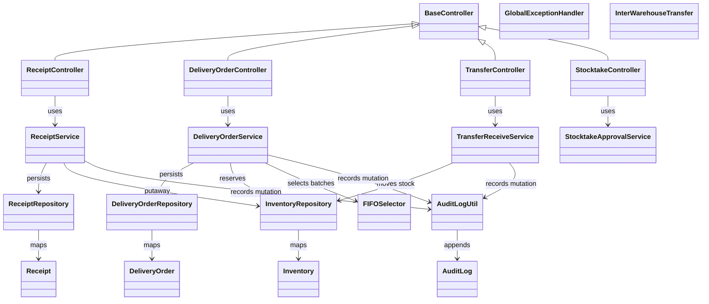

### Cross-domain Sequence Diagram(s)

Các sequence dưới đây biểu diễn các mutation có rủi ro nghiệp vụ cao; các sequence text trong từng subsection là detail API-level của cùng flow.

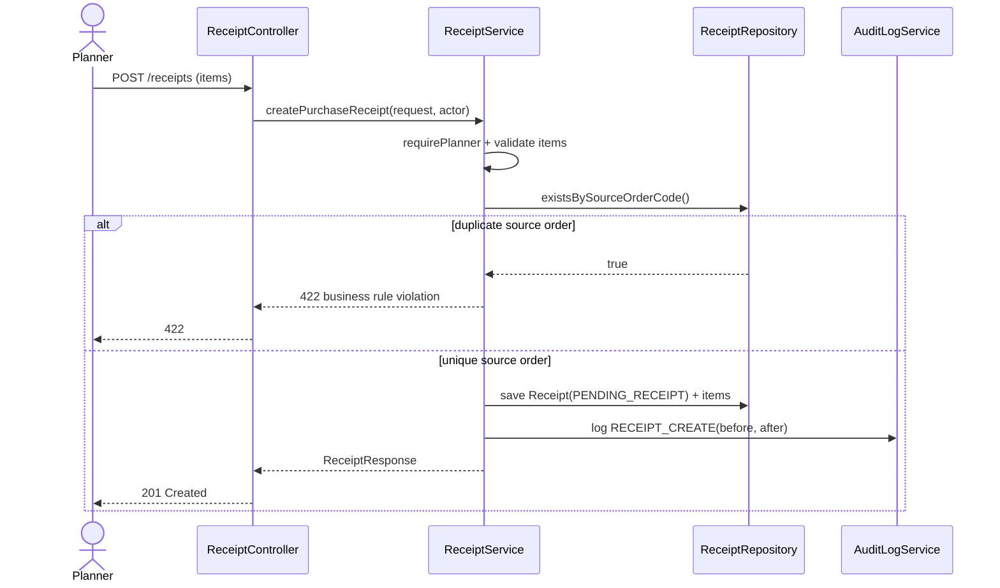

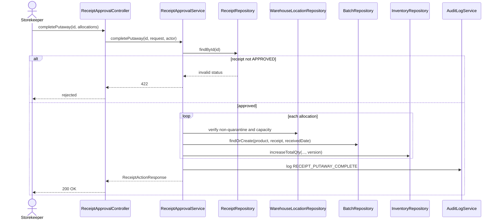

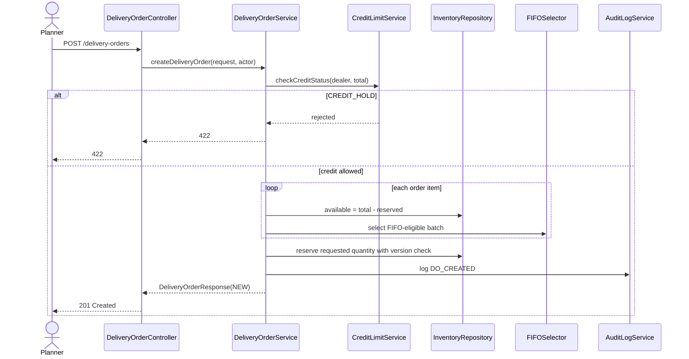

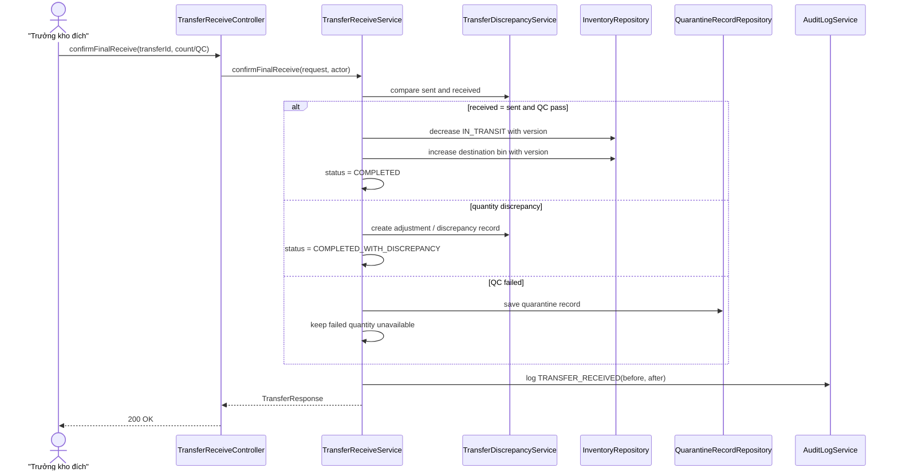

## 1. Security, Authentication & RBAC (Spec 001)

### 1.1 System Configuration

#### a. Class Diagram

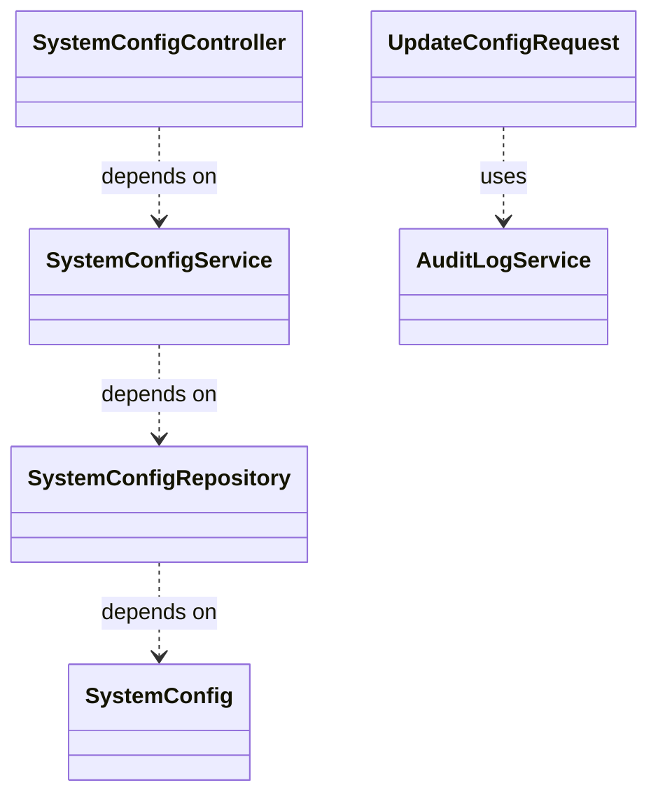

#### b. Class Specifications

**SystemConfigController Class**

| No  | Method                                       | Description                                                                                                    |
| --- | --------------------------------------------- | ---------------------------------------------------------------------------------------------------------------- |
| 01  | `getConfigs()`                                | `GET /api/v1/admin/system-configs` — role `ADMIN`. Trả toàn bộ tham số hệ thống hiện tại.                    |
| 02  | `updateConfig(String key, UpdateConfigRequest)` | `PUT /api/v1/admin/system-configs/{key}` — role `ADMIN`. Cập nhật 1 tham số (VD `DEFAULT_CREDIT_LIMIT`, `DEFAULT_MIN_STOCK`, `DEFAULT_PAYMENT_TERM_DAYS`, `PERIOD_CLOSE_DAY`). |

**SystemConfigService Class**

| No  | Method                                                     | Description                                                                                                                                                                                                                                                                            |
| --- | ------------------------------------------------------------ | ------------------------------------------------------------------------------------------------------------------------------------------------------------------------------------------------------------------------------------------------------------------------------------------ |
| 01  | `updateConfig(String key, String newValue, User actor)`      | **Input**: `key` (VD `DEFAULT_CREDIT_LIMIT`), `newValue`, actor (phải `ADMIN`). **Xử lý nội bộ**: `requireAdmin(actor)` → validate `newValue` theo kiểu dữ liệu của key (numeric/date) → `validateRange` (không âm, không vượt ngưỡng hợp lý) → load config cũ để snapshot → `systemConfigRepository.save()` → ghi audit `SYSTEM_CONFIG_UPDATED` với before/after. **Output**: `SystemConfigResponse`. |
| 02 (private) | `requireAdmin` / `validateRange`                    | Kiểm tra role + validate giá trị theo business rule của từng key.                                                                                                                                                                                                                       |

#### c. Sequence Diagram(s)

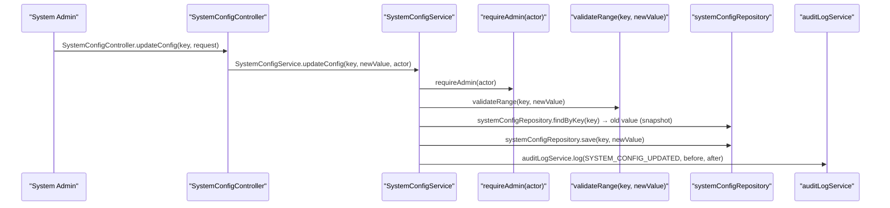

#### d. Database Queries

```sql
-- 1/ Đọc toàn bộ config hiện tại
SELECT config_key, config_value, updated_at FROM system_configs ORDER BY config_key;

-- 2/ Cập nhật 1 tham số
UPDATE system_configs
SET config_value = ?, updated_at = NOW()
WHERE config_key = ?;
```

---

### 1.2 User & Warehouse Assignment Management

#### a. Class Diagram

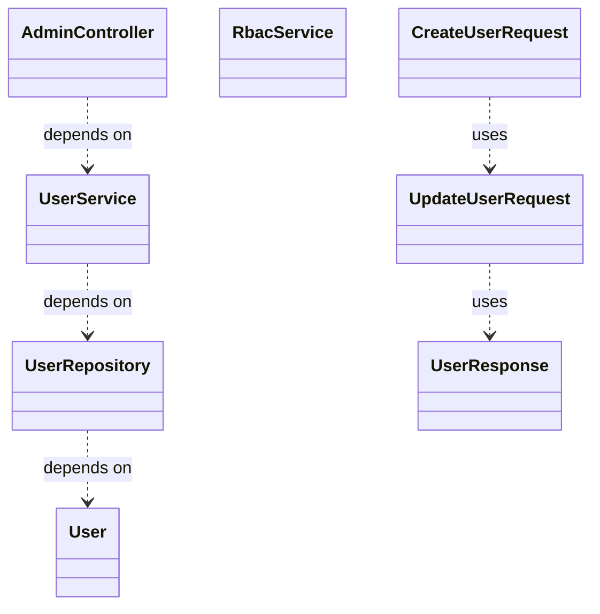

#### b. Class Specifications

**AdminController Class**

| No  | Method                                              | Description                                                                                              |
| --- | ----------------------------------------------------- | ------------------------------------------------------------------------------------------------------------ |
| 01  | `getUsers(...)`                                     | `GET /api/v1/admin/users` — role `ADMIN`. Trả danh sách user + role + warehouse assignments.               |
| 02  | `createUser(CreateUserRequest request)`             | `POST /api/v1/admin/users` — role `ADMIN`. Input: code, email, password, fullName, role, warehouseIds[]. |
| 03  | `updateUser(Long id, UpdateUserRequest request)`     | `PUT /api/v1/admin/users/{id}` — cập nhật role/warehouse assignment.                                        |
| 04  | `deactivateUser(Long id)`                            | `DELETE /api/v1/admin/users/{id}` — soft-delete, `is_active = false`.                                       |

**UserService Class**

| No  | Method                                                                 | Description                                                                                                                                                                                                                                                                                                                                                                    |
| --- | ------------------------------------------------------------------------ | ------------------------------------------------------------------------------------------------------------------------------------------------------------------------------------------------------------------------------------------------------------------------------------------------------------------------------------------------------------------------------------ |
| 01  | `createUser(CreateUserRequest request, User actor)`                    | **Input**: request (code/email unique, password ≥8 ký tự, role hợp lệ trong 10 role, warehouseIds[]), actor (`ADMIN`). **Xử lý nội bộ**: `requireAdmin` → `validateUniqueCode`/`validateUniqueEmail` → `passwordEncoder.encode` (bcrypt cost ≥12) → lưu `User` (`is_active = true`) → lưu `UserWarehouseAssignment[]` cho mỗi warehouseId → ghi audit `USER_CREATED`. **Output**: `UserResponse`.                                                            |
| 02  | `updateUserAssignment(Long userId, UpdateUserRequest request, User actor)` | **Input**: `userId`, request (role mới, warehouseIds mới), actor. **Xử lý nội bộ**: diff warehouseIds cũ/mới → xóa assignment không còn, thêm assignment mới → cập nhật role nếu đổi → ghi audit `USER_UPDATED` với before/after. **Output**: `UserResponse`.                                                                                                                    |
| 03  | `deactivateUser(Long userId, User actor)`                              | **Input**: `userId`, actor. **Xử lý nội bộ**: set `is_active = false`, không xóa record; ghi audit `USER_DEACTIVATED`. **Output**: `UserResponse`.                                                                                                                                                                                                                              |

#### c. Sequence Diagram(s)

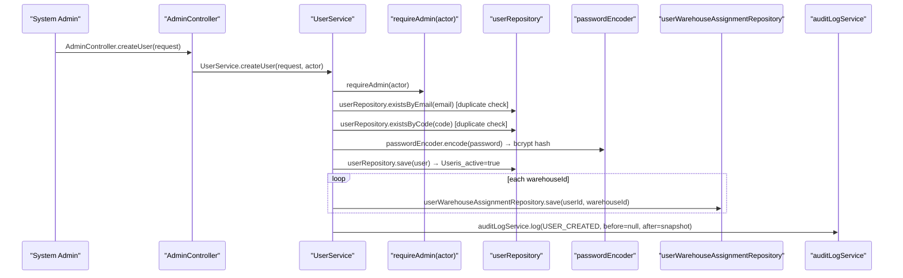

#### d. Database Queries

```sql
-- 1/ Kiểm tra trùng email/code
SELECT EXISTS (SELECT 1 FROM users WHERE email = ?);
SELECT EXISTS (SELECT 1 FROM users WHERE code = ?);

-- 2/ Tạo user
INSERT INTO users (code, email, password_hash, full_name, phone, job_title, role, is_active, created_at)
VALUES (?, ?, ?, ?, ?, ?, ?, true, NOW()) RETURNING id;

-- 3/ Gán warehouse
INSERT INTO user_warehouse_assignments (user_id, warehouse_id, created_at)
VALUES (?, ?, NOW());

-- 4/ Vô hiệu hóa user
UPDATE users SET is_active = false, updated_at = NOW() WHERE id = ?;
```

---

### 1.3 Authentication (Login/JWT)

#### a. Class Diagram

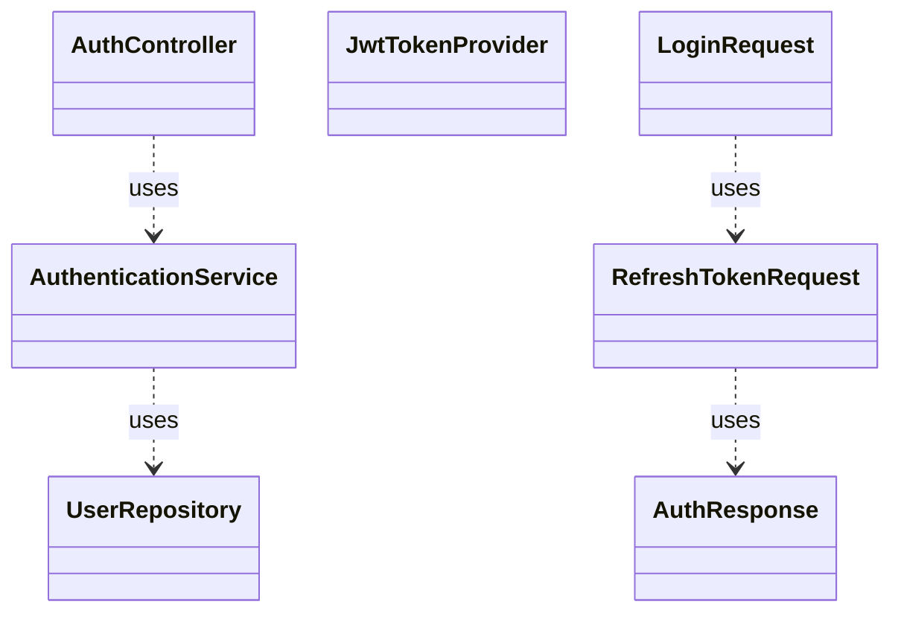

#### b. Class Specifications

**AuthController Class**

| No  | Method                                    | Description                                                                                 |
| --- | -------------------------------------------- | ----------------------------------------------------------------------------------------------- |
| 01  | `login(LoginRequest request)`               | `POST /api/v1/auth/login` — public. Input: email/password. Output: access + refresh token. |
| 02  | `refresh(RefreshTokenRequest request)`      | `POST /api/v1/auth/refresh` — public. Input: refresh token. Output: access token mới.       |
| 03  | `logout()`                                  | `POST /api/v1/auth/logout` — authenticated. Xóa refresh token hash.                        |
| 04  | `getMe()`                                   | `GET /api/v1/auth/me` — authenticated. Trả thông tin user hiện tại + warehouse assignments. |

**AuthenticationService Class**

| No  | Method                                                | Description                                                                                                                                                                                                                                                                                             |
| --- | -------------------------------------------------------- | ------------------------------------------------------------------------------------------------------------------------------------------------------------------------------------------------------------------------------------------------------------------------------------------------------------ |
| 01  | `login(String email, String password)`                  | **Input**: email, password. **Xử lý nội bộ**: `userRepository.findByEmail` (throw `UnauthorizedException` nếu không tồn tại hoặc `is_active=false`) → `passwordEncoder.matches(password, user.passwordHash)` (throw nếu sai) → `jwtTokenProvider.generateAccessToken` (15m) + `generateRefreshToken` (7d) → hash refresh token (SHA-256), lưu `users.refresh_token_hash` + `refresh_token_expires_at` → ghi audit `USER_LOGIN`. **Output**: `AuthResponse{accessToken, refreshToken}`. |
| 02  | `refreshToken(String refreshToken)`                     | **Input**: refresh token (plain). **Xử lý nội bộ**: hash input, so khớp `users.refresh_token_hash` + kiểm tra `refresh_token_expires_at > NOW()` → sinh access token mới. **Output**: `AuthResponse{accessToken}`.                                                                                       |
| 03  | `logout(User actor)`                                    | **Input**: actor hiện tại. **Xử lý nội bộ**: set `refresh_token_hash = NULL`, `refresh_token_expires_at = NULL`. **Output**: void.                                                                                                                                                                        |

#### c. Sequence Diagram(s)

```mermaid
sequenceDiagram
  participant P1 as "User"
  participant P2 as "AuthController"
  participant P3 as "AuthenticationService"
  participant P4 as "userRepository"
  participant P5 as "passwordEncoder"
  participant P6 as "jwtTokenProvider"
  participant P7 as "auditLogService"
  P1->>P2: AuthController.login(request)
  P2->>P3: AuthenticationService.login(email, password)
  P3->>P4: userRepository.findByEmail(email) → User (must be is_active)
  P3->>P5: passwordEncoder.matches(password, hash)
  P3->>P6: jwtTokenProvider.generateAccessToken(user) [15m]
  P3->>P6: jwtTokenProvider.generateRefreshToken(user) [7d]
  P3->>P4: userRepository.save(userrefresh_token_hash)
  P3->>P7: auditLogService.log(USER_LOGIN)
```

#### d. Database Queries

```sql
-- 1/ Tìm user theo email để login
SELECT id, full_name, email, role, password_hash, is_active
FROM users WHERE email = ? AND is_active = true;

-- 2/ Lưu refresh token hash sau login thành công
UPDATE users
SET refresh_token_hash = ?, refresh_token_expires_at = NOW() + INTERVAL '7 days'
WHERE id = ?;

-- 3/ Verify refresh token khi refresh
SELECT id, role, email FROM users
WHERE refresh_token_hash = ? AND refresh_token_expires_at > NOW();

-- 4/ Logout — xóa refresh token
UPDATE users SET refresh_token_hash = NULL, refresh_token_expires_at = NULL WHERE id = ?;
```

---

### 1.4 Audit Log Query

#### a. Class Diagram

```mermaid
classDiagram
  class AuditLogController {}
  class AuditLogService {}
  class AuditLogRepository {}
  AuditLogController ..> AuditLogService : depends on
  AuditLogService ..> AuditLogRepository : depends on
```

#### b. Class Specifications

**AuditLogController Class**

| No  | Method                    | Description                                                                                                            |
| --- | --------------------------- | -------------------------------------------------------------------------------------------------------------------------- |
| 01  | `getAuditLogs(...)`      | `GET /api/v1/admin/audit-logs` — role `ADMIN`. Filter: actor_id, action, entity_type, warehouse_id, from/to date; phân trang server-side và trả `totalItems`/`totalPages`. |

**AuditLogService Class**

| No  | Method                                              | Description                                                                                                                                     |
| --- | ------------------------------------------------------ | ----------------------------------------------------------------------------------------------------------------------------------------------------- |
| 01  | `queryAuditLogs(AuditLogFilterRequest filter, User actor)` | **Input**: filter (actor_id, action, entity_type, warehouse_id, dateFrom, dateTo, page/size), actor (`ADMIN`). **Xử lý nội bộ**: build dynamic query theo filter non-null → sort `created_at DESC`. **Output**: `AuditLogPageResponse` gồm `data`, `page`, `pageSize`, `totalItems`, `totalPages`, `hasNext`, `hasPrevious`, `requiresFilterForOlder`. Read-only, không mutate. |
| 02 (static/util) | `AuditLogUtil.log(action, entityType, entityId, actor, before, after)` | Utility dùng bởi MỌI service khác để ghi audit; build JSON diff before/after, filter field nhạy cảm (password_hash, otp_hash...). |

#### c. Sequence Diagram(s)

```mermaid
sequenceDiagram
  participant P1 as "System Admin"
  participant P2 as "AuditLogController"
  participant P3 as "AuditLogService"
  participant P4 as "requireAdmin(actor)"
  participant P5 as "auditLogRepository"
  P1->>P2: AuditLogController.getAuditLogs(filter)
  P2->>P3: AuditLogService.queryAuditLogs(filter, actor)
  P3->>P4: requireAdmin(actor)
  P3->>P5: auditLogRepository.findByFilters(filter, pageable)
```

#### d. Database Queries

```sql
SELECT al.id, al.actor_id, al.actor_role, al.action, al.entity_type, al.entity_id,
       al.warehouse_id, al.old_value, al.new_value, al.created_at
FROM audit_logs al
WHERE (? IS NULL OR al.actor_id = ?)
  AND (? IS NULL OR al.action = ?)
  AND (? IS NULL OR al.entity_type = ?)
  AND (? IS NULL OR al.warehouse_id = ?)
  AND (? IS NULL OR al.created_at >= ?)
  AND (? IS NULL OR al.created_at <= ?)
ORDER BY al.created_at DESC
LIMIT ? OFFSET ?;
```

---

## 2. Master Data Management (Spec 002)

### 2.1 Product/SKU Management

#### a. Class Diagram

```mermaid
classDiagram
  class ProductController {}
  class ProductService {}
  class ProductRepository {}
  class Product {}
  class PriceHistoryRepository {}
  class CreateProductRequest {}
  class UpdateProductRequest {}
  class ProductResponse {}
  ProductController ..> ProductService : depends on
  ProductService ..> ProductRepository : depends on
  ProductRepository ..> Product : depends on
  CreateProductRequest ..> UpdateProductRequest : uses
  UpdateProductRequest ..> ProductResponse : uses
```

#### b. Class Specifications

**ProductController Class**

| No  | Method                                        | Description                                                                              |
| --- | ------------------------------------------------ | ---------------------------------------------------------------------------------------------- |
| 01  | `getProducts(...)`                              | `GET /api/v1/products` — search theo SKU/name, filter `is_active`.                          |
| 02  | `createProduct(CreateProductRequest request)`   | `POST /api/v1/products` — role `STOREKEEPER`/`ADMIN`. SKU unique, immutable sau tạo.       |
| 03  | `updateProduct(Long id, UpdateProductRequest)`  | `PUT /api/v1/products/{id}` — chỉ cho sửa name/unit/weight/volume/reorder_point, KHÔNG sửa SKU. |
| 04  | `deactivateProduct(Long id)`                    | `DELETE /api/v1/products/{id}` — soft-delete `is_active = false`.                          |

**ProductService Class**

| No  | Method                                                     | Description                                                                                                                                                                                                                                                       |
| --- | -------------------------------------------------------------- | ----------------------------------------------------------------------------------------------------------------------------------------------------------------------------------------------------------------------------------------------------------------------- |
| 01  | `createProduct(CreateProductRequest request, User actor)`      | **Input**: request (sku unique, name, unit, weightKg, volumeM3, unitPerPack, reorderPoint), actor (`STOREKEEPER`/`ADMIN`). **Xử lý nội bộ**: `validateUniqueSku` → lưu `Product` (`is_active=true`) → ghi audit `PRODUCT_CREATED`. **Output**: `ProductResponse`.  |
| 02  | `updateProduct(Long id, UpdateProductRequest request, User actor)` | **Input**: `id`, request (chỉ field cho phép sửa). **Xử lý nội bộ**: load product, apply field updates (bỏ qua nếu request cố gửi `sku` khác) → lưu → ghi audit `PRODUCT_UPDATED`. **Output**: `ProductResponse`.                                                    |
| 03  | `deactivateProduct(Long id, User actor)`                        | **Input**: `id`. **Xử lý nội bộ**: kiểm tra product không có transaction đang mở (optional warning) → set `is_active=false` → ghi audit `PRODUCT_DEACTIVATED`. **Output**: void.                                                                                    |

#### c. Sequence Diagram(s)

```mermaid
sequenceDiagram
  participant P1 as "Thủ kho"
  participant P2 as "ProductController"
  participant P3 as "ProductService"
  participant P4 as "productRepository"
  participant P5 as "auditLogService"
  P1->>P2: ProductController.createProduct(request)
  P2->>P3: ProductService.createProduct(request, actor)
  P3->>P4: productRepository.existsBySku(sku) [duplicate check]
  P3->>P4: productRepository.save(product) → Productis_active=true
  P3->>P5: auditLogService.log(PRODUCT_CREATED, before=null, after=snapshot)
```

#### d. Database Queries

```sql
-- 1/ Danh sách sản phẩm active, search theo sku/name
SELECT id, sku, name, unit, weight_kg, volume_m3, reorder_point
FROM products
WHERE is_active = true AND (sku ILIKE ? OR name ILIKE ?)
ORDER BY created_at DESC;

-- 2/ Kiểm tra SKU trùng
SELECT EXISTS (SELECT 1 FROM products WHERE sku = ?);

-- 3/ Tạo sản phẩm
INSERT INTO products (sku, name, unit, weight_kg, volume_m3, unit_per_pack, reorder_point, is_active, created_at)
VALUES (?, ?, ?, ?, ?, ?, ?, true, NOW()) RETURNING id;

-- 4/ Vô hiệu hóa
UPDATE products SET is_active = false, updated_at = NOW() WHERE id = ?;
```

---

### 2.2 Warehouse Zone & Bin Location Configuration

#### a. Class Diagram

```mermaid
classDiagram
  class WarehouseController {}
  class WarehouseService {}
  class WarehouseRepository {}
  class Warehouse {}
  class BinLocationController {}
  class BinLocationService {}
  class WarehouseLocationRepository {}
  class WarehouseLocation {}
  class LocationLockService {}
  WarehouseController ..> WarehouseService : depends on
  WarehouseService ..> WarehouseRepository : depends on
  WarehouseRepository ..> Warehouse : depends on
  BinLocationController ..> BinLocationService : depends on
  BinLocationService ..> WarehouseLocationRepository : depends on
  WarehouseLocationRepository ..> WarehouseLocation : depends on
```

#### b. Class Specifications

**WarehouseController / BinLocationController Class**

| No  | Method                                             | Description                                                                                     |
| --- | ------------------------------------------------------ | ------------------------------------------------------------------------------------------------------ |
| 01  | `getWarehouses()`                                    | `GET /api/v1/warehouses` — danh sách kho vật lý + IN_TRANSIT.                                       |
| 02  | `createZone(Long warehouseId, CreateZoneRequest)`    | `POST /api/v1/warehouses/{id}/locations` (type=ZONE) — role `WAREHOUSE_MANAGER`/`ADMIN`.            |
| 03  | `createBin(Long warehouseId, CreateBinRequest)`      | `POST /api/v1/warehouses/{id}/locations` (type=BIN, parent_id=zone) — kèm capacity_m3/capacity_kg. |
| 04  | `lockLocations(Long warehouseId)`                    | Internal — gọi bởi `StocktakeService` khi bắt đầu kiểm kê.                                          |

**BinLocationService Class**

| No  | Method                                                              | Description                                                                                                                                                                                                                                                       |
| --- | ------------------------------------------------------------------------ | -------------------------------------------------------------------------------------------------------------------------------------------------------------------------------------------------------------------------------------------------------------------- |
| 01  | `createLocation(Long warehouseId, CreateLocationRequest request, User actor)` | **Input**: warehouseId, request (code unique trong kho, type ZONE/BIN, parent_id nếu BIN, capacity, is_quarantine), actor (`WAREHOUSE_MANAGER`/`ADMIN`). **Xử lý nội bộ**: `validateUniqueCode` → `validateHierarchy` (BIN phải có parent là ZONE, không cho BIN làm parent) → lưu `WarehouseLocation` → ghi audit `LOCATION_CREATED`. **Output**: `LocationResponse`.  |
| 02  | `lockLocationsForStocktake(Long warehouseId)`                             | **Input**: warehouseId (gọi từ `StocktakeService.startStocktake`). **Xử lý nội bộ**: `UPDATE warehouse_locations SET is_locked=true WHERE warehouse_id=? AND type='BIN' AND is_quarantine=false`. **Output**: void.                                              |
| 03  | `unlockLocationsAfterStocktake(Long warehouseId)`                         | Ngược lại của trên, gọi khi stocktake `CLOSED`/`REJECTED`.                                                                                                                                                                                                          |

#### c. Sequence Diagram(s)

```mermaid
sequenceDiagram
  participant P1 as "Trưởng kho"
  participant P2 as "BinLocationController"
  participant P3 as "BinLocationService"
  participant P4 as "validateUniqueCode(warehouseId, code)"
  participant P5 as "validateHierarchy(parentId, type)"
  participant P6 as "warehouseLocationRepository"
  participant P7 as "auditLogService"
  P1->>P2: BinLocationController.createBin(warehouseId, request)
  P2->>P3: BinLocationService.createLocation(warehouseId, request, actor)
  P3->>P4: validateUniqueCode(warehouseId, code)
  P3->>P5: validateHierarchy(parentId, type)
  P3->>P6: warehouseLocationRepository.save(location)
  P3->>P7: auditLogService.log(LOCATION_CREATED, before=null, after=snapshot)
```

#### d. Database Queries

```sql
-- 1/ Kiểm tra code trùng trong kho
SELECT EXISTS (SELECT 1 FROM warehouse_locations WHERE warehouse_id = ? AND code = ?);

-- 2/ Tạo zone/bin
INSERT INTO warehouse_locations (warehouse_id, code, name, type, parent_id, capacity_m3, capacity_kg, is_quarantine, is_active, created_at)
VALUES (?, ?, ?, ?, ?, ?, ?, ?, true, NOW()) RETURNING id;

-- 3/ Lock toàn bộ bin (trừ quarantine) khi bắt đầu stocktake
UPDATE warehouse_locations
SET is_locked = true, updated_at = NOW()
WHERE warehouse_id = ? AND type = 'BIN' AND is_quarantine = false;

-- 4/ Unlock sau stocktake
UPDATE warehouse_locations
SET is_locked = false, updated_at = NOW()
WHERE warehouse_id = ? AND type = 'BIN' AND is_locked = true;
```

---

### 2.3 Dealer/Supplier & Credit Limit Management

#### a. Class Diagram

```mermaid
classDiagram
  class DealerController {}
  class DealerService {}
  class DealerRepository {}
  class Dealer {}
  class SupplierController {}
  class SupplierService {}
  class SupplierRepository {}
  class Supplier {}
  class CreditLimitService {}
  DealerController ..> DealerService : depends on
  DealerService ..> DealerRepository : depends on
  DealerRepository ..> Dealer : depends on
  SupplierController ..> SupplierService : depends on
  SupplierService ..> SupplierRepository : depends on
  SupplierRepository ..> Supplier : depends on
  DealerService ..> CreditLimitService : uses
```

#### b. Class Specifications

**DealerController Class**

| No  | Method                                              | Description                                                                                        |
| --- | ------------------------------------------------------ | ---------------------------------------------------------------------------------------------------------- |
| 01  | `createDealer(CreateDealerRequest request)`           | `POST /api/v1/dealers` — role `ACCOUNTANT`. Tạo hồ sơ Đại lý cơ bản, `credit_status = ACTIVE` mặc định. |
| 02  | `updateCreditLimit(Long dealerId, CreditLimitRequest)` | `PUT /api/v1/dealers/{id}/credit-limit` — role `ACCOUNTANT_MANAGER`.                                    |

**CreditLimitService Class**

| No  | Method                                                                    | Description                                                                                                                                                                                                                                                              |
| --- | ------------------------------------------------------------------------------ | -------------------------------------------------------------------------------------------------------------------------------------------------------------------------------------------------------------------------------------------------------------------------- |
| 01  | `updateCreditLimit(Long dealerId, BigDecimal newLimit, Integer paymentTermDays, User actor)` | **Input**: dealerId, newLimit (>0), paymentTermDays (30/60), actor (`ACCOUNTANT_MANAGER`). **Xử lý nội bộ**: `validateRange(newLimit)` → snapshot old value → `dealerRepository.updateLimit()` → ghi audit `CREDIT_LIMIT_UPDATED` với before/after. **Output**: `DealerResponse`. |
| 02  | `checkCreditStatus(Long dealerId, BigDecimal newDoValue)`                       | **Input**: dealerId, newDoValue (giá trị DO sắp tạo). **Xử lý nội bộ**: query `current_balance` + `credit_limit` + overdue invoices (`due_date < NOW() - 30d`) → `IF balance + newDoValue > limit OR hasOverdue THEN return BLOCKED`. **Output**: `CreditCheckResult{allowed, reason}`. Dùng bởi `DeliveryOrderService.createDeliveryOrder`. |

#### c. Sequence Diagram(s)

```mermaid
sequenceDiagram
  participant P1 as "Kế toán trưởng"
  participant P2 as "DealerController"
  participant P3 as "CreditLimitService"
  participant P4 as "validateRange(newLimit)"
  participant P5 as "dealerRepository"
  participant P6 as "auditLogService"
  P1->>P2: DealerController.updateCreditLimit(dealerId, request)
  P2->>P3: CreditLimitService.updateCreditLimit(dealerId, newLimit, termDays, actor)
  P3->>P4: validateRange(newLimit)
  P3->>P5: dealerRepository.findById(dealerId) → old limit (snapshot)
  P3->>P5: dealerRepository.save(dealercredit_limit=newLimit)
  P3->>P6: auditLogService.log(CREDIT_LIMIT_UPDATED, before, after)
```

#### d. Database Queries

```sql
-- 1/ Tạo dealer
INSERT INTO dealers (name, address, phone, email, credit_limit, credit_status, payment_term_days, current_balance, created_at)
VALUES (?, ?, ?, ?, 0, 'ACTIVE', 30, 0, NOW()) RETURNING id;

-- 2/ Cập nhật Credit Limit
UPDATE dealers SET credit_limit = ?, payment_term_days = ?, updated_at = NOW() WHERE id = ?;

-- 3/ Credit Check (dùng bởi DO creation)
SELECT d.current_balance, d.credit_limit, d.credit_status,
       EXISTS (
         SELECT 1 FROM invoices i
         WHERE i.dealer_id = d.id AND i.status IN ('UNPAID','PARTIALLY_PAID')
           AND i.due_date < NOW() - INTERVAL '30 days'
       ) AS has_overdue
FROM dealers d WHERE d.id = ?;
```

---

### 2.4 Vehicle & Driver Management

#### a. Class Diagram

```mermaid
classDiagram
  class VehicleController {}
  class VehicleService {}
  class VehicleRepository {}
  class Vehicle {}
  class DriverController {}
  class DriverService {}
  class DriverRepository {}
  class Driver {}
  VehicleController ..> VehicleService : depends on
  VehicleService ..> VehicleRepository : depends on
  VehicleRepository ..> Vehicle : depends on
  DriverController ..> DriverService : depends on
  DriverService ..> DriverRepository : depends on
  DriverRepository ..> Driver : depends on
```

#### b. Class Specifications

**VehicleController / DriverController Class**

| No  | Method                                     | Description                                                                                     |
| --- | ---------------------------------------------- | ------------------------------------------------------------------------------------------------------ |
| 01  | `createVehicle(CreateVehicleRequest request)` | `POST /api/v1/vehicles` — role `DISPATCHER`/`ADMIN`. Biển số unique, max_weight_kg, max_volume_m3. |
| 02  | `createDriver(CreateDriverRequest request)`   | `POST /api/v1/drivers` — liên kết `user_id`, gán 1+ warehouse phạm vi hoạt động.                    |

**VehicleService / DriverService Class**

| No  | Method                                                        | Description                                                                                                                                                                                                                     |
| --- | ------------------------------------------------------------------ | ------------------------------------------------------------------------------------------------------------------------------------------------------------------------------------------------------------------------------------ |
| 01  | `createVehicle(CreateVehicleRequest request, User actor)`           | **Input**: plateNumber (unique), maxWeightKg, maxVolumeM3 (nullable), actor. **Xử lý nội bộ**: `validateUniquePlate` → lưu `Vehicle` (`is_active=true`) → ghi audit `VEHICLE_CREATED`. **Output**: `VehicleResponse`.               |
| 02  | `createDriver(CreateDriverRequest request, User actor)`              | **Input**: userId (phải có role `DRIVER`), warehouseIds[], actor. **Xử lý nội bộ**: validate user tồn tại + role DRIVER → lưu `Driver` linked `user_id` + warehouse scope → ghi audit `DRIVER_CREATED`. **Output**: `DriverResponse`. |
| 03  | `getEligibleDrivers(Long warehouseId)`                               | Trả danh sách driver active thuộc `warehouseId`, dùng bởi `TripDispatchService` khi Dispatcher chọn tài xế.                                                                                                                        |

#### c. Sequence Diagram(s)

```mermaid
sequenceDiagram
  participant P1 as "Dispatcher"
  participant P2 as "VehicleController"
  participant P3 as "VehicleService"
  participant P4 as "vehicleRepository"
  participant P5 as "auditLogService"
  P1->>P2: VehicleController.createVehicle(request)
  P2->>P3: VehicleService.createVehicle(request, actor)
  P3->>P4: vehicleRepository.existsByPlateNumber(plate) [duplicate check]
  P3->>P4: vehicleRepository.save(vehicle)
  P3->>P5: auditLogService.log(VEHICLE_CREATED, before=null, after=snapshot)
```

#### d. Database Queries

```sql
-- 1/ Kiểm tra biển số trùng
SELECT EXISTS (SELECT 1 FROM vehicles WHERE plate_number = ?);

-- 2/ Tạo vehicle
INSERT INTO vehicles (plate_number, max_weight_kg, max_volume_m3, is_active, created_at)
VALUES (?, ?, ?, true, NOW()) RETURNING id;

-- 3/ Tạo driver gán đúng một warehouse scope
INSERT INTO drivers (warehouse_id, user_id, full_name, license_number, license_expiry, is_active, created_at)
VALUES (?, ?, ?, ?, ?, true, NOW()) RETURNING id;

-- 4/ Danh sách tài xế eligible cho 1 kho
SELECT d.id, u.full_name
FROM drivers d
JOIN users u ON d.user_id = u.id
WHERE d.warehouse_id = ? AND d.is_active = true;
```

---

## 3. Inbound Receipt & QC (Spec 003)

### 3.1 Receipt Creation & Physical Counting

### a. Class Diagram

```mermaid
classDiagram
  class ReceiptController {}
  class ReceiptService {}
  class ReceiptRepository {}
  class Receipt {}
  class ReceiptItem {}
  class ReceiptItemRepository {}
  class ReceiptValidationService {}
  class CreateReceiptRequest {}
  class ReceiveReceiptRequest {}
  class ReceiptResponse {}
  ReceiptController ..> ReceiptService : depends on
  ReceiptService ..> ReceiptRepository : depends on
  ReceiptRepository ..> Receipt : depends on
  CreateReceiptRequest ..> ReceiveReceiptRequest : uses
  ReceiveReceiptRequest ..> ReceiptResponse : uses
```

Quan hệ: `ReceiptController` (`@RestController`, `@RequestMapping("/api/v1/receipts")`) chỉ điều phối HTTP, gọi `ReceiptService` (business logic + `@Transactional`). `ReceiptService` phụ thuộc `ReceiptRepository`, `ReceiptItemRepository` (Spring Data JPA) để truy xuất `Receipt`/`ReceiptItem` entity, và ghi audit qua `AuditLogUtil`/`AuditLogService`.

### b. Class Specifications

#### ReceiptController Class

| No  | Method                                                   | Description                                                                                                                                                                                                 |
| --- | -------------------------------------------------------- | ----------------------------------------------------------------------------------------------------------------------------------------------------------------------------------------------------------- |
| 01  | `getReceipts(...)`                                       | `GET /api/v1/receipts` — trả danh sách phiếu nhập theo filter (kho, type, status); yêu cầu warehouse-scope của actor hiện tại.                                                                              |
| 02  | `getReceiptById(Long id)`                                | `GET /api/v1/receipts/{id}` — trả chi tiết 1 phiếu nhập kèm danh sách `receipt_items`.                                                                                                                      |
| 03  | `createReceipt(CreateReceiptRequest request)`            | `POST /api/v1/receipts` — role `PLANNER`. Input: kho, `source_order_code`, danh sách SKU + `expected_qty`. Output: `ReceiptResponse` với `status = PENDING_RECEIPT`.                                        |
| 04  | `receiveReceipt(Long id, ReceiveReceiptRequest request)` | `PUT /api/v1/receipts/{id}/receive` — role `WAREHOUSE_STAFF`/`ADMIN`. Input: `counted_qty` cho toàn bộ dòng hàng. Output: `ReceiptResponse` với `actual_qty`/`over_received_qty` đã tính, `status = DRAFT`. |
| 05  | `processQc(...)`                                         | `PUT /api/v1/receipts/{id}/qc` — role `WAREHOUSE_STAFF`/`STOREKEEPER`/`WAREHOUSE_MANAGER`/`ADMIN`. Ủy quyền cho `ReceiptQcService.processQc` (xem mục 2).                                                   |

#### ReceiptService Class

| No           | Method                                                                            | Description                                                                                                                                                                                                                                                                                                                                                                                                                                                                                                                                                             |
| ------------ | --------------------------------------------------------------------------------- | ----------------------------------------------------------------------------------------------------------------------------------------------------------------------------------------------------------------------------------------------------------------------------------------------------------------------------------------------------------------------------------------------------------------------------------------------------------------------------------------------------------------------------------------------------------------------- |
| 01           | `getReceiptsByWarehouse(Long warehouseId, User actor)`                            | Trả danh sách `ReceiptResponse` theo kho, kiểm tra `actor` có quyền truy cập kho đó.                                                                                                                                                                                                                                                                                                                                                                                                                                                                                    |
| 02           | `getReceiptsByWarehouseAndType(Long warehouseId, ReceiptType type, User actor)`   | Lọc thêm theo `type` (`PURCHASE`/`RETURN`) nếu truyền vào; nếu không truyền, lấy tất cả loại.                                                                                                                                                                                                                                                                                                                                                                                                                                                                           |
| 03           | `getReceiptById(Long id, User actor)`                                             | Đọc `Receipt` + join `ReceiptItem` (sắp theo `id ASC`), throw `NotFoundException` nếu không tồn tại hoặc actor không có quyền.                                                                                                                                                                                                                                                                                                                                                                                                                                          |
| 04           | `createPurchaseReceipt(CreateReceiptRequest request, User actor)`                 | **Input**: request (kho, `source_order_code`, items), actor (phải role `PLANNER`, qua `requirePlanner`). **Xử lý nội bộ**: `validateRequest` → `validateItems` → `validateDuplicateSource` (chặn trùng `source_order_code` cùng kho) → `buildItems` map DTO sang entity → lưu `Receipt` (`PENDING_RECEIPT`) và `ReceiptItem[]` → ghi audit `RECEIPT_CREATE` với `snapshot` before/after. **Output**: `ReceiptResponse`.                                                                                                                                                 |
| 05           | `receiveReceiptCounts(Long receiptId, ReceiveReceiptRequest request, User actor)` | **Input**: `receiptId`, request (`counted_qty` mọi dòng), actor (phải `WAREHOUSE_STAFF`, qua `requireWarehouseStaff` + `requireWarehouseAccess`). **Xử lý nội bộ**: `validateReceiveRequest` (đủ dòng, `counted_qty` nguyên dương, không trùng `receipt_item_id`) → với mỗi item tính `actual_qty = min(counted_qty, expected_qty)`, `over_received_qty = max(counted_qty - expected_qty, 0)` → lưu `ReceiptItem[]` → cập nhật `Receipt.status = DRAFT`, nếu đã có QC data thì clear QC field → ghi audit `RECEIPT_RECEIVE`. **Output**: `ReceiptResponse` đã cập nhật. |
| 06 (private) | `requirePlanner` / `requireWarehouseStaff` / `requireWarehouseAccess`             | Kiểm tra role và warehouse-scope của actor; throw `ForbiddenException` nếu vi phạm (BR-SEC-01).                                                                                                                                                                                                                                                                                                                                                                                                                                                                         |
| 07 (private) | `validateDuplicateSource` / `validateRequest` / `validateItems`                   | Validate input theo business rule (không cho request rỗng, `counted_qty <= 0`, item không thuộc receipt...).                                                                                                                                                                                                                                                                                                                                                                                                                                                            |
| 08 (private) | `buildItems` / `snapshot`                                                         | `buildItems` map `CreateReceiptItemRequest → ReceiptItem` entity; `snapshot` build `Map<String,Object>` before/after cho audit log.                                                                                                                                                                                                                                                                                                                                                                                                                                     |

### c. Sequence Diagram(s)


**Sequence: Create Purchase Receipt (`POST /api/v1/receipts`)**

```mermaid
sequenceDiagram
  actor Planner
  participant Controller as ReceiptController
  participant Service as ReceiptService
  participant ReceiptRepo as ReceiptRepository
  participant ItemRepo as ReceiptItemRepository
  participant Audit as AuditLogService
  Planner->>Controller: POST /receipts
  Controller->>Service: createPurchaseReceipt(request, actor)
  Service->>Service: requirePlanner + validate request/items
  Service->>ReceiptRepo: check duplicate source order
  Service->>ReceiptRepo: save PENDING_RECEIPT
  Service->>ItemRepo: save receipt items
  Service->>Audit: RECEIPT_CREATE(before, after)
  Service-->>Controller: ReceiptResponse
  Controller-->>Planner: 201 Created
```

**Sequence: Record Physical Receive Count (`PUT /api/v1/receipts/{id}/receive`)**

```mermaid
sequenceDiagram
  actor Staff as Nhân viên kho
  participant Controller as ReceiptController
  participant Service as ReceiptService
  participant ReceiptRepo as ReceiptRepository
  participant ItemRepo as ReceiptItemRepository
  participant Audit as AuditLogService
  Staff->>Controller: PUT /receipts/{id}/receive
  Controller->>Service: receiveReceiptCounts(id, request, actor)
  Service->>Service: require staff and warehouse scope
  Service->>ReceiptRepo: find receipt
  loop each receipt item
    Service->>Service: calculate actual_qty and over_received_qty
  end
  Service->>ItemRepo: save updated items
  Service->>ReceiptRepo: set status DRAFT and save
  Service->>Audit: RECEIPT_RECEIVE(before, after)
  Controller-->>Staff: 200 OK
```

### d. Database Queries

```sql
-- 1/ Kiểm tra trùng nguồn nhập trong cùng kho khi tạo Receipt
SELECT EXISTS (
    SELECT 1 FROM receipts
    WHERE warehouse_id = ? AND source_order_code = ? AND type = 'PURCHASE'
);

-- 2/ Tạo Receipt (PENDING_RECEIPT) và các dòng hàng
INSERT INTO receipts (receipt_number, source_order_code, type, warehouse_id, status, created_by, created_at)
VALUES (?, ?, 'PURCHASE', ?, 'PENDING_RECEIPT', ?, NOW())
RETURNING id;

INSERT INTO receipt_items (receipt_id, product_id, expected_qty)
VALUES (?, ?, ?);

-- 3/ Đọc phiếu + dòng hàng theo id, sắp theo thứ tự tạo
SELECT * FROM receipts WHERE id = ?;
SELECT * FROM receipt_items WHERE receipt_id = ? ORDER BY id ASC;

-- 4/ Cập nhật số lượng đếm thực tế và chuyển trạng thái DRAFT
UPDATE receipt_items
SET actual_qty = ?, over_received_qty = ?
WHERE id = ? AND receipt_id = ?;

UPDATE receipts
SET status = 'DRAFT', updated_at = NOW()
WHERE id = ? AND status IN ('PENDING_RECEIPT','DRAFT','QC_COMPLETED','QC_FAILED');
```

---

### 3.2 Inbound QC Inspection

### a. Class Diagram

```mermaid
classDiagram
  class ReceiptController {}
  class ReceiptQcService {}
  class ReceiptRepository {}
  class ReceiptItemRepository {}
  class AuditLogService {}
  ReceiptController ..> ReceiptQcService : delegates
```

### b. Class Specifications

#### ReceiptQcService Class

| No  | Method                                                                   | Description                                                                                                                                                                                                                                                                                                                                                                                                                                                                                                                                                     |
| --- | ------------------------------------------------------------------------ | --------------------------------------------------------------------------------------------------------------------------------------------------------------------------------------------------------------------------------------------------------------------------------------------------------------------------------------------------------------------------------------------------------------------------------------------------------------------------------------------------------------------------------------------------------------- |
| 01  | `processQc(Long receiptId, ReceiptQcRequest request, String actorEmail)` | **Input**: `receiptId`, request (danh sách `receipt_item_id` + `qc_result` Đạt/Lỗi + `qc_failure_reason` khi Lỗi), `actorEmail` để resolve actor + role. **Xử lý nội bộ**: kiểm tra `Receipt.status == DRAFT`; validate mỗi dòng có `qc_failure_reason` khi `qc_result = FAILED`; cập nhật `ReceiptItem.qc_result`/`qc_failure_reason`; tính trạng thái tổng của Receipt — `QC_COMPLETED` nếu có ít nhất 1 dòng đạt, `QC_FAILED` nếu toàn bộ lỗi; ghi audit `RECEIPT_QC_RECORD`. **Output**: `ReceiptQcResponse` (trạng thái mới + tổng hợp Đạt/Lỗi theo dòng). |

### c. Sequence Diagram(s)

```mermaid
sequenceDiagram
  participant P1 as "Nhân viên kho/Thủ kho"
  participant P2 as "ReceiptController"
  participant P3 as "ReceiptQcService"
  participant P4 as "receiptRepository"
  participant P5 as "validate qc_failure_reason khi FAILED"
  participant P6 as "receiptItemRepository"
  participant P7 as "compute overall status (QC_COMPLETED / QC_FAILED)"
  participant P8 as "auditLogService"
  P1->>P2: ReceiptController.processQc(id, request)
  P2->>P3: ReceiptQcService.processQc(id, request, actorEmail)
  P3->>P4: receiptRepository.findById(id) → Receipt (must be DRAFT)
  P3->>P5: validate qc_failure_reason khi FAILED
  P3->>P6: receiptItemRepository.saveAll(updatedItems)
  P3->>P7: compute overall status (QC_COMPLETED / QC_FAILED)
  P3->>P4: receiptRepository.save(receipt)
  P3->>P8: auditLogService.log(RECEIPT_QC_RECORD, before, after)
```

### d. Database Queries

```sql
UPDATE receipt_items
SET qc_result = ?, qc_failure_reason = ?
WHERE id = ? AND receipt_id = ?;

UPDATE receipts
SET status = ?, updated_at = NOW()
WHERE id = ? AND status = 'DRAFT';
```

---

### 3.3 Receipt Approval & Putaway

### a. Class Diagram

```mermaid
classDiagram
  class ReceiptApprovalController {}
  class ReceiptApprovalService {}
  class ReceiptRepository {}
  class ReceiptItemRepository {}
  class BatchRepository {}
  class InventoryRepository {}
  class WarehouseLocationRepository {}
  class ReceiptValidationService {}
  class AuditLogService {}
  ReceiptApprovalController ..> ReceiptApprovalService : uses
```

### b. Class Specifications

#### ReceiptApprovalController Class

| No  | Method                                                          | Description                                                                                                |
| --- | --------------------------------------------------------------- | ---------------------------------------------------------------------------------------------------------- |
| 01  | `approve(Long id, ...)`                                         | `PUT /api/v1/receipts/{id}/approve` — role Trưởng kho. Ủy quyền `ReceiptApprovalService.approveReceipt`.   |
| 02  | `reject(Long id, ReceiptDecisionRequest)`                       | `PUT /api/v1/receipts/{id}/reject` — role Trưởng kho, bắt buộc lý do. Ủy quyền `rejectReceipt`.            |
| 03  | `confirmReturnToSupplier(Long id, ReceiptReturnConfirmRequest)` | `PUT /api/v1/receipts/{id}/return-to-supplier/confirm` — role Thủ kho. Ủy quyền `confirmReturnToSupplier`. |
| 04  | `complete(Long id, ReceiptPutawayRequest)`                      | `PUT /api/v1/receipts/{id}/complete` — role Thủ kho, cất hàng vào Bin. Ủy quyền `completePutaway`.         |

#### ReceiptApprovalService Class

| No  | Method                                                                              | Description                                                                                                                                                                                                                                                                                                                                                                                                                                                                                                                                                                               |
| --- | ----------------------------------------------------------------------------------- | ----------------------------------------------------------------------------------------------------------------------------------------------------------------------------------------------------------------------------------------------------------------------------------------------------------------------------------------------------------------------------------------------------------------------------------------------------------------------------------------------------------------------------------------------------------------------------------------- |
| 01  | `approveReceipt(Long receiptId, ...)`                                               | **Input**: `receiptId`, actor (Trưởng kho, đúng kho). **Xử lý**: kiểm tra `Receipt.status == QC_COMPLETED`; cập nhật `status = APPROVED`; KHÔNG cộng tồn kho ở bước này; ghi audit `RECEIPT_APPROVE`. **Output**: `ReceiptActionResponse`.                                                                                                                                                                                                                                                                                                                                                |
| 02  | `rejectReceipt(Long receiptId, ReceiptDecisionRequest request, ...)`                | **Input**: `receiptId`, `request.reason` (bắt buộc), actor. **Xử lý**: kiểm tra `status == QC_COMPLETED`; cập nhật `status = RETURN_TO_SUPPLIER_PENDING`, lưu `reject_reason`; KHÔNG tạo inventory/batch/RTV/Debit Note; ghi audit `RECEIPT_REJECT`. **Output**: `ReceiptActionResponse`.                                                                                                                                                                                                                                                                                                 |
| 03  | `confirmReturnToSupplier(Long receiptId, ReceiptReturnConfirmRequest request, ...)` | **Input**: `receiptId`, actor (Thủ kho). **Xử lý**: kiểm tra `status == RETURN_TO_SUPPLIER_PENDING`; cập nhật `status = RETURNED_TO_SUPPLIER`; ghi audit `RECEIPT_RETURN_CONFIRM`. **Output**: `ReceiptActionResponse`.                                                                                                                                                                                                                                                                                                                                                                   |
| 04  | `completePutaway(Long receiptId, ReceiptPutawayRequest request, ...)`               | **Input**: `receiptId`, `request.items[]` (mỗi item: `receipt_item_id`, `location_id`), actor (Thủ kho). **Xử lý**: kiểm tra `status == APPROVED`; với mỗi dòng: kiểm tra `warehouse_locations.is_quarantine = false` và còn đủ `capacity` (qua `warehouseLocationRepository` + `inventoryRepository` — BR-BAT-02); tạo/tìm `batches` theo product + receipt + `received_date`; cộng `inventories.total_qty` với optimistic lock (`version`); ghi audit `RECEIPT_PUTAWAY_COMPLETE`. Đây là bước DUY NHẤT tăng available inventory của luồng inbound. **Output**: `ReceiptActionResponse`. |

### c. Sequence Diagram(s)


**Sequence: Approve Receipt & Putaway**

```mermaid
sequenceDiagram
  actor Manager as Trưởng kho
  actor Storekeeper as Thủ kho
  participant Controller as ReceiptApprovalController
  participant Service as ReceiptApprovalService
  participant ReceiptRepo as ReceiptRepository
  participant LocationRepo as WarehouseLocationRepository
  participant BatchRepo as BatchRepository
  participant InventoryRepo as InventoryRepository
  participant Audit as AuditLogService
  Manager->>Controller: approve(id)
  Controller->>Service: approveReceipt(id, actor)
  Service->>ReceiptRepo: require QC_COMPLETED and save APPROVED
  Service->>Audit: RECEIPT_APPROVE
  Storekeeper->>Controller: complete(id, putawayRequest)
  Controller->>Service: completePutaway(id, request, actor)
  loop each putaway item
    Service->>LocationRepo: require non-quarantine location with capacity
    Service->>BatchRepo: find or create FIFO batch
    Service->>InventoryRepo: increase total_qty with version check
  end
  Service->>Audit: RECEIPT_PUTAWAY_COMPLETE
  Controller-->>Storekeeper: 200 OK
```

### d. Database Queries

```sql
-- 1/ Duyệt phiếu nhập
UPDATE receipts SET status = 'APPROVED', approved_by = ?, approved_at = NOW()
WHERE id = ? AND status = 'QC_COMPLETED';

-- 2/ Từ chối phiếu nhập
UPDATE receipts SET status = 'RETURN_TO_SUPPLIER_PENDING', reject_reason = ?
WHERE id = ? AND status = 'QC_COMPLETED';

-- 3/ Kiểm tra sức chứa Bin trước putaway
SELECT wl.id, wl.capacity_m3, wl.capacity_kg, wl.current_volume_m3, wl.current_weight_kg, wl.is_quarantine,
       COALESCE(SUM(i.total_qty), 0) AS current_qty
FROM warehouse_locations wl
LEFT JOIN inventories i ON i.location_id = wl.id
WHERE wl.id = ? AND wl.is_quarantine = false
GROUP BY wl.id, wl.capacity_m3, wl.capacity_kg, wl.current_volume_m3, wl.current_weight_kg, wl.is_quarantine;

-- 4/ Tìm hoặc tạo batch theo product + receipt + received_date
SELECT id FROM batches WHERE product_id = ? AND receipt_id = ? AND received_date = ?;
INSERT INTO batches (product_id, receipt_id, received_date, created_at)
VALUES (?, ?, ?, NOW()) RETURNING id;

-- 5/ Cộng tồn kho sau putaway (optimistic locking qua version)
UPDATE inventories
SET total_qty = total_qty + ?, version = version + 1
WHERE warehouse_id = ? AND product_id = ? AND batch_id = ? AND location_id = ? AND version = ?;
```

---

### 3.4 Quarantine & Return-to-Vendor (RTV)

### a. Class Diagram

```mermaid
classDiagram
  class QuarantineController {}
  class QuarantineRtvController {}
  class QuarantineRtvService {}
  class ReceiptRepository {}
  class ReceiptItemRepository {}
  class AdjustmentRepository {}
  class DebitNoteRepository {}
  class InventoryRepository {}
  class QuarantineRecordRepository {}
  class PriceHistoryRepository {}
  class ReceiptValidationService {}
  class AuditLogService {}
  QuarantineRtvController ..> QuarantineRtvService : uses
```

### b. Class Specifications

#### QuarantineController Class

| No  | Method                    | Description                                                                                                                                                                                                 |
| --- | ------------------------- | ----------------------------------------------------------------------------------------------------------------------------------------------------------------------------------------------------------- |
| 01  | `getQuarantineItems(...)` | `GET /api/v1/quarantine/items` — role `WAREHOUSE_STAFF`/`STOREKEEPER`/`WAREHOUSE_MANAGER`/`ADMIN`. Trả danh sách hàng đang trong Quarantine theo kho, kèm `origin` (`RECEIPT_QC_FAIL`/`INTERNAL_TRANSFER`). |

#### QuarantineRtvController Class

| No  | Method                                                 | Description                                                                                    |
| --- | ------------------------------------------------------ | ---------------------------------------------------------------------------------------------- |
| 01  | `createRtv(Long receiptId, ReceiptRtvCreateRequest)`   | `POST /api/v1/receipts/{id}/rtv` — role Trưởng kho. Ủy quyền `QuarantineRtvService.createRtv`. |
| 02  | `confirmRtv(Long receiptId, ReceiptRtvConfirmRequest)` | `PUT /api/v1/receipts/{id}/rtv/confirm` — role Thủ kho. Ủy quyền `confirmRtv`.                 |

#### QuarantineRtvService Class

| No  | Method                                                              | Description                                                                                                                                                                                                                                                                                                                                           |
| --- | ------------------------------------------------------------------- | ----------------------------------------------------------------------------------------------------------------------------------------------------------------------------------------------------------------------------------------------------------------------------------------------------------------------------------------------------- |
| 01  | `createRtv(Long receiptId, ReceiptRtvCreateRequest request, ...)`   | **Input**: `receiptId` (phải có `QC_FAILED` items còn trong Quarantine), actor (Trưởng kho). **Xử lý**: tạo `debit_notes` cho supplier (định giá theo `price_history` hiệu lực); tạo `adjustments` `type = RETURN_TO_VENDOR` ở trạng thái pending; KHÔNG trừ tồn Quarantine ngay; ghi audit `QUARANTINE_RTV_CREATE`. **Output**: `RtvActionResponse`. |
| 02  | `confirmRtv(Long receiptId, ReceiptRtvConfirmRequest request, ...)` | **Input**: `receiptId`, actor (Thủ kho), số lượng xác nhận bàn giao (phải bằng ĐÚNG số lượng RTV — không cho một phần, trả 422 nếu lệch). **Xử lý**: trừ `inventories`/`quarantine_records` theo `receiptId`; giữ `receipts.status = QC_FAILED`; ghi audit `QUARANTINE_RTV_CONFIRM`. **Output**: `RtvActionResponse`.                                 |
| 03  | `getQuarantineItems(Long warehouseId, User actor)`                  | Trả `List<QuarantineItemResponse>` cho kho, kiểm tra warehouse-scope của actor.                                                                                                                                                                                                                                                                       |

### c. Sequence Diagram(s)

```mermaid
sequenceDiagram
  participant P1 as "Trưởng kho"
  participant P2 as "QuarantineRtvController"
  participant P3 as "QuarantineRtvService"
  participant P4 as "receiptRepository"
  participant P5 as "priceHistoryRepository"
  participant P6 as "debitNoteRepository"
  participant P7 as "adjustmentRepository"
  participant P8 as "auditLogService"
  participant P9 as "Thủ kho"
  participant P10 as "validate confirmedQty == rtvQty (else 422)"
  participant P11 as "inventoryRepository"
  participant P12 as "quarantineRecordRepository"
  P1->>P2: QuarantineRtvController.createRtv(receiptId, request)
  P2->>P3: QuarantineRtvService.createRtv(receiptId, request, actor)
  P3->>P4: receiptRepository.findById(receiptId) → Receipt (must have QC_FAILED items)
  P3->>P5: priceHistoryRepository.findEffectivePrice(productId, date)
  P3->>P6: debitNoteRepository.save(debitNote)
  P3->>P7: adjustmentRepository.save(adjustmenttype=RETURN_TO_VENDOR, status=PENDING)
  P3->>P8: auditLogService.log(QUARANTINE_RTV_CREATE, before, after)
  P9->>P2: QuarantineRtvController.confirmRtv(receiptId, request)
  P2->>P3: QuarantineRtvService.confirmRtv(receiptId, request, actor)
  P3->>P10: validate confirmedQty == rtvQty (else 422)
  P3->>P11: inventoryRepository.decreaseQuarantineQty(...)
  P3->>P12: quarantineRecordRepository.markCleared(...)
  P3->>P8: auditLogService.log(QUARANTINE_RTV_CONFIRM, before, after)
```

### d. Database Queries

```sql
-- 1/ Danh sách hàng trong Quarantine theo kho
SELECT qr.id, qr.product_id, qr.quantity, qr.origin, r.receipt_number
FROM quarantine_records qr
JOIN receipts r ON r.id = qr.receipt_id
WHERE qr.warehouse_id = ? AND qr.quantity > 0;

-- 2/ Tạo Debit Note + Adjustment (RTV) — pending, chưa trừ tồn
INSERT INTO debit_notes (receipt_id, supplier_id, amount, created_at)
VALUES (?, ?, ?, NOW()) RETURNING id;

INSERT INTO adjustments (receipt_id, type, quantity, status, created_at)
VALUES (?, 'RETURN_TO_VENDOR', ?, 'PENDING', NOW()) RETURNING id;

-- 3/ Xác nhận bàn giao đủ — trừ tồn Quarantine
UPDATE quarantine_records
SET quantity = quantity - ?
WHERE receipt_id = ? AND product_id = ? AND quantity >= ?;

UPDATE adjustments SET status = 'CONFIRMED', confirmed_at = NOW()
WHERE id = ?;
```

---

## 4. Outbound Delivery & POD (Spec 004)

### 4.1 DO Creation & Credit Check

#### a. Class Diagram

```mermaid
classDiagram
  class DeliveryOrderController {}
  class DeliveryOrderService {}
  class DeliveryOrderRepository {}
  class DeliveryOrder {}
  class CreditLimitService {}
  class InventoryRepository {}
  class PriceHistoryRepository {}
  class WarehouseProductReservationRepository {}
  class CreateDeliveryOrderRequest {}
  class DeliveryOrderResponse {}
  DeliveryOrderController ..> DeliveryOrderService : depends on
  DeliveryOrderService ..> DeliveryOrderRepository : depends on
  DeliveryOrderRepository ..> DeliveryOrder : depends on
  CreateDeliveryOrderRequest ..> DeliveryOrderResponse : uses
```

#### b. Class Specifications

**DeliveryOrderController Class**

| No  | Method                                          | Description                                                                                    |
| --- | -------------------------------------------------- | ---------------------------------------------------------------------------------------------------- |
| 01  | `getDeliveryOrders(...)`                          | `GET /api/v1/delivery-orders` — filter theo kho/dealer/status; warehouse-scoped.                    |
| 02  | `createDeliveryOrder(CreateDeliveryOrderRequest)` | `POST /api/v1/delivery-orders` — role `PLANNER`. Tra 422 `CREDIT_HOLD`/`INSUFFICIENT_STOCK` neu fail. |

**DeliveryOrderService Class**

| No  | Method                                                            | Description                                                                                                                                                                                                                                                                                                                                                                          |
| --- | ---------------------------------------------------------------------- | ------------------------------------------------------------------------------------------------------------------------------------------------------------------------------------------------------------------------------------------------------------------------------------------------------------------------------------------------------------------------------------------- |
| 01  | `createDeliveryOrder(CreateDeliveryOrderRequest request, User actor)`   | **Input**: request (warehouseId, dealerId, requestedDate, items[]), actor (`PLANNER`). **Xu ly noi bo**: `requirePlanner` -> `creditLimitService.checkCreditStatus(dealerId, totalValue)` (throw `CreditHoldException` neu block) -> `validateAvailableStock` cho tung item (`total_qty - reserved_qty >= requestedQty`) -> `priceHistoryService.snapshotPrice` cho tung item -> luu `DeliveryOrder` (`status=NEW`) + `DeliveryOrderItem[]` -> `warehouseProductReservationRepository.reserve` (cap warehouse, chua cap batch) -> ghi audit `DO_CREATED`. **Output**: `DeliveryOrderResponse`. |

#### c. Sequence Diagram(s)

```mermaid
sequenceDiagram
  loop each item
  end
```

#### d. Database Queries

```sql
-- 1/ Credit Check
SELECT d.current_balance, d.credit_limit, d.credit_status,
       EXISTS (SELECT 1 FROM invoices i WHERE i.dealer_id = d.id
               AND i.status IN ('UNPAID','PARTIALLY_PAID') AND i.due_date < NOW() - INTERVAL '30 days') AS has_overdue
FROM dealers d WHERE d.id = ?;

-- 2/ Kiem tra ton kha dung
SELECT COALESCE(SUM(total_qty - reserved_qty), 0) AS available_qty
FROM inventories WHERE warehouse_id = ? AND product_id = ?;

-- 3/ Snapshot gia hieu luc
SELECT cost_price, selling_price FROM price_history
WHERE product_id = ? AND effective_date <= CURRENT_DATE AND (end_date IS NULL OR end_date > CURRENT_DATE)
ORDER BY effective_date DESC LIMIT 1;

-- 4/ Tao DO + items
INSERT INTO delivery_orders (warehouse_id, dealer_id, status, created_by, created_at)
VALUES (?, ?, 'NEW', ?, NOW()) RETURNING id;

INSERT INTO delivery_order_items (do_id, product_id, requested_qty, unit_price)
VALUES (?, ?, ?, ?);

-- 5/ Reserve cap warehouse
UPDATE warehouse_product_reservations
SET reserved_qty = reserved_qty + ?, version = version + 1
WHERE warehouse_id = ? AND product_id = ? AND version = ?;
```

---

### 4.2 Picking Plan (FIFO)

#### a. Class Diagram

```mermaid
classDiagram
  class PickingPlanController {}
  class PickingPlanService {}
  class FIFOSelector {}
  class DeliveryOrderItemAllocationRepository {}
  class InventoryRepository {}
  class BatchRepository {}
  PickingPlanController ..> PickingPlanService : uses
  PickingPlanService ..> FIFOSelector : uses
  InventoryRepository ..> BatchRepository : uses
```

#### b. Class Specifications

**PickingPlanController Class**

| No  | Method                                              | Description                                                                       |
| --- | ------------------------------------------------------ | ---------------------------------------------------------------------------------------- |
| 01  | `createPickingPlan(Long doId, PickingPlanRequest)`    | `PUT /api/v1/delivery-orders/{id}/picking-plan` — role `STOREKEEPER`.               |

**PickingPlanService Class**

| No  | Method                                                        | Description                                                                                                                                                                                                                                                                        |
| --- | ------------------------------------------------------------------ | ----------------------------------------------------------------------------------------------------------------------------------------------------------------------------------------------------------------------------------------------------------------------------------------- |
| 01  | `createPickingPlan(Long doId, PickingPlanRequest request, User actor)` | **Input**: doId (`status=NEW`), request.allocations[] (batchId/locationId/zoneId/plannedQty theo `FIFOSelector` goi y), actor (`STOREKEEPER`). **Xu ly noi bo**: `fifoSelector.suggestBatches(warehouseId, productId)` order by `batch.received_date ASC` -> validate `sum(allocations.plannedQty) == doItem.requestedQty` -> luu `DeliveryOrderItemAllocation[]` -> chuyen DO `WAITING_PICKING` -> ghi audit `PICKING_PLAN_CREATED`. **Output**: `DeliveryOrderResponse`. |

#### c. Sequence Diagram(s)

```mermaid
sequenceDiagram
  participant P1 as "System"
  Note over P1: See detailed functional flow below
```

#### d. Database Queries

```sql
-- 1/ Goi y batch theo FIFO
SELECT i.batch_id, i.location_id, wl.zone_id, b.received_date, (i.total_qty - i.reserved_qty) AS available_qty
FROM inventories i
JOIN batches b ON b.id = i.batch_id
JOIN warehouse_locations wl ON wl.id = i.location_id
WHERE i.warehouse_id = ? AND i.product_id = ? AND wl.is_quarantine = false
  AND (i.total_qty - i.reserved_qty) > 0
ORDER BY b.received_date ASC;

-- 2/ Luu allocation
INSERT INTO delivery_order_item_allocations (do_item_id, batch_id, location_id, zone_id, planned_qty, status)
VALUES (?, ?, ?, ?, ?, 'PLANNED');

-- 3/ Chuyen trang thai DO
UPDATE delivery_orders SET status = 'WAITING_PICKING', updated_at = NOW() WHERE id = ? AND status = 'NEW';
```

---

### 4.3 Picking & Outbound QC

#### a. Class Diagram

```mermaid
classDiagram
  class OutboundQCController {}
  class OutboundQCService {}
  class DeliveryOrderItemAllocationRepository {}
  class QuarantineRecordRepository {}
  class AdjustmentRepository {}
  OutboundQCController ..> OutboundQCService : uses
  OutboundQCService ..> DeliveryOrderItemAllocationRepository : uses
```

#### b. Class Specifications

**OutboundQCService Class**

| No  | Method                                                           | Description                                                                                                                                                                                                                                                                                             |
| --- | ----------------------------------------------------------------------- | ------------------------------------------------------------------------------------------------------------------------------------------------------------------------------------------------------------------------------------------------------------------------------------------------------------- |
| 01  | `executePickingAndQc(Long doId, PickingQcRequest request, User actor)`  | **Input**: doId (`WAITING_PICKING`), request.lines[] (allocationId, pickedQty, qcResult Pass/Fail, failReason), actor (`WAREHOUSE_STAFF`). **Xu ly noi bo**: validate `pickedQty <= allocation.plannedQty` (else `OVER_PICKED`) -> hang Pass: cap nhat `allocation.qcPassQty`, di chuyen vao outbound staging location -> hang Fail: tao `quarantine_records` (`origin=OUTBOUND_QC_FAIL`) + `adjustments`, release phan reserve tuong ung -> tinh trang thai DO tong (`QC_PENDING_APPROVAL`) -> ghi audit `PICKING_QC_EXECUTED`. **Output**: `DeliveryOrderResponse`. |

#### c. Sequence Diagram(s)

```mermaid
sequenceDiagram
  loop each line
  alt QC Pass
  else QC Fail
  end
  end
```

#### d. Database Queries

```sql
-- 1/ Cap nhat allocation sau pick+QC
UPDATE delivery_order_item_allocations
SET picked_qty = ?, qc_pass_qty = ?, qc_fail_qty = ?, status = 'PICKED'
WHERE id = ? AND do_item_id = ?;

-- 2/ Tao quarantine record cho hang fail
INSERT INTO quarantine_records (warehouse_id, product_id, quantity, origin, do_id, created_at)
VALUES (?, ?, ?, 'OUTBOUND_QC_FAIL', ?, NOW());

-- 3/ Chuyen trang thai DO
UPDATE delivery_orders SET status = 'QC_PENDING_APPROVAL', updated_at = NOW() WHERE id = ?;
```

---

### 4.4 Warehouse Approval (DO)

#### a. Class Diagram

```mermaid
classDiagram
  class DeliveryOrderApprovalController {}
  class DeliveryOrderApprovalService {}
  class DeliveryOrderRepository {}
  class DeliveryOrderItemAllocationRepository {}
  DeliveryOrderApprovalController ..> DeliveryOrderApprovalService : uses
  DeliveryOrderApprovalService ..> DeliveryOrderRepository : uses
```

#### b. Class Specifications

**DeliveryOrderApprovalService Class**

| No  | Method                                                       | Description                                                                                                                                                                                                                                                                                    |
| --- | ------------------------------------------------------------------ | ------------------------------------------------------------------------------------------------------------------------------------------------------------------------------------------------------------------------------------------------------------------------------------------------- |
| 01  | `approveDo(Long doId, User actor)`                                 | **Input**: doId (`QC_COMPLETED`), actor (`WAREHOUSE_MANAGER`). **Xu ly noi bo**: cap nhat `status = WAREHOUSE_APPROVED`; ghi audit `DO_APPROVED`. **Output**: `DeliveryOrderResponse`.                                                                                                          |
| 02  | `rejectDo(Long doId, RejectRequest request, User actor)`           | **Input**: doId, request.reason (bat buoc), actor. **Xu ly noi bo**: tra toan bo hang QC-pass o outbound staging ve bin goc (ghi `PICKED_GOODS_RETURN_TO_BIN`), release allocation, `status = REJECTED`; ghi audit `DO_REJECTED`. **Output**: `DeliveryOrderResponse`.                          |

#### c. Sequence Diagram(s)

```mermaid
sequenceDiagram
  participant P1 as "System"
  Note over P1: See detailed functional flow below
```

#### d. Database Queries

```sql
UPDATE delivery_orders SET status = 'WAREHOUSE_APPROVED', approved_by = ?, approved_at = NOW()
WHERE id = ? AND status = 'QC_COMPLETED';

-- Reject: tra hang pass ve bin goc
UPDATE inventories SET total_qty = total_qty + ?, version = version + 1
WHERE warehouse_id = ? AND product_id = ? AND batch_id = ? AND location_id = ?;

UPDATE delivery_orders SET status = 'REJECTED', reject_reason = ? WHERE id = ?;
```

---

### 4.5 Trip Dispatch (Delivery)

#### a. Class Diagram

```mermaid
classDiagram
  class TripDispatchController {}
  class TripDispatchService {}
  class TripRepository {}
  class Trip {}
  class VehicleRepository {}
  class DriverService {}
  class DeliveryOrderRepository {}
  TripDispatchController ..> TripDispatchService : depends on
  TripDispatchService ..> TripRepository : depends on
  TripRepository ..> Trip : depends on
  VehicleRepository ..> DriverService : uses
```

#### b. Class Specifications

**TripDispatchService Class**

| No  | Method                                                             | Description                                                                                                                                                                                                                                                                                                              |
| --- | -------------------------------------------------------------------------- | ------------------------------------------------------------------------------------------------------------------------------------------------------------------------------------------------------------------------------------------------------------------------------------------------------------------------------ |
| 01  | `createDeliveryTrip(CreateTripRequest request, User actor)`               | **Input**: request (warehouseId, doIds[] tat ca `WAREHOUSE_APPROVED` cung kho, vehicleId, driverId), actor (`DISPATCHER`). **Xu ly noi bo**: `requireDispatcher` -> tinh `totalWeight = Sum(doItem.qty * product.weightKg)` -> kiem tra `totalWeight <= vehicle.maxWeightKg` (else `OVER_WEIGHT`) -> neu `vehicle.maxVolumeM3` khac null, kiem tra tuong tu the tich -> validate driver thuoc warehouse scope -> luu `Trip` (`trip_type=DELIVERY`, `status=PLANNED`) -> link DO[] -> ghi audit `TRIP_CREATED`. **Output**: `TripResponse`. |

#### c. Sequence Diagram(s)

```mermaid
sequenceDiagram
  participant P1 as "System"
  Note over P1: See detailed functional flow below
```

#### d. Database Queries

```sql
-- 1/ Tinh tong tai trong cac DO
SELECT SUM(doi.requested_qty * p.weight_kg) AS total_weight
FROM delivery_order_items doi
JOIN products p ON p.id = doi.product_id
WHERE doi.do_id = ANY(?);

-- 2/ Tao trip
INSERT INTO trips (trip_type, warehouse_id, vehicle_id, driver_id, status, created_at)
VALUES ('DELIVERY', ?, ?, ?, 'PLANNED', NOW()) RETURNING id;

-- 3/ Gan DO vao trip
UPDATE delivery_orders SET trip_id = ? WHERE id = ANY(?);
```

---

### 4.6 Driver Mobile POD + OTP

#### a. Class Diagram

```mermaid
classDiagram
  class DriverDeliveryController {}
  class DriverDeliveryServiceImpl {}
  class DeliveryRepository {}
  class Delivery {}
  class DeliveryOtpService {}
  class DeliveryOtpAttemptRepository {}
  DriverDeliveryController ..> DriverDeliveryServiceImpl : depends on
  DriverDeliveryServiceImpl ..> DeliveryRepository : depends on
  DeliveryRepository ..> Delivery : depends on
  DeliveryOtpService ..> DeliveryOtpAttemptRepository : uses
```

#### b. Class Specifications

**DriverDeliveryServiceImpl Class**

| No  | Method                                                             | Description                                                                                                                                                                                                                                                                                    |
| --- | ------------------------------------------------------------------------ | ------------------------------------------------------------------------------------------------------------------------------------------------------------------------------------------------------------------------------------------------------------------------------------------------- |
| 01  | `uploadPod(Long deliveryId, PodUploadRequest request, User actor)`         | **Input**: deliveryId, request (goodsImageRef, signDocumentImageRef - da upload multipart truoc), actor (`DRIVER`, phai dung driver duoc gan). **Xu ly noi bo**: validate ca 2 anh da co -> luu vao `deliveries.goods_image_ref`/`sign_document_image_ref`. **Output**: `DeliveryResponse`. |

**DeliveryOtpService Class**

| No  | Method                                                       | Description                                                                                                                                                                                                                                                                                                                                       |
| --- | ------------------------------------------------------------------ | ------------------------------------------------------------------------------------------------------------------------------------------------------------------------------------------------------------------------------------------------------------------------------------------------------------------------------------------------------- |
| 01  | `requestOtp(Long deliveryId, User actor)`                          | **Input**: deliveryId (da co du POD anh). **Xu ly noi bo**: kiem tra khong co OTP con hieu luc (else `OTP_ALREADY_ACTIVE`) -> sinh ma 6 so random -> hash (SHA-256) -> luu `delivery_otp_attempts` (`expires_at = NOW()+5m`, `status=PENDING`) -> gui email toi `dealer.email`. **Output**: void.                                                          |
| 02  | `verifyOtp(Long deliveryId, String otpPlain, User actor)`           | **Input**: deliveryId, otpPlain (tai xe nhap). **Xu ly noi bo**: hash input, so khop voi `delivery_otp_attempts.otp_hash` con `PENDING` va `expires_at > NOW()` -> neu dung: `status=VERIFIED`, `consumed_at=NOW()`, `deliveries.status=DELIVERED` -> trigger `AutoInvoiceService` -> neu sai: `attempt_count += 1`, neu `>= 3` thi `status=LOCKED`. **Output**: `DeliveryResponse`. |

#### c. Sequence Diagram(s)

```mermaid
sequenceDiagram
  alt hash matches AND not expired
  else otherwise
  alt attemptCount = 3
  end
  end
```

#### d. Database Queries

```sql
-- 1/ Luu OTP hash
INSERT INTO delivery_otp_attempts (delivery_id, recipient_email, otp_hash, expires_at, attempt_count, status)
VALUES (?, ?, ?, NOW() + INTERVAL '5 minutes', 0, 'PENDING');

-- 2/ Verify OTP
SELECT id, otp_hash, expires_at, attempt_count
FROM delivery_otp_attempts
WHERE delivery_id = ? AND status = 'PENDING';

UPDATE delivery_otp_attempts SET status = 'VERIFIED', consumed_at = NOW() WHERE id = ?;
UPDATE deliveries SET status = 'DELIVERED', otp_verified_at = NOW() WHERE id = ?;

-- 3/ Sai OTP: tang attempt_count, khoa neu >=3
UPDATE delivery_otp_attempts
SET attempt_count = attempt_count + 1,
    status = CASE WHEN attempt_count + 1 >= 3 THEN 'LOCKED' ELSE status END
WHERE id = ?;
```

---

### 4.7 Auto-Invoice Creation

#### a. Class Diagram

```mermaid
classDiagram
  class DeliveryDeliveredEvent {}
  class AutoInvoiceService {}
  class InvoiceRepository {}
  class DealerRepository {}
  DeliveryDeliveredEvent ..> AutoInvoiceService : triggers
  AutoInvoiceService ..> InvoiceRepository : triggers
  InvoiceRepository ..> DealerRepository : triggers
```

#### b. Class Specifications

**AutoInvoiceService Class**

| No  | Method                                                | Description                                                                                                                                                                                                                                                                              |
| --- | ---------------------------------------------------------- | ------------------------------------------------------------------------------------------------------------------------------------------------------------------------------------------------------------------------------------------------------------------------------------------------ |
| 01  | `onDeliveryDelivered(DeliveryDeliveredEvent event)`         | **Input**: event chua `deliveryId`/`doId`. **Xu ly noi bo**: idempotent check (`invoiceRepository.existsByDoId`) -> tinh `total_amount = Sum(doItem.qcPassQty * doItem.unitPrice)` -> tao `invoices` (`issue_date=TODAY`, `due_date=TODAY+30`, `status=UNPAID`) -> cong `dealers.current_balance` -> cap nhat DO `status=COMPLETED` -> ghi audit `INVOICE_CREATED`. **Output**: void (event-driven, khong HTTP response). |

#### c. Sequence Diagram(s)

```mermaid
sequenceDiagram
  participant P1 as "System"
  Note over P1: See detailed functional flow below
```

#### d. Database Queries

```sql
SELECT EXISTS (SELECT 1 FROM invoices WHERE do_id = ?);

INSERT INTO invoices (do_id, dealer_id, total_amount, issue_date, due_date, status, created_at)
SELECT ?, do.dealer_id, SUM(doi.qc_pass_qty * doi.unit_price), CURRENT_DATE, CURRENT_DATE + 30, 'UNPAID', NOW()
FROM delivery_orders do
JOIN delivery_order_items doi ON doi.do_id = do.id
WHERE do.id = ?
GROUP BY do.dealer_id;

UPDATE dealers SET current_balance = current_balance + ? WHERE id = ?;
UPDATE delivery_orders SET status = 'COMPLETED' WHERE id = ?;
```

---

## 5. Inter-Warehouse Transfer (Spec 005)

### 5.1 Cross-Warehouse View & Transfer Request

#### a. Class Diagram

```mermaid
classDiagram
  class CrossWarehouseStockController {}
  class CrossWarehouseStockService {}
  class TransferRequestController {}
  class TransferRequestService {}
  class TransferRequestRepository {}
  CrossWarehouseStockController ..> CrossWarehouseStockService : uses
  TransferRequestController ..> TransferRequestService : uses
  TransferRequestService ..> TransferRequestRepository : uses
```

#### b. Class Specifications

**TransferRequestService Class**

| No  | Method                                                       | Description                                                                                                                                                                                                                                                    |
| --- | ------------------------------------------------------------------ | -------------------------------------------------------------------------------------------------------------------------------------------------------------------------------------------------------------------------------------------------------------------- |
| 01  | `getCrossWarehouseStock(User actor)`                                | **Input**: actor (`WAREHOUSE_MANAGER`). **Xu ly noi bo**: query ton kha dung cua 3 kho vat ly (loai `IN_TRANSIT`, `Quarantine`), read-only, khong reserve. **Output**: `List<CrossWarehouseStockResponse>`.                                                       |
| 02  | `createTransferRequest(CreateTransferRequestRequest request, User actor)` | **Input**: request (sourceWarehouseId, destWarehouseId, items[]), actor. **Xu ly noi bo**: validate `source != dest` -> luu `transfer_requests` (`status=DRAFT`) -> ghi audit `TRANSFER_REQUEST_CREATED`. **Output**: `TransferRequestResponse`.                    |
| 03  | `approveTransferRequest(Long id, User ceo)`                          | CEO duyet: `status = APPROVED`, khong reserve, khong sinh bien dong inventory.                                                                                                                                                                                     |

#### c. Sequence Diagram(s)

```mermaid
sequenceDiagram
  participant P1 as "System"
  Note over P1: See detailed functional flow below
```

#### d. Database Queries

```sql
-- 1/ Ton kha dung lien kho (read-only)
SELECT w.id AS warehouse_id, w.code, i.product_id,
       SUM(i.total_qty - i.reserved_qty) AS available_qty
FROM inventories i
JOIN warehouses w ON w.id = i.warehouse_id
JOIN warehouse_locations wl ON wl.id = i.location_id
WHERE w.type = 'PHYSICAL' AND wl.is_quarantine = false
GROUP BY w.id, w.code, i.product_id;

-- 2/ Tao transfer request
INSERT INTO transfer_requests (source_warehouse_id, dest_warehouse_id, status, created_by, created_at)
VALUES (?, ?, 'DRAFT', ?, NOW()) RETURNING id;

-- 3/ CEO duyet
UPDATE transfer_requests SET status = 'APPROVED', approved_by = ?, approved_at = NOW() WHERE id = ?;
```

---

### 5.2 Transfer Order Creation

#### a. Class Diagram

```mermaid
classDiagram
  class TransferController {}
  class InterWarehouseTransferService {}
  class TransferRepository {}
  class Transfer {}
  TransferController ..> InterWarehouseTransferService : depends on
  InterWarehouseTransferService ..> TransferRepository : depends on
  TransferRepository ..> Transfer : depends on
```

#### b. Class Specifications

**InterWarehouseTransferService Class**

| No  | Method                                                     | Description                                                                                                                                                                                                                                       |
| --- | ---------------------------------------------------------------- | ------------------------------------------------------------------------------------------------------------------------------------------------------------------------------------------------------------------------------------------------------- |
| 01  | `createTransfer(CreateTransferRequest request, User actor)`        | **Input**: request (sourceWarehouseId, destWarehouseId, items[]), actor (`PLANNER`). **Xu ly noi bo**: validate `source != dest`, SKU ton tai -> luu `transfers` (`status=NEW`, ma `TRF-*`) + `transfer_items` (`sent_qty=0`) -> ghi audit `TRANSFER_CREATED`. Chua reserve. **Output**: `TransferResponse`. |

#### c. Sequence Diagram(s)

```mermaid
sequenceDiagram
  participant P1 as "System"
  Note over P1: See detailed functional flow below
```

#### d. Database Queries

```sql
INSERT INTO transfers (code, source_warehouse_id, dest_warehouse_id, status, created_by, created_at)
VALUES (?, ?, ?, 'NEW', ?, NOW()) RETURNING id;

INSERT INTO transfer_items (transfer_id, product_id, planned_qty, sent_qty, received_qty)
VALUES (?, ?, ?, 0, 0);
```

---

### 5.3 Transfer Approval & Reserve Stock

#### a. Class Diagram

```mermaid
classDiagram
  class TransferApprovalController {}
  class TransferApprovalService {}
  class TransferRepository {}
  class FIFOSelector {}
  class WarehouseProductReservationRepository {}
  TransferApprovalController ..> TransferApprovalService : uses
  TransferApprovalService ..> TransferRepository : uses
  FIFOSelector ..> WarehouseProductReservationRepository : uses
```

#### b. Class Specifications

**TransferApprovalService Class**

| No  | Method                                                   | Description                                                                                                                                                                                                                                                        |
| --- | --------------------------------------------------------------- | --------------------------------------------------------------------------------------------------------------------------------------------------------------------------------------------------------------------------------------------------------------------- |
| 01  | `approveTransfer(Long transferId, User actor)`                    | **Input**: transferId (`NEW`), actor (`WAREHOUSE_MANAGER` kho nguon). **Xu ly noi bo**: kiem tra ton FIFO-eligible du cho moi item (else `INSUFFICIENT_STOCK`) -> reserve theo `fifoSelector` -> `status=APPROVED` -> ghi audit `TRANSFER_APPROVED`. **Output**: `TransferResponse`. |
| 02  | `rejectTransfer(Long transferId, String reason, User actor)`       | **Input**: transferId, reason bat buoc. **Xu ly noi bo**: `status=REJECTED`, khong reserve; ghi audit `TRANSFER_REJECTED`. **Output**: `TransferResponse`.                                                                                                          |

#### c. Sequence Diagram(s)

```mermaid
sequenceDiagram
  loop each item
  end
```

#### d. Database Queries

```sql
UPDATE warehouse_product_reservations
SET reserved_qty = reserved_qty + ?, version = version + 1
WHERE warehouse_id = ? AND product_id = ? AND version = ?;

UPDATE transfers SET status = 'APPROVED', approved_by = ?, approved_at = NOW() WHERE id = ? AND status = 'NEW';
UPDATE transfers SET status = 'REJECTED', reject_reason = ? WHERE id = ? AND status = 'NEW';
```

---

### 5.4 Transfer Ship (Dispatch + Outbound QC + Handover)

#### a. Class Diagram

```mermaid
classDiagram
  class TransferShipmentController {}
  class TransferShipmentService {}
  class TripRepository {}
  class InventoryRepository {}
  TransferShipmentController ..> TransferShipmentService : uses
  TransferShipmentService ..> TripRepository : uses
```

#### b. Class Specifications

**TransferShipmentService Class**

| No  | Method                                                            | Description                                                                                                                                                                                                                                                                                                            |
| --- | ------------------------------------------------------------------------ | ---------------------------------------------------------------------------------------------------------------------------------------------------------------------------------------------------------------------------------------------------------------------------------------------------------------------------- |
| 01  | `dispatchTransferTrip(CreateTransferTripRequest request, User actor)`      | **Input**: request (transferId `APPROVED`, vehicleId, driverId thuoc kho nguon). **Xu ly noi bo**: tuong tu `TripDispatchService` (weight/volume check) -> tao `trips` (`trip_type=TRANSFER`, ma `TTR-*`). **Output**: `TripResponse`.                                                                                    |
| 02  | `confirmDeparture(Long transferId, User actor)`                            | **Input**: transferId, actor (`DRIVER`). **Xu ly noi bo**: kiem tra anh handover da upload -> tru `inventories` kho nguon, cong `inventories` kho ao `IN_TRANSIT` -> `transfer.status=IN_TRANSIT`; ghi audit `TRANSFER_SHIPPED`. **Output**: `TransferResponse`.                                                          |

#### c. Sequence Diagram(s)

```mermaid
sequenceDiagram
  participant P1 as "System"
  Note over P1: See detailed functional flow below
```

#### d. Database Queries

```sql
INSERT INTO trips (trip_type, warehouse_id, vehicle_id, driver_id, status, created_at)
VALUES ('TRANSFER', ?, ?, ?, 'PLANNED', NOW()) RETURNING id;

UPDATE inventories SET total_qty = total_qty - ?, version = version + 1
WHERE warehouse_id = ? AND product_id = ? AND batch_id = ? AND version = ?;

INSERT INTO inventories (warehouse_id, product_id, batch_id, location_id, total_qty)
VALUES ((SELECT id FROM warehouses WHERE type='IN_TRANSIT'), ?, ?, NULL, ?)
ON CONFLICT (warehouse_id, product_id, batch_id) DO UPDATE SET total_qty = inventories.total_qty + EXCLUDED.total_qty;

UPDATE transfers SET status = 'IN_TRANSIT', updated_at = NOW() WHERE id = ?;
```

---

### 5.5 Transfer Receive (Count + QC + Final Approval)

#### a. Class Diagram

```mermaid
classDiagram
  class TransferReceiveController {}
  class TransferReceiveService {}
  class TransferDiscrepancyService {}
  class InventoryRepository {}
  class QuarantineRecordRepository {}
  TransferReceiveController ..> TransferReceiveService : uses
  TransferReceiveService ..> TransferDiscrepancyService : uses
  InventoryRepository ..> QuarantineRecordRepository : uses
```

#### b. Class Specifications

**TransferReceiveService Class**

| No  | Method                                                              | Description                                                                                                                                                                                                                                                                                                                                                        |
| --- | -------------------------------------------------------------------------- | ---------------------------------------------------------------------------------------------------------------------------------------------------------------------------------------------------------------------------------------------------------------------------------------------------------------------------------------------------------------------------- |
| 01  | `recordBlindCount(Long transferId, BlindCountRequest request, User actor)`    | **Input**: transferId (`IN_TRANSIT`), request.receivedQty[] theo item, actor (`WAREHOUSE_STAFF`). **Xu ly noi bo**: luu received draft (chua cap nhat inventory). **Output**: `TransferReceiveDraftResponse`.                                                                                                                                                       |
| 02  | `confirmFinalReceive(Long transferId, FinalReceiveRequest request, User actor)` | **Input**: transferId, request (QC result tung item, bin chon cho hang dat), actor (`WAREHOUSE_MANAGER` kho dich). **Xu ly noi bo**: `transferDiscrepancyService.calculate(sent_qty, received_qty)` -> neu khop: tru `IN_TRANSIT`, cong kho dich, `status=COMPLETED`; neu thieu: tao `adjustments(TRANSFER_DISCREPANCY)`, `status=COMPLETED_WITH_DISCREPANCY`; neu QC fail: vao Quarantine (`origin=INTERNAL_TRANSFER`). **Output**: `TransferResponse`. |

#### c. Sequence Diagram(s)

```mermaid
sequenceDiagram
  alt received == sent AND QC pass
  else received sent
  else QC fail
  end
```

#### d. Database Queries

```sql
-- 1/ Tinh chenh lech
SELECT ti.planned_qty AS sent_qty, ?::int AS received_qty, (?::int - ti.planned_qty) AS variance_qty
FROM transfer_items ti WHERE ti.id = ?;

-- 2/ Khop: tru IN_TRANSIT, cong kho dich
UPDATE inventories SET total_qty = total_qty - ? WHERE warehouse_id = (SELECT id FROM warehouses WHERE type='IN_TRANSIT') AND product_id = ?;
UPDATE inventories SET total_qty = total_qty + ?, version = version + 1 WHERE warehouse_id = ? AND product_id = ? AND location_id = ?;
UPDATE transfers SET status = 'COMPLETED', updated_at = NOW() WHERE id = ?;

-- 3/ Chenh lech: tao adjustment
INSERT INTO adjustments (transfer_id, product_id, type, quantity_adjustment, created_at)
VALUES (?, ?, 'TRANSFER_DISCREPANCY', ?, NOW());
UPDATE transfers SET status = 'COMPLETED_WITH_DISCREPANCY' WHERE id = ?;

-- 4/ QC fail: Quarantine
INSERT INTO quarantine_records (warehouse_id, product_id, quantity, origin, transfer_id, created_at)
VALUES (?, ?, ?, 'INTERNAL_TRANSFER', ?, NOW());
```

---

## 6. Stocktake & Adjustment (Spec 006)

### 6.1 Stocktake Creation & Count

#### a. Class Diagram

```mermaid
classDiagram
  class StocktakeController {}
  class StocktakeService {}
  class StocktakeRepository {}
  class Stocktake {}
  class LocationLockService {}
  StocktakeController ..> StocktakeService : depends on
  StocktakeService ..> StocktakeRepository : depends on
  StocktakeRepository ..> Stocktake : depends on
```

#### b. Class Specifications

**StocktakeService Class**

| No  | Method                                                     | Description                                                                                                                                                                                                                                                       |
| --- | ------------------------------------------------------------- | --------------------------------------------------------------------------------------------------------------------------------------------------------------------------------------------------------------------------------------------------------------------- |
| 01  | `createStocktake(Long warehouseId, User actor)`                  | **Input**: warehouseId, actor (`STOREKEEPER`). **Xu ly noi bo**: kiem tra khong co stocktake `IN_PROGRESS` khac cho kho (else `WAREHOUSE_LOCKED`) -> snapshot `system_qty` tu `inventories` cho tung product/location -> luu `stocktakes` (`status=IN_PROGRESS`) + `stocktake_items` -> `locationLockService.lockLocationsForStocktake(warehouseId)` -> ghi audit `STOCKTAKE_CREATED`. **Output**: `StocktakeResponse`.                                       |
| 02  | `recordCount(Long stocktakeId, RecordCountRequest request, User actor)` | **Input**: stocktakeId, request.counts[] (product/location/receivedQty), actor (`WAREHOUSE_STAFF`). **Xu ly noi bo**: cap nhat `stocktake_items.received_qty` -> tinh `variance_qty = system_qty - received_qty`. **Output**: `StocktakeResponse`.                    |

#### c. Sequence Diagram(s)

```mermaid
sequenceDiagram
  participant P1 as "System"
  Note over P1: See detailed functional flow below
```

#### d. Database Queries

```sql
SELECT EXISTS (SELECT 1 FROM stocktakes WHERE warehouse_id = ? AND status = 'IN_PROGRESS');

INSERT INTO stocktakes (warehouse_id, status, created_by, created_at) VALUES (?, 'IN_PROGRESS', ?, NOW()) RETURNING id;

INSERT INTO stocktake_items (stocktake_id, product_id, location_id, system_qty)
SELECT ?, i.product_id, i.location_id, i.total_qty FROM inventories i WHERE i.warehouse_id = ?;

UPDATE warehouse_locations SET is_locked = true WHERE warehouse_id = ? AND type = 'BIN' AND is_quarantine = false;

UPDATE stocktake_items SET received_qty = ?, variance_qty = system_qty - ? WHERE id = ?;
```

---

### 6.2 Adjustment Approval

#### a. Class Diagram

```mermaid
classDiagram
  class StocktakeApprovalController {}
  class StocktakeApprovalService {}
  class InventoryRepository {}
  class AdjustmentRepository {}
  class LocationLockService {}
  StocktakeApprovalController ..> StocktakeApprovalService : uses
  StocktakeApprovalService ..> InventoryRepository : uses
  AdjustmentRepository ..> LocationLockService : uses
```

#### b. Class Specifications

**StocktakeApprovalService Class**

| No  | Method                                                     | Description                                                                                                                                                                                                                                                              |
| --- | ------------------------------------------------------------- | ------------------------------------------------------------------------------------------------------------------------------------------------------------------------------------------------------------------------------------------------------------------------------ |
| 01  | `approveAdjustment(Long stocktakeId, User actor)`                | **Input**: stocktakeId, actor (`WAREHOUSE_MANAGER`). **Xu ly noi bo**: voi moi `stocktake_item` co `variance_qty != 0`: `inventoryRepository.setTotalQty(receivedQty)` + tao `adjustments` (`type=STOCKTAKE`) -> `locationLockService.unlock(warehouseId)` -> `stocktake.status=CLOSED` -> ghi audit `STOCKTAKE_APPROVED`. **Output**: `StocktakeResponse`. Flat approval, khong phan cap gia tri. |
| 02  | `rejectAdjustment(Long stocktakeId, User actor)`                 | **Input**: stocktakeId. **Xu ly noi bo**: `status` quay lai `IN_PROGRESS`, kho van lock, yeu cau dem lai. **Output**: `StocktakeResponse`.                                                                                                                                 |

#### c. Sequence Diagram(s)

```mermaid
sequenceDiagram
  loop each stocktake_item where variance_qty != 0
  end
```

#### d. Database Queries

```sql
UPDATE inventories SET total_qty = ?, version = version + 1 WHERE product_id = ? AND location_id = ? AND warehouse_id = ?;

INSERT INTO adjustments (stocktake_id, product_id, type, quantity_adjustment, created_at)
VALUES (?, ?, 'STOCKTAKE', ?, NOW());

UPDATE warehouse_locations SET is_locked = false WHERE warehouse_id = ? AND is_locked = true;

UPDATE stocktakes SET status = 'CLOSED', approved_by = ?, approved_at = NOW() WHERE id = ?;
```

---

## 7. Pricing & COGS Management (Spec 007)

### 7.1 Price List Creation

#### a. Class Diagram

```mermaid
classDiagram
  class PriceListController {}
  class PricingService {}
  class PriceHistoryRepository {}
  class PriceHistory {}
  PriceListController ..> PricingService : depends on
  PricingService ..> PriceHistoryRepository : depends on
  PriceHistoryRepository ..> PriceHistory : depends on
```

#### b. Class Specifications

**PricingService Class**

| No  | Method                                                        | Description                                                                                                                                                                                                                        |
| --- | ---------------------------------------------------------------------- | ----------------------------------------------------------------------------------------------------------------------------------------------------------------------------------------------------------------------------------------- |
| 01  | `createPriceList(CreatePriceListRequest request, User actor)`          | **Input**: request.items[] (productId, costPrice, sellingPrice, effectiveDate), actor (`ACCOUNTANT`). **Xu ly noi bo**: `validatePriceRange` (>0) -> luu `price_history` (`status=DRAFT`) -> ghi audit `PRICE_LIST_CREATED`. **Output**: `PriceListResponse`. |
| 02  | `importExcel(MultipartFile file, User actor)`                          | Parse Excel theo template, map tung dong -> goi `createPriceList` hang loat.                                                                                                                                                            |

#### c. Sequence Diagram(s)

```mermaid
sequenceDiagram
  loop each item
  end
```

#### d. Database Queries

```sql
INSERT INTO price_history (product_id, cost_price, selling_price, effective_date, end_date, status, created_at)
VALUES (?, ?, ?, ?, NULL, 'DRAFT', NOW());
```

---

### 7.2 Price Approval

#### a. Class Diagram

```mermaid
classDiagram
  class PriceApprovalController {}
  class PriceApprovalService {}
  class PriceHistoryRepository {}
  PriceApprovalController ..> PriceApprovalService : uses
  PriceApprovalService ..> PriceHistoryRepository : uses
```

#### b. Class Specifications

**PriceApprovalService Class**

| No  | Method                                                | Description                                                                                                                                     |
| --- | ------------------------------------------------------------ | ----------------------------------------------------------------------------------------------------------------------------------------------------- |
| 01  | `approvePriceList(Long priceListId, User actor)`                | **Input**: priceListId (`DRAFT`), actor (`ACCOUNTANT_MANAGER`). **Xu ly noi bo**: `status=ACTIVE`; ghi audit `PRICE_LIST_APPROVED`. **Output**: `PriceListResponse`. |

#### c. Sequence Diagram(s)

```mermaid
sequenceDiagram
  participant P1 as "System"
  Note over P1: See detailed functional flow below
```

#### d. Database Queries

```sql
UPDATE price_history SET status = 'ACTIVE', approved_by = ?, approved_at = NOW() WHERE id = ? AND status = 'DRAFT';
```

---

### 7.3 COGS Auto-Calculation (Snapshot)

#### a. Class Diagram

```mermaid
classDiagram
  class DeliveryOrderService {}
  class PriceHistoryRepository {}
  DeliveryOrderService ..> PriceHistoryRepository : uses
```

#### b. Class Specifications

**PriceHistoryRepository (query method)**

| No  | Method                                                          | Description                                                                                                                                                       |
| --- | ---------------------------------------------------------------------- | ---------------------------------------------------------------------------------------------------------------------------------------------------------------------- |
| 01  | `findEffectivePrice(Long productId, LocalDate date)`                     | **Input**: productId, date (ngay tao DO). **Xu ly noi bo**: `WHERE product_id=? AND effective_date <= date AND (end_date IS NULL OR end_date > date) ORDER BY effective_date DESC LIMIT 1`. **Output**: `PriceHistory{costPrice, sellingPrice}`, snapshot co dinh vao `delivery_order_items.unit_price`. |

#### c. Sequence Diagram(s)

```mermaid
sequenceDiagram
  participant P1 as "System"
  Note over P1: See detailed functional flow below
```

#### d. Database Queries

```sql
SELECT cost_price, selling_price FROM price_history
WHERE product_id = ? AND status = 'ACTIVE'
  AND effective_date <= ? AND (end_date IS NULL OR end_date > ?)
ORDER BY effective_date DESC LIMIT 1;
```

---

## 8. Finance & Billing & Closing (Spec 008)

### 8.1 Invoice Reconciliation

#### a. Class Diagram

```mermaid
classDiagram
  class BillingNotificationController {}
  class InvoiceServiceImpl {}
  class BillingNotificationRepository {}
  class InvoiceRepository {}
  BillingNotificationController ..> InvoiceServiceImpl : uses
  InvoiceServiceImpl ..> BillingNotificationRepository : uses
  BillingNotificationRepository ..> InvoiceRepository : uses
```

#### b. Class Specifications

**InvoiceServiceImpl Class**

| No  | Method                                                    | Description                                                                                                                                                          |
| --- | ---------------------------------------------------------------- | -------------------------------------------------------------------------------------------------------------------------------------------------------------------------- |
| 01  | `getBillingWorklist(User actor)`                                    | Tra danh sach `billing_notifications` chua confirm, join `invoices`.                                                                                                    |
| 02  | `confirmReconciliation(Long billingNotificationId, User actor)`      | **Input**: id, actor (`ACCOUNTANT`). **Xu ly noi bo**: mark `is_confirmed=true`; ghi audit `INVOICE_RECONCILED`. **Output**: void.                                       |

#### c. Sequence Diagram(s)

```mermaid
sequenceDiagram
  participant P1 as "System"
  Note over P1: See detailed functional flow below
```

#### d. Database Queries

```sql
SELECT bn.id, bn.do_id, i.id AS invoice_id, i.total_amount
FROM billing_notifications bn
JOIN invoices i ON i.do_id = bn.do_id
WHERE bn.is_confirmed = false;

UPDATE billing_notifications SET is_confirmed = true, confirmed_at = NOW() WHERE id = ?;
```

---

### 8.2 Payment Receipt Recording

#### a. Class Diagram

```mermaid
classDiagram
  class PaymentReceiptController {}
  class PaymentReceiptServiceImpl {}
  class PaymentReceiptRepository {}
  class InvoiceRepository {}
  class DealerRepository {}
  PaymentReceiptController ..> PaymentReceiptServiceImpl : uses
  PaymentReceiptServiceImpl ..> PaymentReceiptRepository : uses
  PaymentReceiptRepository ..> InvoiceRepository : uses
  InvoiceRepository ..> DealerRepository : uses
```

#### b. Class Specifications

**PaymentReceiptServiceImpl Class**

| No  | Method                                                          | Description                                                                                                                                                                                                                                                                                                    |
| --- | ------------------------------------------------------------------------ | ----------------------------------------------------------------------------------------------------------------------------------------------------------------------------------------------------------------------------------------------------------------------------------------------------------------- |
| 01  | `recordPayment(RecordPaymentRequest request, User actor)`                  | **Input**: request (dealerId, amount, invoiceIds[] can tru), actor (`ACCOUNTANT`). **Xu ly noi bo**: validate `amount > 0` -> luu `payment_receipts` -> voi moi invoice: cap nhat `status` (`PAID` neu du, `PARTIALLY_PAID` neu thieu) -> `dealers.current_balance -= amount` -> `creditLimitService.reEvaluate(dealerId)` (neu `balance < limit*0.8` va khong overdue -> `ACTIVE`) -> ghi audit `PAYMENT_RECEIVED`. **Output**: `PaymentReceiptResponse`. |

#### c. Sequence Diagram(s)

```mermaid
sequenceDiagram
  loop each invoiceId
  end
```

#### d. Database Queries

```sql
INSERT INTO payment_receipts (dealer_id, amount, payment_date, created_at) VALUES (?, ?, NOW(), NOW()) RETURNING id;

UPDATE invoices SET status = CASE WHEN paid_amount + ? >= total_amount THEN 'PAID' ELSE 'PARTIALLY_PAID' END,
                    paid_amount = paid_amount + ?
WHERE id = ?;

UPDATE dealers SET current_balance = current_balance - ? WHERE id = ?;

UPDATE dealers SET credit_status = 'ACTIVE'
WHERE id = ? AND current_balance < credit_limit * 0.8
  AND NOT EXISTS (SELECT 1 FROM invoices WHERE dealer_id = dealers.id AND status IN ('UNPAID','PARTIALLY_PAID') AND due_date < NOW() - INTERVAL '30 days');
```

---

### 8.3 Aging Report

#### a. Class Diagram

```mermaid
classDiagram
  class ReportController {}
  class ReportServiceImpl {}
  class InvoiceRepository {}
  ReportController ..> ReportServiceImpl : uses
  ReportServiceImpl ..> InvoiceRepository : uses
```

#### b. Class Specifications

**ReportServiceImpl Class**

| No  | Method                                    | Description                                                                                                                                                                       |
| --- | ---------------------------------------------- | ------------------------------------------------------------------------------------------------------------------------------------------------------------------------------------- |
| 01  | `getAgingReport(User actor)`                     | **Input**: actor (`ACCOUNTANT_MANAGER`/`CEO`). **Xu ly noi bo**: query `invoices` chua `CLOSED`, nhom theo `dealer_id` + bucket (`Not due`/`1-30`/`31-60`/`>60`) theo `due_date`. **Output**: `AgingReportResponse`, read-only. |

#### c. Sequence Diagram(s)

```mermaid
sequenceDiagram
  participant P1 as "System"
  Note over P1: See detailed functional flow below
```

#### d. Database Queries

```sql
SELECT dealer_id,
       CASE WHEN due_date >= CURRENT_DATE THEN 'Not due'
            WHEN CURRENT_DATE - due_date <= 30 THEN '1-30 days'
            WHEN CURRENT_DATE - due_date <= 60 THEN '31-60 days'
            ELSE '>60 days' END AS aging_bucket,
       SUM(total_amount - paid_amount) AS balance
FROM invoices
WHERE status NOT IN ('CLOSED', 'PAID')
GROUP BY dealer_id, aging_bucket;
```

---

### 8.4 Accounting Period Closing

#### a. Class Diagram

```mermaid
classDiagram
  class AccountingPeriodController {}
  class AccountingPeriodServiceImpl {}
  class AccountingPeriodRepository {}
  AccountingPeriodController ..> AccountingPeriodServiceImpl : uses
  AccountingPeriodServiceImpl ..> AccountingPeriodRepository : uses
```

#### b. Class Specifications

**AccountingPeriodServiceImpl Class**

| No  | Method                                       | Description                                                                                                                                                                        |
| --- | ------------------------------------------------- | ---------------------------------------------------------------------------------------------------------------------------------------------------------------------------------------- |
| 01  | `closePeriod(Long periodId, User actor)`             | **Input**: periodId, actor (`ACCOUNTANT_MANAGER`). **Xu ly noi bo**: validate moi ky truoc do da `CLOSED` (else `PERIOD_SEQUENCE_ERROR`) -> `status=CLOSED`; ghi audit `PERIOD_CLOSED`. **Output**: `AccountingPeriodResponse`. |

#### c. Sequence Diagram(s)

```mermaid
sequenceDiagram
  participant P1 as "System"
  Note over P1: See detailed functional flow below
```

#### d. Database Queries

```sql
SELECT EXISTS (SELECT 1 FROM accounting_periods WHERE period_end < (SELECT period_start FROM accounting_periods WHERE id = ?) AND status != 'CLOSED');

UPDATE accounting_periods SET status = 'CLOSED', closed_by = ?, closed_at = NOW() WHERE id = ?;
```

---

## 9. Returns, Scrap & Disposal (Spec 009)

### 9.1 Dealer Return & Credit Note

#### a. Class Diagram

```mermaid
classDiagram
  class ReturnController {}
  class ReturnService {}
  class ReceiptRepository {}
  class CreditNoteService {}
  class CreditNoteRepository {}
  ReturnController ..> ReturnService : uses
  ReturnService ..> ReceiptRepository : uses
  CreditNoteService ..> CreditNoteRepository : uses
```

#### b. Class Specifications

**ReturnService Class**

| No  | Method                                                | Description                                                                                                                                                                                                                          |
| --- | ------------------------------------------------------------ | ----------------------------------------------------------------------------------------------------------------------------------------------------------------------------------------------------------------------------------------- |
| 01  | `receiveDealerReturn(CreateReturnRequest request, User actor)`  | **Input**: request (dealerId, doId goc, items[]), actor (`STOREKEEPER`). **Xu ly noi bo**: tao `receipts` (`type=RETURN`) -> QC hang hoan -> neu dat: cong ton kho bin; neu fail: vao Quarantine. **Output**: `ReceiptResponse`.        |

**CreditNoteService Class**

| No  | Method                                                | Description                                                                                                                                                                     |
| --- | ------------------------------------------------------------ | ----------------------------------------------------------------------------------------------------------------------------------------------------------------------------------------- |
| 01  | `createCreditNote(Long returnReceiptId, User actor)`             | **Input**: returnReceiptId (hang QC dat), actor (`ACCOUNTANT`). **Xu ly noi bo**: tinh `amount = returnQty * original_unit_price` (tu DO goc) -> luu `credit_notes` -> tru `dealers.current_balance`. **Output**: `CreditNoteResponse`. |

#### c. Sequence Diagram(s)

```mermaid
sequenceDiagram
  alt QC pass
  else QC fail
  end
```

#### d. Database Queries

```sql
INSERT INTO receipts (type, dealer_id, warehouse_id, status, created_by, created_at)
VALUES ('RETURN', ?, ?, 'PENDING_RECEIPT', ?, NOW()) RETURNING id;

UPDATE inventories SET total_qty = total_qty + ?, version = version + 1
WHERE warehouse_id = ? AND product_id = ? AND location_id = ?;

INSERT INTO credit_notes (dealer_id, receipt_id, amount, reason, created_at)
VALUES (?, ?, ?, 'CUSTOMER_RETURN', NOW());

UPDATE dealers SET current_balance = current_balance - ? WHERE id = ?;
```

---

### 9.2 Disposal Approval & Execution

#### a. Class Diagram

```mermaid
classDiagram
  class DisposalController {}
  class DisposalService {}
  class DamageReportRepository {}
  class AdjustmentRepository {}
  class QuarantineRecordRepository {}
  DisposalController ..> DisposalService : uses
  DisposalService ..> DamageReportRepository : uses
  DamageReportRepository ..> AdjustmentRepository : uses
  AdjustmentRepository ..> QuarantineRecordRepository : uses
```

#### b. Class Specifications

**DisposalService Class**

| No  | Method                                                     | Description                                                                                                                                                                                                                                       |
| --- | ------------------------------------------------------------- | ------------------------------------------------------------------------------------------------------------------------------------------------------------------------------------------------------------------------------------------------------- |
| 01  | `createDamageReport(CreateDamageReportRequest request, User actor)` | **Input**: request (quarantineRecordId, quantity, origin, reason), actor (`STOREKEEPER`). **Xu ly noi bo**: luu `damage_reports` (`status=PENDING`). **Output**: `DamageReportResponse`.                                                            |
| 02  | `approveDisposal(Long damageReportId, User actor)`                  | **Input**: damageReportId, actor (`WAREHOUSE_MANAGER`, flat approval). **Xu ly noi bo**: `status=APPROVED`; ghi audit `DISPOSAL_APPROVED`. **Output**: `DamageReportResponse`.                                                                        |
| 03  | `executeDisposal(Long damageReportId, User actor)`                  | **Input**: damageReportId (`APPROVED`), actor (`STOREKEEPER`). **Xu ly noi bo**: tru `quarantine_records`, tao `adjustments` (`type=DISPOSAL`), `status=EXECUTED`; ghi audit `DISPOSAL_EXECUTED`. **Output**: `DamageReportResponse`.                     |

#### c. Sequence Diagram(s)

```mermaid
sequenceDiagram
  participant P1 as "System"
  Note over P1: See detailed functional flow below
```

#### d. Database Queries

```sql
INSERT INTO damage_reports (quarantine_record_id, quantity, origin, reason, status, created_at)
VALUES (?, ?, ?, ?, 'PENDING', NOW()) RETURNING id;

UPDATE damage_reports SET status = 'APPROVED', approved_by = ?, approved_at = NOW() WHERE id = ?;

UPDATE quarantine_records SET quantity = quantity - ? WHERE id = ?;

INSERT INTO adjustments (product_id, type, quantity_adjustment, created_at)
VALUES (?, 'DISPOSAL', ?, NOW());

UPDATE damage_reports SET status = 'EXECUTED', executed_at = NOW() WHERE id = ?;
```

---

## 10. Reports, Dashboards & Alerts (Spec 010)

### 10.1 CEO Dashboard

#### a. Class Diagram

```mermaid
classDiagram
  class DashboardController {}
  class ReportServiceImpl {}
  DashboardController ..> ReportServiceImpl : uses
```

#### b. Class Specifications

**ReportServiceImpl Class**

| No  | Method                             | Description                                                                                                                                                                                       |
| --- | --------------------------------------- | ----------------------------------------------------------------------------------------------------------------------------------------------------------------------------------------------------- |
| 01  | `getDashboardKpi(User actor)`             | **Input**: actor (`CEO`). **Xu ly noi bo**: tong hop Inventory KPI (total value, low stock count), Credit KPI (A/R, aging), P&L (revenue YTD, COGS, margin%), QC KPI (accept/defect rate), OTD (on-time %). Read-only. **Output**: `DashboardResponse`. |

#### c. Sequence Diagram(s)

```mermaid
sequenceDiagram
  participant P1 as "System"
  Note over P1: See detailed functional flow below
```

#### d. Database Queries

```sql
-- Inventory value
SELECT SUM(i.total_qty * ph.cost_price) AS total_value
FROM inventories i
JOIN price_history ph ON ph.product_id = i.product_id AND ph.status = 'ACTIVE';

-- OTD rate
SELECT COUNT(*) FILTER (WHERE delivered_at <= requested_date)::float / COUNT(*) AS otd_rate
FROM delivery_orders WHERE status = 'COMPLETED';

-- QC accept rate
SELECT COUNT(*) FILTER (WHERE qc_result = 'PASS')::float / COUNT(*) AS accept_rate
FROM receipt_items WHERE qc_result IS NOT NULL;
```

---

### 10.2 Low Stock Alert Trigger/Resolve

#### a. Class Diagram

```mermaid
classDiagram
  class InventoryChangeEvent {}
  class StockAlertServiceImpl {}
  class StockAlertRepository {}
  class StockAlert {}
  InventoryChangeEvent ..> StockAlertServiceImpl : depends on
  StockAlertServiceImpl ..> StockAlertRepository : depends on
  StockAlertRepository ..> StockAlert : depends on
```

#### b. Class Specifications

**StockAlertServiceImpl Class**

| No  | Method                                                   | Description                                                                                                                                                                                                                                            |
| --- | --------------------------------------------------------------- | ------------------------------------------------------------------------------------------------------------------------------------------------------------------------------------------------------------------------------------------------------------- |
| 01  | `onInventoryChanged(InventoryChangeEvent event)`                   | **Input**: event (warehouseId, productId). **Xu ly noi bo**: tinh `available_qty = total_qty - reserved_qty` -> so voi `product.reorderPoint` -> neu duoi nguong va chua co alert active: tao `stock_alerts` (`is_resolved=false`); neu hoi phuc va co alert active: `is_resolved=true`. **Output**: void (event-driven). |

#### c. Sequence Diagram(s)

```mermaid
sequenceDiagram
  alt availableQty reorderPoint AND no active alert
  else availableQty = reorderPoint AND active alert exists
  end
```

#### d. Database Queries

```sql
SELECT COALESCE(SUM(total_qty - reserved_qty), 0) AS available_qty
FROM inventories WHERE warehouse_id = ? AND product_id = ?;

INSERT INTO stock_alerts (warehouse_id, product_id, alert_type, is_resolved, created_at)
VALUES (?, ?, 'LOW_STOCK', false, NOW())
ON CONFLICT (warehouse_id, product_id, alert_type, is_resolved) DO NOTHING;

UPDATE stock_alerts SET is_resolved = true, resolved_at = NOW()
WHERE warehouse_id = ? AND product_id = ? AND is_resolved = false;
```

---

### 10.3 Productivity Report

#### a. Class Diagram

```mermaid
classDiagram
  class ProductivityReportController {}
  class ReportServiceImpl {}
  class AuditLogRepository {}
  class DeliveryOrderItemRepository {}
  ProductivityReportController ..> ReportServiceImpl : uses
  ReportServiceImpl ..> AuditLogRepository : uses
  AuditLogRepository ..> DeliveryOrderItemRepository : uses
```

#### b. Class Specifications

**ReportServiceImpl Class (Productivity)**

| No  | Method                                            | Description                                                                                                                                                                        |
| --- | -------------------------------------------------------- | ----------------------------------------------------------------------------------------------------------------------------------------------------------------------------------------- |
| 01  | `getProductivityReport(Long warehouseId, DateRange range, User actor)` | **Input**: warehouseId, date range, actor (`WAREHOUSE_MANAGER`). **Xu ly noi bo**: dem so phieu xu ly + item picked/packed tu `audit_logs`/`delivery_order_item_allocations` theo staff, tinh efficiency = items/gio (uoc luong tu state-change timestamps). **Output**: `ProductivityReportResponse`, ho tro export Excel. |

#### c. Sequence Diagram(s)

```mermaid
sequenceDiagram
  participant P1 as "System"
  Note over P1: See detailed functional flow below
```

#### d. Database Queries

```sql
SELECT al.actor_id, COUNT(*) AS actions_count
FROM audit_logs al
WHERE al.warehouse_id = ? AND al.created_at BETWEEN ? AND ?
GROUP BY al.actor_id;

SELECT picked_by AS actor_id, SUM(picked_qty) AS total_picked
FROM delivery_order_item_allocations
WHERE warehouse_id = ? AND updated_at BETWEEN ? AND ?
GROUP BY picked_by;
```

---

## Schema Reference Summary

# III. Visual Design Coverage by Domain

Các sơ đồ dưới đây là chỉ mục trực quan cho toàn bộ 10 domain. Chúng bổ sung cho Class Specifications, sequence text và logical query chi tiết ở Phần II; mỗi dependency thể hiện đúng Controller → Service → Repository → Entity.

## 1. Security & RBAC

```mermaid
classDiagram
  AdminController --> UserService
  AuthController --> AuthenticationService
  SystemConfigController --> SystemConfigService
  AuditLogController --> AuditLogService
  UserService --> UserRepository
  AuthenticationService --> JwtTokenProvider
  AuditLogService --> AuditLogRepository
```

```mermaid
sequenceDiagram
  actor Admin
  Admin->>AdminController: create user / assign warehouses
  AdminController->>UserService: validate role and warehouse scope
  UserService->>UserRepository: save user + assignments
  UserService->>AuditLogService: append USER_CREATED
  UserService-->>Admin: 201 Created
```

## 2. Master Data

```mermaid
classDiagram
  ProductController --> ProductService --> ProductRepository
  WarehouseController --> WarehouseService --> WarehouseRepository
  BinLocationController --> BinLocationService --> WarehouseLocationRepository
  DealerController --> CreditLimitService --> DealerRepository
  VehicleController --> VehicleService --> VehicleRepository
  DriverController --> DriverService --> DriverRepository
```

```mermaid
sequenceDiagram
  actor Manager
  Manager->>BinLocationController: create bin
  BinLocationController->>BinLocationService: validate code, hierarchy, capacity
  BinLocationService->>WarehouseLocationRepository: save location
  BinLocationService->>AuditLogService: append LOCATION_CREATED
  BinLocationController-->>Manager: 201 Created
```

## 3. Inbound Receipt & QC

```mermaid
classDiagram
  ReceiptController --> ReceiptService
  ReceiptController --> ReceiptQcService
  ReceiptApprovalController --> ReceiptApprovalService
  ReceiptService --> ReceiptRepository
  ReceiptApprovalService --> BatchRepository
  ReceiptApprovalService --> InventoryRepository
  ReceiptApprovalService --> WarehouseLocationRepository
```

```mermaid
sequenceDiagram
  actor Planner
  participant ReceiptService
  participant ReceiptRepository
  participant AuditLogService
  Planner->>ReceiptService: createPurchaseReceipt(items)
  ReceiptService->>ReceiptRepository: save(PENDING_RECEIPT)
  ReceiptService->>AuditLogService: RECEIPT_CREATE
  Note over ReceiptService: Count → QC → manager approval → putaway
```

## 4. Outbound Delivery & POD

```mermaid
classDiagram
  DeliveryOrderController --> DeliveryOrderService
  PickingPlanController --> PickingPlanService
  OutboundQCController --> OutboundQCService
  DriverDeliveryController --> DriverDeliveryServiceImpl
  DeliveryOrderService --> CreditLimitService
  PickingPlanService --> FIFOSelector
  OutboundQCService --> QuarantineRecordRepository
```

```mermaid
sequenceDiagram
  actor Planner
  Planner->>DeliveryOrderService: create DO
  DeliveryOrderService->>CreditLimitService: check credit
  DeliveryOrderService->>InventoryRepository: verify/reserve available qty
  DeliveryOrderService->>AuditLogService: DO_CREATED
  Note over DeliveryOrderService: FIFO picking → outbound QC → approval → POD/OTP
```

## 5. Inter-Warehouse Transfer

```mermaid
classDiagram
  TransferRequestController --> TransferRequestService
  TransferController --> InterWarehouseTransferService
  TransferApprovalController --> TransferApprovalService
  TransferShipmentController --> TransferShipmentService
  TransferReceiveController --> TransferReceiveService
  TransferReceiveService --> TransferDiscrepancyService
  TransferReceiveService --> InventoryRepository
```

```mermaid
sequenceDiagram
  actor SourceManager
  participant Approval as TransferApprovalService
  participant Inventory as InventoryRepository
  SourceManager->>Approval: approve transfer
  Approval->>Inventory: FIFO availability + reserve with version
  Approval->>AuditLogService: TRANSFER_APPROVED
  Note over Approval: Ship source → IN_TRANSIT → destination count/QC/final receive
```

## 6. Stocktake & Adjustment

```mermaid
classDiagram
  StocktakeController --> StocktakeService
  StocktakeApprovalController --> StocktakeApprovalService
  StocktakeService --> LocationLockService
  StocktakeApprovalService --> InventoryRepository
  StocktakeApprovalService --> AdjustmentRepository
```

```mermaid
sequenceDiagram
  actor Storekeeper
  Storekeeper->>StocktakeService: create stocktake
  StocktakeService->>LocationLockService: lock warehouse locations
  StocktakeService->>StocktakeRepository: snapshot inventory
  Note over StocktakeService: count → variance → manager approves adjustment → unlock
```

## 7. Pricing & COGS

```mermaid
classDiagram
  PriceListController --> PricingService --> PriceHistoryRepository
  PriceApprovalController --> PriceApprovalService --> PriceHistoryRepository
  DeliveryOrderService --> PriceHistoryRepository
```

```mermaid
sequenceDiagram
  actor Accountant
  Accountant->>PricingService: create/import price list
  PricingService->>PriceHistoryRepository: save DRAFT prices
  Accountant->>PriceApprovalService: submit approval
  PriceApprovalService->>PriceHistoryRepository: activate effective prices
```

## 8. Finance & Closing

```mermaid
classDiagram
  BillingNotificationController --> InvoiceServiceImpl
  PaymentReceiptController --> PaymentReceiptServiceImpl
  AccountingPeriodController --> AccountingPeriodServiceImpl
  PaymentReceiptServiceImpl --> InvoiceRepository
  PaymentReceiptServiceImpl --> DealerRepository
```

```mermaid
sequenceDiagram
  actor Accountant
  Accountant->>PaymentReceiptServiceImpl: record payment allocations
  PaymentReceiptServiceImpl->>InvoiceRepository: apply payment
  PaymentReceiptServiceImpl->>DealerRepository: decrease balance/re-evaluate credit
  PaymentReceiptServiceImpl->>AuditLogService: PAYMENT_RECEIVED
```

## 9. Returns & Disposal

```mermaid
classDiagram
  ReturnController --> ReturnService
  CreditNoteController --> CreditNoteService
  DisposalController --> DisposalService
  ReturnService --> QuarantineRecordRepository
  DisposalService --> AdjustmentRepository
```

```mermaid
sequenceDiagram
  actor Storekeeper
  Storekeeper->>ReturnService: receive dealer return
  alt QC pass
    ReturnService->>InventoryRepository: increase available stock
  else QC fail
    ReturnService->>QuarantineRecordRepository: create quarantine record
  end
```

## 10. Reports & Alerts

```mermaid
classDiagram
  DashboardController --> ReportServiceImpl
  ProductivityReportController --> ReportServiceImpl
  StockAlertServiceImpl --> StockAlertRepository
  ReportServiceImpl --> AuditLogRepository
  ReportServiceImpl --> InvoiceRepository
```

```mermaid
sequenceDiagram
  participant Event as InventoryChangeEvent
  participant Alert as StockAlertServiceImpl
  participant Product as ProductRepository
  participant Store as StockAlertRepository
  Event->>Alert: inventory changed
  Alert->>Product: get reorder point
  alt available below threshold
    Alert->>Store: create active alert
  else stock recovered
    Alert->>Store: resolve active alert
  end
```

**Core Tables (All Specs):**
```
users ←→ user_warehouse_assignments ←→ warehouses
warehouse_locations (zones/bins with is_locked, is_quarantine)
products (SKU, unit, no serial/expiry/grade)
batches (product + received_date + source receipt)
inventories (warehouse + product + batch + location; optimistic locking via version)

receipts, receipt_items, batches ← Spec 003
delivery_orders, delivery_order_items, delivery_order_item_allocations, deliveries ← Spec 004
transfers, transfer_requests, transfer_request_items, transfer_items, inter_warehouse_transfer_allocations ← Spec 005
stock_takes, stock_take_items ← Spec 006
price_history ← Spec 007
invoices, payment_receipts, accounting_periods ← Spec 008
quarantine_records, damage_reports, adjustments (type in STOCK_TAKE, TRANSFER_DISCREPANCY, DISPOSAL, RTV...) ← Spec 009
audit_logs (append-only, actor_id NOT NULL, action/entity_type snapshots) ← All specs
```

**Constraint Summary:**
- Inventory: total_qty ≥ 0, reserved_qty ≥ 0, total_qty - reserved_qty ≥ 0 (CHECK + app validation)
- Warehouse: unique code, manager_id FK to user with MANAGER role
- Location: unique code per warehouse, parent_id for hierarchy (ZONE → BIN only)
- Product: unique SKU, no serial/expiry/grade for household goods
- DO/Transfer: credit check, FIFO allocation, optimistic locking, soft-cancel (status = CANCELLED)
- Stocktake/Adjustment: location locking, flat approval (Trưởng kho)
- Invoice: auto-create on delivery DELIVERED, unit_price snapshot from picking plan
- Audit: append-only, ghi all mutations + REPORT_VIEW for confidential reports
