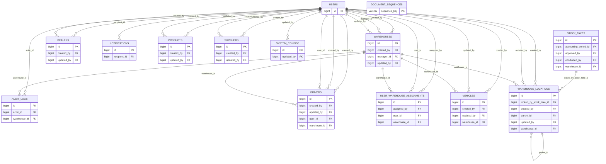
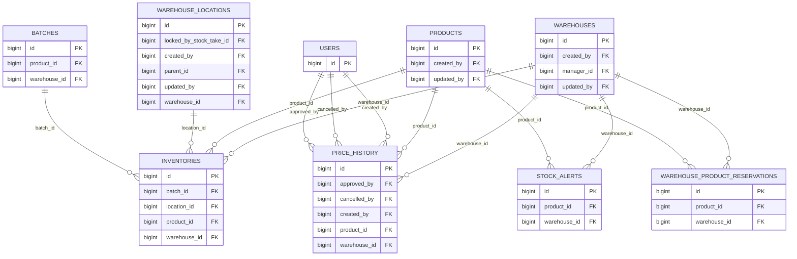
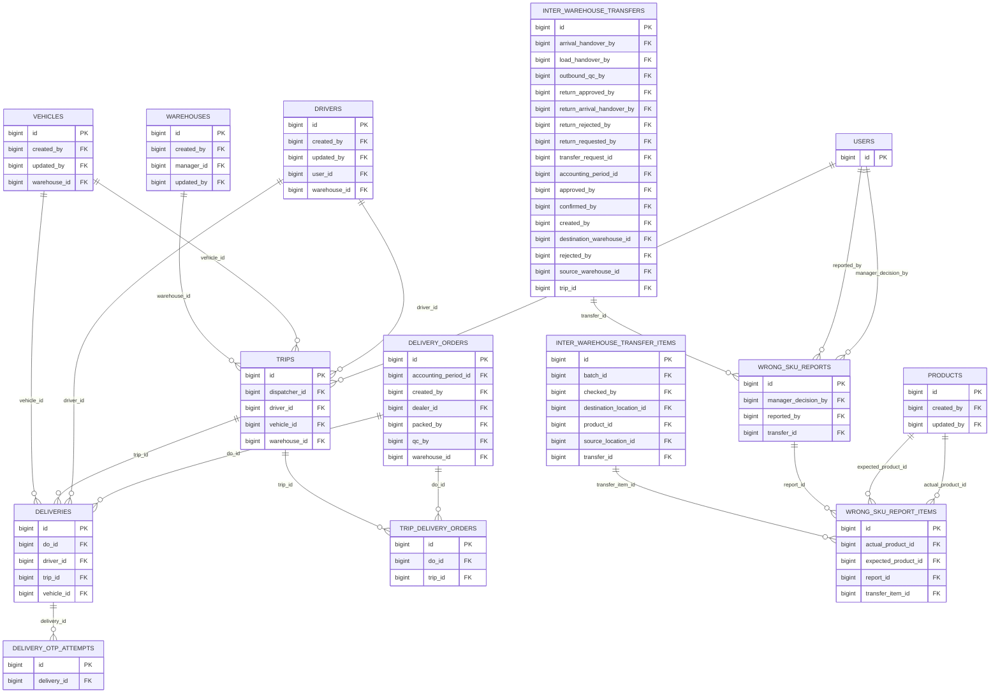
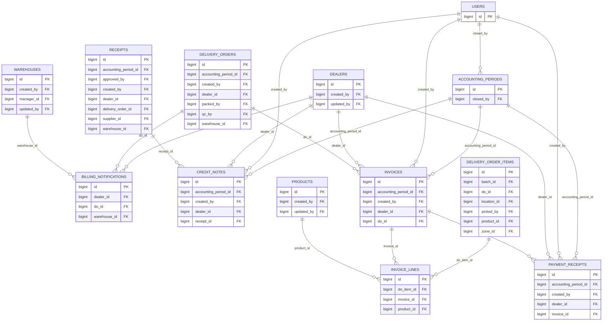
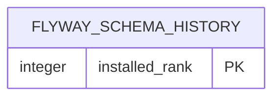

# VPS Database Relationship Atlas — WMS

> Diagram source is the same VPS constraint export as [VPS Database Schema Catalog](VPS-DATABASE-SCHEMA-CATALOG.md). The atlas deliberately uses **domain-sized ERDs**: one giant diagram for 56 tables/227 FK is unreadable. Every physical table appears as a child in exactly one section; every FK emitted under that child is an actual production constraint.

## Reading rules

- `PARENT ||--o{ CHILD` means one parent row can be referenced by zero or many child rows. Nullable FK is detailed in the catalog; it does not turn the parent-to-child relationship into mandatory existence.
- Attributes show the table PK and FK columns only, so the diagrams remain legible. The catalog lists all 746 columns, nullability and defaults.
- `flyway_schema_history` has no FK and is intentionally separated. Views are read-only projections and do not have physical FK constraints.

## 01 Security, configuration and master data

**Coverage:** `users`, `user_warehouse_assignments`, `warehouses`, `warehouse_locations`, `system_configs`, `document_sequences`, `audit_logs`, `notifications`, `products`, `suppliers`, `dealers`, `vehicles`, `drivers`. **FK shown:** 28.

## 02 Purchasing and inbound

**Coverage:** `purchase_orders`, `purchase_order_items`, `receipts`, `receipt_items`, `batches`, `quarantine_records`, `debit_notes`. **FK shown:** 33.

```mermaid
erDiagram
  PRODUCTS ||--o{ BATCHES : product_id
  WAREHOUSES ||--o{ BATCHES : warehouse_id
  ACCOUNTING_PERIODS ||--o{ DEBIT_NOTES : accounting_period_id
  USERS ||--o{ DEBIT_NOTES : created_by
  RECEIPTS ||--o{ DEBIT_NOTES : receipt_id
  SUPPLIERS ||--o{ DEBIT_NOTES : supplier_id
  PURCHASE_ORDERS ||--o{ PURCHASE_ORDER_ITEMS : po_id
  PRODUCTS ||--o{ PURCHASE_ORDER_ITEMS : product_id
  USERS ||--o{ PURCHASE_ORDERS : created_by
  SUPPLIERS ||--o{ PURCHASE_ORDERS : supplier_id
  WAREHOUSES ||--o{ PURCHASE_ORDERS : warehouse_id
  DELIVERY_ORDER_ITEM_ALLOCATIONS ||--o{ QUARANTINE_RECORDS : allocation_id
  BATCHES ||--o{ QUARANTINE_RECORDS : batch_id
  USERS ||--o{ QUARANTINE_RECORDS : created_by
  DELIVERY_ORDERS ||--o{ QUARANTINE_RECORDS : delivery_order_id
  DELIVERY_ORDER_ITEMS ||--o{ QUARANTINE_RECORDS : do_item_id
  WAREHOUSE_LOCATIONS ||--o{ QUARANTINE_RECORDS : location_id
  PRODUCTS ||--o{ QUARANTINE_RECORDS : product_id
  INTER_WAREHOUSE_TRANSFERS ||--o{ QUARANTINE_RECORDS : transfer_id
  INTER_WAREHOUSE_TRANSFER_ITEMS ||--o{ QUARANTINE_RECORDS : transfer_item_id
  WAREHOUSES ||--o{ QUARANTINE_RECORDS : warehouse_id
  BATCHES ||--o{ RECEIPT_ITEMS : batch_id
  WAREHOUSE_LOCATIONS ||--o{ RECEIPT_ITEMS : location_id
  PRODUCTS ||--o{ RECEIPT_ITEMS : product_id
  USERS ||--o{ RECEIPT_ITEMS : qc_by
  RECEIPTS ||--o{ RECEIPT_ITEMS : receipt_id
  ACCOUNTING_PERIODS ||--o{ RECEIPTS : accounting_period_id
  USERS ||--o{ RECEIPTS : approved_by
  USERS ||--o{ RECEIPTS : created_by
  DEALERS ||--o{ RECEIPTS : dealer_id
  DELIVERY_ORDERS ||--o{ RECEIPTS : delivery_order_id
  SUPPLIERS ||--o{ RECEIPTS : supplier_id
  WAREHOUSES ||--o{ RECEIPTS : warehouse_id
  ACCOUNTING_PERIODS {
    bigint id PK
    bigint closed_by FK
  }
  BATCHES {
    bigint id PK
    bigint product_id FK
    bigint warehouse_id FK
  }
  DEALERS {
    bigint id PK
    bigint created_by FK
    bigint updated_by FK
  }
  DEBIT_NOTES {
    bigint id PK
    bigint accounting_period_id FK
    bigint created_by FK
    bigint receipt_id FK
    bigint supplier_id FK
  }
  DELIVERY_ORDER_ITEM_ALLOCATIONS {
    bigint id PK
    bigint batch_id FK
    bigint created_by FK
    bigint do_item_id FK
    bigint inventory_id FK
    bigint location_id FK
    bigint replaced_allocation_id FK
    bigint zone_id FK
  }
  DELIVERY_ORDER_ITEMS {
    bigint id PK
    bigint batch_id FK
    bigint do_id FK
    bigint location_id FK
    bigint picked_by FK
    bigint product_id FK
    bigint zone_id FK
  }
  DELIVERY_ORDERS {
    bigint id PK
    bigint accounting_period_id FK
    bigint created_by FK
    bigint dealer_id FK
    bigint packed_by FK
    bigint qc_by FK
    bigint warehouse_id FK
  }
  INTER_WAREHOUSE_TRANSFER_ITEMS {
    bigint id PK
    bigint batch_id FK
    bigint checked_by FK
    bigint destination_location_id FK
    bigint product_id FK
    bigint source_location_id FK
    bigint transfer_id FK
  }
  INTER_WAREHOUSE_TRANSFERS {
    bigint id PK
    bigint arrival_handover_by FK
    bigint load_handover_by FK
    bigint outbound_qc_by FK
    bigint return_approved_by FK
    bigint return_arrival_handover_by FK
    bigint return_rejected_by FK
    bigint return_requested_by FK
    bigint transfer_request_id FK
    bigint accounting_period_id FK
    bigint approved_by FK
    bigint confirmed_by FK
    bigint created_by FK
    bigint destination_warehouse_id FK
    bigint rejected_by FK
    bigint source_warehouse_id FK
    bigint trip_id FK
  }
  PRODUCTS {
    bigint id PK
    bigint created_by FK
    bigint updated_by FK
  }
  PURCHASE_ORDER_ITEMS {
    bigint id PK
    bigint po_id FK
    bigint product_id FK
  }
  PURCHASE_ORDERS {
    bigint id PK
    bigint created_by FK
    bigint supplier_id FK
    bigint warehouse_id FK
  }
  QUARANTINE_RECORDS {
    bigint id PK
    bigint allocation_id FK
    bigint batch_id FK
    bigint created_by FK
    bigint delivery_order_id FK
    bigint do_item_id FK
    bigint location_id FK
    bigint product_id FK
    bigint transfer_id FK
    bigint transfer_item_id FK
    bigint warehouse_id FK
  }
  RECEIPT_ITEMS {
    bigint id PK
    bigint batch_id FK
    bigint location_id FK
    bigint product_id FK
    bigint qc_by FK
    bigint receipt_id FK
  }
  RECEIPTS {
    bigint id PK
    bigint accounting_period_id FK
    bigint approved_by FK
    bigint created_by FK
    bigint dealer_id FK
    bigint delivery_order_id FK
    bigint supplier_id FK
    bigint warehouse_id FK
  }
  SUPPLIERS {
    bigint id PK
    bigint created_by FK
    bigint updated_by FK
  }
  USERS {
    bigint id PK
  }
  WAREHOUSE_LOCATIONS {
    bigint id PK
    bigint locked_by_stock_take_id FK
    bigint created_by FK
    bigint parent_id FK
    bigint updated_by FK
    bigint warehouse_id FK
  }
  WAREHOUSES {
    bigint id PK
    bigint created_by FK
    bigint manager_id FK
    bigint updated_by FK
  }
```

## 03 Inventory and reservation

**Coverage:** `inventories`, `warehouse_product_reservations`, `stock_alerts`, `price_history`. **FK shown:** 13.

## 04 Outbound order and allocation

**Coverage:** `delivery_orders`, `delivery_order_items`, `delivery_order_approvals`, `delivery_order_warehouse_approvals`, `delivery_order_item_allocations`, `delivery_order_item_replacements`, `delivery_order_item_return_to_bin_records`, `outbound_qc_records`. **FK shown:** 49.

```mermaid
erDiagram
  USERS ||--o{ DELIVERY_ORDER_APPROVALS : approver_id
  DELIVERY_ORDERS ||--o{ DELIVERY_ORDER_APPROVALS : do_id
  BATCHES ||--o{ DELIVERY_ORDER_ITEM_ALLOCATIONS : batch_id
  USERS ||--o{ DELIVERY_ORDER_ITEM_ALLOCATIONS : created_by
  DELIVERY_ORDER_ITEMS ||--o{ DELIVERY_ORDER_ITEM_ALLOCATIONS : do_item_id
  INVENTORIES ||--o{ DELIVERY_ORDER_ITEM_ALLOCATIONS : inventory_id
  WAREHOUSE_LOCATIONS ||--o{ DELIVERY_ORDER_ITEM_ALLOCATIONS : location_id
  DELIVERY_ORDER_ITEM_ALLOCATIONS ||--o{ DELIVERY_ORDER_ITEM_ALLOCATIONS : replaced_allocation_id
  WAREHOUSE_LOCATIONS ||--o{ DELIVERY_ORDER_ITEM_ALLOCATIONS : zone_id
  USERS ||--o{ DELIVERY_ORDER_ITEM_REPLACEMENTS : created_by
  DELIVERY_ORDER_ITEMS ||--o{ DELIVERY_ORDER_ITEM_REPLACEMENTS : do_item_id
  BATCHES ||--o{ DELIVERY_ORDER_ITEM_REPLACEMENTS : failed_batch_id
  INVENTORIES ||--o{ DELIVERY_ORDER_ITEM_REPLACEMENTS : failed_inventory_id
  WAREHOUSE_LOCATIONS ||--o{ DELIVERY_ORDER_ITEM_REPLACEMENTS : failed_location_id
  BATCHES ||--o{ DELIVERY_ORDER_ITEM_REPLACEMENTS : replacement_batch_id
  INVENTORIES ||--o{ DELIVERY_ORDER_ITEM_REPLACEMENTS : replacement_inventory_id
  WAREHOUSE_LOCATIONS ||--o{ DELIVERY_ORDER_ITEM_REPLACEMENTS : replacement_location_id
  WAREHOUSE_LOCATIONS ||--o{ DELIVERY_ORDER_ITEM_RETURN_TO_BIN_RECORDS : original_location_id
  WAREHOUSE_LOCATIONS ||--o{ DELIVERY_ORDER_ITEM_RETURN_TO_BIN_RECORDS : source_location_id
  DELIVERY_ORDER_ITEM_ALLOCATIONS ||--o{ DELIVERY_ORDER_ITEM_RETURN_TO_BIN_RECORDS : allocation_id
  BATCHES ||--o{ DELIVERY_ORDER_ITEM_RETURN_TO_BIN_RECORDS : batch_id
  USERS ||--o{ DELIVERY_ORDER_ITEM_RETURN_TO_BIN_RECORDS : created_by
  DELIVERY_ORDER_ITEMS ||--o{ DELIVERY_ORDER_ITEM_RETURN_TO_BIN_RECORDS : do_item_id
  WAREHOUSE_LOCATIONS ||--o{ DELIVERY_ORDER_ITEM_RETURN_TO_BIN_RECORDS : original_zone_id
  PRODUCTS ||--o{ DELIVERY_ORDER_ITEM_RETURN_TO_BIN_RECORDS : product_id
  BATCHES ||--o{ DELIVERY_ORDER_ITEMS : batch_id
  DELIVERY_ORDERS ||--o{ DELIVERY_ORDER_ITEMS : do_id
  WAREHOUSE_LOCATIONS ||--o{ DELIVERY_ORDER_ITEMS : location_id
  USERS ||--o{ DELIVERY_ORDER_ITEMS : picked_by
  PRODUCTS ||--o{ DELIVERY_ORDER_ITEMS : product_id
  WAREHOUSE_LOCATIONS ||--o{ DELIVERY_ORDER_ITEMS : zone_id
  USERS ||--o{ DELIVERY_ORDER_WAREHOUSE_APPROVALS : approver_id
  DELIVERY_ORDERS ||--o{ DELIVERY_ORDER_WAREHOUSE_APPROVALS : do_id
  ACCOUNTING_PERIODS ||--o{ DELIVERY_ORDERS : accounting_period_id
  USERS ||--o{ DELIVERY_ORDERS : created_by
  DEALERS ||--o{ DELIVERY_ORDERS : dealer_id
  USERS ||--o{ DELIVERY_ORDERS : packed_by
  USERS ||--o{ DELIVERY_ORDERS : qc_by
  WAREHOUSES ||--o{ DELIVERY_ORDERS : warehouse_id
  DELIVERY_ORDER_ITEM_ALLOCATIONS ||--o{ OUTBOUND_QC_RECORDS : allocation_id
  BATCHES ||--o{ OUTBOUND_QC_RECORDS : batch_id
  USERS ||--o{ OUTBOUND_QC_RECORDS : created_by
  DELIVERY_ORDERS ||--o{ OUTBOUND_QC_RECORDS : do_id
  DELIVERY_ORDER_ITEMS ||--o{ OUTBOUND_QC_RECORDS : do_item_id
  WAREHOUSE_LOCATIONS ||--o{ OUTBOUND_QC_RECORDS : location_id
  WAREHOUSE_LOCATIONS ||--o{ OUTBOUND_QC_RECORDS : quarantine_location_id
  QUARANTINE_RECORDS ||--o{ OUTBOUND_QC_RECORDS : quarantine_record_id
  WAREHOUSE_LOCATIONS ||--o{ OUTBOUND_QC_RECORDS : staging_location_id
  WAREHOUSE_LOCATIONS ||--o{ OUTBOUND_QC_RECORDS : zone_id
  ACCOUNTING_PERIODS {
    bigint id PK
    bigint closed_by FK
  }
  BATCHES {
    bigint id PK
    bigint product_id FK
    bigint warehouse_id FK
  }
  DEALERS {
    bigint id PK
    bigint created_by FK
    bigint updated_by FK
  }
  DELIVERY_ORDER_APPROVALS {
    bigint id PK
    bigint approver_id FK
    bigint do_id FK
  }
  DELIVERY_ORDER_ITEM_ALLOCATIONS {
    bigint id PK
    bigint batch_id FK
    bigint created_by FK
    bigint do_item_id FK
    bigint inventory_id FK
    bigint location_id FK
    bigint replaced_allocation_id FK
    bigint zone_id FK
  }
  DELIVERY_ORDER_ITEM_REPLACEMENTS {
    bigint id PK
    bigint created_by FK
    bigint do_item_id FK
    bigint failed_batch_id FK
    bigint failed_inventory_id FK
    bigint failed_location_id FK
    bigint replacement_batch_id FK
    bigint replacement_inventory_id FK
    bigint replacement_location_id FK
  }
  DELIVERY_ORDER_ITEM_RETURN_TO_BIN_RECORDS {
    bigint id PK
    bigint original_location_id FK
    bigint source_location_id FK
    bigint allocation_id FK
    bigint batch_id FK
    bigint created_by FK
    bigint do_item_id FK
    bigint original_zone_id FK
    bigint product_id FK
  }
  DELIVERY_ORDER_ITEMS {
    bigint id PK
    bigint batch_id FK
    bigint do_id FK
    bigint location_id FK
    bigint picked_by FK
    bigint product_id FK
    bigint zone_id FK
  }
  DELIVERY_ORDER_WAREHOUSE_APPROVALS {
    bigint id PK
    bigint approver_id FK
    bigint do_id FK
  }
  DELIVERY_ORDERS {
    bigint id PK
    bigint accounting_period_id FK
    bigint created_by FK
    bigint dealer_id FK
    bigint packed_by FK
    bigint qc_by FK
    bigint warehouse_id FK
  }
  INVENTORIES {
    bigint id PK
    bigint batch_id FK
    bigint location_id FK
    bigint product_id FK
    bigint warehouse_id FK
  }
  OUTBOUND_QC_RECORDS {
    bigint id PK
    bigint allocation_id FK
    bigint batch_id FK
    bigint created_by FK
    bigint do_id FK
    bigint do_item_id FK
    bigint location_id FK
    bigint quarantine_location_id FK
    bigint quarantine_record_id FK
    bigint staging_location_id FK
    bigint zone_id FK
  }
  PRODUCTS {
    bigint id PK
    bigint created_by FK
    bigint updated_by FK
  }
  QUARANTINE_RECORDS {
    bigint id PK
    bigint allocation_id FK
    bigint batch_id FK
    bigint created_by FK
    bigint delivery_order_id FK
    bigint do_item_id FK
    bigint location_id FK
    bigint product_id FK
    bigint transfer_id FK
    bigint transfer_item_id FK
    bigint warehouse_id FK
  }
  USERS {
    bigint id PK
  }
  WAREHOUSE_LOCATIONS {
    bigint id PK
    bigint locked_by_stock_take_id FK
    bigint created_by FK
    bigint parent_id FK
    bigint updated_by FK
    bigint warehouse_id FK
  }
  WAREHOUSES {
    bigint id PK
    bigint created_by FK
    bigint manager_id FK
    bigint updated_by FK
  }
```

## 05 Delivery execution

**Coverage:** `trips`, `trip_delivery_orders`, `deliveries`, `delivery_otp_attempts`, `wrong_sku_reports`, `wrong_sku_report_items`. **FK shown:** 18.

## 06 Transfer planning and execution

**Coverage:** `transfer_requests`, `transfer_request_items`, `inter_warehouse_transfers`, `inter_warehouse_transfer_items`, `inter_warehouse_transfer_allocations`, `discrepancy_incidents`, `discrepancy_hold_entries`. **FK shown:** 42.

```mermaid
erDiagram
  BATCHES ||--o{ DISCREPANCY_HOLD_ENTRIES : batch_id
  WAREHOUSE_LOCATIONS ||--o{ DISCREPANCY_HOLD_ENTRIES : hold_location_id
  DISCREPANCY_INCIDENTS ||--o{ DISCREPANCY_HOLD_ENTRIES : incident_id
  PRODUCTS ||--o{ DISCREPANCY_HOLD_ENTRIES : product_id
  WAREHOUSES ||--o{ DISCREPANCY_HOLD_ENTRIES : warehouse_id
  PRODUCTS ||--o{ DISCREPANCY_INCIDENTS : product_id
  USERS ||--o{ DISCREPANCY_INCIDENTS : resolved_by
  INTER_WAREHOUSE_TRANSFERS ||--o{ DISCREPANCY_INCIDENTS : transfer_id
  INVENTORIES ||--o{ INTER_WAREHOUSE_TRANSFER_ALLOCATIONS : inventory_id
  INTER_WAREHOUSE_TRANSFER_ITEMS ||--o{ INTER_WAREHOUSE_TRANSFER_ALLOCATIONS : transfer_item_id
  BATCHES ||--o{ INTER_WAREHOUSE_TRANSFER_ITEMS : batch_id
  USERS ||--o{ INTER_WAREHOUSE_TRANSFER_ITEMS : checked_by
  WAREHOUSE_LOCATIONS ||--o{ INTER_WAREHOUSE_TRANSFER_ITEMS : destination_location_id
  PRODUCTS ||--o{ INTER_WAREHOUSE_TRANSFER_ITEMS : product_id
  WAREHOUSE_LOCATIONS ||--o{ INTER_WAREHOUSE_TRANSFER_ITEMS : source_location_id
  INTER_WAREHOUSE_TRANSFERS ||--o{ INTER_WAREHOUSE_TRANSFER_ITEMS : transfer_id
  USERS ||--o{ INTER_WAREHOUSE_TRANSFERS : arrival_handover_by
  USERS ||--o{ INTER_WAREHOUSE_TRANSFERS : load_handover_by
  USERS ||--o{ INTER_WAREHOUSE_TRANSFERS : outbound_qc_by
  USERS ||--o{ INTER_WAREHOUSE_TRANSFERS : return_approved_by
  USERS ||--o{ INTER_WAREHOUSE_TRANSFERS : return_arrival_handover_by
  USERS ||--o{ INTER_WAREHOUSE_TRANSFERS : return_rejected_by
  USERS ||--o{ INTER_WAREHOUSE_TRANSFERS : return_requested_by
  TRANSFER_REQUESTS ||--o{ INTER_WAREHOUSE_TRANSFERS : transfer_request_id
  ACCOUNTING_PERIODS ||--o{ INTER_WAREHOUSE_TRANSFERS : accounting_period_id
  USERS ||--o{ INTER_WAREHOUSE_TRANSFERS : approved_by
  USERS ||--o{ INTER_WAREHOUSE_TRANSFERS : confirmed_by
  USERS ||--o{ INTER_WAREHOUSE_TRANSFERS : created_by
  WAREHOUSES ||--o{ INTER_WAREHOUSE_TRANSFERS : destination_warehouse_id
  USERS ||--o{ INTER_WAREHOUSE_TRANSFERS : rejected_by
  WAREHOUSES ||--o{ INTER_WAREHOUSE_TRANSFERS : source_warehouse_id
  TRIPS ||--o{ INTER_WAREHOUSE_TRANSFERS : trip_id
  PRODUCTS ||--o{ TRANSFER_REQUEST_ITEMS : product_id
  TRANSFER_REQUESTS ||--o{ TRANSFER_REQUEST_ITEMS : transfer_request_id
  USERS ||--o{ TRANSFER_REQUESTS : approved_by
  USERS ||--o{ TRANSFER_REQUESTS : converted_by
  INTER_WAREHOUSE_TRANSFERS ||--o{ TRANSFER_REQUESTS : converted_transfer_id
  USERS ||--o{ TRANSFER_REQUESTS : created_by
  WAREHOUSES ||--o{ TRANSFER_REQUESTS : destination_warehouse_id
  USERS ||--o{ TRANSFER_REQUESTS : rejected_by
  WAREHOUSES ||--o{ TRANSFER_REQUESTS : source_warehouse_id
  USERS ||--o{ TRANSFER_REQUESTS : submitted_by
  ACCOUNTING_PERIODS {
    bigint id PK
    bigint closed_by FK
  }
  BATCHES {
    bigint id PK
    bigint product_id FK
    bigint warehouse_id FK
  }
  DISCREPANCY_HOLD_ENTRIES {
    bigint id PK
    bigint batch_id FK
    bigint hold_location_id FK
    bigint incident_id FK
    bigint product_id FK
    bigint warehouse_id FK
  }
  DISCREPANCY_INCIDENTS {
    bigint id PK
    bigint product_id FK
    bigint resolved_by FK
    bigint transfer_id FK
  }
  INTER_WAREHOUSE_TRANSFER_ALLOCATIONS {
    bigint id PK
    bigint inventory_id FK
    bigint transfer_item_id FK
  }
  INTER_WAREHOUSE_TRANSFER_ITEMS {
    bigint id PK
    bigint batch_id FK
    bigint checked_by FK
    bigint destination_location_id FK
    bigint product_id FK
    bigint source_location_id FK
    bigint transfer_id FK
  }
  INTER_WAREHOUSE_TRANSFERS {
    bigint id PK
    bigint arrival_handover_by FK
    bigint load_handover_by FK
    bigint outbound_qc_by FK
    bigint return_approved_by FK
    bigint return_arrival_handover_by FK
    bigint return_rejected_by FK
    bigint return_requested_by FK
    bigint transfer_request_id FK
    bigint accounting_period_id FK
    bigint approved_by FK
    bigint confirmed_by FK
    bigint created_by FK
    bigint destination_warehouse_id FK
    bigint rejected_by FK
    bigint source_warehouse_id FK
    bigint trip_id FK
  }
  INVENTORIES {
    bigint id PK
    bigint batch_id FK
    bigint location_id FK
    bigint product_id FK
    bigint warehouse_id FK
  }
  PRODUCTS {
    bigint id PK
    bigint created_by FK
    bigint updated_by FK
  }
  TRANSFER_REQUEST_ITEMS {
    bigint id PK
    bigint product_id FK
    bigint transfer_request_id FK
  }
  TRANSFER_REQUESTS {
    bigint id PK
    bigint approved_by FK
    bigint converted_by FK
    bigint converted_transfer_id FK
    bigint created_by FK
    bigint destination_warehouse_id FK
    bigint rejected_by FK
    bigint source_warehouse_id FK
    bigint submitted_by FK
  }
  TRIPS {
    bigint id PK
    bigint dispatcher_id FK
    bigint driver_id FK
    bigint vehicle_id FK
    bigint warehouse_id FK
  }
  USERS {
    bigint id PK
  }
  WAREHOUSE_LOCATIONS {
    bigint id PK
    bigint locked_by_stock_take_id FK
    bigint created_by FK
    bigint parent_id FK
    bigint updated_by FK
    bigint warehouse_id FK
  }
  WAREHOUSES {
    bigint id PK
    bigint created_by FK
    bigint manager_id FK
    bigint updated_by FK
  }
```

## 07 Stocktake, adjustment and damage

**Coverage:** `stock_takes`, `stock_take_items`, `adjustments`, `damage_reports`. **FK shown:** 25.

```mermaid
erDiagram
  ACCOUNTING_PERIODS ||--o{ ADJUSTMENTS : accounting_period_id
  DELIVERY_ORDER_ITEM_ALLOCATIONS ||--o{ ADJUSTMENTS : allocation_id
  USERS ||--o{ ADJUSTMENTS : approved_by
  BATCHES ||--o{ ADJUSTMENTS : batch_id
  USERS ||--o{ ADJUSTMENTS : created_by
  DELIVERY_ORDERS ||--o{ ADJUSTMENTS : delivery_order_id
  DELIVERY_ORDER_ITEMS ||--o{ ADJUSTMENTS : do_item_id
  WAREHOUSE_LOCATIONS ||--o{ ADJUSTMENTS : location_id
  OUTBOUND_QC_RECORDS ||--o{ ADJUSTMENTS : outbound_qc_record_id
  PRODUCTS ||--o{ ADJUSTMENTS : product_id
  QUARANTINE_RECORDS ||--o{ ADJUSTMENTS : quarantine_record_id
  WAREHOUSES ||--o{ ADJUSTMENTS : warehouse_id
  BATCHES ||--o{ DAMAGE_REPORTS : batch_id
  PRODUCTS ||--o{ DAMAGE_REPORTS : product_id
  RECEIPT_ITEMS ||--o{ DAMAGE_REPORTS : receipt_item_id
  USERS ||--o{ DAMAGE_REPORTS : reported_by
  WAREHOUSES ||--o{ DAMAGE_REPORTS : warehouse_id
  BATCHES ||--o{ STOCK_TAKE_ITEMS : batch_id
  WAREHOUSE_LOCATIONS ||--o{ STOCK_TAKE_ITEMS : location_id
  PRODUCTS ||--o{ STOCK_TAKE_ITEMS : product_id
  STOCK_TAKES ||--o{ STOCK_TAKE_ITEMS : stock_take_id
  ACCOUNTING_PERIODS ||--o{ STOCK_TAKES : accounting_period_id
  USERS ||--o{ STOCK_TAKES : approved_by
  USERS ||--o{ STOCK_TAKES : conducted_by
  WAREHOUSES ||--o{ STOCK_TAKES : warehouse_id
  ACCOUNTING_PERIODS {
    bigint id PK
    bigint closed_by FK
  }
  ADJUSTMENTS {
    bigint id PK
    bigint accounting_period_id FK
    bigint allocation_id FK
    bigint approved_by FK
    bigint batch_id FK
    bigint created_by FK
    bigint delivery_order_id FK
    bigint do_item_id FK
    bigint location_id FK
    bigint outbound_qc_record_id FK
    bigint product_id FK
    bigint quarantine_record_id FK
    bigint warehouse_id FK
  }
  BATCHES {
    bigint id PK
    bigint product_id FK
    bigint warehouse_id FK
  }
  DAMAGE_REPORTS {
    bigint id PK
    bigint batch_id FK
    bigint product_id FK
    bigint receipt_item_id FK
    bigint reported_by FK
    bigint warehouse_id FK
  }
  DELIVERY_ORDER_ITEM_ALLOCATIONS {
    bigint id PK
    bigint batch_id FK
    bigint created_by FK
    bigint do_item_id FK
    bigint inventory_id FK
    bigint location_id FK
    bigint replaced_allocation_id FK
    bigint zone_id FK
  }
  DELIVERY_ORDER_ITEMS {
    bigint id PK
    bigint batch_id FK
    bigint do_id FK
    bigint location_id FK
    bigint picked_by FK
    bigint product_id FK
    bigint zone_id FK
  }
  DELIVERY_ORDERS {
    bigint id PK
    bigint accounting_period_id FK
    bigint created_by FK
    bigint dealer_id FK
    bigint packed_by FK
    bigint qc_by FK
    bigint warehouse_id FK
  }
  OUTBOUND_QC_RECORDS {
    bigint id PK
    bigint allocation_id FK
    bigint batch_id FK
    bigint created_by FK
    bigint do_id FK
    bigint do_item_id FK
    bigint location_id FK
    bigint quarantine_location_id FK
    bigint quarantine_record_id FK
    bigint staging_location_id FK
    bigint zone_id FK
  }
  PRODUCTS {
    bigint id PK
    bigint created_by FK
    bigint updated_by FK
  }
  QUARANTINE_RECORDS {
    bigint id PK
    bigint allocation_id FK
    bigint batch_id FK
    bigint created_by FK
    bigint delivery_order_id FK
    bigint do_item_id FK
    bigint location_id FK
    bigint product_id FK
    bigint transfer_id FK
    bigint transfer_item_id FK
    bigint warehouse_id FK
  }
  RECEIPT_ITEMS {
    bigint id PK
    bigint batch_id FK
    bigint location_id FK
    bigint product_id FK
    bigint qc_by FK
    bigint receipt_id FK
  }
  STOCK_TAKE_ITEMS {
    bigint id PK
    bigint batch_id FK
    bigint location_id FK
    bigint product_id FK
    bigint stock_take_id FK
  }
  STOCK_TAKES {
    bigint id PK
    bigint accounting_period_id FK
    bigint approved_by FK
    bigint conducted_by FK
    bigint warehouse_id FK
  }
  USERS {
    bigint id PK
  }
  WAREHOUSE_LOCATIONS {
    bigint id PK
    bigint locked_by_stock_take_id FK
    bigint created_by FK
    bigint parent_id FK
    bigint updated_by FK
    bigint warehouse_id FK
  }
  WAREHOUSES {
    bigint id PK
    bigint created_by FK
    bigint manager_id FK
    bigint updated_by FK
  }
```

## 08 Finance and period close

**Coverage:** `invoices`, `invoice_lines`, `payment_receipts`, `credit_notes`, `billing_notifications`, `accounting_periods`. **FK shown:** 19.

## 09 System migration record

**Coverage:** `flyway_schema_history`. **FK shown:** 0.

## Coverage validation

- FK constraints emitted: **227 / 227**.
- Physical tables in child groups: **56 / 56**.
- Views `v_inventory_by_batch`, `v_inventory_summary`, `v_low_stock_alerts` are listed in the catalog and intentionally excluded from FK ERDs.
