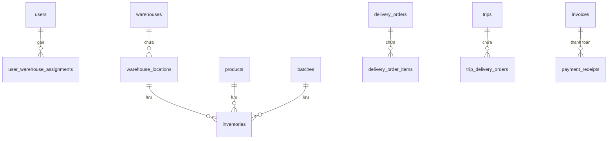

# Tài Liệu Đặc Tả & Hướng Dẫn Sử Dụng Database WMS Phúc Anh

> **Đồng bộ:** 2026-07-19 · **Đã đối chiếu VPS production:** PostgreSQL container `wms-prod-db-1` · **Nguồn schema triển khai:** `backend/src/main/resources/db/migration/` · **Nguồn nghiệp vụ:** `.sdd/specs/001`–`010`. Flyway migration là nguồn cuối cùng khi tài liệu và database khác nhau.

> **Schema cleanup:** Domain chuẩn không quản lý serial, expiry hay quality grade. Migration `V17__remove_serial_expiry_grade_legacy_fields.sql` loại bỏ các cột legacy `products.has_expiry`, `products.shelf_life_days`, `products.has_serial`, `batches.expiry_date`, `batches.grade`, và các `serial_number`/`grade` line-item không còn dùng.

Migration hiện định nghĩa **55 bảng WMS** (sau rename V2 vẫn là một bảng transfer, không phải hai) và Flyway tạo thêm bảng kỹ thuật `flyway_schema_history`; VPS cần có **56 bảng trong `public`** khi toàn bộ migration thành công. Tài liệu này giải thích cấu trúc, quan hệ và quy tắc sử dụng của các bảng nghiệp vụ; các bảng hardening được liệt kê riêng ở phần hỗ trợ.

---

## MỤC LỤC

1. [Tổng Quan Sơ Đồ Database (Database Architecture)](#1-tổng-quan-sơ-đồ-database)
2. [Nhóm 1: Xác Thực & Phân Quyền (Users & Authorization)](#nhóm-1-xác-thực--phân-quyền)
3. [Nhóm 2: Kho Bãi & Sơ Đồ Kệ (Warehouses & Locations)](#nhóm-2-kho-bãi--sơ-đồ-kệ)
4. [Nhóm 3: Danh Mục Đối Tác & Tài Sản (Master Data)](#nhóm-3-danh-mục-đối-tác--tài-sản)
5. [Nhóm 4: Giá Cả & Kỳ Kế Toán (Pricing & Accounting Period)](#nhóm-4-giá-cả--kỳ-kế-toán)
6. [Nhóm 5: Quản Lý Lô Hàng & Tồn Kho (Batches & Inventories)](#nhóm-5-quản-lý-lô-hàng--tồn-kho)
7. [Nhóm 6: Nghiệp Vụ Nhập Kho (Inbound Operations)](#nhóm-6-nghiệp-vụ-nhập-kho)
8. [Nhóm 7: Nghiệp Vụ Xuất Kho (Outbound Operations)](#nhóm-7-nghiệp-vụ-xuất-kho)
9. [Nhóm 8: Vận Tải & Giao Hàng POD (Transport & Delivery)](#nhóm-8-vận-tải--giao-hàng-pod)
10. [Nhóm 9: Điều Chuyển Kho Nội Bộ (Inter-Warehouse Transfer)](#nhóm-9-điều-chuyển-kho-nội-bộ)
11. [Nhóm 10: Kiểm Kê & Điều Chỉnh Tồn Kho (Stocktake & Adjustments)](#nhóm-10-kiểm-kê--điều-chỉnh-tồn-kho)
12. [Nhóm 11: Tài Chính & Công Nợ Đại Lý (Billing & Debt Management)](#nhóm-11-tài-chính--công-nợ-đại-lý)
13. [Nhóm 12: Cấu Hình Hệ Thống & Nhật Ký Bảo Mật (Configs & Audit Logs)](#nhóm-12-cấu-hình-hệ-thống--nhật-ký-bảo-mật)
14. [Cơ Chế Nghiệp Vụ Tự Động & FIFO](#cơ-chế-nghiệp-vụ-tự-động--fifo)

---

## 1. TỔNG QUAN SƠ ĐỒ DATABASE

Cơ sở dữ liệu WMS Phúc Anh được thiết kế nhằm đáp ứng quy trình vận hành khép kín từ lập kế hoạch nhập/xuất, kiểm tra chất lượng (QC), phân bổ cất hàng theo sức chứa (Putaway), chọn hàng xuất theo FIFO cho domain đồ gia dụng không hạn sử dụng, điều chuyển kho trung chuyển cho đến giao nhận POD bằng xe tải nội bộ và thanh toán/kiểm soát công nợ đại lý.



---

## NHÓM 1: XÁC THỰC & PHÂN QUYỀN

### 1. Bảng `users`

- **Công dụng:** Lưu trữ thông tin tài khoản người dùng của toàn bộ nhân sự công ty và các lái xe, quản lý đăng nhập và phân quyền (RBAC) chặt chẽ.
- **Chi tiết các trường:**
  - `id` (BIGSERIAL, PK): Mã số định danh tự tăng.
  - `code` (VARCHAR(50), UNIQUE, NOT NULL): Mã nhân viên (ví dụ: `NV001`).
  - `full_name` (VARCHAR(255), NOT NULL): Họ và tên đầy đủ.
  - `email` (VARCHAR(255), UNIQUE, NOT NULL): Địa chỉ email (dùng để đăng nhập).
  - `phone` (VARCHAR(20), Nullable): Số điện thoại liên hệ.
  - `password_hash` (VARCHAR(255), NOT NULL): Mật khẩu đã được mã hóa bằng thuật toán `bcrypt` (cost ≥ 12).
  - `role` (VARCHAR(50), NOT NULL): Vai trò hệ thống. Ràng buộc bởi CHECK constraint: `ADMIN`, `CEO`, `WAREHOUSE_MANAGER` (Trưởng kho), `STOREKEEPER` (Thủ kho kiêm QC), `WAREHOUSE_STAFF` (Nhân viên bốc xếp), `ACCOUNTANT` (Kế toán), `ACCOUNTANT_MANAGER` (Kế toán trưởng), `PLANNER` (Điều phối đơn), `DISPATCHER` (Điều phối xe), `DRIVER` (Tài xế).
  - `is_active` (BOOLEAN, DEFAULT true): Trạng thái hoạt động (cho phép soft-delete khóa tài khoản).
  - `refresh_token_hash` & `otp_hash` (VARCHAR(255)): Token làm mới phiên đăng nhập và mã OTP xác minh qua email.
- **Ví dụ thực tế:**
  ```json
  {
    "id": 10,
    "code": "TX-05",
    "full_name": "Nguyễn Văn Bình",
    "email": "binh.nv@phucanh.vn",
    "role": "DRIVER",
    "is_active": true
  }
  ```

### 2. Bảng `user_warehouse_assignments`

- **Công dụng:** Phân công nhân viên phụ trách tại các kho vật lý khác nhau. Một nhân sự có thể làm việc tại nhiều kho.
- **Chi tiết các trường:**
  - `user_id` (BIGINT, FK -> users): ID người dùng được phân công.
  - `warehouse_id` (BIGINT, FK -> warehouses): ID kho được chỉ định.
  - `assigned_at` (TIMESTAMPTZ): Thời điểm phân công.
- **Ví dụ thực tế:** Nhân viên Thủ kho có `user_id = 5` được gán làm việc tại Kho Hải Phòng (`warehouse_id = 1`).

---

## NHÓM 2: KHO BÃI & SƠ ĐỒ KỆ

### 3. Bảng `warehouses`

- **Công dụng:** Quản lý danh mục các kho hàng của công ty, bao gồm 3 kho vật lý và 1 kho ảo trung chuyển `IN_TRANSIT`.
- **Chi tiết các trường:**
  - `code` (VARCHAR(20), UNIQUE): Mã viết tắt của kho (ví dụ: `WH-HP`, `WH-HN`, `WH-HCM`, `IN_TRANSIT`).
  - `name` (VARCHAR(255)): Tên đầy đủ của kho.
  - `type` (VARCHAR(20)): Phân loại kho. CHECK: `PHYSICAL` (Kho vật lý thực tế), `IN_TRANSIT` (Kho ảo đại diện cho hàng đang đi trên xe vận chuyển).
  - `manager_id` (BIGINT, FK -> users): ID của Trưởng kho chịu trách nhiệm phê duyệt.
- **Ví dụ thực tế:**
  ```json
  {
    "id": 1,
    "code": "WH-HP",
    "name": "Kho Hải Phòng",
    "type": "PHYSICAL",
    "manager_id": 3
  }
  ```

### 4. Bảng `warehouse_locations`

- **Công dụng:** Cấu hình sơ đồ kệ lưu trữ trong kho theo cấu trúc phân cấp ZONE -> BIN.
- **Chi tiết các trường:**
  - `warehouse_id` (BIGINT, FK -> warehouses): Vị trí này thuộc kho nào.
  - `code` (VARCHAR(50), UNIQUE): Mã định danh toàn hệ thống (Được tự động sinh dạng `{warehouse_code}.{zone}.{bin}`).
  - `type` (VARCHAR(10)): CHECK: `ZONE` (Phân khu lớn, ví dụ Khu A, Khu B) hoặc `BIN` (Ô/Kệ chứa hàng thực tế).
  - `parent_id` (BIGINT, FK -> warehouse_locations): Trỏ tới Zone cha. Nếu là Zone thì trường này để `NULL`.
  - `capacity_m3` & `capacity_kg` (DECIMAL): Giới hạn thể tích (m3) và tải trọng (kg) tối đa của ô kệ (chỉ áp dụng cho loại `BIN`).
  - `current_volume_m3` & `current_weight_kg` (DECIMAL): Thể tích và khối lượng hàng hiện tại trong ô kệ, được service putaway duy trì trong cùng transaction.
  - `is_quarantine` (BOOLEAN, DEFAULT false): Cờ đánh dấu vị trí cách ly (Quarantine Zone/Bin) để giữ hàng lỗi QC hoặc hàng hoàn trả.
- **Ví dụ thực tế:**
  - Bản ghi 1 (Khu vực): `id = 10`, `type = "ZONE"`, `code = "WH-HP.A"`, `parent_id = NULL`.
  - Bản ghi 2 (Ô kệ): `id = 11`, `type = "BIN"`, `code = "WH-HP.A.01.1.01"`, `parent_id = 10`, `capacity_kg = 500.0`.

---

## NHÓM 3: DANH MỤC ĐỐI TÁC & TÀI SẢN (MASTER DATA)

### 5. Bảng `products`

- **Công dụng:** Định nghĩa thông tin nền tảng của hàng hóa/sản phẩm (SKU).
- **Chi tiết các trường:**
  - `sku` (VARCHAR(50), UNIQUE): Mã định danh sản phẩm duy nhất (ví dụ: `IP15PM-128`).
  - `name` (VARCHAR(255)): Tên sản phẩm.
  - `unit` (VARCHAR(30)): Đơn vị tính cơ bản (ví dụ: `cái`, `hộp`).
  - `unit_per_pack` (INTEGER): Quy đổi đóng gói cố định (ví dụ: 1 thùng = 24 cái).
  - `weight_kg` & `volume_m3` (DECIMAL): Khối lượng và thể tích của 1 đơn vị sản phẩm (dùng để tính toán tải trọng vận chuyển và sức chứa kệ tự động).
  - Domain hiện tại không quản lý hạn sử dụng hoặc Serial Number cho sản phẩm.
  - `reorder_point` (DECIMAL): Ngưỡng tồn kho tối thiểu. Nếu tồn kho dưới mức này, hệ thống sẽ tự động kích hoạt cảnh báo tồn kho thấp.
- **Ví dụ thực tế:**
  ```json
  {
    "id": 1,
    "sku": "NOI-IN-24",
    "name": "Nồi inox 24cm",
    "unit": "cái",
    "weight_kg": 1.2,
    "volume_m3": 0.018,
    "reorder_point": 50.0
  }
  ```

### 6. Bảng `dealers`

- **Công dụng:** Quản lý danh mục Đại lý (Khách hàng) và các chính sách công nợ giới hạn (Credit Limit).
- **Chi tiết các trường:**
  - `code` (VARCHAR(50), UNIQUE): Mã đại lý (ví dụ: `DL-HN-01`).
  - `name` (VARCHAR(255)): Tên đại lý.
  - `credit_limit` (DECIMAL): Hạn mức nợ tối đa cho phép mua hàng trả chậm (ví dụ: 100,000,000 VNĐ).
  - `current_balance` (DECIMAL): Số dư công nợ hiện tại đại lý đang nợ công ty.
  - `credit_status` (VARCHAR(20)): CHECK: `ACTIVE` hoặc `CREDIT_HOLD` (khóa giao dịch nợ nếu đại lý vượt quá hạn mức nợ hoặc quá hạn thanh toán).
- **Ví dụ thực tế:** Đại lý A có Hạn mức nợ `100tr`, hiện tại đang nợ `90tr`. Nếu tạo đơn hàng mới trị giá `15tr`, hệ thống sẽ chặn vì tổng nợ vượt quá hạn mức.

### 7. Bảng `suppliers`

- **Công dụng:** Danh mục Nhà cung cấp phục vụ quy trình mua hàng nhập kho (Inbound PO).
- **Chi tiết các trường:** Mã nhà cung cấp (`code`), tên công ty (`company_name`), mã số thuế (`tax_code`), thông tin người đại diện (`contact_person`), số điện thoại, địa chỉ.

### 8. Bảng `vehicles`

- **Công dụng:** Quản lý đội xe tải nội bộ của công ty phục vụ điều phối giao hàng và chuyển kho.
- **Chi tiết các trường:**
  - `plate_number` (VARCHAR(20), UNIQUE): Biển kiểm soát xe (ví dụ: `29C-123.45`).
  - `warehouse_id` (BIGINT, FK -> warehouses): Kho vật lý được gán cho xe; chỉ được chọn cho trip thuộc cùng kho.
  - `vehicle_type` (VARCHAR(100)): Loại xe (ví dụ: "Xe tải Tấn rưỡi Suzuki").
  - `max_weight_kg` (DECIMAL): Tải trọng tối đa của xe (kiểm soát quá tải).
  - `max_volume_m3` (DECIMAL, Nullable): Thể tích lòng thùng xe (kiểm soát quá khổ). Thùng lửng có thể để trống.
  - `status` (VARCHAR(20)): Trạng thái hoạt động. CHECK: `AVAILABLE` (sẵn sàng), `ON_TRIP` (đang đi chuyến), `MAINTENANCE` (đang bảo trì).

### 9. Bảng `drivers`

- **Công dụng:** Quản lý danh sách tài xế vận chuyển và liên kết tài khoản app di động để làm chứng từ giao hàng (POD).
- **Chi tiết các trường:**
  - `user_id` (BIGINT, FK -> users, UNIQUE): Tài khoản đăng nhập hệ thống của tài xế.
  - `warehouse_id` (BIGINT, FK -> warehouses): Kho vật lý được gán cho tài xế; chỉ được chọn cho trip thuộc cùng kho.
  - `license_expiry` (DATE): Ngày hết hạn của giấy phép lái xe (Nếu hết hạn, hệ thống tự động khóa trạng thái phân chuyến).
  - `status` (VARCHAR(20)): CHECK: `AVAILABLE`, `ON_TRIP`, `UNAVAILABLE` (nghỉ ốm/nghỉ phép).

---

## NHÓM 4: GIÁ CẢ & KỲ KẾ TOÁN

### 10. Bảng `accounting_periods`

- **Công dụng:** Quản lý các kỳ khóa sổ kế toán hàng tháng. Giao dịch kho chỉ được ghi nhận vào kỳ kế toán đang mở (`OPEN`).
- **Chi tiết các trường:**
  - `period_name` (VARCHAR(20), UNIQUE): Tên kỳ theo định dạng `YYYY-MM` (ví dụ: `2026-05`).
  - `status` (VARCHAR(10)): CHECK: `OPEN` (Đang mở giao dịch) hoặc `CLOSED` (Đã khóa sổ, cấm sửa đổi dữ liệu quá khứ).

### 11. Bảng `price_history`

- **Công dụng:** Quản lý lịch sử thay đổi giá mua (giá vốn `cost_price`) và giá bán (`selling_price`) của từng SKU. Giá bán phải được phê duyệt trước khi có hiệu lực.
- **Chi tiết các trường:** `effective_date` (ngày hiệu lực), `status`, `approved_by` (ID Kế toán trưởng phê duyệt). `end_date` **không tồn tại** trên VPS từ migration V6; giá có hiệu lực được chọn theo bản ghi `ACTIVE` mới nhất có `effective_date <= ngày nghiệp vụ`.

---

## NHÓM 5: QUẢN LÝ LÔ HÀNG & TỒN KHO

### 12. Bảng `batches`

- **Công dụng:** Quản lý nguồn gốc lô hàng để chọn FIFO theo `received_date`; không phân hạng chất lượng trong domain.
- **Chi tiết các trường:**
  - `batch_number` (VARCHAR(100), UNIQUE): Số lô duy nhất (ví dụ: `LOT-TH-20260601`).
  - `product_id` (BIGINT, FK -> products): SKU của sản phẩm thuộc lô này.
  - `received_date` (DATE): Ngày nhập lô hàng về kho (Dùng để xác định lô cũ nhất cho FIFO).
- **Ví dụ thực tế:** Lô hàng `LOT-A` nhập ngày `2026-06-01` sẽ được chọn để xuất kho trước lô `LOT-B` nhập ngày `2026-06-05` theo FIFO.

### 13. Bảng `inventories`

- **Công dụng:** Bảng lõi theo dõi số lượng tồn kho chính xác tại từng vị trí ô kệ (Bin), thuộc từng lô hàng và kho cụ thể.
- **Chi tiết các trường:**
  - `warehouse_id` (BIGINT, FK): Thuộc kho nào.
  - `product_id` (BIGINT, FK): SKU nào.
  - `batch_id` (BIGINT, FK): Thuộc lô hàng nào.
  - `location_id` (BIGINT, FK -> warehouse_locations): Nằm tại ô kệ cụ thể nào.
  - `total_qty` (DECIMAL): Tổng số lượng thực tế có trong ô kệ.
  - `reserved_qty` (DECIMAL): Số lượng hàng đã bị "giữ chỗ" cho các đơn hàng chuẩn bị xuất kho nhưng chưa thực xuất ra khỏi cửa kho.
  - **Tồn kho khả dụng (Available Qty)** = `total_qty - reserved_qty` (Số lượng hàng tự do có thể tiếp tục bán/xuất đi, không lưu DB mà tính trực tiếp).
  - `cost_price` (DECIMAL): Giá vốn nhập kho của hàng tại thời điểm cất vào ô kệ này.
  - `version` (INTEGER): Phiên bản của dòng dữ liệu (phục vụ cơ chế `Optimistic Locking` tránh xung đột ghi đè dữ liệu khi có nhiều thủ kho cùng xuất/nhập hàng một lúc).
- **Ví dụ thực tế:** Ô kệ `HP.A.01.1.01` có tổng tồn `total_qty = 100`. Trong đó có `reserved_qty = 30` cái đang được Thủ kho đi nhặt để xuất cho Đại lý X. Số lượng còn lại có thể bán tiếp là `available_qty = 70`.

---

## NHÓM 6: NGHIỆP VỤ NHẬP KHO (INBOUND)

```
[Purchase Order (PO)] ──> [Receipt (Phiếu nhập)] ──> [QC Check] ──> [Putaway (Cất ô Bin)]
```

### 14. Bảng `purchase_orders` & 15. `purchase_order_items`

- **Công dụng:** Đơn đặt mua hàng từ nhà cung cấp do bộ phận thu mua tạo lập.
- **Chi tiết các trường:** Số đơn hàng (`po_number`), nhà cung cấp (`supplier_id`), kho nhận dự kiến (`warehouse_id`), trạng thái đơn (`status` CHECK: `OPEN`, `PARTIALLY_RECEIVED`, `COMPLETED`, `CANCELLED`).

### 16. Bảng `receipts`

- **Công dụng:** Phiếu tiếp nhận hàng thực tế tại cửa kho (Inbound Receipt). Phiếu này liên kết với PO mua hàng gốc hoặc chứng từ hàng hoàn trả từ đại lý.
- **Chi tiết các trường:**
  - `receipt_number` (VARCHAR(50), UNIQUE): Số phiếu nhập (ví dụ: `GRN-20260601-001`).
  - `type` (VARCHAR(20)): Nguồn nhập. CHECK: `PURCHASE` (Nhập mua hàng) hoặc `RETURN` (Nhập hàng trả lại từ Đại lý).
  - `status` (VARCHAR(30)): Trạng thái phiếu nhập. CHECK: `PENDING_RECEIPT` (Chờ hàng đến), `DRAFT`, `QC_COMPLETED` (Đã kiểm tra chất lượng xong), `APPROVED` (Trưởng kho duyệt nhập), `REJECTED`.
  - `document_date` & `accounting_period_id` (FK): Ngày hạch toán và kỳ kế toán nhập hàng.

### 17. Bảng `receipt_items`

- **Công dụng:** Chi tiết các SKU thực tế nhận được tại cầu kho, ghi nhận số lượng nhận thực tế và kết quả QC mẫu.
- **Chi tiết các trường:**
  - `expected_qty` (DECIMAL): Số lượng nhà cung cấp thông báo giao.
  - `actual_qty` (DECIMAL): Số lượng đếm thực tế khi mở thùng hàng.
  - `qc_passed_qty` (DECIMAL): Số lượng đạt QC để cất vào bin thường; không gán quality grade.
  - `qc_failed_qty` (DECIMAL): Số lượng lỗi hỏng (sẽ bắt buộc phải cất vào **Khu cách ly Quarantine**).
  - `qc_result` (VARCHAR(20)): Kết quả kiểm định. CHECK: `PENDING`, `PASSED`, `FAILED`, `PARTIAL`.

---

## NHÓM 7: NGHIỆP VỤ XUẤT KHO (OUTBOUND)

```
[Delivery Order (DO)] ──> [Waiting Picking + QC Input] ──> [QC Outbound] ──> [Trip Assignment (Gán xe)]
```

### 18. Bảng `delivery_orders`

- **Công dụng:** Lệnh xuất kho bán hàng gửi cho đại lý hoặc đơn xuất điều chỉnh.
- **Chi tiết các trường:**
  - `do_number` (VARCHAR(50), UNIQUE): Số lệnh xuất (ví dụ: `DO-20260601-005`).
  - `dealer_id` (BIGINT, FK -> dealers): Đại lý nhận hàng.
  - `status` (VARCHAR(30)): Trạng thái vòng đời xuất kho. CHECK: `NEW` (Mới tạo), `WAITING_PICKING` (Đã lập kế hoạch lấy hàng và chờ nhập kết quả lấy/QC), `QC_PENDING_APPROVAL`, `QC_COMPLETED`, `WAREHOUSE_APPROVED`, `IN_TRANSIT` (Đang đi trên xe), `RETURNED` (Bị trả về), `DELIVERY_FAILED`, `COMPLETED` (Hoàn tất giao nhận), `CLOSED`, `REJECTED`, `CANCELLED`. Hệ thống không dùng trạng thái `PICKING` riêng.

### 19. Bảng `delivery_order_items`

- **Công dụng:** Danh sách hàng hóa chi tiết cần xuất của mỗi lệnh DO.
- **Chi tiết các trường:**
  - `requested_qty` (DECIMAL): Số lượng khách đặt mua.
  - `reserved_qty` (DECIMAL): Số lượng hệ thống tự động khóa giữ chỗ trong kho (để đảm bảo không bị đơn khác bán mất).
  - `issued_qty` (DECIMAL): Số lượng thực xuất ra khỏi cửa kho.
  - `location_id`, `batch_id`, `zone_id` (FK): Chỉ định ô kệ, số lô và zone cụ thể để nhặt hàng khi dòng hàng chỉ lấy từ một nguồn; trường hợp nhiều bin dùng bảng allocation chi tiết theo FIFO.

### 19a. Bảng `delivery_order_item_allocations`

- **Công dụng:** Kế hoạch lấy hàng chi tiết cho từng dòng DO, cho phép một dòng lấy từ nhiều bin trong cùng kho được gán của Storekeeper.
- **Chi tiết các trường:**
  - `delivery_order_item_id` (BIGINT, FK -> delivery_order_items): Dòng phiếu xuất cần lấy hàng.
  - `inventory_id` (BIGINT, FK -> inventory): Dòng tồn kho hợp lệ được chọn; chỉ lấy hàng đã đạt chất lượng, không thuộc quarantine và còn available.
  - `batch_id`, `location_id`, `zone_id` (BIGINT, FK): Nguồn lấy hàng theo batch/bin/zone để giữ truy vết vị trí gốc.
  - `planned_qty` (DECIMAL): Số lượng dự kiến lấy từ nguồn này. Tổng `planned_qty` theo từng `delivery_order_item_id` phải bằng số lượng yêu cầu trên phiếu xuất.
  - `picked_qty` (DECIMAL): Số lượng đã lấy thực tế từ allocation này.
  - `status` (VARCHAR(30)): Trạng thái allocation, ví dụ `PLANNED`, `PICKED`, `RETURNED`, `CANCELLED`.

### 19b. Bảng `delivery_order_item_return_to_bin_records`

- **Công dụng:** Nhật ký nghiệp vụ hàng đã pick được trả về bin gốc khi Storekeeper sửa picking plan sau khi đã có kết quả lấy/QC, hoặc khi Trưởng kho reject outbound sau QC.
- **Chi tiết các trường:**
  - `allocation_id` (BIGINT, FK -> delivery_order_item_allocations): Allocation đã pick bị remove/reduce trong kế hoạch mới.
  - `product_id`, `batch_id` (BIGINT, FK): Sản phẩm và batch được trả về, phục vụ đối soát.
  - `original_location_id`, `original_zone_id` (BIGINT, FK): Vị trí gốc của hàng trước khi pick; hàng phải được xác nhận trả về đúng vị trí này trước khi thêm allocation thay thế.
  - `source_location_id` (BIGINT, FK): Vị trí tạm/nguồn thao tác trả hàng tại thời điểm sửa plan.
  - `returned_qty` (DECIMAL): Số lượng trả về. Chỉ bắt buộc cho phần allocation đã pick và bị thay đổi; allocation đã pick nhưng giữ nguyên không cần record trả hàng.
  - `reason` (TEXT): Lý do trả hàng về bin gốc.
  - `created_by`, `created_at`: Người thao tác và thời điểm ghi nhận; đồng thời tạo audit `PICKED_GOODS_RETURN_TO_BIN`.
- **Ràng buộc khi warehouse reject:** Nếu Trưởng kho reject sau `QC_COMPLETED`, tổng `returned_qty` theo từng allocation phải bằng số lượng QC-passed còn ở outbound staging của allocation đó, và tổng `returned_qty` toàn request phải bằng toàn bộ hàng pass trong outbound staging của DO.

### 19c. Bảng `outbound_qc_records`

- **Công dụng:** Nhật ký kết quả lấy hàng và QC outbound do Nhân viên kho nhập theo từng Delivery Order item, allocation, batch, location và zone.
- **Chi tiết các trường:**
  - `do_item_id` (BIGINT, FK -> delivery_order_items): Dòng phiếu xuất được QC.
  - `allocation_id` (BIGINT, FK -> delivery_order_item_allocations): Allocation cụ thể đã được Thủ kho lập kế hoạch.
  - `batch_id` (BIGINT, FK -> batches): Batch gốc của allocation được lấy/QC.
  - `location_id` (BIGINT, FK -> warehouse_locations): Bin/location gốc của hàng được lấy.
  - `zone_id` (BIGINT, FK -> warehouse_zones): Zone gốc chứa bin/location được lấy/QC.
  - `staging_location_id` (BIGINT, FK -> warehouse_locations): Outbound staging location nhận hàng đạt QC.
  - `quarantine_location_id` (BIGINT, FK -> warehouse_locations): Quarantine location nhận hàng fail QC.
  - `inspector_id` (BIGINT, FK -> users): Nhân viên kho nhập kết quả.
  - `picked_qty`, `qc_pass_qty`, `qc_fail_qty` (DECIMAL): Số lượng đã lấy, đạt QC, fail QC; bắt buộc `picked_qty = qc_pass_qty + qc_fail_qty`.
  - `qc_fail_reason` (TEXT): Bắt buộc khi `qc_fail_qty > 0`.
  - `quarantine_record_id` (BIGINT, FK -> quarantine_records): Hồ sơ quarantine phát sinh cho phần fail QC.
  - `idempotency_key` (VARCHAR): Khóa chống retry duplicate cho cùng payload lấy hàng/QC.
  - `request_hash` (VARCHAR): Hash của payload đã normalize để phát hiện reuse idempotency key với payload khác.
  - `notes`, `created_at`: Ghi chú và thời điểm ghi nhận.
- **Ràng buộc kỹ thuật:** `UNIQUE(allocation_id)` để mỗi allocation chỉ có một QC record thành công trong một pick/QC cycle.
- **Ràng buộc nghiệp vụ:** Nhân viên kho nhập kết quả lấy hàng/QC đúng 1 lần cho toàn bộ allocation hiện tại; tổng `picked_qty` theo allocation phải bằng `planned_qty`, không cho nhập một phần rồi bổ sung sau. Khi DO quay lại `WAITING_PICKING` do replacement, chỉ nhập QC cho allocation replacement hoặc allocation còn `PLANNED` chưa có QC record; allocation cũ đã QC pass trong outbound staging không nhập lại. Phần `qc_pass_qty` giảm `total_qty` và `reserved_qty` ở source inventory, sau đó cộng `total_qty` và `reserved_qty` vào staging inventory cùng product/batch. Phần `qc_fail_qty` giảm `total_qty` và `reserved_qty` ở source inventory, cộng `total_qty` vào quarantine inventory với `reserved_qty = 0`, chuyển vào quarantine và tạo inventory adjustment loại `QC_FAIL_OUTBOUND` với quantity âm tham chiếu DO/allocation/QC/quarantine record. Sau khi lưu kết quả, DO chuyển sang `QC_PENDING_APPROVAL` kể cả khi số lượng đạt QC chưa đủ, để Thủ kho xử lý replacement. Duplicate submission bị chặn nếu allocation đã có QC record; retry cùng `idempotency_key` và cùng payload trả lại kết quả cũ, không chạy inventory movement lần nữa; reuse cùng `idempotency_key` nhưng khác `request_hash` bị chặn.

### 20. Bảng `delivery_order_approvals` (Duyệt Tài chính)

- **Công dụng:** Kế toán kiểm tra hạn mức nợ (Credit check) của đại lý. Nếu đại lý đang bị khóa nợ (`CREDIT_HOLD`), kế toán phải upload ảnh hợp đồng hoặc lý do phê duyệt đặc cách thì đơn mới được xuất.
- **Chi tiết các trường:** `result` (CHECK: `APPROVED`/`REJECTED`), `contract_image_url` (Ảnh chụp hợp đồng bảo lãnh nợ), và `rejection_reason`.

### 21. Bảng `delivery_order_warehouse_approvals` (Duyệt Kho)

- **Công dụng:** Trưởng kho duyệt xác nhận xuất kho vật lý sau khi thủ kho đóng gói và cân đo xong.

---

## NHÓM 8: VẬN TẢI & GIAO HÀNG POD (TRANSPORT & DELIVERY)

### 22. Bảng `trips`

- **Công dụng:** Quản lý các chuyến xe tải vận chuyển. Một chuyến xe có thể chở hàng của nhiều đơn xuất (`DO`) hoặc đơn chuyển kho (`Transfer`) để tối ưu hóa lộ trình.
- **Chi tiết các trường:**
  - `trip_number` (VARCHAR(50), UNIQUE): Mã chuyến xe (ví dụ: `TRIP-20260601-01`).
  - `warehouse_id` (BIGINT, FK): Kho nguồn của chuyến outbound; Dispatcher, xe, tài xế và toàn bộ DO trong chuyến phải thuộc kho này.
  - `vehicle_id` & `driver_id` (BIGINT, FK): Xe tải và tài xế nội bộ được chỉ định; phải thuộc cùng `warehouse_id`, đang `AVAILABLE`, và chưa nằm trong trip active khác. Trip bị `CANCELLED` vẫn giữ các FK này để lưu lịch sử, nhưng không còn chiếm dụng xe/tài xế.
  - `trip_type` (VARCHAR(20)): Mục đích chuyến đi. CHECK: `DELIVERY` (Giao hàng bán cho Đại lý), `TRANSFER` (Xe chở hàng điều chuyển giữa 3 kho Hải Phòng $\leftrightarrow$ Hà Nội $\leftrightarrow$ Hồ Chí Minh).
  - `status` (VARCHAR(20)): CHECK: `PLANNED` (Mới lên kế hoạch), `IN_TRANSIT` (Xe đang chạy dọc đường), `COMPLETED` (Xe đã quay trở lại kho), `CANCELLED` (Hủy trước khi xuất phát).
  - `total_weight_kg` & `total_volume_m3` (DECIMAL): Tổng cân nặng và thể tích hàng trên xe. Luôn kiểm tra cân nặng; chỉ kiểm tra thể tích khi `vehicles.max_volume_m3` được cấu hình.
  - `cancel_reason`, `departed_at`, `completed_at`, `notes`: Lý do hủy, thời điểm xuất phát, thời điểm xe quay lại kho và ghi chú điều phối.
- **Ràng buộc nghiệp vụ:** Chỉ được sửa hoặc hủy trip khi còn `PLANNED`. Trip outbound phải có `trip_type = DELIVERY` và ít nhất một DO. Khi sửa danh sách DO, payload là danh sách cuối cùng sau chỉnh sửa và thay thế danh sách hiện tại; nếu muốn xóa toàn bộ DO thì phải hủy trip. Khi hủy trip, các DO giữ nguyên `WAREHOUSE_APPROVED` để có thể xếp lại chuyến khác, trip vẫn giữ lịch sử xe/tài xế nhưng xe/tài xế không còn bị xem là đang được gán active. Khi depart, hệ thống chuyển hàng từ outbound staging sang kho ảo `IN_TRANSIT`, tạo delivery attempt status `IN_TRANSIT`, chuyển DO sang `IN_TRANSIT` và đánh dấu xe/tài xế `ON_TRIP`. Khi xe quay lại kho và mọi DO trong chuyến đã `COMPLETED` hoặc `RETURNED`, trip chuyển `COMPLETED`, xe/tài xế quay lại `AVAILABLE`.

### 23. Bảng `trip_delivery_orders`

- **Công dụng:** Bảng trung gian thể hiện danh sách các đơn hàng `DO` được gom chung vào chuyến xe `trips` và thứ tự các điểm dừng trả hàng.
- **Chi tiết các trường:** `stop_order` (Thứ tự giao hàng: Điểm 1 $\rightarrow$ Điểm 2 $\rightarrow$ Điểm 3). Mỗi DO chỉ được phép nằm trên tối đa 1 chuyến xe active (`PLANNED` hoặc `IN_TRANSIT`); DO thuộc trip `CANCELLED` được phép xếp lại chuyến mới.

### 24. Bảng `deliveries` (Chứng từ POD)

- **Công dụng:** Hồ sơ xác nhận giao nhận hàng hóa tại điểm đến (Proof of Delivery - POD). Tài xế sử dụng điện thoại để thao tác trên bảng này.
- **Chi tiết các trường:**
  - `status` (VARCHAR(30)): CHECK: `PENDING`, `IN_TRANSIT`, `DELIVERED` (Thành công), `FAILED` (Thất bại tại điểm giao), `RETURNED` (Đã được luồng hoàn hàng ghi nhận). Sprint 1 không dùng `OUT_FOR_DELIVERY`.
  - `pod_image_url` (VARCHAR(500)): Ảnh hàng hóa bàn giao, nhận từ multipart field `goodsImage`; file phải là ảnh và nhỏ hơn 5MB.
  - `pod_signature_url` (VARCHAR(500)): Ảnh chữ ký hoặc biên nhận của người nhận, nhận từ multipart field `signDocumentImage`; file phải là ảnh và nhỏ hơn 5MB.
  - `failure_reason` (TEXT): Lý do giao hàng thất bại (ví dụ: "Đại lý đóng cửa", "Sai quy cách hàng hóa").
- **Ràng buộc outbound:** Delivery attempt được tạo tại thời điểm trip depart với trạng thái ban đầu `IN_TRANSIT`, gắn `trip_id`, `do_id`, `vehicle_id`, `driver_id`, `attempt_number` kế tiếp và `dispatched_at`. Attempt hiện tại là bản ghi mới nhất theo `trip_id + do_id + driver_id` chưa ở trạng thái terminal. Tài xế chỉ được xem và thao tác trip/attempt được gán cho driver profile của mình. Mỗi DO phải giao đủ toàn bộ; hệ thống không hỗ trợ giao một phần. Khi một DO giao thành công, hệ thống chỉ trừ In-Transit inventory của DO đó, các DO khác trong cùng trip không bị ảnh hưởng. Nếu đại lý không nhận hàng, tài xế chuyển DO sang `RETURNED`; hàng vẫn nằm ở kho ảo In-Transit cho tới khi luồng hoàn hàng riêng xử lý.

### 24.1. Bảng `delivery_otp_attempts`

- **Công dụng:** Lưu trạng thái OTP giao hàng cho từng delivery attempt.
- **Chi tiết các trường:** `delivery_id`, `otp_hash`, `recipient_email`, `created_at`, `expires_at`, `consumed_at`, `attempt_count`, `status`.
- **Ràng buộc OTP:** Backend sinh OTP ngẫu nhiên 6 chữ số và chỉ lưu hash/verifier, không lưu raw OTP. Mỗi delivery attempt chỉ có một row OTP; lần gửi đầu tạo row, các lần gửi lại hợp lệ dùng `UPDATE` trên row đó. OTP có hiệu lực 5 phút từ `created_at`. Khi tài xế nhập OTP, hệ thống phải kiểm tra `expires_at`; OTP hết hạn không được xác nhận. Nếu bấm gửi lại khi OTP còn hạn, hệ thống trả lỗi và không ghi đè mã cũ. Khi quá hạn và tài xế yêu cầu gửi lại, hệ thống ghi đè OTP hiện tại của delivery attempt bằng mã mới, reset `created_at`, `expires_at`, `attempt_count`, `consumed_at`, `status = ACTIVE`. Nếu nhập sai OTP 3 lần, hệ thống khóa OTP; Admin reset bằng cách ghi lý do, đặt `status = EXPIRED`, reset `attempt_count = 0`, giữ hash cũ chỉ để audit, sau đó tài xế mới được yêu cầu mã mới trên cùng row. Khi xác nhận thành công, hệ thống đặt `status = VERIFIED`, ghi `consumed_at`, và OTP không được dùng lại.

---

## NHÓM 9: ĐIỀU CHUYỂN KHO NỘI BỘ (INTER-WAREHOUSE TRANSFER)

```
[Kho Nguồn] ──(Xuất hàng)──> [Kho ảo IN_TRANSIT] ──(Vận chuyển)──> [Kho Đích]
```

### 25. Bảng `inter_warehouse_transfers`

- **Công dụng:** Quản lý yêu cầu điều chuyển hàng hóa giữa 3 kho vật lý của công ty (ví dụ: Chuyển 100 Tivi từ Kho Hà Nội vào Kho Hồ Chí Minh).
- **Chi tiết các trường:**
  - `transfer_number` (VARCHAR(50), UNIQUE): Số lệnh chuyển (ví dụ: `ITN-20260601-002`).
  - `source_warehouse_id` (FK): Kho gửi hàng đi.
  - `destination_warehouse_id` (FK): Kho nhận hàng đến.
  - `status` (VARCHAR(40)): CHECK: `NEW` (Lập lệnh), `APPROVED` (Trưởng kho duyệt), `IN_TRANSIT` (Hàng đang nằm ở kho ảo/ở trên xe đi đường), `COMPLETED` (Kho đích đã nhận đủ), `COMPLETED_WITH_DISCREPANCY` (Hoàn thành nhưng bị lệch số lượng thực nhận), `CANCELLED`.

### 25.1. Bảng `transfer_requests` & `transfer_request_items`

- **Công dụng:** Lưu đề xuất điều chuyển trước khi thành `inter_warehouse_transfers`; tách biệt yêu cầu điều phối khỏi chứng từ vận hành đã được duyệt.
- **Ràng buộc:** Mỗi dòng yêu cầu xác định SKU/số lượng và kho nguồn–đích theo warehouse scope. Phê duyệt, từ chối và tạo transfer phải ghi audit log; không hard-code trạng thái hoặc warehouse ID.

### 26. Bảng `inter_warehouse_transfer_items`

- **Công dụng:** Chi tiết các lô hàng và số lượng cần điều chuyển. Ghi nhận độc lập số lượng gửi và số lượng nhận thực tế để phát hiện hao hụt.
- **Chi tiết các trường:**
  - `planned_qty` (DECIMAL): Số lượng dự kiến chuyển.
  - `sent_qty` (DECIMAL): Số lượng kho nguồn thực xuất lên xe.
  - `received_qty` (DECIMAL): Số lượng kho đích thực tế nhận được khi dỡ hàng xuống.
  - `variance_qty` (DECIMAL): Số lượng chênh lệch hao hụt khi đi đường (`received_qty - sent_qty`). Nếu chênh lệch âm, hệ thống yêu cầu lập phiếu **Adjustment** điều chỉnh hao hụt để ghi nhận lý do.

### 26.1. Bảng hardening transfer

- `inter_warehouse_transfer_allocations`: allocation theo batch/vị trí để duy trì FIFO và optimistic locking khi ship.
- `wrong_sku_reports`, `wrong_sku_report_items`: ghi nhận SKU sai trong bước nhận kho đích.
- `discrepancy_incidents`, `discrepancy_hold_entries`: bằng chứng và hàng giữ lại khi có thiếu/thừa; chênh lệch phải dẫn đến adjustment/audit thích hợp.

---

## NHÓM 10: KIỂM KÊ & ĐIỀU CHỈNH TỒN KHO

### 27. Bảng `stock_takes`

- **Công dụng:** Lập kế hoạch và ghi nhận kết quả kiểm kê hàng hóa định kỳ tại kho.
- **Chi tiết các trường:**
  - `stock_take_number` (VARCHAR(50), UNIQUE): Số phiếu kiểm kê (ví dụ: `ST-202606-001`).
  - `status` (VARCHAR(30)): CHECK: `DRAFT`, `IN_PROGRESS` (Đang quét barcode đếm hàng), `PENDING_APPROVAL` (Chờ duyệt chênh lệch), `APPROVED` (Trưởng kho duyệt cân bằng kho), `CANCELLED`.
  - `total_variance_value` (DECIMAL): Tổng giá trị chênh lệch thừa/thiếu (dùng để phân quyền duyệt: Nếu chênh lệch quá lớn phải trình cấp cao phê duyệt).

### 28. Bảng `stock_take_items`

- **Công dụng:** Ghi nhận kết quả đếm thực tế của từng SKU tại từng ô kệ cụ thể.
- **Chi tiết các trường:**
  - `system_qty` (DECIMAL): Số lượng tồn kho đang hiển thị trên phần mềm trước kiểm kê.
  - `actual_qty` (DECIMAL): Số lượng thực tế thủ kho đếm được tại kệ.
  - `variance_qty` (DECIMAL): Chênh lệch số lượng (`actual_qty - system_qty`).
  - `variance_value` (DECIMAL): Giá trị chênh lệch quy đổi thành tiền (`variance_qty` $\times$ giá vốn).

### 29. Bảng `adjustments`

- **Công dụng:** Chứng từ chính thức để điều chỉnh tăng/giảm tồn kho trực tiếp trong hệ thống mà không qua luồng nhập xuất thông thường.
- **Chi tiết các trường:**
  - `quantity_adjustment` (DECIMAL): Số lượng điều chỉnh (số dương = tăng kho, số âm = giảm kho).
  - `type` (VARCHAR(30), NOT NULL): Lý do điều chỉnh. Bất biến với 5 giá trị CHECK:
    1.  `STOCK_TAKE`: Cân bằng kho tự động phát sinh từ phiếu kiểm kê.
    2.  `TRANSFER_DISCREPANCY`: Xử lý hao hụt hàng khi đi đường giữa các kho.
    3.  `DISPOSAL`: Tiêu hủy hàng lỗi hỏng hoặc fail QC.
    4.  `RETURN_TO_VENDOR`: Xuất trả hàng lỗi về cho Nhà cung cấp.
    5.  `CORRECTION_VOUCHER`: Sửa đổi sai sót kế toán đối với các kỳ kế toán đã chốt sổ.

### 30. Bảng `damage_reports`

- **Công dụng:** Biên bản ghi nhận hàng hóa bị đổ vỡ, hư hỏng trong quá trình bốc xếp di chuyển tại kho. Kèm theo lý do (`cause`) và hình ảnh chụp hiện trường lỗi (`image_url`).

---

## NHÓM 11: TÀI CHÍNH & CÔNG NỢ ĐẠI LÝ

### 31. Bảng `invoices`

- **Công dụng:** Hóa đơn tài chính xuất cho đại lý dựa trên số lượng hàng thực tế đã giao thành công của lệnh xuất kho `DO`.
- **Chi tiết các trường:**
  - `total_amount` (DECIMAL): Tổng giá trị hóa đơn (tiền hàng đại lý phải trả), tính bằng tổng `delivered_qty * delivery_order_items.unit_price`. `unit_price` là giá bán snapshot tại thời điểm Thủ kho soạn/lập picking plan, không tra lại giá tại ngày giao.
  - `issue_date` (DATE): Ngày tạo hóa đơn theo ngày địa phương thực tế của backend tại thời điểm xác nhận giao thành công.
  - `due_date` (DATE): Hạn thanh toán cuối cùng. Với invoice tự động từ outbound POD, mặc định `due_date = issue_date + 30 ngày`; gia hạn hạn thanh toán do luồng tài chính/thanh toán riêng xử lý.
  - `status` (VARCHAR(20)): CHECK: `UNPAID` (Chưa trả), `PARTIALLY_PAID` (Trả một phần), `PAID` (Đã thanh toán xong).
- **Ràng buộc outbound:** Mỗi Delivery Order chỉ được có một invoice (`do_id` unique). Nếu invoice đã tồn tại khi retry xác nhận giao hàng, hệ thống không được tạo invoice mới và không được cộng `dealers.current_balance` lần hai.

### 32. Bảng `payment_receipts`

- **Công dụng:** Phiếu thu ghi nhận tiền khách hàng (Đại lý) thanh toán cho hóa đơn nợ.
- **Chi tiết các trường:** `amount` (Số tiền thanh toán), `payment_method` (CHECK: `BANK_TRANSFER` hoặc `CASH`). Khi tạo phiếu thu, số dư công nợ của đại lý (`dealers.current_balance`) sẽ được tự động giảm trừ tương ứng.

### 33. Bảng `credit_notes` & 34. `debit_notes`

- **Công dụng:** Chứng từ điều chỉnh công nợ:
  - `credit_notes` (Phiếu giảm nợ): Phát sinh khi đại lý trả lại hàng lỗi (`GRN Return`), công ty xuất phiếu này để giảm trừ số tiền nợ đại lý phải trả.
  - `debit_notes` (Phiếu phạt nợ): Xuất cho Nhà cung cấp khi hàng giao bị lỗi QC, yêu cầu khấu trừ tiền mua hàng.

---

## BẢNG HỖ TRỢ VÀ HARDENING BẮT BUỘC

Các bảng dưới đây cũng có migration và thuộc catalog schema; chúng không được bỏ qua khi thiết kế API, audit hoặc test integration.

| Table | Vai trò chính |
| --- | --- |
| `notifications` | Thông báo in-app chung theo người nhận, loại và bản ghi tham chiếu. |
| `document_sequences` | Sinh số chứng từ có kiểm soát. |
| `warehouse_product_reservations` | Tổng reserved quantity theo kho/SKU, có `version` để chống ghi đè cạnh tranh. |
| `quarantine_records` | Truy vết hàng QC fail trong quarantine và origin (`RECEIPT_QC_FAIL`/`INTERNAL_TRANSFER`/outbound). |
| `delivery_order_item_replacements` | Lịch sử nguồn tồn kho thay thế khi allocation/QC outbound cần đổi hàng. |
| `inter_warehouse_transfer_allocations` | Allocation theo batch/vị trí cho điều chuyển, phục vụ FIFO và optimistic locking. |
| `wrong_sku_reports`, `wrong_sku_report_items` | Expected/actual SKU, quantity và lý do khi nhận sai SKU ở kho đích. |
| `discrepancy_incidents`, `discrepancy_hold_entries` | Incident và lượng vật lý bị giữ khi transfer thiếu/thừa; không tự cộng vào available inventory. |

`transfer_requests`/`transfer_request_items` và `quarantine_records` là phần không thể thiếu của flow Spec 005/003; `billing_notifications` là worklist đối chiếu hóa đơn, không thay thế invoice lifecycle.

## NHÓM 12: CẤU HÌNH HỆ THỐNG & NHẬT KÝ BẢO MẬT

### 35. Bảng `system_configs`

- **Công dụng:** Lưu trữ các tham số cấu hình vận hành của toàn bộ hệ thống (dưới dạng Key-Value) để tránh hard-code trong mã nguồn.
- **Ví dụ thực tế:**
  - `DEFAULT_CREDIT_LIMIT` = `50000000` (Hạn mức nợ mặc định là 50 triệu).
  - `MONTHLY_CLOSING_DAY` = `25` (Khóa sổ kế toán vào ngày 25 hàng tháng).

### 36. Bảng `audit_logs`

- **Công dụng:** Lưu nhật ký toàn bộ các hành động thay đổi dữ liệu kho bãi để phục vụ mục đích kiểm toán bảo mật (Audit Trail). **Bảng này được cấu hình Trigger chặn tuyệt đối mọi hành vi UPDATE hoặc DELETE sau khi ghi.**
- **Chi tiết các trường:**
  - `actor_id` & `actor_role`: Người thực hiện và vai trò tại thời điểm đó. `actor_id` là FK **NOT NULL** trong migration; system action phải dùng system actor đã provision thay vì ghi NULL.
  - `action` (VARCHAR): Loại thao tác. CHECK: `LOGIN`, `LOGOUT`, `CREATE`, `UPDATE`, `STATUS_CHANGE`, `APPROVE`, `REJECT`, `CANCEL`, `SOFT_DELETE`, `ASSIGN`, `UNASSIGN`.
  - `entity_type` & `entity_id` (VARCHAR/BIGINT): Đối tượng bị thay đổi (ví dụ: bảng `inventories`, id `55`).
  - `old_value` & `new_value` (JSONB): Bản ghi giá trị trước và sau khi sửa (Chỉ lưu phần thông tin khác nhau - Diff-only và tự động loại bỏ các trường nhạy cảm như password).
  - `ip_address` (VARCHAR): IP của máy khách thực hiện thao tác.

### 37. Bảng `stock_alerts`

- **Công dụng:** Bảng lưu các sự kiện cảnh báo tồn kho thấp (`LOW_STOCK`) hoặc hết hàng (`OUT_OF_STOCK`) được tự động kích hoạt bởi Trigger của database. Khi thủ kho nhập thêm hàng bổ sung, cờ `is_resolved` sẽ tự động chuyển sang `true`.

---

## CƠ CHẾ NGHIỆP VỤ TỰ ĐỘNG & FIFO

### 1. Kiểm tra sức chứa ô kệ

- **Cơ chế chuẩn:** Service putaway tính/kiểm tra `capacity_m3`, `capacity_kg`, `current_volume_m3` và `current_weight_kg` trong transaction trước khi cập nhật inventory. Không giả định trigger database tồn tại nếu migration chưa khai báo nó.
- **Lợi ích:** Giữ validation nghiệp vụ trong Spring service/JPA, nhất quán với kiến trúc không dùng raw SQL.

### 2. Cảnh báo tồn kho thấp

- **Cơ chế chuẩn:** Sau biến động tồn kho, service/background process đánh giá `available = total_qty - reserved_qty` so với `reorder_point` hoặc `MIN_INVENTORY_WARNING_THRESHOLD`, rồi tạo/resolve `stock_alerts`. Unique `(warehouse_id, product_id, alert_type, is_resolved)` tránh spam alert mở.

### 3. Lựa chọn FIFO

- **Cơ chế chuẩn:** Repository/service chọn batch theo `received_date ASC`, chỉ lấy tồn kho hợp lệ ngoài Quarantine và dùng optimistic locking. Không giả định view SQL `v_inventory_by_batch` tồn tại nếu migration chưa khai báo nó.
