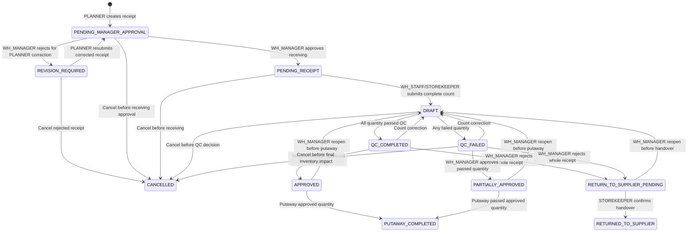

# Data Model: 003-inbound-receipt-qc

## 1. Entity: `Receipt` (`receipts`)

| Field | Type | Constraint | Description |
| :--- | :--- | :--- | :--- |
| `id` | BIGSERIAL | PK | Receipt ID |
| `receipt_number` | VARCHAR(50) | UNIQUE, NOT NULL | System-generated format `PO-{YYYYMMDD}-{SEQ}`, e.g. `PO-20260728-0001` |
| `source_order_code` | VARCHAR(100) | NULLABLE, not used by Spec 003 create form | Deprecated/optional external reference only; PLANNER does not enter this field |
| `type` | VARCHAR(20) | `PURCHASE` for Spec 003 | Dealer returns belong to Spec 009 |
| `warehouse_id` | BIGINT | FK, NOT NULL | Receiving warehouse |
| `supplier_id` | BIGINT | FK, NOT NULL | Supplier |
| `status` | VARCHAR(40) | NOT NULL | Lifecycle status |
| `pre_receive_approved_by` | BIGINT | FK users, NULLABLE | WH_MANAGER who approved a newly created receipt for warehouse counting |
| `pre_receive_approved_at` | TIMESTAMPTZ | NULLABLE | Timestamp when receipt moved from `PENDING_MANAGER_APPROVAL` to `PENDING_RECEIPT` |
| `pre_receive_rejection_reason` | TEXT | NULLABLE | Required when WH_MANAGER rejects a newly created receipt to `REVISION_REQUIRED` before counting |
| `approved_by` | BIGINT | FK users, NULLABLE | WH_MANAGER decision actor |
| `approved_at` | TIMESTAMPTZ | NULLABLE | WH_MANAGER decision timestamp |
| `rejection_reason` | TEXT | NULLABLE | Required for whole-receipt rejection |
| `document_date` | DATE | NOT NULL | Source document date |
| `accounting_period_id` | BIGINT | FK, NULLABLE | Accounting period |
| `version` | BIGINT | NOT NULL | JPA `@Version` |
| `putaway_completed_at` | TIMESTAMPTZ | NULLABLE | Idempotency guard |

Allowed statuses:

`PENDING_MANAGER_APPROVAL`, `REVISION_REQUIRED`, `PENDING_RECEIPT`, `DRAFT`, `QC_COMPLETED`, `QC_FAILED`, `APPROVED`, `PARTIALLY_APPROVED`, `PUTAWAY_COMPLETED`, `RETURN_TO_SUPPLIER_PENDING`, `RETURNED_TO_SUPPLIER`, `CANCELLED`.

## 2. Entity: `ReceiptItem` (`receipt_items`)

| Field | Type | Constraint | Description |
| :--- | :--- | :--- | :--- |
| `id` | BIGSERIAL | PK | Item line ID |
| `receipt_id` | BIGINT | FK, NOT NULL | Parent receipt |
| `product_id` | BIGINT | FK, NOT NULL | Product |
| `batch_id` | BIGINT | FK `batches.id`, NULLABLE | Approved quantity lineage; resolved before regular putaway or finalized Quarantine stock |
| `location_id` | BIGINT | FK, NULLABLE | Putaway target if single-location putaway |
| `expected_qty` | INTEGER | `> 0` | Planned quantity |
| `actual_qty` | INTEGER | `>= 0`, NULLABLE | Counted accepted-for-QC quantity |
| `over_received_qty` | INTEGER | `>= 0`, default 0 | Excess beyond expected, not inventory |
| `sample_qty` | INTEGER | NULLABLE | QC inspected sample quantity |
| `sample_passed_qty` | INTEGER | NULLABLE | Passed sample quantity |
| `sample_failed_qty` | INTEGER | NULLABLE | Failed sample quantity |
| `quality_passed_qty` | INTEGER | NULLABLE | Actual quantity classified as passed |
| `quality_failed_qty` | INTEGER | NULLABLE | Actual quantity classified as failed |
| `approved_qty` | INTEGER | default 0 | Quantity approved for regular putaway |
| `quarantine_ready_qty` | INTEGER | default 0 | Failed quantity staged for Quarantine before WH_MANAGER finalization |
| `quarantine_qty` | INTEGER | default 0 | Finalized unresolved failed quantity in Quarantine |
| `resolved_quarantine_qty` | INTEGER | default 0 | Quantity already moved out through approved RTV/disposal |
| `qc_sampling_method` | VARCHAR(30) | NULLABLE | `FULL_INSPECTION` / `RANDOM_SAMPLE` |
| `qc_result` | VARCHAR(20) | NULLABLE | `PENDING` / `PASSED` / `FAILED` |
| `qc_failure_reason` | TEXT | NULLABLE | Required when failed quantity exists |
| `unit_cost` | DECIMAL(18,2) | NULLABLE before approval | Required before approval/AP |

## 3. Lifecycle



## 4. Quantity Rules

- `sample_passed_qty + sample_failed_qty = sample_qty`.
- `quality_passed_qty + quality_failed_qty = actual_qty`.
- `APPROVED`: `approved_qty = actual_qty`.
- `PARTIALLY_APPROVED`: `approved_qty = quality_passed_qty`.
- `QC_FAILED`: `quarantine_ready_qty = quality_failed_qty` until WH_MANAGER finalization.
- `PARTIALLY_APPROVED` or `RETURN_TO_SUPPLIER_PENDING` from `QC_FAILED`: `quarantine_qty = quality_failed_qty - resolved_quarantine_qty`.
- Putaway quantity must equal `approved_qty`.
- Quarantine quantity is excluded from outbound available stock.
- Count correction or reopen may clear only `quarantine_ready_qty`; finalized `quarantine_qty` can decrease only through approved RTV or disposal confirmation.
- Over-received quantity is retained for review but is not regular or quarantine inventory in Sprint 1.

## 5. Batch Identity

Each approved product receipt line creates or carries a `batches.batch_code` that identifies the received lot for warehouse traceability. The system generates `batch_code` values; storekeepers select or confirm them during downstream warehouse movements but do not manually invent the code.

Canonical storage:

| Table | Field | Rule |
|-------|-------|------|
| `batches` | `batch_code` | Unique generated business lot code |
| `receipt_items` | `batch_id` | FK to the generated batch for the receipt line |
| `inventories` | `batch_id` | FK to the batch stored at the bin/location; do not duplicate `batch_code` as an inventory column |

Recommended format:

```text
LOT-{WAREHOUSE_CODE}-{YYYYMMDD}-{SEQ}
```

`SEQ` is a four-digit daily sequence scoped by warehouse and received date.

Example:

```text
LOT-HP-20260728-0001
```

Batch identity is derived from:

```text
(product_id, warehouse_id, receipt_number, document_date or received_date, supplier_id)
```

Two receipts with different receipt numbers, received dates, or suppliers MUST create distinct batch lineage even if product and supplier match. A receipt with multiple products creates separate batches per product receipt line.

Inventory traceability for accepted goods is maintained by:

```text
product_id + warehouse_id + batch_id + location_id
```

User-facing inventory, picking, transfer, stocktake, audit, and report views SHOULD display `batches.batch_code` alongside `batch_id`.
