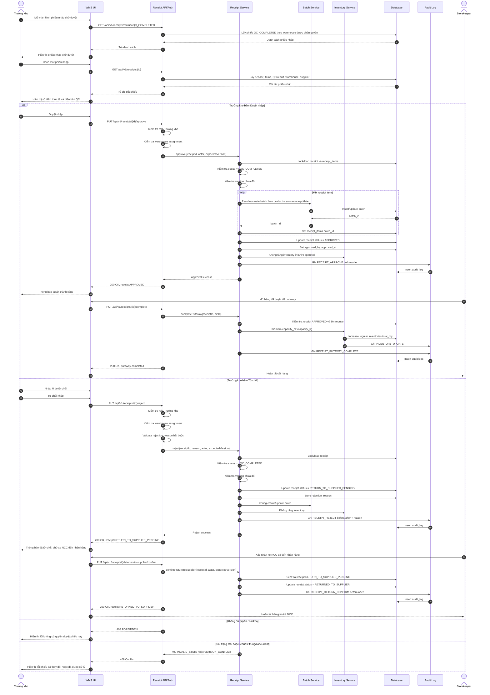

# Feature: Trưởng kho Duyệt Nhập kho Chính thức (US-WMS-06)

## 1. Context and Goal
Trưởng kho duyệt hoặc từ chối phiếu nhập kho chính thức dựa trên số lượng đếm thực tế và kết quả QC mẫu đã được Storekeeper xác nhận ở trạng thái `QC_COMPLETED`.

## Clarifications

### Session 2026-06-11
- Q: Putaway should happen before or after Trưởng kho approval? -> A: After approval; approval unlocks putaway.
- Q: Should inbound QC support PARTIAL pass/fail in Sprint 1? -> A: No PARTIAL; any failed sample makes the whole lot `QC_FAILED`.
- Q: What happens when Trưởng kho rejects a `QC_COMPLETED` receipt? -> A: Move it to `RETURN_TO_SUPPLIER_PENDING`.
- Q: Can a Trưởng kho approve receipts for any warehouse? -> A: No; only assigned warehouse.
- Q: Should duplicate/concurrent approve/reject attempts be blocked? -> A: Yes; use idempotency/state and optimistic locking.
- Q: Does rejecting a `QC_COMPLETED` receipt create RTV or Debit Note? -> A: No; Sprint 1 creates RTV/Debit Note only for `QC_FAILED` quarantine handling. Rejection records supplier-return pending state and keeps goods outside inventory.
- Q: When does `RETURN_TO_SUPPLIER_PENDING` finish? -> A: When the supplier's vehicle arrives and Storekeeper confirms physical handover, the receipt moves to `RETURNED_TO_SUPPLIER`.

## 2. Actors
* **Trưởng kho**: Đối chiếu biên bản QC đã `QC_COMPLETED` và duyệt hoặc từ chối phiếu nhập kho chính thức.
* **Storekeeper (STOREKEEPER)**: Bàn giao hàng bị từ chối cho xe của nhà cung cấp và xác nhận đã trả hàng.

## 3. Functional Requirements (EARS)
* **Ubiquitous:**
  * The system SHALL create `RECEIPT_APPROVE` or `RECEIPT_REJECT` audit log entries for every official receipt approval decision, including before/after status and inventory delta when applicable.
  * The system SHALL allow Trưởng kho approval decisions only for receipts belonging to warehouses assigned to the authenticated Trưởng kho.
  * The system SHALL NOT support partial inbound QC approval in Sprint 1; any confirmed QC failure SHALL route the whole lot to `QC_FAILED`.
* **Event-driven:**
  * WHEN a Trưởng kho approves a receipt in `QC_COMPLETED` status, the system SHALL:
    * Create or update a Batch record for the received lot using product plus source receipt/date as the batch resolution key.
    * Set `receipt_items.batch_id` after the Batch record is created or resolved.
    * Update receipt status to `APPROVED`.
    * Allow Storekeeper to complete putaway into regular Bin locations after approval.
  * WHEN a Trưởng kho rejects a receipt in `QC_COMPLETED` status, the system SHALL:
    * Update receipt status to `RETURN_TO_SUPPLIER_PENDING`.
    * Store the rejection reason.
    * The system SHALL NOT create or update batch records.
    * The system SHALL NOT increase inventory.
    * The system SHALL NOT create RTV or Debit Note records in this approval feature.
    * Keep the received goods outside available inventory until Storekeeper confirms physical handover to the supplier.
  * WHEN Storekeeper confirms supplier handover for a receipt in `RETURN_TO_SUPPLIER_PENDING` status, the system SHALL:
    * Update receipt status to `RETURNED_TO_SUPPLIER`.
    * Store handover confirmation metadata including actor, timestamp, and optional note.
    * The system SHALL NOT create inventory, batch, RTV, or Debit Note records.
* **State-driven:**
  * WHILE a receipt status is `'PENDING_RECEIPT'`, `'DRAFT'`, `'QC_COMPLETED'`, or `'APPROVED'` without completed putaway, the system SHALL NOT increase available stock.
  * WHILE a receipt status is not `QC_COMPLETED`, the system SHALL reject approve/reject actions for the official receipt.
  * WHILE a receipt status is `QC_FAILED`, the system SHALL NOT allow official receipt approval and SHALL keep the lot in quarantine inventory for failure handling.
  * WHILE a receipt status is `RETURN_TO_SUPPLIER_PENDING`, the system SHALL NOT allow putaway, batch creation, or inventory increase.
  * WHILE a receipt status is not `RETURN_TO_SUPPLIER_PENDING`, the system SHALL reject supplier handover confirmation.
  * WHILE goods are in Quarantine locations (`is_quarantine = true`), the system SHALL exclude them from available selling inventory calculations.
  * WHILE a receipt status is `APPROVED`, `RETURN_TO_SUPPLIER_PENDING`, or `RETURNED_TO_SUPPLIER`, duplicate approve/reject actions SHALL be rejected with HTTP 409.
  * WHILE inventory or receipt version has changed since the approval request was read, the system SHALL reject the action with HTTP 409 and SHALL NOT apply duplicate inventory changes.

## 4. API Endpoints
* `PUT /api/v1/receipts/{id}/approve` - Phê duyệt nhập kho (Trưởng kho).
* `PUT /api/v1/receipts/{id}/reject` - Từ chối nhập kho.
* `PUT /api/v1/receipts/{id}/return-to-supplier/confirm` - Storekeeper xác nhận đã bàn giao hàng bị từ chối cho nhà cung cấp.
* `PUT /api/v1/receipts/{id}/complete` - Storekeeper hoàn tất putaway cho phiếu đã duyệt vào regular Bin.

All write requests in this feature SHALL include `expectedVersion` so stale concurrent actions return HTTP 409 without applying duplicate status, batch, audit, or inventory updates. Putaway requests SHALL include the target regular Bin per line item, and the backend SHALL reject non-regular/quarantine locations or bins whose remaining volume/weight capacity cannot hold the received quantity.

## 5. Acceptance Criteria
* **Scenario: Successful receipt approval after QC completion**
  * Given a receipt with 100 units that passed sample QC (`QC_COMPLETED`)
  * When the Trưởng kho clicks "Duyệt nhập"
  * Then the system SHALL:
    * Change receipt status to `APPROVED`.
    * Create or update the batch record for the full received lot using product plus source receipt/date.
    * Set `receipt_items.batch_id`.
    * Allow Storekeeper to put away the approved goods into regular Bin locations.
    * Not increase available stock until putaway is completed.

* **Scenario: Putaway increases available stock after approval**
  * Given a receipt has status `APPROVED` and no completed putaway
  * When Storekeeper completes putaway into a regular Bin location
  * Then the system SHALL increase regular `inventories.total_qty` by exactly the approved actual quantity.

* **Scenario: Reject QC-completed receipt for supplier return**
  * Given a receipt has status `QC_COMPLETED`
  * When the assigned Trưởng kho rejects it with a reason
  * Then the system SHALL change receipt status to `RETURN_TO_SUPPLIER_PENDING`, store the reason, not create RTV/Debit Note records, and not increase inventory.

* **Scenario: Storekeeper confirms rejected goods handover to supplier**
  * Given a receipt has status `RETURN_TO_SUPPLIER_PENDING`
  * When the supplier's vehicle arrives and Storekeeper confirms physical handover
  * Then the system SHALL change receipt status to `RETURNED_TO_SUPPLIER`, record the confirmation actor/timestamp, and not change inventory.

* **Scenario: Block approval by unassigned warehouse manager**
  * Given a receipt belongs to warehouse HN
  * When a Trưởng kho not assigned to warehouse HN attempts to approve it
  * Then the system SHALL reject the action with HTTP 403.

* **Scenario: Block duplicate approval**
  * Given a receipt status is already `APPROVED`, `RETURN_TO_SUPPLIER_PENDING`, or `RETURNED_TO_SUPPLIER`
  * When another approve or reject request is submitted for the same receipt
  * Then the system SHALL reject the request with HTTP 409 and SHALL NOT change inventory.

## 6. Swimlane Diagram

