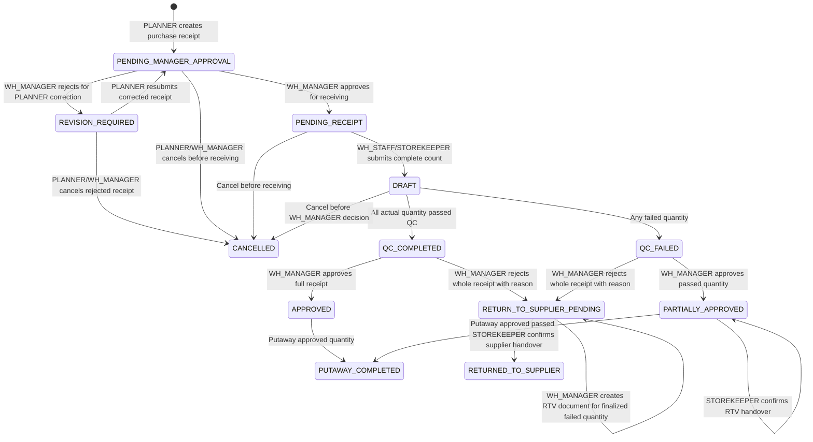

# Feature Specification: 003 Inbound Receipt QC

**Feature Branch**: `003-inbound-receipt-qc`
**Created**: 2026-05-30
**Last Reviewed**: 2026-07-28
**Status**: Draft - Business Review

## 1. Purpose

Spec 003 covers inbound purchase receiving from supplier receipt creation to count, QC, manager decision, putaway, and failed-good handling in Quarantine.

This root file is the canonical overview. Detailed requirements are split by feature under `features/`.

## Clarifications

### Session 2026-07-28

- Q: Should inbound goods have a lot code to distinguish separate receiving batches for the same product and supplier? -> A: Yes. Each product receipt line creates a distinct `batch_code` for that receiving batch, so the same product and supplier received in separate receipts are traceable as separate batches.
- Q: Should PLANNER enter a supplier/source PO code when creating an inbound receipt? -> A: No. The create receipt form removes source PO/source document code; the system generates the inbound receipt number as `PO-{YYYYMMDD}-{SEQ}` such as `PO-20260728-0001`.
- Q: What happens when WH_MANAGER rejects a newly created purchase receipt before warehouse counting? -> A: `PENDING_MANAGER_APPROVAL`; WH_MANAGER approval moves it to `PENDING_RECEIPT`; rejection now moves it to `REVISION_REQUIRED` for PLANNER correction or cancellation.

### Session 2026-07-29

- Q: How do we prevent staff counting after WH_MANAGER rejects a newly created receipt for correction? -> A: Rejection moves the receipt to `REVISION_REQUIRED`; only PLANNER can revise and resubmit it to `PENDING_MANAGER_APPROVAL`.

## 2. Canonical Flow

## 3. Feature Split

| Feature | Scope | Spec | Data | Plan | Tasks |
|---------|-------|------|------|------|-------|
| F01 | PLANNER creates purchase receipt | [spec](./features/feature-01-receipt-drafting/spec.md) | [data](./features/feature-01-receipt-drafting/data-model.md) | [plan](./features/feature-01-receipt-drafting/plan.md) | [tasks](./features/feature-01-receipt-drafting/tasks.md) |
| F02 | WH_STAFF/STOREKEEPER counts and corrects quantity | [spec](./features/feature-02-receipt-counting/spec.md) | [data](./features/feature-02-receipt-counting/data-model.md) | [plan](./features/feature-02-receipt-counting/plan.md) | [tasks](./features/feature-02-receipt-counting/tasks.md) |
| F03 | WH_STAFF/STOREKEEPER/WH_MANAGER confirms inbound QC classification | [spec](./features/feature-03-qc-classification/spec.md) | [data](./features/feature-03-qc-classification/data-model.md) | [plan](./features/feature-03-qc-classification/plan.md) | [tasks](./features/feature-03-qc-classification/tasks.md) |
| F04 | WH_MANAGER approves/rejects receipt | [spec](./features/feature-04-manager-decision/spec.md) | [data](./features/feature-04-manager-decision/data-model.md) | [plan](./features/feature-04-manager-decision/plan.md) | [tasks](./features/feature-04-manager-decision/tasks.md) |
| F05 | STOREKEEPER putaway and regular inventory impact | [spec](./features/feature-05-putaway-inventory/spec.md) | [data](./features/feature-05-putaway-inventory/data-model.md) | [plan](./features/feature-05-putaway-inventory/plan.md) | [tasks](./features/feature-05-putaway-inventory/tasks.md) |
| F06 | Quarantine RTV for failed goods | [spec](./features/feature-06-quarantine-rtv/spec.md) | [data](./features/feature-06-quarantine-rtv/data-model.md) | [plan](./features/feature-06-quarantine-rtv/plan.md) | [tasks](./features/feature-06-quarantine-rtv/tasks.md) |

## 4. Shared Actors

| Actor | Responsibility |
|-------|----------------|
| PLANNER | Create purchase receipt with supplier, warehouse, receipt date, and item expectations; receipt number is system-generated |
| WH_STAFF | Count physical goods and enter QC observations |
| STOREKEEPER | Receive/count goods, confirm QC, putaway approved goods, confirm physical handover |
| WH_MANAGER | Review QC, approve/reject receipts, create RTV, manage Quarantine |
| ACCOUNTANT | View accepted quantity for AP and consume Debit Note data from RTV |
| ACCT_MANAGER | View inbound receipt/returns financial context |
| CEO | View inbound receipt, Quarantine, and returns information |

## 5. Screen Authorization

Source: Google Sheet `1.4.2 Screen Authorization`, rows for Spec 003 inbound screens.

| Screen | Allowed roles |
|--------|---------------|
| Receipt List | `CEO` view only, `WH_MANAGER` view only, `ACCT_MANAGER` view only, `PLANNER` view only, `STOREKEEPER` view only, `WH_STAFF` view only, `ACCOUNTANT` view only |
| Receipt Create | `PLANNER` |
| Receipt Pre-Receive Approval | `WH_MANAGER` |
| Receipt Receive | `STOREKEEPER`, `WH_STAFF` |
| QC Inbound | `WH_MANAGER`, `STOREKEEPER`, `WH_STAFF` |
| Putaway Plan | `STOREKEEPER` |
| Quarantine Workspace | `CEO` view only, `WH_MANAGER`, `STOREKEEPER` |
| Returns Workspace | `CEO` view only, `WH_MANAGER`, `ACCT_MANAGER`, `STOREKEEPER`, `WH_STAFF` view only, `ACCOUNTANT` |

## 6. Shared Business Rules

- No ratio-based auto rejection exists in Spec 003.
- PLANNER-created purchase receipts start in `PENDING_MANAGER_APPROVAL`; WH_STAFF/STOREKEEPER cannot count the receipt until WH_MANAGER approves it to `PENDING_RECEIPT`.
- WH_MANAGER rejection from `PENDING_MANAGER_APPROVAL` returns the receipt to `REVISION_REQUIRED` for PLANNER correction or cancellation and must include a reason; WH_STAFF/STOREKEEPER cannot count or QC a `REVISION_REQUIRED` receipt.
- PLANNER resubmission from `REVISION_REQUIRED` returns the receipt to `PENDING_MANAGER_APPROVAL` and requires WH_MANAGER approval again before warehouse counting.
- Pre-receive manager approval and rejection write `RECEIPT_PRE_RECEIVE_APPROVE` / `RECEIPT_PRE_RECEIVE_REJECT` audit entries with actor, role, warehouse, before/after status, decision, and reason where relevant.
- QC classifies passed/failed quantities only; QC never rejects the whole receipt.
- Whole-receipt rejection requires `WH_MANAGER` action and reason.
- Failed quantity is staged or finalized in Quarantine handling and is excluded from outbound available stock.
- Failed quantity first creates Quarantine readiness at `QC_FAILED`; it becomes finalized Quarantine stock when `WH_MANAGER` approves passed quantity or rejects the whole receipt.
- Count correction or reopen may clear only non-finalized Quarantine readiness; finalized Quarantine stock leaves Quarantine only through approved RTV or disposal handling.
- Passed quantity from `QC_FAILED` can continue only through `PARTIALLY_APPROVED`.
- Regular inventory increases only at `PUTAWAY_COMPLETED`.
- Purchase receipt creation does not require or accept a user-entered source PO/source document code in Spec 003; the system SHALL generate the receipt number as `PO-{YYYYMMDD}-{SEQ}` using the receipt document date and a daily sequence.
- Each product receipt line that reaches regular putaway SHALL have a generated `batch_code`; same product and supplier received in separate receipt events SHALL remain separate batches for traceability and FIFO.
- AP must use accepted quantity only, not failed/rejected quantity.
- Every mutation requires audit; warehouse actions require role plus warehouse scope.
- Every mutation of an existing receipt uses `expectedVersion` for optimistic locking; create receipt is exempt because no receipt version exists yet.

## 7. Success Criteria

- **SC-001**: All write endpoints document `400`, `403`, `409`, and `422` responses with actionable error payloads.
- **SC-002**: Pre-receive approval/rejection/resubmission, blocked counting before approval or while revision is required, all-pass, partial-failed, whole-rejected, cancel, reopen, and RTV paths have endpoint integration tests for happy and error outcomes.
- **SC-003**: Every successful mutation writes audit with actor, role, warehouse, before, and after values where relevant.
- **SC-004**: Regular available stock increases only after putaway, while finalized Quarantine stock is excluded from outbound availability until RTV/disposal confirmation.
- **SC-005**: Same product and supplier received in two different receipt events produce two distinct batch codes, and inventory can be traced by product, warehouse, batch, and bin/location.

## 8. Shared Artifacts

- [Data model](./data-model.md)
- [Business API contract](./contracts/inbound-receipt-api.md)
- [OpenAPI contract](./contracts/openapi.yaml)
- [Quickstart](./quickstart.md)
