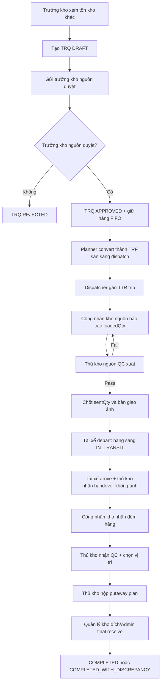

# Đặc Tả Tính Năng: Điều Chuyển Kho Nội Bộ

**Spec ID**: 005-inter-warehouse-transfer
**Ngày tạo**: 2026-05-30
**Cập nhật**: 2026-08-03
**Trạng thái**: Đã chuẩn hóa tiếng Việt có dấu, giữ nguyên mã kỹ thuật/API/status
**User stories**: US-WMS-11, US-WMS-11A, US-WMS-12

---

## 1. Bối Cảnh Và Mục Tiêu

Phúc Anh vận hành 3 kho vật lý: Hải Phòng, Hà Nội và Hồ Chí Minh. Hệ thống cần hỗ trợ điều chuyển hàng hóa giữa các kho để cân bằng tồn kho, tránh đứt nguồn cung và đảm bảo toàn bộ vòng đời điều chuyển có kiểm soát, truy vết và audit.

Điều chuyển nội bộ là luồng riêng, không trộn với luồng nhập hàng từ nhà cung cấp:

- Mã yêu cầu điều chuyển: `TRQ-YYYYMMDD-####`.
- Mã phiếu điều chuyển: `TRF-YYYYMMDD-####`.
- Mã chuyến xe điều chuyển: `TTR-YYYYMMDD-####`.
- Hàng đang trên đường được theo dõi qua kho ảo `IN_TRANSIT`.
- Nhập hàng nhà cung cấp vẫn dùng mã `RN-*` và được xử lý ở màn Phiếu nhập & QC.
- Điều chuyển nội bộ `TRF-*` được xử lý trong màn Điều chuyển nội bộ.

Luồng nghiệp vụ đầy đủ:

1. Trưởng kho đang thiếu hàng xem tồn khả dụng tại các kho khác.
2. Trưởng kho tạo yêu cầu điều chuyển `TRQ` ở trạng thái `DRAFT`.
3. Trưởng kho gửi `TRQ` cho trưởng kho nguồn duyệt.
4. Trưởng kho nguồn duyệt hoặc từ chối `TRQ`; khi duyệt, hệ thống giữ hàng nguồn theo FIFO ngay.
5. Planner chuyển `TRQ` đã duyệt/đã giữ hàng thành phiếu điều chuyển `TRF`, hoặc tạo `TRF` thủ công từ lệnh điều phối bên ngoài.
6. Với `TRF` sinh từ `TRQ`, không reserve lần hai; với `TRF` thủ công, trưởng kho nguồn có thể duyệt và giữ hàng theo rule riêng nếu nhánh này còn hỗ trợ.
7. Dispatcher gán chuyến xe `TTR` loại `TRANSFER`.
8. Kho nguồn xếp hàng, QC xuất, chốt số lượng gửi và bàn giao hàng cho tài xế.
9. Tài xế xác nhận rời kho; hàng chuyển sang kho ảo `IN_TRANSIT`.
10. Tài xế đến kho nhận, kho nhận xác nhận bàn giao, đếm hàng, QC nhận và đề xuất vị trí nhập.
11. Quản lý kho đích/Admin xác nhận nhập kho cuối cùng; hệ thống ghi tồn, xử lý chênh lệch và đóng phiếu.

## 2. Tác Nhân

| Tác nhân | Vai trò nghiệp vụ |
| :--- | :--- |
| Planner | Tạo `TRF` từ lệnh điều phối bên ngoài hoặc từ `TRQ` đã được trưởng kho nguồn duyệt/giữ hàng |
| Trưởng kho đang thiếu hàng | Xem tồn kho khác, tạo/sửa/hủy mềm `TRQ`, gửi trưởng kho nguồn duyệt |
| CEO | Chỉ xem/giám sát luồng yêu cầu điều chuyển; không duyệt `TRQ` trong luồng mới |
| Trưởng kho nguồn | Duyệt/từ chối `TRQ` và giữ hàng nguồn; duyệt/từ chối `TRF` thủ công nếu nhánh này còn hỗ trợ; có thể hủy phiếu đã duyệt nhưng chưa xếp/xuất |
| Dispatcher | Gán xe, tài xế và lịch chuyến `TTR` cho phiếu điều chuyển |
| Công nhân kho nguồn | Xếp hàng và báo cáo số lượng thực tế đã xếp |
| Thủ kho nguồn | QC xuất, yêu cầu xếp lại nếu QC fail, chốt số lượng gửi và bàn giao cho tài xế |
| Tài xế | Xác nhận rời kho, đến kho nhận, và các mốc quay đầu nếu có |
| Công nhân kho nhận | Đếm mù số lượng hàng nhận thực tế |
| Thủ kho kho nhận | Kiểm lại số đếm, QC nhận, chọn vị trí nhập cho hàng đạt |
| Trưởng kho kho nhận | Xác nhận cuối, xử lý chênh lệch, hoàn tất nhập kho |
| Admin | Quyền vận hành/sửa lỗi theo phạm vi hệ thống |

## 3. Luồng Chuẩn End-To-End

## 4. Yêu Cầu Chức Năng

### 4.1. Yêu cầu điều chuyển `TRQ`

- Trưởng kho chỉ được tạo `TRQ` cho kho mình phụ trách, trong đó kho đang thiếu hàng là kho đích.
- `TRQ` phải có kho nguồn, kho đích, ngày cần hàng, lý do nghiệp vụ và ít nhất một dòng sản phẩm.
- Kho nguồn và kho đích phải khác nhau và đều là kho vật lý, không được là kho ảo `IN_TRANSIT`.
- Ngày cần hàng `needed_by_date` không được ở quá khứ.
- Số lượng yêu cầu phải là số nguyên dương; không cho trùng SKU trong cùng yêu cầu.
- Khi submit hoặc trưởng kho nguồn approve, hệ thống phải kiểm tra lại tồn khả dụng tại kho nguồn.
- `TRQ` chỉ được sửa hoặc hủy mềm khi còn `DRAFT`.
- Trưởng kho nguồn có thể duyệt hoặc từ chối `TRQ`; từ chối bắt buộc có lý do.
- Khi trưởng kho nguồn duyệt `TRQ`, hệ thống phải giữ hàng trong kho nguồn theo FIFO, chỉ lấy tồn khả dụng ở vị trí active, không quarantine; nếu không đủ hàng thì không reserve một phần và không approve.
- `TRQ` đã duyệt chỉ được chuyển thành tối đa một `TRF` còn hiệu lực.
- Nếu quá ngày cần hàng mà `TRQ` chưa được chuyển thành `TRF`, hệ thống hủy `TRQ` để Planner không thể chuyển đơn trễ.

### 4.2. Lập phiếu điều chuyển `TRF`

- Planner có thể tạo `TRF` thủ công từ lệnh điều phối bên ngoài hoặc chuyển từ `TRQ` đã duyệt/đã giữ hàng.
- `TRF` phải có `external_instruction_code` không rỗng để truy vết.
- Các `TRF` còn hiệu lực phải duy nhất theo `external_instruction_code`, kho nguồn, kho đích và `document_date`.
- Planner chỉ được sửa `TRF` khi trạng thái còn `NEW`.
- Khi sửa `TRF`, danh sách item gửi lên được xem là trạng thái đầy đủ mới nhất của phiếu.
- Không cho sửa `TRF` sau khi đã `APPROVED`, `REJECTED`, `IN_TRANSIT`, `COMPLETED`, `COMPLETED_WITH_DISCREPANCY`, `CANCELLED` hoặc `QUARANTINED`.
- `document_date` và `planned_date` không được ở quá khứ; `planned_date` không được trước `document_date`.
- Với `TRF` sinh từ `TRQ`, `planned_date` phải bám ngày cần hàng `needed_by_date` và không được reserve tồn nguồn lần hai.

### 4.3. Duyệt kho nguồn và giữ hàng

- Trưởng kho nguồn chỉ duyệt `TRF` ở trạng thái `NEW` khi phiếu được tạo thủ công và chưa có reservation từ `TRQ`.
- Khi duyệt, hệ thống giữ hàng trong kho nguồn theo FIFO, chỉ lấy tồn khả dụng ở vị trí đang hoạt động, không phải quarantine.
- Hàng ở vị trí cách ly, vị trí inactive, vị trí bị khóa hoặc tồn không còn available phải bị loại khỏi reservation.
- Nếu tồn khả dụng không đủ, duyệt phải fail và không được để lại reservation một phần.
- Trưởng kho nguồn có thể từ chối `TRF NEW`; lý do từ chối là bắt buộc.
- `TRF REJECTED` là bất biến; nếu cần làm lại thì Planner tạo phiếu mới.

### 4.4. Điều phối chuyến xe `TTR`

- Mỗi `TRF` dùng đúng một chuyến xe nội bộ riêng `trip_type = TRANSFER`.
- Dispatcher chỉ được gán xe/tài xế cho phiếu thuộc kho nguồn trong phạm vi mình phụ trách.
- Xe và tài xế phải đang hoạt động, không unavailable/maintenance và không trùng lịch với chuyến khác.
- Tài xế phải thuộc phạm vi kho nguồn, có hồ sơ driver và giấy phép lái xe chưa hết hạn.
- Lịch chuyến phải hợp lệ: `planned_end_at` sau `planned_start_at`, không bắt đầu/kết thúc ở quá khứ.
- Tổng trọng lượng/thể tích chuyến phải được tính từ dòng hàng và không được vượt tải xe.
- `planned_end_at` không được vượt quá cuối ngày cần hàng.
- Sau khi tài xế đã rời kho, không cho đổi xe, đổi tài xế hoặc reschedule trong Sprint 1.

### 4.5. Xếp hàng, QC xuất và rời kho

- Công nhân kho nguồn phải báo cáo `loaded_qty` cho mọi dòng trước khi thủ kho QC xuất.
- `loaded_qty` phải là số nguyên và phải khớp `planned_qty`; nếu lệch phải có `reworkReason`.
- QC xuất chỉ được thực hiện sau khi đã có báo cáo xếp hàng.
- Nếu QC xuất fail, hệ thống bật cờ cần rework và khóa các bước ship, handover, depart cho tới khi xếp lại và QC pass.
- QC xuất và bàn giao tải hàng phải có ảnh bằng chứng; action nghiệp vụ chỉ lưu `photoRef`, không gửi raw base64.
- `sent_qty` chỉ được chốt sau khi QC xuất pass và lấy từ `loaded_qty`.
- Tài xế chỉ được depart nếu là tài xế được gán, phiếu `APPROVED`, đã có trip `TRANSFER`, mọi `sent_qty` đủ `planned_qty`, QC xuất pass và có ảnh bàn giao.
- Khi depart, hệ thống trừ tồn kho nguồn, giảm reserved, cộng hàng vào kho ảo `IN_TRANSIT`, chuyển phiếu sang `IN_TRANSIT`, xe/tài xế sang trạng thái đang chạy.

### 4.6. Nhận hàng tại kho đích

- Tài xế phải ghi nhận đến kho đích trước.
- Kho nhận chỉ cần thủ kho bấm xác nhận bàn giao trước khi công nhân được nhập số đếm; không bắt ảnh ở bước bàn giao kho đích.
- Công nhân kho nhận phải nhập đủ mọi dòng hàng; nếu số đếm lệch `sent_qty` thì phải có lý do dòng hàng.
- Thủ kho kho nhận kiểm lại số đếm và QC nhận; nếu số xác nhận lệch số công nhân đếm thì phải có ghi chú.
- `qc_passed_qty + qc_failed_qty` phải bằng số lượng thủ kho xác nhận.
- Nếu có `qc_failed_qty > 0`, phải có lý do QC fail và kho nhận phải có quarantine bin đang hoạt động.
- Hàng QC đạt phải được chọn vị trí thường, đang hoạt động, thuộc đúng kho nhận và không phải quarantine bin.
- Vị trí nhập hàng phải đủ sức chứa trước khi final receive ghi tồn.

### 4.7. Nhập kho cuối và xử lý tồn

- Thủ kho chỉ nộp kế hoạch putaway; quản lý kho/CEO/Admin mới được xác nhận final receive.
- Thủ kho không được tự duyệt final receive cho kế hoạch do chính mình nộp.
- Final receive chỉ chạy sau khi mọi dòng đã có kết quả receive check.
- Khi final receive, hệ thống trừ hàng khỏi `IN_TRANSIT`.
- Hàng QC đạt được cộng vào vị trí thường của kho nhận.
- Hàng QC fail được cộng vào quarantine bin, tạo `QuarantineRecord` với origin `INTERNAL_TRANSFER`.
- Nếu thiếu hàng, hệ thống tạo `TRANSFER_DISCREPANCY` adjustment và `DiscrepancyIncident OPEN`.
- Nếu nhận thừa, hệ thống tạo incident `OVER_RECEIPT` và hold entry; không được âm thầm bỏ qua.
- Nếu có chênh lệch nhận hoặc putaway, phải có `discrepancy_reason`.
- Kết quả cuối là `COMPLETED` nếu khớp, hoặc `COMPLETED_WITH_DISCREPANCY` nếu có chênh lệch.

## 5. Luồng Ngoại Lệ

### 5.1. Quá ngày cần hàng

- Ngày cần hàng là deadline cứng: hàng phải có trong đúng ngày đó.
- Nếu quá ngày cần hàng mà `TRQ` chưa convert, hệ thống hủy `TRQ`.
- Nếu `TRF APPROVED` chưa depart mà quá ngày cần hàng, hệ thống hủy `TRF`, release reservation và xóa `sent_qty` nếu có.
- Dispatcher không được lập chuyến có `planned_end_at` sau cuối ngày cần hàng.
- Nếu hàng đã `IN_TRANSIT` mà quá deadline, hệ thống không được cancel mất dấu hàng. Phiếu phải chuyển sang nhánh quay đầu về kho nguồn với `is_returned = true` và lý do `TRANSFER_REQUIRED_DATE_EXPIRED`.

### 5.2. Xe quay đầu về kho nguồn

- Return to Source chỉ áp dụng khi phiếu còn `IN_TRANSIT`.
- Nhánh quay đầu do sai SKU tại kho đích không còn được hỗ trợ trong API/service.
- Khi phiếu bị quá deadline trong lúc `IN_TRANSIT`, hệ thống đánh dấu `is_returned = true` với lý do `TRANSFER_REQUIRED_DATE_EXPIRED`.
- Khi phiếu đã ở nhánh quay đầu, tài xế ghi `return-depart`, `return-arrive`, kho nguồn ghi `return-handover`.
- Sau khi xe về, kho nguồn thực hiện lại flow nhận: count, check/QC, putaway plan, final receive.
- Hàng đạt được nhập lại kho nguồn; hàng lỗi vào quarantine nguồn; thiếu hàng tạo discrepancy.

### 5.3. Sai SKU

- Sai SKU không còn tạo yêu cầu quay đầu trong luồng điều chuyển Sprint 1.
- Nếu phát hiện sai SKU ở kho đích, kho đích tiếp tục flow nhận/count/QC và xử lý qua chênh lệch hoặc quarantine theo trạng thái vật lý.
- Hàng đã xác nhận hư hỏng vật lý không dùng return to source làm xử lý cuối; phải đi theo quarantine/disposal của Spec 009.

### 5.4. Hàng lỗi QC và quarantine

- QC fail ở kho nhận phải có lý do và quarantine bin hoạt động.
- Hàng lỗi QC được đưa vào quarantine với nguồn gốc `INTERNAL_TRANSFER`.
- Hàng quarantine từ điều chuyển không được tạo RTV hoặc Debit Note nhà cung cấp.
- Xử lý tiêu hủy/xử lý sau quarantine thuộc Spec 009.

### 5.5. Thiếu, thừa và hồ sơ chênh lệch

- Thiếu hàng không tạo tồn quarantine vì hàng không tồn tại vật lý.
- Thiếu hàng tạo `TRANSFER_DISCREPANCY` adjustment và `DiscrepancyIncident OPEN`.
- Incident có thể được CEO, ACCOUNTANT_MANAGER hoặc WAREHOUSE_MANAGER có phạm vi kho liên quan resolve bằng trạng thái trách nhiệm được phê duyệt.
- Resolve incident chỉ ghi nhận kết luận/audit, không tự sửa tồn kho. Nếu cần sửa tồn, phải đi qua workflow adjustment riêng.

## 6. Mô Hình Dữ Liệu Chính

### 6.1. `transfers`

- `transfer_number`: mã `TRF-*`, duy nhất.
- `source_warehouse_id`: kho nguồn.
- `destination_warehouse_id`: kho đích.
- `status`: `NEW`, `APPROVED`, `REJECTED`, `IN_TRANSIT`, `PUTAWAY_PENDING_APPROVAL`, `COMPLETED`, `COMPLETED_WITH_DISCREPANCY`, `CANCELLED`, `QUARANTINED`.
- `is_returned`: đánh dấu xe quay đầu; khi true, scope nhận hàng chuyển về kho nguồn.
- `return_reason`, `return_requested_by`, `return_approved_by`: thông tin quyết định quay đầu.
- `external_instruction_code`: mã lệnh ngoài hoặc mã `TRQ` gốc để truy vết.
- `planned_date`, `document_date`, `actual_received_date`.
- `trip_id`: chuyến xe `TTR`, loại `TRANSFER`.
- `outbound_qc_*`, `source_loaded_*`, `load_handover_*`, `driver_*`, `arrival_handover_*`, `return_*`: các mốc xuất, vận chuyển, nhận và quay đầu.
- `version`: dùng cho kiểm soát cập nhật đồng thời.

### 6.2. `transfer_requests`

- `request_number`: mã `TRQ-*`, duy nhất.
- `requesting_warehouse_id`: kho đang thiếu hàng, trở thành kho đích.
- `source_warehouse_id`: kho có hàng, trở thành kho nguồn.
- `status`: `DRAFT`, `SUBMITTED`, `APPROVED`, `REJECTED`, `CONVERTED`, `CANCELLED`.
- `needed_by_date`: ngày cần hàng, là deadline cứng.
- `business_reason`: lý do nghiệp vụ bắt buộc.
- `converted_transfer_id`: `TRF` được sinh ra sau khi Planner convert.
- `version`: dùng cho kiểm soát cập nhật đồng thời.

### 6.3. `transfer_items`

- `planned_qty`: số lượng dự kiến chuyển.
- `loaded_qty`: số lượng công nhân kho nguồn đã xếp.
- `sent_qty`: số lượng thủ kho nguồn chốt gửi sau QC xuất pass.
- `worker_received_qty`: số lượng công nhân kho nhận đếm.
- `received_qty`: số lượng thủ kho xác nhận.
- `qc_passed_qty`, `qc_failed_qty`: kết quả QC nhận.
- `variance_qty`: chênh lệch giữa số xác nhận và số gửi.
- `batch_id`: có thể null khi lập kế hoạch; batch thực tế được giữ ở allocation FIFO.
- Snapshot UOM/khối lượng/thể tích được khóa trước departure để tránh dữ liệu sản phẩm thay đổi khi hàng đang đi.

### 6.4. `trips`

- Điều chuyển nội bộ dùng chung entity `trips` với `trip_type = TRANSFER`.
- `trip_number` theo format `TTR-YYYYMMDD-####`.
- Sprint 1 chỉ hỗ trợ một transfer cho một trip điều chuyển.
- `total_weight` và `total_volume` được tính tại bước assign trip.

### 6.5. Tồn kho và chênh lệch

- Tồn kho trên đường dùng kho ảo `IN_TRANSIT`.
- Điều chuyển nội bộ không tạo phiếu `RN`.
- `discrepancy_incidents` lưu hồ sơ thiếu/thừa để điều tra, không tự động sửa tồn.

## 7. API Chính

### 7.1. Transfer Request

- `GET /api/v1/transfer-requests`
- `GET /api/v1/transfer-requests/{id}`
- `POST /api/v1/transfer-requests`
- `PUT /api/v1/transfer-requests/{id}`
- `POST /api/v1/transfer-requests/{id}/cancel`
- `POST /api/v1/transfer-requests/{id}/submit`
- `POST /api/v1/transfer-requests/{id}/approve`
- `POST /api/v1/transfer-requests/{id}/reject`
- `POST /api/v1/transfer-requests/{id}/convert`
- `GET /api/v1/transfer-requests/stock-lookup?productId={id}`

### 7.2. Inter-Warehouse Transfer

- `GET /api/v1/inter-warehouse-transfers`
- `GET /api/v1/inter-warehouse-transfers/{id}`
- `POST /api/v1/inter-warehouse-transfers`
- `PUT /api/v1/inter-warehouse-transfers/{id}`
- `POST /api/v1/inter-warehouse-transfers/{id}/cancel`
- `POST /api/v1/inter-warehouse-transfers/{id}/approve`
- `POST /api/v1/inter-warehouse-transfers/{id}/reject`
- `POST /api/v1/inter-warehouse-transfers/{id}/trip`
- `POST /api/v1/inter-warehouse-transfers/{id}/source-load-report`
- `POST /api/v1/inter-warehouse-transfers/{id}/outbound-qc`
- `POST /api/v1/inter-warehouse-transfers/{id}/photo-evidence`
- `POST /api/v1/inter-warehouse-transfers/{id}/ship`
- `POST /api/v1/inter-warehouse-transfers/{id}/unship`
- `POST /api/v1/inter-warehouse-transfers/{id}/load-handover`
- `POST /api/v1/inter-warehouse-transfers/{id}/depart`
- `POST /api/v1/inter-warehouse-transfers/{id}/driver-arrive`
- `POST /api/v1/inter-warehouse-transfers/{id}/receiving-handover`
- `PUT /api/v1/inter-warehouse-transfers/{id}/receive-count`
- `PUT /api/v1/inter-warehouse-transfers/{id}/receive-check`
- `POST /api/v1/inter-warehouse-transfers/{id}/final-receive`
- `POST /api/v1/inter-warehouse-transfers/{id}/return-to-source`
- `POST /api/v1/inter-warehouse-transfers/{id}/return-depart`
- `POST /api/v1/inter-warehouse-transfers/{id}/return-arrive`
- `POST /api/v1/inter-warehouse-transfers/{id}/return-handover`
- `POST /api/v1/inter-warehouse-transfers/{id}/quarantine-reject`

### 7.3. Discrepancy Incident

- `GET /api/v1/transfer-discrepancy-incidents?status=OPEN`
- `POST /api/v1/transfer-discrepancy-incidents/{id}/resolve`

## 8. Mã Lỗi Chính

| Mã lỗi | Ý nghĩa |
| :--- | :--- |
| `SOURCE_DESTINATION_MUST_DIFFER` | Kho nguồn và kho đích không được trùng nhau |
| `TRANSFER_ITEMS_REQUIRED` | Phiếu/yêu cầu thiếu dòng hàng |
| `TRANSFER_QTY_MUST_BE_WHOLE_NUMBER` | Số lượng điều chuyển phải là số nguyên |
| `NEEDED_BY_DATE_MUST_NOT_BE_PAST` | Ngày cần hàng không được ở quá khứ |
| `DOCUMENT_DATE_MUST_NOT_BE_PAST` | Ngày chứng từ không được ở quá khứ |
| `PLANNED_DATE_MUST_NOT_BE_PAST` | Ngày dự kiến không được ở quá khứ |
| `PLANNED_DATE_MUST_NOT_BE_BEFORE_DOCUMENT_DATE` | Ngày dự kiến không được trước ngày chứng từ |
| `DUPLICATE_PRODUCT_IN_TRANSFER` | Trùng sản phẩm trong cùng phiếu/yêu cầu |
| `DUPLICATE_EXTERNAL_INSTRUCTION` | Trùng mã lệnh ngoài cho phiếu còn hiệu lực |
| `WAREHOUSE_SCOPE_REQUIRED` | Người dùng không thuộc phạm vi kho cần thao tác |
| `SOURCE_MANAGER_ROLE_REQUIRED` | Thao tác yêu cầu trưởng kho nguồn/Admin |
| `PLANNER_ROLE_REQUIRED` | Thao tác yêu cầu Planner/Admin |
| `WAREHOUSE_MANAGER_ROLE_REQUIRED` | Thao tác yêu cầu trưởng kho hoặc quyền override |
| `ONLY_DRAFT_CAN_BE_UPDATED` | Chỉ `TRQ DRAFT` mới được sửa |
| `ONLY_DRAFT_CAN_BE_CANCELLED` | Chỉ `TRQ DRAFT` mới được hủy mềm |
| `ONLY_DRAFT_CAN_BE_SUBMITTED` | Chỉ `TRQ DRAFT` mới được gửi duyệt |
| `ONLY_SUBMITTED_CAN_BE_APPROVED` | Chỉ `TRQ SUBMITTED` mới được trưởng kho nguồn duyệt |
| `ONLY_SUBMITTED_CAN_BE_REJECTED` | Chỉ `TRQ SUBMITTED` mới được trưởng kho nguồn từ chối |
| `ONLY_APPROVED_CAN_BE_CONVERTED` | Chỉ `TRQ APPROVED` mới được convert |
| `TRANSFER_REQUEST_ALREADY_CONVERTED` | Yêu cầu đã được convert thành phiếu điều chuyển |
| `TRANSFER_REQUEST_QTY_EXCEEDS_SOURCE_AVAILABLE` | Kho nguồn không đủ tồn khả dụng cho yêu cầu |
| `INSUFFICIENT_AVAILABLE_STOCK` | Kho nguồn không đủ tồn khả dụng khi duyệt/giữ hàng |
| `INVALID_TRANSFER_STATUS` | Trạng thái phiếu không hợp lệ cho thao tác hiện tại |
| `TRANSFER_CANCEL_NOT_ALLOWED` | Không được hủy phiếu ở trạng thái hiện tại |
| `TRANSFER_REQUIRED_DATE_EXPIRED` | Đã quá ngày cần hàng |
| `TRIP_END_MUST_NOT_BE_AFTER_REQUIRED_DATE` | Chuyến xe kết thúc sau ngày cần hàng |
| `TRIP_SCHEDULE_INVALID` | Thời gian kết thúc không sau thời gian bắt đầu |
| `TRIP_START_IN_PAST` | Thời gian bắt đầu ở quá khứ |
| `TRIP_END_IN_PAST` | Thời gian kết thúc ở quá khứ |
| `VEHICLE_NOT_AVAILABLE` | Xe không khả dụng |
| `DRIVER_NOT_AVAILABLE` | Tài xế không khả dụng |
| `DRIVER_LICENSE_EXPIRED` | Tài xế không có GPLX hợp lệ hoặc đã hết hạn |
| `VEHICLE_SCHEDULE_OVERLAP` | Xe trùng lịch chuyến khác |
| `DRIVER_SCHEDULE_OVERLAP` | Tài xế trùng lịch chuyến khác |
| `TRIP_CAPACITY_EXCEEDED` | Hàng vượt tải trọng/thể tích xe |
| `TRANSFER_TRIP_REQUIRED` | Phiếu chưa có chuyến xe điều chuyển |
| `ASSIGNED_DRIVER_REQUIRED` | Người thao tác không phải tài xế được gán |
| `SOURCE_LOAD_REPORT_REQUIRED` | Chưa có báo cáo xếp hàng |
| `SOURCE_LOAD_REWORK_REQUIRED` | Đang cần xếp/kiểm lại |
| `SOURCE_LOAD_REWORK_REASON_REQUIRED` | Lệch số lượng xếp nhưng thiếu lý do |
| `OUTBOUND_QC_REQUIRED` | Chưa QC xuất |
| `OUTBOUND_QC_NOT_PASSED` | QC xuất chưa đạt |
| `OUTBOUND_QC_FAILURE_REASON_REQUIRED` | QC xuất fail nhưng thiếu lý do |
| `LOAD_HANDOVER_REQUIRED` | Chưa có ảnh/bản ghi bàn giao tải hàng |
| `DRIVER_ARRIVE_REQUIRED` | Chưa có mốc tài xế đến nơi |
| `ARRIVAL_HANDOVER_REQUIRED` | Chưa có bàn giao tại kho nhận |
| `RECEIVE_COUNT_ITEMS_REQUIRED` | Dữ liệu đếm thiếu dòng hàng |
| `DUPLICATE_RECEIVE_COUNT_ITEM` | Trùng dòng hàng trong dữ liệu đếm |
| `ISSUE_REASON_REQUIRED` | Số nhận lệch số gửi nhưng thiếu lý do |
| `RECEIVE_QC_PHOTO_REQUIRED` | QC nhận thiếu ảnh |
| `RECEIVE_CHECK_REQUIRED` | Chưa có receive check đầy đủ |
| `CHECKER_NOTE_REQUIRED` | Thủ kho sửa số đếm nhưng thiếu ghi chú |
| `QC_TOTAL_MUST_MATCH_CONFIRMED_QTY` | Tổng QC đạt + lỗi không bằng số xác nhận |
| `QC_FAILURE_REASON_REQUIRED` | Có hàng lỗi QC nhưng thiếu lý do |
| `QUARANTINE_LOCATION_NOT_CONFIGURED` | Kho nhận chưa cấu hình quarantine bin |
| `QC_PASSED_BIN_MUST_NOT_BE_QUARANTINE` | Hàng QC đạt không được nhập vào quarantine bin |
| `INVALID_DESTINATION_LOCATION` | Vị trí nhập không hợp lệ |
| `BIN_CAPACITY_EXCEEDED` | Vị trí nhập không đủ sức chứa |
| `PUTAWAY_PLAN_REQUIRED` | Thiếu kế hoạch nhập vị trí |
| `DUPLICATE_PUTAWAY_ITEM` | Trùng dòng hàng trong kế hoạch putaway |
| `DUPLICATE_PUTAWAY_LOCATION` | Trùng vị trí trong kế hoạch putaway |
| `PUTAWAY_QUANTITY_MUST_MATCH_QC_PASSED` | Số lượng putaway vượt số QC đạt |
| `DISCREPANCY_REASON_REQUIRED` | Có chênh lệch nhưng thiếu lý do |
| `TRANSFER_TRIP_OVERDUE` | Chuyến điều chuyển đã quá hạn |
| `RETURN_REASON_REQUIRED` | Quay đầu xe thiếu lý do |
| `TRANSFER_NOT_RETURNED_LEG` | Thao tác return leg khi phiếu chưa được duyệt quay đầu |
| `RETURN_DEPART_REQUIRED` | Chưa có mốc xe rời kho để quay đầu |
| `RETURN_ARRIVE_REQUIRED` | Chưa có mốc xe quay về kho nguồn |
| `RETURN_HANDOVER_REQUIRED` | Chưa có bàn giao hàng quay về |
| `REJECTION_REASON_REQUIRED` | Từ chối/cách ly thiếu lý do |
| `TRANSFER_PHOTO_FILE_INVALID` | File ảnh thiếu, không phải ảnh hoặc quá dung lượng |
| `TRANSFER_PHOTO_STORAGE_FAILED` | Không lưu được ảnh bằng chứng |
| `IN_TRANSIT_WAREHOUSE_NOT_CONFIGURED` | Chưa cấu hình kho ảo `IN_TRANSIT` |
| `IN_TRANSIT_LOCATION_NOT_CONFIGURED` | Chưa cấu hình vị trí hoạt động trong kho ảo |
| `IN_TRANSIT_STOCK_NOT_FOUND` | Không tìm thấy tồn đang vận chuyển để tất toán |

## 9. Audit Trail

Mọi thao tác làm thay đổi trạng thái nghiệp vụ phải ghi audit gồm actor, action, entity, mã chứng từ, thời điểm, before và after.

Các action chính:

- `TRANSFER_REQUEST_CREATE`: tạo `TRQ`.
- `TRANSFER_REQUEST_UPDATE`: sửa `TRQ`.
- `TRANSFER_REQUEST_SUBMIT`: gửi `TRQ` cho trưởng kho nguồn.
- `TRANSFER_REQUEST_SOURCE_APPROVE`: trưởng kho nguồn duyệt `TRQ` và giữ hàng.
- `TRANSFER_REQUEST_SOURCE_REJECT`: trưởng kho nguồn từ chối `TRQ`.
- `TRANSFER_REQUEST_CONVERT`: Planner convert `TRQ` thành `TRF`.
- `CREATE`: Planner tạo `TRF`.
- `UPDATE`: Planner sửa `TRF NEW`.
- `TRANSFER_APPROVE`: trưởng kho nguồn duyệt và giữ hàng cho `TRF` thủ công nếu nhánh này còn hỗ trợ.
- `TRANSFER_REJECT`: trưởng kho nguồn từ chối.
- `TRANSFER_TRIP_ASSIGN`: Dispatcher gán chuyến xe.
- `TRANSFER_SOURCE_LOAD_REPORT`: kho nguồn báo cáo xếp hàng.
- `TRANSFER_SOURCE_LOAD_REWORK`: báo cáo lại sau khi xếp/kiểm lại.
- `TRANSFER_OUTBOUND_QC`: thủ kho nguồn QC xuất.
- `TRANSFER_SHIP`: thủ kho nguồn chốt số lượng gửi.
- `TRANSFER_LOAD_HANDOVER`: bàn giao hàng đã xếp cho tài xế.
- `TRANSFER_UNSHIP`: gỡ số lượng đã chốt gửi trước departure.
- `TRANSFER_DEPART`: tài xế rời kho, hàng sang `IN_TRANSIT`.
- `TRANSFER_ARRIVE`: tài xế đến kho nhận hoặc kho nguồn khi quay đầu.
- `TRANSFER_ARRIVAL_HANDOVER`: kho nhận ghi bàn giao.
- `TRANSFER_RECEIVE_COUNT`: công nhân nhập số đếm.
- `TRANSFER_RECEIVE_CHECK`: thủ kho kiểm đếm/QC.
- `TRANSFER_FINAL_RECEIVE`: xác nhận nhập kho cuối.
- `TRANSFER_DISCREPANCY_CREATE`: tạo adjustment/hồ sơ chênh lệch.
- `TRANSFER_RETURN_TO_SOURCE`: chuyển phiếu sang nhánh quay đầu.
- `TRANSFER_RETURN_DEPART`: tài xế rời điểm nhận để quay về.
- `TRANSFER_RETURN_ARRIVE`: tài xế về tới kho nguồn.
- `TRANSFER_RETURN_HANDOVER`: kho nguồn nhận bàn giao hàng quay về.
- `TRANSFER_QUARANTINE_REJECT`: từ chối toàn bộ và đưa hàng vào quarantine.
- `TRANSFER_CANCEL`: hủy phiếu/yêu cầu theo rule cho phép.

## 10. Hiển Thị Và Phạm Vi Kiểm Thử

### 10.1. Hiển thị vận hành Sprint 1

- Màn điều chuyển phải hiển thị số phiếu, tuyến kho nguồn -> kho đích, trạng thái, số dòng hàng.
- Hiển thị chuyến xe, biển số, tài xế, thời gian dự kiến và cảnh báo deadline nếu có.
- Hiển thị số lượng planned/sent/received/QC theo từng dòng.
- Mỗi role chỉ thấy hành động phù hợp với bước hiện tại và phạm vi kho của mình.
- Driver mobile phải thấy chuyến `TTR-*` trong danh sách chuyến xe của tôi, nhãn `Điều chuyển nội bộ`, route kho nguồn -> kho đích, không hiển thị POD/OTP/dealer actions của giao hàng bán.

### 10.2. Phạm vi test bắt buộc

- Luồng `TRQ -> trưởng kho nguồn approve/reserve -> Planner convert -> TRF`.
- Planner tạo `TRF` thủ công.
- Trưởng kho nguồn duyệt và giữ hàng FIFO ngay tại `TRQ`, loại trừ quarantine/inactive location.
- Dispatcher gán xe/tài xế hợp lệ, kiểm trùng lịch, tải trọng, giấy phép và deadline.
- Kho nguồn xếp hàng, QC xuất bằng ảnh, chốt gửi và bàn giao.
- Tài xế depart, hàng sang `IN_TRANSIT`.
- Tài xế arrive, thủ kho kho nhận xác nhận handover không ảnh, công nhân kho đích thấy count ngay.
- Kho nhận count, check/QC, validate bin capacity.
- Quản lý final receive, ghi tồn và audit.
- Blocking paths: thiếu tồn, sai quyền kho, tài xế sai scope, xe quá tải, trip quá deadline, cancel sau ship chưa unship, receive trước arrival, quarantine thiếu cấu hình, chênh lệch thiếu reason, stale concurrent update.
- Migration/Flyway test phải đảm bảo status/schema đúng với spec và không có migration trùng version.

## 11. Ngoài Phạm Vi Sprint 1

- Gợi ý điều chuyển tự động hoặc thuật toán tối ưu điều chuyển.
- Tự động quyết định kho nguồn, kho đích hoặc số lượng điều chuyển.
- Tối ưu đa kho.
- Theo dõi chi phí điều chuyển.
- Điều chuyển qua bên vận tải thứ ba.
- Gộp nhận `TRF` vào luồng nhập nhà cung cấp `RN`.
- Dashboard phân tích nâng cao.
- Tài xế tự đổi trạng thái sẵn sàng trong module điều chuyển.
- Đổi tài xế sau departure.
- Reschedule chuyến đang chạy.
- Split shipment hoặc split receive.
- Phê duyệt tiêu hủy hàng quarantine, phần này thuộc Spec 009.
- Phân loại cấp chất lượng hàng hóa; domain hàng gia dụng hiện không có quality tier.

## 12. Ghi Chú Triển Khai Sprint 1

- `is_returned = true` làm scope nhận hàng chuyển từ kho đích về kho nguồn.
- Return to Source do quản lý kho có scope, CEO hoặc Admin xử lý; Planner không được khởi tạo.
- Sai SKU phải có báo cáo của thủ kho kho đích và quyết định của trưởng kho đích.
- Validate lịch trip chạy ngay tại assign time.
- `QUARANTINE_LOCATION_NOT_CONFIGURED` được validate sớm ở receive check, không đợi final receive.
- UI hiển thị gợi ý quarantine tự động khi nhập `qcFailedQty > 0`.
- Response có thể tính `tripOverdue`; GET/list/detail không được mutate trạng thái, tồn kho hoặc audit.
- Migration đã apply không được sửa/xóa/rename. Sửa schema phải dùng migration additive tiếp theo.
- Endpoint thực thi dùng `/api/v1/inter-warehouse-transfers`; endpoint yêu cầu dùng `/api/v1/transfer-requests`.
- Resolve discrepancy incident chỉ ghi nhận kết luận trách nhiệm, không tự động điều chỉnh tồn kho.
