# Tài Liệu Thiết Kế Cơ Sở Dữ Liệu WMS (PostgreSQL 18)

Tài liệu này định nghĩa cấu trúc chi tiết cơ sở dữ liệu của hệ thống Quản lý kho WMS (Warehouse Management System) Phiên bản 2.0. Cơ sở dữ liệu sử dụng **PostgreSQL 18** và được tích hợp với Spring Boot 3.4.5 + Spring Data JPA.

---

## 1. Sơ đồ Quan hệ Thực thể (ERD)

```mermaid
erDiagram
    roles ||--o{ users : "has"
    users ||--o{ user_warehouses : "assigned_to"
    warehouses ||--o{ user_warehouses : "contains"
    warehouses ||--o{ bin_locations : "has"
    warehouses ||--o{ vehicles : "has"
    warehouses ||--o{ drivers : "has"
    
    categories ||--o{ categories : "parent"
    categories ||--o{ products : "classified_in"
    units ||--o{ units : "base"
    units ||--o{ products : "default_unit"
    units ||--o{ product_units : "conversion"
    products ||--o{ product_units : "conversion"
    
    products ||--o{ batches : "has_lots"
    warehouses ||--o{ batches : "stores"
    
    products ||--o{ serial_numbers : "tracks"
    batches ||--o{ serial_numbers : "grouped_in"
    warehouses ||--o{ serial_numbers : "located_at"
    bin_locations ||--o{ serial_numbers : "placed_in"
    
    products ||--o{ price_history : "records"
    users ||--o{ price_history : "changed_by"
    
    promotions ||--o{ promotion_products : "applies"
    products ||--o{ promotion_products : "applied_to"
    
    warehouses ||--o{ inventory : "holds"
    products ||--o{ inventory : "stocked_as"
    batches ||--o{ inventory : "batched_as"
    bin_locations ||--o{ inventory : "stored_in"
    
    inventory ||--o{ inventory_reservations : "reserves"
    
    suppliers ||--o{ purchase_orders : "supplies"
    warehouses ||--o{ purchase_orders : "receives_to"
    users ||--o{ purchase_orders : "created_by"
    users ||--o{ purchase_orders : "confirmed_by"
    purchase_orders ||--o{ purchase_order_items : "contains"
    products ||--o{ purchase_order_items : "ordered_item"
    units ||--o{ purchase_order_items : "ordered_unit"
    
    purchase_receipts ||--o{ purchase_receipt_items : "contains"
    purchase_orders ||--o{ purchase_receipts : "links_to"
    warehouses ||--o{ purchase_receipts : "receives_at"
    suppliers ||--o{ purchase_receipts : "sent_by"
    users ||--o{ purchase_receipts : "received_by"
    purchase_receipt_items ||--o{ products : "received_item"
    purchase_receipt_items ||--o{ purchase_order_items : "links_to"
    purchase_receipt_items ||--o{ batches : "assigned_batch"
    purchase_receipt_items ||--o{ bin_locations : "placed_bin"
    
    dealers ||--o{ return_receipts : "returns_from"
    warehouses ||--o{ return_receipts : "returns_to"
    users ||--o{ return_receipts : "received_by"
    return_receipts ||--o{ return_receipt_items : "contains"
    return_receipt_items ||--o{ products : "returned_item"
    return_receipt_items ||--o{ issues : "original_issue"
    return_receipt_items ||--o{ batches : "returned_batch"
    return_receipt_items ||--o{ bin_locations : "placed_bin"
    
    dealers ||--o{ sale_orders : "orders"
    warehouses ||--o{ sale_orders : "ships_from"
    promotions ||--o{ sale_orders : "discount_via"
    users ||--o{ sale_orders : "created_by"
    users ||--o{ sale_orders : "confirmed_by"
    sale_orders ||--o{ sale_order_items : "contains"
    sale_order_items ||--o{ products : "sold_item"
    sale_order_items ||--o{ units : "sold_unit"
    
    issues ||--o{ issue_items : "contains"
    warehouses ||--o{ issues : "issued_from"
    sale_orders ||--o{ issues : "linked_so"
    transfers ||--o{ issues : "linked_transfer"
    dealers ||--o{ issues : "linked_dealer"
    users ||--o{ issues : "issued_by"
    users ||--o{ issues : "approved_by"
    users ||--o{ issues : "picked_by"
    issue_items ||--o{ products : "issued_item"
    issue_items ||--o{ batches : "issued_batch"
    issue_items ||--o{ bin_locations : "picked_bin"
    
    transfers ||--o{ transfer_items : "contains"
    warehouses ||--o{ transfers : "source_wh"
    warehouses ||--o{ transfers : "dest_wh"
    users ||--o{ transfers : "created_by"
    users ||--o{ transfers : "approved_by"
    users ||--o{ transfers : "received_by"
    transfer_items ||--o{ products : "transferred_item"
    transfer_items ||--o{ batches : "transferred_batch"
    
    deliveries ||--o{ delivery_attempts : "has"
    issues ||--o{ deliveries : "delivers_issue"
    vehicles ||--o{ deliveries : "using_vehicle"
    drivers ||--o{ deliveries : "driven_by"
    
    stock_takes ||--o{ stock_take_items : "contains"
    warehouses ||--o{ stock_takes : "takes_in"
    users ||--o{ stock_takes : "performed_by"
    users ||--o{ stock_takes : "approved_by"
    stock_take_items ||--o{ products : "counted_item"
    stock_take_items ||--o{ batches : "counted_batch"
    stock_take_items ||--o{ bin_locations : "counted_bin"
    users ||--o{ stock_take_items : "counted_by"
    
    adjustments ||--o{ stock_takes : "links_to"
    warehouses ||--o{ adjustments : "adjusts_in"
    products ||--o{ adjustments : "adjusts_item"
    batches ||--o{ adjustments : "adjusts_batch"
    bin_locations ||--o{ adjustments : "adjusts_bin"
    users ||--o{ adjustments : "created_by"
    users ||--o{ adjustments : "approved_by"
    
    damage_reports ||--o{ warehouses : "reported_in"
    damage_reports ||--o{ products : "damaged_item"
    damage_reports ||--o{ batches : "damaged_batch"
    damage_reports ||--o{ bin_locations : "damaged_bin"
    users ||--o{ damage_reports : "reported_by"
    
    work_shifts ||--o{ users : "staff"
    work_shifts ||--o{ warehouses : "location"
    
    approval_workflows ||--o{ approval_requests : "governs"
    users ||--o{ approval_requests : "created_by"
    users ||--o{ approval_requests : "resolved_by"
    
    audit_logs ||--o{ users : "actor"
    notifications ||--o{ users : "receives"
```



---

## 2. Quy Tắc Thiết Kế Chung

1. **Khóa chính (Primary Key):** Sử dụng kiểu `UUID` cho tất cả các bảng.
2. **Kiểu dữ liệu tiền tệ:** Sử dụng `DECIMAL(15, 2)` (tương thích các báo cáo tài chính kho/COGS chính xác).
3. **Kiểu dữ liệu số lượng/trọng lượng/thể tích:** Sử dụng `DECIMAL(10, 4)` hoặc `DECIMAL(10, 2)` nhằm hỗ trợ các đơn vị đo lường linh hoạt (cái, kg, m³).
4. **Kiểm soát tranh chấp (Concurrency Control):** Các bảng lưu số dư tồn kho hoặc thông tin trạng thái biến động trực tiếp (`inventory`, `batches`, `transfers`, `sale_orders`) sử dụng cột `version INT DEFAULT 0` để JPA thực hiện **Optimistic Locking**.
5. **Xóa mềm (Soft Delete):**
   - Bảng Danh mục (Master Data): Sử dụng cột `is_active BOOLEAN DEFAULT true`. Khi xóa, cập nhật `is_active = false`.
   - Bảng Giao dịch (Transaction Data): Sử dụng cột trạng thái (`status`), ví dụ: `status = 'cancelled'`. Không thực hiện xóa vật lý.
6. **Múi giờ:** Toàn bộ các cột lưu thời gian sử dụng kiểu `TIMESTAMP` không múi giờ (hoặc `TIMESTAMP WITH TIME ZONE` tùy cấu hình dự án, khuyến nghị `TIMESTAMP` đồng bộ hệ thống).

---

## 3. Chi Tiết Từng Bảng (44 Bảng, 12 Nhóm)

### 3.1 Nhóm Hạ Tầng

#### `warehouses` (Kho)
| Cột | Kiểu | Ghi chú / Ràng buộc |
|:---|:---|:---|
| `id` | UUID | PRIMARY KEY |
| `code` | VARCHAR(20) | UNIQUE, NOT NULL (VD: WH-HP, WH-HN, WH-HCM) |
| `name` | VARCHAR(100) | NOT NULL |
| `address` | TEXT | |
| `phone` | VARCHAR(20) | |
| `manager_id` | UUID | FOREIGN KEY → `users(id)` |
| `region` | VARCHAR(50) | Khu vực: miền Bắc, Trung, Nam |
| `type` | VARCHAR(20) | CHECK (type IN ('physical', 'transit', 'quarantine')) |
| `is_active` | BOOLEAN | DEFAULT true, NOT NULL |
| `created_at` | TIMESTAMP | DEFAULT CURRENT_TIMESTAMP |
| `updated_at` | TIMESTAMP | DEFAULT CURRENT_TIMESTAMP |

#### `bin_locations` (Vị trí kệ)
| Cột | Kiểu | Ghi chú / Ràng buộc |
|:---|:---|:---|
| `id` | UUID | PRIMARY KEY |
| `warehouse_id` | UUID | FOREIGN KEY → `warehouses(id)`, NOT NULL |
| `zone` | VARCHAR(10) | VD: A, B, C |
| `rack` | VARCHAR(10) | VD: A-01 |
| `shelf` | VARCHAR(10) | VD: 1 |
| `bin` | VARCHAR(10) | VD: 01 |
| `full_code` | VARCHAR(50) | UNIQUE, NOT NULL (Tự động: WH-HP.A.A-01.1.01) |
| `max_volume_m3` | DECIMAL(10,2) | Sức chứa m³ |
| `max_weight_kg` | DECIMAL(10,2) | Tải trọng kg |
| `current_volume_m3` | DECIMAL(10,2) | DEFAULT 0 |
| `current_weight_kg` | DECIMAL(10,2) | DEFAULT 0 |
| `is_active` | BOOLEAN | DEFAULT true, NOT NULL |
| `created_at` | TIMESTAMP | DEFAULT CURRENT_TIMESTAMP |

#### `vehicles` (Xe vận chuyển)
| Cột | Kiểu | Ghi chú / Ràng buộc |
|:---|:---|:---|
| `id` | UUID | PRIMARY KEY |
| `code` | VARCHAR(20) | UNIQUE, NOT NULL (VD: XE-HP-001) |
| `plate_number` | VARCHAR(20) | Biển số xe |
| `vehicle_type` | VARCHAR(50) | |
| `max_load_kg` | DECIMAL(10,2) | Tải trọng |
| `status` | VARCHAR(20) | CHECK (status IN ('available', 'in_use', 'maintenance')) |
| `warehouse_id` | UUID | FOREIGN KEY → `warehouses(id)` |
| `created_at` | TIMESTAMP | DEFAULT CURRENT_TIMESTAMP |

#### `drivers` (Tài xế)
| Cột | Kiểu | Ghi chú / Ràng buộc |
|:---|:---|:---|
| `id` | UUID | PRIMARY KEY |
| `code` | VARCHAR(20) | UNIQUE, NOT NULL |
| `name` | VARCHAR(100) | NOT NULL |
| `phone` | VARCHAR(20) | |
| `license_number` | VARCHAR(50) | |
| `status` | VARCHAR(20) | CHECK (status IN ('available', 'on_trip', 'off_duty')) |
| `warehouse_id` | UUID | FOREIGN KEY → `warehouses(id)` |
| `created_at` | TIMESTAMP | DEFAULT CURRENT_TIMESTAMP |

---

### 3.2 Nhóm Người Dùng & Phân Quyền

#### `roles` (Vai trò)
| Cột | Kiểu | Ghi chú / Ràng buộc |
|:---|:---|:---|
| `id` | UUID | PRIMARY KEY |
| `code` | VARCHAR(50) | UNIQUE, NOT NULL (admin, warehouse_manager, storekeeper, sale, accountant) |
| `name` | VARCHAR(100) | |
| `permissions` | JSON | Danh sách permissions |
| `is_active` | BOOLEAN | DEFAULT true, NOT NULL |
| `created_at` | TIMESTAMP | DEFAULT CURRENT_TIMESTAMP |

#### `users` (Người dùng)
| Cột | Kiểu | Ghi chú / Ràng buộc |
|:---|:---|:---|
| `id` | UUID | PRIMARY KEY |
| `code` | VARCHAR(20) | UNIQUE, NOT NULL (Mã NV) |
| `name` | VARCHAR(100) | NOT NULL |
| `email` | VARCHAR(100) | UNIQUE, NOT NULL |
| `phone` | VARCHAR(20) | |
| `password_hash` | VARCHAR(255) | NOT NULL |
| `role_id` | UUID | FOREIGN KEY → `roles(id)` |
| `is_active` | BOOLEAN | DEFAULT true, NOT NULL |
| `created_at` | TIMESTAMP | DEFAULT CURRENT_TIMESTAMP |

#### `user_warehouses` (Phân quyền kho)
| Cột | Kiểu | Ghi chú / Ràng buộc |
|:---|:---|:---|
| `id` | UUID | PRIMARY KEY |
| `user_id` | UUID | FOREIGN KEY → `users(id)`, NOT NULL |
| `warehouse_id` | UUID | FOREIGN KEY → `warehouses(id)`, NOT NULL |
| *Ràng buộc* | | UNIQUE(user_id, warehouse_id) |

---

### 3.3 Nhóm Đối Tác

#### `suppliers` (Nhà cung cấp)
| Cột | Kiểu | Ghi chú / Ràng buộc |
|:---|:---|:---|
| `id` | UUID | PRIMARY KEY |
| `code` | VARCHAR(20) | UNIQUE, NOT NULL |
| `name` | VARCHAR(100) | NOT NULL |
| `phone` | VARCHAR(20) | |
| `address` | TEXT | |
| `contact_person` | VARCHAR(100) | |
| `tax_code` | VARCHAR(50) | Mã số thuế |
| `is_active` | BOOLEAN | DEFAULT true, NOT NULL |
| `created_at` | TIMESTAMP | DEFAULT CURRENT_TIMESTAMP |

#### `dealers` (Đại lý)
| Cột | Kiểu | Ghi chú / Ràng buộc |
|:---|:---|:---|
| `id` | UUID | PRIMARY KEY |
| `code` | VARCHAR(20) | UNIQUE, NOT NULL |
| `name` | VARCHAR(100) | NOT NULL |
| `phone` | VARCHAR(20) | |
| `default_address` | TEXT | |
| `contact_person` | VARCHAR(100) | |
| `region` | VARCHAR(50) | Khu vực giao |
| `credit_limit` | DECIMAL(15,2) | DEFAULT 0 |
| `is_active` | BOOLEAN | DEFAULT true, NOT NULL |
| `created_at` | TIMESTAMP | DEFAULT CURRENT_TIMESTAMP |

---

### 3.4 Nhóm Hàng Hóa - Chuẩn Hóa

#### `categories` (Danh mục sản phẩm)
| Cột | Kiểu | Ghi chú / Ràng buộc |
|:---|:---|:---|
| `id` | UUID | PRIMARY KEY |
| `code` | VARCHAR(20) | UNIQUE, NOT NULL |
| `name` | VARCHAR(100) | NOT NULL |
| `parent_id` | UUID | FOREIGN KEY → `categories(id)`, NULL (Cha phân cấp) |
| `level` | INT | DEFAULT 0 |
| `is_active` | BOOLEAN | DEFAULT true, NOT NULL |
| `created_at` | TIMESTAMP | DEFAULT CURRENT_TIMESTAMP |

#### `units` (Đơn vị tính)
| Cột | Kiểu | Ghi chú / Ràng buộc |
|:---|:---|:---|
| `id` | UUID | PRIMARY KEY |
| `code` | VARCHAR(20) | UNIQUE, NOT NULL (VD: CAI, KG, THUNG) |
| `name` | VARCHAR(50) | Cái, Kg, Thùng |
| `conversion_factor` | DECIMAL(10,4) | DEFAULT 1 |
| `base_unit_id` | UUID | FOREIGN KEY → `units(id)`, NULL |
| `is_active` | BOOLEAN | DEFAULT true, NOT NULL |
| `created_at` | TIMESTAMP | DEFAULT CURRENT_TIMESTAMP |

#### `products` (Sản phẩm)
| Cột | Kiểu | Ghi chú / Ràng buộc |
|:---|:---|:---|
| `id` | UUID | PRIMARY KEY |
| `sku` | VARCHAR(50) | UNIQUE, NOT NULL (Mã sản phẩm) |
| `barcode` | VARCHAR(100) | UNIQUE, NULL |
| `name` | VARCHAR(200) | NOT NULL |
| `category_id` | UUID | FOREIGN KEY → `categories(id)` |
| `unit_id` | UUID | FOREIGN KEY → `units(id)` (Đơn vị mặc định) |
| `description` | TEXT | |
| `image_url` | VARCHAR(500) | |
| `cost_price` | DECIMAL(15,2) | Giá vốn |
| `retail_price` | DECIMAL(15,2) | Giá lẻ |
| `dealer_price` | DECIMAL(15,2) | Giá bán đại lý |
| `reorder_point` | INT | DEFAULT 0 |
| `reorder_quantity` | INT | DEFAULT 0 |
| `max_stock_level` | INT | DEFAULT 0 |
| `volume_m3` | DECIMAL(10,4) | Thể tích 1 đơn vị |
| `weight_kg` | DECIMAL(10,4) | Khối lượng 1 đơn vị |
| `has_expiry` | BOOLEAN | DEFAULT false, NOT NULL |
| `has_serial` | BOOLEAN | DEFAULT false, NOT NULL (Theo dõi số Serial) |
| `is_active` | BOOLEAN | DEFAULT true, NOT NULL |
| `created_at` | TIMESTAMP | DEFAULT CURRENT_TIMESTAMP |
| `updated_at` | TIMESTAMP | DEFAULT CURRENT_TIMESTAMP |

#### `product_units` (Quy đổi đơn vị)
| Cột | Kiểu | Ghi chú / Ràng buộc |
|:---|:---|:---|
| `id` | UUID | PRIMARY KEY |
| `product_id` | UUID | FOREIGN KEY → `products(id)`, NOT NULL |
| `unit_id` | UUID | FOREIGN KEY → `units(id)`, NOT NULL |
| `conversion_factor` | DECIMAL(10,4) | Hệ số vs đơn vị mặc định |
| `is_default` | BOOLEAN | DEFAULT false |
| *Ràng buộc* | | UNIQUE(product_id, unit_id) |

#### `batches` (Lô hàng)
| Cột | Kiểu | Ghi chú / Ràng buộc |
|:---|:---|:---|
| `id` | UUID | PRIMARY KEY |
| `batch_number` | VARCHAR(50) | UNIQUE, NOT NULL (VD: LSP-2026-001-A) |
| `product_id` | UUID | FOREIGN KEY → `products(id)`, NOT NULL |
| `warehouse_id` | UUID | FOREIGN KEY → `warehouses(id)`, NOT NULL |
| `grade` | VARCHAR(1) | CHECK (grade IN ('A', 'B', 'C')) (1 grade/lô) |
| `received_date` | DATE | NOT NULL |
| `expiry_date` | DATE | NULL (Không có hạn dùng) |
| `initial_quantity` | INT | Số lượng ban đầu |
| `current_quantity` | INT | Số lượng hiện tại |
| `status` | VARCHAR(20) | CHECK (status IN ('active', 'depleted', 'expired', 'quarantine')) |
| `created_at` | TIMESTAMP | DEFAULT CURRENT_TIMESTAMP |

#### `serial_numbers` (Số Serial)
| Cột | Kiểu | Ghi chú / Ràng buộc |
|:---|:---|:---|
| `id` | UUID | PRIMARY KEY |
| `product_id` | UUID | FOREIGN KEY → `products(id)`, NOT NULL |
| `batch_id` | UUID | FOREIGN KEY → `batches(id)`, NOT NULL |
| `serial_number` | VARCHAR(100) | UNIQUE, NOT NULL |
| `status` | VARCHAR(20) | CHECK (status IN ('available', 'reserved', 'sold', 'damaged', 'returned')) |
| `warehouse_id` | UUID | FOREIGN KEY → `warehouses(id)`, NULL |
| `bin_location_id` | UUID | FOREIGN KEY → `bin_locations(id)`, NULL |
| `created_at` | TIMESTAMP | DEFAULT CURRENT_TIMESTAMP |

#### `price_history` (Lịch sử giá)
| Cột | Kiểu | Ghi chú / Ràng buộc |
|:---|:---|:---|
| `id` | UUID | PRIMARY KEY |
| `product_id` | UUID | FOREIGN KEY → `products(id)`, NOT NULL |
| `price_type` | VARCHAR(20) | CHECK (price_type IN ('cost', 'retail', 'dealer')) |
| `old_price` | DECIMAL(15,2) | |
| `new_price` | DECIMAL(15,2) | |
| `changed_by` | UUID | FOREIGN KEY → `users(id)` |
| `changed_at` | TIMESTAMP | DEFAULT CURRENT_TIMESTAMP |

#### `promotions` (Khuyến mãi)
| Cột | Kiểu | Ghi chú / Ràng buộc |
|:---|:---|:---|
| `id` | UUID | PRIMARY KEY |
| `code` | VARCHAR(20) | UNIQUE, NOT NULL |
| `name` | VARCHAR(200) | |
| `discount_type` | VARCHAR(20) | CHECK (discount_type IN ('percentage', 'fixed_amount')) |
| `discount_value` | DECIMAL(15,2) | |
| `min_order_value` | DECIMAL(15,2) | DEFAULT 0 |
| `start_date` | DATE | |
| `end_date` | DATE | |
| `is_active` | BOOLEAN | DEFAULT true, NOT NULL |
| `created_at` | TIMESTAMP | DEFAULT CURRENT_TIMESTAMP |

#### `promotion_products` (Sản phẩm áp dụng khuyến mãi)
| Cột | Kiểu | Ghi chú / Ràng buộc |
|:---|:---|:---|
| `id` | UUID | PRIMARY KEY |
| `promotion_id` | UUID | FOREIGN KEY → `promotions(id)`, NOT NULL |
| `product_id` | UUID | FOREIGN KEY → `products(id)`, NOT NULL |
| *Ràng buộc* | | UNIQUE(promotion_id, product_id) |

---

### 3.5 Nhóm Tồn Kho

#### `inventory` (Tồn kho thực tế)
| Cột | Kiểu | Ghi chú / Ràng buộc |
|:---|:---|:---|
| `id` | UUID | PRIMARY KEY |
| `warehouse_id` | UUID | FOREIGN KEY → `warehouses(id)`, NOT NULL |
| `product_id` | UUID | FOREIGN KEY → `products(id)`, NOT NULL |
| `batch_id` | UUID | FOREIGN KEY → `batches(id)`, NULL (NULL = không quản lý lô) |
| `bin_location_id` | UUID | FOREIGN KEY → `bin_locations(id)`, NULL (Vị trí kệ cụ thể) |
| `quantity` | INT | DEFAULT 0, CHECK (quantity >= 0) |
| `reserved_quantity` | INT | DEFAULT 0, CHECK (reserved_quantity >= 0) |
| `cost_price` | DECIMAL(15,2) | Giá vốn của lượng hàng tồn này |
| `version` | INT | DEFAULT 0, NOT NULL (JPA Optimistic Lock) |
| `updated_at` | TIMESTAMP | DEFAULT CURRENT_TIMESTAMP |
| *Ràng buộc* | | UNIQUE(warehouse_id, product_id, batch_id, bin_location_id) |

#### `inventory_reservations` (Giữ hàng tồn kho)
| Cột | Kiểu | Ghi chú / Ràng buộc |
|:---|:---|:---|
| `id` | UUID | PRIMARY KEY |
| `inventory_id` | UUID | FOREIGN KEY → `inventory(id)`, NOT NULL |
| `reference_type` | VARCHAR(50) | sale_orders, transfers |
| `reference_id` | UUID | ID của SO hoặc Lệnh điều chuyển |
| `quantity` | INT | Số lượng giữ chỗ |
| `status` | VARCHAR(20) | CHECK (status IN ('pending', 'allocated', 'released', 'fulfilled')) |
| `expires_at` | TIMESTAMP | NULL |
| `created_at` | TIMESTAMP | DEFAULT CURRENT_TIMESTAMP |

---

### 3.6 Nhóm Nhập Kho

#### `purchase_orders` (Đơn đặt hàng nhà cung cấp)
| Cột | Kiểu | Ghi chú / Ràng buộc |
|:---|:---|:---|
| `id` | UUID | PRIMARY KEY |
| `po_number` | VARCHAR(30) | UNIQUE, NOT NULL (VD: PO-2026-001) |
| `supplier_id` | UUID | FOREIGN KEY → `suppliers(id)`, NOT NULL |
| `warehouse_id` | UUID | FOREIGN KEY → `warehouses(id)`, NOT NULL (Kho nhận hàng) |
| `expected_date` | DATE | |
| `status` | VARCHAR(20) | CHECK (status IN ('draft', 'confirmed', 'receiving', 'completed', 'cancelled')) |
| `notes` | TEXT | |
| `created_by` | UUID | FOREIGN KEY → `users(id)` |
| `confirmed_by` | UUID | FOREIGN KEY → `users(id)`, NULL |
| `confirmed_at` | TIMESTAMP | NULL |
| `created_at` | TIMESTAMP | DEFAULT CURRENT_TIMESTAMP |
| `updated_at` | TIMESTAMP | DEFAULT CURRENT_TIMESTAMP |

#### `purchase_order_items` (Chi tiết PO)
| Cột | Kiểu | Ghi chú / Ràng buộc |
|:---|:---|:---|
| `id` | UUID | PRIMARY KEY |
| `po_id` | UUID | FOREIGN KEY → `purchase_orders(id)`, NOT NULL |
| `product_id` | UUID | FOREIGN KEY → `products(id)`, NOT NULL |
| `unit_id` | UUID | FOREIGN KEY → `units(id)`, NOT NULL |
| `quantity_ordered` | INT | Số lượng đặt hàng |
| `quantity_received` | INT | DEFAULT 0 (Số lượng đã nhận thực tế) |
| `quantity_cancelled` | INT | DEFAULT 0 |
| `unit_price` | DECIMAL(15,2) | Đơn giá nhập |

#### `purchase_receipts` (Phiếu nhập kho NCC)
| Cột | Kiểu | Ghi chú / Ràng buộc |
|:---|:---|:---|
| `id` | UUID | PRIMARY KEY |
| `receipt_number` | VARCHAR(30) | UNIQUE, NOT NULL (VD: NK-2026-001) |
| `po_id` | UUID | FOREIGN KEY → `purchase_orders(id)`, NULL |
| `warehouse_id` | UUID | FOREIGN KEY → `warehouses(id)`, NOT NULL |
| `supplier_id` | UUID | FOREIGN KEY → `suppliers(id)`, NOT NULL |
| `received_by` | UUID | FOREIGN KEY → `users(id)` |
| `delivered_by` | VARCHAR(100) | Tên người vận chuyển của NCC |
| `received_at` | TIMESTAMP | |
| `status` | VARCHAR(20) | CHECK (status IN ('draft', 'qc_pending', 'qc_done', 'completed', 'cancelled')) |
| `notes` | TEXT | |
| `created_at` | TIMESTAMP | DEFAULT CURRENT_TIMESTAMP |

#### `purchase_receipt_items` (Chi tiết phiếu nhập kho)
| Cột | Kiểu | Ghi chú / Ràng buộc |
|:---|:---|:---|
| `id` | UUID | PRIMARY KEY |
| `receipt_id` | UUID | FOREIGN KEY → `purchase_receipts(id)`, NOT NULL |
| `product_id` | UUID | FOREIGN KEY → `products(id)`, NOT NULL |
| `po_item_id` | UUID | FOREIGN KEY → `purchase_order_items(id)`, NULL |
| `batch_id` | UUID | FOREIGN KEY → `batches(id)`, NULL (Gán khi tạo lô) |
| `bin_location_id` | UUID | FOREIGN KEY → `bin_locations(id)`, NULL (Vị trí kệ sau QC) |
| `quantity` | INT | Số lượng nhận hàng thực tế |
| `unit_price` | DECIMAL(15,2) | |
| `qc_status` | VARCHAR(20) | CHECK (qc_status IN ('pending', 'passed', 'failed')) |
| `qc_notes` | TEXT | |
| `quarantine_quantity` | INT | DEFAULT 0 (Hàng lỗi đưa vào khu cách ly) |

#### `return_receipts` (Phiếu nhập hàng hoàn từ đại lý)
| Cột | Kiểu | Ghi chú / Ràng buộc |
|:---|:---|:---|
| `id` | UUID | PRIMARY KEY |
| `receipt_number` | VARCHAR(30) | UNIQUE, NOT NULL (VD: TH-2026-001) |
| `dealer_id` | UUID | FOREIGN KEY → `dealers(id)`, NOT NULL |
| `warehouse_id` | UUID | FOREIGN KEY → `warehouses(id)`, NOT NULL |
| `reason` | VARCHAR(20) | CHECK (reason IN ('defect', 'expired', 'wrong_item', 'customer_return', 'other')) |
| `received_by` | UUID | FOREIGN KEY → `users(id)` |
| `received_at` | TIMESTAMP | |
| `status` | VARCHAR(20) | CHECK (status IN ('draft', 'qc_pending', 'qc_done', 'completed', 'cancelled')) |
| `notes` | TEXT | |
| `created_at` | TIMESTAMP | DEFAULT CURRENT_TIMESTAMP |

#### `return_receipt_items` (Chi tiết hàng hoàn)
| Cột | Kiểu | Ghi chú / Ràng buộc |
|:---|:---|:---|
| `id` | UUID | PRIMARY KEY |
| `receipt_id` | UUID | FOREIGN KEY → `return_receipts(id)`, NOT NULL |
| `product_id` | UUID | FOREIGN KEY → `products(id)`, NOT NULL |
| `original_issue_id` | UUID | FOREIGN KEY → `issues(id)`, NULL (Tham chiếu phiếu xuất gốc) |
| `batch_id` | UUID | FOREIGN KEY → `batches(id)`, NULL |
| `bin_location_id` | UUID | FOREIGN KEY → `bin_locations(id)`, NULL |
| `quantity` | INT | Số lượng hoàn lại |
| `condition` | VARCHAR(20) | CHECK (condition IN ('resale', 'damaged', 'disposed')) |
| `qc_status` | VARCHAR(20) | CHECK (qc_status IN ('pending', 'passed', 'failed')) |
| `qc_notes` | TEXT | |

---

### 3.7 Nhóm Xuất Kho & Đơn Sale

#### `sale_orders` (Đơn hàng bán đại lý)
| Cột | Kiểu | Ghi chú / Ràng buộc |
|:---|:---|:---|
| `id` | UUID | PRIMARY KEY |
| `order_number` | VARCHAR(30) | UNIQUE, NOT NULL (VD: SO-2026-001) |
| `dealer_id` | UUID | FOREIGN KEY → `dealers(id)`, NOT NULL |
| `warehouse_id` | UUID | FOREIGN KEY → `warehouses(id)`, NOT NULL |
| `delivery_address` | TEXT | |
| `expected_delivery` | DATE | |
| `total_amount` | DECIMAL(15,2) | |
| `discount_amount` | DECIMAL(15,2) | DEFAULT 0 |
| `promotion_id` | UUID | FOREIGN KEY → `promotions(id)`, NULL |
| `status` | VARCHAR(20) | CHECK (status IN ('pending', 'confirmed', 'preparing', 'allocated', 'issued', 'delivered', 'completed', 'cancelled')) |
| `notes` | TEXT | |
| `created_by` | UUID | FOREIGN KEY → `users(id)` |
| `confirmed_by` | UUID | FOREIGN KEY → `users(id)`, NULL |
| `confirmed_at` | TIMESTAMP | NULL |
| `created_at` | TIMESTAMP | DEFAULT CURRENT_TIMESTAMP |
| `updated_at` | TIMESTAMP | DEFAULT CURRENT_TIMESTAMP |

#### `sale_order_items` (Chi tiết đơn hàng bán)
| Cột | Kiểu | Ghi chú / Ràng buộc |
|:---|:---|:---|
| `id` | UUID | PRIMARY KEY |
| `sale_order_id` | UUID | FOREIGN KEY → `sale_orders(id)`, NOT NULL |
| `product_id` | UUID | FOREIGN KEY → `products(id)`, NOT NULL |
| `unit_id` | UUID | FOREIGN KEY → `units(id)`, NOT NULL |
| `quantity` | INT | Số lượng yêu cầu |
| `quantity_allocated` | INT | DEFAULT 0 (Số lượng đã giữ chỗ) |
| `quantity_issued` | INT | DEFAULT 0 (Số lượng thực xuất) |
| `unit_price` | DECIMAL(15,2) | Đơn giá đại lý |
| `discount_amount` | DECIMAL(15,2) | DEFAULT 0 |

#### `issues` (Phiếu xuất kho)
| Cột | Kiểu | Ghi chú / Ràng buộc |
|:---|:---|:---|
| `id` | UUID | PRIMARY KEY |
| `issue_number` | VARCHAR(30) | UNIQUE, NOT NULL (VD: XK-2026-001) |
| `type` | VARCHAR(20) | CHECK (type IN ('dealer', 'retail', 'internal', 'transfer')) |
| `warehouse_id` | UUID | FOREIGN KEY → `warehouses(id)`, NOT NULL (Kho xuất) |
| `sale_order_id` | UUID | FOREIGN KEY → `sale_orders(id)`, NULL |
| `transfer_id` | UUID | FOREIGN KEY → `transfers(id)`, NULL |
| `dealer_id` | UUID | FOREIGN KEY → `dealers(id)`, NULL |
| `status` | VARCHAR(20) | CHECK (status IN ('draft', 'approved', 'picking', 'picked', 'completed', 'cancelled')) |
| `issued_by` | UUID | FOREIGN KEY → `users(id)` |
| `approved_by` | UUID | FOREIGN KEY → `users(id)`, NULL |
| `picked_by` | UUID | FOREIGN KEY → `users(id)`, NULL (Người soạn hàng) |
| `picked_at` | TIMESTAMP | NULL |
| `notes` | TEXT | |
| `created_at` | TIMESTAMP | DEFAULT CURRENT_TIMESTAMP |

#### `issue_items` (Chi tiết phiếu xuất)
| Cột | Kiểu | Ghi chú / Ràng buộc |
|:---|:---|:---|
| `id` | UUID | PRIMARY KEY |
| `issue_id` | UUID | FOREIGN KEY → `issues(id)`, NOT NULL |
| `product_id` | UUID | FOREIGN KEY → `products(id)`, NOT NULL |
| `batch_id` | UUID | FOREIGN KEY → `batches(id)`, NULL (FEFO/FIFO) |
| `bin_location_id` | UUID | FOREIGN KEY → `bin_locations(id)`, NULL |
| `quantity` | INT | Số lượng cần xuất |
| `quantity_picked` | INT | DEFAULT 0 (Số lượng đã soạn thực tế) |
| `unit_cost` | DECIMAL(15,2) | Giá vốn khi xuất |

---

### 3.8 Nhóm Điều Chuyển

#### `transfers` (Phiếu điều chuyển kho)
| Cột | Kiểu | Ghi chú / Ràng buộc |
|:---|:---|:---|
| `id` | UUID | PRIMARY KEY |
| `transfer_number` | VARCHAR(30) | UNIQUE, NOT NULL (VD: DC-2026-001) |
| `source_warehouse_id` | UUID | FOREIGN KEY → `warehouses(id)`, NOT NULL (Kho nguồn) |
| `dest_warehouse_id` | UUID | FOREIGN KEY → `warehouses(id)`, NOT NULL (Kho đích) |
| `status` | VARCHAR(20) | CHECK (status IN ('draft', 'approved', 'in_transit', 'received', 'completed', 'cancelled')) |
| `reason` | TEXT | |
| `created_by` | UUID | FOREIGN KEY → `users(id)` |
| `approved_by` | UUID | FOREIGN KEY → `users(id)`, NULL |
| `shipped_at` | TIMESTAMP | NULL |
| `received_by` | UUID | FOREIGN KEY → `users(id)`, NULL |
| `received_at` | TIMESTAMP | NULL |
| `received_notes` | TEXT | |
| `created_at` | TIMESTAMP | DEFAULT CURRENT_TIMESTAMP |

#### `transfer_items` (Chi tiết phiếu điều chuyển)
| Cột | Kiểu | Ghi chú / Ràng buộc |
|:---|:---|:---|
| `id` | UUID | PRIMARY KEY |
| `transfer_id` | UUID | FOREIGN KEY → `transfers(id)`, NOT NULL |
| `product_id` | UUID | FOREIGN KEY → `products(id)`, NOT NULL |
| `batch_id` | UUID | FOREIGN KEY → `batches(id)`, NULL |
| `quantity_sent` | INT | Số lượng gửi đi từ kho nguồn |
| `quantity_received` | INT | DEFAULT 0 (Số lượng nhận tại kho đích) |
| `variance_reason` | TEXT | NULL (Ghi chú lý do nếu lệch số lượng) |

---

### 3.9 Nhóm Giao Hàng

#### `deliveries` (Vận đơn giao hàng)
| Cột | Kiểu | Ghi chú / Ràng buộc |
|:---|:---|:---|
| `id` | UUID | PRIMARY KEY |
| `delivery_number` | VARCHAR(30) | UNIQUE, NOT NULL |
| `issue_id` | UUID | FOREIGN KEY → `issues(id)`, NOT NULL |
| `vehicle_id` | UUID | FOREIGN KEY → `vehicles(id)`, NULL |
| `driver_id` | UUID | FOREIGN KEY → `drivers(id)`, NULL |
| `recipient_name` | VARCHAR(100) | Tên người nhận đại lý |
| `recipient_phone` | VARCHAR(20) | |
| `delivery_address` | TEXT | |
| `delivery_notes` | TEXT | |
| `status` | VARCHAR(20) | CHECK (status IN ('pending', 'in_transit', 'attempt_failed', 'delivered', 'completed', 'cancelled')) |
| `attempt_count` | INT | DEFAULT 0 |
| `failure_reason` | TEXT | NULL |
| `delivered_at` | TIMESTAMP | NULL |
| `signature_url` | VARCHAR(500) | NULL (Ảnh chữ ký POD) |
| `photo_urls` | JSON | NULL (Ảnh chụp hàng giao thực tế) |
| `gps_location` | VARCHAR(100) | NULL (Tọa độ giao hàng) |
| `created_at` | TIMESTAMP | DEFAULT CURRENT_TIMESTAMP |

#### `delivery_attempts` (Nhật ký giao hàng thử)
| Cột | Kiểu | Ghi chú / Ràng buộc |
|:---|:---|:---|
| `id` | UUID | PRIMARY KEY |
| `delivery_id` | UUID | FOREIGN KEY → `deliveries(id)`, NOT NULL |
| `attempt_number` | INT | Thứ tự lần giao (1, 2, 3...) |
| `attempted_at` | TIMESTAMP | Thời gian giao |
| `status` | VARCHAR(20) | CHECK (status IN ('success', 'failed')) |
| `failure_reason` | TEXT | NULL |
| `gps_location` | VARCHAR(100) | NULL |
| `notes` | TEXT | |

---

### 3.10 Nhóm Kiểm Soát

#### `stock_takes` (Yêu cầu kiểm kê)
| Cột | Kiểu | Ghi chú / Ràng buộc |
|:---|:---|:---|
| `id` | UUID | PRIMARY KEY |
| `stocktake_number` | VARCHAR(30) | UNIQUE, NOT NULL |
| `warehouse_id` | UUID | FOREIGN KEY → `warehouses(id)`, NOT NULL |
| `type` | VARCHAR(20) | CHECK (type IN ('monthly', 'adhoc', 'annual')) |
| `status` | VARCHAR(20) | CHECK (status IN ('draft', 'in_progress', 'completed', 'approved')) |
| `started_at` | TIMESTAMP | |
| `performed_by` | UUID | FOREIGN KEY → `users(id)` |
| `approved_by` | UUID | FOREIGN KEY → `users(id)`, NULL |
| `approved_at` | TIMESTAMP | NULL |
| `completed_at` | TIMESTAMP | NULL |
| `notes` | TEXT | |
| `created_at` | TIMESTAMP | DEFAULT CURRENT_TIMESTAMP |

#### `stock_take_items` (Chi tiết phiếu kiểm kê)
| Cột | Kiểu | Ghi chú / Ràng buộc |
|:---|:---|:---|
| `id` | UUID | PRIMARY KEY |
| `stock_take_id` | UUID | FOREIGN KEY → `stock_takes(id)`, NOT NULL |
| `product_id` | UUID | FOREIGN KEY → `products(id)`, NOT NULL |
| `batch_id` | UUID | FOREIGN KEY → `batches(id)`, NULL |
| `bin_location_id` | UUID | FOREIGN KEY → `bin_locations(id)`, NULL |
| `system_quantity` | INT | Tồn kho ghi nhận trên hệ thống lúc chốt số |
| `actual_quantity` | INT | Tồn kho thực tế kiểm đếm |
| `variance` | INT | GENERATED ALWAYS AS (actual_quantity - system_quantity) STORED |
| `counted_by` | UUID | FOREIGN KEY → `users(id)` |
| `counted_at` | TIMESTAMP | |
| `verified` | BOOLEAN | DEFAULT false |
| `notes` | TEXT | |

#### `adjustments` (Phiếu điều chỉnh tồn kho)
| Cột | Kiểu | Ghi chú / Ràng buộc |
|:---|:---|:---|
| `id` | UUID | PRIMARY KEY |
| `adjustment_number` | VARCHAR(30) | UNIQUE, NOT NULL |
| `stock_take_id` | UUID | FOREIGN KEY → `stock_takes(id)`, NULL |
| `warehouse_id` | UUID | FOREIGN KEY → `warehouses(id)`, NOT NULL |
| `product_id` | UUID | FOREIGN KEY → `products(id)`, NOT NULL |
| `batch_id` | UUID | FOREIGN KEY → `batches(id)`, NULL |
| `bin_location_id` | UUID | FOREIGN KEY → `bin_locations(id)`, NULL |
| `quantity_before` | INT | Tồn trước điều chỉnh |
| `quantity_after` | INT | Tồn sau điều chỉnh |
| `reason` | TEXT | Lý do điều chỉnh |
| `adjustment_type` | VARCHAR(20) | CHECK (adjustment_type IN ('stock_take', 'damage', 'found', 'write_off', 'other')) |
| `status` | VARCHAR(20) | CHECK (status IN ('pending', 'approved', 'rejected')) |
| `created_by` | UUID | FOREIGN KEY → `users(id)` |
| `approved_by` | UUID | FOREIGN KEY → `users(id)`, NULL |
| `created_at` | TIMESTAMP | DEFAULT CURRENT_TIMESTAMP |

#### `damage_reports` (Báo cáo hàng hư hỏng / thất thoát)
| Cột | Kiểu | Ghi chú / Ràng buộc |
|:---|:---|:---|
| `id` | UUID | PRIMARY KEY |
| `report_number` | VARCHAR(30) | UNIQUE, NOT NULL |
| `warehouse_id` | UUID | FOREIGN KEY → `warehouses(id)`, NOT NULL |
| `product_id` | UUID | FOREIGN KEY → `products(id)`, NOT NULL |
| `batch_id` | UUID | FOREIGN KEY → `batches(id)`, NULL |
| `bin_location_id` | UUID | FOREIGN KEY → `bin_locations(id)`, NULL |
| `quantity` | INT | Số lượng hỏng |
| `cause` | VARCHAR(20) | CHECK (cause IN ('transport', 'storage', 'handling', 'expired', 'unknown')) |
| `description` | TEXT | |
| `photo_urls` | JSON | NULL (Ảnh chụp minh chứng) |
| `reported_by` | UUID | FOREIGN KEY → `users(id)` |
| `status` | VARCHAR(20) | CHECK (status IN ('reported', 'investigating', 'resolved')) |
| `resolved_notes` | TEXT | |
| `resolved_at` | TIMESTAMP | NULL |
| `created_at` | TIMESTAMP | DEFAULT CURRENT_TIMESTAMP |

---

### 3.11 Nhóm Vận Hành

#### `work_shifts` (Ca làm việc)
| Cột | Kiểu | Ghi chú / Ràng buộc |
|:---|:---|:---|
| `id` | UUID | PRIMARY KEY |
| `user_id` | UUID | FOREIGN KEY → `users(id)`, NOT NULL |
| `warehouse_id` | UUID | FOREIGN KEY → `warehouses(id)`, NOT NULL |
| `shift_date` | DATE | Ngày làm việc |
| `shift_type` | VARCHAR(20) | CHECK (shift_type IN ('morning', 'afternoon', 'night')) |
| `check_in` | TIMESTAMP | Giờ bắt đầu ca |
| `check_out` | TIMESTAMP | NULL |
| `orders_processed` | INT | DEFAULT 0 |
| `items_processed` | INT | DEFAULT 0 |
| `created_at` | TIMESTAMP | DEFAULT CURRENT_TIMESTAMP |

---

### 3.12 Nhóm System

#### `approval_workflows` (Quy trình duyệt)
| Cột | Kiểu | Ghi chú / Ràng buộc |
|:---|:---|:---|
| `id` | UUID | PRIMARY KEY |
| `name` | VARCHAR(100) | Tên quy trình (VD: Duyệt đơn PO lớn) |
| `reference_type` | VARCHAR(50) | purchase_orders, transfers, adjustments |
| `approval_levels` | JSON | Cấu hình cấp duyệt: `[{"level": 1, "role": "warehouse_manager"}]` |
| `auto_approve_threshold` | DECIMAL(15,2) | NULL (Nếu dưới ngưỡng này, hệ thống tự động duyệt) |
| `is_active` | BOOLEAN | DEFAULT true, NOT NULL |
| `created_at` | TIMESTAMP | DEFAULT CURRENT_TIMESTAMP |

#### `approval_requests` (Yêu cầu duyệt)
| Cột | Kiểu | Ghi chú / Ràng buộc |
|:---|:---|:---|
| `id` | UUID | PRIMARY KEY |
| `workflow_id` | UUID | FOREIGN KEY → `approval_workflows(id)`, NOT NULL |
| `reference_type` | VARCHAR(50) | Loại chứng từ (purchase_orders, transfers, adjustments...) |
| `reference_id` | UUID | ID của bản ghi cần duyệt |
| `current_level` | INT | DEFAULT 1 (Cấp phê duyệt hiện tại) |
| `status` | VARCHAR(20) | CHECK (status IN ('pending', 'approved', 'rejected')) |
| `rejected_reason` | TEXT | NULL |
| `created_by` | UUID | FOREIGN KEY → `users(id)` |
| `created_at` | TIMESTAMP | DEFAULT CURRENT_TIMESTAMP |
| `resolved_by` | UUID | FOREIGN KEY → `users(id)`, NULL (Người duyệt cuối cùng) |
| `resolved_at` | TIMESTAMP | NULL |

#### `audit_logs` (Nhật ký hệ thống)
| Cột | Kiểu | Ghi chú / Ràng buộc |
|:---|:---|:---|
| `id` | UUID | PRIMARY KEY |
| `user_id` | UUID | FOREIGN KEY → `users(id)`, NOT NULL |
| `action` | VARCHAR(50) | CREATE, UPDATE, DELETE, APPROVE... |
| `table_name` | VARCHAR(50) | Bảng bị tác động |
| `record_id` | UUID | ID của bản ghi |
| `old_data` | JSON | NULL (Trạng thái cũ) |
| `new_data` | JSON | NULL (Trạng thái mới) |
| `ip_address` | VARCHAR(50) | IP của client |
| `user_agent` | VARCHAR(500) | Thông tin trình duyệt / thiết bị |
| `created_at` | TIMESTAMP | DEFAULT CURRENT_TIMESTAMP |

#### `notifications` (Thông báo)
| Cột | Kiểu | Ghi chú / Ràng buộc |
|:---|:---|:---|
| `id` | UUID | PRIMARY KEY |
| `user_id` | UUID | FOREIGN KEY → `users(id)`, NOT NULL |
| `type` | VARCHAR(50) | Phân loại: reorder_alert, order_new, approval_needed... |
| `title` | VARCHAR(200) | Tiêu đề |
| `message` | TEXT | Nội dung |
| `priority` | VARCHAR(20) | CHECK (priority IN ('low', 'medium', 'high')) |
| `is_read` | BOOLEAN | DEFAULT false, NOT NULL |
| `read_at` | TIMESTAMP | NULL |
| `reference_type` | VARCHAR(50) | NULL |
| `reference_id` | UUID | NULL |
| `created_at` | TIMESTAMP | DEFAULT CURRENT_TIMESTAMP |

#### `integration_queue` (Hàng đợi liên thông)
| Cột | Kiểu | Ghi chú / Ràng buộc |
|:---|:---|:---|
| `id` | UUID | PRIMARY KEY |
| `target_system` | VARCHAR(20) | CHECK (target_system IN ('accounting', 'hrm', 'sale')) |
| `event_type` | VARCHAR(50) | VD: inv_sync, staff_productivity |
| `payload` | JSON | Dữ liệu đồng bộ |
| `status` | VARCHAR(20) | CHECK (status IN ('pending', 'sent', 'failed', 'retry')) |
| `retry_count` | INT | DEFAULT 0 |
| `max_retries` | INT | DEFAULT 3 |
| `error_message` | TEXT | NULL |
| `created_at` | TIMESTAMP | DEFAULT CURRENT_TIMESTAMP |
| `sent_at` | TIMESTAMP | NULL |

---

## 4. Database Constraints & Rules Enforcement

Nhằm đảm bảo các quy tắc nghiệp vụ trong `AGENTS.md` được thực thi triệt để ở tầng database, các ràng buộc sau được cài đặt:

1. **Ràng buộc tồn kho không âm (chk_inventory_qty):**
   ```sql
   ALTER TABLE inventory ADD CONSTRAINT chk_inventory_qty CHECK (quantity >= 0);
   ```
2. **Ràng buộc số lượng giữ chỗ hợp lệ (chk_reserved_qty):**
   ```sql
   ALTER TABLE inventory ADD CONSTRAINT chk_reserved_qty CHECK (reserved_quantity >= 0);
   ```
3. **Ràng buộc số lượng khả dụng không âm (chk_available_qty):**
   ```sql
   ALTER TABLE inventory ADD CONSTRAINT chk_available_qty CHECK (quantity >= reserved_quantity);
   ```
4. **Ràng buộc phân loại lô Grade:**
   ```sql
   ALTER TABLE batches ADD CONSTRAINT chk_batch_grade CHECK (grade IN ('A', 'B', 'C'));
   ```
5. **Ràng buộc lý do từ chối yêu cầu phê duyệt:**
   Yêu cầu bắt buộc nhập lý do từ chối khi trạng thái chuyển sang `rejected`.
   ```sql
   ALTER TABLE approval_requests ADD CONSTRAINT chk_rejection_reason CHECK (
       (status <> 'rejected') OR (status = 'rejected' AND rejected_reason IS NOT NULL)
   );
   ```

---

## 5. Tối Ưu Hóa & Chỉ Mục (Indexes)

Các chỉ mục được tạo để phục vụ tối ưu hóa các câu lệnh tìm kiếm, đặc biệt là chiến lược FEFO/FIFO cho các lô hàng và audit log:

1. **Tối ưu hóa FEFO (First Expired, First Out):**
   Gợi ý các lô hàng sắp hết hạn trước đối với sản phẩm có hạn dùng.
   ```sql
   CREATE INDEX idx_batches_fefo ON batches (product_id, expiry_date ASC, received_date ASC) 
   WHERE expiry_date IS NOT NULL;
   ```
2. **Tối ưu hóa FIFO (First In, First Out):**
   Gợi ý các lô hàng nhập trước đối với các sản phẩm không quản lý hạn dùng.
   ```sql
   CREATE INDEX idx_batches_fifo ON batches (product_id, received_date ASC) 
   WHERE expiry_date IS NULL;
   ```
3. **Tối ưu hóa truy vấn tồn kho khả dụng nhanh:**
   Hỗ trợ kiểm tra nhanh tồn kho khả dụng tại các Bin.
   ```sql
   CREATE INDEX idx_inventory_lookup ON inventory (warehouse_id, product_id, bin_location_id);
   ```
4. **Tối ưu hóa truy vấn Audit Log theo đối tượng thay đổi:**
   ```sql
   CREATE INDEX idx_audit_logs_record ON audit_logs (table_name, record_id);
   CREATE INDEX idx_audit_logs_time ON audit_logs (created_at DESC);
   ```
5. **Các chỉ mục hỗ trợ truy vấn hiệu suất vận hành chính khác:**
   - Tìm kiếm nhanh sản phẩm qua SKU/Barcode:
     ```sql
     CREATE UNIQUE INDEX idx_products_sku ON products (sku);
     CREATE UNIQUE INDEX idx_products_barcode ON products (barcode) WHERE barcode IS NOT NULL;
     ```
   - Tra cứu nhanh phiếu nhập/xuất theo kho và trạng thái:
     ```sql
     CREATE INDEX idx_purchase_receipts_wh ON purchase_receipts (warehouse_id, status);
     CREATE INDEX idx_issues_wh ON issues (warehouse_id, status);
     ```
   - Quản lý hàng đợi đồng bộ liên thông hệ thống:
     ```sql
     CREATE INDEX idx_integration_queue_status ON integration_queue (status, created_at);
     ```
   - Quản lý cảnh báo thông báo người dùng chưa đọc:
     ```sql
     CREATE INDEX idx_notifications_unread ON notifications (user_id, is_read, created_at DESC) WHERE is_read = false;
     ```
