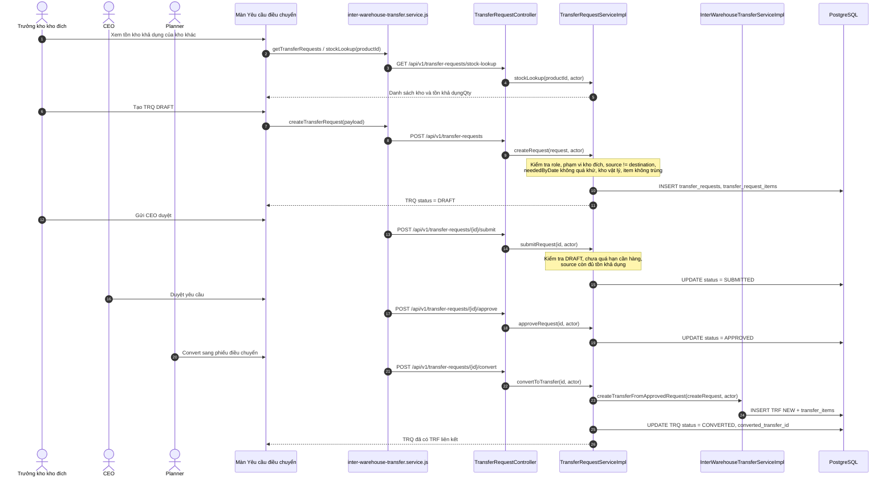
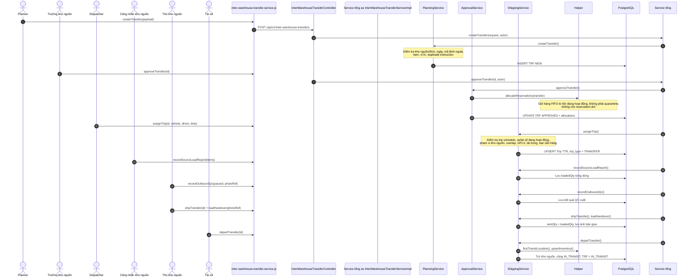
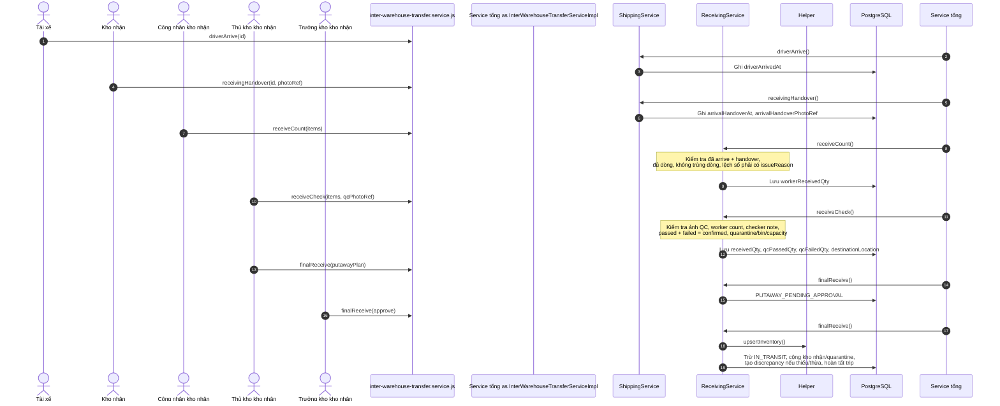

# Phân Tích Cấu Trúc – Luồng – Kết Nối Chức Năng Điều Chuyển Nội Bộ

---

## 1. TÓM TẮT TỔNG QUAN

Chức năng **Điều chuyển nội bộ** thuộc Spec 005 của hệ thống WMS. Mục tiêu là chuyển hàng giữa các kho vật lý Hải Phòng, Hà Nội, Hồ Chí Minh mà vẫn giữ được kiểm soát tồn kho, xe/tài xế, QC, chênh lệch và audit.

Hệ thống chia luồng thành 3 lớp mã nghiệp vụ:

- **TRQ - Yêu cầu điều chuyển**:
  - Trưởng kho đang thiếu hàng xem tồn kho khác, tạo yêu cầu `TRQ-*`, gửi CEO duyệt.
  - CEO duyệt hoặc từ chối.
  - Planner chỉ được chuyển yêu cầu đã duyệt thành phiếu `TRF`.
- **TRF - Phiếu điều chuyển thực thi**:
  - Planner tạo phiếu.
  - Trưởng kho nguồn duyệt và hệ thống giữ hàng FIFO.
  - Kho nguồn xếp hàng, QC xuất, chốt số lượng gửi.
  - Kho nhận đếm hàng, QC nhận, nhập kho cuối.
- **TTR - Chuyến xe điều chuyển**:
  - Dispatcher gán xe/tài xế cho phiếu `TRF`.
  - Tài xế xác nhận rời kho, đến kho nhận hoặc quay đầu về kho nguồn nếu có ngoại lệ.

**Điểm bắt đầu chuẩn**: Trưởng kho kho đích tạo `TRQ` từ tồn kho khả dụng của kho khác.
**Điểm bắt đầu rút gọn**: Planner tạo trực tiếp `TRF` nếu đã có lệnh điều phối bên ngoài.

**Kiến trúc tổng thể**:

- **Frontend**: React service `inter-warehouse-transfer.service.js` gọi REST API.
- **Backend**: Spring Boot, controller riêng cho `TRQ` và `TRF`, service chia theo giai đoạn.
- **Database**: PostgreSQL; tồn kho đang đi được giữ trong kho ảo `IN_TRANSIT`.
- **Audit**: mọi thao tác thay đổi dữ liệu nghiệp vụ quan trọng đều ghi audit log.

Ghi chú đọc tài liệu: các link trỏ sang mã nguồn có dạng `file:line`; số sau dấu `:` là dòng bắt đầu của class, hàm hoặc đoạn validate đang được mô tả.

---

## 2. BẢN ĐỒ CẤU TRÚC (CÁC MẢNH VÀ VAI TRÒ)

| File | Vai trò | Loại |
| :--- | :--- | :--- |
| [inter-warehouse-transfer.service.js:211](../frontend/src/services/inter-warehouse-transfer.service.js:211) | bộ gọi API của frontend cho cả `TRQ`, `TRF`, ảnh bằng chứng, discrepancy và return | FE Service |
| [TransferRequestController.java:84](../backend/src/main/java/com/wms/controller/warehouse_transfer/TransferRequestController.java:84) | Nhận yêu cầu REST cho yêu cầu điều chuyển `TRQ`: tạo, sửa, hủy mềm, submit, CEO duyệt/từ chối, convert | BE Bộ điều khiển |
| [InterWarehouseTransferController.java:78](../backend/src/main/java/com/wms/controller/warehouse_transfer/InterWarehouseTransferController.java:78) | Nhận yêu cầu REST cho phiếu điều chuyển `TRF`: lập phiếu, duyệt, gán xe, ship, depart, receive, return, quarantine | BE Bộ điều khiển |
| [TransferRequestServiceImpl.java:71](../backend/src/main/java/com/wms/service/warehouse_transfer/impl/TransferRequestServiceImpl.java:71) | Nghiệp vụ của `TRQ`: kiểm quyền trưởng kho, ngày cần hàng, tồn nguồn, CEO approval, convert sang `TRF` | BE Service |
| [InterWarehouseTransferServiceImpl.java:81](../backend/src/main/java/com/wms/service/warehouse_transfer/impl/InterWarehouseTransferServiceImpl.java:81) | Service cửa vào cho `TRF`, controller gọi vào đây rồi class này chuyển tiếp sang service theo giai đoạn | BE Service tổng |
| [InterWarehouseTransferPlanningService.java:65](../backend/src/main/java/com/wms/service/warehouse_transfer/impl/InterWarehouseTransferPlanningService.java:65) | Lập/sửa/hủy phiếu `TRF` khi còn `NEW` hoặc `APPROVED` chưa xuất | BE Service |
| [InterWarehouseTransferApprovalService.java:48](../backend/src/main/java/com/wms/service/warehouse_transfer/impl/InterWarehouseTransferApprovalService.java:48) | Trưởng kho nguồn duyệt/từ chối phiếu; khi duyệt thì giữ hàng FIFO | BE Service |
| [InterWarehouseTransferShippingService.java:83](../backend/src/main/java/com/wms/service/warehouse_transfer/impl/InterWarehouseTransferShippingService.java:83) | Gán chuyến xe, báo cáo xếp hàng, QC xuất, chốt gửi, bàn giao, depart, arrive, chặng quay đầu | BE Service |
| [InterWarehouseTransferReceivingService.java:89](../backend/src/main/java/com/wms/service/warehouse_transfer/impl/InterWarehouseTransferReceivingService.java:89) | Nhận hàng, QC nhận, putaway, nhập kho cuối, quarantine, discrepancy, wrong-SKU return | BE Service |
| [InterWarehouseTransferHelper.java:80](../backend/src/main/java/com/wms/service/warehouse_transfer/impl/InterWarehouseTransferHelper.java:80) | Helper dùng chung: quyền kho, trạng thái, reservation, tồn kho, hạn cần hàng, audit, ánh xạ dữ liệu phản hồi | BE Helper |
| [TransferReturnRequest.java:1](../backend/src/main/java/com/wms/dto/request/TransferReturnRequest.java:1) | DTO cho các hành động xe quay đầu hoặc báo sai SKU | BE DTO |

---

## 3. BẢN ĐỒ KẾT NỐI (AI GỌI AI, DỮ LIỆU TRUYỀN QUA ĐÂU)

### 3.1. Architecture Diagram

```mermaid
graph TD
    subgraph Frontend["Frontend React"]
        UI_Request["Màn Yêu cầu điều chuyển"]
        UI_Transfer["Màn Phiếu điều chuyển"]
        UI_Driver["Màn Chuyến xe của tôi"]
        API["inter-warehouse-transfer.service.js"]

        UI_Request -->|create/submit/approve/convert TRQ| API
        UI_Transfer -->|create/approve/ship/receive TRF| API
        UI_Driver -->|depart/arrive/return| API
    end

    subgraph Backend["Backend Spring Boot"]
        TRQ_Ctrl["TransferRequestController"]
        TRF_Ctrl["InterWarehouseTransferController"]
        TRQ_Svc["TransferRequestServiceImpl"]
        Service tổng["InterWarehouseTransferServiceImpl"]
        Planning["PlanningService"]
        Approval["ApprovalService"]
        Shipping["ShippingService"]
        Receiving["ReceivingService"]
        Helper["InterWarehouseTransferHelper"]

        API -->|/api/v1/transfer-requests| TRQ_Ctrl
        API -->|/api/v1/inter-warehouse-transfers| TRF_Ctrl
        TRQ_Ctrl --> TRQ_Svc
        TRF_Ctrl --> Service tổng
        Service tổng --> Planning
        Service tổng --> Approval
        Service tổng --> Shipping
        Service tổng --> Receiving
        TRQ_Svc --> Service tổng
        Planning --> Helper
        Approval --> Helper
        Shipping --> Helper
        Receiving --> Helper
    end

    subgraph Storage["Database / Storage"]
        DB_TRQ[("transfer_requests")]
        DB_TRF[("transfers / transfer_items")]
        DB_Trip[("trips")]
        DB_Inventory[("inventories / allocations")]
        DB_Audit[("audit_logs")]
        Uploads[("uploads/transfer")]

        TRQ_Svc --> DB_TRQ
        Planning --> DB_TRF
        Approval --> DB_Inventory
        Shipping --> DB_Trip
        Shipping --> DB_Inventory
        Receiving --> DB_Inventory
        Helper --> DB_Audit
        Service tổng --> Uploads
    end
```

### 3.2. Bảng mô tả kết nối

| Từ | Đến | Cách kết nối | Dữ liệu truyền |
| :--- | :--- | :--- | :--- |
| Màn yêu cầu điều chuyển | `inter-warehouse-transfer.service.js` | Gọi hàm `createTransferRequest`, `submitTransferRequest`, `approveTransferRequest`, `convertTransferRequest` | `sourceWarehouseId`, `destinationWarehouseId`, `neededByDate`, `businessReason`, `items` |
| `inter-warehouse-transfer.service.js` | `TransferRequestController` | REST `/api/v1/transfer-requests` | JSON yêu cầu/phản hồi `TransferRequest*` |
| `TransferRequestController` | `TransferRequestServiceImpl` | Java method call | `TransferRequestCreateRequest`, actor hiện tại |
| `TransferRequestServiceImpl` | `InterWarehouseTransferServiceImpl` | Gọi `createTransferFromApprovedRequest()` khi convert | `InterWarehouseTransferCreateRequest` được dựng từ `TRQ` |
| Màn phiếu điều chuyển | `inter-warehouse-transfer.service.js` | Gọi `createTransfer`, `approveTransfer`, `assignTrip`, `shipTransfer`, `receiveCheck`, `finalReceive` | DTO theo từng bước |
| `inter-warehouse-transfer.service.js` | `InterWarehouseTransferController` | REST `/api/v1/inter-warehouse-transfers` | JSON yêu cầu/phản hồi `InterWarehouseTransfer*` |
| `InterWarehouseTransferController` | `InterWarehouseTransferServiceImpl` | Java method call | id phiếu, yêu cầu DTO, actor |
| `InterWarehouseTransferServiceImpl` | Planning/Approval/Shipping/Receiving | Chuyển tiếp xử lý theo giai đoạn | Cùng một `InterWarehouseTransfer` chạy qua từng service |
| Shipping/Receiving | `InterWarehouseTransferHelper` | Gọi helper dùng chung | Kiểm quyền kho, status, hạn cần hàng, tồn kho, audit |
| `uploadPhotoEvidence` | `uploads/transfer` | Multipart upload | File ảnh -> `photoRef` ngắn lưu vào action nghiệp vụ |

---

## 4. LUỒNG XỬ LÝ THEO TRÌNH TỰ

### 4.1. Luồng TRQ: Trưởng Kho Tạo Yêu Cầu -> CEO Duyệt -> Planner Convert



### 4.2. Luồng TRF: Lập Phiếu -> Giữ Hàng -> Gán Xe -> Xuất Kho



### 4.3. Luồng Nhận Hàng: Arrive -> Count -> QC -> Final Receive



---

## 5. VAI TRÒ TỪNG ĐOẠN CODE QUAN TRỌNG

### 5.1. Bộ điều khiển `TRQ`: điểm vào của yêu cầu điều chuyển

File: [TransferRequestController.java:84](../backend/src/main/java/com/wms/controller/warehouse_transfer/TransferRequestController.java:84) (dòng 84)
Dòng source: `TransferRequestController.java:84`

```java
@PostMapping
@PreAuthorize("hasRole('WAREHOUSE_MANAGER')")
public ResponseEntity<TransferRequestResponse> createRequest(
        @Valid @RequestBody TransferRequestCreateRequest request) {
    User actor = currentUserService.getRequiredCurrentUser();
    TransferRequestResponse response = requestService.createRequest(request, actor);
    return ResponseEntity.status(HttpStatus.CREATED).body(response);
}

@PostMapping("/{id}/convert")
@PreAuthorize("hasAnyRole('PLANNER','CEO','ADMIN')")
public ResponseEntity<TransferRequestResponse> convertToTransfer(@PathVariable Long id) {
    User actor = currentUserService.getRequiredCurrentUser();
    return ResponseEntity.ok(requestService.convertToTransfer(id, actor));
}
```

Ý nghĩa:

- `createRequest`: chỉ trưởng kho được tạo `TRQ`.
- `convertToTransfer`: Planner/Admin chuyển `TRQ APPROVED` thành `TRF`; controller không tự xử lý nghiệp vụ mà chuyển xuống service.

### 5.2. Service `TRQ`: kiểm tra ngày cần hàng và convert sang `TRF`

File: [TransferRequestServiceImpl.java:406](../backend/src/main/java/com/wms/service/warehouse_transfer/impl/TransferRequestServiceImpl.java:406) (dòng 406)
Dòng source: `TransferRequestServiceImpl.java:406`

```java
private void ensureNeededByDateIsNotPast(LocalDate neededByDate) {
    if (neededByDate != null && neededByDate.isBefore(LocalDate.now())) {
        throw new BusinessRuleViolationException("NEEDED_BY_DATE_MUST_NOT_BE_PAST");
    }
}

private boolean autoCancelExpiredRequest(TransferRequest req, User actor) {
    if (req.getNeededByDate() != null
            && req.getNeededByDate().isBefore(LocalDate.now())
            && req.getStatus() != TransferRequestStatus.CANCELLED
            && req.getStatus() != TransferRequestStatus.CONVERTED
            && req.getStatus() != TransferRequestStatus.REJECTED) {
        Map<String, Object> before = snapshot(req);
        req.setStatus(TransferRequestStatus.CANCELLED);
        req.setUpdatedAt(OffsetDateTime.now());
        TransferRequest saved = yêu cầuRepository.save(req);
        auditUtil.logChange(actor, AuditAction.CANCEL, "TRANSFER_REQUEST",
                saved.getId(), saved.getRequestNumber(), before, snapshot(saved));
        return true;
    }
    return false;
}
```

Ý nghĩa:

- Không cho tạo/sửa `TRQ` với ngày cần hàng đã qua.
- Nếu đã quá ngày cần hàng ở các bước submit/approve/convert, hệ thống tự hủy yêu cầu để Planner không tạo phiếu trễ.

```java
LocalDate plannedDate = req.getNeededByDate() != null
        ? req.getNeededByDate()
        : LocalDate.now().plusDays(2);

InterWarehouseTransferCreateRequest createRequest = new InterWarehouseTransferCreateRequest(
        req.getRequestNumber(),
        req.getSourceWarehouse().getId(),
        req.getDestinationWarehouse().getId(),
        LocalDate.now(),
        plannedDate,
        req.getNotes(),
        itemRequests
);

InterWarehouseTransferResponse transferResponse =
        transferService.createTransferFromApprovedRequest(createRequest, actor);
```

Ý nghĩa:

- Khi convert, `plannedDate` của `TRF` lấy theo `neededByDate`.
- Mã `TRQ` được dùng làm mã tham chiếu ngoài để truy ngược nguồn tạo phiếu.

### 5.3. Service tổng `TRF`: controller gọi một chỗ, nghiệp vụ tách theo giai đoạn

File: [InterWarehouseTransferServiceImpl.java:142](../backend/src/main/java/com/wms/service/warehouse_transfer/impl/InterWarehouseTransferServiceImpl.java:142) (dòng 142)
Dòng source: `InterWarehouseTransferServiceImpl.java:142`

```java
@Override
public InterWarehouseTransferResponse assignTrip(
        Long id,
        InterWarehouseTransferTripAssignRequest request,
        User actor) {
    return shippingService.assignTrip(id, request, actor);
}

@Override
public InterWarehouseTransferResponse receiveCheck(
        Long id,
        InterWarehouseTransferReceiveCheckRequest request,
        User actor) {
    return receivingService.receiveCheck(id, request, actor);
}
```

Ý nghĩa:

- `InterWarehouseTransferServiceImpl` là service tổng.
- Nó không ôm hết logic mà điều hướng sang `PlanningService`, `ApprovalService`, `ShippingService`, `ReceivingService`.
- Cách tách này giúp nhìn flow theo giai đoạn rất rõ.

### 5.4. Helper: hạn cần hàng cứng của ngày cần hàng

File: [InterWarehouseTransferHelper.java:205](../backend/src/main/java/com/wms/service/warehouse_transfer/impl/InterWarehouseTransferHelper.java:205) (dòng 205)
Dòng source: `InterWarehouseTransferHelper.java:205`

```java
public LocalDate requiredArrivalDate(InterWarehouseTransfer transfer) {
    if (transfer.getTransferRequest() != null
            && transfer.getTransferRequest().getNeededByDate() != null) {
        return transfer.getTransferRequest().getNeededByDate();
    }
    return transfer.getPlannedDate();
}

public void ensureTripArrivesWithinRequiredDate(
        InterWarehouseTransfer transfer,
        LocalDateTime plannedEndAt) {
    LocalDateTime hạn cần hàngExclusive = requiredArrivalEndAt(transfer);
    if (hạn cần hàngExclusive != null && !plannedEndAt.isBefore(hạn cần hàngExclusive)) {
        throw new BusinessRuleViolationException(
                "TRIP_END_MUST_NOT_BE_AFTER_REQUIRED_DATE");
    }
}
```

Ý nghĩa:

- Deadline ưu tiên lấy từ `TRQ.neededByDate`; phiếu thủ công dùng `TRF.plannedDate`.
- Dispatcher không được lập chuyến có giờ kết thúc sau cuối ngày cần hàng.

### 5.5. Shipping: gán chuyến xe và kiểm tài nguyên vận tải

File: [InterWarehouseTransferShippingService.java:83](../backend/src/main/java/com/wms/service/warehouse_transfer/impl/InterWarehouseTransferShippingService.java:83) (dòng 83)
Dòng source: `InterWarehouseTransferShippingService.java:83`

```java
public InterWarehouseTransferResponse assignTrip(
        Long id,
        InterWarehouseTransferTripAssignRequest request,
        User actor) {
    InterWarehouseTransfer transfer = helper.findTransfer(id);
    helper.requireStatus(transfer, InterWarehouseTransferStatus.APPROVED);
    if (autoCancelIfDeadlineExpiredBeforeDeparture(transfer, actor)) {
        return helper.toResponse(transfer);
    }

    validateTripSchedule(request);
    Vehicle vehicle = vehicleRepository.findById(request.vehicleId())
            .orElseThrow(() -> new ResourceNotFoundException("Vehicle not found"));
    Driver driver = driverRepository.findById(request.driverId())
            .orElseThrow(() -> new ResourceNotFoundException("Driver not found"));

    helper.ensureTripArrivesWithinRequiredDate(transfer, request.plannedEndAt());
    ensureVehicleAndDriverSchedulable(vehicle, driver,
            request.plannedStartAt(), request.plannedEndAt(), excludedTripId);
    ensureVehicleBelongsToSourceWarehouse(transfer, vehicle);
    ensureDriverBelongsToSourceWarehouse(transfer, driver);
}
```

Ý nghĩa:

- Chỉ phiếu `APPROVED` mới được gán xe.
- Nếu quá hạn cần hàng trước departure thì phiếu bị hủy và trả reservation.
- Xe/tài xế phải hợp lệ, đúng kho nguồn, không trùng lịch, không quá tải và không vượt hạn cần hàng.

### 5.6. Shipping: depart là lúc hàng thật sự rời kho

File: [InterWarehouseTransferShippingService.java:361](../backend/src/main/java/com/wms/service/warehouse_transfer/impl/InterWarehouseTransferShippingService.java:361) (dòng 361)
Dòng source: `InterWarehouseTransferShippingService.java:361`

```java
public InterWarehouseTransferResponse departTransfer(Long id, User actor) {
    InterWarehouseTransfer transfer = helper.findTransfer(id);
    helper.requireStatus(transfer, InterWarehouseTransferStatus.APPROVED);
    if (autoCancelIfDeadlineExpiredBeforeDeparture(transfer, actor)) {
        return helper.toResponse(transfer);
    }
    ensureAssignedDriver(transfer, actor);
    ensureSourceLoadReadyForQc(transfer);
    ensureNoSourceLoadRework(transfer);
    ensureAllSent(transfer);

    if (transfer.getOutboundQcPassed() == null || !transfer.getOutboundQcPassed()) {
        throw new BusinessRuleViolationException("OUTBOUND_QC_NOT_PASSED");
    }
    if (transfer.getLoadHandoverPhotoRef() == null) {
        throw new BusinessRuleViolationException("LOAD_HANDOVER_REQUIRED");
    }

    moveSourceToTransit(transfer);
    transfer.getTrip().setStatus(TripStatus.IN_TRANSIT);
    transfer.setStatus(InterWarehouseTransferStatus.IN_TRANSIT);
}
```

Ý nghĩa:

- Đây là mốc inventory quan trọng nhất ở kho nguồn.
- Trước depart, hàng chỉ đang được reserve.
- Sau depart, hệ thống trừ tồn kho nguồn và cộng hàng sang kho ảo `IN_TRANSIT`.

### 5.7. Receiving: kiểm nhận hàng và QC tại kho nhận

File: [InterWarehouseTransferReceivingService.java:438](../backend/src/main/java/com/wms/service/warehouse_transfer/impl/InterWarehouseTransferReceivingService.java:438) (dòng 438)
Dòng source: `InterWarehouseTransferReceivingService.java:438`

```java
private void validateReceiveCheckLine(
        InterWarehouseTransfer transfer,
        InterWarehouseTransferItem item,
        InterWarehouseTransferReceiveCheckItemRequest line) {
    if (item.getWorkerReceivedQty() == null) {
        throw new BusinessRuleViolationException("WORKER_COUNT_REQUIRED");
    }
    if (line.confirmedQty().compareTo(item.getWorkerReceivedQty()) != 0
            && helper.isBlank(line.checkerNote())) {
        throw new BusinessRuleViolationException("CHECKER_NOTE_REQUIRED");
    }
    if (line.qcPassedQty().add(line.qcFailedQty()).compareTo(line.confirmedQty()) != 0) {
        throw new BusinessRuleViolationException("QC_TOTAL_MUST_MATCH_CONFIRMED_QTY");
    }
    if (line.qcFailedQty().signum() > 0 && helper.isBlank(line.qcFailureReason())) {
        throw new BusinessRuleViolationException("QC_FAILURE_REASON_REQUIRED");
    }
}
```

Ý nghĩa:

- Thủ kho không được QC nếu công nhân chưa đếm.
- Nếu thủ kho sửa số công nhân đếm thì phải có ghi chú.
- Tổng số QC đạt và lỗi phải khớp số xác nhận.
- Hàng lỗi QC bắt buộc có lý do để tạo quarantine trace.

### 5.8. Receiving: nhập kho cuối mới ghi tồn kho nhận

File: [InterWarehouseTransferReceivingService.java:192](../backend/src/main/java/com/wms/service/warehouse_transfer/impl/InterWarehouseTransferReceivingService.java:192) (dòng 192)
Dòng source: `InterWarehouseTransferReceivingService.java:192`

```java
public InterWarehouseTransferResponse finalReceive(
        Long id,
        InterWarehouseTransferFinalReceiveRequest request,
        User actor) {
    InterWarehouseTransfer transfer = helper.findTransfer(id);
    helper.ensureWarehouseScope(actor, targetWarehouseId);
    ensureAllChecked(transfer);

    if (transfer.getStatus() == InterWarehouseTransferStatus.IN_TRANSIT
            && actor.getRole() == UserRole.STOREKEEPER) {
        return submitPutawayPlan(transfer, request, actor);
    }

    helper.requireStatus(transfer, InterWarehouseTransferStatus.PUTAWAY_PENDING_APPROVAL);
    if (actor.getRole() == UserRole.STOREKEEPER) {
        throw new BusinessRuleViolationException("WAREHOUSE_MANAGER_APPROVAL_REQUIRED");
    }

    moveTransitToDestination(transfer, approvedRequest, actor);
    transfer.setStatus(discrepancy
            ? InterWarehouseTransferStatus.COMPLETED_WITH_DISCREPANCY
            : InterWarehouseTransferStatus.COMPLETED);
}
```

Ý nghĩa:

- Thủ kho chỉ nộp kế hoạch putaway.
- Quản lý kho/CEO/Admin mới là người duyệt cuối.
- Final receive là lúc hàng rời `IN_TRANSIT` và vào kho nhận/quarantine.

---

## 6. DỮ LIỆU DI CHUYỂN NHƯ THẾ NÀO

### 6.1. Dữ liệu từ TRQ sang TRF

```text
Form tạo yêu cầu điều chuyển
   │
   │ payload:
   │ { sourceWarehouseId, destinationWarehouseId, neededByDate, businessReason, items[] }
   ▼
POST /api/v1/transfer-requests
   ▼
TransferRequestServiceImpl.createRequest()
   ├── kiểm tra role WAREHOUSE_MANAGER
   ├── kiểm tra warehouse phạm vi
   ├── kiểm tra ngày cần hàng
   └── save transfer_requests + transfer_request_items
   ▼
TRQ DRAFT
   │
   ▼ submit + CEO approve
TRQ APPROVED
   │
   ▼ Planner convert
TransferRequestServiceImpl.convertToTransfer()
   ├── copy source/destination
   ├── copy product lines
   ├── externalInstructionCode = yêu cầuNumber
   └── plannedDate = neededByDate
   ▼
TRF NEW
```

### 6.2. Dữ liệu tồn kho khi xe rời kho

```text
TRF APPROVED
   │
   ▼ Source manager approve
InterWarehouseTransferHelper.allocateReservations()
   ├── tìm FIFO inventory tại kho nguồn
   ├── tăng reservedQty
   └── tạo transfer allocations
   ▼
Hàng đang được giữ chỗ, chưa rời kho
   │
   ▼ Driver depart
ShippingService.moveSourceToTransit()
   ├── trừ source.totalQty
   ├── trừ source.reservedQty
   ├── cộng IN_TRANSIT.totalQty
   └── giữ batch/cost từ allocation
   ▼
TRF IN_TRANSIT
```

### 6.3. Dữ liệu khi kho nhận nhập kho cuối

```text
TRF IN_TRANSIT
   │
   ▼ receive-count
workerReceivedQty
   │
   ▼ receive-check
receivedQty, qcPassedQty, qcFailedQty, destinationLocationId
   │
   ▼ final-receive
ReceivingService.moveTransitToDestination()
   ├── trừ IN_TRANSIT
   ├── qcPassedQty -> vị trí thường kho nhận
   ├── qcFailedQty -> quarantine bin
   ├── shortage -> TRANSFER_DISCREPANCY + DiscrepancyIncident OPEN
   └── over-receipt -> DiscrepancyIncident OVER_RECEIPT + hold entry
   ▼
COMPLETED hoặc COMPLETED_WITH_DISCREPANCY
```

---

## 7. BẢNG TRA CỨU TỔNG HỢP

| Bước | File | Function/API | Kết nối tới | Dữ liệu di chuyển | Ghi chú |
| :--- | :--- | :--- | :--- | :--- | :--- |
| TRQ-01 | [inter-warehouse-transfer.service.js:211](../frontend/src/services/inter-warehouse-transfer.service.js:211) | `createTransferRequest()` | `POST /transfer-requests` | Header + items yêu cầu | Frontend tạo `TRQ DRAFT` |
| TRQ-02 | [TransferRequestServiceImpl.java:92](../backend/src/main/java/com/wms/service/warehouse_transfer/impl/TransferRequestServiceImpl.java:92) | `createRequest()` | `TransferRequestRepository` | `TransferRequest`, `TransferRequestItem` | Kiểm tra role, kho, ngày, item |
| TRQ-03 | [TransferRequestServiceImpl.java:181](../backend/src/main/java/com/wms/service/warehouse_transfer/impl/TransferRequestServiceImpl.java:181) | `submitRequest()` | `InventoryRepository` | Số lượng yêu cầu so với tồn khả dụng | Kiểm tồn nguồn trước khi gửi CEO |
| TRQ-04 | [TransferRequestServiceImpl.java:209](../backend/src/main/java/com/wms/service/warehouse_transfer/impl/TransferRequestServiceImpl.java:209) | `approveRequest()` | Audit + DB | `SUBMITTED -> APPROVED` | CEO duyệt |
| TRQ-05 | [TransferRequestServiceImpl.java:270](../backend/src/main/java/com/wms/service/warehouse_transfer/impl/TransferRequestServiceImpl.java:270) | `convertToTransfer()` | `InterWarehouseTransferServiceImpl` | `TRQ -> InterWarehouseTransferCreateRequest` | Sinh `TRF NEW` |
| TRF-01 | [InterWarehouseTransferPlanningService.java:65](../backend/src/main/java/com/wms/service/warehouse_transfer/impl/InterWarehouseTransferPlanningService.java:65) | `createTransfer()` | `InterWarehouseTransferRepository` | Header + item lines | Planner tạo phiếu |
| TRF-02 | [InterWarehouseTransferApprovalService.java:48](../backend/src/main/java/com/wms/service/warehouse_transfer/impl/InterWarehouseTransferApprovalService.java:48) | `approveTransfer()` | `Helper.allocateReservations()` | Inventory FIFO -> allocations | Giữ hàng nguồn |
| TRF-03 | [InterWarehouseTransferShippingService.java:83](../backend/src/main/java/com/wms/service/warehouse_transfer/impl/InterWarehouseTransferShippingService.java:83) | `assignTrip()` | `TripRepository`, vehicle/driver repos | Vehicle, driver, schedule | Tạo/cập nhật `TTR` |
| TRF-04 | [InterWarehouseTransferShippingService.java:178](../backend/src/main/java/com/wms/service/warehouse_transfer/impl/InterWarehouseTransferShippingService.java:178) | `recordSourceLoadReport()` | `TransferItemRepository` | `loadedQty` | Công nhân báo số lượng xếp |
| TRF-05 | [InterWarehouseTransferShippingService.java:299](../backend/src/main/java/com/wms/service/warehouse_transfer/impl/InterWarehouseTransferShippingService.java:299) | `recordOutboundQc()` | `TransferRepository` | QC result, note, photoRef | QC fail thì khóa depart |
| TRF-06 | [InterWarehouseTransferShippingService.java:361](../backend/src/main/java/com/wms/service/warehouse_transfer/impl/InterWarehouseTransferShippingService.java:361) | `departTransfer()` | Inventory + Trip | Source -> `IN_TRANSIT` | Mốc hàng thật sự rời kho |
| REC-01 | [InterWarehouseTransferShippingService.java:580](../backend/src/main/java/com/wms/service/warehouse_transfer/impl/InterWarehouseTransferShippingService.java:580) | `driverArrive()` | Transfer | `driverArrivedAt` | Tài xế đến kho nhận |
| REC-02 | [InterWarehouseTransferReceivingService.java:89](../backend/src/main/java/com/wms/service/warehouse_transfer/impl/InterWarehouseTransferReceivingService.java:89) | `receiveCount()` | Transfer items | `workerReceivedQty` | Công nhân đếm hàng |
| REC-03 | [InterWarehouseTransferReceivingService.java:144](../backend/src/main/java/com/wms/service/warehouse_transfer/impl/InterWarehouseTransferReceivingService.java:144) | `receiveCheck()` | Transfer items + locations | QC qty, location, photoRef | Thủ kho kiểm/QC |
| REC-04 | [InterWarehouseTransferReceivingService.java:192](../backend/src/main/java/com/wms/service/warehouse_transfer/impl/InterWarehouseTransferReceivingService.java:192) | `finalReceive()` | Inventory, quarantine, discrepancy | `IN_TRANSIT -> kho nhận` | Duyệt cuối và đóng phiếu |
| RTN-01 | [InterWarehouseTransferReceivingService.java:875](../backend/src/main/java/com/wms/service/warehouse_transfer/impl/InterWarehouseTransferReceivingService.java:875) | `requestReturn()` | Wrong SKU report | expected/actual SKU, qty, reason | Báo sai SKU |
| RTN-02 | [InterWarehouseTransferShippingService.java:635](../backend/src/main/java/com/wms/service/warehouse_transfer/impl/InterWarehouseTransferShippingService.java:635) | `returnDepart()` / `returnArrive()` | Transfer trip | return timestamps | Xe quay đầu |

---

## 8. PHÂN TÍCH CHI TIẾT NGỮ CẢNH BỔ SUNG

### 8.1. Vì sao cần tách `TRQ` và `TRF`

`TRQ` là nhu cầu kinh doanh: kho đích thiếu hàng và xin CEO duyệt.
`TRF` là chứng từ vận hành: kho nguồn giữ hàng, điều phối xe, xuất kho, nhận kho.

Tách như vậy giúp:

- CEO duyệt nhu cầu nhưng chưa làm thay đổi tồn kho.
- Tồn kho chỉ bị giữ khi trưởng kho nguồn duyệt `TRF`.
- Planner không được tự biến mọi đề xuất thành phiếu vận hành nếu CEO chưa duyệt.

### 8.2. Vì sao depart mới chuyển tồn sang `IN_TRANSIT`

Trước khi depart, hàng vẫn nằm ở kho nguồn, chỉ đang được reserved. Nếu chuyến bị hủy trước departure thì có thể release reservation an toàn.

Sau depart, hàng đã rời kho vật lý nên hệ thống phải:

- Trừ `totalQty` ở kho nguồn.
- Trừ `reservedQty` đã giữ.
- Cộng `totalQty` vào kho ảo `IN_TRANSIT`.
- Giữ batch/cost theo allocation FIFO để khi nhập kho nhận không mất giá vốn và truy vết.

### 8.3. Ngày cần hàng là hạn cần hàng cứng

Rule mới của luồng:

- Nếu cần hàng ngày `01/08`, chuyến xe không được lập để tới `02/08`.
- Nếu quá ngày cần hàng trước khi xe rời kho: `TRQ/TRF` bị hủy theo rule.
- Nếu xe đang đi mà quá hạn: không cancel mất dấu hàng, bắt chuyển sang nhánh quay đầu về kho nguồn.

Code liên quan:

- `TransferRequestServiceImpl.autoCancelExpiredRequest()`.
- `InterWarehouseTransferHelper.requiredArrivalDate()`.
- `InterWarehouseTransferHelper.ensureTripArrivesWithinRequiredDate()`.
- `InterWarehouseTransferShippingService.autoCancelIfDeadlineExpiredBeforeDeparture()`.
- `InterWarehouseTransferShippingService.autoForceReturnIfDeadlineMissedInTransit()`.

### 8.4. QC fail và quarantine

QC xuất fail ở kho nguồn chưa làm phát sinh quarantine; nó buộc công nhân xếp/kiểm lại trước khi xe rời kho.

QC nhận fail ở kho nhận mới tạo quarantine stock vì lúc này hàng đã tới điểm nhận và được xác nhận vật lý.

Luồng xử lý:

```text
receiveCheck(qcFailedQty > 0)
   ├── bắt qcFailureReason
   ├── kiểm tra có quarantine bin
   ▼
finalReceive()
   ├── qcPassedQty -> vị trí thường
   └── qcFailedQty -> quarantine + QuarantineRecord origin INTERNAL_TRANSFER
```

### 8.5. Sai SKU và xe quay đầu

Sai SKU còn nguyên vẹn không nên nhập kho thường và cũng không nên đưa thẳng đi disposal. Hệ thống tạo nhánh return:

1. Thủ kho kho đích báo wrong SKU.
2. Trưởng kho kho đích duyệt return.
3. Tài xế quay đầu về kho nguồn.
4. Kho nguồn nhận lại hàng bằng cùng flow count -> check/QC -> nhập kho cuối.

### 8.6. Các helper có tác dụng gì

`InterWarehouseTransferHelper` gom các rule nền tảng để service con không phải viết lại:

- `findTransfer()`: lấy phiếu kèm chi tiết.
- `items()` / `itemMap()` / `requireItem()`: đọc và kiểm dòng hàng thuộc đúng phiếu.
- `requireStatus()`: chặn thao tác sai trạng thái.
- `ensureWarehouseScope()`: kiểm người dùng có quyền trong kho liên quan.
- `allocateReservations()` / `releaseReservations()`: giữ và trả hàng nguồn.
- `upsertInventory()`: ghi tăng tồn có khóa dòng.
- `requiredArrivalDate()` / `ensureTripArrivesWithinRequiredDate()`: rule hạn cần hàng.
- `findQuarantineLocation()` / `firstTransitLocation()`: tìm vị trí hệ thống cho quarantine và `IN_TRANSIT`.
- `audit()` / `snapshot()`: ghi lịch sử trước/sau.

### 8.7. Kết luận ngắn

Luồng điều chuyển nội bộ chạy đúng trục:

```text
TRQ DRAFT
 -> SUBMITTED
 -> APPROVED
 -> CONVERTED/TRF NEW
 -> TRF APPROVED
 -> TTR assigned
 -> source load + outbound QC + ship + handover
 -> depart / IN_TRANSIT
 -> arrive + handover
 -> receive count
 -> receive check
 -> putaway pending approval
 -> nhập kho cuối
 -> COMPLETED hoặc COMPLETED_WITH_DISCREPANCY
```

Điểm quan trọng nhất: **tồn kho chỉ chuyển khỏi kho nguồn ở bước tài xế depart**, và **tồn kho chỉ vào kho nhận ở bước nhập kho cuối được duyệt**.

---

## 9. GIẢI THÍCH CỤ THỂ CÁC ĐOẠN CODE VALIDATE QUAN TRỌNG

Phần này gom các đoạn kiểm tra có ảnh hưởng trực tiếp đến nghiệp vụ. Mỗi đoạn đều có 3 ý: **code làm gì**, **vì sao cần**, và **nếu fail thì chặn luồng nào**.

### 9.1. Kiểm tra ngày cần hàng của `TRQ`

File: [TransferRequestServiceImpl.java:406](../backend/src/main/java/com/wms/service/warehouse_transfer/impl/TransferRequestServiceImpl.java:406) (dòng 406)
Dòng source: `TransferRequestServiceImpl.java:406`

```java
private void ensureNeededByDateIsNotPast(LocalDate neededByDate) {
    if (neededByDate != null && neededByDate.isBefore(LocalDate.now())) {
        throw new BusinessRuleViolationException("NEEDED_BY_DATE_MUST_NOT_BE_PAST");
    }
}
```

**Code làm gì**:

- Kiểm tra `neededByDate` của yêu cầu điều chuyển.
- Nếu ngày cần hàng nhỏ hơn ngày hiện tại thì ném lỗi `NEEDED_BY_DATE_MUST_NOT_BE_PAST`.

**Vì sao cần**:

- `TRQ` là yêu cầu “cần hàng trước/ngày này”.
- Nếu cho tạo yêu cầu ở ngày đã qua, CEO/Planner sẽ xử lý một nhu cầu đã hết hạn, không còn giá trị vận hành.

**Chặn luồng nào**:

- Chặn tạo mới `TRQ`.
- Chặn sửa `TRQ DRAFT` thành ngày quá khứ.

### 9.2. Auto hủy `TRQ` nếu quá ngày cần hàng

File: [TransferRequestServiceImpl.java:412](../backend/src/main/java/com/wms/service/warehouse_transfer/impl/TransferRequestServiceImpl.java:412) (dòng 412)
Dòng source: `TransferRequestServiceImpl.java:412`

```java
private boolean autoCancelExpiredRequest(TransferRequest req, User actor) {
    if (req.getNeededByDate() != null
            && req.getNeededByDate().isBefore(LocalDate.now())
            && req.getStatus() != TransferRequestStatus.CANCELLED
            && req.getStatus() != TransferRequestStatus.CONVERTED
            && req.getStatus() != TransferRequestStatus.REJECTED) {
        Map<String, Object> before = snapshot(req);
        req.setStatus(TransferRequestStatus.CANCELLED);
        req.setUpdatedAt(OffsetDateTime.now());
        TransferRequest saved = yêu cầuRepository.save(req);
        auditUtil.logChange(actor, AuditAction.CANCEL, "TRANSFER_REQUEST",
                saved.getId(), saved.getRequestNumber(), before, snapshot(saved));
        return true;
    }
    return false;
}
```

**Code làm gì**:

- Khi user submit, CEO approve hoặc Planner convert, hệ thống kiểm tra lại ngày cần hàng.
- Nếu đã quá ngày cần hàng và yêu cầu chưa `CONVERTED`, chưa `REJECTED`, chưa `CANCELLED`, hệ thống tự đổi trạng thái sang `CANCELLED`.
- Có ghi audit trước/sau.

**Vì sao cần**:

- Tránh việc Planner convert một yêu cầu đã quá hạn thành phiếu vận hành.
- Ví dụ cần hàng `01/08` nhưng ngày hiện tại đã `02/08`, thì không thể lập chuyến giao `01/08` nữa.

**Chặn luồng nào**:

- Chặn `submitRequest`.
- Chặn `approveRequest`.
- Chặn `convertToTransfer`.

**Tác động dữ liệu**:

- Chỉ đổi `TRQ.status = CANCELLED`.
- Không reserve hàng.
- Không tạo `TRF`.

### 9.3. Kiểm tra nguồn hàng trước khi submit/approve `TRQ`

File: [TransferRequestServiceImpl.java:391](../backend/src/main/java/com/wms/service/warehouse_transfer/impl/TransferRequestServiceImpl.java:391) (dòng 391)
Dòng source: `TransferRequestServiceImpl.java:391`

```java
private void validateSourceAvailability(TransferRequest req) {
    Map<Long, BigDecimal> requestedByProduct = new HashMap<>();
    for (TransferRequestItem item : req.getItems()) {
        Long productId = item.getProduct().getId();
        requestedByProduct.merge(productId, item.getRequestedQty(), BigDecimal::add);
    }
    for (Map.Entry<Long, BigDecimal> entry : requestedByProduct.entrySet()) {
        BigDecimal tồn khả dụng = inventoryRepository.sumValidAvailableQty(
                req.getSourceWarehouse().getId(), entry.getKey());
        BigDecimal safeAvailable = tồn khả dụng == null ? BigDecimal.ZERO : tồn khả dụng;
        if (safeAvailable.compareTo(entry.getValue()) < 0) {
            throw new BusinessRuleViolationException(
                    "TRANSFER_REQUEST_QTY_EXCEEDS_SOURCE_AVAILABLE");
        }
    }
}
```

**Code làm gì**:

- Gom tổng số lượng yêu cầu theo từng sản phẩm.
- Gọi repository tính tồn khả dụng ở kho nguồn.
- Nếu tồn khả dụng nhỏ hơn số lượng yêu cầu thì ném lỗi.

**Vì sao cần**:

- Trưởng kho có thể nhìn thấy tồn lúc tạo request, nhưng tồn có thể thay đổi trước khi submit/CEO approve.
- Backend phải kiểm lại ở thời điểm gửi/duyệt để tránh CEO duyệt một yêu cầu mà kho nguồn không còn hàng.

**Chặn luồng nào**:

- Chặn submit `TRQ`.
- Chặn CEO approve `TRQ`.

**Tác động dữ liệu khi fail**:

- Không đổi status.
- Không tạo reservation.
- Không tạo `TRF`.

### 9.4. Kiểm tra `TRQ` chỉ convert một lần

File: [TransferRequestServiceImpl.java:270](../backend/src/main/java/com/wms/service/warehouse_transfer/impl/TransferRequestServiceImpl.java:270) (dòng 270)
Dòng source: `TransferRequestServiceImpl.java:270`

```java
if (req.getStatus() != TransferRequestStatus.APPROVED) {
    throw new BusinessRuleViolationException("ONLY_APPROVED_CAN_BE_CONVERTED");
}
if (req.getConvertedTransfer() != null) {
    throw new BusinessRuleViolationException("TRANSFER_REQUEST_ALREADY_CONVERTED");
}
if (interWarehouseTransferRepository.existsByTransferRequestIdAndStatusNotIn(
        req.getId(),
        List.of(InterWarehouseTransferStatus.CANCELLED,
                InterWarehouseTransferStatus.REJECTED))) {
    throw new BusinessRuleViolationException("TRANSFER_REQUEST_ALREADY_CONVERTED");
}
```

**Code làm gì**:

- Chỉ cho convert khi `TRQ` đang `APPROVED`.
- Nếu `TRQ` đã gắn `convertedTransfer` thì chặn.
- Nếu trong DB đã có `TRF` đang hoạt động từ cùng `TRQ` thì cũng chặn.

**Vì sao cần**:

- Một yêu cầu CEO duyệt không được sinh ra nhiều phiếu điều chuyển cùng lúc.
- Nếu không chặn, kho nguồn có thể reserve/xuất hàng nhiều lần cho cùng một nhu cầu.

**Chặn luồng nào**:

- Chặn Planner convert trùng.
- Chặn lỗi race khi hai người cùng bấm convert gần như đồng thời.

### 9.5. Kiểm tra tạo/sửa `TRF`: kho, ngày, item và mã lệnh ngoài

File: [InterWarehouseTransferPlanningService.java:77](../backend/src/main/java/com/wms/service/warehouse_transfer/impl/InterWarehouseTransferPlanningService.java:77) (dòng 77)
Dòng source: `InterWarehouseTransferPlanningService.java:77`

```java
ensureCreateScope(actor, request, allowDestinationScopedPlanner);
ensureDifferentWarehouses(request.sourceWarehouseId(), request.destinationWarehouseId());
validateTransferDates(request.documentDate(), request.plannedDate());
ensurePhysicalWarehouses(request.sourceWarehouseId(), request.destinationWarehouseId());
validateTransferItems(request.items(), request.sourceWarehouseId(), request.destinationWarehouseId());
ensureUniqueExternalInstruction(request.externalInstructionCode(),
        request.sourceWarehouseId(),
        request.destinationWarehouseId(),
        request.documentDate(),
        null);
```

**Code làm gì**:

- Kiểm quyền tạo phiếu theo kho.
- Kiểm kho nguồn khác kho đích.
- Kiểm ngày chứng từ/ngày dự kiến.
- Kiểm kho nguồn/kho đích là kho vật lý, không phải `IN_TRANSIT`.
- Kiểm danh sách item.
- Kiểm mã lệnh ngoài không trùng với phiếu đang hoạt động khác.

**Vì sao cần**:

- `TRF` là chứng từ vận hành thật, sau đó có thể reserve hàng và xuất kho.
- Nếu dữ liệu đầu vào sai, các bước sau sẽ ảnh hưởng trực tiếp đến tồn kho.

**Chặn luồng nào**:

- Chặn tạo `TRF` thủ công.
- Chặn convert `TRQ -> TRF` nếu dữ liệu sinh ra không hợp lệ.
- Chặn sửa `TRF NEW` sai rule.

### 9.6. Kiểm tra item điều chuyển không trùng và số lượng nguyên

File: [InterWarehouseTransferPlanningService.java:206](../backend/src/main/java/com/wms/service/warehouse_transfer/impl/InterWarehouseTransferPlanningService.java:206) (dòng 206)
Dòng source: `InterWarehouseTransferPlanningService.java:206`

```java
private void validateTransferItems(List<InterWarehouseTransferItemRequest> requests,
                                   Long sourceWarehouseId,
                                   Long destinationWarehouseId) {
    Set<Long> productIds = new HashSet<>();
    for (InterWarehouseTransferItemRequest request : requests) {
        if (!productIds.add(request.productId())) {
            throw new BusinessRuleViolationException("DUPLICATE_PRODUCT_IN_TRANSFER");
        }
        ensureWholeQuantity(request.plannedQty());
        if (request.sourceLocationId() != null) {
            validateLocation(request.sourceLocationId(), sourceWarehouseId, "INVALID_SOURCE_LOCATION");
        }
        if (request.destinationLocationId() != null) {
            validateLocation(request.destinationLocationId(), destinationWarehouseId, "INVALID_DESTINATION_LOCATION");
        }
    }
}
```

**Code làm gì**:

- Dùng `Set` để phát hiện trùng `productId`.
- Kiểm số lượng là số nguyên.
- Nếu người dùng chọn vị trí nguồn/đích thì vị trí đó phải thuộc đúng kho và hợp lệ.

**Vì sao cần**:

- Hàng gia dụng hiện không quản lý serial/lẻ theo đơn vị thập phân, nên số lượng phải nguyên.
- Mỗi SKU chỉ nên có một dòng để tránh reserve/QC/receive bị tách nhiều dòng khó kiểm soát.

**Chặn luồng nào**:

- Chặn tạo/sửa `TRF` có SKU trùng.
- Chặn số lượng như `1.5`.
- Chặn chọn vị trí sai kho hoặc quarantine cho hàng thường.

### 9.7. Kiểm tra duyệt `TRF` và giữ hàng FIFO

File: [InterWarehouseTransferApprovalService.java:48](../backend/src/main/java/com/wms/service/warehouse_transfer/impl/InterWarehouseTransferApprovalService.java:48) (dòng 48)
Dòng source: `InterWarehouseTransferApprovalService.java:48`

```java
public InterWarehouseTransferResponse approveTransfer(Long id, User actor) {
    InterWarehouseTransfer transfer = helper.findTransfer(id);
    helper.requireStatus(transfer, InterWarehouseTransferStatus.NEW);
    helper.ensureWarehouseScope(actor, transfer.getSourceWarehouse().getId());
    Map<String, Object> before = helper.snapshot(transfer);

    helper.allocateReservations(transfer);

    transfer.setStatus(InterWarehouseTransferStatus.APPROVED);
    transfer.setApprovedBy(actor);
    transfer.setApprovedAt(OffsetDateTime.now());
    transfer.setUpdatedAt(OffsetDateTime.now());
}
```

**Code làm gì**:

- Chỉ cho duyệt phiếu `NEW`.
- Người duyệt phải thuộc kho nguồn.
- Gọi `allocateReservations()` để giữ hàng.
- Sau khi giữ hàng thành công mới đổi trạng thái sang `APPROVED`.

**Vì sao cần**:

- Duyệt phiếu là thời điểm kho nguồn cam kết hàng.
- Nếu đổi status trước rồi mới reserve mà reserve fail, phiếu sẽ thành `APPROVED` nhưng không có hàng giữ chỗ.

**Chặn luồng nào**:

- Chặn duyệt lại phiếu đã duyệt.
- Chặn trưởng kho không thuộc kho nguồn.
- Chặn duyệt khi kho nguồn không đủ hàng.

### 9.8. Kiểm tra reservation không thiếu hàng

File: [InterWarehouseTransferHelper.java:116](../backend/src/main/java/com/wms/service/warehouse_transfer/impl/InterWarehouseTransferHelper.java:116) (dòng 116)
Dòng source: `InterWarehouseTransferHelper.java:116`

```java
BigDecimal tồn khả dụngTotal = candidates.stream()
        .map(inventory -> inventory.getTotalQty().subtract(inventory.getReservedQty()))
        .reduce(BigDecimal.ZERO, BigDecimal::add);
if (tồn khả dụngTotal.compareTo(item.getPlannedQty()) < 0) {
    throw new BusinessRuleViolationException(
            "INSUFFICIENT_AVAILABLE_STOCK: "
                    + item.getProduct().getSku()
                    + " required " + item.getPlannedQty()
                    + ", tồn khả dụng " + tồn khả dụngTotal
                    + " in " + transfer.getSourceWarehouse().getCode());
}
```

**Code làm gì**:

- Tính tổng `tồn khả dụng = totalQty - reservedQty` của các dòng tồn đủ điều kiện.
- Nếu tổng tồn khả dụng nhỏ hơn số cần chuyển thì fail.

**Vì sao cần**:

- Không được để tồn âm.
- Không được reserve hàng đã bị giữ cho phiếu khác.
- Không được reserve hàng quarantine/inđang hoạt động vì repository candidates chỉ lấy tồn đủ điều kiện.

**Chặn luồng nào**:

- Chặn trưởng kho nguồn approve `TRF`.

**Tác động dữ liệu khi fail**:

- Không tạo allocation.
- Không tăng reserved.
- Không đổi status sang `APPROVED`.

### 9.9. Kiểm tra gán chuyến xe không quá hạn cần hàng

File: [InterWarehouseTransferHelper.java:230](../backend/src/main/java/com/wms/service/warehouse_transfer/impl/InterWarehouseTransferHelper.java:230) (dòng 230)
Dòng source: `InterWarehouseTransferHelper.java:230`

```java
public void ensureTripArrivesWithinRequiredDate(
        InterWarehouseTransfer transfer,
        LocalDateTime plannedEndAt) {
    LocalDateTime hạn cần hàngExclusive = requiredArrivalEndAt(transfer);
    if (hạn cần hàngExclusive != null && !plannedEndAt.isBefore(hạn cần hàngExclusive)) {
        throw new BusinessRuleViolationException("TRIP_END_MUST_NOT_BE_AFTER_REQUIRED_DATE");
    }
}
```

**Code làm gì**:

- Lấy cuối ngày cần hàng theo dạng exclusive: ngày cần hàng + 1 ngày lúc 00:00.
- Nếu `plannedEndAt` không trước mốc đó thì fail.

**Ví dụ**:

- Ngày cần hàng `2026-08-01`.
- Deadline exclusive là `2026-08-02 00:00`.
- Chuyến kết thúc `2026-08-01 23:59` hợp lệ.
- Chuyến kết thúc `2026-08-02 00:00` hoặc sau đó không hợp lệ.

**Vì sao cần**:

- Đảm bảo hàng phải tới trong đúng ngày cần hàng, không phải hôm sau.

**Chặn luồng nào**:

- Chặn Dispatcher assign/update trip.

### 9.10. Kiểm tra lịch, xe, tài xế khi assign trip

File: [InterWarehouseTransferShippingService.java:437](../backend/src/main/java/com/wms/service/warehouse_transfer/impl/InterWarehouseTransferShippingService.java:437) (dòng 437)
Dòng source: `InterWarehouseTransferShippingService.java:437`

```java
private void validateTripSchedule(InterWarehouseTransferTripAssignRequest request) {
    if (!request.plannedEndAt().isAfter(request.plannedStartAt())) {
        throw new BusinessRuleViolationException("TRIP_SCHEDULE_INVALID");
    }
    LocalDateTime now = LocalDateTime.now();
    if (request.plannedStartAt().isBefore(now.minusMinutes(15))) {
        throw new BusinessRuleViolationException("TRIP_START_IN_PAST");
    }
    if (request.plannedEndAt().isBefore(now)) {
        throw new BusinessRuleViolationException("TRIP_END_IN_PAST");
    }
}
```

**Code làm gì**:

- `plannedEndAt` phải sau `plannedStartAt`.
- Không cho chuyến bắt đầu quá khứ quá biên 15 phút.
- Không cho chuyến kết thúc trong quá khứ.

**Vì sao cần**:

- Dispatcher không được lập chuyến đã hết hạn ngay từ đầu.
- Biên 15 phút giúp tránh lỗi do lệch thời gian thao tác nhỏ.

**Chặn luồng nào**:

- Chặn assign trip.

```java
if (Boolean.FALSE.equals(vehicle.getIsActive())
        || vehicle.getStatus() == VehicleStatus.MAINTENANCE) {
    throw new BusinessRuleViolationException("VEHICLE_NOT_AVAILABLE");
}
if (Boolean.FALSE.equals(driver.getIsActive())
        || driver.getStatus() == DriverStatus.UNAVAILABLE) {
    throw new BusinessRuleViolationException("DRIVER_NOT_AVAILABLE");
}
if (driver.getLicenseExpiry() == null
        || driver.getLicenseExpiry().isBefore(java.time.LocalDate.now())) {
    throw new BusinessRuleViolationException("DRIVER_LICENSE_EXPIRED");
}
```

**Code làm gì**:

- Xe phải đang hoạt động và không bảo dưỡng.
- Tài xế phải đang hoạt động và không untồn khả dụng.
- Tài xế phải có giấy phép còn hạn.

**Vì sao cần**:

- Điều chuyển dùng đội xe nội bộ, nên không được điều xe hỏng hoặc tài xế không đủ điều kiện.

### 9.11. Auto hủy `TRF APPROVED` nếu quá hạn cần hàng trước depart

File: [InterWarehouseTransferShippingService.java:403](../backend/src/main/java/com/wms/service/warehouse_transfer/impl/InterWarehouseTransferShippingService.java:403) (dòng 403)
Dòng source: `InterWarehouseTransferShippingService.java:403`

```java
private boolean autoCancelIfDeadlineExpiredBeforeDeparture(
        InterWarehouseTransfer transfer,
        User actor) {
    if (!helper.isPastRequiredArrivalDate(transfer)) {
        return false;
    }
    Map<String, Object> before = helper.snapshot(transfer);
    helper.releaseReservations(transfer);
    for (InterWarehouseTransferItem item : helper.items(transfer)) {
        item.setSentQty(null);
        transferItemRepository.save(item);
    }
    transfer.setStatus(InterWarehouseTransferStatus.CANCELLED);
    transfer.setRejectionReason("TRANSFER_REQUIRED_DATE_EXPIRED");
    transfer.setUpdatedAt(OffsetDateTime.now());
    InterWarehouseTransfer saved = transferRepository.save(transfer);
    helper.audit(saved, actor, AuditAction.TRANSFER_CANCEL, before, helper.snapshot(saved));
    return true;
}
```

**Code làm gì**:

- Nếu đã quá ngày cần hàng mà xe chưa depart, hệ thống:
  - release reservation;
  - xóa `sentQty`;
  - chuyển phiếu sang `CANCELLED`;
  - lưu reason `TRANSFER_REQUIRED_DATE_EXPIRED`;
  - ghi audit.

**Vì sao cần**:

- Nếu chưa rời kho thì hàng vẫn ở kho nguồn, có thể trả reservation an toàn.
- Không cho Dispatcher/Storekeeper/Driver tiếp tục đưa hàng đi khi hạn cần hàng đã hỏng.

**Chặn luồng nào**:

- `assignTrip`.
- `recordSourceLoadReport`.
- `recordOutboundQc`.
- `shipTransfer`.
- `loadHandover`.
- `departTransfer`.

### 9.12. Auto bắt xe quay đầu nếu quá hạn cần hàng khi đang `IN_TRANSIT`

File: [InterWarehouseTransferShippingService.java:422](../backend/src/main/java/com/wms/service/warehouse_transfer/impl/InterWarehouseTransferShippingService.java:422) (dòng 422)
Dòng source: `InterWarehouseTransferShippingService.java:422`

```java
private boolean autoForceReturnIfDeadlineMissedInTransit(
        InterWarehouseTransfer transfer,
        User actor) {
    if (transfer.isReturned() || !helper.isPastRequiredArrivalDate(transfer)) {
        return false;
    }
    Map<String, Object> before = helper.snapshot(transfer);
    transfer.setReturned(true);
    transfer.setReturnRequested(false);
    transfer.setReturnReason("TRANSFER_REQUIRED_DATE_EXPIRED");
    transfer.setUpdatedAt(OffsetDateTime.now());
    InterWarehouseTransfer saved = transferRepository.save(transfer);
    helper.audit(saved, actor, AuditAction.TRANSFER_RETURN_TO_SOURCE,
            before, helper.snapshot(saved));
    return true;
}
```

**Code làm gì**:

- Nếu phiếu đang đi và đã quá hạn cần hàng, hệ thống không hủy phiếu.
- Thay vào đó, bật `isReturned = true`, set lý do quá hạn và ghi audit return.

**Vì sao cần**:

- Hàng đang ở ngoài đường, nếu cancel luôn thì hệ thống mất dấu vật lý.
- Đúng nghiệp vụ là xe phải quay về kho nguồn, rồi kho nguồn kiểm hàng và nhập lại.

**Chặn luồng nào**:

- Chặn nhận hàng bình thường sau hạn cần hàng.
- Ép phiếu đi vào nhánh chặng quay đầu.

### 9.13. Kiểm tra báo cáo xếp hàng ở kho nguồn

File: [InterWarehouseTransferShippingService.java:178](../backend/src/main/java/com/wms/service/warehouse_transfer/impl/InterWarehouseTransferShippingService.java:178) (dòng 178)
Dòng source: `InterWarehouseTransferShippingService.java:178`

```java
if (request.items().size() != itemsById.size()) {
    throw new BusinessRuleViolationException("SOURCE_LOAD_ITEMS_REQUIRED");
}

for (var row : request.items()) {
    if (row.loadedQty().stripTrailingZeros().scale() > 0) {
        throw new BusinessRuleViolationException("TRANSFER_QTY_MUST_BE_WHOLE_NUMBER");
    }
    InterWarehouseTransferItem item = itemsById.get(row.transferItemId());
    if (item == null) {
        throw new BusinessRuleViolationException("TRANSFER_ITEM_NOT_FOUND");
    }
    if (row.loadedQty().compareTo(item.getPlannedQty()) != 0) {
        hasLoadedQtyMismatch = true;
    }
}

if (hasLoadedQtyMismatch && helper.isBlank(request.reworkReason())) {
    throw new BusinessRuleViolationException("SOURCE_LOAD_REWORK_REASON_REQUIRED");
}
```

**Code làm gì**:

- Báo cáo xếp hàng phải đủ mọi dòng.
- Số lượng xếp phải là số nguyên.
- Dòng gửi lên phải thuộc đúng phiếu.
- Nếu số xếp khác số dự kiến thì bắt lý do rework.

**Vì sao cần**:

- QC xuất phải kiểm trên hàng đã xếp thực tế.
- Nếu thiếu dòng hoặc sai dòng, thủ kho có thể QC nhầm.
- Nếu xếp thiếu/thừa mà không có lý do, hệ thống không biết có cần bốc lại, thay hàng hay chỉnh phiếu.

**Chặn luồng nào**:

- Chặn bước QC xuất nếu chưa có báo cáo xếp hợp lệ.

### 9.14. Kiểm tra QC xuất trước khi ship/depart

File: [InterWarehouseTransferShippingService.java:299](../backend/src/main/java/com/wms/service/warehouse_transfer/impl/InterWarehouseTransferShippingService.java:299) (dòng 299)
Dòng source: `InterWarehouseTransferShippingService.java:299`

```java
if (!Boolean.TRUE.equals(request.passed()) && helper.isBlank(request.note())) {
    throw new BusinessRuleViolationException("OUTBOUND_QC_FAILURE_REASON_REQUIRED");
}

transfer.setOutboundQcPassed(request.passed());
transfer.setOutboundQcNote(request.note());
transfer.setOutboundQcPhotoRef(request.photoRef());
transfer.setSourceLoadReworkRequired(!Boolean.TRUE.equals(request.passed()));
```

**Code làm gì**:

- Nếu QC xuất fail thì bắt buộc có note.
- Lưu kết quả QC, note, ảnh.
- Nếu fail thì bật `sourceLoadReworkRequired`.

**Vì sao cần**:

- QC fail không phải lỗi kỹ thuật, mà là một nhánh nghiệp vụ.
- Công nhân phải biết lý do để xếp lại, thay hàng hoặc kiểm lại.

**Chặn luồng nào**:

- Khi `sourceLoadReworkRequired = true`, hệ thống chặn ship, handover và depart.

### 9.15. Kiểm tra depart phải đủ điều kiện

File: [InterWarehouseTransferShippingService.java:361](../backend/src/main/java/com/wms/service/warehouse_transfer/impl/InterWarehouseTransferShippingService.java:361) (dòng 361)
Dòng source: `InterWarehouseTransferShippingService.java:361`

```java
ensureAssignedDriver(transfer, actor);
ensureSourceLoadReadyForQc(transfer);
ensureNoSourceLoadRework(transfer);
ensureAllSent(transfer);

if (transfer.getOutboundQcPassed() == null || !transfer.getOutboundQcPassed()) {
    throw new BusinessRuleViolationException("OUTBOUND_QC_NOT_PASSED");
}
if (transfer.getLoadHandoverPhotoRef() == null) {
    throw new BusinessRuleViolationException("LOAD_HANDOVER_REQUIRED");
}
```

**Code làm gì**:

- Chỉ tài xế được gán mới được depart.
- Phải đã xếp hàng đủ.
- Không còn yêu cầu rework.
- Mọi dòng phải có `sentQty = plannedQty`.
- QC xuất phải pass.
- Phải có ảnh bàn giao tải hàng.

**Vì sao cần**:

- Depart là điểm làm thay đổi tồn kho thật.
- Nếu thiếu bất kỳ điều kiện nào, hàng chưa đủ căn cứ để rời kho.

**Chặn luồng nào**:

- Chặn tài xế bấm rời kho sai người.
- Chặn rời kho khi chưa QC/handover.
- Chặn xuất hàng thiếu hoặc chưa chốt số lượng.

### 9.16. Kiểm tra nhận hàng chỉ sau arrival + handover

File: [InterWarehouseTransferReceivingService.java:89](../backend/src/main/java/com/wms/service/warehouse_transfer/impl/InterWarehouseTransferReceivingService.java:89) (dòng 89)
Dòng source: `InterWarehouseTransferReceivingService.java:89`

```java
if (Boolean.TRUE.equals(transfer.isReturned())) {
    if (transfer.getReturnArrivedAt() == null) {
        throw new BusinessRuleViolationException("RETURN_ARRIVE_REQUIRED");
    }
    if (transfer.getReturnArrivalHandoverAt() == null) {
        throw new BusinessRuleViolationException("RETURN_HANDOVER_REQUIRED");
    }
} else {
    if (transfer.getDriverArrivedAt() == null) {
        throw new BusinessRuleViolationException("DRIVER_ARRIVE_REQUIRED");
    }
    if (transfer.getArrivalHandoverAt() == null) {
        throw new BusinessRuleViolationException("ARRIVAL_HANDOVER_REQUIRED");
    }
}
```

**Code làm gì**:

- Nếu luồng thường: phải có driver arrive và handover tại kho đích.
- Nếu xe quay đầu: phải có return arrive và return handover tại kho nguồn.

**Vì sao cần**:

- Không cho kho nhận nhập số lượng khi xe chưa đến hoặc chưa bàn giao vật lý.
- Với xe quay đầu, kho nhận thực tế là kho nguồn, nên mốc kiểm tra cũng đổi theo.

**Chặn luồng nào**:

- Chặn `receiveCount`.
- Gián tiếp chặn `receiveCheck` và `finalReceive`.

### 9.17. Kiểm tra receive count đầy đủ và có lý do chênh lệch

File: [InterWarehouseTransferReceivingService.java:89](../backend/src/main/java/com/wms/service/warehouse_transfer/impl/InterWarehouseTransferReceivingService.java:89) (dòng 89)
Dòng source: `InterWarehouseTransferReceivingService.java:89`

```java
if (request.items().size() != itemById.size()) {
    throw new BusinessRuleViolationException("RECEIVE_COUNT_ITEMS_REQUIRED");
}
Set<Long> countedItemIds = new HashSet<>();
for (InterWarehouseTransferReceiveCountItemRequest line : request.items()) {
    if (!countedItemIds.add(line.transferItemId())) {
        throw new BusinessRuleViolationException("DUPLICATE_RECEIVE_COUNT_ITEM");
    }
    ensureWholeQuantity(line.receivedQty());
    InterWarehouseTransferItem item = helper.requireItem(itemById, line.transferItemId());
    if (line.receivedQty().compareTo(item.getSentQty()) != 0
            && helper.isBlank(line.issueReason())) {
        throw new BusinessRuleViolationException("ISSUE_REASON_REQUIRED");
    }
}
```

**Code làm gì**:

- Dữ liệu count phải đủ dòng.
- Không được gửi trùng dòng.
- Số đếm phải là số nguyên.
- Nếu số đếm lệch số gửi thì bắt `issueReason`.

**Vì sao cần**:

- Count là bước công nhân ghi nhận thực tế ban đầu.
- Nếu thiếu dòng hoặc trùng dòng, thủ kho không có cơ sở QC đầy đủ.
- Nếu lệch số mà không có lý do, không đủ căn cứ tạo discrepancy sau này.

### 9.18. Kiểm tra receive check và QC nhận

File: [InterWarehouseTransferReceivingService.java:144](../backend/src/main/java/com/wms/service/warehouse_transfer/impl/InterWarehouseTransferReceivingService.java:144) (dòng 144)
Dòng source: `InterWarehouseTransferReceivingService.java:144`

```java
if (helper.isBlank(request.qcPhotoRef())) {
    throw new BusinessRuleViolationException("RECEIVE_QC_PHOTO_REQUIRED");
}
if (request.items().size() != itemById.size()) {
    throw new BusinessRuleViolationException("RECEIVE_CHECK_ITEMS_REQUIRED");
}
if (!checkedItemIds.add(line.transferItemId())) {
    throw new BusinessRuleViolationException("DUPLICATE_RECEIVE_CHECK_ITEM");
}
```

**Code làm gì**:

- Bắt buộc có ảnh QC nhận.
- Dữ liệu QC phải đủ mọi dòng.
- Không được QC trùng dòng.

**Vì sao cần**:

- Ảnh QC là bằng chứng khi có tranh chấp thiếu/hỏng/sai hàng.
- QC thiếu dòng có thể làm nhập kho cuối nhập thiếu hoặc bỏ sót hàng lỗi.

### 9.19. Kiểm tra chi tiết từng dòng receive check

File: [InterWarehouseTransferReceivingService.java:438](../backend/src/main/java/com/wms/service/warehouse_transfer/impl/InterWarehouseTransferReceivingService.java:438) (dòng 438)
Dòng source: `InterWarehouseTransferReceivingService.java:438`

```java
if (item.getWorkerReceivedQty() == null) {
    throw new BusinessRuleViolationException("WORKER_COUNT_REQUIRED");
}
if (line.confirmedQty().compareTo(item.getWorkerReceivedQty()) != 0
        && helper.isBlank(line.checkerNote())) {
    throw new BusinessRuleViolationException("CHECKER_NOTE_REQUIRED");
}
if (line.qcPassedQty().add(line.qcFailedQty()).compareTo(line.confirmedQty()) != 0) {
    throw new BusinessRuleViolationException("QC_TOTAL_MUST_MATCH_CONFIRMED_QTY");
}
if (line.qcFailedQty().signum() > 0 && helper.isBlank(line.qcFailureReason())) {
    throw new BusinessRuleViolationException("QC_FAILURE_REASON_REQUIRED");
}
```

**Code làm gì**:

- Không cho QC nếu chưa có worker count.
- Nếu thủ kho sửa số lượng thì bắt ghi chú.
- Tổng QC đạt + QC lỗi phải bằng số thủ kho xác nhận.
- Nếu có hàng lỗi thì bắt lý do lỗi.

**Vì sao cần**:

- Tách trách nhiệm công nhân đếm và thủ kho kiểm.
- Ghi rõ lý do nếu thủ kho chỉnh số liệu.
- Không cho thất thoát số lượng ngoài hai nhóm “đạt” và “lỗi”.

**Ví dụ**:

- Công nhân đếm 100, thủ kho xác nhận 98 thì phải có `checkerNote`.
- Thủ kho xác nhận 98, nhập QC đạt 90 và QC lỗi 7 thì fail vì tổng là 97.
- QC lỗi 8 nhưng không nhập lý do thì fail.

### 9.20. Kiểm tra hàng QC đạt không được vào quarantine bin

File: [InterWarehouseTransferReceivingService.java:478](../backend/src/main/java/com/wms/service/warehouse_transfer/impl/InterWarehouseTransferReceivingService.java:478) (dòng 478)
Dòng source: `InterWarehouseTransferReceivingService.java:478`

```java
private void validateDestinationLocation(Long locationId, Long targetWarehouseId) {
    WarehouseLocation destination = locationRepository.findById(locationId)
            .orElseThrow(() -> new ResourceNotFoundException(
                    "Destination location not found: " + locationId));
    if (!Objects.equals(destination.getWarehouse().getId(), targetWarehouseId)
            || Boolean.FALSE.equals(destination.getIsActive())) {
        throw new BusinessRuleViolationException("INVALID_DESTINATION_LOCATION");
    }
    if (Boolean.TRUE.equals(destination.getIsQuarantine())) {
        throw new BusinessRuleViolationException("QC_PASSED_BIN_MUST_NOT_BE_QUARANTINE");
    }
}
```

**Code làm gì**:

- Vị trí nhập hàng đạt phải thuộc đúng kho nhận.
- Vị trí phải đang hoạt động.
- Vị trí không được là quarantine.

**Vì sao cần**:

- Hàng QC đạt là hàng tồn khả dụng, không được đặt vào quarantine.
- Nếu để hàng đạt vào quarantine thì tồn tồn khả dụng và quy trình disposal sẽ bị sai.

### 9.21. Kiểm tra có quarantine bin khi có hàng lỗi

File: [InterWarehouseTransferReceivingService.java:438](../backend/src/main/java/com/wms/service/warehouse_transfer/impl/InterWarehouseTransferReceivingService.java:438) (dòng 438)
Dòng source: `InterWarehouseTransferReceivingService.java:438`

```java
if (line.qcFailedQty().signum() > 0) {
    boolean hasQuarantine = !locationRepository
            .findByWarehouseIdAndIsQuarantineTrueAndIsActiveTrue(targetWarehouseId)
            .isEmpty();
    if (!hasQuarantine) {
        throw new BusinessRuleViolationException("QUARANTINE_LOCATION_NOT_CONFIGURED");
    }
}
```

**Code làm gì**:

- Nếu có hàng lỗi QC, kiểm tra kho nhận có ít nhất một quarantine bin đang hoạt động.

**Vì sao cần**:

- Final receive sẽ phải đưa hàng lỗi vào quarantine.
- Kiểm tra sớm ở receive check giúp thủ kho biết cấu hình thiếu trước khi đi đến bước duyệt cuối.

**Chặn luồng nào**:

- Chặn receive check khi `qcFailedQty > 0` mà kho chưa có quarantine bin.

### 9.22. Kiểm tra nhập kho cuối hai lớp: thủ kho nộp, quản lý duyệt

File: [InterWarehouseTransferReceivingService.java:192](../backend/src/main/java/com/wms/service/warehouse_transfer/impl/InterWarehouseTransferReceivingService.java:192) (dòng 192)
Dòng source: `InterWarehouseTransferReceivingService.java:192`

```java
if (transfer.getStatus() == InterWarehouseTransferStatus.IN_TRANSIT
        && actor.getRole() == UserRole.STOREKEEPER) {
    return submitPutawayPlan(transfer, request, actor);
}
helper.requireStatus(transfer, InterWarehouseTransferStatus.PUTAWAY_PENDING_APPROVAL);
if (actor.getRole() == UserRole.STOREKEEPER) {
    throw new BusinessRuleViolationException("WAREHOUSE_MANAGER_APPROVAL_REQUIRED");
}
```

**Code làm gì**:

- Nếu thủ kho gọi nhập kho cuối khi phiếu còn `IN_TRANSIT`, hệ thống hiểu là thủ kho đang nộp kế hoạch nhập vị trí.
- Sau đó phiếu chuyển sang `PUTAWAY_PENDING_APPROVAL`.
- Khi duyệt cuối, nếu actor vẫn là thủ kho thì fail.

**Vì sao cần**:

- Tách người kiểm/QC và người duyệt nhập kho cuối.
- Tránh thủ kho tự kiểm rồi tự nhập kho không qua quản lý.

**Chặn luồng nào**:

- Chặn storekeeper tự nhập kho cuối ở bước duyệt cuối.

### 9.23. Kiểm tra kế hoạch nhập vị trí không nhập quá số QC đạt

File: [InterWarehouseTransferReceivingService.java:703](../backend/src/main/java/com/wms/service/warehouse_transfer/impl/InterWarehouseTransferReceivingService.java:703) (dòng 703)
Dòng source: `InterWarehouseTransferReceivingService.java:703`

```java
if (requestedPlans.put(itemRequest.transferItemId(), itemRequest) != null) {
    throw new BusinessRuleViolationException("DUPLICATE_PUTAWAY_ITEM");
}

if (!locationIds.add(allocation.locationId())) {
    throw new BusinessRuleViolationException("DUPLICATE_PUTAWAY_LOCATION");
}

if (allocatedQty.compareTo(passedQty) > 0) {
    throw new BusinessRuleViolationException("PUTAWAY_QUANTITY_MUST_MATCH_QC_PASSED");
}
```

**Code làm gì**:

- Mỗi transfer item chỉ có một kế hoạch nhập vị trí.
- Trong một item, không được lặp cùng vị trí.
- Tổng số lượng đưa vào vị trí không được vượt số QC đạt.

**Vì sao cần**:

- Không được nhập vào kho nhiều hơn số hàng đã QC đạt.
- Nếu cho putaway vượt, tồn kho nhận sẽ bị tăng sai.

### 9.24. Kiểm tra trước khi ghi tồn ở nhập kho cuối

File: [InterWarehouseTransferReceivingService.java:529](../backend/src/main/java/com/wms/service/warehouse_transfer/impl/InterWarehouseTransferReceivingService.java:529) (dòng 529)
Dòng source: `InterWarehouseTransferReceivingService.java:529`

```java
for (InterWarehouseTransferItem item : helper.items(transfer)) {
    BigDecimal passedQty = helper.zero(item.getQcPassedQty());
    BigDecimal failedQty = helper.zero(item.getQcFailedQty());
    if (passedQty.signum() > 0) {
        for (PutawayTarget putaway : putawayPlans.get(item.getId())) {
            assertLocationCapacity(putaway.location(), item.getProduct(), putaway.quantity());
        }
    }
    if (failedQty.signum() > 0) {
        if (quarantineLocation == null) {
            quarantineLocation = helper.findQuarantineLocation(transfer);
        }
        assertLocationCapacity(quarantineLocation, item.getProduct(), failedQty);
    }
}
```

**Code làm gì**:

- Trước khi ghi tồn, kiểm sức chứa từng vị trí hàng đạt.
- Nếu có hàng lỗi, tìm quarantine bin và kiểm sức chứa quarantine.

**Vì sao cần**:

- Đây là kiểm tra “trước thao tác thay đổi dữ liệu”.
- Nếu vị trí không đủ sức chứa mà đã trừ `IN_TRANSIT` trước, hệ thống có thể rơi vào trạng thái nhập nửa chừng.

**Chặn luồng nào**:

- Chặn nhập kho cuối nếu bin thường hoặc quarantine không đủ capacity.

### 9.25. Xử lý thiếu hàng: tạo discrepancy, không tạo quarantine

File: [InterWarehouseTransferReceivingService.java:529](../backend/src/main/java/com/wms/service/warehouse_transfer/impl/InterWarehouseTransferReceivingService.java:529) (dòng 529)
Dòng source: `InterWarehouseTransferReceivingService.java:529`

```java
BigDecimal shortageQty = qty.subtract(passQty).subtract(failQty);
if (shortageQty.signum() > 0) {
    DiscrepancyIncident incident = DiscrepancyIncident.builder()
            .transfer(transfer)
            .product(item.getProduct())
            .incidentType("SHORTAGE")
            .quantity(shortageQty)
            .status("OPEN")
            .resolutionNote(request.discrepancyReason())
            .build();
    discrepancyIncidentRepository.save(incident);

    Adjustment adjustment = Adjustment.builder()
            .type(AdjustmentType.TRANSFER_DISCREPANCY)
            .quantityAdjustment(shortageQty.negate())
            .referenceId(transfer.getId())
            .referenceType("TRANSFER")
            .reason(request.discrepancyReason())
            .build();
    adjustmentRepository.save(adjustment);
}
```

**Code làm gì**:

- Tính số thiếu = số đang vận chuyển theo allocation - số pass - số fail.
- Nếu thiếu, tạo incident `SHORTAGE`.
- Tạo adjustment loại `TRANSFER_DISCREPANCY`.

**Vì sao cần**:

- Hàng thiếu là hàng không có mặt vật lý.
- Vì không có hàng vật lý, không được đưa vào quarantine.
- Cần incident để điều tra trách nhiệm và adjustment để ghi nhận chênh lệch tồn.

**Kết quả nghiệp vụ**:

- Phiếu có thể thành `COMPLETED_WITH_DISCREPANCY`.
- Incident vẫn `OPEN` cho đến khi người có quyền resolve.

### 9.26. Xử lý hàng QC fail: vào quarantine record

File: [InterWarehouseTransferReceivingService.java:529](../backend/src/main/java/com/wms/service/warehouse_transfer/impl/InterWarehouseTransferReceivingService.java:529) (dòng 529)
Dòng source: `InterWarehouseTransferReceivingService.java:529`

```java
helper.upsertInventory(targetWarehouse, item.getProduct(), transit.getBatch(),
        quarantineLocation, failQty, transit.getCostPrice());

QuarantineRecord qr = new QuarantineRecord();
qr.setWarehouse(targetWarehouse);
qr.setProduct(item.getProduct());
qr.setBatch(transit.getBatch());
qr.setLocation(quarantineLocation);
qr.setTransfer(transfer);
qr.setTransferItem(item);
qr.setOriginType("INTERNAL_TRANSFER");
qr.setQuantity(failQty);
qr.setRemainingQuantity(failQty);
qr.setReason(item.getQcFailureReason());
quarantineRecordRepository.save(qr);
```

**Code làm gì**:

- Cộng tồn lỗi vào quarantine bin.
- Tạo `QuarantineRecord` gắn ngược về `transfer` và `transferItem`.
- Đánh dấu origin là `INTERNAL_TRANSFER`.

**Vì sao cần**:

- Hàng lỗi là hàng có mặt vật lý nhưng không được tồn khả dụng.
- Phải đưa vào quarantine để Spec 009 xử lý disposal sau này.
- Gắn origin giúp không nhầm với hàng lỗi từ nhập nhà cung cấp.

### 9.27. Kiểm tra và xử lý hủy `TRF`

File: [InterWarehouseTransferPlanningService.java:147](../backend/src/main/java/com/wms/service/warehouse_transfer/impl/InterWarehouseTransferPlanningService.java:147) (dòng 147)
Dòng source: `InterWarehouseTransferPlanningService.java:147`

```java
if (transfer.getStatus() == InterWarehouseTransferStatus.APPROVED) {
    ensureNotLoaded(transfer);
    helper.releaseReservations(transfer);
} else if (transfer.getStatus() != InterWarehouseTransferStatus.NEW) {
    throw new BusinessRuleViolationException("TRANSFER_CANCEL_NOT_ALLOWED");
}
transfer.setStatus(InterWarehouseTransferStatus.CANCELLED);
transfer.setRejectionReason(helper.requiredReason(request, "CANCEL_REASON_REQUIRED"));
```

**Code làm gì**:

- `NEW` được hủy trực tiếp.
- `APPROVED` chỉ được hủy nếu chưa loaded; nếu đã reserve thì release reservation.
- Các trạng thái khác không được hủy.
- Hủy phải có lý do.

**Vì sao cần**:

- Nếu hàng đã xếp/chốt/rời kho, hủy trực tiếp sẽ làm mất kiểm soát hàng vật lý.
- Nếu đã reserve mà hủy không release, tồn tồn khả dụng sẽ bị giữ sai.

### 9.28. Kiểm tra quyền theo kho

File: [InterWarehouseTransferHelper.java:251](../backend/src/main/java/com/wms/service/warehouse_transfer/impl/InterWarehouseTransferHelper.java:251) (dòng 251)
Dòng source: `InterWarehouseTransferHelper.java:251`

```java
public void ensureWarehouseScope(User actor, Long warehouseId) {
    if (actor.getRole() == UserRole.ADMIN || actor.getRole() == UserRole.CEO) {
        return;
    }
    if (!assignmentRepository.findWarehouseIdsByUserId(actor.getId()).contains(warehouseId)) {
        throw new BusinessRuleViolationException("WAREHOUSE_SCOPE_REQUIRED");
    }
}
```

**Code làm gì**:

- Admin/CEO được bypass theo quyền hệ thống.
- Các role vận hành phải được phân công vào kho liên quan.

**Vì sao cần**:

- Tránh trưởng kho/dispatcher/thủ kho của kho này thao tác nhầm phiếu của kho khác.
- Đây là lớp bảo vệ backend, không phụ thuộc UI có ẩn nút hay không.

**Chặn luồng nào**:

- Hầu hết thao tác thay đổi dữ liệu theo kho: tạo/sửa/duyệt/gán xe/xếp hàng/nhận hàng/nhập kho cuối.

---

## Phụ lục — Danh mục đầy đủ hàm backend

Phụ lục này liệt kê các hàm phía backend chính của luồng điều chuyển nội bộ theo đúng nhóm file. Các hàm `public` là điểm nghiệp vụ được bộ điều khiển/service gọi trực tiếp; các hàm `private` là helper nội bộ dùng để kiểm tra, ánh xạ dữ liệu, ghi tồn hoặc xử lý nhánh ngoại lệ.

### A. `TransferRequestController`

File: [TransferRequestController.java:68](../backend/src/main/java/com/wms/controller/warehouse_transfer/TransferRequestController.java:68) (dòng 68)
Dòng source: `TransferRequestController.java:68`

Class này đảm nhiệm lớp REST API cho **yêu cầu điều chuyển `TRQ`**. Nó nhận request từ frontend, lấy người dùng hiện tại, rồi gọi `TransferRequestServiceImpl`; bản thân controller không xử lý tồn kho hay đổi trạng thái phức tạp.

| Hàm | Vai trò |
| :--- | :--- |
| `getAllRequests()` | Lấy danh sách `TRQ` theo quyền người dùng |
| `getRequestById(Long id)` | Lấy chi tiết một `TRQ` |
| `createRequest(TransferRequestCreateRequest request)` | Tạo `TRQ DRAFT` |
| `updateRequest(Long id, TransferRequestUpdateRequest request)` | Sửa `TRQ` khi còn `DRAFT` |
| `cancelRequest(Long id)` | Hủy mềm/xóa hiển thị `TRQ DRAFT` |
| `submitRequest(Long id)` | Gửi `TRQ` cho CEO duyệt |
| `approveRequest(Long id)` | CEO/Admin duyệt `TRQ` |
| `rejectRequest(Long id, TransferRequestRejectRequest request)` | CEO/Admin từ chối `TRQ` |
| `convertToTransfer(Long id)` | Planner/Admin convert `TRQ APPROVED` thành `TRF NEW` |
| `stockLookup(Long productId)` | Xem tồn khả dụng của sản phẩm ở các kho |

### B. `InterWarehouseTransferController`

File: [InterWarehouseTransferController.java:78](../backend/src/main/java/com/wms/controller/warehouse_transfer/InterWarehouseTransferController.java:78) (dòng 78)
Dòng source: `InterWarehouseTransferController.java:78`

Class này đảm nhiệm lớp REST API cho **phiếu điều chuyển thực thi `TRF`**. Nó gom toàn bộ endpoint vận hành như lập phiếu, duyệt, gán xe, rời kho, nhận hàng, quarantine và return; mọi nghiệp vụ thật được chuyển xuống service.

| Hàm | Vai trò |
| :--- | :--- |
| `getAllTransfers()` | Lấy danh sách phiếu `TRF` theo quyền |
| `getTransferById(Long id)` | Lấy chi tiết phiếu `TRF` |
| `createTransfer(InterWarehouseTransferCreateRequest request)` | Planner tạo phiếu điều chuyển thủ công |
| `updateTransfer(Long id, InterWarehouseTransferUpdateRequest request)` | Planner sửa phiếu khi còn `NEW` |
| `cancelTransfer(Long id, InterWarehouseTransferReasonRequest request)` | Hủy `TRF NEW` hoặc `APPROVED` chưa xếp/xuất |
| `approveTransfer(Long id)` | Trưởng kho nguồn duyệt và giữ hàng |
| `rejectTransfer(Long id, InterWarehouseTransferReasonRequest request)` | Trưởng kho nguồn từ chối phiếu |
| `assignTrip(Long id, InterWarehouseTransferTripAssignRequest request)` | Dispatcher gán chuyến xe `TTR` |
| `recordSourceLoadReport(Long id, SourceLoadReportRequest request)` | Kho nguồn báo cáo số lượng xếp hàng |
| `shipTransfer(Long id)` | Thủ kho nguồn chốt `sentQty` |
| `unshipTransfer(Long id)` | Gỡ số lượng đã chốt gửi trước depart |
| `recordOutboundQc(Long id, OutboundQcRequest request)` | Ghi kết quả QC xuất |
| `uploadPhotoEvidence(Long id, MultipartFile file)` | Tải ảnh bằng chứng và trả `photoRef` |
| `loadHandover(Long id, LoadHandoverRequest request)` | Ghi bàn giao hàng đã xếp cho tài xế |
| `departTransfer(Long id)` | Tài xế xác nhận rời kho |
| `driverArrive(Long id)` | Tài xế xác nhận đến kho nhận |
| `receivingHandover(Long id, LoadHandoverRequest request)` | Kho nhận xác nhận bàn giao khi xe đến |
| `receiveCount(Long id, InterWarehouseTransferReceiveCountRequest request)` | Công nhân kho nhận nhập số đếm |
| `receiveCheck(Long id, InterWarehouseTransferReceiveCheckRequest request)` | Thủ kho nhận kiểm đếm/QC |
| `finalReceive(Long id, InterWarehouseTransferFinalReceiveRequest request)` | Nộp/duyệt kế hoạch nhập kho cuối |
| `returnToSource(Long id, TransferReturnRequest request)` | Quản lý cho xe quay đầu về kho nguồn |
| `quarantineReject(Long id, InterWarehouseTransferRejectRequest request)` | Từ chối toàn bộ và đưa hàng vào quarantine |
| `requestReturn(Long id, TransferReturnRequest request)` | Báo sai SKU/yêu cầu return |
| `approveReturn(Long id)` | Trưởng kho duyệt yêu cầu return |
| `rejectReturn(Long id, TransferReturnRejectRequest request)` | Trưởng kho từ chối yêu cầu return |
| `returnDepart(Long id)` | Tài xế bắt đầu chặng quay đầu |
| `returnArrive(Long id)` | Tài xế về tới kho nguồn |
| `returnHandover(Long id, LoadHandoverRequest request)` | Kho nguồn nhận bàn giao hàng quay về |
| `currentUser()` | Lấy user đang đăng nhập cho các endpoint |

### C. `TransferRequestServiceImpl`

File: [TransferRequestServiceImpl.java:71](../backend/src/main/java/com/wms/service/warehouse_transfer/impl/TransferRequestServiceImpl.java:71) (dòng 71)
Dòng source: `TransferRequestServiceImpl.java:71`

Class này đảm nhiệm nghiệp vụ của **đề xuất điều chuyển `TRQ`** trước khi thành phiếu vận hành. Nó kiểm quyền trưởng kho, kiểm ngày cần hàng, kiểm tồn kho nguồn, quản lý duyệt/từ chối của CEO và chuyển `TRQ APPROVED` thành `TRF NEW`.

| Hàm | Vai trò |
| :--- | :--- |
| `getAllRequests(User actor)` | Lọc và trả danh sách `TRQ` theo quyền |
| `getRequestById(Long id, User actor)` | Kiểm quyền và trả chi tiết `TRQ` |
| `createRequest(TransferRequestCreateRequest request, User actor)` | Tạo `TRQ DRAFT`, kiểm tra kho/ngày/item |
| `updateRequest(Long id, TransferRequestUpdateRequest request, User actor)` | Sửa `TRQ DRAFT` |
| `cancelRequest(Long id, User actor)` | Hủy mềm `TRQ DRAFT` |
| `submitRequest(Long id, User actor)` | Gửi CEO duyệt, kiểm tồn nguồn |
| `approveRequest(Long id, User actor)` | CEO duyệt `TRQ`, kiểm tồn nguồn lại |
| `rejectRequest(Long id, TransferRequestRejectRequest request, User actor)` | CEO từ chối `TRQ` kèm lý do |
| `convertToTransfer(Long id, User actor)` | Tạo `TRF NEW` từ `TRQ APPROVED` |
| `stockLookup(Long productId, User actor)` | Tính tồn khả dụng của sản phẩm tại các kho vật lý |
| `findRequest(Long id)` | Tìm `TRQ`, không có thì báo not found |
| `loadWarehouseIds(User actor)` | Lấy danh sách kho actor được phân công |
| `canViewRequest(User actor, List<Long> assignedWarehouseIds, TransferRequest req)` | Kiểm quyền xem `TRQ` |
| `ensureWarehouseScope(User actor, Long warehouseId)` | Chặn actor ngoài phạm vi kho |
| `ensureRequesterRole(User actor)` | Chỉ cho `WAREHOUSE_MANAGER` tạo/sửa/hủy/submit `TRQ` |
| `validateSourceAvailability(TransferRequest req)` | Kiểm kho nguồn còn đủ tồn khả dụng cho yêu cầu |
| `ensureNeededByDateIsNotPast(LocalDate neededByDate)` | Chặn ngày cần hàng ở quá khứ |
| `autoCancelExpiredRequest(TransferRequest req, User actor)` | Tự hủy `TRQ` đã quá ngày cần hàng |
| `ensurePhysicalWarehouses(Long sourceWarehouseId, Long destinationWarehouseId)` | Chặn chọn kho ảo `IN_TRANSIT` làm nguồn/đích |
| `saveItems(TransferRequest req, List<TransferRequestItemRequest> items)` | Ghi lại toàn bộ dòng hàng của `TRQ` |
| `generateRequestNumber()` | Sinh mã `TRQ-*` |
| `reference(Class<T> clazz, Long id)` | Lấy entity tham chiếu Warehouse/Product |
| `toResponse(TransferRequest req)` | Map entity `TRQ` sang DTO response |
| `snapshot(TransferRequest req)` | Tạo before/after snapshot cho audit |

### D. `InterWarehouseTransferServiceImpl`

File: [InterWarehouseTransferServiceImpl.java:81](../backend/src/main/java/com/wms/service/warehouse_transfer/impl/InterWarehouseTransferServiceImpl.java:81) (dòng 81)
Dòng source: `InterWarehouseTransferServiceImpl.java:81`

Class này là **cửa vào service tổng** cho phiếu `TRF`. Controller chỉ cần gọi class này, còn class này chuyển tiếp xử lý sang đúng service theo giai đoạn: planning, approval, shipping hoặc receiving. Nó giúp controller không phải biết chi tiết luồng đang nằm ở service nào.

| Hàm | Vai trò |
| :--- | :--- |
| `getAllTransfers(User actor)` | Lấy danh sách `TRF` theo quyền |
| `getTransferById(Long id, User actor)` | Lấy chi tiết `TRF` sau khi kiểm quyền xem |
| `createTransfer(InterWarehouseTransferCreateRequest request, User actor)` | Chuyển tiếp xử lý tạo `TRF` thủ công sang planning service |
| `createTransferFromApprovedRequest(InterWarehouseTransferCreateRequest request, User actor)` | Chuyển tiếp xử lý tạo `TRF` từ `TRQ` đã duyệt |
| `updateTransfer(Long id, InterWarehouseTransferUpdateRequest request, User actor)` | Chuyển tiếp xử lý sửa phiếu |
| `cancelTransfer(Long id, InterWarehouseTransferReasonRequest request, User actor)` | Chuyển tiếp xử lý hủy phiếu |
| `approveTransfer(Long id, User actor)` | Chuyển tiếp xử lý duyệt phiếu/giữ hàng |
| `rejectTransfer(Long id, InterWarehouseTransferReasonRequest request, User actor)` | Chuyển tiếp xử lý từ chối phiếu |
| `assignTrip(Long id, InterWarehouseTransferTripAssignRequest request, User actor)` | Chuyển tiếp xử lý gán chuyến |
| `recordSourceLoadReport(Long id, SourceLoadReportRequest request, User actor)` | Chuyển tiếp xử lý báo cáo xếp hàng |
| `shipTransfer(Long id, User actor)` | Chuyển tiếp xử lý chốt số lượng gửi |
| `unshipTransfer(Long id, User actor)` | Chuyển tiếp xử lý gỡ số lượng gửi |
| `departTransfer(Long id, User actor)` | Chuyển tiếp xử lý tài xế rời kho |
| `receiveCount(Long id, InterWarehouseTransferReceiveCountRequest request, User actor)` | Chuyển tiếp xử lý đếm hàng nhận |
| `receiveCheck(Long id, InterWarehouseTransferReceiveCheckRequest request, User actor)` | Chuyển tiếp xử lý QC nhận |
| `finalReceive(Long id, InterWarehouseTransferFinalReceiveRequest request, User actor)` | Chuyển tiếp xử lý nhập kho cuối |
| `returnToSource(Long id, TransferReturnRequest request, User actor)` | Chuyển tiếp xử lý quay đầu về nguồn |
| `quarantineReject(Long id, InterWarehouseTransferRejectRequest request, User actor)` | Chuyển tiếp xử lý cách ly toàn bộ |
| `requestReturn(Long id, TransferReturnRequest request, User actor)` | Chuyển tiếp xử lý báo sai SKU/return |
| `approveReturn(Long id, User actor)` | Chuyển tiếp xử lý duyệt return |
| `rejectReturn(Long id, TransferReturnRejectRequest request, User actor)` | Chuyển tiếp xử lý từ chối return |
| `recordOutboundQc(Long id, OutboundQcRequest request, User actor)` | Chuyển tiếp xử lý QC xuất |
| `loadHandover(Long id, LoadHandoverRequest request, User actor)` | Chuyển tiếp xử lý bàn giao tải hàng |
| `driverArrive(Long id, User actor)` | Chuyển tiếp xử lý tài xế đến nơi |
| `receivingHandover(Long id, LoadHandoverRequest request, User actor)` | Chuyển tiếp xử lý bàn giao tại kho nhận |
| `returnDepart(Long id, User actor)` | Chuyển tiếp xử lý xe rời điểm nhận để quay đầu |
| `returnArrive(Long id, User actor)` | Chuyển tiếp xử lý xe quay về kho nguồn |
| `returnHandover(Long id, LoadHandoverRequest request, User actor)` | Chuyển tiếp xử lý bàn giao hàng quay về |
| `uploadPhotoEvidence(Long id, MultipartFile file, User actor)` | Kiểm tra và lưu ảnh bằng chứng |
| `validateTransferPhoto(MultipartFile file)` | Kiểm file ảnh hợp lệ, đúng loại và dung lượng |
| `storeTransferPhoto(MultipartFile file, Long transferId)` | Lưu file vào `uploads/transfer` |
| `extension(String filename)` | Lấy đuôi file ảnh, fallback `.jpg` |

### E. `InterWarehouseTransferPlanningService`

File: [InterWarehouseTransferPlanningService.java:65](../backend/src/main/java/com/wms/service/warehouse_transfer/impl/InterWarehouseTransferPlanningService.java:65) (dòng 65)
Dòng source: `InterWarehouseTransferPlanningService.java:65`

Class này đảm nhiệm giai đoạn **lập kế hoạch phiếu điều chuyển**. Nó xử lý tạo/sửa/hủy `TRF` khi hàng chưa rời kho, kiểm source/destination, ngày chứng từ, ngày dự kiến, item, vị trí xuất và mã lệnh ngoài.

| Hàm | Vai trò |
| :--- | :--- |
| `createTransfer(InterWarehouseTransferCreateRequest request, User actor)` | Planner tạo `TRF` thủ công |
| `createTransferFromApprovedRequest(InterWarehouseTransferCreateRequest request, User actor)` | Tạo `TRF` từ `TRQ` đã duyệt |
| `createTransfer(InterWarehouseTransferCreateRequest request, User actor, boolean allowDestinationScopedPlanner)` | Hàm lõi tạo `TRF`, kiểm tra và lưu phiếu |
| `ensureCreateScope(User actor, InterWarehouseTransferCreateRequest request, boolean allowDestinationScopedPlanner)` | Kiểm quyền tạo theo kho nguồn/kho đích |
| `updateTransfer(Long id, InterWarehouseTransferUpdateRequest request, User actor)` | Sửa `TRF NEW` |
| `cancelTransfer(Long id, InterWarehouseTransferReasonRequest request, User actor)` | Hủy `TRF NEW/APPROVED` theo điều kiện |
| `ensureDifferentWarehouses(Long sourceWarehouseId, Long destinationWarehouseId)` | Chặn source = destination |
| `ensurePhysicalWarehouses(Long sourceWarehouseId, Long destinationWarehouseId)` | Chặn chọn kho ảo làm nguồn/đích |
| `validateTransferDates(LocalDate documentDate, LocalDate plannedDate)` | Kiểm ngày chứng từ/ngày dự kiến |
| `validateTransferItems(List<InterWarehouseTransferItemRequest> requests, Long sourceWarehouseId, Long destinationWarehouseId)` | Kiểm dòng hàng, số lượng, vị trí |
| `ensureWholeQuantity(BigDecimal quantity)` | Chặn số lượng lẻ |
| `validateLocation(Long locationId, Long warehouseId, String errorCode)` | Kiểm vị trí thuộc đúng kho, đang hoạt động, không quarantine |
| `ensureUniqueExternalInstruction(String code, Long sourceWarehouseId, Long destinationWarehouseId, LocalDate documentDate, Long currentId)` | Chặn trùng mã lệnh ngoài đang hoạt động |
| `applyTransferFields(...)` | Gán header của phiếu `TRF` |
| `replaceItems(InterWarehouseTransfer transfer, List<InterWarehouseTransferItemRequest> requests)` | Thay toàn bộ danh sách item của `TRF` |
| `ensureNotLoaded(InterWarehouseTransfer transfer)` | Chặn hủy nếu đã có hàng loaded/sent |

### F. `InterWarehouseTransferApprovalService`

File: [InterWarehouseTransferApprovalService.java:48](../backend/src/main/java/com/wms/service/warehouse_transfer/impl/InterWarehouseTransferApprovalService.java:48) (dòng 48)
Dòng source: `InterWarehouseTransferApprovalService.java:48`

Class này đảm nhiệm giai đoạn **duyệt phiếu tại kho nguồn**. Khi trưởng kho nguồn duyệt, hệ thống giữ hàng FIFO; khi từ chối, phiếu dừng ở nhánh bị từ chối và bắt buộc có lý do.

| Hàm | Vai trò |
| :--- | :--- |
| `approveTransfer(Long id, User actor)` | Trưởng kho nguồn duyệt `TRF NEW`, giữ hàng FIFO và chuyển `APPROVED` |
| `rejectTransfer(Long id, InterWarehouseTransferReasonRequest request, User actor)` | Trưởng kho nguồn từ chối `TRF NEW` kèm lý do |

### G. `InterWarehouseTransferShippingService`

File: [InterWarehouseTransferShippingService.java:83](../backend/src/main/java/com/wms/service/warehouse_transfer/impl/InterWarehouseTransferShippingService.java:83) (dòng 83)
Dòng source: `InterWarehouseTransferShippingService.java:83`

Class này đảm nhiệm giai đoạn **xuất kho và vận chuyển**. Nó quản lý gán xe/tài xế, kiểm lịch xe, xếp hàng, QC xuất, chốt số lượng gửi, bàn giao, tài xế rời kho, chuyển tồn sang `IN_TRANSIT`, đến kho nhận và các mốc quay đầu.

| Hàm | Vai trò |
| :--- | :--- |
| `assignTrip(Long id, InterWarehouseTransferTripAssignRequest request, User actor)` | Dispatcher gán/cập nhật chuyến xe điều chuyển |
| `recordSourceLoadReport(Long id, SourceLoadReportRequest request, User actor)` | Công nhân kho nguồn báo cáo số lượng xếp |
| `shipTransfer(Long id, User actor)` | Thủ kho nguồn chốt `sentQty` sau QC xuất |
| `unshipTransfer(Long id, User actor)` | Xóa `sentQty` trước depart |
| `recordOutboundQc(Long id, OutboundQcRequest request, User actor)` | Ghi QC xuất và bật/tắt rework |
| `loadHandover(Long id, LoadHandoverRequest request, User actor)` | Ghi ảnh bàn giao tải hàng |
| `departTransfer(Long id, User actor)` | Tài xế rời kho, chuyển tồn nguồn sang `IN_TRANSIT` |
| `autoCancelIfDeadlineExpiredBeforeDeparture(InterWarehouseTransfer transfer, User actor)` | Hủy phiếu quá hạn cần hàng trước depart |
| `autoForceReturnIfDeadlineMissedInTransit(InterWarehouseTransfer transfer, User actor)` | Ép xe quay đầu nếu quá hạn cần hàng khi đang đi |
| `validateTripSchedule(InterWarehouseTransferTripAssignRequest request)` | Kiểm lịch chuyến hợp lệ |
| `ensureVehicleAndDriverSchedulable(Vehicle vehicle, Driver driver, LocalDateTime plannedStartAt, LocalDateTime plannedEndAt, Long excludedTripId)` | Kiểm xe/tài xế đang hoạt động, GPLX, không trùng lịch |
| `ensureVehicleBelongsToSourceWarehouse(InterWarehouseTransfer transfer, Vehicle vehicle)` | Kiểm xe thuộc kho nguồn |
| `ensureDriverBelongsToSourceWarehouse(InterWarehouseTransfer transfer, Driver driver)` | Kiểm tài xế thuộc kho nguồn |
| `ensureSingleTransferTrip(InterWarehouseTransfer transfer)` | Bắt phiếu có đúng trip loại `TRANSFER` |
| `ensureAssignedDriver(InterWarehouseTransfer transfer, User actor)` | Chỉ tài xế được gán mới được thao tác |
| `ensureAllSent(InterWarehouseTransfer transfer)` | Bắt mọi dòng có `sentQty = plannedQty` |
| `ensureSourceLoadReadyForQc(InterWarehouseTransfer transfer)` | Bắt đã báo cáo xếp đủ trước QC/ship/depart |
| `ensureNoSourceLoadRework(InterWarehouseTransfer transfer)` | Chặn đi tiếp khi còn yêu cầu rework |
| `moveSourceToTransit(InterWarehouseTransfer transfer)` | Trừ tồn nguồn, giảm reserved, cộng vào `IN_TRANSIT` |
| `driverArrive(Long id, User actor)` | Tài xế ghi mốc đến kho nhận |
| `receivingHandover(Long id, LoadHandoverRequest request, User actor)` | Kho nhận ghi bàn giao khi xe đến |
| `returnDepart(Long id, User actor)` | Tài xế rời kho đích để quay về nguồn |
| `returnArrive(Long id, User actor)` | Tài xế về tới kho nguồn |
| `returnHandover(Long id, LoadHandoverRequest request, User actor)` | Kho nguồn nhận bàn giao hàng quay về |

### H. `InterWarehouseTransferReceivingService`

File: [InterWarehouseTransferReceivingService.java:89](../backend/src/main/java/com/wms/service/warehouse_transfer/impl/InterWarehouseTransferReceivingService.java:89) (dòng 89)
Dòng source: `InterWarehouseTransferReceivingService.java:89`

Class này đảm nhiệm giai đoạn **nhận hàng tại kho đích hoặc nhận hàng quay đầu tại kho nguồn**. Nó xử lý đếm hàng, QC nhận, putaway, nhập kho cuối, tạo discrepancy, đưa hàng lỗi vào quarantine, báo sai SKU và phê duyệt/từ chối return.

| Hàm | Vai trò |
| :--- | :--- |
| `receiveCount(Long id, InterWarehouseTransferReceiveCountRequest request, User actor)` | Công nhân kho nhận/kho nguồn khi return nhập số đếm |
| `receiveCheck(Long id, InterWarehouseTransferReceiveCheckRequest request, User actor)` | Thủ kho kiểm số đếm, QC và chọn vị trí |
| `finalReceive(Long id, InterWarehouseTransferFinalReceiveRequest request, User actor)` | Thủ kho nộp putaway hoặc quản lý duyệt nhập cuối |
| `submitPutawayPlan(InterWarehouseTransfer transfer, InterWarehouseTransferFinalReceiveRequest request, User actor)` | Lưu kế hoạch putaway, chưa ghi tồn |
| `hasReceiveDiscrepancy(InterWarehouseTransfer transfer)` | Phát hiện chênh lệch giữa received và sent |
| `hasPutawayDiscrepancy(InterWarehouseTransfer transfer, InterWarehouseTransferFinalReceiveRequest request)` | Phát hiện putaway không khớp QC đạt |
| `serializePutawayPlan(List<InterWarehouseTransferFinalPutawayItemRequest> plans)` | Lưu tạm kế hoạch putaway vào notes |
| `parsePutawayPlan(String notes)` | Đọc lại kế hoạch putaway khi quản lý duyệt |
| `returnToSource(Long id, TransferReturnRequest request, User actor)` | Quản lý cho xe quay đầu khi còn `IN_TRANSIT` |
| `ensureManagerCanRequestReturn(InterWarehouseTransfer transfer, User actor)` | Kiểm quản lý có phạm vi kho được quyền return |
| `quarantineReject(Long id, InterWarehouseTransferRejectRequest request, User actor)` | Từ chối toàn bộ và chuyển hàng sang quarantine |
| `validateReceiveCheckLine(InterWarehouseTransfer transfer, InterWarehouseTransferItem item, InterWarehouseTransferReceiveCheckItemRequest line)` | Kiểm tra từng dòng QC nhận |
| `ensureDestinationReceivingNotOverdue(InterWarehouseTransfer transfer)` | Chặn nhận thường nếu trip quá hạn |
| `validateDestinationLocation(Long locationId, Long targetWarehouseId)` | Kiểm vị trí nhập hàng đạt |
| `ensureQuarantineRejectGate(InterWarehouseTransfer transfer)` | Kiểm điều kiện trước khi quarantine reject |
| `ensureAllChecked(InterWarehouseTransfer transfer)` | Bắt mọi dòng đã qua receive check |
| `moveTransitToDestination(InterWarehouseTransfer transfer, InterWarehouseTransferFinalReceiveRequest request, User actor)` | Trừ `IN_TRANSIT`, cộng kho nhận/quarantine, tạo discrepancy |
| `resolveFinalPutawayPlans(InterWarehouseTransfer transfer, InterWarehouseTransferFinalReceiveRequest request)` | Chuẩn hóa kế hoạch nhập vị trí theo item |
| `resolveItemPutawayPlan(InterWarehouseTransferItem item, InterWarehouseTransferFinalPutawayItemRequest requestedPlan, Long targetWarehouseId)` | Chuẩn hóa putaway cho một dòng hàng |
| `distributePassedStock(Warehouse warehouse, InterWarehouseTransferItem item, Inventory transit, BigDecimal quantity, Map<WarehouseLocation, BigDecimal> remainingPutaway)` | Phân phối hàng QC đạt vào vị trí thường |
| `distributeOverReceipt(Warehouse warehouse, InterWarehouseTransferItem item, Batch batch, BigDecimal costPrice, DiscrepancyIncident incident, BigDecimal quantity, Map<WarehouseLocation, BigDecimal> remainingPutaway)` | Xử lý phần nhận thừa QC đạt |
| `distributeToBins(BigDecimal quantity, ...)` | Chia số lượng vào các vị trí putaway cụ thể |
| `moveTransitToQuarantine(InterWarehouseTransfer transfer, User actor)` | Chuyển toàn bộ hàng đang vận chuyển vào quarantine khi reject toàn bộ |
| `requestReturn(Long id, TransferReturnRequest request, User actor)` | Thủ kho báo wrong SKU/yêu cầu return |
| `approveReturn(Long id, User actor)` | Trưởng kho duyệt return |
| `rejectReturn(Long id, TransferReturnRejectRequest request, User actor)` | Trưởng kho từ chối return |
| `validateWrongSkuItems(InterWarehouseTransfer transfer, List<WrongSkuItemRequest> lines)` | Kiểm tra danh sách dòng sai SKU |
| `generateAdjustmentNumber()` | Sinh mã adjustment cho discrepancy |
| `ensureReturnNotAlreadyInProgress(InterWarehouseTransfer transfer)` | Chặn tạo return khi return đã diễn ra |
| `ensureNoReceiveCountOrCheck(InterWarehouseTransfer transfer)` | Chặn return nếu đã bắt đầu nhận/kiểm |
| `saveWrongSkuItems(InterWarehouseTransfer transfer, WrongSkuReport report, List<WrongSkuItemRequest> lines)` | Lưu từng dòng báo sai SKU |
| `validateWrongSkuItem(InterWarehouseTransferItem item, WrongSkuItemRequest line)` | Kiểm tra một dòng wrong SKU |
| `assertLocationCapacity(WarehouseLocation location, Product product, BigDecimal qty)` | Kiểm sức chứa vị trí trước khi nhập |
| `ensureWholeQuantity(BigDecimal quantity)` | Chặn số lượng lẻ |
| `applyLocationOccupancy(WarehouseLocation location, Product product, BigDecimal qty)` | Cập nhật sức chứa đã dùng của vị trí |

### I. `InterWarehouseTransferHelper`

File: [InterWarehouseTransferHelper.java:80](../backend/src/main/java/com/wms/service/warehouse_transfer/impl/InterWarehouseTransferHelper.java:80) (dòng 80)
Dòng source: `InterWarehouseTransferHelper.java:80`

Class này là **helper dùng chung** cho toàn bộ luồng `TRF`. Nó gom các thao tác lặp lại như tìm phiếu, kiểm quyền kho, kiểm trạng thái, giữ/trả reservation, ghi tồn, tính hạn cần hàng, map response và ghi audit.

| Hàm | Vai trò |
| :--- | :--- |
| `findQuarantineLocation(InterWarehouseTransfer transfer)` | Tìm quarantine bin theo kho nhận hiện tại |
| `firstTransitLocation(Warehouse transitWarehouse)` | Tìm vị trí đang hoạt động trong kho ảo `IN_TRANSIT` |
| `upsertInventory(Warehouse warehouse, Product product, Batch batch, WarehouseLocation location, BigDecimal qty, BigDecimal costPrice)` | Ghi tăng tồn theo stock key |
| `allocateReservations(InterWarehouseTransfer transfer)` | Giữ hàng FIFO cho phiếu đã duyệt |
| `releaseReservations(InterWarehouseTransfer transfer)` | Trả reservation khi hủy/gỡ phiếu |
| `findTransfer(Long id)` | Lấy `TRF` kèm detail |
| `items(InterWarehouseTransfer transfer)` | Lấy danh sách item của phiếu |
| `itemMap(InterWarehouseTransfer transfer)` | Map item theo id để kiểm tra yêu cầu |
| `requireItem(Map<Long, InterWarehouseTransferItem> items, Long id)` | Bắt item thuộc đúng phiếu |
| `requireStatus(InterWarehouseTransfer transfer, InterWarehouseTransferStatus expected)` | Chặn thao tác sai trạng thái |
| `requiredArrivalDate(InterWarehouseTransfer transfer)` | Lấy ngày cần hàng/hạn cần hàng của phiếu |
| `requiredArrivalEndAt(InterWarehouseTransfer transfer)` | Tính mốc cuối ngày cần hàng dạng exclusive |
| `isPastRequiredArrivalDate(InterWarehouseTransfer transfer)` | Kiểm đã quá hạn cần hàng cần hàng chưa |
| `ensureDeadlineOpenForPlanning(InterWarehouseTransfer transfer)` | Chặn planning khi quá hạn cần hàng |
| `ensureTripArrivesWithinRequiredDate(InterWarehouseTransfer transfer, LocalDateTime plannedEndAt)` | Chặn trip tới sau ngày cần hàng |
| `requiredReason(InterWarehouseTransferReasonRequest request, String code)` | Bắt reason cho hủy/từ chối |
| `reference(Class<T> type, Long id)` | Lấy JPA reference |
| `ensureWarehouseScope(User actor, Long warehouseId)` | Kiểm actor thuộc kho liên quan |
| `loadWarehouseIds(User actor)` | Lấy kho actor được phân công |
| `canViewTransfer(User actor, List<Long> warehouseIds, InterWarehouseTransfer transfer)` | Kiểm quyền xem phiếu theo danh sách kho |
| `canViewTransfer(User actor, InterWarehouseTransfer transfer)` | Kiểm quyền xem phiếu theo actor |
| `toResponseEager(InterWarehouseTransfer transfer)` | Map nhanh response dùng cho list |
| `toResponse(InterWarehouseTransfer transfer)` | Map response đầy đủ |
| `audit(InterWarehouseTransfer transfer, User actor, AuditAction action, Map<String, Object> before, Map<String, Object> after)` | Ghi audit cho thao tác thay đổi dữ liệu |
| `snapshot(InterWarehouseTransfer transfer)` | Tạo snapshot before/after |
| `summarizeTripAlert(InterWarehouseTransfer transfer)` | Tính cảnh báo hạn cần hàng/trip overdue cho UI |
| `isTripOverdue(InterWarehouseTransfer transfer)` | Kiểm trip quá `plannedEndAt` |
| `isTerminalTransferStatus(InterWarehouseTransferStatus status)` | Kiểm trạng thái kết thúc |
| `generateTransferNumber()` | Sinh mã `TRF-*` |
| `generateTripNumber()` | Sinh mã `TTR-*` |
| `zero(BigDecimal value)` | Chuẩn hóa null thành `BigDecimal.ZERO` |
| `isBlank(String value)` | Kiểm chuỗi rỗng |
| `TransferTripAlert(boolean warningActive, boolean overdue, String message)` | Record dữ liệu cảnh báo trip trả về UI |
