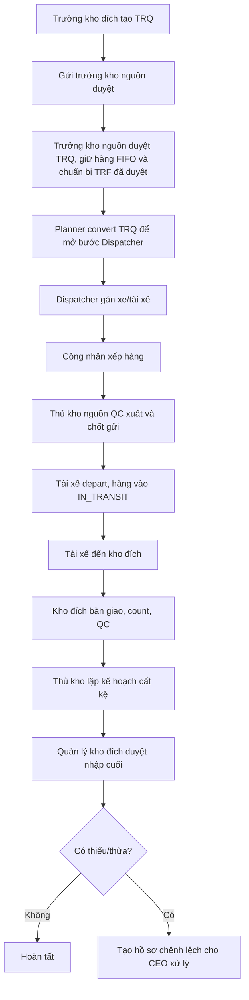
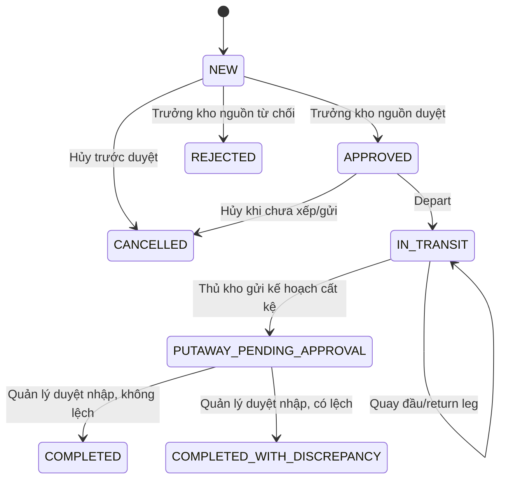

# Phân Tích Cấu Trúc – Luồng – Kết Nối Chức Năng Điều Chuyển Nội Bộ

Tài liệu này tập trung vào **các chức năng chính** của điều chuyển nội bộ và **toàn bộ exception flow quan trọng**. Các chi tiết phụ như UI trang trí, ảnh bằng chứng chi tiết, audit phụ, mapping response phụ không đưa sâu ở đây.

---

## 1. Tổng Quan Nghiệp Vụ Chính

Điều chuyển nội bộ gồm 4 lớp nghiệp vụ:

| Lớp | Mã | Mục đích |
|---|---|---|
| Yêu cầu điều chuyển | `TRQ` | Kho đích xin lấy hàng từ kho nguồn; trưởng kho nguồn duyệt và giữ hàng |
| Phiếu điều chuyển | `TRF` | Phiếu thực thi thật: trưởng kho nguồn duyệt `TRQ` thì hệ thống chuẩn bị sẵn `TRF` đã giữ hàng/đã duyệt; Planner chỉ chuyển `TRQ` sang trạng thái đã convert để Dispatcher tiếp tục |
| Chuyến xe điều chuyển | `TTR` | Xe/tài xế vận chuyển hàng giữa 2 kho |
| Hồ sơ chênh lệch | Discrepancy | CEO xử lý thiếu/thừa sau nhận hàng |

Luồng chuẩn:



---

## 2. Các File Chính Và Trách Nhiệm

| File | Dòng | Trách nhiệm chính |
|---|---:|---|
| [TransferRequestServiceImpl.java](../backend/src/main/java/com/wms/service/warehouse_transfer/impl/TransferRequestServiceImpl.java:105) | 105 | Tạo/sửa/gửi/trưởng kho nguồn duyệt giữ hàng và chuẩn bị `TRF`/từ chối/Planner convert `TRQ` |
| [InterWarehouseTransferPlanningService.java](../backend/src/main/java/com/wms/service/warehouse_transfer/impl/InterWarehouseTransferPlanningService.java:69) | 69 | Tạo/sửa/hủy `TRF` |
| [InterWarehouseTransferApprovalService.java](../backend/src/main/java/com/wms/service/warehouse_transfer/impl/InterWarehouseTransferApprovalService.java:48) | 48 | Duyệt/từ chối `TRF` nếu vẫn hỗ trợ phiếu tạo thủ công; không là bước giữ hàng cho `TRF` sinh từ `TRQ` |
| [InterWarehouseTransferShippingService.java](../backend/src/main/java/com/wms/service/warehouse_transfer/impl/InterWarehouseTransferShippingService.java:83) | 83 | Gán xe, xếp hàng, QC xuất, ship, depart, arrive, quay đầu |
| [InterWarehouseTransferReceivingService.java](../backend/src/main/java/com/wms/service/warehouse_transfer/impl/InterWarehouseTransferReceivingService.java:89) | 89 | Count/QC nhận, cất kệ, nhập kho cuối, thiếu/thừa |
| [DiscrepancyIncidentServiceImpl.java](../backend/src/main/java/com/wms/service/warehouse_transfer/impl/DiscrepancyIncidentServiceImpl.java:83) | 83 | CEO xem/chốt hồ sơ chênh lệch |
| [InterWarehouseTransferHelper.java](../backend/src/main/java/com/wms/service/warehouse_transfer/impl/InterWarehouseTransferHelper.java:80) | 80 | Helper quyền kho, status, reservation, tồn kho, deadline, response |

---

## 3. Luồng Chính 1: TRQ - Yêu Cầu Điều Chuyển

### 3.1. Tạo yêu cầu

File: [TransferRequestServiceImpl.java:105](../backend/src/main/java/com/wms/service/warehouse_transfer/impl/TransferRequestServiceImpl.java:105)

```java
public TransferRequestResponse createRequest(TransferRequestCreateRequest request, User actor) {
    ensureRequesterRole(actor);
    ensureWarehouseScope(actor, request.destinationWarehouseId());
    if (Objects.equals(request.sourceWarehouseId(), request.destinationWarehouseId())) {
        throw new BusinessRuleViolationException("SOURCE_DESTINATION_MUST_DIFFER");
    }
    ensureNeededByDateIsNotPast(request.neededByDate());
    ensurePhysicalWarehouses(request.sourceWarehouseId(), request.destinationWarehouseId());
    ensureNoOpenDuplicateRequest(request.sourceWarehouseId(), request.destinationWarehouseId(),
            request.neededByDate(), null);
```

Ý nghĩa:

- Chỉ quản lý kho được tạo yêu cầu.
- Người tạo phải thuộc kho đích.
- Kho nguồn và kho đích phải khác nhau.
- Ngày cần hàng không được là quá khứ.
- Không chọn kho ảo `IN_TRANSIT`.
- Không tạo trùng yêu cầu còn mở cùng tuyến/kỳ cần hàng.

### 3.2. Gửi trưởng kho nguồn duyệt

File: [TransferRequestServiceImpl.java:201](../backend/src/main/java/com/wms/service/warehouse_transfer/impl/TransferRequestServiceImpl.java:201)

```java
if (autoCancelExpiredRequest(req, actor)) {
    return toResponse(req);
}
if (req.getStatus() != TransferRequestStatus.DRAFT) {
    throw new BusinessRuleViolationException("ONLY_DRAFT_CAN_BE_SUBMITTED");
}
validateSourceAvailability(req);
```

Ý nghĩa:

- Nếu quá ngày cần hàng thì tự hủy, không cho gửi tiếp.
- Chỉ `DRAFT` được gửi duyệt.
- Trước khi gửi phải kiểm lại tồn kho nguồn còn đủ.
- Sau khi gửi, yêu cầu chờ trưởng kho nguồn xử lý; CEO chỉ xem/giám sát, không duyệt nghiệp vụ điều chuyển.

### 3.3. Trưởng kho nguồn duyệt và giữ hàng

File: [TransferRequestServiceImpl.java:230](../backend/src/main/java/com/wms/service/warehouse_transfer/impl/TransferRequestServiceImpl.java:230)

```java
if (autoCancelExpiredRequest(req, actor)) {
    return toResponse(req);
}
if (req.getStatus() != TransferRequestStatus.SUBMITTED) {
    throw new BusinessRuleViolationException("ONLY_SUBMITTED_CAN_BE_APPROVED");
}
validateSourceAvailability(req);
allocateSourceReservation(req);
```

Ý nghĩa:

- Chỉ trưởng kho nguồn/Admin được duyệt.
- Người duyệt phải thuộc kho nguồn.
- Quá ngày cần hàng thì hủy trước, không duyệt trễ.
- Chỉ `SUBMITTED` được duyệt.
- Kiểm tồn lại lần nữa vì tồn có thể đổi sau lúc gửi duyệt.
- Khi duyệt, hệ thống tạo trước `TRF` liên kết `TRQ`, duyệt `TRF` đó và giữ hàng FIFO ngay; `available = totalQty - reservedQty` giảm nhưng `totalQty` chưa giảm.
- Nếu giữ hàng không đủ toàn bộ số lượng, không reserve một phần và không chuyển `APPROVED`.

### 3.4. Planner convert TRQ thành TRF

File: [TransferRequestServiceImpl.java:296](../backend/src/main/java/com/wms/service/warehouse_transfer/impl/TransferRequestServiceImpl.java:296)

Điểm chính:

- Chỉ Planner được convert.
- Chỉ `APPROVED` đã giữ hàng được convert.
- Một `TRQ` chỉ convert được một lần.
- Nếu đã có `TRF` còn hiệu lực liên kết `TRQ`, không cho convert lại.
- `TRF` đã được chuẩn bị ở bước trưởng kho nguồn duyệt `TRQ`; Planner convert chỉ đổi `TRQ` sang `CONVERTED`, gắn lại liên kết và không tạo thêm giữ hàng lần hai.
- Với dữ liệu cũ chưa có `TRF` liên kết, code vẫn có nhánh tương thích: tạo `TRF`, duyệt/giữ hàng một lần, rồi convert `TRQ`.

---

## 4. Luồng Chính 2: TRF - Tạo Phiếu Thực Thi

### 4.1. Planner tạo phiếu TRF

File: [InterWarehouseTransferPlanningService.java:83](../backend/src/main/java/com/wms/service/warehouse_transfer/impl/InterWarehouseTransferPlanningService.java:83)

```java
ensureCreateScope(actor, request, allowDestinationScopedPlanner);
ensureDifferentWarehouses(request.sourceWarehouseId(), request.destinationWarehouseId());
validateTransferDates(request.documentDate(), request.plannedDate());
ensurePhysicalWarehouses(request.sourceWarehouseId(), request.destinationWarehouseId());
validateTransferItems(request.items(), request.sourceWarehouseId(), request.destinationWarehouseId());
ensureUniqueExternalInstruction(request.externalInstructionCode(), request.sourceWarehouseId(),
        request.destinationWarehouseId(), request.documentDate(), null);
```

Ý nghĩa:

- Kiểm quyền theo kho.
- Kho nguồn và kho đích khác nhau.
- Ngày chứng từ/ngày dự kiến hợp lệ.
- Không chọn kho ảo.
- Dòng hàng không trùng, số lượng nguyên, vị trí đúng kho.
- Không trùng mã lệnh ngoài theo kho nguồn/kho đích/ngày chứng từ.

### 4.2. Duyệt TRF thủ công nếu còn hỗ trợ

File: [InterWarehouseTransferApprovalService.java:48](../backend/src/main/java/com/wms/service/warehouse_transfer/impl/InterWarehouseTransferApprovalService.java:48)

```java
helper.requireStatus(transfer, InterWarehouseTransferStatus.NEW);
helper.ensureWarehouseScope(actor, transfer.getSourceWarehouse().getId());
helper.allocateReservations(transfer);

transfer.setStatus(InterWarehouseTransferStatus.APPROVED);
```

Ý nghĩa:

- Với `TRF` tạo thủ công không đi từ `TRQ`, trưởng kho nguồn vẫn có thể duyệt và giữ hàng theo FIFO nếu hệ thống giữ nhánh này.
- Với `TRF` sinh từ `TRQ`, hàng đã được giữ và phiếu đã ở trạng thái `APPROVED` từ bước trưởng kho nguồn duyệt `TRQ`; không được reserve lại lần hai.
- Sau khi Planner convert `TRQ` đã duyệt, Dispatcher lập chuyến trực tiếp trên `TRF` đã `APPROVED`.

### 4.3. Giữ hàng FIFO

File: [InterWarehouseTransferHelper.java:170](../backend/src/main/java/com/wms/service/warehouse_transfer/impl/InterWarehouseTransferHelper.java:170)

Ý nghĩa chính của reservation:

- Xóa reservation cũ của request/phiếu khi nghiệp vụ cho phép sửa hoặc hủy.
- Lấy các dòng tồn khả dụng của sản phẩm tại kho nguồn.
- Tính `available = totalQty - reservedQty`.
- Nếu không đủ thì ném `INSUFFICIENT_AVAILABLE_STOCK`.
- Nếu đủ thì tăng `reservedQty` từng dòng tồn theo FIFO và lưu allocation.

---

## 5. Luồng Chính 3: Gán Xe, Xếp Hàng, QC Xuất Và Depart

### 5.1. Dispatcher gán chuyến

File: [InterWarehouseTransferShippingService.java:83](../backend/src/main/java/com/wms/service/warehouse_transfer/impl/InterWarehouseTransferShippingService.java:83)

Chức năng chính:

- Phiếu phải `APPROVED`.
- Chưa quá deadline ngày cần hàng.
- Xe/tài xế hợp lệ, rảnh, thuộc phạm vi điều phối.
- Thời gian bắt đầu/kết thúc chuyến hợp lệ.
- Không cho lập chuyến nếu đã có trip điều chuyển.

### 5.2. Công nhân báo số lượng xếp

File: [InterWarehouseTransferShippingService.java:183](../backend/src/main/java/com/wms/service/warehouse_transfer/impl/InterWarehouseTransferShippingService.java:183)

Chức năng chính:

- Công nhân nhập số lượng thực xếp lên xe.
- Nếu lệch kế hoạch thì phải nhập lý do xử lý lại.
- Storekeeper chỉ được QC xuất khi số lượng đã xếp khớp kế hoạch và không còn cờ cần xử lý lại.

### 5.3. Thủ kho nguồn QC xuất

File: [InterWarehouseTransferShippingService.java:272](../backend/src/main/java/com/wms/service/warehouse_transfer/impl/InterWarehouseTransferShippingService.java:272)

Chức năng chính:

- Phiếu phải có trip.
- Đã báo cáo xếp hàng.
- Không còn yêu cầu xếp lại.
- Phải có ảnh QC xuất.
- Nếu QC fail thì ghi lý do, reset các bước bàn giao sau.

### 5.4. Chốt gửi và depart

File: [InterWarehouseTransferShippingService.java:368](../backend/src/main/java/com/wms/service/warehouse_transfer/impl/InterWarehouseTransferShippingService.java:368)

Chức năng chính:

- Chỉ khi QC xuất đạt mới chốt gửi.
- `sentQty` là số lượng rời kho nguồn.
- Khi tài xế depart, hệ thống trừ tồn thật khỏi kho nguồn và cộng vào kho ảo `IN_TRANSIT`.

---

## 6. Luồng Chính 4: Nhận Hàng, QC Nhận, Cất Kệ, Final Receive

### 6.1. Tài xế đến kho đích và bàn giao

File: [InterWarehouseTransferShippingService.java:574](../backend/src/main/java/com/wms/service/warehouse_transfer/impl/InterWarehouseTransferShippingService.java:574)

Chức năng chính:

- Tài xế xác nhận đến kho.
- Thủ kho đích chỉ bấm nút xác nhận nhận bàn giao hàng; request có thể mang `photoRef` nếu muốn lưu bằng chứng, nhưng code không bắt chọn/chụp ảnh ở bước này.
- Sau khi thủ kho đích xác nhận bàn giao, công nhân kho đích thấy ngay phần count để nhập số thực nhận và gửi lại cho thủ kho kiểm nhận.

### 6.2. Count nhận

File: [InterWarehouseTransferReceivingService.java:89](../backend/src/main/java/com/wms/service/warehouse_transfer/impl/InterWarehouseTransferReceivingService.java:89)

Chức năng chính:

- Phiếu phải `IN_TRANSIT`.
- Đã đến kho và đã bàn giao.
- Phải gửi đủ dòng hàng.
- Nếu số nhận lệch số gửi thì phải nhập lý do.

### 6.3. QC nhận

File: [InterWarehouseTransferReceivingService.java:154](../backend/src/main/java/com/wms/service/warehouse_transfer/impl/InterWarehouseTransferReceivingService.java:154)

Chức năng chính:

- Phải có ảnh QC nhận.
- Phải gửi đủ dòng QC.
- Thủ kho không nhập/sửa số lượng chốt; hệ thống dùng count công nhân làm `confirmedQty`.
- Nếu count lệch số gửi: `qcPassedQty = confirmedQty`, `qcFailedQty = 0`, không mở quarantine ở bước này.
- Nếu count khớp số gửi: `qcPassedQty + qcFailedQty` phải bằng `confirmedQty`.
- Nếu có QC lỗi thì phải nhập lý do.
- Nếu có hàng lỗi thì phải có khu quarantine.

### 6.4. Thủ kho gửi kế hoạch cất kệ

File: [InterWarehouseTransferReceivingService.java:203](../backend/src/main/java/com/wms/service/warehouse_transfer/impl/InterWarehouseTransferReceivingService.java:203)

Chức năng chính:

- Thủ kho chỉ lập kế hoạch sau khi tất cả dòng đã QC.
- Tổng số lượng cất kệ phải bằng đúng `QC đạt`.
- Không cho đưa hàng QC đạt vào kệ quarantine.
- Nếu có hàng thừa, vẫn cất đủ số công nhân count vào kệ thường; phần thừa đồng thời đi hồ sơ chênh lệch.

### 6.5. Quản lý kho duyệt nhập cuối

File: [InterWarehouseTransferReceivingService.java:210](../backend/src/main/java/com/wms/service/warehouse_transfer/impl/InterWarehouseTransferReceivingService.java:210)

Chức năng chính:

- Chỉ quản lý kho đích được duyệt.
- Kiểm tra kế hoạch cất kệ.
- Trừ hàng khỏi `IN_TRANSIT`.
- Nhập phần đạt QC vào kệ; với count lệch, phần đạt QC là toàn bộ số công nhân count.
- Nhập phần lỗi QC vào quarantine.
- Nếu thiếu/thừa thì tạo hồ sơ chênh lệch.

---

## 7. Luồng Chính 5: Hồ Sơ Chênh Lệch

Chi tiết riêng nằm ở [transfer-discrepancy-flow.md](./transfer-discrepancy-flow.md).

Tóm tắt:

| Tình huống | Xử lý |
|---|---|
| Nhận thiếu | Tạo hồ sơ `SHORTAGE`, CEO chốt trách nhiệm |
| Nhận thừa | Cất đủ số công nhân count, tạo hồ sơ `OVER_RECEIPT` và trace phần thừa trong `discrepancy_hold_entries` |
| CEO kết luận lỗi kho nguồn | Trừ thêm kho nguồn, không cộng kho đích lần hai |
| CEO kết luận đếm sai kho đích | Trừ ngược phần hold đã cất khỏi kho đích |

File chính:

- [InterWarehouseTransferReceivingService.java:629](../backend/src/main/java/com/wms/service/warehouse_transfer/impl/InterWarehouseTransferReceivingService.java:629): tạo hồ sơ thiếu.
- [InterWarehouseTransferReceivingService.java:664](../backend/src/main/java/com/wms/service/warehouse_transfer/impl/InterWarehouseTransferReceivingService.java:664): tạo hồ sơ thừa.
- [DiscrepancyIncidentServiceImpl.java:83](../backend/src/main/java/com/wms/service/warehouse_transfer/impl/DiscrepancyIncidentServiceImpl.java:83): CEO xem/chốt hồ sơ.

---

## 8. Luồng Chính 6: Quay Đầu Xe

### 8.1. Điều kiện quay đầu hiện còn

Nhánh quay đầu do kho đích báo sai SKU đã được gỡ khỏi API/service.

Chức năng chính:

- Nếu phiếu đang `IN_TRANSIT` bị quá ngày cần hàng, hệ thống tự đặt `returned = true`.
- Nếu phiếu đã có `returned = true`, các bước nhận tiếp theo diễn ra tại kho nguồn.
- Không còn endpoint tạo/duyệt/bác yêu cầu quay đầu do sai SKU tại kho đích.

### 8.2. Quay đầu về kho nguồn

File: [InterWarehouseTransferShippingService.java:644](../backend/src/main/java/com/wms/service/warehouse_transfer/impl/InterWarehouseTransferShippingService.java:644)

Chức năng chính:

- Tài xế depart chặng về.
- Tài xế arrive kho nguồn.
- Thủ kho nguồn bàn giao nhận lại.
- Kho nguồn count/QC và nhập lại theo luồng receiving nhưng `targetWarehouse` là kho nguồn.

---

## 9. Exception Flow Theo Giai Đoạn

### 9.1. Exception Flow Của TRQ

| Giai đoạn | Điều kiện lỗi | Exception | Code |
|---|---|---|---|
| Xem chi tiết TRQ | Người dùng không thuộc kho liên quan | `WAREHOUSE_SCOPE_REQUIRED` | [TransferRequestServiceImpl.java:93](../backend/src/main/java/com/wms/service/warehouse_transfer/impl/TransferRequestServiceImpl.java:93) |
| Tạo/sửa TRQ | Không phải quản lý kho | `WAREHOUSE_MANAGER_ROLE_REQUIRED` | [TransferRequestServiceImpl.java:410](../backend/src/main/java/com/wms/service/warehouse_transfer/impl/TransferRequestServiceImpl.java:410) |
| Tạo/sửa TRQ | Kho nguồn = kho đích | `SOURCE_DESTINATION_MUST_DIFFER` | [TransferRequestServiceImpl.java:105](../backend/src/main/java/com/wms/service/warehouse_transfer/impl/TransferRequestServiceImpl.java:105) |
| Tạo/sửa TRQ | Ngày cần hàng ở quá khứ | `NEEDED_BY_DATE_MUST_NOT_BE_PAST` | [TransferRequestServiceImpl.java:431](../backend/src/main/java/com/wms/service/warehouse_transfer/impl/TransferRequestServiceImpl.java:431) |
| Tạo/sửa TRQ | Kho nguồn là kho ảo | `SOURCE_WAREHOUSE_MUST_BE_PHYSICAL` | [TransferRequestServiceImpl.java:471](../backend/src/main/java/com/wms/service/warehouse_transfer/impl/TransferRequestServiceImpl.java:471) |
| Tạo/sửa TRQ | Kho đích là kho ảo | `DESTINATION_WAREHOUSE_MUST_BE_PHYSICAL` | [TransferRequestServiceImpl.java:471](../backend/src/main/java/com/wms/service/warehouse_transfer/impl/TransferRequestServiceImpl.java:471) |
| Tạo/sửa TRQ | Trùng yêu cầu mở cùng tuyến/ngày cần hàng | `DUPLICATE_OPEN_TRANSFER_REQUEST` | [TransferRequestServiceImpl.java:455](../backend/src/main/java/com/wms/service/warehouse_transfer/impl/TransferRequestServiceImpl.java:455) |
| Tạo/sửa item TRQ | Trùng sản phẩm | `DUPLICATE_PRODUCT_IN_TRANSFER` | [TransferRequestServiceImpl.java:498](../backend/src/main/java/com/wms/service/warehouse_transfer/impl/TransferRequestServiceImpl.java:498) |
| Tạo/sửa item TRQ | Số lượng lẻ | `TRANSFER_QTY_MUST_BE_WHOLE_NUMBER` | [TransferRequestServiceImpl.java:501](../backend/src/main/java/com/wms/service/warehouse_transfer/impl/TransferRequestServiceImpl.java:501) |
| Submit TRQ | Không phải `DRAFT` | `ONLY_DRAFT_CAN_BE_SUBMITTED` | [TransferRequestServiceImpl.java:201](../backend/src/main/java/com/wms/service/warehouse_transfer/impl/TransferRequestServiceImpl.java:201) |
| Submit/approve TRQ | Kho nguồn thiếu tồn khả dụng | `TRANSFER_REQUEST_QTY_EXCEEDS_SOURCE_AVAILABLE` | [TransferRequestServiceImpl.java:426](../backend/src/main/java/com/wms/service/warehouse_transfer/impl/TransferRequestServiceImpl.java:426) |
| Approve/reject TRQ | Actor không phải trưởng kho nguồn/Admin hoặc không thuộc kho nguồn | `SOURCE_MANAGER_ROLE_REQUIRED` / `WAREHOUSE_SCOPE_REQUIRED` | [TransferRequestServiceImpl.java:230](../backend/src/main/java/com/wms/service/warehouse_transfer/impl/TransferRequestServiceImpl.java:230) |
| Approve TRQ | Không phải `SUBMITTED` | `ONLY_SUBMITTED_CAN_BE_APPROVED` | [TransferRequestServiceImpl.java:230](../backend/src/main/java/com/wms/service/warehouse_transfer/impl/TransferRequestServiceImpl.java:230) |
| Approve TRQ | Tồn khả dụng không đủ để giữ hàng | `INSUFFICIENT_AVAILABLE_STOCK` | [TransferRequestServiceImpl.java:230](../backend/src/main/java/com/wms/service/warehouse_transfer/impl/TransferRequestServiceImpl.java:230) |
| Reject TRQ | Không nhập lý do | `REJECTION_REASON_REQUIRED` | [TransferRequestServiceImpl.java:264](../backend/src/main/java/com/wms/service/warehouse_transfer/impl/TransferRequestServiceImpl.java:264) |
| Convert TRQ | Actor không phải Planner | `PLANNER_ROLE_REQUIRED` | [TransferRequestServiceImpl.java:296](../backend/src/main/java/com/wms/service/warehouse_transfer/impl/TransferRequestServiceImpl.java:296) |
| Convert TRQ | Không phải `APPROVED` | `ONLY_APPROVED_CAN_BE_CONVERTED` | [TransferRequestServiceImpl.java:296](../backend/src/main/java/com/wms/service/warehouse_transfer/impl/TransferRequestServiceImpl.java:296) |
| Convert TRQ | Đã convert rồi | `TRANSFER_REQUEST_ALREADY_CONVERTED` | [TransferRequestServiceImpl.java:296](../backend/src/main/java/com/wms/service/warehouse_transfer/impl/TransferRequestServiceImpl.java:296) |
| Submit/approve/convert TRQ | Quá ngày cần hàng | Tự chuyển `CANCELLED` | [TransferRequestServiceImpl.java:437](../backend/src/main/java/com/wms/service/warehouse_transfer/impl/TransferRequestServiceImpl.java:437) |

### 9.2. Exception Flow Của Planning TRF

| Giai đoạn | Điều kiện lỗi | Exception | Code |
|---|---|---|---|
| Tạo TRF thủ công | Người tạo không thuộc kho nguồn | `WAREHOUSE_SCOPE_REQUIRED` | [InterWarehouseTransferPlanningService.java:110](../backend/src/main/java/com/wms/service/warehouse_transfer/impl/InterWarehouseTransferPlanningService.java:110) |
| Tạo TRF từ TRQ | Người tạo không thuộc kho nguồn/kho đích liên quan | `WAREHOUSE_SCOPE_REQUIRED` | [InterWarehouseTransferPlanningService.java:110](../backend/src/main/java/com/wms/service/warehouse_transfer/impl/InterWarehouseTransferPlanningService.java:110) |
| Tạo/sửa TRF | Kho nguồn = kho đích | `SOURCE_DESTINATION_MUST_DIFFER` | [InterWarehouseTransferPlanningService.java:175](../backend/src/main/java/com/wms/service/warehouse_transfer/impl/InterWarehouseTransferPlanningService.java:175) |
| Tạo/sửa TRF | Ngày chứng từ quá khứ | `DOCUMENT_DATE_MUST_NOT_BE_PAST` | [InterWarehouseTransferPlanningService.java:197](../backend/src/main/java/com/wms/service/warehouse_transfer/impl/InterWarehouseTransferPlanningService.java:197) |
| Tạo/sửa TRF | Ngày dự kiến quá khứ | `PLANNED_DATE_MUST_NOT_BE_PAST` | [InterWarehouseTransferPlanningService.java:197](../backend/src/main/java/com/wms/service/warehouse_transfer/impl/InterWarehouseTransferPlanningService.java:197) |
| Tạo/sửa TRF | Ngày dự kiến trước ngày chứng từ | `PLANNED_DATE_MUST_NOT_BE_BEFORE_DOCUMENT_DATE` | [InterWarehouseTransferPlanningService.java:197](../backend/src/main/java/com/wms/service/warehouse_transfer/impl/InterWarehouseTransferPlanningService.java:197) |
| Tạo/sửa item TRF | Trùng sản phẩm | `DUPLICATE_PRODUCT_IN_TRANSFER` | [InterWarehouseTransferPlanningService.java:214](../backend/src/main/java/com/wms/service/warehouse_transfer/impl/InterWarehouseTransferPlanningService.java:214) |
| Tạo/sửa item TRF | Số lượng lẻ | `TRANSFER_QTY_MUST_BE_WHOLE_NUMBER` | [InterWarehouseTransferPlanningService.java:234](../backend/src/main/java/com/wms/service/warehouse_transfer/impl/InterWarehouseTransferPlanningService.java:234) |
| Tạo/sửa item TRF | Vị trí nguồn không đúng kho/không hoạt động/là quarantine | `INVALID_SOURCE_LOCATION` | [InterWarehouseTransferPlanningService.java:241](../backend/src/main/java/com/wms/service/warehouse_transfer/impl/InterWarehouseTransferPlanningService.java:241) |
| Tạo/sửa item TRF | Vị trí đích không đúng kho/không hoạt động/là quarantine | `INVALID_DESTINATION_LOCATION` | [InterWarehouseTransferPlanningService.java:241](../backend/src/main/java/com/wms/service/warehouse_transfer/impl/InterWarehouseTransferPlanningService.java:241) |
| Tạo/sửa TRF | Trùng mã lệnh ngoài còn hiệu lực | `DUPLICATE_EXTERNAL_INSTRUCTION` | [InterWarehouseTransferPlanningService.java:252](../backend/src/main/java/com/wms/service/warehouse_transfer/impl/InterWarehouseTransferPlanningService.java:252) |
| Sửa TRF | Phiếu không còn `NEW` | `INVALID_TRANSFER_STATUS` qua `requireStatus` | [InterWarehouseTransferPlanningService.java:128](../backend/src/main/java/com/wms/service/warehouse_transfer/impl/InterWarehouseTransferPlanningService.java:128) |
| Hủy TRF | Phiếu đã qua trạng thái cho phép hủy | `TRANSFER_CANCEL_NOT_ALLOWED` | [InterWarehouseTransferPlanningService.java:153](../backend/src/main/java/com/wms/service/warehouse_transfer/impl/InterWarehouseTransferPlanningService.java:153) |
| Hủy TRF đã duyệt | Đã có `sentQty` | `UNSHIP_REQUIRED_BEFORE_CANCEL` | [InterWarehouseTransferPlanningService.java:296](../backend/src/main/java/com/wms/service/warehouse_transfer/impl/InterWarehouseTransferPlanningService.java:296) |
| Hủy TRF | Không nhập lý do | `CANCEL_REASON_REQUIRED` | [InterWarehouseTransferPlanningService.java:153](../backend/src/main/java/com/wms/service/warehouse_transfer/impl/InterWarehouseTransferPlanningService.java:153) |

### 9.3. Exception Flow Của Duyệt Và Giữ Hàng

| Giai đoạn | Điều kiện lỗi | Exception | Code |
|---|---|---|---|
| Duyệt TRF | Phiếu không phải `NEW` | `INVALID_TRANSFER_STATUS` qua `requireStatus` | [InterWarehouseTransferApprovalService.java:48](../backend/src/main/java/com/wms/service/warehouse_transfer/impl/InterWarehouseTransferApprovalService.java:48) |
| Duyệt TRF | Người duyệt không thuộc kho nguồn | `WAREHOUSE_SCOPE_REQUIRED` | [InterWarehouseTransferApprovalService.java:48](../backend/src/main/java/com/wms/service/warehouse_transfer/impl/InterWarehouseTransferApprovalService.java:48) |
| Duyệt TRF | Tồn khả dụng không đủ | `INSUFFICIENT_AVAILABLE_STOCK` | [InterWarehouseTransferHelper.java:170](../backend/src/main/java/com/wms/service/warehouse_transfer/impl/InterWarehouseTransferHelper.java:170) |
| Từ chối TRF | Phiếu không phải `NEW` | `INVALID_TRANSFER_STATUS` qua `requireStatus` | [InterWarehouseTransferApprovalService.java:70](../backend/src/main/java/com/wms/service/warehouse_transfer/impl/InterWarehouseTransferApprovalService.java:70) |
| Từ chối TRF | Không nhập lý do | `REJECTION_REASON_REQUIRED` | [InterWarehouseTransferApprovalService.java:70](../backend/src/main/java/com/wms/service/warehouse_transfer/impl/InterWarehouseTransferApprovalService.java:70) |

### 9.4. Exception Flow Của Shipping

| Giai đoạn | Điều kiện lỗi | Exception | Code |
|---|---|---|---|
| Assign trip | Phiếu không phải `APPROVED` | `INVALID_TRANSFER_STATUS` qua `requireStatus` | [InterWarehouseTransferShippingService.java:83](../backend/src/main/java/com/wms/service/warehouse_transfer/impl/InterWarehouseTransferShippingService.java:83) |
| Assign trip | Phiếu quá ngày cần hàng trước depart | Tự hủy/trả response | [InterWarehouseTransferShippingService.java:83](../backend/src/main/java/com/wms/service/warehouse_transfer/impl/InterWarehouseTransferShippingService.java:83) |
| Assign trip | Chưa có driver/vehicle hợp lệ, lịch sai, tài nguyên bận | Các lỗi vehicle/driver/schedule tương ứng | [InterWarehouseTransferShippingService.java:83](../backend/src/main/java/com/wms/service/warehouse_transfer/impl/InterWarehouseTransferShippingService.java:83) |
| Báo xếp hàng | Chưa có trip | `TRANSFER_TRIP_REQUIRED` hoặc gate tương ứng | [InterWarehouseTransferShippingService.java:183](../backend/src/main/java/com/wms/service/warehouse_transfer/impl/InterWarehouseTransferShippingService.java:183) |
| Báo xếp hàng | Gửi thiếu dòng hàng | `SOURCE_LOAD_ITEMS_REQUIRED` | [InterWarehouseTransferShippingService.java:183](../backend/src/main/java/com/wms/service/warehouse_transfer/impl/InterWarehouseTransferShippingService.java:183) |
| Báo xếp hàng | Số lượng lẻ | `TRANSFER_QTY_MUST_BE_WHOLE_NUMBER` | [InterWarehouseTransferShippingService.java:183](../backend/src/main/java/com/wms/service/warehouse_transfer/impl/InterWarehouseTransferShippingService.java:183) |
| Báo xếp hàng | Lệch kế hoạch nhưng không có lý do | `SOURCE_LOAD_REWORK_REASON_REQUIRED` | [InterWarehouseTransferShippingService.java:183](../backend/src/main/java/com/wms/service/warehouse_transfer/impl/InterWarehouseTransferShippingService.java:183) |
| QC xuất | Chưa báo xếp hàng | `SOURCE_LOAD_REPORT_REQUIRED` hoặc gate tương ứng | [InterWarehouseTransferShippingService.java:272](../backend/src/main/java/com/wms/service/warehouse_transfer/impl/InterWarehouseTransferShippingService.java:272) |
| QC xuất | Còn yêu cầu xếp lại | `SOURCE_LOAD_REWORK_REQUIRED` | [InterWarehouseTransferShippingService.java:272](../backend/src/main/java/com/wms/service/warehouse_transfer/impl/InterWarehouseTransferShippingService.java:272) |
| QC xuất | Không có ảnh QC | `OUTBOUND_QC_PHOTO_REQUIRED` | [InterWarehouseTransferShippingService.java:272](../backend/src/main/java/com/wms/service/warehouse_transfer/impl/InterWarehouseTransferShippingService.java:272) |
| Chốt gửi | QC xuất chưa đạt | `OUTBOUND_QC_NOT_PASSED` | [InterWarehouseTransferShippingService.java:368](../backend/src/main/java/com/wms/service/warehouse_transfer/impl/InterWarehouseTransferShippingService.java:368) |
| Bàn giao lên xe | Thiếu ảnh bàn giao | `LOAD_HANDOVER_REQUIRED` | [InterWarehouseTransferShippingService.java:430](../backend/src/main/java/com/wms/service/warehouse_transfer/impl/InterWarehouseTransferShippingService.java:430) |
| Depart | Chưa đủ điều kiện QC/gửi/bàn giao | `OUTBOUND_QC_NOT_PASSED`, `LOAD_HANDOVER_REQUIRED` | [InterWarehouseTransferShippingService.java:493](../backend/src/main/java/com/wms/service/warehouse_transfer/impl/InterWarehouseTransferShippingService.java:493) |
| Depart | Không có kho `IN_TRANSIT` | `IN_TRANSIT_WAREHOUSE_NOT_CONFIGURED` | [InterWarehouseTransferShippingService.java:493](../backend/src/main/java/com/wms/service/warehouse_transfer/impl/InterWarehouseTransferShippingService.java:493) |
| Đang vận chuyển | Quá hạn cần hàng | Bắt quay đầu về kho nguồn | [InterWarehouseTransferShippingService.java:493](../backend/src/main/java/com/wms/service/warehouse_transfer/impl/InterWarehouseTransferShippingService.java:493) |

### 9.5. Exception Flow Của Receiving

| Giai đoạn | Điều kiện lỗi | Exception | Code |
|---|---|---|---|
| Receive count | Phiếu không phải `IN_TRANSIT` | `INVALID_TRANSFER_STATUS` qua `requireStatus` | [InterWarehouseTransferReceivingService.java:89](../backend/src/main/java/com/wms/service/warehouse_transfer/impl/InterWarehouseTransferReceivingService.java:89) |
| Receive count | Xe chưa đến kho đích | `DRIVER_ARRIVE_REQUIRED` | [InterWarehouseTransferReceivingService.java:89](../backend/src/main/java/com/wms/service/warehouse_transfer/impl/InterWarehouseTransferReceivingService.java:89) |
| Receive count | Chưa bàn giao tại kho đích | `ARRIVAL_HANDOVER_REQUIRED` | [InterWarehouseTransferReceivingService.java:89](../backend/src/main/java/com/wms/service/warehouse_transfer/impl/InterWarehouseTransferReceivingService.java:89) |
| Receive count | Quá hạn vận chuyển | `TRANSFER_TRIP_OVERDUE` | [InterWarehouseTransferReceivingService.java:497](../backend/src/main/java/com/wms/service/warehouse_transfer/impl/InterWarehouseTransferReceivingService.java:497) |
| Receive count | Gửi thiếu dòng | `RECEIVE_COUNT_ITEMS_REQUIRED` | [InterWarehouseTransferReceivingService.java:125](../backend/src/main/java/com/wms/service/warehouse_transfer/impl/InterWarehouseTransferReceivingService.java:125) |
| Receive count | Trùng dòng | `DUPLICATE_RECEIVE_COUNT_ITEM` | [InterWarehouseTransferReceivingService.java:125](../backend/src/main/java/com/wms/service/warehouse_transfer/impl/InterWarehouseTransferReceivingService.java:125) |
| Receive count | Số lượng lẻ | `TRANSFER_QTY_MUST_BE_WHOLE_NUMBER` | [InterWarehouseTransferReceivingService.java:1124](../backend/src/main/java/com/wms/service/warehouse_transfer/impl/InterWarehouseTransferReceivingService.java:1124) |
| Receive count | Số nhận lệch số gửi nhưng thiếu lý do | `ISSUE_REASON_REQUIRED` | [InterWarehouseTransferReceivingService.java:125](../backend/src/main/java/com/wms/service/warehouse_transfer/impl/InterWarehouseTransferReceivingService.java:125) |
| Receive QC | Không có ảnh QC | `RECEIVE_QC_PHOTO_REQUIRED` | [InterWarehouseTransferReceivingService.java:154](../backend/src/main/java/com/wms/service/warehouse_transfer/impl/InterWarehouseTransferReceivingService.java:154) |
| Receive QC | Gửi thiếu dòng QC | `RECEIVE_CHECK_ITEMS_REQUIRED` | [InterWarehouseTransferReceivingService.java:164](../backend/src/main/java/com/wms/service/warehouse_transfer/impl/InterWarehouseTransferReceivingService.java:164) |
| Receive QC | Trùng dòng QC | `DUPLICATE_RECEIVE_CHECK_ITEM` | [InterWarehouseTransferReceivingService.java:164](../backend/src/main/java/com/wms/service/warehouse_transfer/impl/InterWarehouseTransferReceivingService.java:164) |
| Receive QC | `confirmedQty` khác count công nhân | `RECEIVE_CHECK_QTY_MUST_MATCH_WORKER_COUNT` | [InterWarehouseTransferReceivingService.java:470](../backend/src/main/java/com/wms/service/warehouse_transfer/impl/InterWarehouseTransferReceivingService.java:470) |
| Receive QC | Count lệch nhưng có QC lỗi hoặc QC đạt khác count công nhân | `COUNT_DISCREPANCY_QC_MUST_MATCH_VALID_RECEIVED_QTY` | [InterWarehouseTransferReceivingService.java:470](../backend/src/main/java/com/wms/service/warehouse_transfer/impl/InterWarehouseTransferReceivingService.java:470) |
| Receive QC | Count khớp nhưng `QC đạt + QC lỗi != confirmedQty` | `QC_TOTAL_MUST_MATCH_CONFIRMED_QTY` | [InterWarehouseTransferReceivingService.java:470](../backend/src/main/java/com/wms/service/warehouse_transfer/impl/InterWarehouseTransferReceivingService.java:470) |
| Receive QC | Có QC lỗi nhưng thiếu lý do | `QC_FAILURE_REASON_REQUIRED` | [InterWarehouseTransferReceivingService.java:470](../backend/src/main/java/com/wms/service/warehouse_transfer/impl/InterWarehouseTransferReceivingService.java:470) |
| Receive QC | Có QC lỗi nhưng chưa cấu hình quarantine | `QUARANTINE_LOCATION_NOT_CONFIGURED` | [InterWarehouseTransferReceivingService.java:492](../backend/src/main/java/com/wms/service/warehouse_transfer/impl/InterWarehouseTransferReceivingService.java:492) |
| Submit putaway | Chưa QC đủ dòng | `RECEIVE_CHECK_REQUIRED` | [InterWarehouseTransferReceivingService.java:547](../backend/src/main/java/com/wms/service/warehouse_transfer/impl/InterWarehouseTransferReceivingService.java:547) |
| Submit/final putaway | Không có kế hoạch cất kệ | `PUTAWAY_PLAN_REQUIRED` | [InterWarehouseTransferReceivingService.java:250](../backend/src/main/java/com/wms/service/warehouse_transfer/impl/InterWarehouseTransferReceivingService.java:250) |
| Putaway | Dòng kế hoạch không thuộc phiếu | `PUTAWAY_PLAN_INVALID` | [InterWarehouseTransferReceivingService.java:331](../backend/src/main/java/com/wms/service/warehouse_transfer/impl/InterWarehouseTransferReceivingService.java:331) |
| Putaway | Trùng dòng hàng/kệ | `DUPLICATE_PUTAWAY_ITEM`, `DUPLICATE_PUTAWAY_LOCATION` | [InterWarehouseTransferReceivingService.java:731](../backend/src/main/java/com/wms/service/warehouse_transfer/impl/InterWarehouseTransferReceivingService.java:731) |
| Putaway | Thiếu vị trí đích | `DESTINATION_LOCATION_REQUIRED` | [InterWarehouseTransferReceivingService.java:756](../backend/src/main/java/com/wms/service/warehouse_transfer/impl/InterWarehouseTransferReceivingService.java:756) |
| Putaway | Kệ đích không hợp lệ/quarantine | `INVALID_DESTINATION_LOCATION`, `QC_PASSED_BIN_MUST_NOT_BE_QUARANTINE` | [InterWarehouseTransferReceivingService.java:512](../backend/src/main/java/com/wms/service/warehouse_transfer/impl/InterWarehouseTransferReceivingService.java:512) |
| Putaway | Tổng cất kệ không bằng QC đạt | `PUTAWAY_QUANTITY_MUST_MATCH_QC_PASSED` | [InterWarehouseTransferReceivingService.java:777](../backend/src/main/java/com/wms/service/warehouse_transfer/impl/InterWarehouseTransferReceivingService.java:777) |
| Putaway | Kệ quá tải | `BIN_CAPACITY_EXCEEDED` | [InterWarehouseTransferReceivingService.java:1116](../backend/src/main/java/com/wms/service/warehouse_transfer/impl/InterWarehouseTransferReceivingService.java:1116) |
| Final receive | Actor không phải quản lý kho | `WAREHOUSE_MANAGER_APPROVAL_REQUIRED` | [InterWarehouseTransferReceivingService.java:210](../backend/src/main/java/com/wms/service/warehouse_transfer/impl/InterWarehouseTransferReceivingService.java:210) |
| Final receive | Có chênh lệch nhưng thiếu lý do | `DISCREPANCY_REASON_REQUIRED` | [InterWarehouseTransferReceivingService.java:224](../backend/src/main/java/com/wms/service/warehouse_transfer/impl/InterWarehouseTransferReceivingService.java:224) |
| Final receive | Không thấy tồn `IN_TRANSIT` | `IN_TRANSIT_STOCK_NOT_FOUND` | [InterWarehouseTransferReceivingService.java:592](../backend/src/main/java/com/wms/service/warehouse_transfer/impl/InterWarehouseTransferReceivingService.java:592) |

### 9.6. Exception Flow Quay Đầu

| Giai đoạn | Điều kiện lỗi | Exception | Code |
|---|---|---|---|
| Return leg | Chưa depart chiều về | `RETURN_DEPART_REQUIRED` | [InterWarehouseTransferShippingService.java:644](../backend/src/main/java/com/wms/service/warehouse_transfer/impl/InterWarehouseTransferShippingService.java:644) |
| Return leg | Chưa arrive kho nguồn | `RETURN_ARRIVE_REQUIRED` | [InterWarehouseTransferShippingService.java:701](../backend/src/main/java/com/wms/service/warehouse_transfer/impl/InterWarehouseTransferShippingService.java:701) |
| Return leg | Chưa bàn giao kho nguồn | `RETURN_HANDOVER_REQUIRED` | [InterWarehouseTransferReceivingService.java:89](../backend/src/main/java/com/wms/service/warehouse_transfer/impl/InterWarehouseTransferReceivingService.java:89) |

### 9.7. Exception Flow Hồ Sơ Chênh Lệch

| Giai đoạn | Điều kiện lỗi | Exception | Code |
|---|---|---|---|
| Xem danh sách | Actor không phải CEO | `DISCREPANCY_INCIDENT_ACCESS_DENIED` | [DiscrepancyIncidentServiceImpl.java:83](../backend/src/main/java/com/wms/service/warehouse_transfer/impl/DiscrepancyIncidentServiceImpl.java:83) |
| Chốt hồ sơ | Hồ sơ không tồn tại | `DISCREPANCY_INCIDENT_NOT_FOUND` | [DiscrepancyIncidentServiceImpl.java:98](../backend/src/main/java/com/wms/service/warehouse_transfer/impl/DiscrepancyIncidentServiceImpl.java:98) |
| Chốt hồ sơ | Actor không phải CEO | `DISCREPANCY_INCIDENT_ACCESS_DENIED` | [DiscrepancyIncidentServiceImpl.java:139](../backend/src/main/java/com/wms/service/warehouse_transfer/impl/DiscrepancyIncidentServiceImpl.java:139) |
| Chốt hồ sơ | Hồ sơ không còn `OPEN` | `DISCREPANCY_INCIDENT_NOT_OPEN` | [DiscrepancyIncidentServiceImpl.java:98](../backend/src/main/java/com/wms/service/warehouse_transfer/impl/DiscrepancyIncidentServiceImpl.java:98) |
| Chốt hồ sơ | Status xử lý không hợp lệ | `DISCREPANCY_RESOLUTION_STATUS_INVALID` | [DiscrepancyIncidentServiceImpl.java:98](../backend/src/main/java/com/wms/service/warehouse_transfer/impl/DiscrepancyIncidentServiceImpl.java:98) |
| Hàng thừa do lỗi kho nguồn | Không có dòng giữ tạm | `DISCREPANCY_HOLD_ENTRY_NOT_FOUND` | [DiscrepancyIncidentServiceImpl.java:146](../backend/src/main/java/com/wms/service/warehouse_transfer/impl/DiscrepancyIncidentServiceImpl.java:146) |
| Hàng thừa do lỗi kho nguồn | Tổng giữ tạm lệch số hồ sơ | `DISCREPANCY_HOLD_QUANTITY_MISMATCH` | [DiscrepancyIncidentServiceImpl.java:146](../backend/src/main/java/com/wms/service/warehouse_transfer/impl/DiscrepancyIncidentServiceImpl.java:146) |
| Hàng thừa do lỗi kho nguồn | Kho nguồn không còn đủ tồn để trừ thêm | `SOURCE_STOCK_NOT_ENOUGH_FOR_DISCREPANCY_RESOLUTION` | [DiscrepancyIncidentServiceImpl.java:160](../backend/src/main/java/com/wms/service/warehouse_transfer/impl/DiscrepancyIncidentServiceImpl.java:160) |
| Hàng thừa do lỗi kho nguồn | Dòng giữ tạm thiếu batch/kệ | `DISCREPANCY_HOLD_ENTRY_INCOMPLETE` | [DiscrepancyIncidentServiceImpl.java:190](../backend/src/main/java/com/wms/service/warehouse_transfer/impl/DiscrepancyIncidentServiceImpl.java:190) |

---

## 10. Trạng Thái Chính Của TRF



---

## 11. Kết Luận Ngắn

Điều chuyển nội bộ có 6 chức năng chính:

1. `TRQ`: kho đích xin điều chuyển, trưởng kho nguồn duyệt, chuẩn bị `TRF` và giữ hàng FIFO.
2. `TRF planning`: Planner convert yêu cầu đã duyệt để mở bước điều phối trên `TRF` đã `APPROVED`.
3. `Dispatch`: Dispatcher lập chuyến từ phiếu đã sẵn sàng vận hành.
4. `Shipping`: gán xe, xếp, QC xuất, depart.
5. `Receiving`: arrive, count, QC nhận, cất kệ, nhập cuối.
6. `Discrepancy/return`: xử lý thiếu/thừa và nhận hàng quay đầu.

Exception flow quan trọng nhất nằm ở 4 điểm:

- Không đúng quyền/kho phụ trách.
- Không đúng trạng thái luồng.
- Không đủ tồn hoặc có nguy cơ âm tồn.
- Có thiếu/thừa/QC lỗi nhưng thiếu lý do hoặc thiếu bước xử lý bắt buộc.
