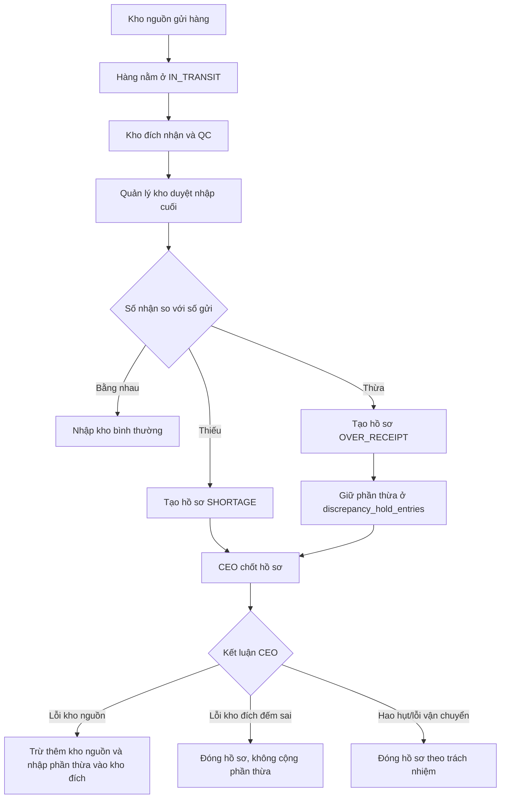

# Luồng Hồ Sơ Chênh Lệch Điều Chuyển Nội Bộ

Tài liệu này chỉ mô tả các luồng xử lý chính của **hồ sơ chênh lệch sau nhận hàng điều chuyển nội bộ**. Các phần phụ như UI phụ, ảnh bằng chứng, audit phụ, capacity phụ chỉ được nhắc khi ảnh hưởng trực tiếp tới chênh lệch.

---

## 1. Mục Tiêu Luồng

Hồ sơ chênh lệch dùng khi kho đích nhận **thiếu** hoặc **thừa** so với số lượng kho nguồn đã xuất đi.

Nguyên tắc chính:

- Phần hàng đúng số gửi được nhập kho bình thường.
- Phần thiếu/thừa phải tạo hồ sơ để CEO chốt trách nhiệm.
- Hàng thừa chưa được cộng tồn chính thức ngay, mà giữ tạm trong hồ sơ chênh lệch.
- Chỉ CEO được xem và xử lý hồ sơ chênh lệch.

---

## 2. Luồng Tổng Quan



---

## 3. Luồng 1: Nhận Đúng Số Gửi

### Code chính

File: [InterWarehouseTransferReceivingService.java:581](../backend/src/main/java/com/wms/service/warehouse_transfer/impl/InterWarehouseTransferReceivingService.java:581)

```java
for (InterWarehouseTransferItem item : helper.items(transfer)) {
    BigDecimal remainingPassed = putawayPlans.get(item.getId()).stream()
            .map(PutawayTarget::quantity)
            .reduce(BigDecimal.ZERO, BigDecimal::add);
    BigDecimal remainingFailed = helper.zero(item.getQcFailedQty());
    Map<WarehouseLocation, BigDecimal> remainingPutaway = new LinkedHashMap<>();
    putawayPlans.get(item.getId()).forEach(line -> remainingPutaway.put(line.location(), line.quantity()));
```

### Ý nghĩa biến chính

`remainingPassed`:
Số lượng hàng **đạt QC** cần đưa vào kệ thường. Biến này lấy từ kế hoạch cất kệ mà thủ kho gửi lên.

`remainingFailed`:
Số lượng hàng **lỗi QC** cần đưa vào quarantine.

`remainingPutaway`:
Danh sách kệ và số lượng cần cất. Ví dụ QC đạt 100, thủ kho chọn 2 kệ:

| Kệ | Số lượng |
|---|---:|
| HN-01.Z1.B1 | 60 |
| HN-01.Z1.B2 | 40 |

thì `remainingPutaway` giữ map `{B1: 60, B2: 40}`.

### Code trừ khỏi IN_TRANSIT

File: [InterWarehouseTransferReceivingService.java:588](../backend/src/main/java/com/wms/service/warehouse_transfer/impl/InterWarehouseTransferReceivingService.java:588)

```java
for (InterWarehouseTransferAllocation allocation : allocationRepository.findByTransferItemId(item.getId())) {
    Inventory transit = inventoryRepository.findByStockKeyForUpdate(
                    transitWarehouse.getId(),
                    item.getProduct().getId(),
                    allocation.getInventory().getBatch().getId(),
                    helper.firstTransitLocation(transitWarehouse).getId())
            .orElseThrow(() -> new BusinessRuleViolationException("IN_TRANSIT_STOCK_NOT_FOUND"));
    BigDecimal qty = allocation.getAllocatedQty();
    transit.setTotalQty(transit.getTotalQty().subtract(qty));
    inventoryRepository.save(transit);
```

Đoạn này lấy từng phần hàng đã xuất đi từ kho trung chuyển `IN_TRANSIT`, rồi trừ ra. Đây là lúc hàng rời trạng thái đang vận chuyển.

`allocation.getAllocatedQty()` là số lượng đã xuất theo từng batch FIFO từ kho nguồn.

### Code nhập hàng đạt QC vào kệ

File: [InterWarehouseTransferReceivingService.java:598](../backend/src/main/java/com/wms/service/warehouse_transfer/impl/InterWarehouseTransferReceivingService.java:598)

```java
BigDecimal passQty = qty.min(remainingPassed);
if (passQty.signum() > 0) {
    distributePassedStock(targetWarehouse, item, transit, passQty, remainingPutaway);
    remainingPassed = remainingPassed.subtract(passQty);
}
```

`passQty` là phần hàng trong batch hiện tại được tính là **đạt QC**.

`distributePassedStock(...)` nhập phần đạt QC vào kho đích theo đúng các kệ trong `remainingPutaway`.

Sau khi nhập, `remainingPassed` bị trừ dần để biết còn bao nhiêu hàng đạt QC chưa được phân bổ vào kệ.

### Code đưa hàng lỗi QC vào quarantine

File: [InterWarehouseTransferReceivingService.java:603](../backend/src/main/java/com/wms/service/warehouse_transfer/impl/InterWarehouseTransferReceivingService.java:603)

```java
BigDecimal failQty = qty.subtract(passQty).min(remainingFailed);
if (failQty.signum() > 0) {
    applyLocationOccupancy(quarantineLocation, item.getProduct(), failQty);
    helper.upsertInventory(targetWarehouse, item.getProduct(), transit.getBatch(),
            quarantineLocation, failQty, transit.getCostPrice());
    remainingFailed = remainingFailed.subtract(failQty);
```

`failQty` là phần hàng nhận được nhưng lỗi QC.

Hàng lỗi QC không vào kệ thường, mà vào khu quarantine để xử lý theo luồng hàng lỗi.

---

## 4. Luồng 2: Nhận Thiếu So Với Số Gửi

Ví dụ:

- Kho nguồn gửi: 100
- Kho đích nhận thực tế: 80
- Thiếu: 20

### Code phát hiện thiếu

File: [InterWarehouseTransferReceivingService.java:629](../backend/src/main/java/com/wms/service/warehouse_transfer/impl/InterWarehouseTransferReceivingService.java:629)

```java
BigDecimal shortageQty = qty.subtract(passQty).subtract(failQty);
if (shortageQty.signum() > 0) {
    DiscrepancyIncident incident = DiscrepancyIncident.builder()
            .transfer(transfer)
            .product(item.getProduct())
            .incidentType("SHORTAGE")
            .quantity(shortageQty)
            .status("OPEN")
            .resolutionNote(request.discrepancyReason())
            .build();
    discrepancyIncidentRepository.save(incident);
```

### Ý nghĩa biến chính

`qty`:
Số lượng đã xuất khỏi `IN_TRANSIT` theo allocation.

`passQty`:
Số lượng nhận được và đạt QC.

`failQty`:
Số lượng nhận được nhưng lỗi QC.

`shortageQty`:
Số lượng đã gửi nhưng không thấy ở kho đích.

Công thức:

```text
shortageQty = số gửi - số đạt QC - số lỗi QC
```

Nếu `shortageQty > 0`, hệ thống tạo hồ sơ `SHORTAGE`.

### Vì sao vẫn tạo adjustment âm?

File: [InterWarehouseTransferReceivingService.java:641](../backend/src/main/java/com/wms/service/warehouse_transfer/impl/InterWarehouseTransferReceivingService.java:641)

```java
Adjustment adjustment = Adjustment.builder()
        .quantityAdjustment(shortageQty.negate())
        .type(AdjustmentType.TRANSFER_DISCREPANCY)
        .referenceId(transfer.getId())
        .referenceType("TRANSFER")
        .reason(request.discrepancyReason())
        .build();
adjustmentRepository.save(adjustment);
```

Phần thiếu đã bị trừ khỏi `IN_TRANSIT`, nhưng không nhập vào kho đích. Adjustment âm là bằng chứng nghiệp vụ để audit biết có hao hụt sau vận chuyển.

---

## 5. Luồng 3: Nhận Thừa So Với Số Gửi

Ví dụ:

- Kho nguồn gửi: 100
- Kho đích nhận thực tế: 200
- Phần đúng luồng: 100
- Phần thừa: 100

### Code phát hiện thừa

File: [InterWarehouseTransferReceivingService.java:664](../backend/src/main/java/com/wms/service/warehouse_transfer/impl/InterWarehouseTransferReceivingService.java:664)

```java
BigDecimal overReceiptPassed = remainingPassed;
BigDecimal overReceiptFailed = remainingFailed;
BigDecimal totalOverReceipt = overReceiptPassed.add(overReceiptFailed);
if (totalOverReceipt.signum() > 0) {
    DiscrepancyIncident incident = DiscrepancyIncident.builder()
            .transfer(transfer)
            .product(item.getProduct())
            .incidentType("OVER_RECEIPT")
            .quantity(totalOverReceipt)
            .status("OPEN")
            .resolutionNote("Over-receipt during transfer receiving")
            .build();
    incident = discrepancyIncidentRepository.save(incident);
```

### Ý nghĩa biến chính

`overReceiptPassed`:
Phần hàng thừa nhưng đạt QC.

`overReceiptFailed`:
Phần hàng thừa nhưng lỗi QC.

`totalOverReceipt`:
Tổng phần thừa cần đưa vào hồ sơ chênh lệch.

Công thức:

```text
totalOverReceipt = phần thừa đạt QC + phần thừa lỗi QC
```

### Code giữ phần thừa đạt QC

File: [InterWarehouseTransferReceivingService.java:684](../backend/src/main/java/com/wms/service/warehouse_transfer/impl/InterWarehouseTransferReceivingService.java:684)

```java
if (overReceiptPassed.signum() > 0) {
    distributeOverReceipt(targetWarehouse, item, batch, incident,
            overReceiptPassed, remainingPutaway);
}
```

`distributeOverReceipt(...)` không cộng ngay phần thừa vào tồn chính thức. Hàm này đưa phần thừa vào bảng giữ tạm `discrepancy_hold_entries`, kèm kệ mà thủ kho đã chọn.

Lý do: nếu nhận thừa 100 mà cộng thẳng vào kho đích, tổng tồn hệ thống tăng ảo. CEO phải kết luận trước:

- Nếu lỗi kho nguồn: trừ thêm kho nguồn và nhập phần thừa vào kho đích.
- Nếu kho đích đếm sai: không nhập phần thừa.

### Code giữ phần thừa lỗi QC

File: [InterWarehouseTransferReceivingService.java:688](../backend/src/main/java/com/wms/service/warehouse_transfer/impl/InterWarehouseTransferReceivingService.java:688)

```java
if (overReceiptFailed.signum() > 0) {
    discrepancyHoldEntryRepository.save(DiscrepancyHoldEntry.builder()
            .incident(incident)
            .warehouse(targetWarehouse)
            .product(item.getProduct())
            .batch(batch)
            .holdQty(overReceiptFailed)
            .holdLocation(quarantineLocation)
            .build());
```

Phần thừa lỗi QC cũng chưa được cộng tồn chính thức. Nó được giữ trong hồ sơ chênh lệch, vị trí giữ là khu quarantine.

---

## 6. Luồng 4: CEO Xem Và Chốt Hồ Sơ

### Chỉ CEO được xem danh sách

File: [DiscrepancyIncidentServiceImpl.java:83](../backend/src/main/java/com/wms/service/warehouse_transfer/impl/DiscrepancyIncidentServiceImpl.java:83)

```java
public List<DiscrepancyIncidentResponse> listIncidents(String status, User actor) {
    requireCeo(actor);
    Sort sort = Sort.by(Sort.Direction.DESC, "createdAt");
    List<DiscrepancyIncident> incidents = isBlank(status)
            ? incidentRepository.findAllWithDetails(sort)
            : incidentRepository.findByStatus(status.trim(), sort);
```

`requireCeo(actor)` là chốt phân quyền. Người không phải CEO không được xem danh sách hồ sơ.

### Chỉ CEO được chốt hồ sơ

File: [DiscrepancyIncidentServiceImpl.java:98](../backend/src/main/java/com/wms/service/warehouse_transfer/impl/DiscrepancyIncidentServiceImpl.java:98)

```java
public DiscrepancyIncidentResponse resolveIncident(Long id,
                                                   DiscrepancyIncidentResolveRequest request,
                                                   User actor) {
    DiscrepancyIncident incident = incidentRepository.findWithDetailsById(id)
            .orElseThrow(() -> new ResourceNotFoundException("DISCREPANCY_INCIDENT_NOT_FOUND"));

    requireCeo(actor);
    if (!OPEN.equals(incident.getStatus())) {
        throw new BusinessRuleViolationException("DISCREPANCY_INCIDENT_NOT_OPEN");
    }
```

Validate chính:

- Hồ sơ phải tồn tại.
- Actor phải là CEO.
- Hồ sơ phải đang `OPEN`, không cho chốt lại hồ sơ đã xử lý.

### Nếu CEO kết luận hàng thừa do lỗi kho nguồn

File: [DiscrepancyIncidentServiceImpl.java:115](../backend/src/main/java/com/wms/service/warehouse_transfer/impl/DiscrepancyIncidentServiceImpl.java:115)

```java
if ("OVER_RECEIPT".equals(incident.getIncidentType())
        && "RESOLVED_SOURCE_FAULT".equals(resolutionStatus)) {
    applySourceFaultOverReceipt(incident, request.resolutionNote().trim(), actor);
}
```

Trường hợp này là nghiệp vụ quan trọng nhất của hàng thừa.

Ví dụ tổng hàng ban đầu 5000:

- Kho nguồn có 5000.
- Xuất theo phiếu 100, kho nguồn còn 4900.
- Kho đích đếm nhận 200.
- Phần đúng luồng 100 được nhập kho đích.
- Phần thừa 100 đang giữ tạm trong hồ sơ.

Nếu CEO kết luận **lỗi kho nguồn gửi thừa**, hệ thống phải:

- Trừ thêm kho nguồn 100: nguồn còn 4800.
- Nhập phần giữ tạm 100 vào kho đích.
- Tổng vẫn đúng: 4800 + 200 = 5000.

---

## 7. Code Chốt Hàng Thừa Do Lỗi Kho Nguồn

### Lấy phần hàng đang giữ tạm

File: [DiscrepancyIncidentServiceImpl.java:146](../backend/src/main/java/com/wms/service/warehouse_transfer/impl/DiscrepancyIncidentServiceImpl.java:146)

```java
List<DiscrepancyHoldEntry> holds = holdEntryRepository.findByIncidentId(incident.getId());
if (holds.isEmpty()) {
    throw new BusinessRuleViolationException("DISCREPANCY_HOLD_ENTRY_NOT_FOUND");
}
BigDecimal heldQty = holds.stream()
        .map(DiscrepancyHoldEntry::getHoldQty)
        .reduce(BigDecimal.ZERO, BigDecimal::add);
if (heldQty.compareTo(incident.getQuantity()) != 0) {
    throw new BusinessRuleViolationException("DISCREPANCY_HOLD_QUANTITY_MISMATCH");
}
```

`holds`:
Các dòng hàng thừa đang giữ tạm.

`heldQty`:
Tổng số lượng đang giữ tạm.

Validate `heldQty == incident.quantity` để đảm bảo hồ sơ ghi thừa bao nhiêu thì bảng giữ tạm có đủ bấy nhiêu.

### Trừ thêm kho nguồn

File: [DiscrepancyIncidentServiceImpl.java:160](../backend/src/main/java/com/wms/service/warehouse_transfer/impl/DiscrepancyIncidentServiceImpl.java:160)

```java
Warehouse sourceWarehouse = incident.getTransfer().getSourceWarehouse();
BigDecimal remainingToDeduct = heldQty;
List<Inventory> sourceRows = inventoryRepository.findReservableForUpdate(
        sourceWarehouse.getId(), incident.getProduct().getId());
BigDecimal sourceAvailable = sourceRows.stream()
        .map(inventory -> inventory.getTotalQty().subtract(inventory.getReservedQty()))
        .reduce(BigDecimal.ZERO, BigDecimal::add);
if (sourceAvailable.compareTo(heldQty) < 0) {
    throw new BusinessRuleViolationException("SOURCE_STOCK_NOT_ENOUGH_FOR_DISCREPANCY_RESOLUTION");
}
```

`remainingToDeduct`:
Số lượng còn phải trừ thêm khỏi kho nguồn.

`sourceRows`:
Các dòng tồn khả dụng của sản phẩm ở kho nguồn.

`sourceAvailable`:
Tổng hàng khả dụng ở kho nguồn.

Validate `sourceAvailable >= heldQty` để không làm tồn kho âm.

File: [DiscrepancyIncidentServiceImpl.java:171](../backend/src/main/java/com/wms/service/warehouse_transfer/impl/DiscrepancyIncidentServiceImpl.java:171)

```java
for (Inventory source : sourceRows) {
    if (remainingToDeduct.signum() <= 0) {
        break;
    }
    BigDecimal available = source.getTotalQty().subtract(source.getReservedQty());
    BigDecimal deducted = available.min(remainingToDeduct);
    BigDecimal beforeQty = source.getTotalQty();
    source.setTotalQty(beforeQty.subtract(deducted));
    inventoryRepository.save(source);
    createApprovedAdjustment(incident, sourceWarehouse, source.getLocation(), source.getBatch(),
            deducted.negate(), reason, actor);
    remainingToDeduct = remainingToDeduct.subtract(deducted);
}
```

Đoạn này trừ dần theo các dòng tồn của kho nguồn. Nếu cần trừ 100 nhưng dòng đầu chỉ còn 40 khả dụng, hệ thống trừ 40 ở dòng đầu rồi trừ tiếp 60 ở dòng sau.

`deducted.negate()` tạo adjustment âm cho kho nguồn.

### Nhập phần giữ tạm vào kho đích

File: [DiscrepancyIncidentServiceImpl.java:190](../backend/src/main/java/com/wms/service/warehouse_transfer/impl/DiscrepancyIncidentServiceImpl.java:190)

```java
for (DiscrepancyHoldEntry hold : holds) {
    WarehouseLocation location = hold.getHoldLocation();
    if (location == null || hold.getBatch() == null) {
        throw new BusinessRuleViolationException("DISCREPANCY_HOLD_ENTRY_INCOMPLETE");
    }
    applyLocationOccupancy(location, hold.getProduct(), hold.getHoldQty());
    transferHelper.upsertInventory(hold.getWarehouse(), hold.getProduct(), hold.getBatch(),
            location, hold.getHoldQty(), BigDecimal.ZERO);
    createApprovedAdjustment(incident, hold.getWarehouse(), location, hold.getBatch(),
            hold.getHoldQty(), reason, actor);
}
```

Đoạn này biến phần hàng thừa từ trạng thái **giữ tạm** thành tồn chính thức ở kho đích.

`hold.getHoldQty()` tạo adjustment dương cho kho đích.

---

## 8. Nếu CEO Kết Luận Đếm Sai Kho Đích

File: [DiscrepancyIncidentServiceImpl.java:119](../backend/src/main/java/com/wms/service/warehouse_transfer/impl/DiscrepancyIncidentServiceImpl.java:119)

```java
incident.setStatus(resolutionStatus);
incident.setResolutionNote(request.resolutionNote().trim());
incident.setResolvedBy(actor);
incident.setResolvedAt(OffsetDateTime.now());
```

Nếu hồ sơ `OVER_RECEIPT` được chốt là `RESOLVED_DESTINATION_COUNT_ERROR`, hệ thống chỉ đóng hồ sơ. Phần giữ tạm không được nhập tồn chính thức.

Ví dụ:

- Nguồn gửi 100, nguồn đã trừ còn 4900.
- Kho đích nhập đúng phần hợp lệ 100.
- Kho đích từng đếm nhầm là 200.
- CEO kết luận đếm sai.
- Tổng tồn đúng: nguồn 4900 + đích 100 = 5000.

---

## 9. Bảng Tóm Tắt Luồng Chính

| Tình huống | Hệ thống làm ngay khi final receive | CEO chốt sau đó |
|---|---|---|
| Nhận đúng 100/100 | Nhập 100 vào kho đích hoặc quarantine theo QC | Không tạo hồ sơ |
| Nhận thiếu 80/100 | Tạo hồ sơ `SHORTAGE` 20 | CEO chốt trách nhiệm hao hụt/lỗi vận chuyển/lỗi kho nguồn |
| Nhận thừa 200/100 | Nhập 100 đúng luồng, giữ tạm 100 thừa | CEO quyết định nhập phần thừa hay đóng vì đếm sai |
| Nhận thừa, CEO chọn lỗi kho nguồn | Chưa cộng phần thừa ngay | Trừ thêm kho nguồn, cộng phần giữ tạm vào kho đích |
| Nhận thừa, CEO chọn đếm sai kho đích | Chưa cộng phần thừa ngay | Đóng hồ sơ, không cộng phần thừa |

---

## 10. File Chính Cần Nhớ

- [InterWarehouseTransferReceivingService.java:581](../backend/src/main/java/com/wms/service/warehouse_transfer/impl/InterWarehouseTransferReceivingService.java:581): xử lý final receive, sinh hồ sơ thiếu/thừa.
- [InterWarehouseTransferReceivingService.java:629](../backend/src/main/java/com/wms/service/warehouse_transfer/impl/InterWarehouseTransferReceivingService.java:629): tạo hồ sơ `SHORTAGE`.
- [InterWarehouseTransferReceivingService.java:664](../backend/src/main/java/com/wms/service/warehouse_transfer/impl/InterWarehouseTransferReceivingService.java:664): tạo hồ sơ `OVER_RECEIPT`.
- [DiscrepancyIncidentServiceImpl.java:83](../backend/src/main/java/com/wms/service/warehouse_transfer/impl/DiscrepancyIncidentServiceImpl.java:83): CEO xem danh sách hồ sơ.
- [DiscrepancyIncidentServiceImpl.java:98](../backend/src/main/java/com/wms/service/warehouse_transfer/impl/DiscrepancyIncidentServiceImpl.java:98): CEO chốt hồ sơ.
- [DiscrepancyIncidentServiceImpl.java:146](../backend/src/main/java/com/wms/service/warehouse_transfer/impl/DiscrepancyIncidentServiceImpl.java:146): xử lý hàng thừa do lỗi kho nguồn.
