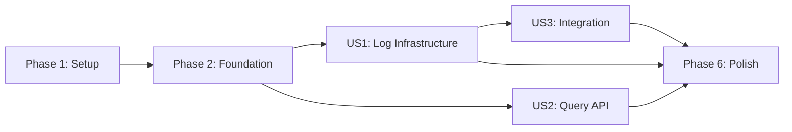

# Tasks: System Audit Logging (Backend)

**Input**: Design documents from `specs/001-audit-logging/`

**Prerequisites**: plan.md ✅, spec.md ✅, research.md ✅, data-model.md ✅, contracts/ ✅

**Tests**: Included — Constitution requires min 80% coverage for service logic and integration tests for API endpoints.

**Organization**: Tasks are grouped by user story to enable independent implementation and testing.

## Format: `[ID] [P?] [Story] Description`

- **[P]**: Can run in parallel (different files, no dependencies)
- **[Story]**: Which user story this task belongs to (US1, US2, US3)
- Include exact file paths in descriptions

## User Stories (from spec.md)

| Story | Title | Priority | Description |
|-------|-------|----------|-------------|
| US1 | Audit Log Infrastructure | P1 | Entity, enum, repository, service — core log creation mechanism |
| US2 | Audit Log Query API | P1 | REST endpoint with cursor-based pagination, filters, RBAC |
| US3 | Audit Log Integration | P1 | Wire audit logging into existing/future service operations |

---

## Phase 1: Setup (Shared Infrastructure)

**Purpose**: Project foundation — enum, entity update, utility

- [X] T001 [P] Create `AuditEntityType` enum in `backend/src/main/java/com/wms/enums/AuditEntityType.java`
- [X] T002 Update `AuditLog` entity with new fields (description, warehouse FK, NOT NULL constraints) in `backend/src/main/java/com/wms/entity/AuditLog.java`
- [X] T003 [P] Create `AuditLogUtil` utility class (sensitive field filter + diff builder) in `backend/src/main/java/com/wms/util/AuditLogUtil.java`

**Task details:**

### T001 — AuditEntityType enum
```java
// Values: RECEIPT, ISSUE, TRANSFER, ADJUSTMENT, STOCKTAKE,
// DELIVERY_ORDER, BATCH, INVENTORY, RETURN, SCRAP_DISPOSAL, TRIP
```

### T002 — Update AuditLog entity
- Add `@Column(name = "description", nullable = false) String description`
- Add `@ManyToOne(fetch = LAZY) @JoinColumn(name = "warehouse_id") Warehouse warehouse`
- Change `actor` FK to `nullable = false` (remove NULL allowance)
- Change `actorRole` to `nullable = false`
- Add proper `@Column` constraints matching updated schema
- Add getters/setters for all fields
- Use `@PrePersist` to set default timestamp if null

### T003 — AuditLogUtil
- `filterSensitiveFields(Map<String, Object>)` — removes password_hash, password, refreshToken, accessToken
- `buildDiff(Object oldEntity, Object newEntity)` — compares 2 objects, returns only changed field maps (old_value, new_value)
- `generateDescription(AuditAction, String entityType, String entityCode)` — returns "{ACTION} {ENTITY_TYPE} {ENTITY_CODE}"
- `SENSITIVE_FIELDS` constant set

---

## Phase 2: Foundational (Blocking Prerequisites)

**Purpose**: Repository layer — MUST be complete before service/controller can work

**⚠️ CRITICAL**: US1 and US2 both depend on this phase

- [X] T004 Create `AuditLogRepository` interface in `backend/src/main/java/com/wms/repository/AuditLogRepository.java`

**Task details:**

### T004 — AuditLogRepository
- Extends `JpaRepository<AuditLog, Long>`
- Custom query method for cursor-based pagination:
  ```java
  @Query("SELECT a FROM AuditLog a WHERE a.id < :cursor AND a.timestamp BETWEEN :start AND :end ORDER BY a.id DESC")
  List<AuditLog> findByCursorAndDateRange(Long cursor, OffsetDateTime start, OffsetDateTime end, Pageable pageable);
  ```
- First page query (no cursor):
  ```java
  @Query("SELECT a FROM AuditLog a WHERE a.timestamp BETWEEN :start AND :end ORDER BY a.id DESC")
  List<AuditLog> findByDateRange(OffsetDateTime start, OffsetDateTime end, Pageable pageable);
  ```
- Filter queries supporting: actorId, entityType, action, warehouseId combined with date range and cursor
- Use Spring Data JPA Specifications or `@Query` with optional parameters

**Checkpoint**: Repository layer ready — service layer can now be built

---

## Phase 3: User Story 1 — Audit Log Infrastructure (Priority: P1) 🎯 MVP

**Goal**: Core service to create audit log entries programmatically. Other services can call `AuditLogService.log()` to record operations.

**Independent Test**: Call `AuditLogService.log()` with test data → verify AuditLog entry is persisted correctly in DB with auto-generated description and filtered sensitive fields.

### Tests for User Story 1

- [X] T005 [P] [US1] Create unit tests for `AuditLogUtil` in `backend/src/test/java/com/wms/util/AuditLogUtilTest.java`
- [X] T006 [P] [US1] Create unit tests for `AuditLogService.log()` in `backend/src/test/java/com/wms/service/AuditLogServiceTest.java`

**Test details:**

### T005 — AuditLogUtilTest
- `testFilterSensitiveFields_removesPasswordHash()`
- `testFilterSensitiveFields_keepsNonSensitiveFields()`
- `testBuildDiff_returnsOnlyChangedFields()`
- `testBuildDiff_returnsNullOldValueForCreate()`
- `testGenerateDescription_formatsCorrectly()`

### T006 — AuditLogServiceTest (mock repository)
- `testLog_createsEntryWithCorrectFields()`
- `testLog_autoGeneratesDescription()`
- `testLog_filtersSensitiveFieldsFromOldValue()`
- `testLog_filtersSensitiveFieldsFromNewValue()`
- `testLog_setsActorFromSecurityContext()`
- `testLog_setsIpAddressFromRequest()`
- `testLog_handlesNullWarehouseId()`

### Implementation for User Story 1

- [X] T007 [US1] Create `AuditLogService` in `backend/src/main/java/com/wms/service/AuditLogService.java`

**Task details:**

### T007 — AuditLogService
- Constructor injection: `AuditLogRepository`, `HttpServletRequest`
- `log(AuditAction action, String entityType, Long entityId, String entityCode, Long warehouseId, Map<String, Object> oldValue, Map<String, Object> newValue)`:
  1. Get current user + role from `SecurityContextHolder`
  2. Get IP from `HttpServletRequest`
  3. Call `AuditLogUtil.filterSensitiveFields()` on oldValue and newValue
  4. Call `AuditLogUtil.generateDescription()`
  5. Build `AuditLog` entity
  6. Convert Maps to JSON strings (Jackson ObjectMapper)
  7. `repository.save(auditLog)`
- No `update()` or `delete()` methods — immutable

**Checkpoint**: `AuditLogService.log()` works. Other services can now call it to record audit entries.

---

## Phase 4: User Story 2 — Audit Log Query API (Priority: P1)

**Goal**: REST endpoint `GET /api/v1/audit-logs` with cursor-based pagination, date range defaults, multi-field filters, and RBAC access control.

**Independent Test**: Call `GET /api/v1/audit-logs` with JWT token → verify paginated response with correct DTO structure, filters work, and RBAC restricts warehouse managers.

### Tests for User Story 2

- [X] T008 [P] [US2] Create integration tests for `AuditLogController` in `backend/src/test/java/com/wms/controller/AuditLogControllerTest.java`

**Test details:**

### T008 — AuditLogControllerTest
- `testGetAuditLogs_returnsPagedResponse()` — verify cursor-based pagination structure
- `testGetAuditLogs_defaultDateRange_last7Days()` — no date params → last 7 days
- `testGetAuditLogs_endDateIncludesFullDay()` — endDate converted to 23:59:59
- `testGetAuditLogs_filterByEntityType()`
- `testGetAuditLogs_filterByAction()`
- `testGetAuditLogs_filterByActorId()`
- `testGetAuditLogs_filterByWarehouseId()`
- `testGetAuditLogs_cursorPagination_nextPage()`
- `testGetAuditLogs_rbac_adminSeesAll()`
- `testGetAuditLogs_rbac_warehouseManagerSeesOwnWarehouse()`
- `testGetAuditLogs_rbac_accountantSeesAll()`
- `testGetAuditLogs_rbac_storekeeperForbidden()` — 403

### Implementation for User Story 2

- [X] T009 [P] [US2] Create `AuditLogResponse` DTO in `backend/src/main/java/com/wms/dto/AuditLogResponse.java`
- [X] T010 [P] [US2] Create `AuditLogPageResponse` DTO in `backend/src/main/java/com/wms/dto/AuditLogPageResponse.java`
- [X] T011 [US2] Add query methods to `AuditLogService` in `backend/src/main/java/com/wms/service/AuditLogService.java`
- [X] T012 [US2] Create `AuditLogController` in `backend/src/main/java/com/wms/controller/AuditLogController.java`

**Task details:**

### T009 — AuditLogResponse DTO
```java
// Fields: id, actorId, actorName, actorRole, action, entityType, entityId,
// description, warehouseId, oldValue (Map), newValue (Map), timestamp, ipAddress
```
- Static factory method `from(AuditLog entity)` that resolves `actorName` from `actor.getFullName()`
- Parse JSONB string → `Map<String, Object>` for oldValue/newValue

### T010 — AuditLogPageResponse DTO
```java
// Fields: data (List<AuditLogResponse>), nextCursor (Long), hasNext (boolean)
```

### T011 — AuditLogService query methods
- `getAuditLogs(Long cursor, int size, Long actorId, String entityType, String action, Long warehouseId, LocalDate startDate, LocalDate endDate, User currentUser)`:
  1. Apply defaults: startDate = today - 7, endDate = today, size = 30
  2. Convert endDate → `endDate.atTime(23, 59, 59)`
  3. Apply RBAC: if WAREHOUSE_MANAGER → force filter by assigned warehouse IDs
  4. Build query with optional filters
  5. Fetch `size + 1` records to determine `hasNext`
  6. Build `AuditLogPageResponse`

### T012 — AuditLogController
- `GET /api/v1/audit-logs`
- `@PreAuthorize("hasAnyRole('ADMIN', 'CEO', 'WAREHOUSE_MANAGER', 'ACCOUNTANT')")`
- Request params: cursor, size, actorId, entityType, action, warehouseId, startDate, endDate
- Swagger/OpenAPI annotations: `@Operation`, `@ApiResponse`, `@Parameter`
- Delegates to `AuditLogService.getAuditLogs()`

**Checkpoint**: Query API works end-to-end. Admin/CEO can browse all logs, warehouse manager sees only own warehouse.

---

## Phase 5: User Story 3 — Audit Log Integration (Priority: P1)

**Goal**: Demonstrate audit logging integration by wiring `AuditLogService.log()` calls into one example service flow.

**Independent Test**: Perform a warehouse operation (e.g., create/approve a receipt via API) → verify audit log entry is automatically created with correct diff.

### Implementation for User Story 3

- [X] T013 [US3] Create integration example: add audit log call to a sample service method in `backend/src/main/java/com/wms/service/` (to be applied to ReceiptService, TransferService, etc. when those features are implemented)
- [X] T014 [US3] Document audit logging integration pattern in `specs/001-audit-logging/integration-guide.md`

**Task details:**

### T013 — Integration example
- Create a helper/base method or document the pattern for calling `AuditLogService.log()`:
  ```java
  // In any service method that modifies a warehouse entity:
  Map<String, Object> oldValues = Map.of("status", oldStatus.name());
  Map<String, Object> newValues = Map.of("status", newStatus.name());
  auditLogService.log(AuditAction.APPROVE, "RECEIPT", receiptId, receiptCode, warehouseId, oldValues, newValues);
  ```
- For Transfer: show pattern for creating 2 entries (source + destination warehouse)

### T014 — Integration guide
- Document how to add audit logging to any new service
- List all entity_type values and when each action type is used
- Show Transfer dual-entry pattern
- Show diff-building pattern using `AuditLogUtil.buildDiff()`

**Checkpoint**: Full audit logging feature is functional and documented for integration into other features.

---

## Phase 6: Polish & Cross-Cutting Concerns

**Purpose**: Quality, documentation, and validation

- [X] T015 [P] Add Swagger/OpenAPI annotations to `AuditLogController` in `backend/src/main/java/com/wms/controller/AuditLogController.java`
- [X] T016 [P] Validate all tests pass and coverage ≥ 80% for `AuditLogService` — run `mvn test`
- [X] T017 Verify immutability: confirm no UPDATE/DELETE methods exist in repository, service, or controller
- [X] T018 Run quickstart.md validation — start backend, hit API, verify response format

---

## Dependencies & Execution Order

### Phase Dependencies

- **Setup (Phase 1)**: No dependencies — can start immediately
- **Foundational (Phase 2)**: Depends on T002 (entity) — BLOCKS all user stories
- **US1 (Phase 3)**: Depends on Phase 1 + Phase 2
- **US2 (Phase 4)**: Depends on Phase 1 + Phase 2 (independent of US1 for query, but US1 provides log creation)
- **US3 (Phase 5)**: Depends on US1 (needs AuditLogService.log() to exist)
- **Polish (Phase 6)**: Depends on all user stories complete

### User Story Dependencies



- **US1 (Log Infrastructure)**: Start after Phase 2 — no other story dependencies
- **US2 (Query API)**: Start after Phase 2 — can proceed in parallel with US1
- **US3 (Integration)**: Depends on US1 completion (needs AuditLogService.log())

### Within Each User Story

- Tests written FIRST → ensure they FAIL
- Entity/DTOs before services
- Services before controllers
- Core implementation before integration

### Parallel Opportunities

- **Phase 1**: T001 ∥ T003 (different files). T002 is separate (entity modification)
- **Phase 2**: T004 alone (single repository file)
- **US1**: T005 ∥ T006 (test files), then T007 (service)
- **US2**: T009 ∥ T010 (DTO files), then T011 → T012 (service → controller)
- **US1 ∥ US2**: Can be worked in parallel after Phase 2
- **Phase 6**: T015 ∥ T016 (docs ∥ tests)

---

## Parallel Example: User Story 2 (Query API)

```bash
# Step 1: Create DTOs in parallel
Task: "T009 Create AuditLogResponse DTO in backend/.../dto/AuditLogResponse.java"
Task: "T010 Create AuditLogPageResponse DTO in backend/.../dto/AuditLogPageResponse.java"

# Step 2: Service (depends on DTOs)
Task: "T011 Add query methods to AuditLogService"

# Step 3: Controller (depends on service)
Task: "T012 Create AuditLogController"
```

---

## Implementation Strategy

### MVP First (US1 Only)

1. Complete Phase 1: Setup (T001-T003)
2. Complete Phase 2: Foundation (T004)
3. Complete Phase 3: US1 — Log Infrastructure (T005-T007)
4. **STOP and VALIDATE**: `AuditLogService.log()` works with unit tests
5. Other services can start using audit logging immediately

### Incremental Delivery

1. Setup + Foundation → Infrastructure ready
2. Add US1 → Test independently → **AuditLogService.log() available** (MVP!)
3. Add US2 → Test independently → **Query API available**
4. Add US3 → Integration guide documented → **Ready for other features to integrate**
5. Each story adds value without breaking previous stories

### Parallel Team Strategy

With multiple developers:

1. Team completes Setup + Foundation together
2. Once Foundation is done:
   - Developer A: US1 (Log Infrastructure)
   - Developer B: US2 (Query API — DTOs + controller can be built while US1 builds service)
3. US3 starts when US1 is complete

---

## Notes

- [P] tasks = different files, no dependencies
- [Story] label maps task to specific user story for traceability
- Each user story is independently completable and testable
- Verify tests fail before implementing
- Commit after each task or logical group
- Stop at any checkpoint to validate story independently
- **Total tasks: 18** | US1: 3 tasks + 2 tests | US2: 4 tasks + 1 test | US3: 2 tasks | Setup: 3 | Foundation: 1 | Polish: 4
